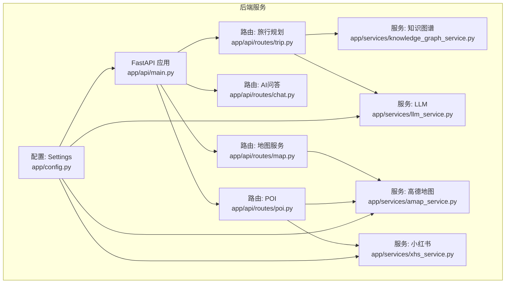
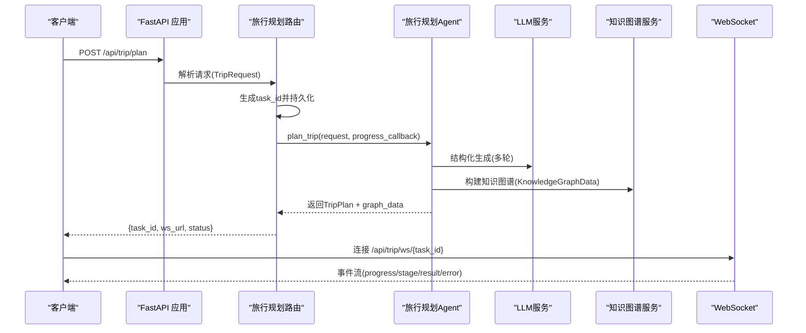
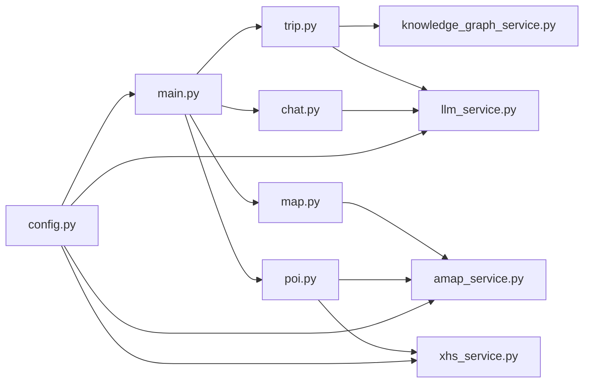

# API 接口文档

<cite>
**本文档引用的文件**
- [backend/app/api/main.py](file://backend/app/api/main.py)
- [backend/app/api/routes/trip.py](file://backend/app/api/routes/trip.py)
- [backend/app/api/routes/chat.py](file://backend/app/api/routes/chat.py)
- [backend/app/api/routes/map.py](file://backend/app/api/routes/map.py)
- [backend/app/api/routes/poi.py](file://backend/app/api/routes/poi.py)
- [backend/app/models/schemas.py](file://backend/app/models/schemas.py)
- [backend/app/services/amap_service.py](file://backend/app/services/amap_service.py)
- [backend/app/services/xhs_service.py](file://backend/app/services/xhs_service.py)
- [backend/app/services/knowledge_graph_service.py](file://backend/app/services/knowledge_graph_service.py)
- [backend/app/services/llm_service.py](file://backend/app/services/llm_service.py)
- [backend/app/config.py](file://backend/app/config.py)
- [docker-compose.yaml](file://docker-compose.yaml)
- [start.sh](file://start.sh)
- [README.md](file://README.md)
</cite>

## 目录
1. [简介](#简介)
2. [项目结构](#项目结构)
3. [核心组件](#核心组件)
4. [架构总览](#架构总览)
5. [详细组件分析](#详细组件分析)
6. [依赖关系分析](#依赖关系分析)
7. [性能考量](#性能考量)
8. [故障排查指南](#故障排查指南)
9. [结论](#结论)
10. [附录](#附录)

## 简介
本文件为 TripStar 项目的完整 API 接口文档，涵盖旅行规划、小红书服务、地图服务、聊天问答等接口。文档面向开发者与测试人员，提供接口规范、请求/响应示例、错误码、认证与限流策略、WebSocket 实时通信机制、接口测试方法与工具等。

## 项目结构
后端采用 FastAPI + HelloAgents 框架，核心模块包括：
- 路由层：/api/trip、/api/chat、/api/map、/api/poi、/api/settings
- 服务层：高德地图服务、小红书服务、LLM 服务、知识图谱服务
- 模型层：Pydantic 数据模型与响应结构
- 配置层：运行时配置与环境变量管理

**图表来源**
- [backend/app/api/main.py:25-60](file://backend/app/api/main.py#L25-L60)
- [backend/app/api/routes/trip.py:17-17](file://backend/app/api/routes/trip.py#L17-L17)
- [backend/app/api/routes/chat.py:7-7](file://backend/app/api/routes/chat.py#L7-L7)
- [backend/app/api/routes/map.py:14-14](file://backend/app/api/routes/map.py#L14-L14)
- [backend/app/api/routes/poi.py:8-8](file://backend/app/api/routes/poi.py#L8-L8)
- [backend/app/services/amap_service.py:50-56](file://backend/app/services/amap_service.py#L50-L56)
- [backend/app/services/xhs_service.py:68-78](file://backend/app/services/xhs_service.py#L68-L78)
- [backend/app/services/llm_service.py:12-19](file://backend/app/services/llm_service.py#L12-L19)
- [backend/app/services/knowledge_graph_service.py:34-44](file://backend/app/services/knowledge_graph_service.py#L34-L44)
- [backend/app/config.py:21-67](file://backend/app/config.py#L21-L67)

**章节来源**
- [backend/app/api/main.py:14-60](file://backend/app/api/main.py#L14-L60)
- [README.md:43-97](file://README.md#L43-L97)

## 核心组件
- FastAPI 应用与中间件：CORS、路径代理修正、静态资源挂载、健康检查
- 路由注册：统一前缀 /api，包含旅行规划、地图、POI、聊天、设置
- 配置系统：运行时配置持久化与环境变量同步，支持 Docker 部署
- 服务封装：高德地图 MCP 工具、小红书原生签名客户端、LLM 单例、知识图谱构建

**章节来源**
- [backend/app/api/main.py:14-147](file://backend/app/api/main.py#L14-L147)
- [backend/app/config.py:70-160](file://backend/app/config.py#L70-L160)
- [backend/app/services/amap_service.py:12-47](file://backend/app/services/amap_service.py#L12-L47)
- [backend/app/services/xhs_service.py:192-198](file://backend/app/services/xhs_service.py#L192-L198)
- [backend/app/services/llm_service.py:12-67](file://backend/app/services/llm_service.py#L12-L67)
- [backend/app/services/knowledge_graph_service.py:34-169](file://backend/app/services/knowledge_graph_service.py#L34-L169)

## 架构总览

**图表来源**
- [backend/app/api/routes/trip.py:276-312](file://backend/app/api/routes/trip.py#L276-L312)
- [backend/app/api/routes/trip.py:390-440](file://backend/app/api/routes/trip.py#L390-L440)
- [backend/app/models/schemas.py:188-195](file://backend/app/models/schemas.py#L188-L195)
- [backend/app/services/knowledge_graph_service.py:34-169](file://backend/app/services/knowledge_graph_service.py#L34-L169)
- [backend/app/services/llm_service.py:12-67](file://backend/app/services/llm_service.py#L12-L67)

## 详细组件分析

### 旅行规划接口
- 接口列表
  - POST /api/trip/plan：提交旅行规划任务，立即返回 task_id 与 ws_url
  - GET /api/trip/status/{task_id}：轮询任务状态（兼容旧客户端）
  - GET /api/trip/history：最近历史计划摘要
  - GET /api/trip/health：健康检查
  - WebSocket /api/trip/ws/{task_id}：订阅任务事件流

- 请求与响应
  - 请求模型：TripRequest（城市、起止日期、天数、交通、住宿偏好、偏好标签、自由输入）
  - 响应模型：TripPlanResponse（success、message、plan_id、data、graph_data）

- 任务状态机
  - submitted → initializing → graph_building → completed 或 failed
  - 进度百分比与阶段消息实时推送
  - 服务重启后未完成任务标记失败，避免前端无限等待

- WebSocket 事件
  - 字段：task_id、plan_id、status、stage、progress、message、error、result
  - 订阅者断开后清理队列，最终关闭连接

- 示例
  - 提交任务：POST /api/trip/plan
  - 轮询状态：GET /api/trip/status/{task_id}
  - 实时订阅：连接 /api/trip/ws/{task_id}

- 错误处理
  - 小红书 Cookie 过期：抛出特定异常并返回前端友好提示
  - 服务不可用：HTTP 503

**章节来源**
- [backend/app/api/routes/trip.py:276-511](file://backend/app/api/routes/trip.py#L276-L511)
- [backend/app/models/schemas.py:10-34](file://backend/app/models/schemas.py#L10-L34)
- [backend/app/models/schemas.py:188-195](file://backend/app/models/schemas.py#L188-L195)
- [backend/app/services/xhs_service.py:22-24](file://backend/app/services/xhs_service.py#L22-L24)

### 小红书服务接口
- 接口列表
  - GET /api/poi/detail/{poi_id}：获取 POI 详情（含图片）
  - GET /api/poi/search：POI 搜索
  - GET /api/poi/photo：根据景点名称从小红书获取图片（兜底为空）

- 关键实现
  - 原生小红书客户端：直连 edith.xiaohongshu.com，使用本地 JS 签名绕过风控
  - Cookie 兼容：支持字符串与 JSON 列表格式
  - 景点搜图：优先取笔记首图，降级到 SSR 抓取
  - 景点搜索：结合 LLM 提纯游记，补全经纬度与图片

- 示例
  - 获取 POI 详情：GET /api/poi/detail/{poi_id}
  - 搜索 POI：GET /api/poi/search?keywords=故宫&city=北京
  - 景点图片：GET /api/poi/photo?name=故宫

- 错误处理
  - Cookie 过期：抛出致命异常，前端需提示更换 Cookie
  - 网络超时/风控拦截：抛出 Cookie 过期异常

**章节来源**
- [backend/app/api/routes/poi.py:18-133](file://backend/app/api/routes/poi.py#L18-L133)
- [backend/app/services/xhs_service.py:68-444](file://backend/app/services/xhs_service.py#L68-L444)

### 地图服务接口
- 接口列表
  - GET /api/map/poi：POI 搜索
  - GET /api/map/weather：天气查询
  - POST /api/map/route：路线规划
  - GET /api/map/health：健康检查

- 请求与响应
  - POI 搜索：POISearchRequest → POISearchResponse
  - 天气：WeatherResponse（列表）
  - 路线：RouteRequest → RouteResponse

- 服务实现
  - 高德 MCP 工具封装：统一调用 maps_text_search、maps_weather、路线工具
  - 参数映射：route_type 映射到不同工具名
  - POI 详情：返回原始 JSON 或兜底结构

- 示例
  - POI 搜索：GET /api/map/poi?keywords=故宫&city=北京&citylimit=true
  - 天气：GET /api/map/weather?city=北京
  - 路线：POST /api/map/route（请求体见 RouteRequest）

- 错误处理
  - 服务不可用：HTTP 503

**章节来源**
- [backend/app/api/routes/map.py:17-164](file://backend/app/api/routes/map.py#L17-L164)
- [backend/app/models/schemas.py:36-50](file://backend/app/models/schemas.py#L36-L50)
- [backend/app/models/schemas.py:207-227](file://backend/app/models/schemas.py#L207-L227)
- [backend/app/models/schemas.py:229-234](file://backend/app/models/schemas.py#L229-L234)
- [backend/app/services/amap_service.py:50-276](file://backend/app/services/amap_service.py#L50-L276)

### 聊天问答接口
- 接口列表
  - POST /api/chat/ask：基于旅行计划上下文的智能问答

- 请求与响应
  - 请求：TripChatRequest（message、trip_plan、history）
  - 响应：TripChatResponse（success、reply）

- 实现要点
  - 将历史对话转换为字典列表传入服务
  - 异常捕获并返回 HTTP 500

- 示例
  - POST /api/chat/ask（请求体见 TripChatRequest）

**章节来源**
- [backend/app/api/routes/chat.py:10-53](file://backend/app/api/routes/chat.py#L10-L53)
- [backend/app/models/schemas.py:253-264](file://backend/app/models/schemas.py#L253-L264)

### 设置与健康检查
- 接口列表
  - GET /api/trip/health：旅行规划服务健康检查
  - GET /api/map/health：地图服务健康检查
  - GET /health：应用健康检查

- 响应
  - 服务可用返回健康状态与工具计数
  - 不可用返回 HTTP 503

**章节来源**
- [backend/app/api/routes/trip.py:491-508](file://backend/app/api/routes/trip.py#L491-L508)
- [backend/app/api/routes/map.py:142-163](file://backend/app/api/routes/map.py#L142-L163)
- [backend/app/api/main.py:112-119](file://backend/app/api/main.py#L112-L119)

## 依赖关系分析

**图表来源**
- [backend/app/api/routes/trip.py:13-15](file://backend/app/api/routes/trip.py#L13-L15)
- [backend/app/services/knowledge_graph_service.py:7-7](file://backend/app/services/knowledge_graph_service.py#L7-L7)
- [backend/app/services/llm_service.py:5-6](file://backend/app/services/llm_service.py#L5-L6)
- [backend/app/api/routes/chat.py:4-5](file://backend/app/api/routes/chat.py#L4-L5)
- [backend/app/api/routes/map.py:12-12](file://backend/app/api/routes/map.py#L12-L12)
- [backend/app/services/amap_service.py:4-6](file://backend/app/services/amap_service.py#L4-L6)
- [backend/app/api/routes/poi.py:6-6](file://backend/app/api/routes/poi.py#L6-L6)
- [backend/app/services/xhs_service.py:15-17](file://backend/app/services/xhs_service.py#L15-L17)
- [backend/app/api/main.py:18-19](file://backend/app/api/main.py#L18-L19)
- [backend/app/config.py:70-72](file://backend/app/config.py#L70-L72)

**章节来源**
- [backend/app/api/main.py:18-60](file://backend/app/api/main.py#L18-L60)
- [backend/app/api/routes/trip.py:13-15](file://backend/app/api/routes/trip.py#L13-L15)
- [backend/app/api/routes/chat.py:4-5](file://backend/app/api/routes/chat.py#L4-L5)
- [backend/app/api/routes/map.py:12-12](file://backend/app/api/routes/map.py#L12-L12)
- [backend/app/api/routes/poi.py:6-6](file://backend/app/api/routes/poi.py#L6-L6)
- [backend/app/services/amap_service.py:4-6](file://backend/app/services/amap_service.py#L4-L6)
- [backend/app/services/xhs_service.py:15-17](file://backend/app/services/xhs_service.py#L15-L17)
- [backend/app/services/llm_service.py:5-6](file://backend/app/services/llm_service.py#L5-L6)
- [backend/app/services/knowledge_graph_service.py:7-7](file://backend/app/services/knowledge_graph_service.py#L7-L7)
- [backend/app/config.py:70-72](file://backend/app/config.py#L70-L72)

## 性能考量
- 异步任务与轮询
  - 旅行规划任务通过 asyncio.create_task 异步执行，前端轮询 /api/trip/status/{task_id} 获取进度
  - WebSocket 实时订阅，避免频繁轮询带来的压力

- 服务超时与并发
  - LLM 客户端默认超时可配置（环境变量 LLM_TIMEOUT）
  - 高德 MCP 工具调用超时控制（服务内部设置）

- 缓存与持久化
  - 旅行任务状态持久化到本地 JSON 文件，服务重启后可恢复历史任务（仅内存）
  - 知识图谱构建为纯内存计算，结果随响应返回

- 部署与绑定
  - Docker 默认端口 7860，可通过环境变量 HOST/PORT 调整
  - gunicorn + uvicorn workers，超时设置为 600 秒

**章节来源**
- [backend/app/api/routes/trip.py:304-387](file://backend/app/api/routes/trip.py#L304-L387)
- [backend/app/api/routes/trip.py:455-488](file://backend/app/api/routes/trip.py#L455-L488)
- [backend/app/services/llm_service.py:42-61](file://backend/app/services/llm_service.py#L42-L61)
- [start.sh:13-19](file://start.sh#L13-L19)
- [docker-compose.yaml:13-21](file://docker-compose.yaml#L13-L21)

## 故障排查指南
- 配置问题
  - 高德地图 Web Key 未配置：POI 搜索、地理编码等功能不可用
  - LLM API Key 未配置：AI 生成与问答不可用
  - 小红书 Cookie 未配置或过期：小红书相关接口失败

- 常见错误码
  - 404：任务不存在（/api/trip/status/{task_id}）
  - 500：服务内部异常（POI 搜索、天气查询、路线规划、问答）
  - 503：服务不可用（健康检查失败）

- WebSocket 连接
  - 断开码 1008：任务不存在
  - 任务完成后自动关闭连接

- 日志与调试
  - 启动时打印配置信息与工具数量
  - 服务端异常堆栈输出便于定位

**章节来源**
- [backend/app/config.py:163-179](file://backend/app/config.py#L163-L179)
- [backend/app/api/routes/trip.py:463-464](file://backend/app/api/routes/trip.py#L463-L464)
- [backend/app/api/routes/trip.py:395-408](file://backend/app/api/routes/trip.py#L395-L408)
- [backend/app/api/main.py:63-85](file://backend/app/api/main.py#L63-L85)

## 结论
本项目通过异步任务与 WebSocket 实时通信，结合多智能体与 LLM 能力，提供了完整的旅行规划与周边服务能力。接口设计清晰、错误处理完备，并具备良好的扩展性。建议在生产环境中完善限流与缓存策略，同时持续监控第三方服务稳定性。

## 附录

### 接口清单与规范

- 旅行规划
  - POST /api/trip/plan
    - 请求体：TripRequest
    - 响应体：包含 task_id、ws_url、status
    - 认证：无需
    - 示例：见“提交任务”示例
  - GET /api/trip/status/{task_id}
    - 查询参数：无
    - 响应体：processing/completed/failed 三态之一
    - 认证：无需
  - GET /api/trip/history
    - 查询参数：limit（1-50）
    - 响应体：items（历史摘要列表）
    - 认证：无需
  - GET /api/trip/health
    - 响应体：健康状态与工具计数
    - 认证：无需
  - WebSocket /api/trip/ws/{task_id}
    - 事件：progress、stage、message、result、error
    - 认证：无需

- 小红书服务
  - GET /api/poi/detail/{poi_id}
    - 响应体：POI 详情
    - 认证：无需
  - GET /api/poi/search
    - 查询参数：keywords、city
    - 响应体：POI 列表
    - 认证：无需
  - GET /api/poi/photo
    - 查询参数：name、city
    - 响应体：图片 URL（可能为空）
    - 认证：无需

- 地图服务
  - GET /api/map/poi
    - 查询参数：keywords、city、citylimit
    - 响应体：POISearchResponse
    - 认证：无需
  - GET /api/map/weather
    - 查询参数：city
    - 响应体：WeatherResponse
    - 认证：无需
  - POST /api/map/route
    - 请求体：RouteRequest
    - 响应体：RouteResponse
    - 认证：无需
  - GET /api/map/health
    - 响应体：健康状态
    - 认证：无需

- 聊天问答
  - POST /api/chat/ask
    - 请求体：TripChatRequest
    - 响应体：TripChatResponse
    - 认证：无需

- 健康检查
  - GET /health
    - 响应体：服务状态
    - 认证：无需

**章节来源**
- [backend/app/api/routes/trip.py:276-511](file://backend/app/api/routes/trip.py#L276-L511)
- [backend/app/api/routes/poi.py:18-133](file://backend/app/api/routes/poi.py#L18-L133)
- [backend/app/api/routes/map.py:17-164](file://backend/app/api/routes/map.py#L17-L164)
- [backend/app/api/routes/chat.py:10-53](file://backend/app/api/routes/chat.py#L10-L53)
- [backend/app/api/main.py:112-119](file://backend/app/api/main.py#L112-L119)

### 认证与请求头
- 当前版本接口未实现鉴权机制，无需 Authorization 头
- CORS 已配置，允许前端开发与生产域名访问
- 建议在生产环境启用 JWT 或 API Key 认证

**章节来源**
- [backend/app/api/main.py:46-53](file://backend/app/api/main.py#L46-L53)
- [backend/app/config.py:34-67](file://backend/app/config.py#L34-L67)

### 参数验证规则
- TripRequest
  - travel_days：1-30
  - 日期格式：YYYY-MM-DD
- POISearchRequest
  - citylimit：布尔值
- RouteRequest
  - route_type：walking/driving/transit
- ChatMessage
  - role：user/assistant

**章节来源**
- [backend/app/models/schemas.py:10-34](file://backend/app/models/schemas.py#L10-L34)
- [backend/app/models/schemas.py:36-50](file://backend/app/models/schemas.py#L36-L50)
- [backend/app/models/schemas.py:247-251](file://backend/app/models/schemas.py#L247-L251)

### 错误码对照
- 404：任务不存在
- 500：服务内部异常
- 503：服务不可用

**章节来源**
- [backend/app/api/routes/trip.py:463-464](file://backend/app/api/routes/trip.py#L463-L464)
- [backend/app/api/routes/map.py:52-57](file://backend/app/api/routes/map.py#L52-L57)
- [backend/app/api/routes/map.py:91-96](file://backend/app/api/routes/map.py#L91-L96)
- [backend/app/api/routes/map.py:134-139](file://backend/app/api/routes/map.py#L134-L139)
- [backend/app/api/routes/chat.py:49-52](file://backend/app/api/routes/chat.py#L49-L52)

### WebSocket 事件格式
- 字段：task_id、plan_id、status、stage、progress、message、error、result
- 事件类型：进度更新、阶段推进、最终结果、失败告警

**章节来源**
- [backend/app/api/routes/trip.py:207-224](file://backend/app/api/routes/trip.py#L207-L224)
- [backend/app/api/routes/trip.py:390-440](file://backend/app/api/routes/trip.py#L390-L440)

### 接口测试方法与工具
- Swagger UI：http://localhost:8000/docs
- ReDoc：http://localhost:8000/redoc
- curl 示例
  - 提交任务：curl -X POST "http://localhost:8000/api/trip/plan" -H "Content-Type: application/json" -d '{...}'
  - 轮询状态：curl "http://localhost:8000/api/trip/status/{task_id}"
  - POI 搜索：curl "http://localhost:8000/api/map/poi?keywords=故宫&city=北京"
  - 天气：curl "http://localhost:8000/api/map/weather?city=北京"
  - 路线：curl -X POST "http://localhost:8000/api/map/route" -H "Content-Type: application/json" -d '{...}'
  - POI 详情：curl "http://localhost:8000/api/poi/detail/{poi_id}"
  - 景点图片：curl "http://localhost:8000/api/poi/photo?name=故宫"
  - 问答：curl -X POST "http://localhost:8000/api/chat/ask" -H "Content-Type: application/json" -d '{...}'
  - 健康检查：curl "http://localhost:8000/api/trip/health"、curl "http://localhost:8000/api/map/health"、curl "http://localhost:8000/health"

**章节来源**
- [backend/app/api/main.py:29-31](file://backend/app/api/main.py#L29-L31)
- [backend/app/api/main.py:83-84](file://backend/app/api/main.py#L83-L84)
- [README.md:177-181](file://README.md#L177-L181)

### 部署与环境变量
- Docker 端口：7860（可调整）
- 关键环境变量
  - LLM_API_KEY、LLM_BASE_URL、LLM_MODEL_ID、LLM_TIMEOUT
  - VITE_AMAP_WEB_KEY、VITE_AMAP_WEB_JS_KEY
  - XHS_COOKIE
  - HOST、PORT、LOG_LEVEL

**章节来源**
- [docker-compose.yaml:13-21](file://docker-compose.yaml#L13-L21)
- [start.sh:6-19](file://start.sh#L6-L19)
- [backend/app/config.py:24-56](file://backend/app/config.py#L24-L56)