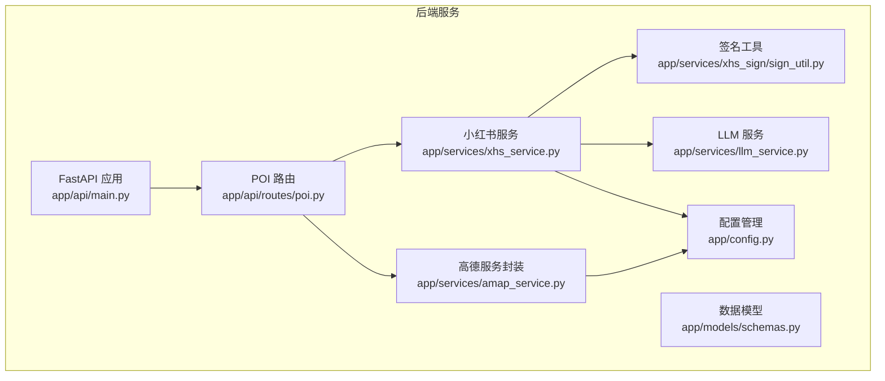
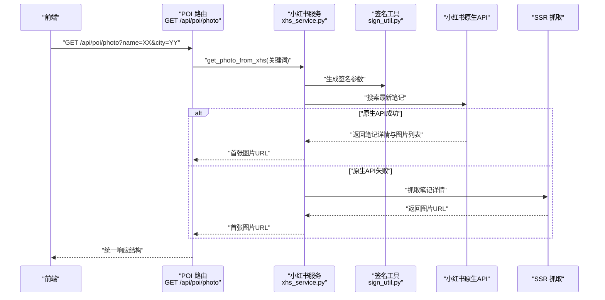
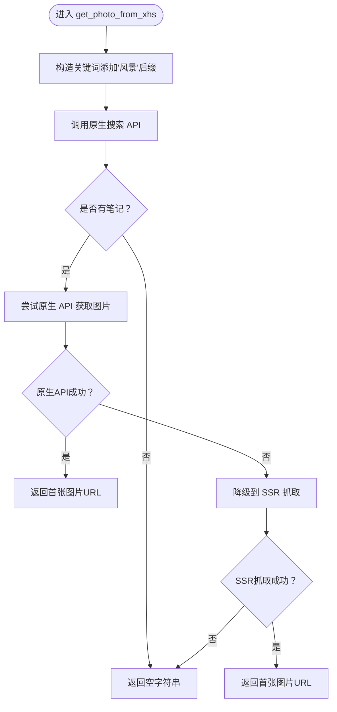
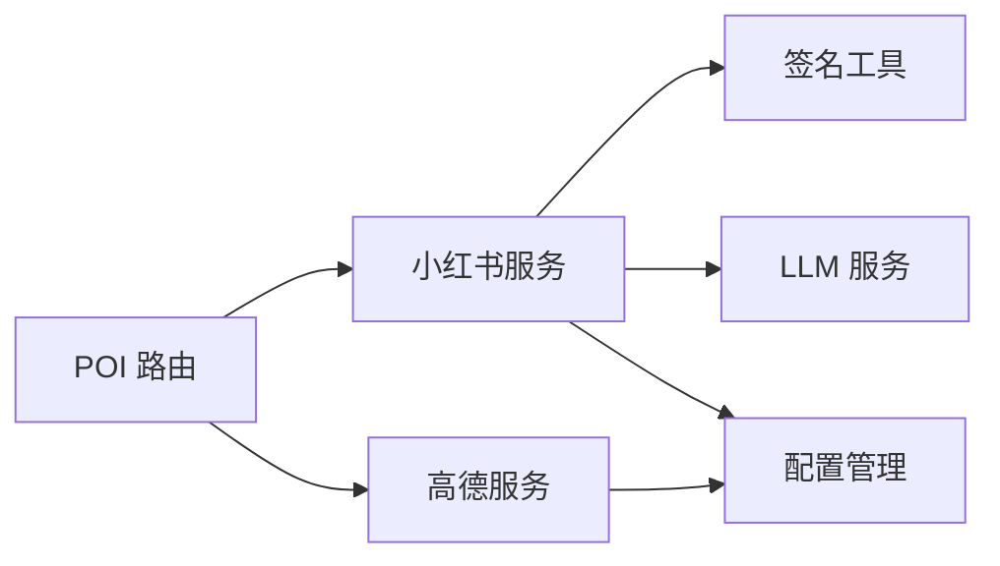

# POI 服务接口

<cite>
**本文引用的文件**
- [backend/app/api/routes/poi.py](file://backend/app/api/routes/poi.py)
- [backend/app/services/xhs_service.py](file://backend/app/services/xhs_service.py)
- [backend/app/services/amap_service.py](file://backend/app/services/amap_service.py)
- [backend/app/services/llm_service.py](file://backend/app/services/llm_service.py)
- [backend/app/services/xhs_sign/sign_util.py](file://backend/app/services/xhs_sign/sign_util.py)
- [backend/app/config.py](file://backend/app/config.py)
- [backend/app/models/schemas.py](file://backend/app/models/schemas.py)
- [backend/app/api/main.py](file://backend/app/api/main.py)
- [README.md](file://README.md)
</cite>

## 目录
1. [简介](#简介)
2. [项目结构](#项目结构)
3. [核心组件](#核心组件)
4. [架构总览](#架构总览)
5. [详细组件分析](#详细组件分析)
6. [依赖关系分析](#依赖关系分析)
7. [性能考量](#性能考量)
8. [故障排查指南](#故障排查指南)
9. [结论](#结论)
10. [附录](#附录)

## 简介
本文件为 POI（兴趣点）服务接口的完整 API 文档，重点围绕小红书图片搜索接口 GET /api/poi/photo 的使用方法进行说明。该接口用于根据“景点名称”（可选“所在城市”）从小红书搜索并返回一张“真实风景”图片链接，供前端在行程卡片中展示。文档涵盖请求参数、响应格式、图片元数据结构、调用频率限制、错误处理机制、缓存策略、请求与响应示例、性能特征、最佳实践、常见问题与解决方案，以及与其他服务的集成与数据流转过程。

## 项目结构
后端采用 FastAPI + Python 实现，POI 相关路由集中在 backend/app/api/routes/poi.py，图片搜索逻辑位于 backend/app/services/xhs_service.py，高德地图 POI 查询封装在 backend/app/services/amap_service.py，小红书签名与请求头生成在 backend/app/services/xhs_sign/sign_util.py，配置管理在 backend/app/config.py，数据模型在 backend/app/models/schemas.py，应用入口在 backend/app/api/main.py。

图表来源
- [backend/app/api/main.py:1-147](file://backend/app/api/main.py#L1-L147)
- [backend/app/api/routes/poi.py:1-133](file://backend/app/api/routes/poi.py#L1-L133)
- [backend/app/services/xhs_service.py:1-444](file://backend/app/services/xhs_service.py#L1-L444)
- [backend/app/services/amap_service.py:1-276](file://backend/app/services/amap_service.py#L1-L276)
- [backend/app/services/llm_service.py:1-75](file://backend/app/services/llm_service.py#L1-L75)
- [backend/app/services/xhs_sign/sign_util.py:1-149](file://backend/app/services/xhs_sign/sign_util.py#L1-L149)
- [backend/app/config.py:1-202](file://backend/app/config.py#L1-L202)
- [backend/app/models/schemas.py:1-264](file://backend/app/models/schemas.py#L1-L264)

章节来源
- [backend/app/api/main.py:1-147](file://backend/app/api/main.py#L1-L147)
- [backend/app/api/routes/poi.py:1-133](file://backend/app/api/routes/poi.py#L1-L133)

## 核心组件
- POI 路由层：提供 GET /api/poi/photo，接收 name（必填）与 city（可选）参数，返回统一结构的响应。
- 小红书服务层：负责小红书搜索、笔记详情获取、图片提取、SSR 降级抓取、签名参数生成与请求头注入。
- 高德服务层：提供 POI 搜索、详情、地理编码等能力（当前 POI 图片接口不直接使用）。
- 配置与模型：集中管理运行时配置（如小红书 Cookie、高德 Key、LLM Key），定义统一响应模型。
- 签名工具：基于本地 JS 引擎生成 x-s、x-t、x-s-common、x-b3-traceid 等请求头，规避风控拦截。

章节来源
- [backend/app/api/routes/poi.py:88-133](file://backend/app/api/routes/poi.py#L88-L133)
- [backend/app/services/xhs_service.py:356-444](file://backend/app/services/xhs_service.py#L356-L444)
- [backend/app/services/amap_service.py:50-276](file://backend/app/services/amap_service.py#L50-L276)
- [backend/app/config.py:21-202](file://backend/app/config.py#L21-L202)
- [backend/app/models/schemas.py:52-264](file://backend/app/models/schemas.py#L52-L264)
- [backend/app/services/xhs_sign/sign_util.py:1-149](file://backend/app/services/xhs_sign/sign_util.py#L1-L149)

## 架构总览
小红书图片搜索接口的数据流如下：
- 前端调用 GET /api/poi/photo?name=XX&city=YY
- 后端路由解析参数，构造关键词（强制“风景”后缀），调用小红书服务
- 小红书服务通过原生签名客户端搜索最新笔记，提取首张图片 URL
- 若原生 API 失败，降级到 SSR 抓取
- 返回统一响应结构，前端展示图片

图表来源
- [backend/app/api/routes/poi.py:88-133](file://backend/app/api/routes/poi.py#L88-L133)
- [backend/app/services/xhs_service.py:356-444](file://backend/app/services/xhs_service.py#L356-L444)
- [backend/app/services/xhs_sign/sign_util.py:107-139](file://backend/app/services/xhs_sign/sign_util.py#L107-L139)

## 详细组件分析

### 接口定义：GET /api/poi/photo
- 路径：/api/poi/photo
- 方法：GET
- 功能：根据景点名称（可选城市）从小红书搜索并返回一张真实风景图片链接
- 认证：无需认证
- CORS：由后端全局中间件配置允许跨域

请求参数
- name: 景点名称（必填）
- city: 所在城市（可选）

响应结构
- success: 布尔值，表示请求是否成功
- message: 字符串，简要描述
- data.name: 景点名称
- data.photo_url: 图片URL（若未找到则为空字符串）

错误处理
- 当内部异常发生时，返回 HTTP 500，并在 detail 中包含错误信息
- 当小红书 Cookie 未配置或失效时，抛出特定异常并提示更换 Cookie

请求示例
- GET /api/poi/photo?name=西湖
- GET /api/poi/photo?name=故宫&city=北京

响应示例
- 成功：{"success": true, "message": "获取图片成功", "data": {"name": "西湖", "photo_url": "https://example.com/photo.jpg"}}
- 失败：{"success": false, "message": "获取图片失败", "data": null}

章节来源
- [backend/app/api/routes/poi.py:88-133](file://backend/app/api/routes/poi.py#L88-L133)

### 小红书服务：图片搜索与降级流程
- 关键函数：get_photo_from_xhs(keyword)
- 流程要点：
  - 强制关键词包含“风景”，缩小搜索范围至真实风景图
  - 按“最新”排序，优先获取最新帖子
  - 优先通过原生 API 获取图片；失败则降级到 SSR 抓取
  - 返回首张图片 URL；若均失败，返回空字符串

图表来源
- [backend/app/services/xhs_service.py:440-444](file://backend/app/services/xhs_service.py#L440-L444)
- [backend/app/services/xhs_service.py:358-438](file://backend/app/services/xhs_service.py#L358-L438)

章节来源
- [backend/app/services/xhs_service.py:356-444](file://backend/app/services/xhs_service.py#L356-L444)

### 签名与请求头生成
- 使用本地 JS 引擎生成 x-s、x-t、x-s-common、x-b3-traceid、x-xray-traceid 等请求头
- 将 Cookie 字符串转换为字典并注入请求头
- 通过 requests 发送 POST 请求到小红书原生 API

章节来源
- [backend/app/services/xhs_sign/sign_util.py:1-149](file://backend/app/services/xhs_sign/sign_util.py#L1-L149)
- [backend/app/services/xhs_service.py:122-143](file://backend/app/services/xhs_service.py#L122-L143)

### 配置与运行时设置
- 小红书 Cookie：必须配置，否则抛出异常
- 高德地图 Key：用于地理编码等场景（当前图片接口不直接使用）
- LLM Key：用于结构化提取（当前图片接口不直接使用）

章节来源
- [backend/app/config.py:21-202](file://backend/app/config.py#L21-L202)
- [backend/app/services/xhs_service.py:192-198](file://backend/app/services/xhs_service.py#L192-L198)

### 数据模型与统一响应
- 统一响应结构：success、message、data
- 图片接口返回 data.name 与 data.photo_url
- 其他 POI 接口使用 schemas 中的模型（如 POIInfo、Location 等）

章节来源
- [backend/app/api/routes/poi.py:11-16](file://backend/app/api/routes/poi.py#L11-L16)
- [backend/app/models/schemas.py:52-264](file://backend/app/models/schemas.py#L52-L264)

## 依赖关系分析
- POI 路由依赖小红书服务与高德服务（当前图片接口仅使用小红书服务）
- 小红书服务依赖签名工具、LLM 服务（用于结构化提取，图片接口不直接使用）
- 配置模块为各服务提供运行时参数
- 应用入口注册路由并启用 CORS

图表来源
- [backend/app/api/routes/poi.py:1-133](file://backend/app/api/routes/poi.py#L1-L133)
- [backend/app/services/xhs_service.py:1-444](file://backend/app/services/xhs_service.py#L1-L444)
- [backend/app/services/amap_service.py:1-276](file://backend/app/services/amap_service.py#L1-L276)
- [backend/app/services/llm_service.py:1-75](file://backend/app/services/llm_service.py#L1-L75)
- [backend/app/services/xhs_sign/sign_util.py:1-149](file://backend/app/services/xhs_sign/sign_util.py#L1-L149)
- [backend/app/config.py:1-202](file://backend/app/config.py#L1-L202)

章节来源
- [backend/app/api/main.py:1-147](file://backend/app/api/main.py#L1-L147)

## 性能考量
- 异步执行：图片搜索通过线程池异步执行，避免阻塞事件循环
- 超时控制：小红书搜索与详情请求设置超时，SSR 抓取设置超时
- 降级策略：原生 API 失败时自动降级到 SSR 抓取，提升成功率
- 频率限制：当前代码未实现显式的速率限制或缓存策略，建议前端按需调用、后端结合业务场景引入缓存与限流

章节来源
- [backend/app/services/xhs_service.py:440-444](file://backend/app/services/xhs_service.py#L440-L444)
- [backend/app/services/xhs_service.py:125-131](file://backend/app/services/xhs_service.py#L125-L131)
- [backend/app/services/xhs_service.py:413-414](file://backend/app/services/xhs_service.py#L413-L414)

## 故障排查指南
- 小红书 Cookie 未配置或失效
  - 现象：抛出特定异常，提示更换 Cookie
  - 处理：在前端设置页配置有效 Cookie
- 小红书风控拦截
  - 现象：返回 code=300011 或异常信息
  - 处理：更换 Cookie 或降低请求频率
- 搜索无结果
  - 现象：返回空字符串
  - 处理：调整关键词（如加上“风景”），或稍后再试
- SSR 抓取失败
  - 现象：原生 API 失败后降级抓取仍失败
  - 处理：检查网络与小红书站点可用性

章节来源
- [backend/app/services/xhs_service.py:134-141](file://backend/app/services/xhs_service.py#L134-L141)
- [backend/app/services/xhs_service.py:290-296](file://backend/app/services/xhs_service.py#L290-L296)
- [backend/app/services/xhs_service.py:435-437](file://backend/app/services/xhs_service.py#L435-L437)

## 结论
GET /api/poi/photo 通过小红书原生 API 与 SSR 降级机制，为前端提供真实风景图片链接。接口设计简洁、响应统一，具备良好的容错能力。建议在生产环境中结合前端缓存与后端限流策略，以提升稳定性与用户体验。

## 附录

### 请求与响应示例
- 请求
  - GET /api/poi/photo?name=西湖
  - GET /api/poi/photo?name=故宫&city=北京
- 成功响应
  - {"success": true, "message": "获取图片成功", "data": {"name": "西湖", "photo_url": "https://example.com/photo.jpg"}}
- 失败响应
  - {"success": false, "message": "获取图片失败", "data": null}

章节来源
- [backend/app/api/routes/poi.py:88-133](file://backend/app/api/routes/poi.py#L88-L133)

### 图片质量、尺寸与来源说明
- 图片来源：小红书真实用户发布的风景照片
- 质量与尺寸：优先返回高清图（info_list 中的第二项），若不存在则按降级策略返回其他字段
- 属性说明：接口返回 photo_url，前端可据此展示图片；如需进一步的元数据（如宽高、格式），可在前端二次解析或扩展后端返回结构

章节来源
- [backend/app/services/xhs_service.py:394-404](file://backend/app/services/xhs_service.py#L394-L404)
- [backend/app/services/xhs_service.py:425-433](file://backend/app/services/xhs_service.py#L425-L433)

### 调用频率限制与缓存策略
- 当前实现未内置显式的速率限制或缓存
- 建议
  - 前端：对相同景点名称进行本地缓存，避免重复请求
  - 后端：结合业务场景引入 Redis 缓存与限流（如基于 IP 或用户 ID 的 QPS 限制）
  - 小红书：遵循其服务条款，避免高频请求导致风控

章节来源
- [backend/app/services/xhs_service.py:130-131](file://backend/app/services/xhs_service.py#L130-L131)

### 与其他服务的集成与数据流转
- 与前端的集成
  - 前端在行程生成后，逐个景点调用 /api/poi/photo 获取图片
- 与小红书的集成
  - 通过原生签名客户端直连小红书 API，规避第三方库风险
  - 失败时降级到 SSR 抓取
- 与高德地图的集成
  - 当前图片接口不直接使用高德服务；其他 POI 相关接口可使用高德服务

章节来源
- [README.md:104-118](file://README.md#L104-L118)
- [backend/app/services/xhs_service.py:68-188](file://backend/app/services/xhs_service.py#L68-L188)
- [backend/app/services/amap_service.py:50-276](file://backend/app/services/amap_service.py#L50-L276)