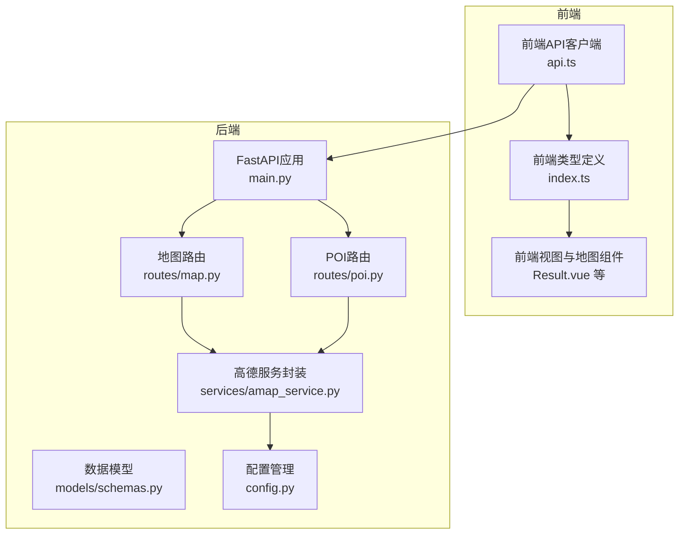
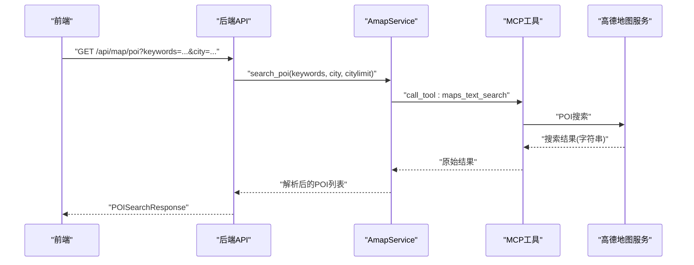
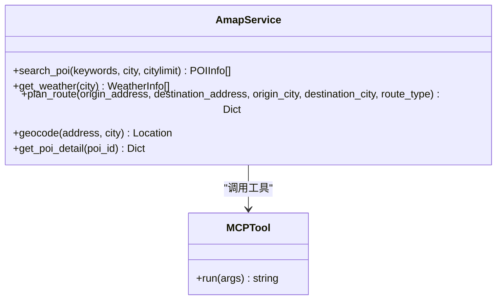
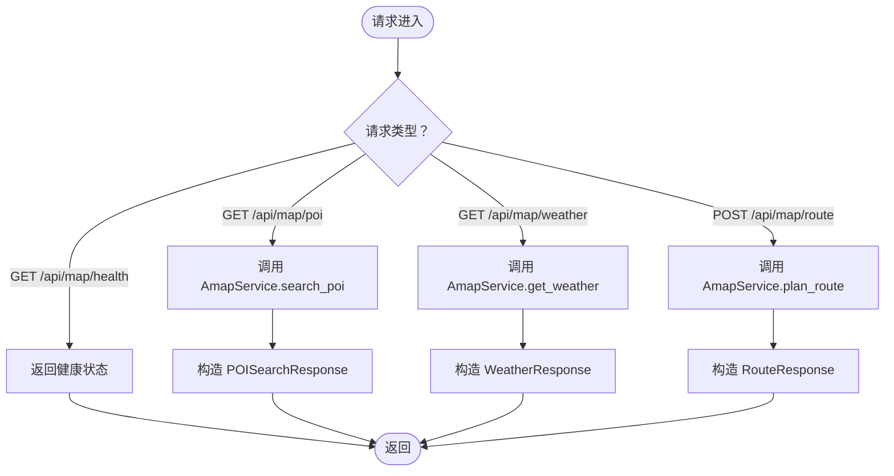
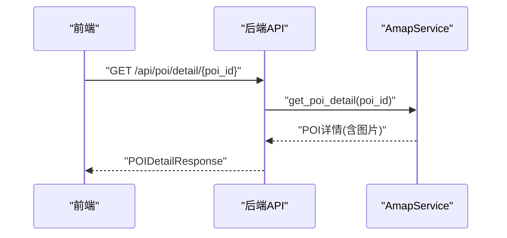
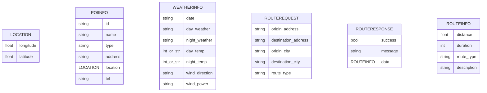
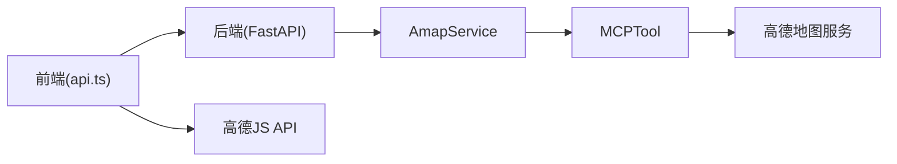

# 地图服务接口

<cite>
**本文引用的文件**
- [amap_service.py](file://backend/app/services/amap_service.py)
- [map.py](file://backend/app/api/routes/map.py)
- [poi.py](file://backend/app/api/routes/poi.py)
- [schemas.py](file://backend/app/models/schemas.py)
- [config.py](file://backend/app/config.py)
- [main.py](file://backend/app/api/main.py)
- [run.py](file://backend/run.py)
- [api.ts](file://frontend/src/services/api.ts)
- [index.ts](file://frontend/src/types/index.ts)
- [README.md](file://README.md)
</cite>

## 目录
1. [简介](#简介)
2. [项目结构](#项目结构)
3. [核心组件](#核心组件)
4. [架构总览](#架构总览)
5. [详细组件分析](#详细组件分析)
6. [依赖分析](#依赖分析)
7. [性能考量](#性能考量)
8. [故障排查指南](#故障排查指南)
9. [结论](#结论)
10. [附录](#附录)

## 简介
本文件面向地图服务接口的使用者与维护者，系统性梳理高德地图相关接口的使用方法，涵盖 POI 搜索、地理编码、路线规划、天气查询等功能。文档重点说明：
- 接口请求参数与响应格式
- 坐标系统与数据流转
- 地图数据获取流程（API 调用、数据解析、缓存策略）
- 请求与响应示例（以路径代替具体值）
- 调用限制、配额管理与错误处理机制
- 与前端地图组件的集成方式（数据格式转换、可视化渲染）
- 性能优化建议与最佳实践

## 项目结构
后端采用 FastAPI + Python，前端采用 Vue 3 + TypeScript。地图服务通过 MCP（Model Context Protocol）工具桥接到高德地图服务，后端提供 REST API，前端通过 Axios 发起请求并与高德 JS API 交互。

图表来源
- [main.py:56-60](file://backend/app/api/main.py#L56-L60)
- [map.py:14-14](file://backend/app/api/routes/map.py#L14-L14)
- [poi.py:8-8](file://backend/app/api/routes/poi.py#L8-L8)
- [amap_service.py:12-47](file://backend/app/services/amap_service.py#L12-L47)
- [config.py:36-39](file://backend/app/config.py#L36-L39)
- [api.ts:117-147](file://frontend/src/services/api.ts#L117-L147)
- [index.ts:3-196](file://frontend/src/types/index.ts#L3-L196)

章节来源
- [main.py:56-60](file://backend/app/api/main.py#L56-L60)
- [map.py:14-14](file://backend/app/api/routes/map.py#L14-L14)
- [poi.py:8-8](file://backend/app/api/routes/poi.py#L8-L8)
- [amap_service.py:12-47](file://backend/app/services/amap_service.py#L12-L47)
- [config.py:36-39](file://backend/app/config.py#L36-L39)
- [api.ts:117-147](file://frontend/src/services/api.ts#L117-L147)
- [index.ts:3-196](file://frontend/src/types/index.ts#L3-L196)

## 核心组件
- 高德服务封装（AmapService）：负责调用 MCP 工具执行 POI 搜索、地理编码、路线规划、天气查询、POI 详情等操作，并对返回结果进行初步解析与转换。
- 地图 API 路由：提供 /api/map/* 的 REST 接口，统一对外暴露地图能力。
- POI API 路由：提供 /api/poi/* 的 POI 相关接口，包括详情与图片获取。
- 数据模型：定义请求/响应的数据结构，确保前后端一致性。
- 配置管理：集中管理高德 Web 服务 Key、JS Key、小红书 Cookie 等运行时配置。
- 前端 API 客户端：封装 axios 请求、运行时配置读取与更新、WebSocket 轮询等。

章节来源
- [amap_service.py:50-276](file://backend/app/services/amap_service.py#L50-L276)
- [map.py:17-164](file://backend/app/api/routes/map.py#L17-L164)
- [poi.py:11-133](file://backend/app/api/routes/poi.py#L11-L133)
- [schemas.py:36-234](file://backend/app/models/schemas.py#L36-L234)
- [config.py:21-202](file://backend/app/config.py#L21-L202)
- [api.ts:149-214](file://frontend/src/services/api.ts#L149-L214)

## 架构总览
后端通过 MCP 工具调用 amap-mcp-server，实现对高德地图服务的统一抽象。前端通过后端 API 获取地图数据，并结合高德 JS API 进行可视化渲染。

图表来源
- [map.py:17-58](file://backend/app/api/routes/map.py#L17-L58)
- [amap_service.py:57-92](file://backend/app/services/amap_service.py#L57-L92)

章节来源
- [map.py:17-58](file://backend/app/api/routes/map.py#L17-L58)
- [amap_service.py:57-92](file://backend/app/services/amap_service.py#L57-L92)

## 详细组件分析

### 高德服务封装（AmapService）
- 单例模式的 MCP 工具初始化，确保 API Key 注入与工具可用性。
- 支持的功能：
  - POI 搜索：maps_text_search
  - 天气查询：maps_weather
  - 路线规划：walking/driving/transit
  - 地理编码：maps_geo
  - POI 详情：maps_search_detail
- 当前实现中，MCP 返回的字符串结果尚未完全解析为结构化数据，留有 TODO 标记。

图表来源
- [amap_service.py:50-276](file://backend/app/services/amap_service.py#L50-L276)

章节来源
- [amap_service.py:50-276](file://backend/app/services/amap_service.py#L50-L276)

### 地图 API 路由
- POI 搜索：GET /api/map/poi
  - 请求参数：keywords、city、citylimit
  - 响应：POISearchResponse
- 天气查询：GET /api/map/weather
  - 请求参数：city
  - 响应：WeatherResponse
- 路线规划：POST /api/map/route
  - 请求体：RouteRequest（origin_address、destination_address、origin_city、destination_city、route_type）
  - 响应：RouteResponse
- 健康检查：GET /api/map/health
  - 返回服务状态与 MCP 工具数量

图表来源
- [map.py:17-164](file://backend/app/api/routes/map.py#L17-L164)

章节来源
- [map.py:17-164](file://backend/app/api/routes/map.py#L17-L164)

### POI API 路由
- POI 详情：GET /api/poi/detail/{poi_id}
  - 响应：POIDetailResponse
- POI 搜索：GET /api/poi/search
  - 响应：通用字典结构
- 景点图片：GET /api/poi/photo
  - 参数：name、city
  - 响应：包含 name 与 photo_url 的字典

图表来源
- [poi.py:18-52](file://backend/app/api/routes/poi.py#L18-L52)
- [amap_service.py:219-254](file://backend/app/services/amap_service.py#L219-L254)

章节来源
- [poi.py:11-133](file://backend/app/api/routes/poi.py#L11-L133)
- [amap_service.py:219-254](file://backend/app/services/amap_service.py#L219-L254)

### 数据模型与坐标系统
- Location：经纬度字段
- POIInfo：POI 基本信息（含经纬度）
- WeatherInfo：天气信息（温度字段包含单位清洗逻辑）
- RouteRequest/RouteResponse：路线规划请求与响应
- 前端类型：Location、Attraction、WeatherInfo 等与后端模型保持一致

图表来源
- [schemas.py:54-234](file://backend/app/models/schemas.py#L54-L234)

章节来源
- [schemas.py:54-234](file://backend/app/models/schemas.py#L54-L234)

### 配置与运行时设置
- 配置项：vite_amap_web_key（Web 服务 Key）、vite_amap_web_js_key（Web 端 JS Key）、xhs_cookie、LLM 相关等
- 运行时设置：后端支持读取/更新运行时配置，并同步到环境变量，前端通过 /api/settings 读取与更新
- 健康检查：/api/map/health 与 /health 用于服务可用性检测

章节来源
- [config.py:21-202](file://backend/app/config.py#L21-L202)
- [map.py:142-162](file://backend/app/api/routes/map.py#L142-L162)
- [api.ts:149-214](file://frontend/src/services/api.ts#L149-L214)

### 前端集成与可视化
- 前端通过 api.ts 的 axios 客户端与后端通信，支持运行时 API 基础地址与高德 JS Key 的本地存储与更新
- Result.vue 等视图中包含地图渲染逻辑，支持根据数据绘制路线、标注点位、样式配置等
- 坐标转换与渲染：前端具备多种坐标来源的解析能力（数组、对象、高德原生对象）

章节来源
- [api.ts:1-335](file://frontend/src/services/api.ts#L1-L335)
- [index.ts:3-196](file://frontend/src/types/index.ts#L3-L196)
- [README.md:129-200](file://README.md#L129-L200)

## 依赖分析
- 后端依赖
  - FastAPI：路由与中间件
  - hello_agents.tools.MCPTool：调用 amap-mcp-server
  - pydantic：数据模型校验
  - uvicorn：ASGI 服务器
- 前端依赖
  - axios：HTTP 客户端
  - 高德 JS API：地图渲染与交互

图表来源
- [main.py:18-60](file://backend/app/api/main.py#L18-L60)
- [amap_service.py:12-47](file://backend/app/services/amap_service.py#L12-L47)
- [api.ts:117-147](file://frontend/src/services/api.ts#L117-L147)

章节来源
- [main.py:18-60](file://backend/app/api/main.py#L18-L60)
- [amap_service.py:12-47](file://backend/app/services/amap_service.py#L12-L47)
- [api.ts:117-147](file://frontend/src/services/api.ts#L117-L147)

## 性能考量
- 异步任务与轮询：后端采用任务队列与 WebSocket 轮询，避免长耗时阻塞，提升用户体验
- 缓存策略：当前实现未见显式的缓存逻辑，建议对高频查询（如 POI 搜索、地理编码）引入本地缓存或 Redis 缓存，降低重复请求与外部依赖压力
- 结果解析：MCP 返回字符串需解析为结构化数据，建议在服务层增加统一的解析器与错误处理，减少重复代码
- 前端渲染：地图渲染应避免频繁重绘，建议对数据变更进行节流/去抖处理

[本节为通用指导，不直接分析特定文件]

## 故障排查指南
- 配置缺失
  - 症状：高德 API Key 未配置导致服务不可用
  - 处理：在后端配置 vite_amap_web_key；前端通过设置页更新运行时配置并触发后端热生效
- 健康检查失败
  - 症状：/api/map/health 或 /health 返回 503
  - 处理：检查 MCP 工具初始化与可用工具数量
- 路线规划异常
  - 症状：plan_route 返回空或报错
  - 处理：确认 route_type 与城市参数；检查 MCP 工具映射与参数传递
- POI 详情解析失败
  - 症状：get_poi_detail 返回空或错误
  - 处理：检查 MCP 返回字符串中的 JSON 提取逻辑，确保正则与 JSON 解析健壮性

章节来源
- [config.py:162-179](file://backend/app/config.py#L162-L179)
- [map.py:142-162](file://backend/app/api/routes/map.py#L142-L162)
- [amap_service.py:122-187](file://backend/app/services/amap_service.py#L122-L187)
- [amap_service.py:219-254](file://backend/app/services/amap_service.py#L219-L254)

## 结论
本项目通过 MCP 工具桥接高德地图服务，提供了 POI 搜索、地理编码、路线规划、天气查询等核心能力，并通过 REST API 对外暴露。当前实现中，MCP 返回结果的解析尚在完善阶段，建议优先完成结构化解析与错误处理，同时补充缓存策略与性能优化措施。前端通过 axios 与高德 JS API 实现可视化渲染，整体架构清晰、扩展性强。

[本节为总结性内容，不直接分析特定文件]

## 附录

### 接口清单与示例（以路径代替具体值）
- POI 搜索
  - 方法与路径：GET /api/map/poi
  - 请求参数：keywords、city、citylimit
  - 响应模型：POISearchResponse
  - 示例请求路径：[map.py:23-50](file://backend/app/api/routes/map.py#L23-L50)
  - 示例响应模型：[schemas.py:207-212](file://backend/app/models/schemas.py#L207-L212)
- 天气查询
  - 方法与路径：GET /api/map/weather
  - 请求参数：city
  - 响应模型：WeatherResponse
  - 示例请求路径：[map.py:66-96](file://backend/app/api/routes/map.py#L66-L96)
  - 示例响应模型：[schemas.py:229-234](file://backend/app/models/schemas.py#L229-L234)
- 路线规划
  - 方法与路径：POST /api/map/route
  - 请求体：RouteRequest
  - 响应模型：RouteResponse
  - 示例请求路径：[map.py:105-139](file://backend/app/api/routes/map.py#L105-L139)
  - 示例响应模型：[schemas.py:222-227](file://backend/app/models/schemas.py#L222-L227)
- POI 详情
  - 方法与路径：GET /api/poi/detail/{poi_id}
  - 响应模型：POIDetailResponse
  - 示例请求路径：[poi.py:24-51](file://backend/app/api/routes/poi.py#L24-L51)
  - 示例响应模型：[poi.py:11-16](file://backend/app/api/routes/poi.py#L11-L16)
- 景点图片
  - 方法与路径：GET /api/poi/photo
  - 请求参数：name、city
  - 示例请求路径：[poi.py:93-124](file://backend/app/api/routes/poi.py#L93-L124)

章节来源
- [map.py:17-164](file://backend/app/api/routes/map.py#L17-L164)
- [poi.py:11-133](file://backend/app/api/routes/poi.py#L11-L133)
- [schemas.py:36-234](file://backend/app/models/schemas.py#L36-L234)

### 坐标系统与数据格式转换
- 统一坐标：Location.longitude/latitude
- 前端渲染：支持多种坐标来源（数组、对象、高德原生对象）解析
- 温度字段：WeatherInfo.day_temp/night_temp 支持去除单位符号并转换为整数

章节来源
- [schemas.py:54-135](file://backend/app/models/schemas.py#L54-L135)
- [index.ts:3-196](file://frontend/src/types/index.ts#L3-L196)

### 配额与调用限制
- 高德地图服务的配额与计费策略由高德官方管理，本项目通过配置项注入 API Key，未内置配额监控与降级策略
- 建议：在服务层增加配额告警与熔断机制，必要时引入备用方案或限流策略

[本节为通用指导，不直接分析特定文件]

### 最佳实践
- 结构化解析：完善 MCP 返回字符串的 JSON 解析，增加容错与日志
- 缓存策略：对热点数据（POI、地理编码、天气）实施缓存，设定合理过期时间
- 错误处理：统一异常捕获与 HTTP 状态码返回，便于前端展示与用户感知
- 前端渲染：对地图渲染进行节流/去抖，避免频繁重绘
- 配置管理：通过运行时设置实现热更新，减少重启成本

[本节为通用指导，不直接分析特定文件]