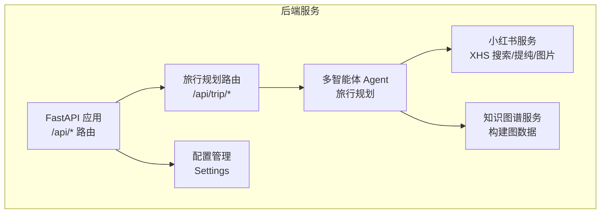
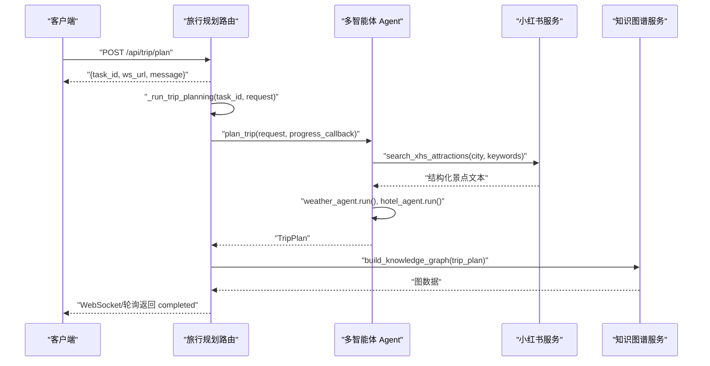
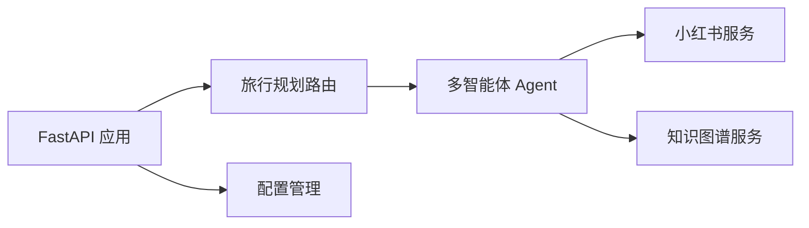

# 旅行规划接口

<cite>
**本文引用的文件**
- [backend/app/api/routes/trip.py](file://backend/app/api/routes/trip.py)
- [backend/app/models/schemas.py](file://backend/app/models/schemas.py)
- [backend/app/agents/trip_planner_agent.py](file://backend/app/agents/trip_planner_agent.py)
- [backend/app/services/knowledge_graph_service.py](file://backend/app/services/knowledge_graph_service.py)
- [backend/app/services/xhs_service.py](file://backend/app/services/xhs_service.py)
- [backend/app/api/main.py](file://backend/app/api/main.py)
- [backend/app/config.py](file://backend/app/config.py)
- [README.md](file://README.md)
</cite>

## 目录
1. [简介](#简介)
2. [项目结构](#项目结构)
3. [核心组件](#核心组件)
4. [架构总览](#架构总览)
5. [详细组件分析](#详细组件分析)
6. [依赖分析](#依赖分析)
7. [性能考量](#性能考量)
8. [故障排查指南](#故障排查指南)
9. [结论](#结论)
10. [附录](#附录)

## 简介
本文件为旅行规划接口的详细 API 文档，覆盖以下核心接口：
- POST /api/trip/plan：提交旅行规划任务，立即返回 task_id
- GET /api/trip/status/{task_id}：轮询查询任务状态与结果
- GET /api/trip/history：查询最近历史计划摘要
- GET /api/trip/ws/{task_id}：WebSocket 实时订阅任务状态
- GET /api/trip/health：健康检查

文档重点解释异步任务处理机制（状态流转、进度百分比、错误处理）、WebSocket 实时通信（连接建立、消息格式、断线重连）、请求与响应格式、错误码与典型场景示例，并提供健康检查与故障排查建议。

## 项目结构
后端采用 FastAPI + 多智能体架构，核心模块包括：
- API 路由：/api/trip/* 提供旅行规划相关接口
- 模型定义：Pydantic 数据模型，统一请求/响应结构
- 代理与服务：多智能体 Agent 协作、小红书服务、知识图谱构建
- 配置与启动：CORS、中间件、健康检查、启动/关闭事件

图表来源
- [backend/app/api/main.py:56-61](file://backend/app/api/main.py#L56-L61)
- [backend/app/api/routes/trip.py:17-17](file://backend/app/api/routes/trip.py#L17-L17)
- [backend/app/agents/trip_planner_agent.py:173-242](file://backend/app/agents/trip_planner_agent.py#L173-L242)
- [backend/app/services/xhs_service.py:247-354](file://backend/app/services/xhs_service.py#L247-L354)
- [backend/app/services/knowledge_graph_service.py:34-169](file://backend/app/services/knowledge_graph_service.py#L34-L169)
- [backend/app/config.py:21-72](file://backend/app/config.py#L21-L72)

章节来源
- [backend/app/api/main.py:56-61](file://backend/app/api/main.py#L56-L61)
- [README.md:43-97](file://README.md#L43-L97)

## 核心组件
- 任务状态机与持久化：内存任务池 + 本地 JSON 文件持久化，支持服务重启后的状态恢复与失败兜底
- 多智能体旅行规划：小红书景点提纯、天气查询、酒店搜索、行程整合与 JSON 解析修复
- 知识图谱构建：从 TripPlan 生成节点/边/分类，供前端可视化
- WebSocket 实时订阅：队列广播事件，断线自动清理订阅者
- 健康检查：校验 Agent 初始化与工具可用性

章节来源
- [backend/app/api/routes/trip.py:19-145](file://backend/app/api/routes/trip.py#L19-L145)
- [backend/app/agents/trip_planner_agent.py:257-339](file://backend/app/agents/trip_planner_agent.py#L257-L339)
- [backend/app/services/knowledge_graph_service.py:34-169](file://backend/app/services/knowledge_graph_service.py#L34-L169)
- [backend/app/api/routes/trip.py:491-508](file://backend/app/api/routes/trip.py#L491-L508)

## 架构总览
旅行规划接口的端到端流程如下：
- 客户端提交旅行请求，后端立即返回 task_id
- 后台异步执行多智能体任务，周期性更新任务状态
- 客户端可通过轮询或 WebSocket 实时获取进度与结果
- 任务完成后，后端构建知识图谱并返回 TripPlanResponse

图表来源
- [backend/app/api/routes/trip.py:276-388](file://backend/app/api/routes/trip.py#L276-L388)
- [backend/app/agents/trip_planner_agent.py:257-339](file://backend/app/agents/trip_planner_agent.py#L257-L339)
- [backend/app/services/knowledge_graph_service.py:34-169](file://backend/app/services/knowledge_graph_service.py#L34-L169)
- [backend/app/services/xhs_service.py:247-354](file://backend/app/services/xhs_service.py#L247-L354)

## 详细组件分析

### 接口：POST /api/trip/plan
- 描述：提交旅行规划任务，立即返回 task_id 与 WebSocket 订阅地址
- 请求体：TripRequest（见下方 Schema）
- 成功响应：包含 task_id、plan_id、status、ws_url、message
- 异常：无特定 HTTP 异常，失败通过任务状态与错误字段体现

请求参数（TripRequest）
- city：目的地城市
- start_date：开始日期 YYYY-MM-DD
- end_date：结束日期 YYYY-MM-DD
- travel_days：旅行天数（1~30）
- transportation：交通方式
- accommodation：住宿偏好
- preferences：旅行偏好标签列表
- free_text_input：额外要求

响应字段
- task_id：任务唯一标识（8位十六进制片段）
- plan_id：与 task_id 对齐
- status：processing
- ws_url：WebSocket 订阅地址
- message：提示信息

章节来源
- [backend/app/api/routes/trip.py:276-312](file://backend/app/api/routes/trip.py#L276-L312)
- [backend/app/models/schemas.py:10-34](file://backend/app/models/schemas.py#L10-L34)

### 接口：GET /api/trip/status/{task_id}
- 描述：轮询查询任务状态与结果（兼容旧客户端）
- 路径参数：task_id
- 成功响应：
  - completed：返回 result（TripPlanResponse）
  - failed：返回 error 与 request_payload
  - processing：返回 stage、progress、progress_text
- 异常：404 任务不存在

响应字段（processing）
- task_id、plan_id、status、stage、progress、progress_text

响应字段（completed）
- result.success、result.message、result.plan_id、result.data、result.graph_data

响应字段（failed）
- error、request_payload

章节来源
- [backend/app/api/routes/trip.py:455-488](file://backend/app/api/routes/trip.py#L455-L488)
- [backend/app/models/schemas.py:188-195](file://backend/app/models/schemas.py#L188-L195)

### 接口：GET /api/trip/history
- 描述：返回最近成功生成的旅行计划摘要（最多 50 条）
- 查询参数：limit（默认 10，最大 50）
- 成功响应：items 列表，每项包含 plan_id、task_id、city、start_date、end_date、travel_days、updated_at、overall_suggestions

章节来源
- [backend/app/api/routes/trip.py:442-453](file://backend/app/api/routes/trip.py#L442-L453)
- [backend/app/api/routes/trip.py:183-204](file://backend/app/api/routes/trip.py#L183-L204)

### 接口：GET /api/trip/ws/{task_id}
- 描述：WebSocket 实时订阅任务状态
- 连接建立：客户端连接 /api/trip/ws/{task_id}
- 首次消息：快照（包含当前状态与结果，如存在）
- 消息格式：与轮询响应一致，但包含 error/request_payload（失败时）
- 断开条件：当状态进入 completed/failed 时，服务端主动关闭连接
- 断线重连：客户端监听断开码，重新连接并接收快照

消息字段
- task_id、plan_id、status、stage、progress、message、error（可选）、result（可选）

章节来源
- [backend/app/api/routes/trip.py:390-440](file://backend/app/api/routes/trip.py#L390-L440)
- [backend/app/api/routes/trip.py:207-224](file://backend/app/api/routes/trip.py#L207-L224)

### 接口：GET /api/trip/health
- 描述：健康检查，验证旅行规划服务可用性
- 成功响应：status、service、agent_name、tools_count
- 失败响应：503 服务不可用（detail 包含错误信息）

章节来源
- [backend/app/api/routes/trip.py:491-508](file://backend/app/api/routes/trip.py#L491-L508)

### 任务状态流转与进度
- 状态机：submitted → initializing → processing → completed/failed
- 进度百分比：由后端在不同阶段设置（例如 submitted: 5%，initializing: 10%，graph_building: 95%，completed: 100%，failed: 100%）
- 错误处理：捕获异常并设置 status=failed，message/error 透传前端；对小红书 Cookie 过期异常进行特殊提示

章节来源
- [backend/app/api/routes/trip.py:25-38](file://backend/app/api/routes/trip.py#L25-L38)
- [backend/app/api/routes/trip.py:295-387](file://backend/app/api/routes/trip.py#L295-L387)

### WebSocket 实时通信
- 连接建立：客户端连接 /api/trip/ws/{task_id}
- 快照策略：首次发送当前任务快照，保证断线重连后也能同步状态
- 广播机制：每个订阅者维护一个队列，事件到达时入队，客户端循环出队并消费
- 断线处理：WebSocketDisconnect 或连接关闭时清理订阅者队列

章节来源
- [backend/app/api/routes/trip.py:390-440](file://backend/app/api/routes/trip.py#L390-L440)
- [backend/app/api/routes/trip.py:226-241](file://backend/app/api/routes/trip.py#L226-L241)

### 多智能体与数据处理
- 小红书服务：搜索笔记、提取结构化景点、补齐经纬度、图片抓取
- 天气与酒店：通过高德工具查询天气与酒店
- 行程整合：将三方数据整合为 TripPlan，包含每日行程、预算、天气等
- JSON 解析修复：多轮清洗与修复，必要时使用 LLM 修复

章节来源
- [backend/app/agents/trip_planner_agent.py:257-339](file://backend/app/agents/trip_planner_agent.py#L257-L339)
- [backend/app/services/xhs_service.py:247-354](file://backend/app/services/xhs_service.py#L247-L354)
- [backend/app/agents/trip_planner_agent.py:650-759](file://backend/app/agents/trip_planner_agent.py#L650-L759)

### 知识图谱构建
- 输入：TripPlan
- 输出：nodes、edges、categories
- 用途：前端 ECharts 可视化“城市-天数-景点-酒店-餐饮-天气-预算-建议”的关系图

章节来源
- [backend/app/services/knowledge_graph_service.py:34-169](file://backend/app/services/knowledge_graph_service.py#L34-L169)

## 依赖分析
- FastAPI 应用注册 /api/trip 路由
- 旅行规划路由依赖多智能体 Agent、知识图谱服务
- 多智能体 Agent 依赖 LLM 与高德 MCP 工具
- 小红书服务依赖 Cookie 与签名工具

图表来源
- [backend/app/api/main.py:56-61](file://backend/app/api/main.py#L56-L61)
- [backend/app/api/routes/trip.py:13-15](file://backend/app/api/routes/trip.py#L13-L15)
- [backend/app/agents/trip_planner_agent.py:173-242](file://backend/app/agents/trip_planner_agent.py#L173-L242)
- [backend/app/services/xhs_service.py:247-354](file://backend/app/services/xhs_service.py#L247-L354)
- [backend/app/services/knowledge_graph_service.py:34-169](file://backend/app/services/knowledge_graph_service.py#L34-L169)
- [backend/app/config.py:21-72](file://backend/app/config.py#L21-L72)

章节来源
- [backend/app/api/main.py:56-61](file://backend/app/api/main.py#L56-L61)
- [backend/app/api/routes/trip.py:13-15](file://backend/app/api/routes/trip.py#L13-L15)
- [backend/app/agents/trip_planner_agent.py:173-242](file://backend/app/agents/trip_planner_agent.py#L173-L242)

## 性能考量
- 异步任务：使用 asyncio.create_task 后台执行，避免阻塞请求
- 并发优化：多智能体阶段 1-3 并发执行，缩短总耗时
- 超时与重试：规划阶段超时自动重试一次，提升稳定性
- JSON 解析修复：多轮清洗与 LLM 修复，降低失败率
- 任务持久化：本地 JSON 文件持久化，服务重启后可恢复状态（失败兜底）

章节来源
- [backend/app/api/routes/trip.py:304-304](file://backend/app/api/routes/trip.py#L304-L304)
- [backend/app/agents/trip_planner_agent.py:265-267](file://backend/app/agents/trip_planner_agent.py#L265-L267)
- [backend/app/agents/trip_planner_agent.py:362-387](file://backend/app/agents/trip_planner_agent.py#L362-L387)
- [backend/app/agents/trip_planner_agent.py:424-602](file://backend/app/agents/trip_planner_agent.py#L424-L602)

## 故障排查指南
- 404 任务不存在：确认 task_id 是否正确，或重新提交任务
- 503 服务不可用：检查健康检查接口，确认 Agent 初始化与工具可用
- Cookie 过期（小红书）：健康检查会抛出特定异常，需更新 XHS_COOKIE
- 任务卡住：轮询或 WebSocket 一直显示 processing，检查后端日志与 LLM/工具可用性
- CORS 问题：确认前端域名已在 CORS 允许列表中
- 配置缺失：高德 Web Key、LLM API Key、XHS Cookie 未配置会导致功能受限

章节来源
- [backend/app/api/routes/trip.py:463-464](file://backend/app/api/routes/trip.py#L463-L464)
- [backend/app/api/routes/trip.py:496-507](file://backend/app/api/routes/trip.py#L496-L507)
- [backend/app/services/xhs_service.py:22-25](file://backend/app/services/xhs_service.py#L22-L25)
- [backend/app/config.py:162-179](file://backend/app/config.py#L162-L179)

## 结论
旅行规划接口通过异步任务与多智能体协作，提供从景点、天气、酒店到行程整合的全流程服务，并通过 WebSocket 与轮询两种方式满足不同客户端需求。知识图谱构建进一步增强了结果的可视化与可解释性。建议在生产环境中结合健康检查与监控，确保 LLM、工具与外部 API 的稳定性。

## 附录

### 请求与响应示例（路径引用）
- 提交任务（请求体参考）：[backend/app/models/schemas.py:10-34](file://backend/app/models/schemas.py#L10-L34)
- 提交任务（响应）：[backend/app/api/routes/trip.py:306-312](file://backend/app/api/routes/trip.py#L306-L312)
- 轮询状态（processing）：[backend/app/api/routes/trip.py:481-488](file://backend/app/api/routes/trip.py#L481-L488)
- 轮询状态（completed）：[backend/app/api/routes/trip.py:466-472](file://backend/app/api/routes/trip.py#L466-L472)
- 轮询状态（failed）：[backend/app/api/routes/trip.py:473-480](file://backend/app/api/routes/trip.py#L473-L480)
- WebSocket 首次消息（快照）：[backend/app/api/routes/trip.py:413-415](file://backend/app/api/routes/trip.py#L413-L415)
- 历史摘要（响应）：[backend/app/api/routes/trip.py:449-452](file://backend/app/api/routes/trip.py#L449-L452)
- 健康检查（成功）：[backend/app/api/routes/trip.py:500-505](file://backend/app/api/routes/trip.py#L500-L505)
- 健康检查（失败）：[backend/app/api/routes/trip.py:506-507](file://backend/app/api/routes/trip.py#L506-L507)