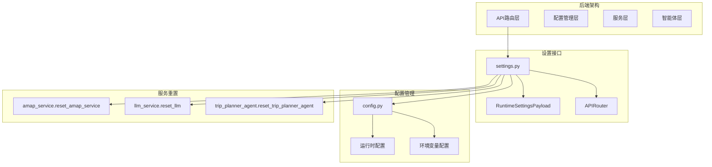
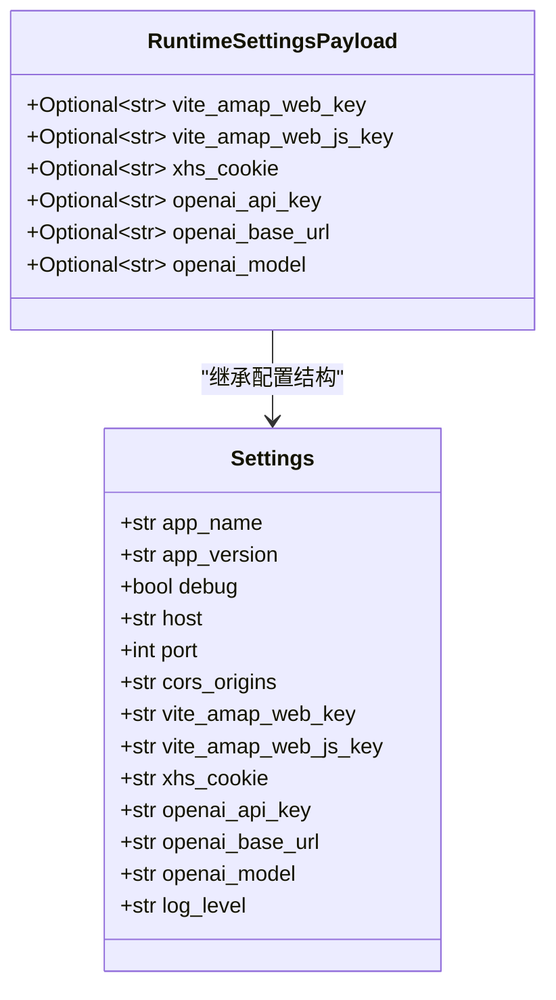
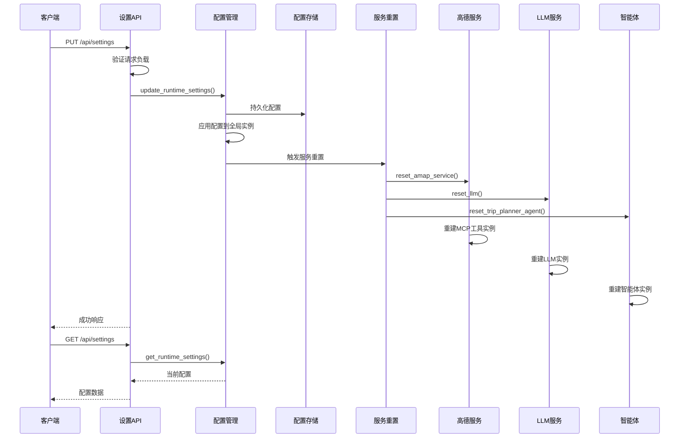
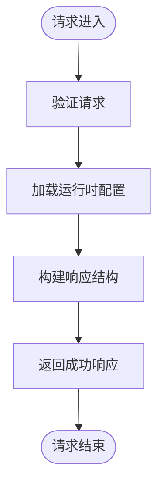
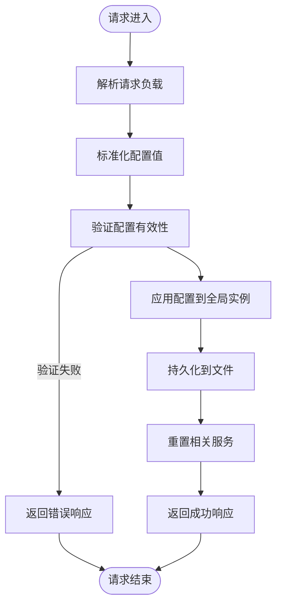
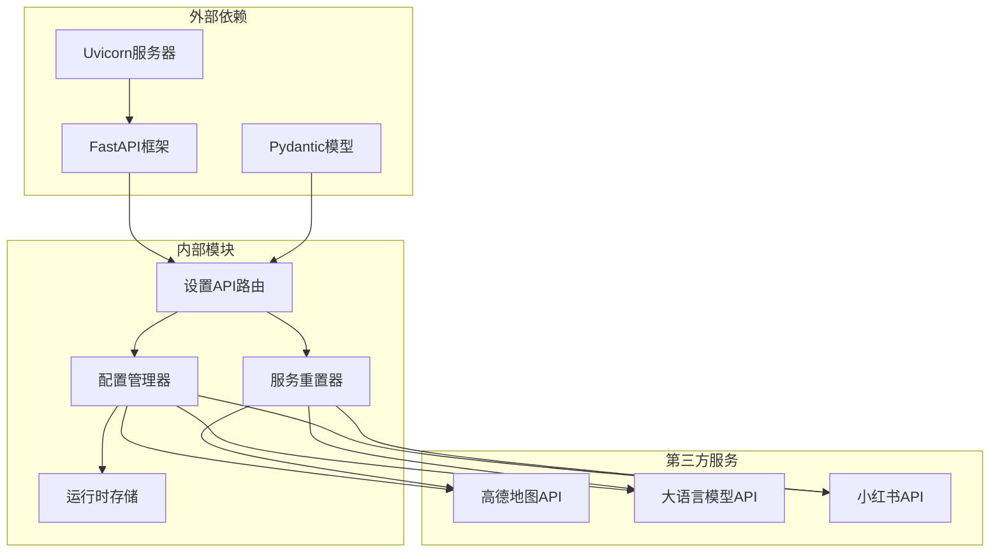

# 系统设置接口

<cite>
**本文档引用的文件**
- [settings.py](file://backend/app/api/routes/settings.py)
- [config.py](file://backend/app/config.py)
- [amap_service.py](file://backend/app/services/amap_service.py)
- [llm_service.py](file://backend/app/services/llm_service.py)
- [trip_planner_agent.py](file://backend/app/agents/trip_planner_agent.py)
- [main.py](file://backend/app/api/main.py)
- [schemas.py](file://backend/app/models/schemas.py)
- [run.py](file://backend/run.py)
</cite>

## 目录
1. [简介](#简介)
2. [项目结构](#项目结构)
3. [核心组件](#核心组件)
4. [架构概览](#架构概览)
5. [详细组件分析](#详细组件分析)
6. [依赖关系分析](#依赖关系分析)
7. [性能考虑](#性能考虑)
8. [故障排除指南](#故障排除指南)
9. [结论](#结论)

## 简介

系统设置接口是TripStar智能旅行助手的核心配置管理模块，负责运行时配置的获取、更新和验证。该接口允许用户通过前端设置页面动态配置各种API密钥和服务参数，实现配置的热更新和即时生效。

系统设置接口主要管理以下配置项：
- 高德地图API配置（Web服务Key和JS SDK Key）
- 小红书Cookie配置
- LLM（大语言模型）API配置（包括API Key、Base URL、模型ID）

该接口采用热更新机制，当配置发生变化时，系统会自动重置相关的服务实例，确保新的配置立即生效。

## 项目结构

系统设置接口位于后端FastAPI应用的API路由模块中，采用分层架构设计：

**图表来源**
- [settings.py:1-56](file://backend/app/api/routes/settings.py#L1-L56)
- [config.py:1-202](file://backend/app/config.py#L1-L202)

**章节来源**
- [settings.py:1-56](file://backend/app/api/routes/settings.py#L1-L56)
- [config.py:1-202](file://backend/app/config.py#L1-L202)

## 核心组件

### 设置接口路由

系统设置接口通过FastAPI的APIRouter实现，提供RESTful API端点：

- **GET /api/settings** - 获取当前运行时配置
- **PUT /api/settings** - 更新运行时配置并立即生效

### 配置数据模型

运行时配置采用Pydantic模型定义，支持可选参数和默认值：

**图表来源**
- [settings.py:16-25](file://backend/app/api/routes/settings.py#L16-L25)
- [config.py:21-64](file://backend/app/config.py#L21-L64)

### 配置存储机制

系统采用双重配置存储机制：

1. **运行时配置文件** (`runtime_settings.json`)
2. **环境变量配置** (`.env`文件)

**章节来源**
- [settings.py:16-25](file://backend/app/api/routes/settings.py#L16-L25)
- [config.py:72-127](file://backend/app/config.py#L72-L127)

## 架构概览

系统设置接口的完整架构流程如下：

**图表来源**
- [settings.py:27-56](file://backend/app/api/routes/settings.py#L27-L56)
- [config.py:146-159](file://backend/app/config.py#L146-L159)

## 详细组件分析

### 设置获取接口

设置获取接口提供当前运行时配置的只读访问：

**图表来源**
- [settings.py:27-34](file://backend/app/api/routes/settings.py#L27-L34)

### 设置更新接口

设置更新接口支持增量配置更新和热重载：

**图表来源**
- [settings.py:37-56](file://backend/app/api/routes/settings.py#L37-L56)
- [config.py:146-159](file://backend/app/config.py#L146-L159)

### 配置验证机制

系统内置配置验证机制，确保关键配置的完整性：

| 配置项 | 验证规则 | 影响范围 |
|--------|----------|----------|
| 高德地图Web Key | 必填，否则POI搜索功能受限 | 景点地理编码、POI搜索 |
| LLM API Key | 必填，否则AI生成功能受限 | 所有AI相关功能 |
| 小红书Cookie | 可选，影响小红书数据获取 | 小红书景点数据 |

**章节来源**
- [config.py:162-179](file://backend/app/config.py#L162-L179)

### 环境变量管理

系统采用多层环境变量加载策略：

**图表来源**
- [config.py:11-18](file://backend/app/config.py#L11-L18)

**章节来源**
- [config.py:11-18](file://backend/app/config.py#L11-L18)

### 服务热重载机制

系统实现了智能体级别的热重载，确保配置更新后服务立即生效：

| 服务组件 | 重置函数 | 重置触发条件 |
|----------|----------|--------------|
| 高德地图服务 | `reset_amap_service()` | 配置更新时 |
| LLM服务 | `reset_llm()` | 配置更新时 |
| 旅行规划智能体 | `reset_trip_planner_agent()` | 配置更新时 |

**章节来源**
- [settings.py:44-47](file://backend/app/api/routes/settings.py#L44-L47)
- [amap_service.py:271-276](file://backend/app/services/amap_service.py#L271-L276)
- [llm_service.py:70-75](file://backend/app/services/llm_service.py#L70-L75)

## 依赖关系分析

系统设置接口的依赖关系图：

**图表来源**
- [settings.py:8-11](file://backend/app/api/routes/settings.py#L8-L11)
- [config.py:3-8](file://backend/app/config.py#L3-L8)

**章节来源**
- [settings.py:8-11](file://backend/app/api/routes/settings.py#L8-L11)
- [config.py:3-8](file://backend/app/config.py#L3-L8)

## 性能考虑

### 配置更新性能

系统配置更新采用异步处理机制，确保不影响其他请求的处理：

- **内存操作**：配置更新仅涉及内存中的Python字典操作
- **文件I/O**：配置持久化使用异步文件写入，避免阻塞主线程
- **服务重置**：服务重置采用延迟初始化策略，避免不必要的资源消耗

### 缓存策略

系统实现了多层次缓存机制：

1. **内存缓存**：全局配置实例缓存
2. **文件缓存**：运行时配置文件缓存
3. **服务缓存**：各服务实例的缓存

### 并发安全性

系统采用线程安全的配置更新机制：

- **全局锁**：配置更新时使用全局锁防止并发冲突
- **原子操作**：配置更新采用原子操作确保数据一致性
- **回滚机制**：配置更新失败时自动回滚到之前的配置

## 故障排除指南

### 常见配置问题

| 问题类型 | 症状 | 解决方案 |
|----------|------|----------|
| 配置加载失败 | 启动时报配置错误 | 检查.env文件格式和权限 |
| API Key无效 | 服务调用失败 | 验证API Key的有效性和权限 |
| 热重载失败 | 配置更新后服务未生效 | 检查服务重置函数调用 |
| 权限不足 | 配置文件写入失败 | 检查文件权限和磁盘空间 |

### 错误处理策略

系统采用分级错误处理机制：

1. **配置验证错误**：启动时抛出异常阻止应用继续
2. **运行时配置错误**：返回HTTP 500错误并记录详细日志
3. **服务重置错误**：记录错误但不影响其他功能的正常运行

### 调试技巧

- **配置打印**：使用`print_config()`函数查看当前配置状态
- **日志监控**：检查应用日志中的配置相关信息
- **健康检查**：通过`/health`端点监控服务状态

**章节来源**
- [config.py:182-201](file://backend/app/config.py#L182-L201)

## 结论

系统设置接口为TripStar提供了完整的配置管理解决方案，具有以下特点：

1. **热更新机制**：配置更新后立即生效，无需重启服务
2. **多层存储**：支持运行时配置和环境变量的灵活组合
3. **智能重载**：自动重置相关服务实例确保配置一致性
4. **安全保护**：敏感信息通过环境变量管理，避免明文存储
5. **错误处理**：完善的错误处理和回滚机制

该接口的设计充分考虑了生产环境的需求，提供了稳定、可靠、高性能的配置管理能力，为整个系统的正常运行奠定了坚实的基础。