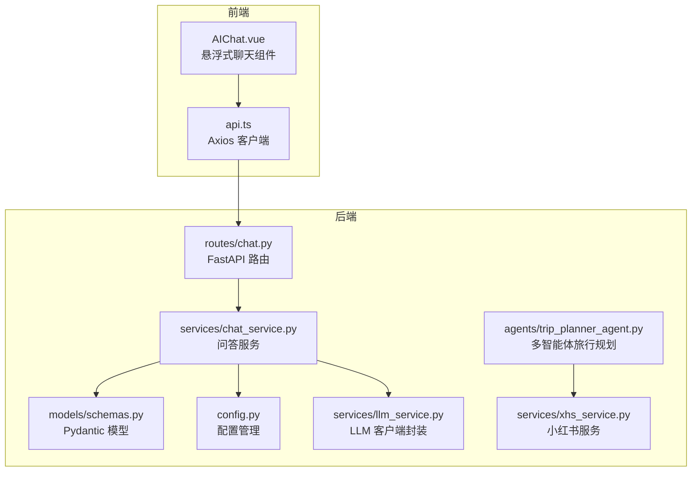
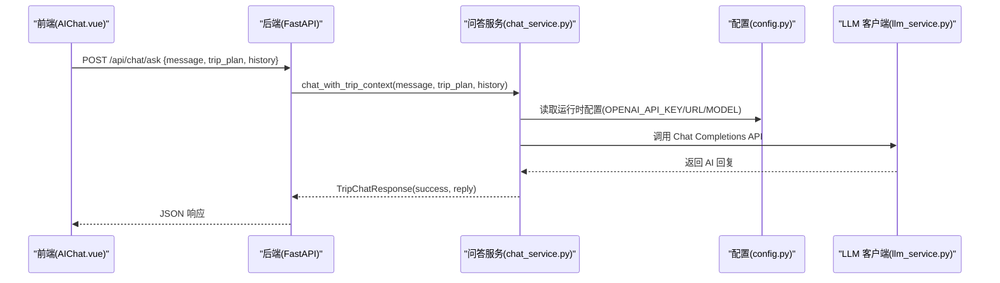
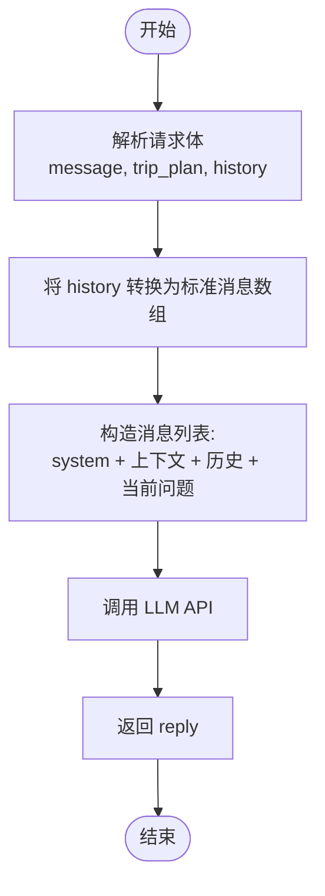
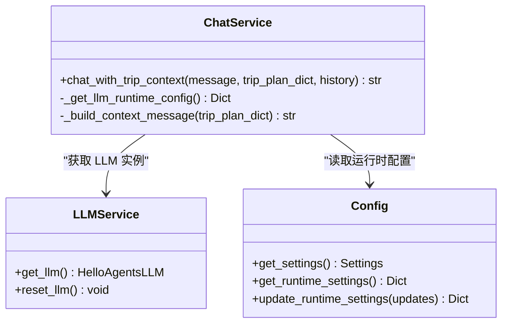
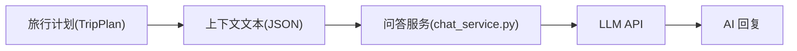
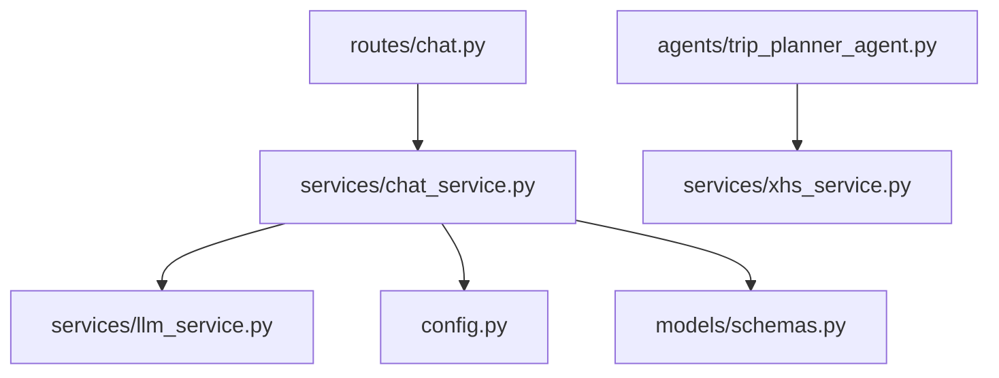

# 聊天问答接口

<cite>
**本文档引用的文件**
- [chat.py](file://backend/app/api/routes/chat.py)
- [chat_service.py](file://backend/app/services/chat_service.py)
- [llm_service.py](file://backend/app/services/llm_service.py)
- [schemas.py](file://backend/app/models/schemas.py)
- [trip_planner_agent.py](file://backend/app/agents/trip_planner_agent.py)
- [config.py](file://backend/app/config.py)
- [xhs_service.py](file://backend/app/services/xhs_service.py)
- [AIChat.vue](file://frontend/src/components/AIChat.vue)
- [api.ts](file://frontend/src/services/api.ts)
- [README.md](file://README.md)
</cite>

## 目录
1. [简介](#简介)
2. [项目结构](#项目结构)
3. [核心组件](#核心组件)
4. [架构总览](#架构总览)
5. [详细组件分析](#详细组件分析)
6. [依赖关系分析](#依赖关系分析)
7. [性能考量](#性能考量)
8. [故障排查指南](#故障排查指南)
9. [结论](#结论)
10. [附录](#附录)

## 简介
本文件为旅行问答接口 POST /api/chat/ask 的详细 API 文档，涵盖请求参数、响应格式、对话历史管理、LLM 服务集成、多语言支持机制、请求与响应示例、对话状态管理与会话持久化、上下文理解、性能优化策略、并发处理能力与错误恢复机制等内容。该接口基于旅行计划上下文提供智能问答，支持中英文问答切换与翻译处理流程，并与前端悬浮式 AI 聊天组件联动。

## 项目结构
后端采用 FastAPI + Python，前端采用 Vue 3 + TypeScript，整体采用前后端分离架构。旅行问答接口位于后端路由层，服务层负责与 LLM 服务对接，模型层定义请求/响应数据结构，多智能体系统负责旅行计划生成与上下文构建。

图表来源
- [chat.py:1-53](file://backend/app/api/routes/chat.py#L1-L53)
- [chat_service.py:1-133](file://backend/app/services/chat_service.py#L1-L133)
- [schemas.py:245-264](file://backend/app/models/schemas.py#L245-L264)
- [config.py:1-202](file://backend/app/config.py#L1-L202)
- [llm_service.py:1-75](file://backend/app/services/llm_service.py#L1-L75)
- [trip_planner_agent.py:1-826](file://backend/app/agents/trip_planner_agent.py#L1-L826)
- [xhs_service.py:1-444](file://backend/app/services/xhs_service.py#L1-L444)
- [AIChat.vue:1-1161](file://frontend/src/components/AIChat.vue#L1-L1161)
- [api.ts:1-335](file://frontend/src/services/api.ts#L1-L335)

章节来源
- [README.md:43-97](file://README.md#L43-L97)

## 核心组件
- FastAPI 路由层：定义 /api/chat/ask 接口，接收请求并调用服务层。
- 问答服务层：将旅行计划上下文与历史对话注入 LLM，返回结构化回复。
- LLM 客户端封装：统一管理 API Key、Base URL、模型 ID、超时等配置。
- 数据模型层：定义 TripChatRequest/TripChatResponse 等请求/响应结构。
- 配置管理：支持运行时配置热更新，兼容环境变量与持久化覆盖。
- 多智能体旅行规划：为问答提供旅行计划上下文（用于生成旅行计划的 Agent）。
- 小红书服务：为旅行计划提供真实用户游记与图片，支撑问答内容。

章节来源
- [chat.py:10-53](file://backend/app/api/routes/chat.py#L10-L53)
- [chat_service.py:65-133](file://backend/app/services/chat_service.py#L65-L133)
- [llm_service.py:12-75](file://backend/app/services/llm_service.py#L12-L75)
- [schemas.py:245-264](file://backend/app/models/schemas.py#L245-L264)
- [config.py:129-202](file://backend/app/config.py#L129-L202)
- [trip_planner_agent.py:173-826](file://backend/app/agents/trip_planner_agent.py#L173-L826)
- [xhs_service.py:247-354](file://backend/app/services/xhs_service.py#L247-L354)

## 架构总览
旅行问答接口的调用链路如下：
- 前端通过 Axios 发送 POST /api/chat/ask，携带 message、trip_plan、history。
- 后端路由层解析请求，调用服务层 chat_with_trip_context。
- 服务层构造系统提示词与上下文，追加历史对话与当前问题，调用 LLM 客户端。
- LLM 返回回复，服务层封装为响应模型，返回给前端。
- 前端将回复显示在悬浮式聊天面板中。

图表来源
- [AIChat.vue:219-248](file://frontend/src/components/AIChat.vue#L219-L248)
- [api.ts:117-147](file://frontend/src/services/api.ts#L117-L147)
- [chat.py:16-52](file://backend/app/api/routes/chat.py#L16-L52)
- [chat_service.py:65-133](file://backend/app/services/chat_service.py#L65-L133)
- [config.py:129-202](file://backend/app/config.py#L129-L202)
- [llm_service.py:12-75](file://backend/app/services/llm_service.py#L12-L75)

## 详细组件分析

### 接口定义与请求参数
- 路径：POST /api/chat/ask
- 请求体模型：TripChatRequest
  - message: 用户提问内容（字符串）
  - trip_plan: 当前旅行计划（JSON 对象，字典形式）
  - history: 历史对话记录（可选，列表，元素为 ChatMessage）
- 响应模型：TripChatResponse
  - success: 是否成功（布尔）
  - reply: AI 回复内容（字符串）

请求参数说明
- message：用户针对旅行计划的任意问题，如“某景点的开放时间？”、“某天的预算是否充足？”等。
- trip_plan：旅行计划的完整 JSON 对象，服务层将其序列化为上下文文本注入 LLM。
- history：历史对话列表，每条记录包含 role（user/assistant）与 content（消息内容）。服务层会将历史对话转换为标准的消息数组格式。

响应格式
- success：true 表示问答成功；false 表示失败。
- reply：AI 基于旅行计划上下文与历史对话生成的回复文本。

章节来源
- [chat.py:16-52](file://backend/app/api/routes/chat.py#L16-L52)
- [schemas.py:245-264](file://backend/app/models/schemas.py#L245-L264)

### 对话历史管理
- 历史对话在前端维护，每次发送请求时仅传递历史记录（除当前轮次外）。
- 后端将历史对话转换为标准消息数组，追加到系统提示词与旅行计划上下文之后，再追加当前用户提问。
- 历史记录不包含当前轮次，避免重复与循环。

图表来源
- [chat.py:26-43](file://backend/app/api/routes/chat.py#L26-L43)
- [chat_service.py:86-100](file://backend/app/services/chat_service.py#L86-L100)

章节来源
- [chat.py:26-43](file://backend/app/api/routes/chat.py#L26-L43)
- [chat_service.py:65-101](file://backend/app/services/chat_service.py#L65-L101)

### LLM 服务集成与提示词工程
- LLM 客户端封装：提供单例模式的 HelloAgentsLLM 实例，支持动态配置 API Key、Base URL、模型 ID、超时等。
- 运行时配置：优先读取后端运行时配置，其次读取环境变量，确保前端设置页的热更新生效。
- 提示词工程：
  - 系统提示词强调“旅行管家”身份，要求基于旅行计划 JSON 上下文回答，回答需有温度、条理清晰、简洁控制在 200 字以内。
  - 上下文构建：将 trip_plan 序列化为 JSON 文本，作为“当前旅行计划”注入。
  - 历史对话与当前问题追加至消息列表末尾，形成完整的对话上下文。
- 参数配置：
  - temperature：0.7，平衡创造性与稳定性。
  - max_tokens：1024，控制回复长度。
  - timeout：默认 120 秒，可通过环境变量 LLM_TIMEOUT 调整。

图表来源
- [chat_service.py:65-133](file://backend/app/services/chat_service.py#L65-L133)
- [llm_service.py:12-75](file://backend/app/services/llm_service.py#L12-L75)
- [config.py:129-202](file://backend/app/config.py#L129-L202)

章节来源
- [chat_service.py:14-25](file://backend/app/services/chat_service.py#L14-L25)
- [chat_service.py:28-57](file://backend/app/services/chat_service.py#L28-L57)
- [chat_service.py:65-133](file://backend/app/services/chat_service.py#L65-L133)
- [llm_service.py:12-75](file://backend/app/services/llm_service.py#L12-L75)
- [config.py:129-202](file://backend/app/config.py#L129-L202)

### 多语言支持与翻译处理
- 前端多语言：Vue I18n 支持中、英、日等语言，界面与提示文案可切换。
- 问答语言：后端服务层使用中文回答，系统提示词明确要求使用中文。
- 翻译处理流程：当前旅行问答接口默认中文回答；如需多语言支持，可在系统提示词中增加语言约束或在前端对用户输入进行语言检测与翻译，再调用接口。

章节来源
- [README.md:26-36](file://README.md#L26-L36)
- [chat_service.py:14-25](file://backend/app/services/chat_service.py#L14-L25)

### 旅行计划上下文与知识来源
- 旅行计划由多智能体旅行规划系统生成，包含城市、日期、每日行程、景点、酒店、餐饮、天气、预算等结构化数据。
- 小红书服务通过原生签名与 SSR 抓取，从真实用户游记中提取结构化景点信息，并补齐经纬度与图片链接，为旅行计划提供真实内容。
- 问答接口将旅行计划 JSON 作为上下文注入 LLM，确保回答基于实际行程细节。

图表来源
- [trip_planner_agent.py:173-826](file://backend/app/agents/trip_planner_agent.py#L173-L826)
- [xhs_service.py:247-354](file://backend/app/services/xhs_service.py#L247-L354)
- [chat_service.py:60-62](file://backend/app/services/chat_service.py#L60-L62)

章节来源
- [trip_planner_agent.py:82-170](file://backend/app/agents/trip_planner_agent.py#L82-L170)
- [xhs_service.py:247-354](file://backend/app/services/xhs_service.py#L247-L354)
- [chat_service.py:60-62](file://backend/app/services/chat_service.py#L60-L62)

### 请求与响应示例
- 请求示例
  - 方法：POST
  - 路径：/api/chat/ask
  - 请求体：
    - message: “某景点的开放时间？”
    - trip_plan: 旅行计划 JSON 对象（字典形式）
    - history: 历史对话数组（可选）
- 响应示例
  - 成功：
    - success: true
    - reply: “根据行程，某景点当天开放时间为 08:00-17:00，建议提前 30 分钟到达。”
  - 失败：
    - success: false
    - reply: “抱歉，AI 服务暂时出现问题，请稍后重试。”

章节来源
- [schemas.py:253-264](file://backend/app/models/schemas.py#L253-L264)
- [chat.py:16-52](file://backend/app/api/routes/chat.py#L16-L52)
- [chat_service.py:124-132](file://backend/app/services/chat_service.py#L124-L132)

### 对话状态管理与会话持久化
- 前端状态管理：AIChat.vue 维护 chatHistory、chatLoading、chatInput 等状态，滚动到底部显示最新消息。
- 会话持久化：当前实现为内存态，历史对话随页面会话存在；如需跨会话持久化，可在前端 localStorage 或后端数据库中存储历史记录。
- 会话边界：每次请求仅传递历史对话（不含当前轮次），避免重复与循环。

章节来源
- [AIChat.vue:165-248](file://frontend/src/components/AIChat.vue#L165-L248)
- [chat.py:26-43](file://backend/app/api/routes/chat.py#L26-L43)

### 性能优化策略与并发处理
- 异步调用：服务层使用 httpx.AsyncClient 异步调用 LLM API，避免阻塞。
- 超时控制：默认超时 120 秒，可通过环境变量 LLM_TIMEOUT 调整。
- 并发优化：旅行计划生成采用多智能体并发优化（不同场景），问答接口本身为单请求处理，适合高并发场景下的稳定扩展。
- 前端优化：Axios 设置超时为 0（等待后端返回），减少前端超时错误。

章节来源
- [chat_service.py:115-133](file://backend/app/services/chat_service.py#L115-L133)
- [api.ts:117-147](file://frontend/src/services/api.ts#L117-L147)

### 错误恢复机制
- LLM API 错误：捕获 HTTPStatusError，返回友好提示。
- 超时处理：捕获 TimeoutException，提示稍后再试。
- 配置缺失：若未配置 OPENAI_API_KEY，返回提示配置 API Key。
- 其他异常：捕获通用异常，返回“AI 出现了意外错误”。

章节来源
- [chat_service.py:124-132](file://backend/app/services/chat_service.py#L124-L132)

## 依赖关系分析
- 路由层依赖服务层：/api/chat/ask 路由调用 chat_with_trip_context。
- 服务层依赖 LLM 客户端与配置管理：读取运行时配置，调用 LLM API。
- 旅行计划上下文来自多智能体系统与小红书服务：为问答提供真实、结构化的旅行数据。

图表来源
- [chat.py:1-53](file://backend/app/api/routes/chat.py#L1-L53)
- [chat_service.py:1-133](file://backend/app/services/chat_service.py#L1-L133)
- [llm_service.py:1-75](file://backend/app/services/llm_service.py#L1-L75)
- [config.py:1-202](file://backend/app/config.py#L1-L202)
- [trip_planner_agent.py:1-826](file://backend/app/agents/trip_planner_agent.py#L1-L826)
- [xhs_service.py:1-444](file://backend/app/services/xhs_service.py#L1-L444)
- [schemas.py:1-264](file://backend/app/models/schemas.py#L1-L264)

## 性能考量
- LLM 调用异步化，避免阻塞主线程。
- 控制回复长度与温度，提升响应速度与一致性。
- 前端 Axios 超时设置为 0，等待后端完成 LLM 调用，减少前端超时。
- 运行时配置热更新，无需重启即可调整模型与 API Key。

[本节为通用指导，无需特定文件来源]

## 故障排查指南
- 未配置 API Key：返回“AI 服务尚未配置 API Key，请先在设置页面中完成配置”。
- LLM API 返回错误：返回“AI 服务暂时出现问题”，并记录 HTTP 状态码与响应文本。
- LLM 调用超时：返回“AI 回复超时了，请稍后再试”。
- 其他异常：返回“AI 出现了意外错误”。

章节来源
- [chat_service.py:83-84](file://backend/app/services/chat_service.py#L83-L84)
- [chat_service.py:124-132](file://backend/app/services/chat_service.py#L124-L132)

## 结论
旅行问答接口通过将旅行计划上下文与历史对话注入 LLM，实现了针对具体行程的智能问答。系统具备良好的扩展性与稳定性，支持运行时配置热更新、异步调用与错误恢复。结合前端悬浮式聊天组件，用户可随时围绕行程细节进行追问，获得即时、准确的旅行建议。

[本节为总结，无需特定文件来源]

## 附录

### API 定义与示例
- 接口：POST /api/chat/ask
- 请求体字段：
  - message: 字符串，用户提问
  - trip_plan: JSON 对象，旅行计划
  - history: 可选，历史对话数组
- 响应字段：
  - success: 布尔
  - reply: 字符串，AI 回复

章节来源
- [schemas.py:253-264](file://backend/app/models/schemas.py#L253-L264)
- [chat.py:16-52](file://backend/app/api/routes/chat.py#L16-L52)

### 前端集成要点
- 前端通过 Axios 发送请求，携带 trip_plan 与 history。
- 前端维护聊天面板状态，滚动到底部显示最新消息。
- 前端设置页可更新运行时配置，后端配置管理支持热更新。

章节来源
- [AIChat.vue:219-248](file://frontend/src/components/AIChat.vue#L219-L248)
- [api.ts:117-147](file://frontend/src/services/api.ts#L117-L147)
- [config.py:146-160](file://backend/app/config.py#L146-L160)