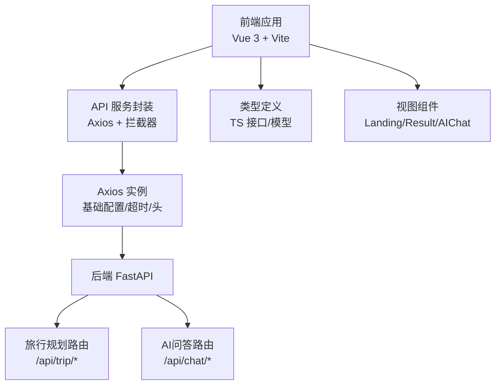
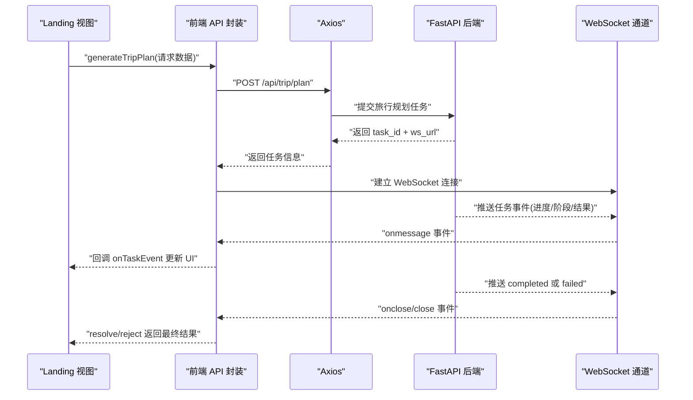
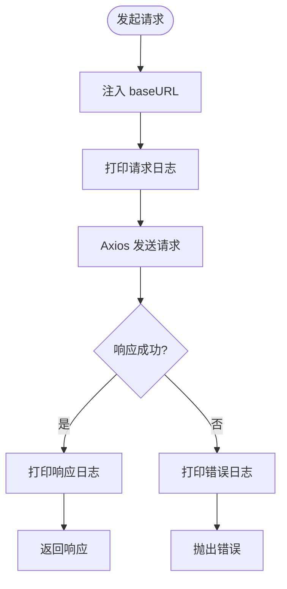
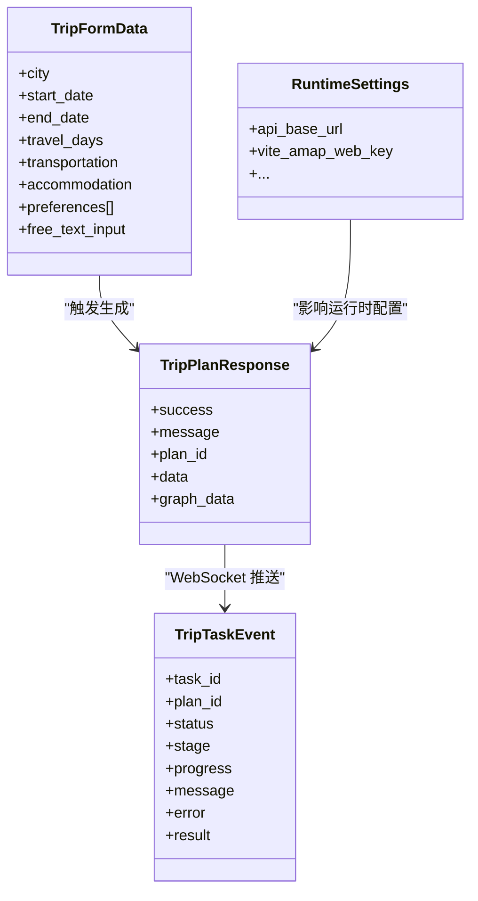
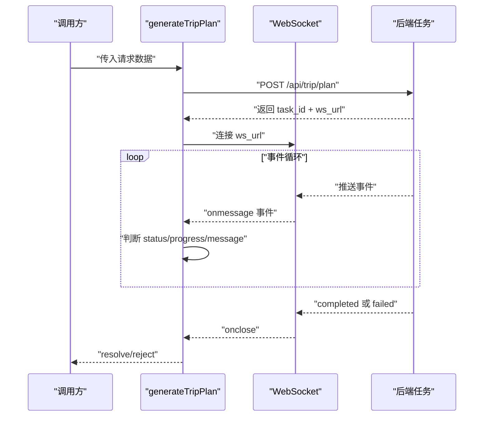
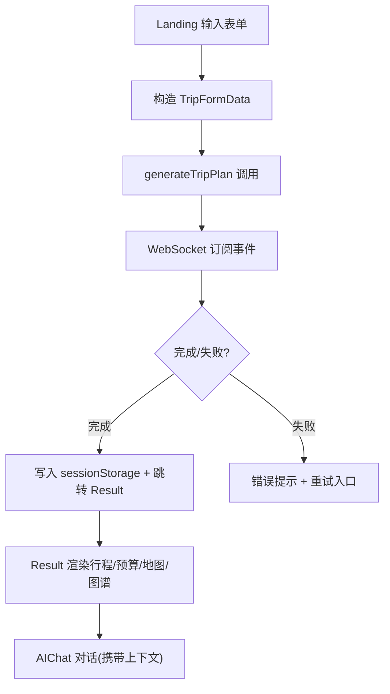
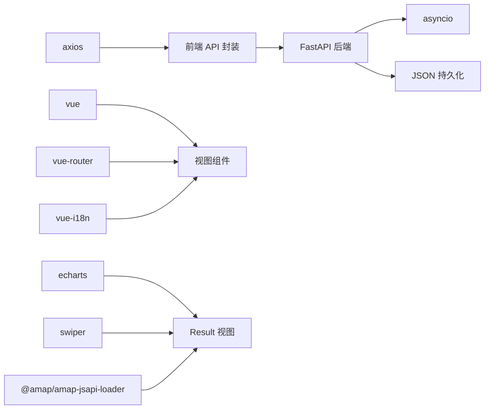

# API 集成

<cite>
**本文引用的文件**
- [frontend/src/services/api.ts](file://frontend/src/services/api.ts)
- [frontend/src/types/index.ts](file://frontend/src/types/index.ts)
- [frontend/src/views/Landing.vue](file://frontend/src/views/Landing.vue)
- [frontend/src/views/Result.vue](file://frontend/src/views/Result.vue)
- [frontend/src/components/AIChat.vue](file://frontend/src/components/AIChat.vue)
- [frontend/src/i18n/index.ts](file://frontend/src/i18n/index.ts)
- [frontend/src/i18n/locales/en.json](file://frontend/src/i18n/locales/en.json)
- [frontend/src/i18n/locales/zh.json](file://frontend/src/i18n/locales/zh.json)
- [backend/app/api/routes/trip.py](file://backend/app/api/routes/trip.py)
- [backend/app/models/schemas.py](file://backend/app/models/schemas.py)
- [backend/app/api/routes/chat.py](file://backend/app/api/routes/chat.py)
- [frontend/package.json](file://frontend/package.json)
</cite>

## 目录
1. [简介](#简介)
2. [项目结构](#项目结构)
3. [核心组件](#核心组件)
4. [架构总览](#架构总览)
5. [详细组件分析](#详细组件分析)
6. [依赖分析](#依赖分析)
7. [性能考虑](#性能考虑)
8. [故障排查指南](#故障排查指南)
9. [结论](#结论)
10. [附录](#附录)

## 简介
本文件面向 TripStar 项目的前端与后端 API 集成，系统性阐述以下主题：
- Axios 配置、请求/响应拦截器实现
- 异步轮询机制设计与 WebSocket 兼容策略
- 错误处理策略（网络错误、业务错误、异常状态码）
- TypeScript 类型定义在 API 集成中的作用与最佳实践
- 性能优化技巧（并发控制、缓存策略、防抖节流）
- 结合前端数据流的实际调用场景，给出端到端的数据处理流程

## 项目结构
前端采用 Vue 3 + Vite 架构，后端采用 FastAPI。API 层位于前端 services 层，类型定义集中在 types 目录，视图组件负责触发 API 并渲染结果。

图表来源
- [frontend/src/services/api.ts:117-147](file://frontend/src/services/api.ts#L117-L147)
- [backend/app/api/routes/trip.py:17-17](file://backend/app/api/routes/trip.py#L17-L17)
- [backend/app/api/routes/chat.py:7-7](file://backend/app/api/routes/chat.py#L7-L7)

章节来源
- [frontend/src/services/api.ts:117-147](file://frontend/src/services/api.ts#L117-L147)
- [backend/app/api/routes/trip.py:17-17](file://backend/app/api/routes/trip.py#L17-L17)
- [backend/app/api/routes/chat.py:7-7](file://backend/app/api/routes/chat.py#L7-L7)

## 核心组件
- Axios 客户端与拦截器：统一设置 baseURL、日志输出、错误透传
- 旅行规划 API：提交任务、轮询状态、WebSocket 实时事件
- 历史计划查询：分页安全限制、稳定返回结构
- AI 行程问答：携带上下文的对话式问答
- 类型系统：TripFormData、TripPlanResponse、TripTaskEvent、RuntimeSettings 等
- 视图层集成：Landing 触发生成、Result 渲染结果、AIChat 对话

章节来源
- [frontend/src/services/api.ts:117-147](file://frontend/src/services/api.ts#L117-L147)
- [frontend/src/services/api.ts:219-331](file://frontend/src/services/api.ts#L219-L331)
- [frontend/src/types/index.ts:79-150](file://frontend/src/types/index.ts#L79-L150)
- [frontend/src/views/Landing.vue:445-526](file://frontend/src/views/Landing.vue#L445-L526)
- [frontend/src/views/Result.vue:569-600](file://frontend/src/views/Result.vue#L569-L600)
- [frontend/src/components/AIChat.vue:219-248](file://frontend/src/components/AIChat.vue#L219-L248)

## 架构总览
前端通过 Axios 发起请求，后端以 FastAPI 路由提供旅行规划与问答能力。旅行规划支持两种消费模式：
- 轮询模式：前端定期查询任务状态
- WebSocket 模式：后端实时推送任务事件，前端即时更新 UI

图表来源
- [frontend/src/services/api.ts:257-318](file://frontend/src/services/api.ts#L257-L318)
- [backend/app/api/routes/trip.py:276-312](file://backend/app/api/routes/trip.py#L276-L312)
- [backend/app/api/routes/trip.py:390-440](file://backend/app/api/routes/trip.py#L390-L440)

章节来源
- [frontend/src/services/api.ts:257-318](file://frontend/src/services/api.ts#L257-L318)
- [backend/app/api/routes/trip.py:276-312](file://backend/app/api/routes/trip.py#L276-L312)
- [backend/app/api/routes/trip.py:390-440](file://backend/app/api/routes/trip.py#L390-L440)

## 详细组件分析

### Axios 配置与拦截器
- 基础配置
  - baseURL 动态来源：优先运行时设置，其次环境变量，最后默认值
  - Content-Type 固定为 application/json
  - 超时：0 表示不设超时，由后端长时间任务决定
- 请求拦截器
  - 注入 baseURL
  - 输出请求日志（方法、URL）
- 响应拦截器
  - 输出响应日志（状态、URL）
  - 统一错误透传，便于上层捕获

图表来源
- [frontend/src/services/api.ts:117-147](file://frontend/src/services/api.ts#L117-L147)

章节来源
- [frontend/src/services/api.ts:117-147](file://frontend/src/services/api.ts#L117-L147)

### 旅行规划 API 设计
- 提交任务
  - POST /api/trip/plan
  - 返回 task_id、plan_id、status、ws_url、message
- 轮询状态
  - GET /api/trip/status/{task_id}
  - 返回 processing/completed/failed 三态及对应字段
- WebSocket 实时事件
  - /api/trip/ws/{task_id}
  - 事件包含 status、stage、progress、message、result/error
- 历史计划
  - GET /api/trip/history?limit=N
  - 安全限制 limit ∈ [1,50]

图表来源
- [frontend/src/types/index.ts:79-150](file://frontend/src/types/index.ts#L79-L150)
- [backend/app/models/schemas.py:188-195](file://backend/app/models/schemas.py#L188-L195)
- [backend/app/models/schemas.py:245-264](file://backend/app/models/schemas.py#L245-L264)

章节来源
- [frontend/src/services/api.ts:219-331](file://frontend/src/services/api.ts#L219-L331)
- [backend/app/api/routes/trip.py:442-488](file://backend/app/api/routes/trip.py#L442-L488)
- [backend/app/api/routes/trip.py:390-440](file://backend/app/api/routes/trip.py#L390-L440)
- [backend/app/models/schemas.py:188-195](file://backend/app/models/schemas.py#L188-L195)
- [frontend/src/types/index.ts:79-150](file://frontend/src/types/index.ts#L79-L150)

### 异步轮询与 WebSocket 兼容机制
- 生成流程
  - submitTripPlan 提交任务，获得 ws_url
  - 生成函数内部创建 WebSocket，监听 onmessage/onerror/onclose
  - 事件中若 status=completed，则解析 result.resolve；若 status=failed，则 reject
- 轮询回退
  - 若 WebSocket 不可用或未返回事件，后端仍提供 /trip/status 接口用于轮询
- 并发与幂等
  - 任务 ID 唯一，避免重复提交
  - 任务状态持久化，服务重启后失败兜底

图表来源
- [frontend/src/services/api.ts:257-318](file://frontend/src/services/api.ts#L257-L318)
- [backend/app/api/routes/trip.py:276-312](file://backend/app/api/routes/trip.py#L276-L312)
- [backend/app/api/routes/trip.py:390-440](file://backend/app/api/routes/trip.py#L390-L440)

章节来源
- [frontend/src/services/api.ts:257-318](file://frontend/src/services/api.ts#L257-L318)
- [backend/app/api/routes/trip.py:276-312](file://backend/app/api/routes/trip.py#L276-L312)
- [backend/app/api/routes/trip.py:390-440](file://backend/app/api/routes/trip.py#L390-L440)

### 错误处理策略
- 网络错误
  - Axios 拦截器统一透传错误，前端捕获并显示国际化文案
- 业务错误
  - 后端返回 error 字段或 detail 字段，前端构造 Error 并抛出
  - 特殊场景：小红书 Cookie 过期，后端返回明确错误文本
- 异常状态码
  - 404：任务不存在
  - 503：服务不可用
- 国际化错误文案
  - i18n 提供统一键值，前端在 catch 中使用 t('api.*') 显示友好提示

章节来源
- [frontend/src/services/api.ts:149-169](file://frontend/src/services/api.ts#L149-L169)
- [frontend/src/services/api.ts:232-252](file://frontend/src/services/api.ts#L232-L252)
- [frontend/src/services/api.ts:323-331](file://frontend/src/services/api.ts#L323-L331)
- [backend/app/api/routes/trip.py:460-488](file://backend/app/api/routes/trip.py#L460-L488)
- [backend/app/api/routes/trip.py:496-507](file://backend/app/api/routes/trip.py#L496-L507)
- [frontend/src/i18n/locales/en.json:29-34](file://frontend/src/i18n/locales/en.json#L29-L34)
- [frontend/src/i18n/locales/zh.json:29-34](file://frontend/src/i18n/locales/zh.json#L29-L34)

### TypeScript 类型定义与使用
- 请求参数类型
  - TripFormData：表单提交的结构化输入
- 响应数据类型
  - TripPlanResponse：成功/失败统一响应包装
  - TripTaskEvent：任务事件结构（状态、进度、消息、结果）
- 运行时设置类型
  - RuntimeSettings/BackendRuntimeSettings：后端运行时配置
- 类型在组件中的使用
  - Landing/Result/AIChat 使用类型进行参数校验与 IDE 提示
  - 与 i18n 键配合，保证错误文案与业务语义一致

章节来源
- [frontend/src/types/index.ts:79-150](file://frontend/src/types/index.ts#L79-L150)
- [frontend/src/views/Landing.vue:281-283](file://frontend/src/views/Landing.vue#L281-L283)
- [frontend/src/views/Result.vue:584-590](file://frontend/src/views/Result.vue#L584-L590)
- [frontend/src/components/AIChat.vue:158-159](file://frontend/src/components/AIChat.vue#L158-L159)

### 健康检查与运行时配置
- 健康检查
  - GET /health：返回服务状态与工具数量
- 运行时配置
  - 读取/更新后端运行时设置，支持本地持久化与事件通知
  - 前端动态切换 API 基地址与地图密钥

章节来源
- [frontend/src/services/api.ts:323-331](file://frontend/src/services/api.ts#L323-L331)
- [frontend/src/services/api.ts:149-214](file://frontend/src/services/api.ts#L149-L214)
- [backend/app/api/routes/trip.py:496-507](file://backend/app/api/routes/trip.py#L496-L507)

### 前端数据流与最佳实践
- Landing 触发生成
  - 构造 TripFormData，调用 generateTripPlan
  - onTaskCreated 设置计划编号，onTaskEvent 更新进度与状态
  - 成功后写入 sessionStorage，跳转 Result
- Result 渲染与回放
  - 从 sessionStorage 读取 tripPlan/graphData/planId
  - 支持编辑模式、预算管理、导出等
- AIChat 对话
  - 以当前行程作为上下文，调用 /api/chat/ask
  - 本地 i18n 键统一错误提示

图表来源
- [frontend/src/views/Landing.vue:445-526](file://frontend/src/views/Landing.vue#L445-L526)
- [frontend/src/views/Result.vue:569-600](file://frontend/src/views/Result.vue#L569-L600)
- [frontend/src/components/AIChat.vue:219-248](file://frontend/src/components/AIChat.vue#L219-L248)

章节来源
- [frontend/src/views/Landing.vue:445-526](file://frontend/src/views/Landing.vue#L445-L526)
- [frontend/src/views/Result.vue:569-600](file://frontend/src/views/Result.vue#L569-L600)
- [frontend/src/components/AIChat.vue:219-248](file://frontend/src/components/AIChat.vue#L219-L248)

## 依赖分析
- 前端依赖
  - axios：HTTP 客户端与拦截器
  - vue、vue-router、ant-design-vue：UI 与路由
  - vue-i18n：国际化
  - echarts、swiper、@amap/amap-jsapi-loader：可视化与地图
- 后端依赖
  - FastAPI：路由与模型校验
  - asyncio：异步任务与队列
  - JSON 文件持久化：任务状态落盘

图表来源
- [frontend/package.json:11-24](file://frontend/package.json#L11-L24)
- [frontend/src/services/api.ts:1-11](file://frontend/src/services/api.ts#L1-L11)
- [frontend/src/views/Result.vue:575-580](file://frontend/src/views/Result.vue#L575-L580)

章节来源
- [frontend/package.json:11-24](file://frontend/package.json#L11-L24)
- [backend/app/api/routes/trip.py:1-17](file://backend/app/api/routes/trip.py#L1-L17)

## 性能考虑
- 超时与并发
  - Axios 超时设为 0，避免前端中断长时间任务；后端任务完成后统一返回
  - 并发控制：单次旅行规划任务为独立任务，避免重复提交
- 缓存策略
  - 历史计划：后端按最近更新时间返回，前端可做本地缓存（sessionStorage）
  - 地图与可视化：按需加载，避免重复初始化
- 防抖与节流
  - 表单日期联动计算旅行天数，使用 watch 防抖
  - WebSocket 事件流已具备去抖效果（事件合并）
- 资源优化
  - 图片懒加载与错误兜底
  - 导出 PDF/Image 前进行进度提示与失败回退

## 故障排查指南
- 常见错误与定位
  - 提交失败：检查后端 /api/trip/plan 是否可达，查看 i18n 错误键
  - 任务不存在：轮询 /api/trip/status/{task_id} 返回 404
  - 服务不可用：/health 返回 503
  - WebSocket 连接失败：检查 ws_url 与网络策略
- 日志与可观测性
  - 前端拦截器输出请求/响应日志
  - 后端打印任务生命周期与异常堆栈
- 国际化与用户体验
  - 使用 i18n 键统一错误文案，避免硬编码

章节来源
- [frontend/src/services/api.ts:124-147](file://frontend/src/services/api.ts#L124-L147)
- [backend/app/api/routes/trip.py:460-488](file://backend/app/api/routes/trip.py#L460-L488)
- [backend/app/api/routes/trip.py:496-507](file://backend/app/api/routes/trip.py#L496-L507)
- [frontend/src/i18n/index.ts:31-37](file://frontend/src/i18n/index.ts#L31-L37)

## 结论
本项目通过 Axios 拦截器实现统一的请求/响应处理，结合后端的异步任务与 WebSocket 实时推送，提供了流畅的旅行规划体验。类型系统贯穿前后端，保障了数据一致性与开发效率。通过合理的错误处理与国际化策略，提升了用户可感知的稳定性与可维护性。建议在生产环境中增加超时与重试策略、任务去重与幂等校验，并对关键路径进行监控埋点。

## 附录
- 关键 API 路径
  - POST /api/trip/plan
  - GET /api/trip/status/{task_id}
  - GET /api/trip/history?limit=N
  - GET /api/trip/ws/{task_id}
  - POST /api/chat/ask
  - GET /health
- 关键类型
  - TripFormData、TripPlanResponse、TripTaskEvent、RuntimeSettings