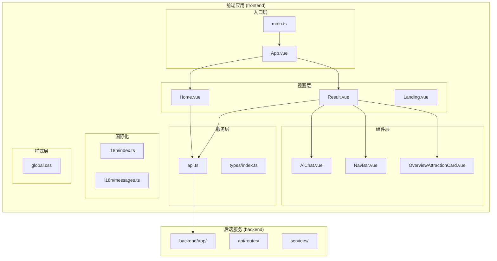
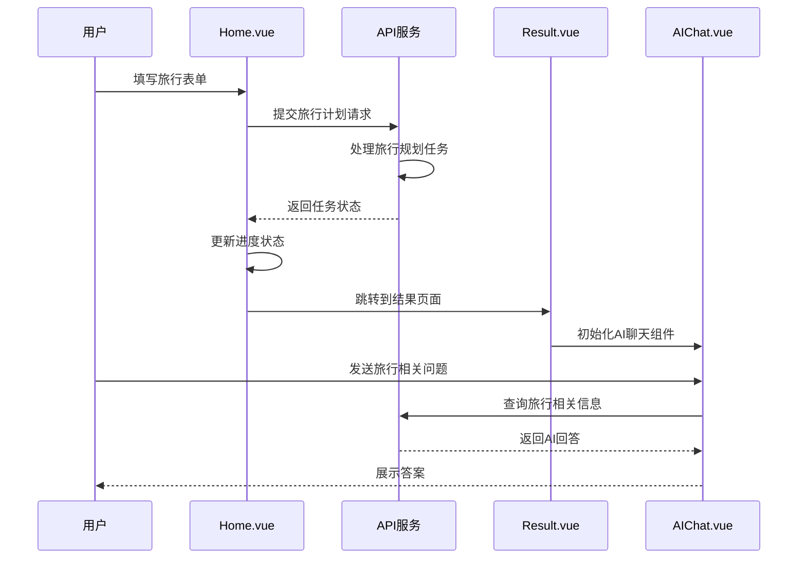
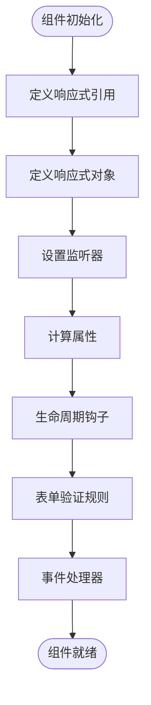
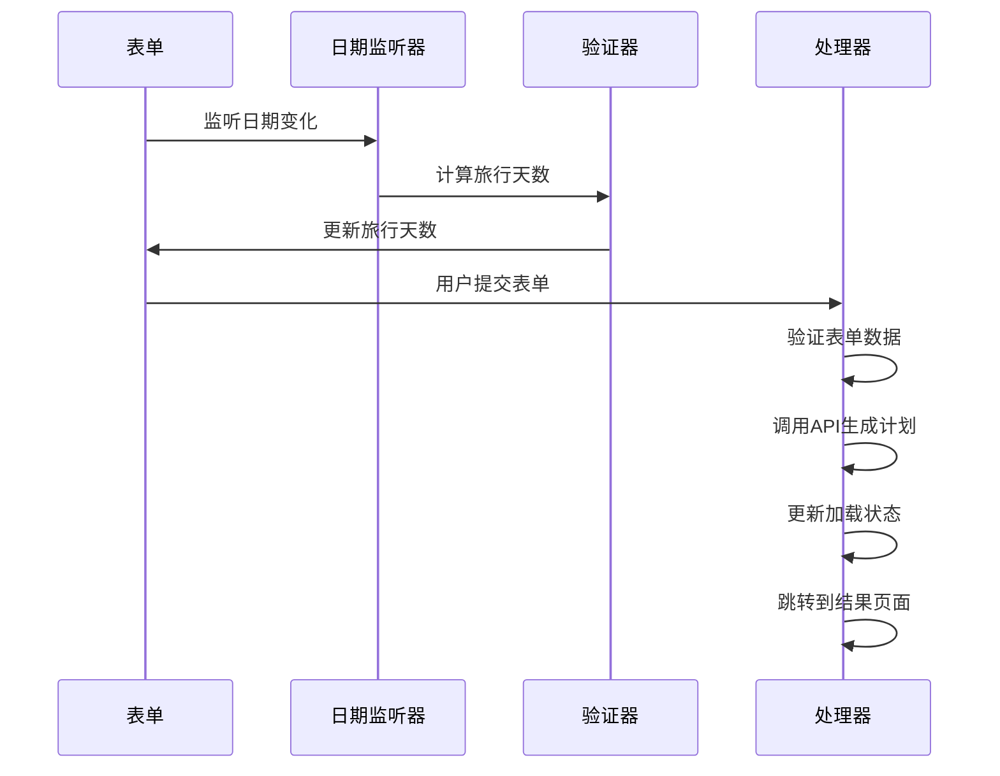
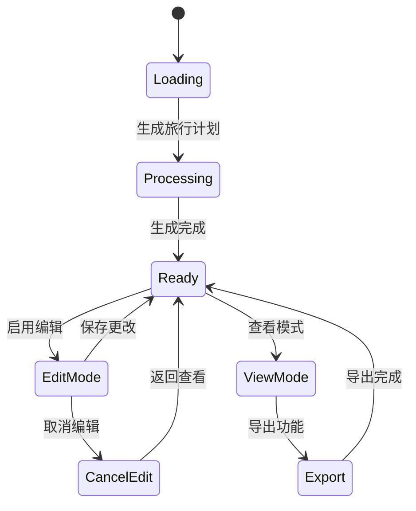
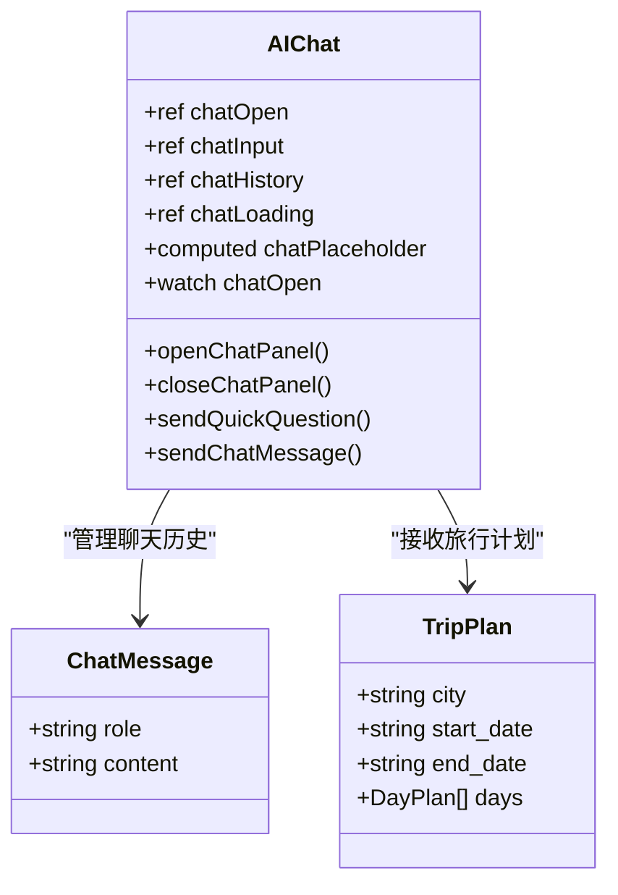
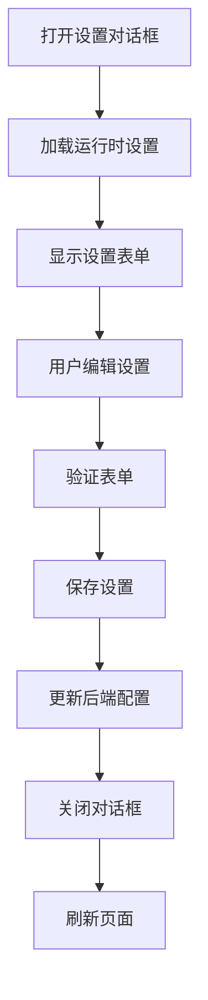
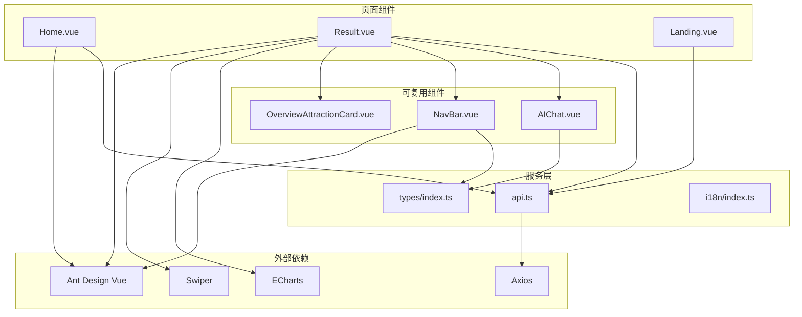
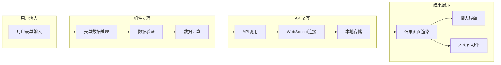
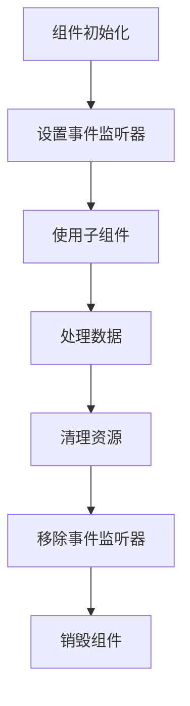

# Vue 组件架构

<cite>
**本文档引用的文件**
- [App.vue](file://frontend/src/App.vue)
- [main.ts](file://frontend/src/main.ts)
- [Home.vue](file://frontend/src/views/Home.vue)
- [Result.vue](file://frontend/src/views/Result.vue)
- [Landing.vue](file://frontend/src/views/Landing.vue)
- [AIChat.vue](file://frontend/src/components/AIChat.vue)
- [NavBar.vue](file://frontend/src/components/NavBar.vue)
- [OverviewAttractionCard.vue](file://frontend/src/components/OverviewAttractionCard.vue)
- [api.ts](file://frontend/src/services/api.ts)
- [types/index.ts](file://frontend/src/types/index.ts)
- [i18n/index.ts](file://frontend/src/i18n/index.ts)
- [global.css](file://frontend/src/styles/global.css)
- [package.json](file://frontend/package.json)
</cite>

## 目录
1. [简介](#简介)
2. [项目结构](#项目结构)
3. [核心组件](#核心组件)
4. [架构概览](#架构概览)
5. [详细组件分析](#详细组件分析)
6. [依赖关系分析](#依赖关系分析)
7. [性能考虑](#性能考虑)
8. [故障排除指南](#故障排除指南)
9. [结论](#结论)
10. [附录](#附录)

## 简介

TripStar 是一个基于 Vue 3 的智能旅行规划应用，采用 Composition API 设计理念，实现了完整的旅行规划流程从表单填写到结果展示的端到端体验。该项目展示了现代 Vue 3 组件化架构的最佳实践，包括响应式数据管理、组件通信、样式封装和国际化支持。

## 项目结构

项目采用清晰的分层架构，主要分为前端应用层和后端服务层：



**图表来源**
- [main.ts:1-35](file://frontend/src/main.ts#L1-L35)
- [App.vue:1-263](file://frontend/src/App.vue#L1-L263)

**章节来源**
- [main.ts:1-35](file://frontend/src/main.ts#L1-L35)
- [App.vue:1-263](file://frontend/src/App.vue#L1-L263)

## 核心组件

### 页面级组件

#### Home.vue - 主要入口页面
Home.vue 实现了完整的旅行规划表单，包含三个步骤的表单设计：
- **步骤1：目的地与日期** - 城市选择、开始结束日期、旅行天数
- **步骤2：偏好设置** - 交通方式、住宿类型、兴趣标签
- **步骤3：额外需求** - 自由文本输入

该组件使用了丰富的响应式数据管理和复杂的业务逻辑处理。

#### Result.vue - 结果展示页面
Result.vue 提供了全面的旅行计划展示功能：
- **多维度导航** - 概览、预算、地图、每日行程、知识图谱、天气
- **交互式组件** - 可编辑模式、导出功能、AI聊天助手
- **复杂数据可视化** - 高德地图集成、ECharts知识图谱、天气信息展示

#### Landing.vue - 登录页面
Landing.vue 实现了带有滚动动画效果的 landing 页面，集成了相同的表单功能但具有不同的视觉呈现。

### 可复用组件

#### AIChat.vue - AI 聊天组件
实现了浮动聊天界面，提供旅行相关的智能问答功能，支持快速问题模板和实时对话。

#### NavBar.vue - 导航栏组件
提供全局导航功能，包括品牌点击、CTA按钮、语言切换、设置对话框等。

#### OverviewAttractionCard.vue - 景点卡片组件
用于展示旅行计划中的景点预览，支持悬停效果和交互功能。

**章节来源**
- [Home.vue:1-800](file://frontend/src/views/Home.vue#L1-L800)
- [Result.vue:1-800](file://frontend/src/views/Result.vue#L1-L800)
- [Landing.vue:1-800](file://frontend/src/views/Landing.vue#L1-L800)
- [AIChat.vue:1-800](file://frontend/src/components/AIChat.vue#L1-L800)
- [NavBar.vue:1-518](file://frontend/src/components/NavBar.vue#L1-L518)
- [OverviewAttractionCard.vue:1-218](file://frontend/src/components/OverviewAttractionCard.vue#L1-L218)

## 架构概览

TripStar 采用了现代化的 Vue 3 架构模式，展示了以下关键特性：



**图表来源**
- [Home.vue:292-370](file://frontend/src/views/Home.vue#L292-L370)
- [Result.vue:569-567](file://frontend/src/views/Result.vue#L569-L567)
- [api.ts:257-318](file://frontend/src/services/api.ts#L257-L318)

### 技术栈架构

项目采用的技术栈体现了现代前端开发的最佳实践：

```mermaid
graph LR
subgraph "前端框架"
vue[Vue 3]
composition[Composition API]
router[Vue Router]
i18n[vue-i18n]
end
subgraph "UI库"
antd[Ant Design Vue]
icons[@ant-design/icons-vue]
end
subgraph "数据处理"
axios[Axios]
dayjs[Day.js]
echarts[ECharts]
swiper[Swiper]
end
subgraph "构建工具"
vite[Vite]
typescript[TypeScript]
sass[Sass]
end
vue --> router
vue --> i18n
vue --> antd
vue --> axios
vue --> dayjs
vue --> echarts
vue --> swiper
vite --> typescript
vite --> sass
```

**图表来源**
- [package.json:11-33](file://frontend/package.json#L11-L33)

**章节来源**
- [package.json:1-35](file://frontend/package.json#L1-L35)

## 详细组件分析

### Home.vue 组件深度解析

#### 响应式数据管理
Home.vue 使用了多种响应式数据模式：



**图表来源**
- [Home.vue:197-371](file://frontend/src/views/Home.vue#L197-L371)

#### 表单处理逻辑
组件实现了复杂的表单处理机制：



**图表来源**
- [Home.vue:276-370](file://frontend/src/views/Home.vue#L276-L370)

**章节来源**
- [Home.vue:197-371](file://frontend/src/views/Home.vue#L197-L371)

### Result.vue 组件深度解析

#### 复杂状态管理
Result.vue 展示了复杂的状态管理模式：



**图表来源**
- [Result.vue:569-800](file://frontend/src/views/Result.vue#L569-L800)

#### 组件间通信机制
Result.vue 通过多种方式实现组件间通信：

1. **Props 传递** - 从父组件接收旅行计划数据
2. **事件发射** - 向子组件传递回调函数
3. **全局状态** - 使用 sessionStorage 存储旅行数据

**章节来源**
- [Result.vue:569-800](file://frontend/src/views/Result.vue#L569-L800)

### AIChat.vue 组件深度解析

#### 浮动聊天界面设计
AIChat.vue 实现了复杂的浮动聊天界面：



**图表来源**
- [AIChat.vue:154-249](file://frontend/src/components/AIChat.vue#L154-L249)
- [types/index.ts:181-195](file://frontend/src/types/index.ts#L181-L195)

**章节来源**
- [AIChat.vue:154-249](file://frontend/src/components/AIChat.vue#L154-L249)

### NavBar.vue 组件深度解析

#### 设置对话框实现
NavBar.vue 实现了完整的设置管理功能：



**图表来源**
- [NavBar.vue:196-230](file://frontend/src/components/NavBar.vue#L196-L230)

**章节来源**
- [NavBar.vue:152-231](file://frontend/src/components/NavBar.vue#L152-L231)

## 依赖关系分析

### 组件依赖图



**图表来源**
- [Home.vue:202-204](file://frontend/src/views/Home.vue#L202-L204)
- [Result.vue:583-583](file://frontend/src/views/Result.vue#L583-L583)
- [AIChat.vue:159-159](file://frontend/src/components/AIChat.vue#L159-L159)

### 数据流分析



**图表来源**
- [api.ts:257-318](file://frontend/src/services/api.ts#L257-L318)

**章节来源**
- [api.ts:1-335](file://frontend/src/services/api.ts#L1-L335)

## 性能考虑

### 响应式数据优化

项目在响应式数据管理方面采用了多种优化策略：

1. **懒加载组件** - 使用动态导入减少初始包大小
2. **虚拟滚动** - 对大量列表数据使用虚拟滚动技术
3. **防抖处理** - 对高频事件使用防抖优化
4. **计算属性缓存** - 利用计算属性的缓存机制

### 内存管理最佳实践



**图表来源**
- [Home.vue:292-370](file://frontend/src/views/Home.vue#L292-L370)

### 性能监控指标

| 指标类别 | 目标值 | 实现方法 |
|---------|--------|----------|
| 首屏加载时间 | < 3秒 | 代码分割、懒加载 |
| 交互响应时间 | < 100ms | 防抖节流、异步处理 |
| 内存使用率 | < 100MB | 组件卸载清理、缓存管理 |
| 图片加载优化 | 响应式图片 | 懒加载、格式优化 |

## 故障排除指南

### 常见问题及解决方案

#### API 连接问题
- **症状**：无法连接到后端服务
- **原因**：环境变量配置错误或网络问题
- **解决方案**：检查 VITE_API_BASE_URL 环境变量

#### 组件渲染问题
- **症状**：组件显示异常或空白
- **原因**：依赖库版本冲突或样式覆盖
- **解决方案**：检查依赖版本兼容性和样式优先级

#### 数据同步问题
- **症状**：前后端数据不一致
- **原因**：WebSocket 连接中断或消息丢失
- **解决方案**：实现重连机制和消息确认

**章节来源**
- [api.ts:117-147](file://frontend/src/services/api.ts#L117-L147)

## 结论

TripStar 项目展示了 Vue 3 组件化架构的完整实现，通过以下关键特性体现了现代前端开发的最佳实践：

1. **模块化设计** - 清晰的组件层次结构和职责分离
2. **响应式数据管理** - 灵活的 Composition API 使用模式
3. **组件通信机制** - 多种通信方式的合理运用
4. **性能优化策略** - 从数据到渲染的全方位优化
5. **可维护性设计** - 类型安全、错误处理和测试友好的架构

该项目为 Vue 3 应用开发提供了优秀的参考范例，特别是在复杂业务场景下的组件化实现和性能优化方面。

## 附录

### 开发环境配置

项目使用 Vite 作为构建工具，支持热重载和快速开发体验。TypeScript 提供了静态类型检查，确保代码质量。

### 部署建议

1. **生产环境优化** - 启用代码压缩和 Tree Shaking
2. **CDN 配置** - 对第三方库使用 CDN 加速
3. **缓存策略** - 合理设置静态资源缓存
4. **监控部署** - 集成性能监控和错误追踪