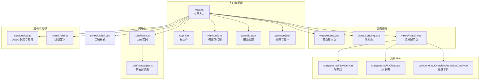
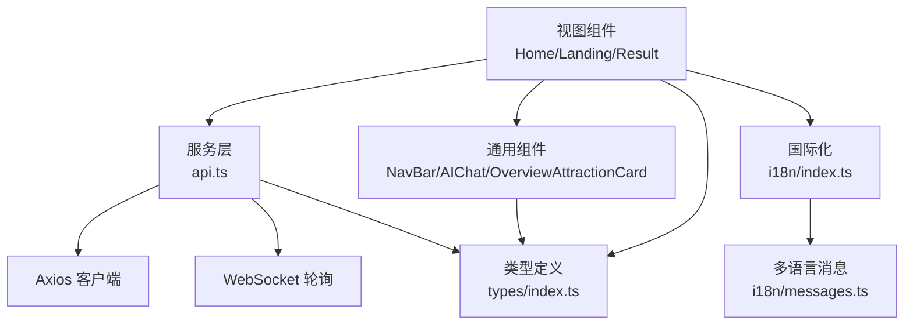
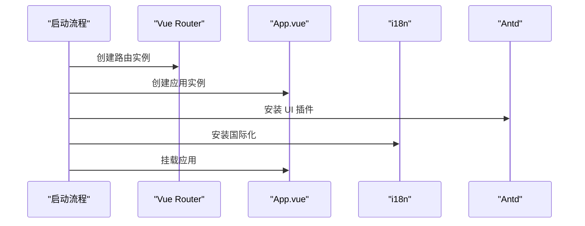
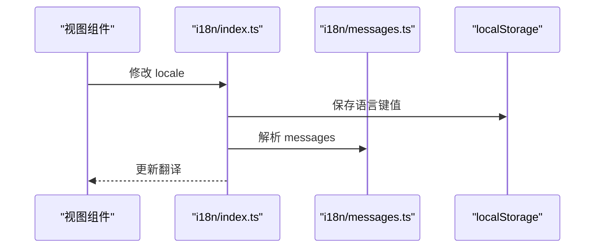
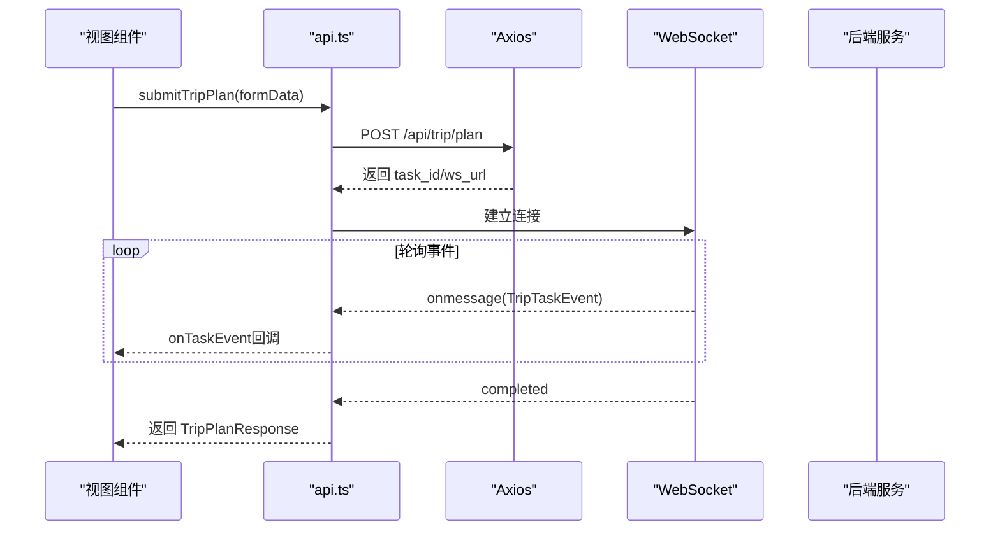
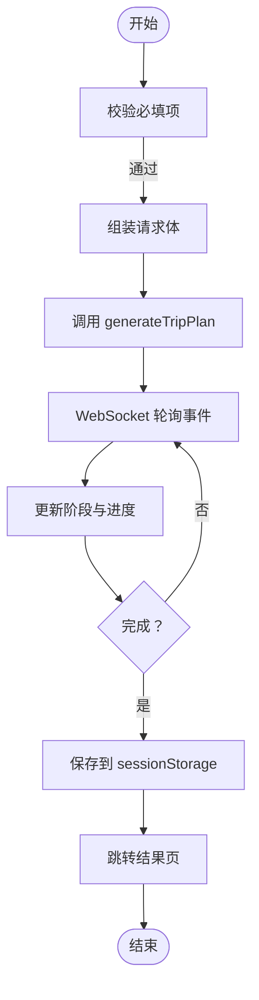
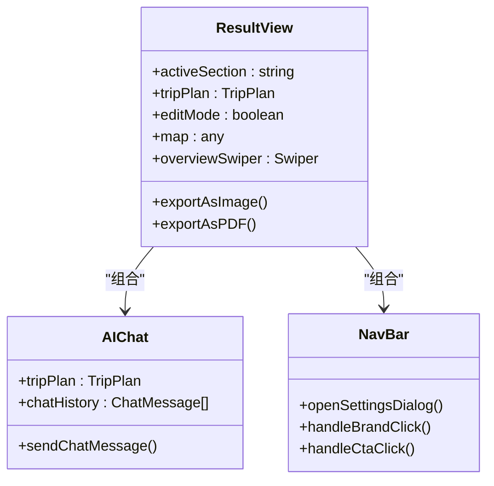
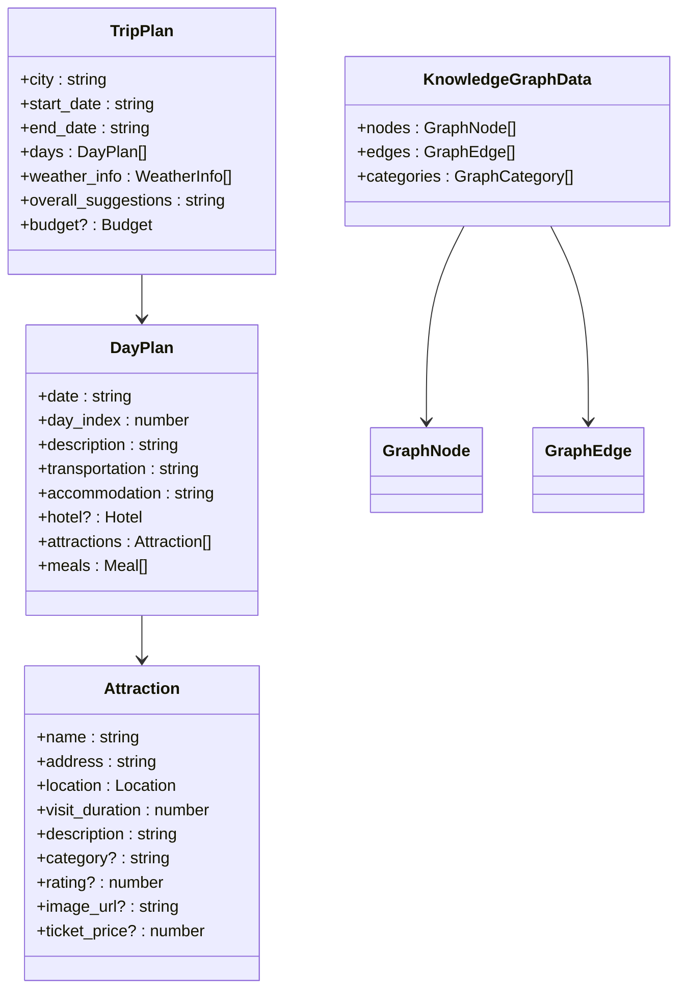
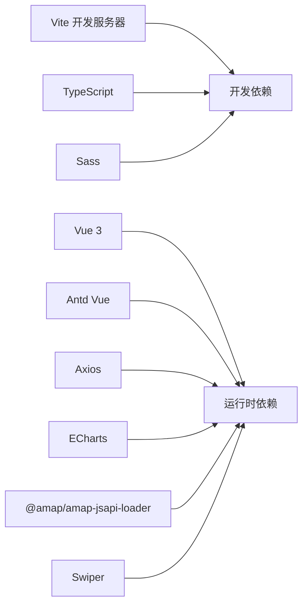

# 前端开发指南

<cite>
**本文档引用的文件**
- [main.ts](file://frontend/src/main.ts)
- [App.vue](file://frontend/src/App.vue)
- [package.json](file://frontend/package.json)
- [vite.config.ts](file://frontend/vite.config.ts)
- [tsconfig.json](file://frontend/tsconfig.json)
- [index.ts](file://frontend/src/i18n/index.ts)
- [messages.ts](file://frontend/src/i18n/messages.ts)
- [api.ts](file://frontend/src/services/api.ts)
- [Home.vue](file://frontend/src/views/Home.vue)
- [Landing.vue](file://frontend/src/views/Landing.vue)
- [Result.vue](file://frontend/src/views/Result.vue)
- [AIChat.vue](file://frontend/src/components/AIChat.vue)
- [NavBar.vue](file://frontend/src/components/NavBar.vue)
- [OverviewAttractionCard.vue](file://frontend/src/components/OverviewAttractionCard.vue)
- [global.css](file://frontend/src/styles/global.css)
- [index.ts](file://frontend/src/types/index.ts)
</cite>

## 目录
1. [简介](#简介)
2. [项目结构](#项目结构)
3. [核心组件](#核心组件)
4. [架构总览](#架构总览)
5. [详细组件分析](#详细组件分析)
6. [依赖关系分析](#依赖关系分析)
7. [性能考虑](#性能考虑)
8. [故障排除指南](#故障排除指南)
9. [结论](#结论)
10. [附录](#附录)

## 简介
本指南面向 TripStar 前端团队，系统性阐述基于 Vue 3 + TypeScript 的前端架构设计与开发实践。内容涵盖组件化开发、状态管理、路由配置、国际化系统、API 集成、数据可视化、样式系统与类型安全最佳实践。文档同时提供关键流程的时序图与类图，帮助开发者快速理解与扩展系统。

## 项目结构
前端采用模块化组织方式，按功能域划分：views（页面）、components（通用组件）、services（API 封装）、i18n（国际化）、types（类型定义）、styles（样式）与根目录配置文件。

**图表来源**
- [main.ts:1-35](file://frontend/src/main.ts#L1-L35)
- [App.vue:1-263](file://frontend/src/App.vue#L1-L263)
- [vite.config.ts:1-24](file://frontend/vite.config.ts#L1-L24)
- [tsconfig.json:1-34](file://frontend/tsconfig.json#L1-L34)
- [package.json:1-35](file://frontend/package.json#L1-L35)

**章节来源**
- [main.ts:1-35](file://frontend/src/main.ts#L1-L35)
- [App.vue:1-263](file://frontend/src/App.vue#L1-L263)
- [vite.config.ts:1-24](file://frontend/vite.config.ts#L1-L24)
- [tsconfig.json:1-34](file://frontend/tsconfig.json#L1-L34)
- [package.json:1-35](file://frontend/package.json#L1-L35)

## 核心组件
- 应用入口与路由：在入口文件中注册路由、UI 组件库与国际化插件，并挂载应用。
- 根组件：提供全局布局、语言切换与国际化标题更新。
- 视图组件：Home/Landing 参数输入页、Result 结果展示页。
- 通用组件：NavBar 导航栏、AIChat 聊天、概览卡片。
- 服务层：Axios 客户端封装、WebSocket 轮询、运行时配置管理。
- 国际化：i18n 实例、本地化消息与动态语言切换。
- 类型系统：统一的数据模型与事件类型，保障类型安全。

**章节来源**
- [main.ts:1-35](file://frontend/src/main.ts#L1-L35)
- [App.vue:52-67](file://frontend/src/App.vue#L52-L67)
- [Home.vue:1-800](file://frontend/src/views/Home.vue#L1-L800)
- [Landing.vue:1-800](file://frontend/src/views/Landing.vue#L1-L800)
- [Result.vue:1-800](file://frontend/src/views/Result.vue#L1-L800)
- [AIChat.vue:1-800](file://frontend/src/components/AIChat.vue#L1-L800)
- [NavBar.vue:1-518](file://frontend/src/components/NavBar.vue#L1-L518)
- [api.ts:1-335](file://frontend/src/services/api.ts#L1-L335)
- [index.ts:1-53](file://frontend/src/i18n/index.ts#L1-L53)
- [messages.ts:1-16](file://frontend/src/i18n/messages.ts#L1-L16)
- [index.ts:1-196](file://frontend/src/types/index.ts#L1-L196)

## 架构总览
前端采用“视图 + 服务 + 类型 + 国际化”的分层架构，通过 Vue 3 Composition API 进行状态与逻辑组织，Ant Design Vue 提供 UI 基础能力，Axios + WebSocket 实现后端通信与实时反馈。

**图表来源**
- [Home.vue:197-371](file://frontend/src/views/Home.vue#L197-L371)
- [Landing.vue:276-527](file://frontend/src/views/Landing.vue#L276-L527)
- [Result.vue:569-800](file://frontend/src/views/Result.vue#L569-L800)
- [api.ts:117-335](file://frontend/src/services/api.ts#L117-L335)
- [index.ts:31-46](file://frontend/src/i18n/index.ts#L31-L46)
- [messages.ts:11-16](file://frontend/src/i18n/messages.ts#L11-L16)
- [index.ts:69-131](file://frontend/src/types/index.ts#L69-L131)

## 详细组件分析

### 路由与应用初始化
- 注册路由：定义首页与结果页路由，使用 History 模式。
- 插件安装：Ant Design Vue、国际化、全局样式。
- 应用挂载：将 App 根组件挂载到 DOM。

**图表来源**
- [main.ts:11-31](file://frontend/src/main.ts#L11-L31)

**章节来源**
- [main.ts:1-35](file://frontend/src/main.ts#L1-L35)

### 国际化系统
- i18n 实例：支持默认语言、回退语言、全局注入与本地存储持久化。
- 语言切换：监听语言变更，更新文档语言属性与页面标题。
- 多语言资源：中文、日文、英文三语映射。

**图表来源**
- [index.ts:31-46](file://frontend/src/i18n/index.ts#L31-L46)
- [messages.ts:11-16](file://frontend/src/i18n/messages.ts#L11-L16)

**章节来源**
- [index.ts:1-53](file://frontend/src/i18n/index.ts#L1-L53)
- [messages.ts:1-16](file://frontend/src/i18n/messages.ts#L1-L16)
- [App.vue:57-66](file://frontend/src/App.vue#L57-L66)

### API 集成与轮询机制
- Axios 配置：全局 baseURL、超时、请求/响应拦截器。
- 运行时设置：后端运行时配置读取与保存，支持本地存储持久化。
- 旅行计划生成：提交任务 → 轮询 WebSocket 事件 → 完成后返回结果。
- 健康检查：后端健康状态探测。

**图表来源**
- [api.ts:219-318](file://frontend/src/services/api.ts#L219-L318)

**章节来源**
- [api.ts:1-335](file://frontend/src/services/api.ts#L1-L335)

### 参数输入页面（Home/Landing）
- 表单设计：三步式表单（目的地与日期、偏好设置、额外需求），支持日期联动计算旅行天数。
- 加载进度：WebSocket 事件驱动的进度条与阶段提示。
- 数据存储：生成完成后将计划与知识图谱数据写入 sessionStorage，供结果页使用。

**图表来源**
- [Home.vue:292-370](file://frontend/src/views/Home.vue#L292-L370)
- [Landing.vue:445-526](file://frontend/src/views/Landing.vue#L445-L526)

**章节来源**
- [Home.vue:197-371](file://frontend/src/views/Home.vue#L197-L371)
- [Landing.vue:276-527](file://frontend/src/views/Landing.vue#L276-L527)

### 结果展示页面（Result）
- 多面板导航：概览、预算、地图、每日行程、知识图谱、天气。
- 地图集成：高德地图加载与渲染。
- 知识图谱：ECharts 可视化节点与边。
- 编辑模式：支持修改行程细节并导出为图片/PDF。
- AI 聊天：浮动聊天组件，基于后端对话接口。

**图表来源**
- [Result.vue:569-800](file://frontend/src/views/Result.vue#L569-L800)
- [AIChat.vue:154-248](file://frontend/src/components/AIChat.vue#L154-L248)
- [NavBar.vue:152-231](file://frontend/src/components/NavBar.vue#L152-L231)

**章节来源**
- [Result.vue:1-800](file://frontend/src/views/Result.vue#L1-L800)
- [AIChat.vue:1-800](file://frontend/src/components/AIChat.vue#L1-L800)
- [NavBar.vue:1-518](file://frontend/src/components/NavBar.vue#L1-L518)

### 样式系统与主题
- 全局样式：引入第三方字体与基础样式，提供暗色主题与玻璃拟物效果。
- 暗黑风格：渐变背景、毛玻璃滤镜、阴影与高亮色彩搭配。
- 响应式设计：媒体查询适配移动端与小屏设备。
- 主题定制：通过 CSS 变量与 Ant Design Vue 主题覆盖实现。

**章节来源**
- [global.css:1-800](file://frontend/src/styles/global.css#L1-L800)
- [App.vue:69-262](file://frontend/src/App.vue#L69-L262)

### TypeScript 类型安全
- 数据模型：行程、景点、餐食、酒店、天气、预算、知识图谱节点与边等。
- 任务事件：任务状态、阶段、进度与消息。
- 运行时设置：后端密钥与 API 基地址等。

**图表来源**
- [index.ts:69-177](file://frontend/src/types/index.ts#L69-L177)

**章节来源**
- [index.ts:1-196](file://frontend/src/types/index.ts#L1-L196)

## 依赖关系分析
- 构建与开发：Vite 提供开发服务器与代理；TypeScript 提供类型检查；Ant Design Vue 提供 UI 组件。
- 运行时依赖：Axios、ECharts、高德 JSAPI 加载器、Swiper、dayjs、html2canvas、jspdf。
- 开发依赖：Sass、TypeScript、Vite 插件等。

**图表来源**
- [package.json:11-33](file://frontend/package.json#L11-L33)

**章节来源**
- [package.json:1-35](file://frontend/package.json#L1-L35)
- [vite.config.ts:1-24](file://frontend/vite.config.ts#L1-L24)
- [tsconfig.json:1-34](file://frontend/tsconfig.json#L1-L34)

## 性能考虑
- 组件懒加载：对大型视图组件采用动态导入以减少首屏体积。
- 图片与资源：使用占位图与错误回退，避免阻塞渲染。
- 轮询优化：WebSocket 替代长轮询，降低网络开销；事件节流与去重。
- 样式优化：CSS 变量与局部作用域样式，避免全局污染。
- 打包优化：启用 Tree Shaking、按需引入组件与图标。

## 故障排除指南
- 国际化问题：确认本地存储语言键值与浏览器语言匹配；检查 i18n 实例初始化。
- API 调用失败：检查 baseURL 与代理配置；查看请求/响应拦截器日志；验证后端健康状态。
- WebSocket 断连：确认 ws_url 协议与 baseURL；捕获 onerror/onclose 并重试或提示。
- 地图/图表渲染异常：检查高德密钥与加载器配置；确保容器尺寸正确。
- 类型错误：核对 types/index.ts 中的接口定义；确保服务层返回数据与类型一致。

**章节来源**
- [index.ts:39-46](file://frontend/src/i18n/index.ts#L39-L46)
- [api.ts:117-147](file://frontend/src/services/api.ts#L117-L147)
- [api.ts:268-317](file://frontend/src/services/api.ts#L268-L317)
- [Result.vue:575-580](file://frontend/src/views/Result.vue#L575-L580)

## 结论
本指南从架构、组件、国际化、API 集成、可视化与样式系统等方面全面梳理了 TripStar 前端实现。通过清晰的分层设计与严格的类型约束，系统具备良好的可维护性与扩展性。建议在后续迭代中持续关注性能优化与用户体验细节，保持代码一致性与文档同步更新。

## 附录
- 开发命令：dev/build/preview
- 代理规则：/api → 后端服务地址
- 环境变量：VITE_API_BASE_URL、VITE_AMAP_WEB_JS_KEY

**章节来源**
- [package.json:6-10](file://frontend/package.json#L6-L10)
- [vite.config.ts:13-21](file://frontend/vite.config.ts#L13-L21)