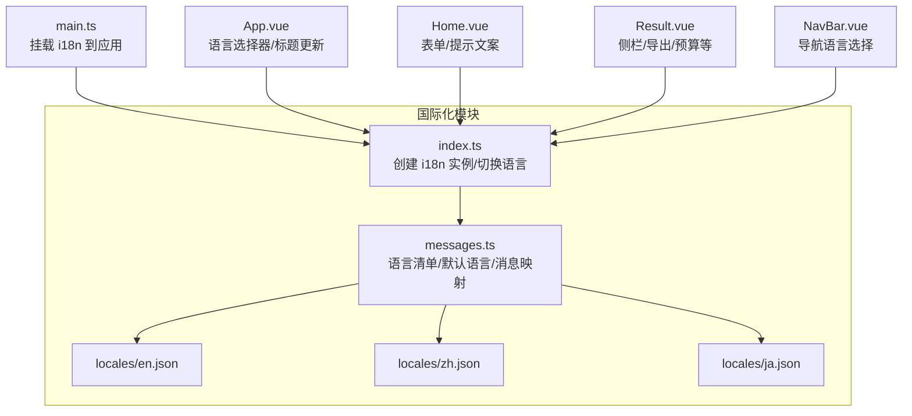
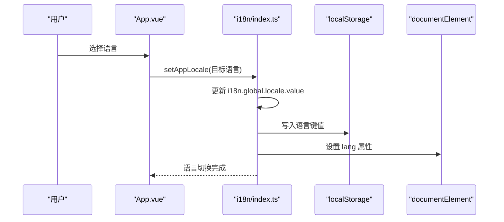
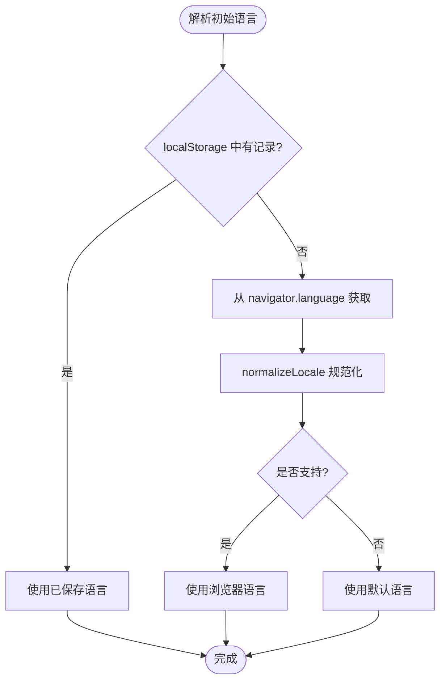
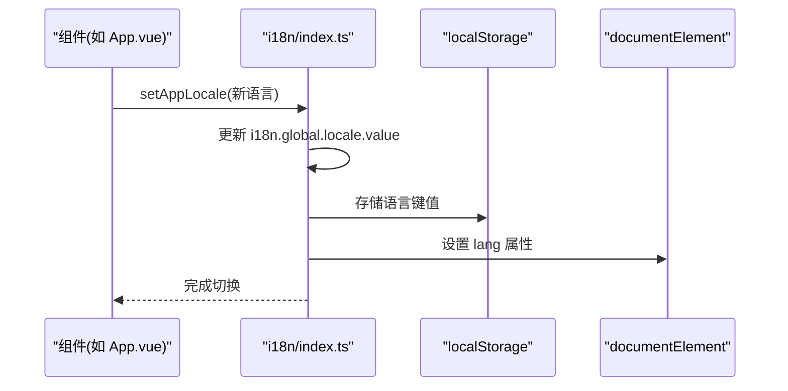
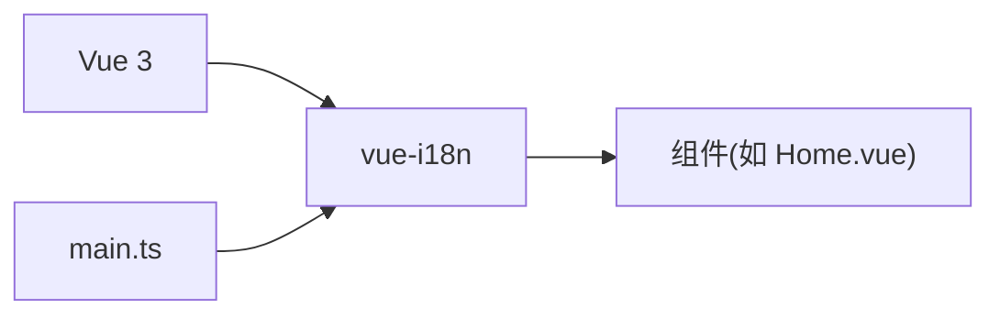

# 国际化系统

<cite>
**本文档引用的文件**
- [frontend/src/i18n/index.ts](file://frontend/src/i18n/index.ts)
- [frontend/src/i18n/messages.ts](file://frontend/src/i18n/messages.ts)
- [frontend/src/i18n/locales/en.json](file://frontend/src/i18n/locales/en.json)
- [frontend/src/i18n/locales/zh.json](file://frontend/src/i18n/locales/zh.json)
- [frontend/src/i18n/locales/ja.json](file://frontend/src/i18n/locales/ja.json)
- [frontend/src/main.ts](file://frontend/src/main.ts)
- [frontend/src/App.vue](file://frontend/src/App.vue)
- [frontend/src/views/Home.vue](file://frontend/src/views/Home.vue)
- [frontend/src/views/Result.vue](file://frontend/src/views/Result.vue)
- [frontend/src/components/NavBar.vue](file://frontend/src/components/NavBar.vue)
- [frontend/src/types/index.ts](file://frontend/src/types/index.ts)
- [frontend/package.json](file://frontend/package.json)
</cite>

## 目录
1. [简介](#简介)
2. [项目结构](#项目结构)
3. [核心组件](#核心组件)
4. [架构总览](#架构总览)
5. [详细组件分析](#详细组件分析)
6. [依赖关系分析](#依赖关系分析)
7. [性能考虑](#性能考虑)
8. [故障排查指南](#故障排查指南)
9. [结论](#结论)
10. [附录](#附录)

## 简介
本指南面向 TripStar 项目的前端国际化实现，基于 vue-i18n 构建，覆盖语言包组织、动态语言切换、占位符与复数处理、浏览器语言检测与回退、本地化资源管理策略，并结合项目实际案例展示中英日三语支持的完整流程。文档同时提供最佳实践建议，帮助开发者在多语言场景下保持一致性与可维护性。

## 项目结构
国际化相关代码集中在 frontend/src/i18n 目录，包含：
- 配置入口：index.ts
- 语言清单与消息映射：messages.ts
- 语言包 JSON：locales/{en,zh,ja}.json
- 应用集成：main.ts
- 使用示例：App.vue、Home.vue、Result.vue、NavBar.vue

图表来源
- [frontend/src/i18n/index.ts:1-53](file://frontend/src/i18n/index.ts#L1-L53)
- [frontend/src/i18n/messages.ts:1-16](file://frontend/src/i18n/messages.ts#L1-L16)
- [frontend/src/i18n/locales/en.json:1-293](file://frontend/src/i18n/locales/en.json#L1-L293)
- [frontend/src/i18n/locales/zh.json:1-293](file://frontend/src/i18n/locales/zh.json#L1-L293)
- [frontend/src/i18n/locales/ja.json:1-293](file://frontend/src/i18n/locales/ja.json#L1-L293)
- [frontend/src/main.ts:1-35](file://frontend/src/main.ts#L1-L35)
- [frontend/src/App.vue:1-263](file://frontend/src/App.vue#L1-L263)
- [frontend/src/views/Home.vue:1-883](file://frontend/src/views/Home.vue#L1-L883)
- [frontend/src/views/Result.vue:1-4312](file://frontend/src/views/Result.vue#L1-L4312)
- [frontend/src/components/NavBar.vue:1-518](file://frontend/src/components/NavBar.vue#L1-L518)

章节来源
- [frontend/src/i18n/index.ts:1-53](file://frontend/src/i18n/index.ts#L1-L53)
- [frontend/src/i18n/messages.ts:1-16](file://frontend/src/i18n/messages.ts#L1-L16)
- [frontend/src/i18n/locales/en.json:1-293](file://frontend/src/i18n/locales/en.json#L1-L293)
- [frontend/src/i18n/locales/zh.json:1-293](file://frontend/src/i18n/locales/zh.json#L1-L293)
- [frontend/src/i18n/locales/ja.json:1-293](file://frontend/src/i18n/locales/ja.json#L1-L293)
- [frontend/src/main.ts:1-35](file://frontend/src/main.ts#L1-L35)

## 核心组件
- i18n 实例创建与配置：负责初始化语言、回退语言、全局注入、消息映射。
- 语言选择与持久化：根据浏览器语言或用户选择设置语言，并写入 localStorage。
- 语言包组织：按功能域划分 JSON 键空间，统一占位符命名与嵌套层级。
- 组件内使用：通过 useI18n 获取 t 函数与 locale，实现动态渲染与标题更新。

章节来源
- [frontend/src/i18n/index.ts:1-53](file://frontend/src/i18n/index.ts#L1-L53)
- [frontend/src/i18n/messages.ts:1-16](file://frontend/src/i18n/messages.ts#L1-L16)
- [frontend/src/App.vue:52-67](file://frontend/src/App.vue#L52-L67)

## 架构总览
整体流程：应用启动时创建 i18n 实例，解析初始语言；用户在界面切换语言时，调用 setAppLocale 更新全局 locale 并持久化；组件通过 t 函数与 locale 响应式地渲染对应语言文本。

图表来源
- [frontend/src/i18n/index.ts:39-46](file://frontend/src/i18n/index.ts#L39-L46)
- [frontend/src/App.vue:59-66](file://frontend/src/App.vue#L59-L66)

## 详细组件分析

### 语言检测与回退机制
- 浏览器语言检测：优先读取 navigator.language，若未提供则回退到默认语言。
- 本地存储优先：若存在本地存储的用户选择，则直接采用该语言。
- 通配匹配：当浏览器语言不完全匹配时，尝试匹配前缀（如 zh-CN -> zh）。
- 默认语言：未命中时使用 DEFAULT_LOCALE。

图表来源
- [frontend/src/i18n/index.ts:17-29](file://frontend/src/i18n/index.ts#L17-L29)
- [frontend/src/i18n/messages.ts:5-9](file://frontend/src/i18n/messages.ts#L5-L9)

章节来源
- [frontend/src/i18n/index.ts:17-29](file://frontend/src/i18n/index.ts#L17-L29)
- [frontend/src/i18n/messages.ts:5-9](file://frontend/src/i18n/messages.ts#L5-L9)

### 动态语言切换与持久化
- 切换函数：setAppLocale 接收 AppLocale，更新全局 locale，并写入 localStorage 与 html lang 属性。
- 响应式更新：App.vue 监听 locale 变化，触发标题与语言选择器联动。
- 路由守卫：可在路由层增加语言切换逻辑以保证页面级一致性。

图表来源
- [frontend/src/i18n/index.ts:39-46](file://frontend/src/i18n/index.ts#L39-L46)
- [frontend/src/App.vue:59-66](file://frontend/src/App.vue#L59-L66)

章节来源
- [frontend/src/i18n/index.ts:39-46](file://frontend/src/i18n/index.ts#L39-L46)
- [frontend/src/App.vue:59-66](file://frontend/src/App.vue#L59-L66)

### 语言包组织与命名规范
- 语言清单：SUPPORTED_LOCALES 定义受支持的语言列表，DEFAULT_LOCALE 作为回退。
- 消息映射：messages 对象将语言标识映射到对应 JSON。
- 键空间划分：按功能域组织（如 app、common、home、result、settings），避免键冲突。
- 占位符命名：统一使用 {name} 形式，便于跨语言替换。
- 嵌套层级：JSON 结构扁平化为主，深层嵌套仅用于语义清晰且必要的场景。

章节来源
- [frontend/src/i18n/messages.ts:5-15](file://frontend/src/i18n/messages.ts#L5-L15)
- [frontend/src/i18n/locales/en.json:1-293](file://frontend/src/i18n/locales/en.json#L1-L293)
- [frontend/src/i18n/locales/zh.json:1-293](file://frontend/src/i18n/locales/zh.json#L1-L293)
- [frontend/src/i18n/locales/ja.json:1-293](file://frontend/src/i18n/locales/ja.json#L1-L293)

### 文本翻译与占位符使用
- 组件内使用：useI18n 获取 t 与 locale，模板中通过 t('xxx') 访问翻译键。
- 占位符替换：传入对象参数进行替换，如 t('home.loading.planCode', { code })。
- 复数与条件：项目中未使用复数规则，可通过自定义函数扩展（见最佳实践）。

章节来源
- [frontend/src/views/Home.vue:212-221](file://frontend/src/views/Home.vue#L212-L221)
- [frontend/src/views/Result.vue:90-91](file://frontend/src/views/Result.vue#L90-L91)
- [frontend/src/components/NavBar.vue:38-43](file://frontend/src/components/NavBar.vue#L38-L43)

### 时间格式化、数字格式化与货币显示
- 当前实现：项目未引入专门的时间/数字/货币格式化库。
- 建议方案：
  - 时间：使用 dayjs 或 Intl.DateTimeFormat，按语言环境格式化日期与时间。
  - 数字：使用 Intl.NumberFormat，处理千分位、小数位与精度。
  - 货币：使用 Intl.NumberFormat 的 style: 'currency'，指定货币代码与最小/最大小数位。
- 集成方式：在 i18n 层封装 format 函数，供组件统一调用。

[本节为通用指导，不直接分析具体文件，故无章节来源]

### 本地化最佳实践
- 键值设计
  - 语义化命名：使用领域.子域.属性路径，如 home.step1。
  - 保持稳定：避免频繁重命名，确保版本升级时键不变。
- 占位符
  - 统一命名：始终使用 {name}，便于翻译记忆与校对。
  - 明确含义：在注释或上下文中说明占位符用途。
- 复数与性别
  - 复数：使用 vue-i18n 的复数规则或自定义函数处理。
  - 性别：通过占位符传递性别参数，配合翻译键选择不同表达。
- 嵌套与扁平
  - 扁平优先：减少层级，提升可读性与维护性。
  - 必要时嵌套：用于强语义分组，如 result.budget.detailType。
- 回退策略
  - 严格回退：优先使用目标语言，缺失键回退到默认语言。
  - 优雅降级：在 UI 上提示缺失键，避免空白输出。

[本节为通用指导，不直接分析具体文件，故无章节来源]

### 三语支持完整流程（中英日）
- 语言清单：zh-CN、ja-JP、en-US。
- 语言包：每个语言维护独立 JSON，键空间一致。
- 切换流程：用户在 App.vue 或 NavBar.vue 选择语言，setAppLocale 更新并持久化。
- 组件适配：所有文案通过 t 函数访问，响应式更新。
- 验证要点：确保占位符与嵌套键在三个语言包中均存在，避免运行时报错。

章节来源
- [frontend/src/i18n/messages.ts:5-15](file://frontend/src/i18n/messages.ts#L5-L15)
- [frontend/src/i18n/locales/en.json:1-293](file://frontend/src/i18n/locales/en.json#L1-L293)
- [frontend/src/i18n/locales/zh.json:1-293](file://frontend/src/i18n/locales/zh.json#L1-L293)
- [frontend/src/i18n/locales/ja.json:1-293](file://frontend/src/i18n/locales/ja.json#L1-L293)
- [frontend/src/App.vue:17-26](file://frontend/src/App.vue#L17-L26)
- [frontend/src/components/NavBar.vue:38-43](file://frontend/src/components/NavBar.vue#L38-L43)

## 依赖关系分析
- vue-i18n 版本：^9.14.4，提供 Composition API 与 Vue 3 兼容。
- 应用集成：main.ts 中 app.use(i18n) 完成全局注入。
- 组件使用：各视图通过 useI18n 获取 t 与 locale，实现响应式翻译。

图表来源
- [frontend/package.json:21-22](file://frontend/package.json#L21-L22)
- [frontend/src/main.ts:31-31](file://frontend/src/main.ts#L31-L31)

章节来源
- [frontend/package.json:21-22](file://frontend/package.json#L21-L22)
- [frontend/src/main.ts:31-31](file://frontend/src/main.ts#L31-L31)

## 性能考虑
- 按需加载：对于大型语言包，可考虑按路由或页面懒加载，减少首屏体积。
- 缓存策略：利用 localStorage 存储用户选择，避免每次刷新重新检测。
- 响应式更新：仅在 locale 变化时触发组件更新，避免不必要的重渲染。
- 键空间优化：合并重复键，减少 JSON 体积与解析成本。

[本节为通用指导，不直接分析具体文件，故无章节来源]

## 故障排查指南
- 语言未生效
  - 检查 setAppLocale 是否被调用，localStorage 是否写入成功。
  - 确认 html lang 属性是否更新。
- 键缺失
  - 在对应语言包中核对键是否存在，必要时补充或迁移。
- 占位符错误
  - 确保传入参数与键定义一致，避免运行时替换失败。
- 标题未更新
  - 确认 App.vue 中 watch 是否监听到 locale 变化并更新 document.title。

章节来源
- [frontend/src/i18n/index.ts:39-46](file://frontend/src/i18n/index.ts#L39-L46)
- [frontend/src/App.vue:59-66](file://frontend/src/App.vue#L59-L66)

## 结论
TripStar 的国际化系统以 vue-i18n 为核心，通过清晰的语言清单、规范的键空间组织与简洁的动态切换机制，实现了中英日三语支持。建议后续在时间/数字/货币格式化方面引入标准化工具，并持续完善键空间与占位符规范，以提升可维护性与用户体验。

## 附录
- 术语
  - 语言标识：如 zh-CN、ja-JP、en-US。
  - 语言包：对应语言的 JSON 文件。
  - 占位符：t 函数中的 {name} 替换项。
- 参考实现位置
  - 语言实例与切换：[frontend/src/i18n/index.ts:1-53](file://frontend/src/i18n/index.ts#L1-L53)
  - 语言清单与映射：[frontend/src/i18n/messages.ts:1-16](file://frontend/src/i18n/messages.ts#L1-L16)
  - 语言包：[frontend/src/i18n/locales/en.json:1-293](file://frontend/src/i18n/locales/en.json#L1-L293)、[frontend/src/i18n/locales/zh.json:1-293](file://frontend/src/i18n/locales/zh.json#L1-L293)、[frontend/src/i18n/locales/ja.json:1-293](file://frontend/src/i18n/locales/ja.json#L1-L293)
  - 应用集成：[frontend/src/main.ts:1-35](file://frontend/src/main.ts#L1-L35)
  - 组件使用示例：[frontend/src/App.vue:1-263](file://frontend/src/App.vue#L1-L263)、[frontend/src/views/Home.vue:1-883](file://frontend/src/views/Home.vue#L1-L883)、[frontend/src/views/Result.vue:1-4312](file://frontend/src/views/Result.vue#L1-L4312)、[frontend/src/components/NavBar.vue:1-518](file://frontend/src/components/NavBar.vue#L1-L518)