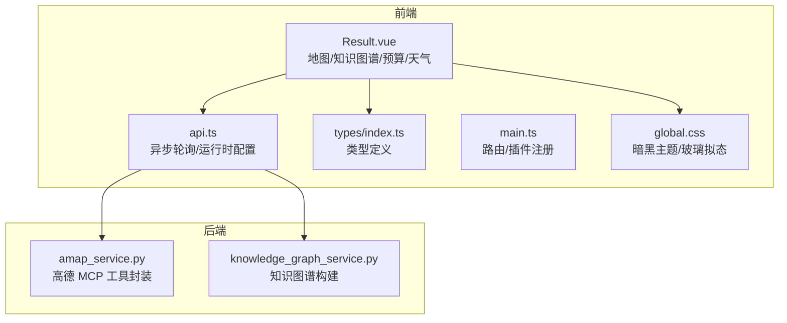
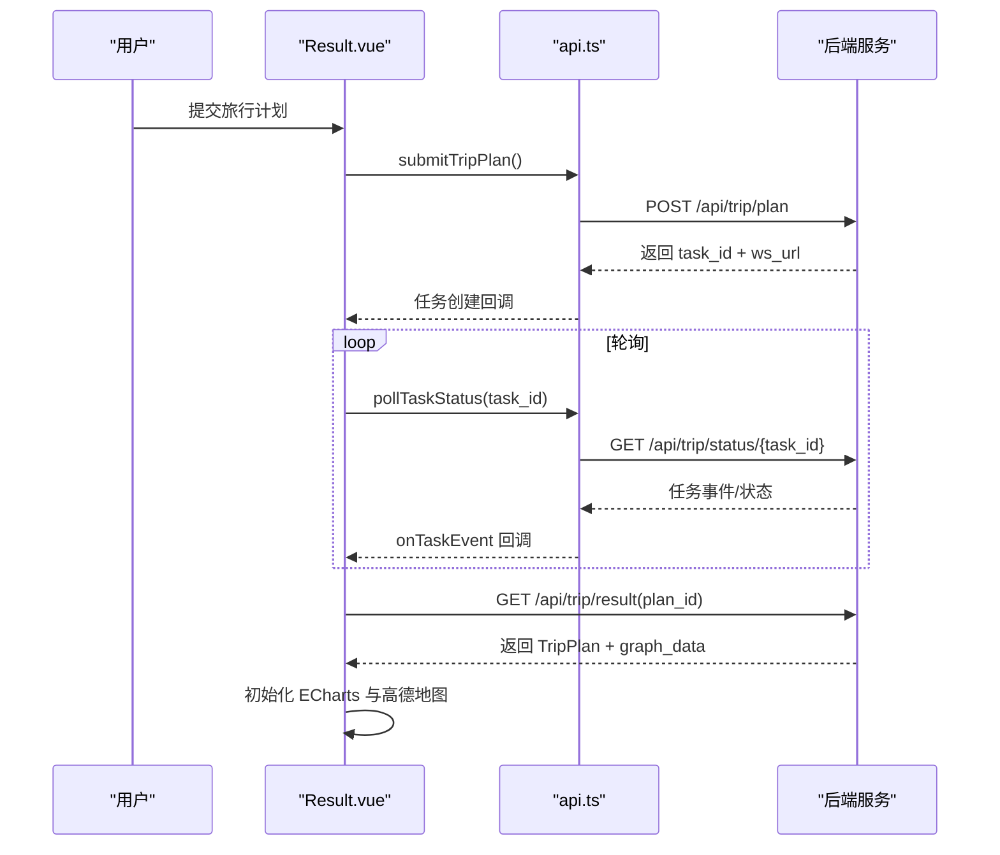
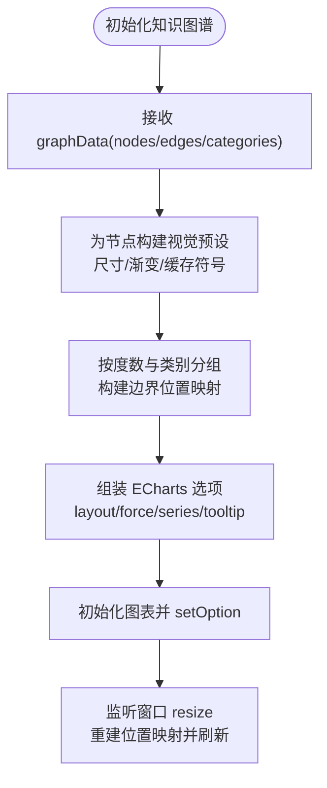
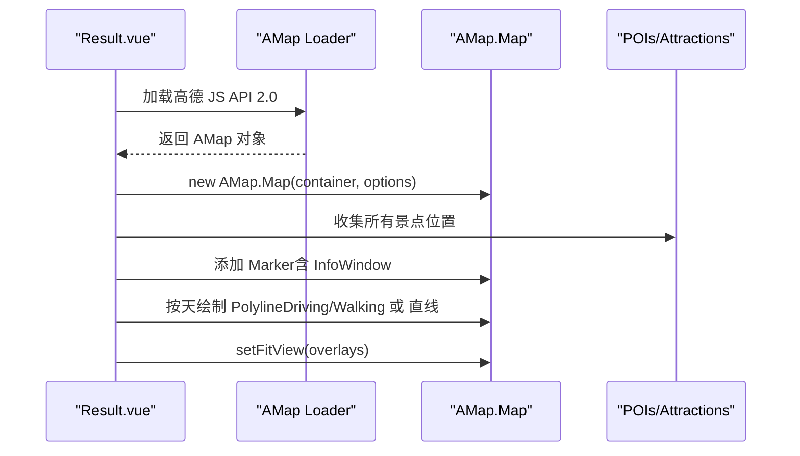
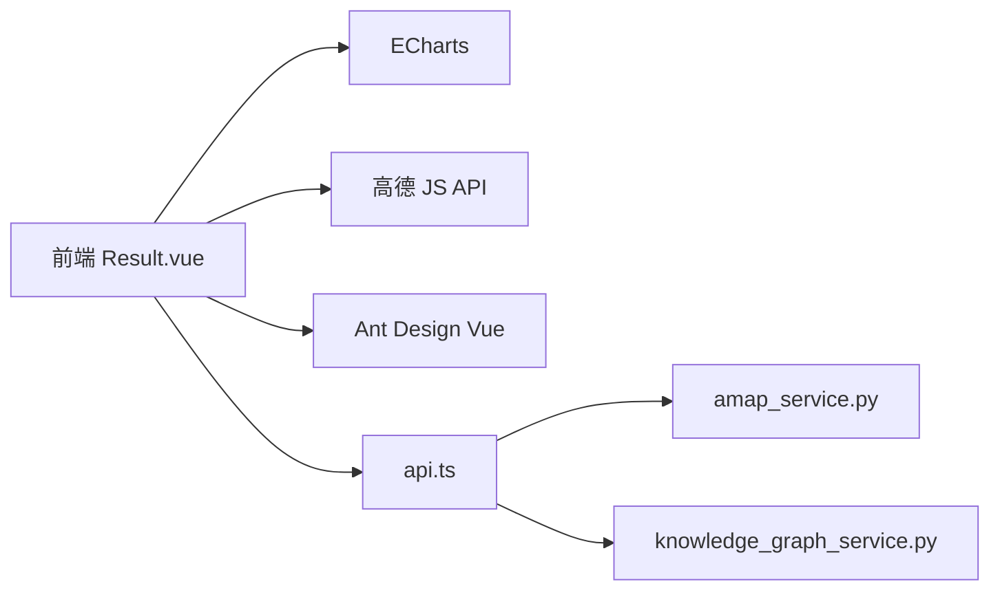

# 数据可视化

<cite>
**本文引用的文件**
- [README.md](file://README.md)
- [main.ts](file://frontend/src/main.ts)
- [package.json](file://frontend/package.json)
- [Result.vue](file://frontend/src/views/Result.vue)
- [types/index.ts](file://frontend/src/types/index.ts)
- [api.ts](file://frontend/src/services/api.ts)
- [global.css](file://frontend/src/styles/global.css)
- [amap_service.py](file://backend/app/services/amap_service.py)
- [knowledge_graph_service.py](file://backend/app/services/knowledge_graph_service.py)
- [index.ts](file://frontend/src/i18n/index.ts)
</cite>

## 目录
1. [引言](#引言)
2. [项目结构](#项目结构)
3. [核心组件](#核心组件)
4. [架构总览](#架构总览)
5. [详细组件分析](#详细组件分析)
6. [依赖分析](#依赖分析)
7. [性能考量](#性能考量)
8. [故障排查指南](#故障排查指南)
9. [结论](#结论)
10. [附录](#附录)

## 引言
本指南围绕 TripStar 项目中的数据可视化实现，系统讲解以下内容：
- ECharts 在 Vue 3 中的集成与使用：图表组件封装、响应式数据绑定、交互事件处理。
- 高德地图组件的集成方案：地图初始化、标记点添加、路线绘制、区域标注。
- 知识图谱可视化：节点布局算法、边连接关系、交互式探索。
- 图表主题定制与样式设计：暗黑主题适配、动画效果、自适应布局。
- 大数据量处理、性能优化与用户体验提升的最佳实践。
- 结合旅行数据场景，展示如何实现直观的可视化与交互体验。

## 项目结构
前端采用 Vue 3 + TypeScript + Vite 构建，后端采用 FastAPI。数据可视化涉及的关键模块如下：
- 前端视图与服务：Result.vue（旅行结果页，承载地图与知识图谱）、api.ts（异步轮询与运行时配置）、types/index.ts（类型定义）。
- 第三方库：ECharts（知识图谱）、高德 JS API（地图）、Ant Design Vue（UI 组件库）。
- 后端服务：amap_service.py（高德 MCP 服务封装）、knowledge_graph_service.py（知识图谱数据构建）。

**图表来源**
- [Result.vue](file://frontend/src/views/Result.vue)
- [api.ts](file://frontend/src/services/api.ts)
- [types/index.ts](file://frontend/src/types/index.ts)
- [main.ts](file://frontend/src/main.ts)
- [global.css](file://frontend/src/styles/global.css)
- [amap_service.py](file://backend/app/services/amap_service.py)
- [knowledge_graph_service.py](file://backend/app/services/knowledge_graph_service.py)

**章节来源**
- [README.md](file://README.md)
- [main.ts](file://frontend/src/main.ts)
- [package.json](file://frontend/package.json)

## 核心组件
- 知识图谱（ECharts graph）：基于旅行计划数据构建节点与边，采用力引导布局，支持拖拽、缩放、强调聚焦、标签截断与自定义提示框。
- 高德地图（JS API 2.0）：动态加载地图、添加景点标记、悬停/点击信息窗、按天绘制路线（驾车/步行），自动视野适配。
- 预算明细与天气面板：Ant Design Vue 卡片与表格，配合暗黑主题与玻璃拟态样式。
- 运行时配置与异步轮询：通过 api.ts 与后端通信，支持 WebSocket 实时任务状态推送。

**章节来源**
- [Result.vue](file://frontend/src/views/Result.vue)
- [types/index.ts](file://frontend/src/types/index.ts)
- [api.ts](file://frontend/src/services/api.ts)
- [global.css](file://frontend/src/styles/global.css)

## 架构总览
前端 Result.vue 作为可视化中枢，负责：
- 从后端获取旅行计划与知识图谱数据。
- 初始化 ECharts 知识图谱与高德地图。
- 响应式渲染预算、天气、每日行程等子视图。
- 通过 api.ts 与后端进行异步任务轮询与运行时配置管理。

**图表来源**
- [Result.vue](file://frontend/src/views/Result.vue)
- [api.ts](file://frontend/src/services/api.ts)

**章节来源**
- [Result.vue](file://frontend/src/views/Result.vue)
- [api.ts](file://frontend/src/services/api.ts)

## 详细组件分析

### ECharts 知识图谱组件
- 数据来源：后端 knowledge_graph_service.py 生成 nodes/edges/categories，前端 Result.vue 接收并渲染。
- 布局与样式：
  - 力引导布局（force），支持重力、斥力、边长与摩擦系数调节。
  - 节点符号采用 SVG 渐变圆形缓存复用，减少重复开销。
  - 标签按节点大小动态截断，避免拥挤。
  - 提示框自定义，支持节点/边信息展示。
  - 图例使用 SVG 点标记替代默认圆点，提升一致性。
- 交互：
  - 支持拖拽固定节点、鼠标滚轮缩放、鼠标悬停强调邻接边与节点。
  - 窗口尺寸变化时重算边界位置映射，防止节点越界。
- 主题与动画：
  - 背景色透明，适配暗黑背景；动画时长与缓动函数可配置。

**图表来源**
- [Result.vue](file://frontend/src/views/Result.vue)
- [knowledge_graph_service.py](file://backend/app/services/knowledge_graph_service.py)

**章节来源**
- [Result.vue](file://frontend/src/views/Result.vue)
- [knowledge_graph_service.py](file://backend/app/services/knowledge_graph_service.py)

### 高德地图组件
- 地图初始化：
  - 通过 @amap/amap-jsapi-loader 动态加载 JS API 2.0，启用 Marker、Polyline、InfoWindow、Driving、Walking 插件。
  - 设置视图模式为 3D，底图样式为暗色主题。
- 标记点添加：
  - 遍历旅行计划中的景点，按全局序号构建标记，设置内容与层级，避免遮挡。
  - 信息窗内容包含景点详情，支持鼠标悬停与点击显示。
- 路线绘制：
  - 按天分组绘制，优先使用真实道路路线（驾车/步行），失败时回退为直线。
  - 路线样式按交通方式区分（颜色、虚线、描边等）。
- 自动视野适配：
  - 若存在路线，则以标记与路线集合自适应视野；否则仅以标记自适应。

**图表来源**
- [Result.vue](file://frontend/src/views/Result.vue)

**章节来源**
- [Result.vue](file://frontend/src/views/Result.vue)

### 预算明细与天气面板
- 预算明细：
  - 支持按类型与排序筛选，展示每日明细与总览，提供编辑与恢复操作。
  - 使用 Ant Design Vue 卡片与表格，配合暗黑主题与玻璃拟态样式。
- 天气面板：
  - 展示每日天气图标、温度、风力、湿度等指标，支持切换与悬停高亮。
  - 使用 CSS 渐变背景与图标动画，增强可读性与交互体验。

**章节来源**
- [Result.vue](file://frontend/src/views/Result.vue)
- [global.css](file://frontend/src/styles/global.css)

### 运行时配置与异步轮询
- 运行时配置：
  - 通过 api.ts 管理后端运行时设置（如高德 Web Key、JS Key），支持本地存储与事件通知。
- 异步轮询：
  - 提交任务后，通过 WebSocket 接收任务事件，实时更新 UI。
  - 轮询接口用于兼容旧流程，保证稳定性。

**章节来源**
- [api.ts](file://frontend/src/services/api.ts)
- [Result.vue](file://frontend/src/views/Result.vue)

## 依赖分析
- 前端依赖：
  - @amap/amap-jsapi-loader：高德地图 JS API 动态加载。
  - echarts：知识图谱可视化。
  - html2canvas/jspdf：导出图片/PDF。
  - ant-design-vue：UI 组件库。
- 后端依赖：
  - amap_service.py：通过 MCP 工具封装高德服务（POI、路线、天气）。
  - knowledge_graph_service.py：将旅行计划转换为知识图谱数据。

**图表来源**
- [package.json](file://frontend/package.json)
- [Result.vue](file://frontend/src/views/Result.vue)
- [api.ts](file://frontend/src/services/api.ts)
- [amap_service.py](file://backend/app/services/amap_service.py)
- [knowledge_graph_service.py](file://backend/app/services/knowledge_graph_service.py)

**章节来源**
- [package.json](file://frontend/package.json)
- [amap_service.py](file://backend/app/services/amap_service.py)
- [knowledge_graph_service.py](file://backend/app/services/knowledge_graph_service.py)

## 性能考量
- 大数据量处理：
  - 知识图谱节点符号与图例样式采用缓存（Map），避免重复生成 SVG。
  - 边界位置映射按类别分组与度数排序，减少布局计算复杂度。
- 渲染优化：
  - ECharts 选项按需组装，仅在数据变更时 setOption；窗口 resize 时增量重算。
  - 高德地图标记层级与内容复用，降低 DOM 数量。
- 交互体验：
  - 动画时长与缓动函数合理配置，兼顾流畅性与性能。
  - 暗黑主题与玻璃拟态在低端设备上适度降低滤镜强度。

[本节为通用指导，无需特定文件引用]

## 故障排查指南
- 高德地图无法加载：
  - 检查运行时 JS Key 是否正确配置（api.ts 读取 localStorage 或后端设置）。
  - 确认 JS API 2.0 插件列表包含所需模块（Marker、Polyline、Driving、Walking）。
- 知识图谱不显示或布局异常：
  - 确认 graphData 的 nodes/edges/categories 结构完整。
  - 检查节点 symbolSize 与 label 配置，避免标签溢出或不可见。
- 导出图片/PDF 失败：
  - html2canvas 渲染失败时检查容器背景色与跨域资源。
  - jspdf/canvg 依赖缺失时安装可选依赖。
- 异步轮询无响应：
  - 检查 WebSocket 地址与后端任务状态推送。
  - 确认 onTaskEvent 回调中对 completed/failed 状态的处理。

**章节来源**
- [api.ts](file://frontend/src/services/api.ts)
- [Result.vue](file://frontend/src/views/Result.vue)

## 结论
TripStar 通过 ECharts 与高德地图实现了旅行数据的直观可视化，结合暗黑主题与玻璃拟态风格，提供了沉浸式的用户体验。知识图谱采用力引导布局与自定义样式，既满足信息密度又兼顾可读性。后端服务通过 MCP 封装高德能力，前端通过异步轮询与运行时配置管理，形成稳定可靠的数据可视化链路。后续可在大数据量场景下进一步优化布局算法与渲染策略，持续提升性能与交互体验。

[本节为总结性内容，无需特定文件引用]

## 附录
- 类型定义参考：TripPlan、DayPlan、Attraction、Hotel、Meal、WeatherInfo、KnowledgeGraphData 等。
- 国际化：i18n 初始化与语言切换逻辑，确保多语言环境下可视化文案一致。

**章节来源**
- [types/index.ts](file://frontend/src/types/index.ts)
- [index.ts](file://frontend/src/i18n/index.ts)