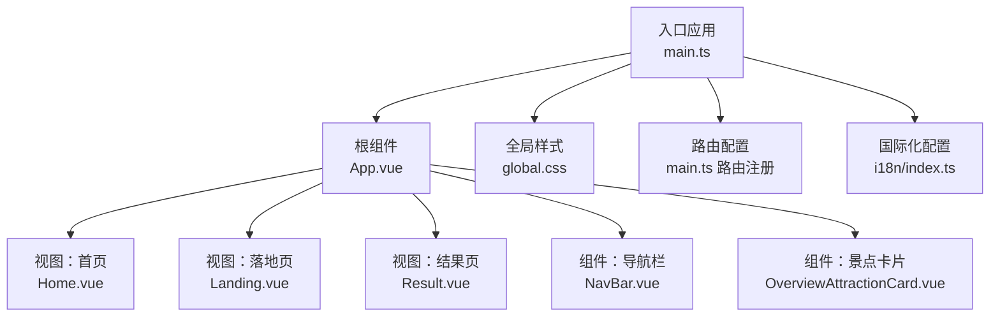
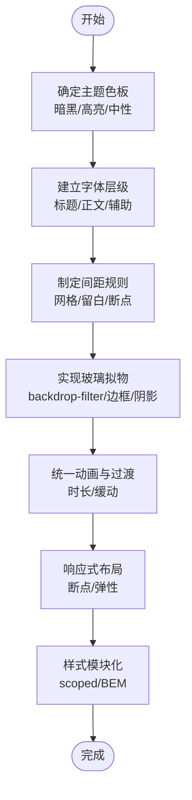
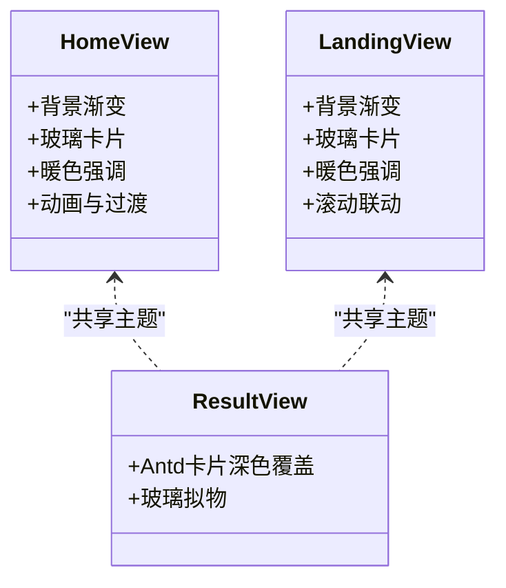
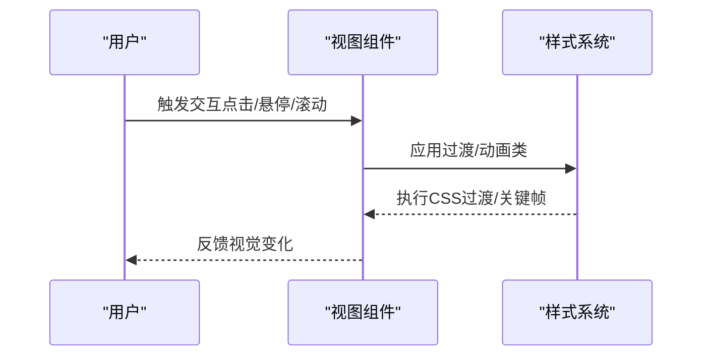
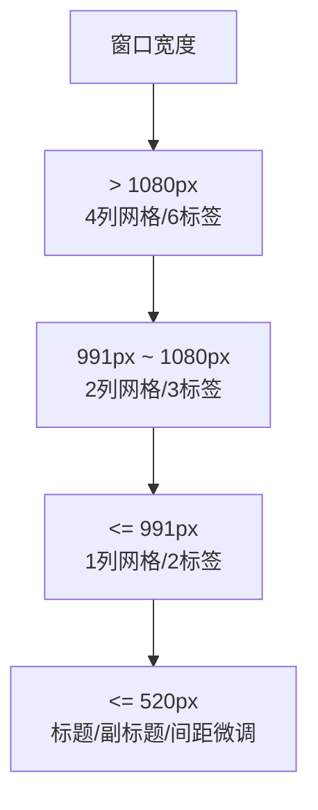
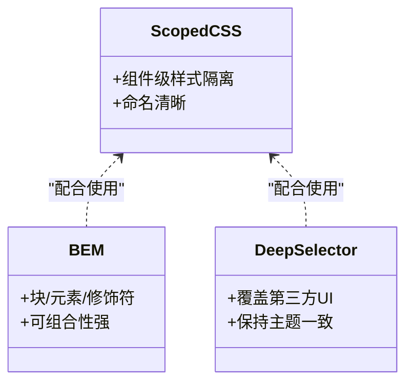
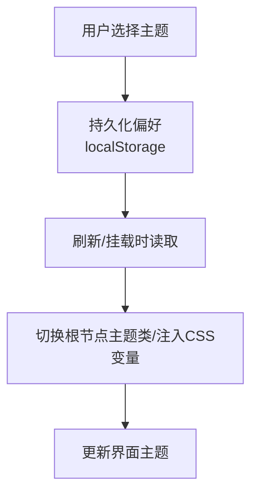
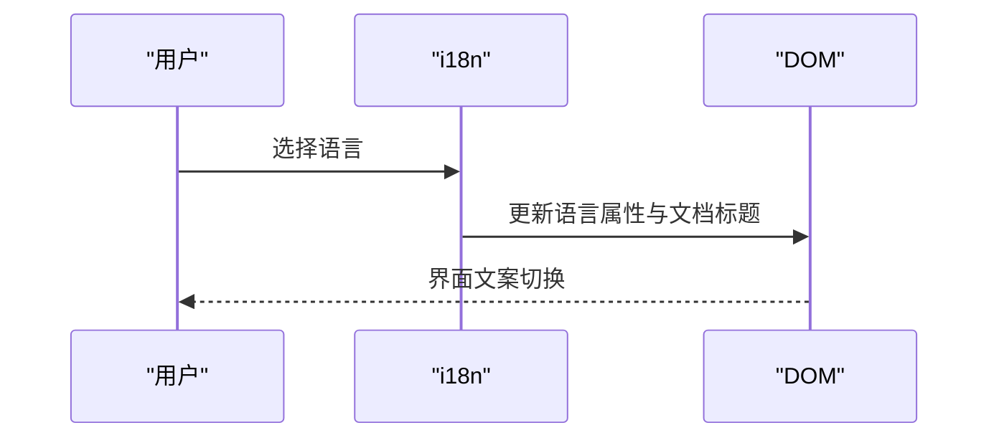
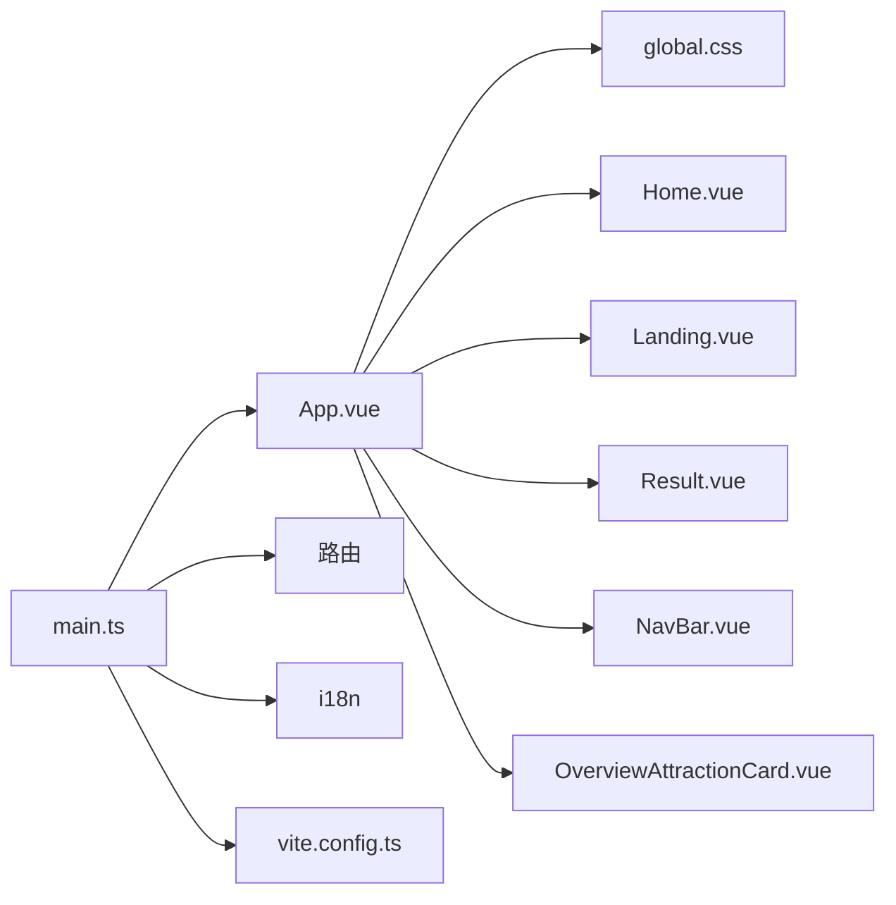

# 样式与主题

<cite>
**本文引用的文件**   
- [frontend/src/styles/global.css](file://frontend/src/styles/global.css)
- [frontend/src/main.ts](file://frontend/src/main.ts)
- [frontend/src/App.vue](file://frontend/src/App.vue)
- [frontend/src/views/Home.vue](file://frontend/src/views/Home.vue)
- [frontend/src/views/Landing.vue](file://frontend/src/views/Landing.vue)
- [frontend/src/views/Result.vue](file://frontend/src/views/Result.vue)
- [frontend/src/components/NavBar.vue](file://frontend/src/components/NavBar.vue)
- [frontend/src/components/OverviewAttractionCard.vue](file://frontend/src/components/OverviewAttractionCard.vue)
- [frontend/vite.config.ts](file://frontend/vite.config.ts)
- [frontend/package.json](file://frontend/package.json)
- [frontend/src/i18n/index.ts](file://frontend/src/i18n/index.ts)
- [frontend/src/i18n/messages.ts](file://frontend/src/i18n/messages.ts)
- [frontend/src/types/index.ts](file://frontend/src/types/index.ts)
</cite>

## 目录
1. [简介](#简介)
2. [项目结构](#项目结构)
3. [核心组件](#核心组件)
4. [架构总览](#架构总览)
5. [详细组件分析](#详细组件分析)
6. [依赖关系分析](#依赖关系分析)
7. [性能考量](#性能考量)
8. [故障排查指南](#故障排查指南)
9. [结论](#结论)
10. [附录](#附录)

## 简介
本指南围绕 TripStar 项目的样式系统与主题设计展开，重点阐述其“暗黑玻璃拟物”风格的设计理念与实现路径，涵盖颜色体系、字体体系、间距体系、响应式布局、动画与过渡、样式模块化策略以及主题切换与个性化定制方案。文档以代码为依据，结合可视化图表，帮助读者快速理解并复用该样式体系。

## 项目结构
前端采用 Vite + Vue 3 架构，样式通过全局 CSS 与组件级 scoped CSS 组合实现。Ant Design Vue 提供基础 UI 能力，项目内未引入 CSS-in-JS 或 CSS Modules，而是通过 scoped CSS 与 BEM 风格命名进行样式隔离与组织。

**图表来源**
- [frontend/src/main.ts:11-35](file://frontend/src/main.ts#L11-L35)
- [frontend/src/App.vue:1-263](file://frontend/src/App.vue#L1-L263)
- [frontend/src/views/Home.vue:1-800](file://frontend/src/views/Home.vue#L1-L800)
- [frontend/src/views/Landing.vue:1-800](file://frontend/src/views/Landing.vue#L1-L800)
- [frontend/src/views/Result.vue:1-200](file://frontend/src/views/Result.vue#L1-L200)
- [frontend/src/components/NavBar.vue:1-518](file://frontend/src/components/NavBar.vue#L1-L518)
- [frontend/src/components/OverviewAttractionCard.vue:1-13](file://frontend/src/components/OverviewAttractionCard.vue#L1-L13)
- [frontend/src/styles/global.css:1-800](file://frontend/src/styles/global.css#L1-L800)

**章节来源**
- [frontend/src/main.ts:1-35](file://frontend/src/main.ts#L1-L35)
- [frontend/src/App.vue:1-263](file://frontend/src/App.vue#L1-L263)
- [frontend/src/styles/global.css:1-800](file://frontend/src/styles/global.css#L1-L800)

## 核心组件
- 根组件与全局样式注入：根组件负责导入全局样式与第三方 reset 样式，统一字体与基础排版；同时通过 scoped CSS 实现品牌视觉（如头部、页脚）与动画。
- 视图层样式：首页与落地页大量使用“暗黑玻璃拟物”风格，通过 backdrop-filter、边框与阴影模拟半透明与层次感；表单控件采用深色主题与自定义 hover/focus 状态。
- 导航栏与交互：导航栏在不同断点下调整布局与元素尺寸，语言选择器与设置弹窗均采用深色主题与圆角设计。
- 结果页与卡片：Ant Design Vue 卡片在深色背景下通过 :deep 选择器覆盖默认样式，保持一致的玻璃拟物外观。

**章节来源**
- [frontend/src/App.vue:69-262](file://frontend/src/App.vue#L69-L262)
- [frontend/src/views/Home.vue:373-800](file://frontend/src/views/Home.vue#L373-L800)
- [frontend/src/views/Landing.vue:529-1224](file://frontend/src/views/Landing.vue#L529-L1224)
- [frontend/src/components/NavBar.vue:233-517](file://frontend/src/components/NavBar.vue#L233-L517)
- [frontend/src/views/Result.vue:1-200](file://frontend/src/views/Result.vue#L1-L200)

## 架构总览
样式系统围绕“暗黑玻璃拟物”主题展开，通过以下方式实现：
- 颜色体系：以深蓝/紫/灰为主基调，辅以暖色高亮（如橙/红），用于强调与交互反馈。
- 字体体系：全局使用无衬线字体，标题与正文分级明确，字号与行距遵循可读性原则。
- 间距体系：采用统一的栅格与留白策略，配合 CSS Grid/Flex 实现复杂布局。
- 动画与过渡：统一的过渡时长与缓动曲线，关键交互（按钮、卡片、导航）具备微动效。
- 响应式：基于断点的网格与布局调整，移动端优先的交互细节优化。

## 详细组件分析

### 暗黑玻璃拟物风格实现
- 背景与渐变：首页与落地页广泛使用多层线性渐变背景，营造深邃氛围。
- 玻璃拟物卡片：通过 rgba 背景色、低不透明度边框、强内阴影与 backdrop-filter 模糊实现。
- 高亮与强调：使用暖色系作为强调色，贯穿按钮、进度条、标签等关键元素。

**图表来源**
- [frontend/src/views/Home.vue:373-800](file://frontend/src/views/Home.vue#L373-L800)
- [frontend/src/views/Landing.vue:529-1224](file://frontend/src/views/Landing.vue#L529-L1224)
- [frontend/src/views/Result.vue:1-200](file://frontend/src/views/Result.vue#L1-L200)

**章节来源**
- [frontend/src/views/Home.vue:373-800](file://frontend/src/views/Home.vue#L373-L800)
- [frontend/src/views/Landing.vue:529-1224](file://frontend/src/views/Landing.vue#L529-L1224)
- [frontend/src/views/Result.vue:1-200](file://frontend/src/views/Result.vue#L1-L200)

### 动画与过渡
- 统一过渡时长：全局与组件内过渡时长与缓动曲线保持一致，提升交互一致性。
- 关键动效：按钮悬停、输入框聚焦、导航栏状态切换、加载指示器旋转等。
- 进度与状态：首页与落地页的加载步骤节点与进度条，使用动画与渐变增强反馈。

**图表来源**
- [frontend/src/styles/global.css:314-351](file://frontend/src/styles/global.css#L314-L351)
- [frontend/src/views/Home.vue:744-800](file://frontend/src/views/Home.vue#L744-L800)
- [frontend/src/views/Landing.vue:1175-1179](file://frontend/src/views/Landing.vue#L1175-L1179)

**章节来源**
- [frontend/src/styles/global.css:314-351](file://frontend/src/styles/global.css#L314-L351)
- [frontend/src/views/Home.vue:744-800](file://frontend/src/views/Home.vue#L744-L800)
- [frontend/src/views/Landing.vue:1175-1179](file://frontend/src/views/Landing.vue#L1175-L1179)

### 响应式设计
- 断点与布局：在 Landing.vue 中针对不同宽度设置了网格列数与元素尺寸，保证在小屏设备上仍具可读性与可用性。
- 移动端优化：导航栏在窄屏下减少元素数量与尺寸，语言选择器与按钮自适应宽度。
- 弹性布局：Flex/Grid 广泛用于表单区域、兴趣标签网格与卡片列表。

**图表来源**
- [frontend/src/views/Landing.vue:1181-1224](file://frontend/src/views/Landing.vue#L1181-L1224)
- [frontend/src/components/NavBar.vue:440-512](file://frontend/src/components/NavBar.vue#L440-L512)

**章节来源**
- [frontend/src/views/Landing.vue:1181-1224](file://frontend/src/views/Landing.vue#L1181-L1224)
- [frontend/src/components/NavBar.vue:440-512](file://frontend/src/components/NavBar.vue#L440-L512)

### 样式模块化与命名规范
- 组件级作用域：Home.vue、Landing.vue、Result.vue、NavBar.vue 等均使用 scoped CSS，避免样式泄漏。
- BEM 风格：类名采用语义化前缀与层级结构（如 .step-section、.field-label、.interest-card），便于维护与扩展。
- Antd 覆盖：通过 :deep 选择器对 Antd 组件进行深色主题覆盖，保持整体风格一致。

**图表来源**
- [frontend/src/views/Home.vue:373-800](file://frontend/src/views/Home.vue#L373-L800)
- [frontend/src/components/NavBar.vue:233-517](file://frontend/src/components/NavBar.vue#L233-L517)
- [frontend/src/views/Result.vue:3896-3947](file://frontend/src/views/Result.vue#L3896-L3947)

**章节来源**
- [frontend/src/views/Home.vue:373-800](file://frontend/src/views/Home.vue#L373-L800)
- [frontend/src/components/NavBar.vue:233-517](file://frontend/src/components/NavBar.vue#L233-L517)
- [frontend/src/views/Result.vue:3896-3947](file://frontend/src/views/Result.vue#L3896-L3947)

### 主题切换与个性化定制
- 当前状态：项目未实现运行时主题切换功能，但具备良好的主题基线（暗色+高亮色）。
- 可行方案：
  - CSS 变量：在根元素或组件根节点定义变量，按需切换主题类名，实现动态主题。
  - 用户偏好存储：结合本地存储与 i18n 的语言偏好机制，持久化用户主题选择。
  - 动态样式更新：通过 JavaScript 切换 CSS 类或注入样式块，即时更新界面主题。

[本图为概念流程，无需图表来源]

**章节来源**
- [frontend/src/i18n/index.ts:6-46](file://frontend/src/i18n/index.ts#L6-L46)

### 国际化与字体系统
- 字体：全局使用无衬线字体，标题分级明确，正文行高与字号符合阅读习惯。
- 国际化：i18n 提供多语言支持，语言选择器与路由守卫联动，确保界面语言与标题同步更新。

**图表来源**
- [frontend/src/i18n/index.ts:39-46](file://frontend/src/i18n/index.ts#L39-L46)
- [frontend/src/App.vue:59-66](file://frontend/src/App.vue#L59-L66)

**章节来源**
- [frontend/src/i18n/index.ts:1-53](file://frontend/src/i18n/index.ts#L1-L53)
- [frontend/src/App.vue:59-66](file://frontend/src/App.vue#L59-L66)

## 依赖关系分析
- 样式依赖：App.vue 引入全局样式与 Ant Design Vue reset；各视图与组件通过 scoped CSS 与 :deep 选择器实现局部样式。
- 构建与代理：Vite 配置了开发服务器端口与后端 API 代理，保障开发体验。
- 第三方库：Ant Design Vue 提供表单、卡片、模态框等 UI 组件，是样式覆盖与主题定制的主要对象。

**图表来源**
- [frontend/src/main.ts:1-35](file://frontend/src/main.ts#L1-L35)
- [frontend/src/App.vue:1-263](file://frontend/src/App.vue#L1-L263)
- [frontend/src/styles/global.css:1-800](file://frontend/src/styles/global.css#L1-L800)
- [frontend/vite.config.ts:1-24](file://frontend/vite.config.ts#L1-L24)

**章节来源**
- [frontend/src/main.ts:1-35](file://frontend/src/main.ts#L1-L35)
- [frontend/vite.config.ts:1-24](file://frontend/vite.config.ts#L1-L24)

## 性能考量
- 样式体积：全局样式包含大量动画与过渡定义，建议在生产环境按需裁剪或拆分。
- 渲染性能：玻璃拟物依赖 backdrop-filter 与阴影，低端设备可能影响滚动性能；可通过媒体查询在低性能设备禁用模糊或阴影。
- 资源加载：字体与图片懒加载有助于首屏性能；组件内 SVG 图标可内联减少请求。

[本节为通用指导，无需章节来源]

## 故障排查指南
- 样式冲突：若出现第三方组件样式被覆盖异常，检查 :deep 选择器的优先级与作用范围。
- 动画卡顿：在低端设备关闭模糊或减少阴影，或降低动画频率。
- 响应式异常：核对断点设置与网格列数，确保在目标设备上生效。

**章节来源**
- [frontend/src/views/Result.vue:3896-3947](file://frontend/src/views/Result.vue#L3896-L3947)
- [frontend/src/views/Landing.vue:1181-1224](file://frontend/src/views/Landing.vue#L1181-L1224)

## 结论
TripStar 的样式系统以“暗黑玻璃拟物”为核心，通过统一的颜色、字体、间距与动画体系，实现了高辨识度与良好可读性的界面。组件级 scoped CSS 与 BEM 命名规范确保了样式模块化与可维护性。未来可在现有基础上引入 CSS 变量与主题切换机制，进一步增强个性化与可扩展性。

## 附录
- 类型与数据：TripPlan、TripFormData、RuntimeSettings 等类型定义为样式与交互提供数据支撑。
- 开发工具：Vite 提供热更新与代理能力，Ant Design Vue 提供丰富的 UI 组件与交互模式。

**章节来源**
- [frontend/src/types/index.ts:69-150](file://frontend/src/types/index.ts#L69-L150)
- [frontend/package.json:11-33](file://frontend/package.json#L11-L33)