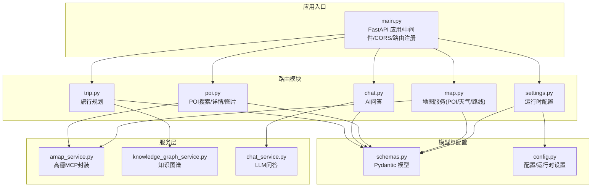
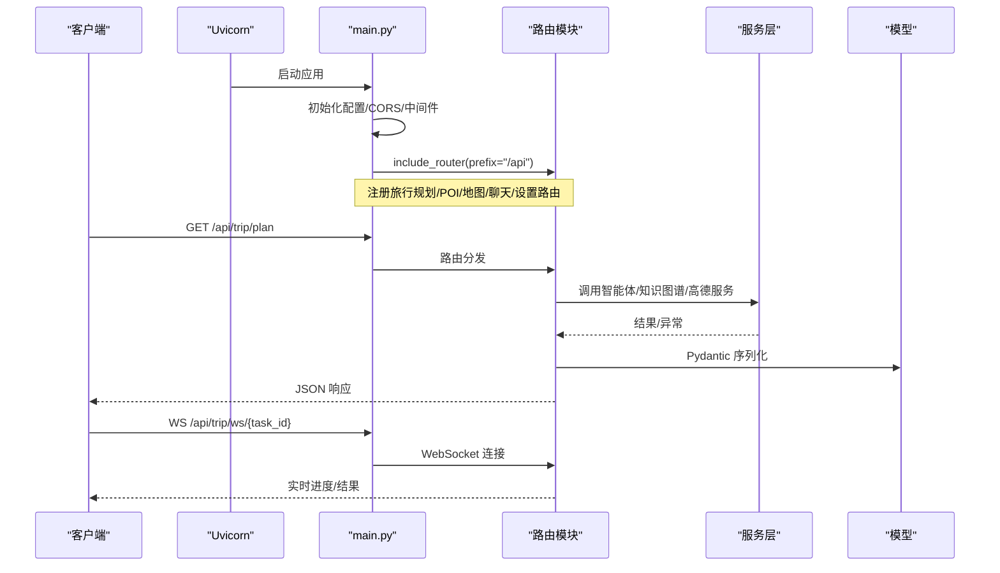
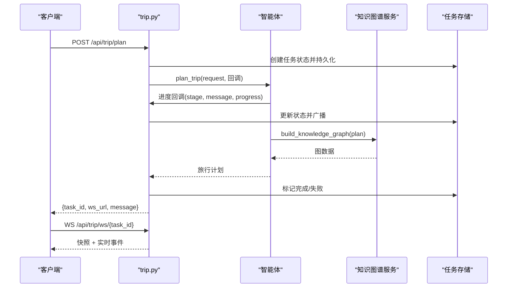
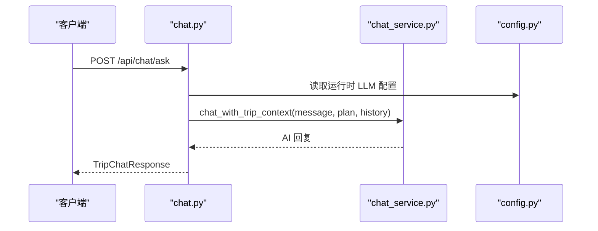
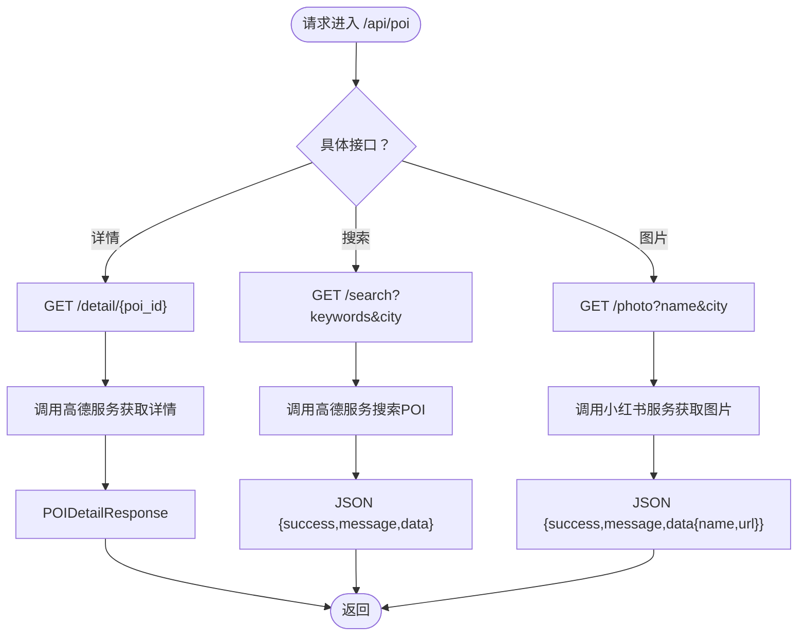
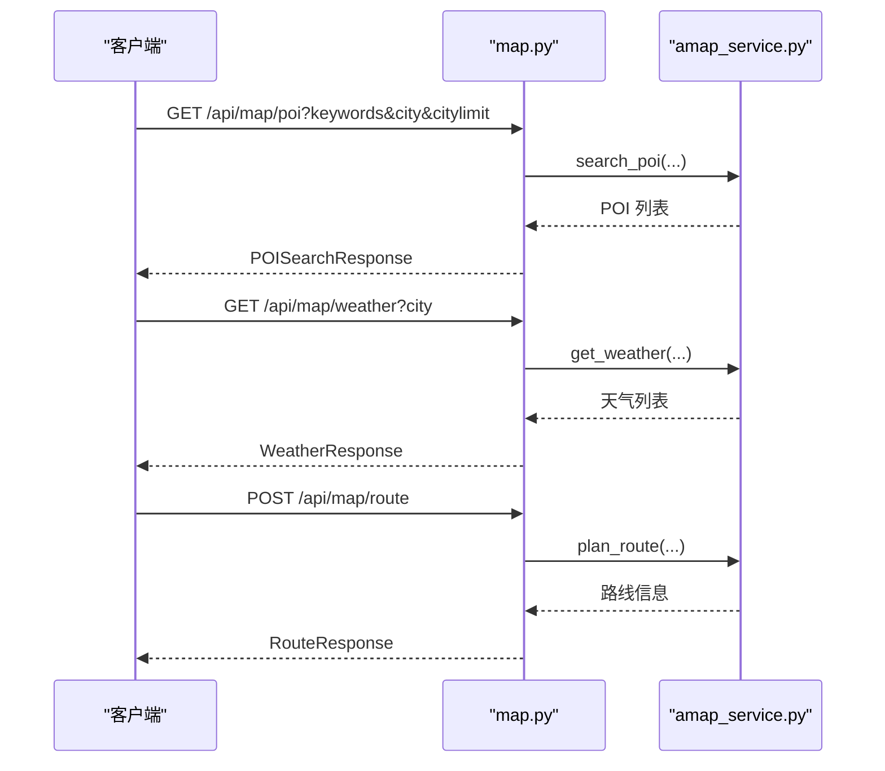
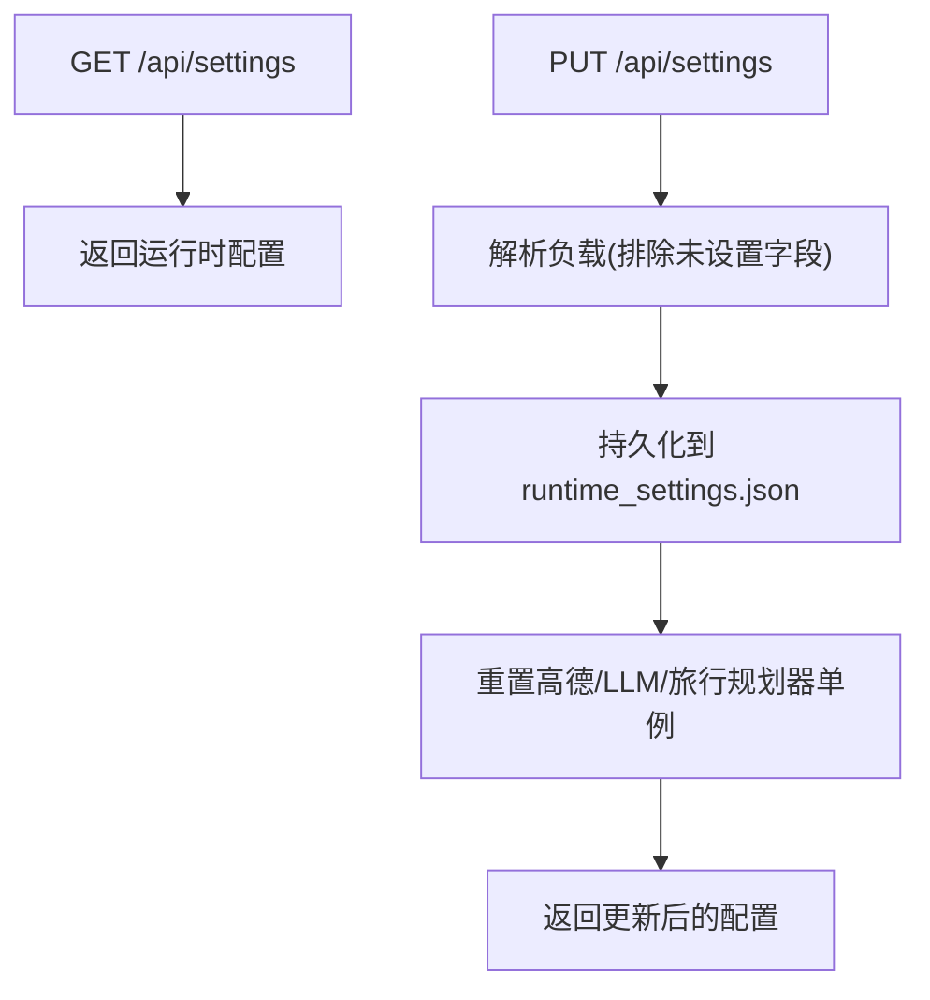
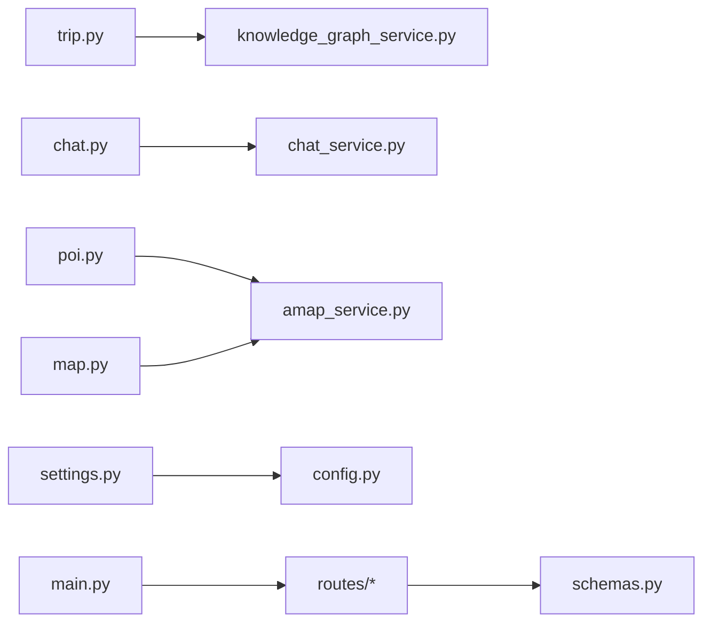

# API 路由系统

<cite>
**本文档引用的文件**
- [backend/app/api/main.py](file://backend/app/api/main.py)
- [backend/app/api/routes/__init__.py](file://backend/app/api/routes/__init__.py)
- [backend/app/api/routes/trip.py](file://backend/app/api/routes/trip.py)
- [backend/app/api/routes/chat.py](file://backend/app/api/routes/chat.py)
- [backend/app/api/routes/poi.py](file://backend/app/api/routes/poi.py)
- [backend/app/api/routes/map.py](file://backend/app/api/routes/map.py)
- [backend/app/api/routes/settings.py](file://backend/app/api/routes/settings.py)
- [backend/app/models/schemas.py](file://backend/app/models/schemas.py)
- [backend/app/config.py](file://backend/app/config.py)
- [backend/app/services/amap_service.py](file://backend/app/services/amap_service.py)
- [backend/app/services/knowledge_graph_service.py](file://backend/app/services/knowledge_graph_service.py)
- [backend/app/services/chat_service.py](file://backend/app/services/chat_service.py)
- [backend/run.py](file://backend/run.py)
</cite>

## 目录
1. [简介](#简介)
2. [项目结构](#项目结构)
3. [核心组件](#核心组件)
4. [架构总览](#架构总览)
5. [详细组件分析](#详细组件分析)
6. [依赖分析](#依赖分析)
7. [性能考虑](#性能考虑)
8. [故障排查指南](#故障排查指南)
9. [结论](#结论)
10. [附录](#附录)

## 简介
本文件系统性梳理 TripStar 基于 FastAPI 的 API 路由体系，涵盖路由模块划分与命名规范、各模块功能与实现要点、参数验证与响应格式、错误处理机制、安全配置与访问控制、扩展方法以及调试与监控实践。读者无需深入代码即可理解整体架构与使用方式。

## 项目结构
后端采用分层与按功能域划分的组织方式：
- 应用入口与中间件：FastAPI 应用、CORS、静态资源挂载、健康检查、根路径处理
- 路由模块：旅行规划、聊天问答、POI 搜索、地图服务、系统设置
- 数据模型：统一的 Pydantic 模型定义请求/响应结构
- 服务层：高德地图、知识图谱、LLM、小红书等外部能力封装
- 配置中心：运行时配置与环境变量管理

图表来源
- [backend/app/api/main.py:1-147](file://backend/app/api/main.py#L1-L147)
- [backend/app/api/routes/trip.py:1-511](file://backend/app/api/routes/trip.py#L1-L511)
- [backend/app/api/routes/chat.py:1-53](file://backend/app/api/routes/chat.py#L1-L53)
- [backend/app/api/routes/poi.py:1-133](file://backend/app/api/routes/poi.py#L1-L133)
- [backend/app/api/routes/map.py:1-164](file://backend/app/api/routes/map.py#L1-L164)
- [backend/app/api/routes/settings.py:1-56](file://backend/app/api/routes/settings.py#L1-L56)
- [backend/app/models/schemas.py:1-264](file://backend/app/models/schemas.py#L1-L264)
- [backend/app/config.py:1-202](file://backend/app/config.py#L1-L202)
- [backend/app/services/amap_service.py:1-276](file://backend/app/services/amap_service.py#L1-L276)
- [backend/app/services/knowledge_graph_service.py:1-169](file://backend/app/services/knowledge_graph_service.py#L1-L169)
- [backend/app/services/chat_service.py:1-133](file://backend/app/services/chat_service.py#L1-L133)

章节来源
- [backend/app/api/main.py:1-147](file://backend/app/api/main.py#L1-L147)

## 核心组件
- FastAPI 应用与中间件
  - 应用创建、标题/版本/文档路由配置
  - CORS 中间件、UTF-8 输出强制、路径代理修复中间件
  - 路由注册：/api/trip、/api/poi、/api/map、/api/chat、/api/settings
  - 启动/关闭事件：配置校验、打印、健康检查端点
  - 根路径与 SPA 回退：开发/生产环境差异化处理
- 路由模块
  - 旅行规划：异步任务、WebSocket 实时订阅、历史查询、轮询兼容
  - 聊天问答：基于旅行计划上下文的 LLM 对话
  - POI：详情、搜索、图片获取
  - 地图服务：POI 搜索、天气查询、路线规划
  - 设置：运行时配置读取与更新、即时生效与重置
- 数据模型
  - 请求/响应统一使用 Pydantic 模型，包含字段校验、示例与序列化
- 服务层
  - 高德地图：MCP 工具封装，提供 POI/天气/路线/地理编码等能力
  - 知识图谱：从旅行计划构建 ECharts 力导向图数据
  - LLM 对话：OpenAI 兼容接口，注入旅行计划上下文

章节来源
- [backend/app/api/main.py:13-147](file://backend/app/api/main.py#L13-L147)
- [backend/app/api/routes/trip.py:17-511](file://backend/app/api/routes/trip.py#L17-L511)
- [backend/app/api/routes/chat.py:7-53](file://backend/app/api/routes/chat.py#L7-L53)
- [backend/app/api/routes/poi.py:8-133](file://backend/app/api/routes/poi.py#L8-L133)
- [backend/app/api/routes/map.py:14-164](file://backend/app/api/routes/map.py#L14-L164)
- [backend/app/api/routes/settings.py:13-56](file://backend/app/api/routes/settings.py#L13-L56)
- [backend/app/models/schemas.py:1-264](file://backend/app/models/schemas.py#L1-L264)
- [backend/app/services/amap_service.py:1-276](file://backend/app/services/amap_service.py#L1-L276)
- [backend/app/services/knowledge_graph_service.py:1-169](file://backend/app/services/knowledge_graph_service.py#L1-L169)
- [backend/app/services/chat_service.py:1-133](file://backend/app/services/chat_service.py#L1-L133)

## 架构总览
下图展示应用启动、路由注册与请求处理的关键流程：

图表来源
- [backend/app/api/main.py:19-60](file://backend/app/api/main.py#L19-L60)
- [backend/app/api/routes/trip.py:276-312](file://backend/app/api/routes/trip.py#L276-L312)
- [backend/app/api/routes/map.py:17-57](file://backend/app/api/routes/map.py#L17-L57)
- [backend/app/api/routes/poi.py:18-51](file://backend/app/api/routes/poi.py#L18-L51)
- [backend/app/api/routes/chat.py:10-43](file://backend/app/api/routes/chat.py#L10-L43)
- [backend/app/models/schemas.py:188-234](file://backend/app/models/schemas.py#L188-L234)

## 详细组件分析

### 旅行规划路由（/api/trip）
- 设计要点
  - 异步任务模型：提交即返回 task_id，后台执行并持久化状态
  - WebSocket 实时订阅：连接后先发快照，再持续推送进度/结果
  - 轮询兼容：提供 /status/{task_id} 支持旧客户端
  - 历史查询：按最近更新时间返回已完成计划摘要
  - 健康检查：检查智能体可用性
- 参数与响应
  - 请求：TripRequest（城市、起止日期、天数、偏好等）
  - 响应：TripPlanResponse（包含旅行计划与知识图谱数据）
- 错误处理
  - 任务失败时返回错误信息与原始请求载荷
  - 小红书 Cookie 过期等特定异常做友好提示
- 任务生命周期
  - 初始化 -> 提交 -> 执行中 -> 构建知识图谱 -> 完成/失败
  - 服务重启会将未完成任务标记为失败，避免前端无限等待

图表来源
- [backend/app/api/routes/trip.py:276-387](file://backend/app/api/routes/trip.py#L276-L387)
- [backend/app/api/routes/trip.py:390-440](file://backend/app/api/routes/trip.py#L390-L440)
- [backend/app/api/routes/trip.py:442-488](file://backend/app/api/routes/trip.py#L442-L488)
- [backend/app/services/knowledge_graph_service.py:34-169](file://backend/app/services/knowledge_graph_service.py#L34-L169)

章节来源
- [backend/app/api/routes/trip.py:17-511](file://backend/app/api/routes/trip.py#L17-L511)
- [backend/app/models/schemas.py:10-33](file://backend/app/models/schemas.py#L10-L33)
- [backend/app/models/schemas.py:188-195](file://backend/app/models/schemas.py#L188-L195)

### 聊天问答路由（/api/chat）
- 设计要点
  - 基于旅行计划上下文的智能问答
  - 支持历史对话追加
  - LLM 配置按请求实时读取，支持前端设置页热更新
- 参数与响应
  - 请求：TripChatRequest（message、trip_plan、history）
  - 响应：TripChatResponse（reply）

图表来源
- [backend/app/api/routes/chat.py:10-53](file://backend/app/api/routes/chat.py#L10-L53)
- [backend/app/services/chat_service.py:65-133](file://backend/app/services/chat_service.py#L65-L133)
- [backend/app/config.py:28-56](file://backend/app/config.py#L28-L56)

章节来源
- [backend/app/api/routes/chat.py:7-53](file://backend/app/api/routes/chat.py#L7-L53)
- [backend/app/models/schemas.py:253-264](file://backend/app/models/schemas.py#L253-L264)
- [backend/app/services/chat_service.py:1-133](file://backend/app/services/chat_service.py#L1-L133)

### POI 搜索路由（/api/poi）
- 设计要点
  - POI 详情、搜索、图片获取
  - 图片获取通过小红书服务兜底为空
- 参数与响应
  - 详情：GET /api/poi/detail/{poi_id} -> POIDetailResponse
  - 搜索：GET /api/poi/search?keywords&city -> JSON
  - 图片：GET /api/poi/photo?name&city -> JSON

图表来源
- [backend/app/api/routes/poi.py:18-133](file://backend/app/api/routes/poi.py#L18-L133)
- [backend/app/services/amap_service.py:57-91](file://backend/app/services/amap_service.py#L57-L91)

章节来源
- [backend/app/api/routes/poi.py:8-133](file://backend/app/api/routes/poi.py#L8-L133)
- [backend/app/models/schemas.py:197-212](file://backend/app/models/schemas.py#L197-L212)

### 地图服务路由（/api/map）
- 设计要点
  - POI 搜索、天气查询、路线规划
  - 统一响应模型与错误处理
- 参数与响应
  - POI：POISearchResponse
  - 天气：WeatherResponse
  - 路线：RouteResponse

图表来源
- [backend/app/api/routes/map.py:17-164](file://backend/app/api/routes/map.py#L17-L164)
- [backend/app/services/amap_service.py:57-200](file://backend/app/services/amap_service.py#L57-L200)
- [backend/app/models/schemas.py:207-234](file://backend/app/models/schemas.py#L207-L234)

章节来源
- [backend/app/api/routes/map.py:14-164](file://backend/app/api/routes/map.py#L14-L164)
- [backend/app/models/schemas.py:36-50](file://backend/app/models/schemas.py#L36-L50)

### 系统设置路由（/api/settings）
- 设计要点
  - 读取运行时配置（前端设置页）
  - 更新并持久化运行时配置，立即重置相关单例以生效
- 参数与响应
  - GET -> JSON {success,message,data}
  - PUT -> JSON {success,message,data}

图表来源
- [backend/app/api/routes/settings.py:27-56](file://backend/app/api/routes/settings.py#L27-L56)
- [backend/app/config.py:146-160](file://backend/app/config.py#L146-L160)

章节来源
- [backend/app/api/routes/settings.py:13-56](file://backend/app/api/routes/settings.py#L13-L56)
- [backend/app/config.py:70-160](file://backend/app/config.py#L70-L160)

## 依赖分析
- 路由到服务的依赖
  - 旅行规划 -> 知识图谱服务、智能体（间接）
  - 聊天问答 -> LLM 服务
  - POI/地图 -> 高德服务
  - 设置 -> 配置中心
- 模块内聚与耦合
  - 路由模块职责单一，与服务层解耦良好
  - 模型集中定义，便于跨模块复用
- 外部依赖
  - FastAPI、uvicorn、hello_agents、httpx、pydantic-settings、python-dotenv

图表来源
- [backend/app/api/main.py:19-60](file://backend/app/api/main.py#L19-L60)
- [backend/app/api/routes/trip.py:13-16](file://backend/app/api/routes/trip.py#L13-L16)
- [backend/app/api/routes/chat.py:4-5](file://backend/app/api/routes/chat.py#L4-L5)
- [backend/app/api/routes/poi.py:6](file://backend/app/api/routes/poi.py#L6)
- [backend/app/api/routes/map.py:12](file://backend/app/api/routes/map.py#L12)
- [backend/app/api/routes/settings.py:8-11](file://backend/app/api/routes/settings.py#L8-L11)
- [backend/app/models/schemas.py:1-264](file://backend/app/models/schemas.py#L1-L264)
- [backend/app/config.py:1-202](file://backend/app/config.py#L1-L202)

## 性能考虑
- 异步与并发
  - 旅行规划使用 asyncio.create_task 并发执行，避免阻塞
  - WebSocket 使用队列广播事件，减少锁竞争
- I/O 优化
  - 高德服务通过 MCP 工具调用，避免重复初始化
  - LLM 调用使用 httpx.AsyncClient，支持超时控制
- 存储与缓存
  - 任务状态持久化到本地 JSON，服务重启后恢复有限状态
  - 建议引入 Redis 缓存热点数据（如 POI/天气）
- 响应一致性
  - 统一使用 Pydantic 模型序列化，保证字段与类型一致

## 故障排查指南
- CORS 与代理路径
  - 若前端代理在路径前拼接动态 ID，中间件会自动修正路径
- 配置校验
  - 启动时打印配置并进行必要校验，缺失关键配置会抛出异常
- 旅行规划任务失败
  - 查看任务状态与错误信息；小红书 Cookie 过期会返回特定提示
- 地图服务不可用
  - 检查高德 Web Key 是否配置；健康检查返回可用工具数量
- LLM 问答异常
  - 检查 API Key/Base URL/Model 是否配置；关注超时与 HTTP 错误码

章节来源
- [backend/app/api/main.py:33-44](file://backend/app/api/main.py#L33-L44)
- [backend/app/api/main.py:74-80](file://backend/app/api/main.py#L74-L80)
- [backend/app/api/routes/trip.py:365-387](file://backend/app/api/routes/trip.py#L365-L387)
- [backend/app/api/routes/map.py:147-162](file://backend/app/api/routes/map.py#L147-L162)
- [backend/app/services/chat_service.py:124-132](file://backend/app/services/chat_service.py#L124-L132)

## 结论
本路由系统以 FastAPI 为核心，采用模块化设计与强类型模型，结合服务层封装与运行时配置管理，实现了旅行规划、地图服务、POI 搜索、AI 问答与系统设置的完整 API 能力。通过 WebSocket 与轮询双通道、统一的错误与响应格式、完善的配置与健康检查机制，既满足前端交互需求，也为后续扩展提供了清晰的边界与路径。

## 附录

### 路由扩展方法
- 新增路由模块步骤
  - 在 routes 下新增模块文件，定义 APIRouter 与路由函数
  - 在 main.py 中导入并 include_router(prefix="/api")
  - 如需中间件或静态资源，可在 main.py 中扩展
- 处理复杂业务逻辑
  - 将复杂流程拆分为多个阶段，使用任务状态机与持久化
  - 通过回调/事件驱动推送进度，保持接口幂等与可观测性
  - 对外部服务调用增加超时与重试策略

章节来源
- [backend/app/api/main.py:55-60](file://backend/app/api/main.py#L55-L60)
- [backend/app/api/routes/trip.py:243-274](file://backend/app/api/routes/trip.py#L243-L274)

### 安全配置与访问控制
- CORS
  - 通过配置项设置允许的源列表，默认包含常见开发端口
- 认证授权
  - 当前路由未内置认证/授权中间件；如需可参考 FastAPI 官方文档接入 JWT/Session
- 健康检查
  - /health 与各服务健康端点用于运行态监控

章节来源
- [backend/app/api/main.py:46-53](file://backend/app/api/main.py#L46-L53)
- [backend/app/api/main.py:112-119](file://backend/app/api/main.py#L112-L119)
- [backend/app/api/routes/map.py:142-162](file://backend/app/api/routes/map.py#L142-L162)
- [backend/app/api/routes/trip.py:491-508](file://backend/app/api/routes/trip.py#L491-L508)

### 调试与监控
- 启动与日志
  - 通过 run.py 启动，支持 reload 与日志级别
- 配置打印
  - 启动时打印关键配置，便于定位问题
- 健康检查
  - /health、/api/trip/health、/api/map/health
- 前端集成
  - 生产环境挂载前端静态资源，SPA 路由回退至 index.html

章节来源
- [backend/run.py:1-17](file://backend/run.py#L1-L17)
- [backend/app/api/main.py:63-85](file://backend/app/api/main.py#L63-L85)
- [backend/app/api/main.py:121-136](file://backend/app/api/main.py#L121-L136)