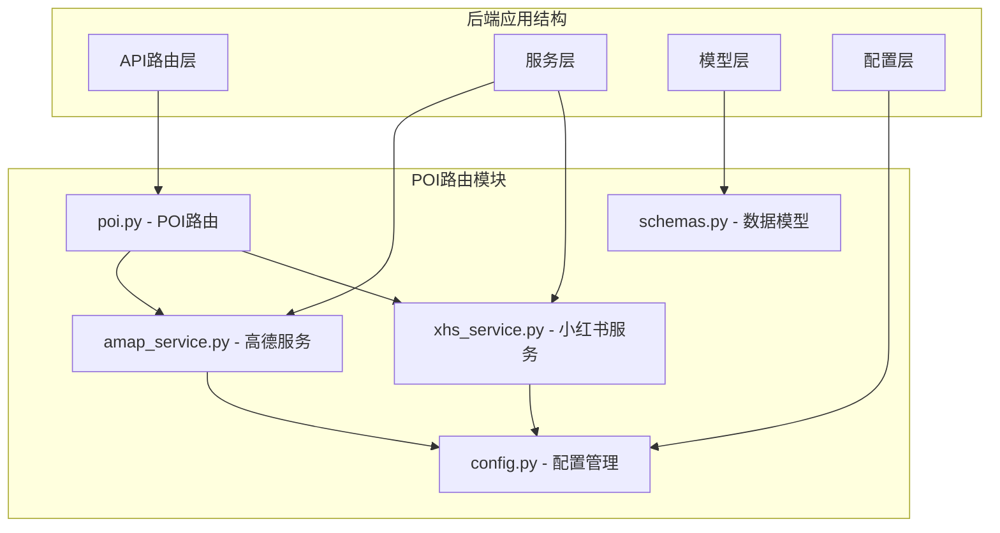
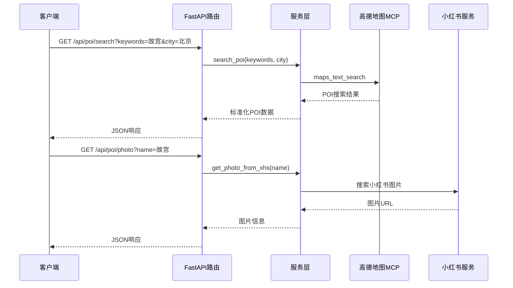
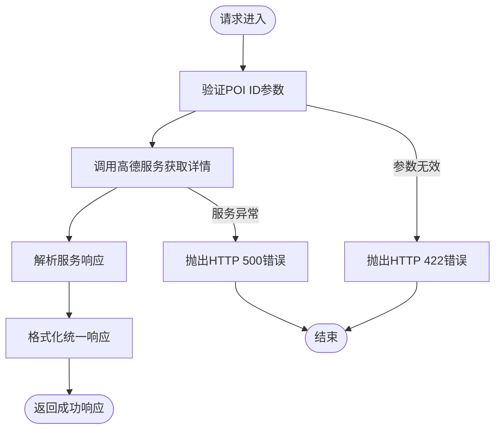
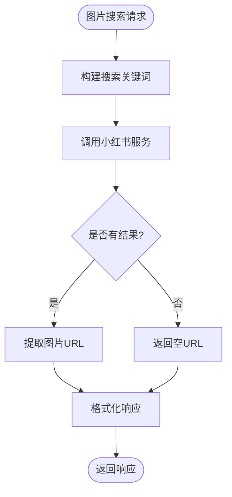
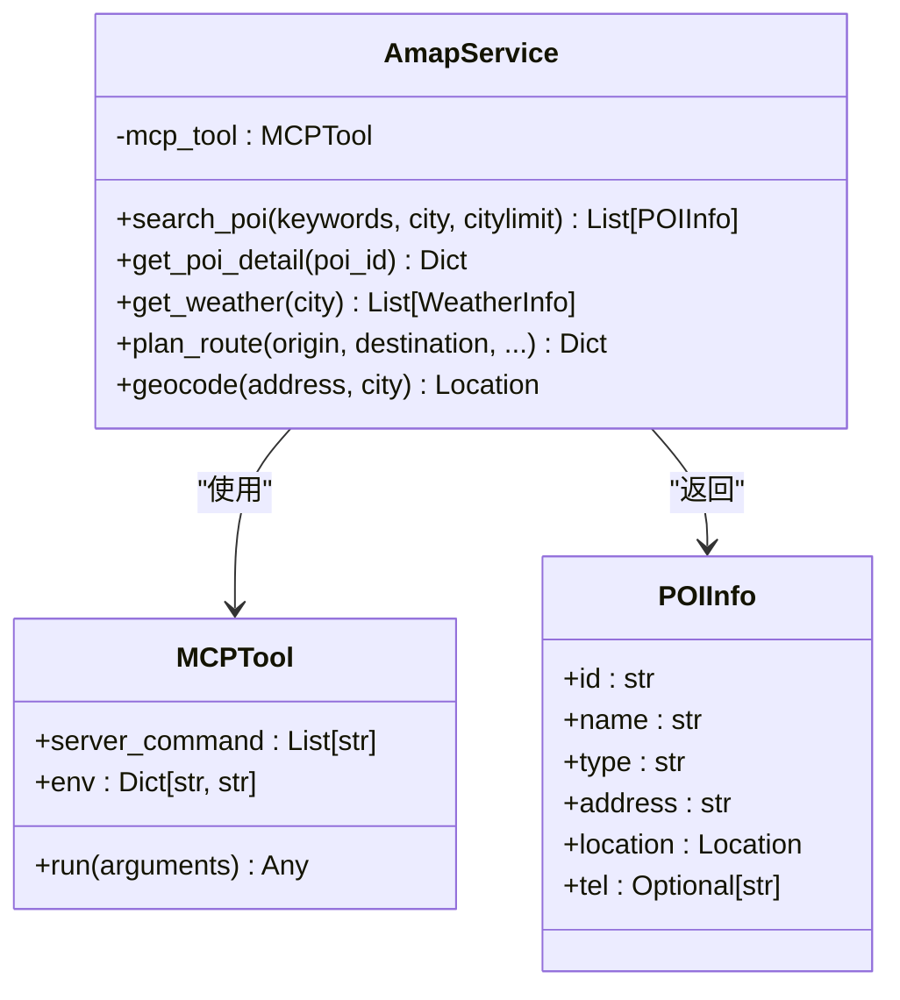
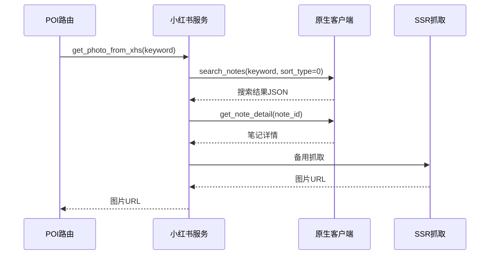
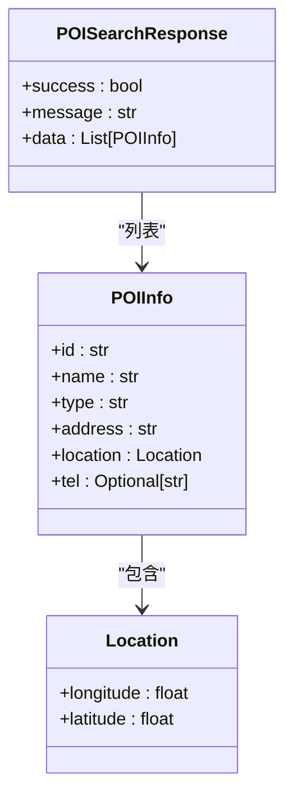
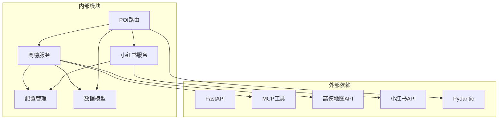

# POI 搜索路由

<cite>
**本文档引用的文件**
- [backend/app/api/routes/poi.py](file://backend/app/api/routes/poi.py)
- [backend/app/services/amap_service.py](file://backend/app/services/amap_service.py)
- [backend/app/services/xhs_service.py](file://backend/app/services/xhs_service.py)
- [backend/app/models/schemas.py](file://backend/app/models/schemas.py)
- [backend/app/config.py](file://backend/app/config.py)
- [backend/app/api/main.py](file://backend/app/api/main.py)
- [README.md](file://README.md)
</cite>

## 目录
1. [简介](#简介)
2. [项目结构](#项目结构)
3. [核心组件](#核心组件)
4. [架构概览](#架构概览)
5. [详细组件分析](#详细组件分析)
6. [依赖关系分析](#依赖关系分析)
7. [性能考虑](#性能考虑)
8. [故障排除指南](#故障排除指南)
9. [结论](#结论)

## 简介

TripStar 项目中的 POI（兴趣点）搜索路由模块是一个完整的旅行规划系统的核心功能之一。该模块提供了基于高德地图服务的兴趣点搜索、详情获取和图片搜索功能，支持景点、餐厅、酒店等多种类型的地点搜索。

该模块采用 FastAPI 框架构建，通过 MCP（Model Context Protocol）工具与高德地图服务进行集成，同时集成了小红书图片搜索功能，为用户提供真实、可靠的旅行信息。系统支持关键词搜索、地理位置筛选、分类过滤等高级功能，并提供了完善的错误处理和性能优化策略。

## 项目结构

POI 搜索路由模块位于后端应用的 API 路由层，采用清晰的分层架构设计：

**图表来源**
- [backend/app/api/routes/poi.py:1-133](file://backend/app/api/routes/poi.py#L1-L133)
- [backend/app/services/amap_service.py:1-276](file://backend/app/services/amap_service.py#L1-L276)
- [backend/app/services/xhs_service.py:1-444](file://backend/app/services/xhs_service.py#L1-L444)

**章节来源**
- [backend/app/api/routes/poi.py:1-133](file://backend/app/api/routes/poi.py#L1-L133)
- [backend/app/api/main.py:1-147](file://backend/app/api/main.py#L1-L147)

## 核心组件

POI 搜索路由模块包含以下核心组件：

### 1. 路由控制器
- **POI 路由前缀**: `/api/poi`
- **主要接口**:
  - `GET /detail/{poi_id}` - 获取 POI 详情
  - `GET /search` - 关键词搜索 POI
  - `GET /photo` - 获取景点图片

### 2. 服务层组件
- **高德地图服务**: 基于 MCP 工具的 POI 搜索和详情获取
- **小红书服务**: 图片搜索和内容提取
- **配置管理**: 环境变量和运行时配置

### 3. 数据模型
- **POI 信息模型**: 标准化的 POI 数据结构
- **响应模型**: 统一的 API 响应格式
- **请求模型**: 搜索参数验证

**章节来源**
- [backend/app/api/routes/poi.py:8-133](file://backend/app/api/routes/poi.py#L8-L133)
- [backend/app/models/schemas.py:197-212](file://backend/app/models/schemas.py#L197-L212)

## 架构概览

POI 搜索路由模块采用分层架构设计，实现了清晰的关注点分离：

**图表来源**
- [backend/app/api/routes/poi.py:58-85](file://backend/app/api/routes/poi.py#L58-L85)
- [backend/app/services/amap_service.py:56-92](file://backend/app/services/amap_service.py#L56-L92)
- [backend/app/services/xhs_service.py:440-444](file://backend/app/services/xhs_service.py#L440-L444)

## 详细组件分析

### POI 路由控制器

POI 路由控制器实现了三个核心接口，每个接口都有完整的错误处理和响应格式化：

#### 1. POI 详情接口

**图表来源**
- [backend/app/api/routes/poi.py:24-51](file://backend/app/api/routes/poi.py#L24-L51)

#### 2. POI 搜索接口
该接口支持关键词搜索和城市筛选，具有以下特点：
- **关键词搜索**: 支持中文关键词，如"故宫"
- **城市筛选**: 默认城市为"北京"
- **参数验证**: 使用 FastAPI 的 Pydantic 验证
- **响应格式**: 统一的成功/失败响应结构

#### 3. 图片搜索接口

**图表来源**
- [backend/app/api/routes/poi.py:93-131](file://backend/app/api/routes/poi.py#L93-L131)

**章节来源**
- [backend/app/api/routes/poi.py:18-133](file://backend/app/api/routes/poi.py#L18-L133)

### 高德地图服务集成

高德地图服务通过 MCP（Model Context Protocol）工具实现，提供了完整的 POI 搜索和详情获取功能：

#### 1. MCP 工具初始化
- **单例模式**: 确保服务实例的唯一性
- **环境配置**: 从配置管理器获取 API Key
- **工具注册**: 自动发现和注册可用工具

#### 2. POI 搜索实现

**图表来源**
- [backend/app/services/amap_service.py:50-276](file://backend/app/services/amap_service.py#L50-L276)
- [backend/app/models/schemas.py:197-205](file://backend/app/models/schemas.py#L197-L205)

#### 3. 服务方法详解

**搜索 POI 方法**:
- **工具名称**: `maps_text_search`
- **参数映射**: 关键词、城市、城市限制
- **结果处理**: 当前实现为占位符，需完善 JSON 解析

**获取 POI 详情方法**:
- **工具名称**: `maps_search_detail`
- **参数映射**: POI ID
- **结果处理**: 使用正则表达式提取 JSON 数据

**章节来源**
- [backend/app/services/amap_service.py:56-254](file://backend/app/services/amap_service.py#L56-L254)

### 小红书图片服务

小红书服务提供了强大的图片搜索和内容提取功能：

#### 1. 图片搜索流程

**图表来源**
- [backend/app/services/xhs_service.py:440-444](file://backend/app/services/xhs_service.py#L440-L444)
- [backend/app/services/xhs_service.py:358-437](file://backend/app/services/xhs_service.py#L358-L437)

#### 2. Cookie 管理
- **格式兼容**: 支持多种 Cookie 格式
- **标准化处理**: 自动转换不同格式的 Cookie
- **错误处理**: 提供明确的 Cookie 过期错误

#### 3. 备用抓取机制
当原生 API 失败时，系统会自动降级到 SSR 抓取：
- **SSR 抓取**: 通过网页抓取获取初始状态
- **正则提取**: 使用正则表达式提取所需信息
- **容错处理**: 失败时返回空结果而非抛出异常

**章节来源**
- [backend/app/services/xhs_service.py:1-444](file://backend/app/services/xhs_service.py#L1-L444)

### 数据模型设计

系统使用 Pydantic 模型确保数据的完整性和一致性：

#### 1. POI 信息模型

**图表来源**
- [backend/app/models/schemas.py:197-212](file://backend/app/models/schemas.py#L197-L212)
- [backend/app/models/schemas.py:54-58](file://backend/app/models/schemas.py#L54-L58)

#### 2. 统一响应格式
所有 API 接口都遵循统一的响应格式：
- **success**: 布尔值表示操作是否成功
- **message**: 字符串描述操作结果
- **data**: 实际数据内容

**章节来源**
- [backend/app/models/schemas.py:197-243](file://backend/app/models/schemas.py#L197-L243)

## 依赖关系分析

POI 搜索路由模块的依赖关系清晰且层次分明：

**图表来源**
- [backend/app/api/routes/poi.py:3-6](file://backend/app/api/routes/poi.py#L3-L6)
- [backend/app/services/amap_service.py:4-6](file://backend/app/services/amap_service.py#L4-L6)

### 关键依赖特性

1. **配置注入**: 所有外部服务都通过配置管理器获取参数
2. **服务抽象**: 高德地图和小红书服务都通过统一接口暴露
3. **错误隔离**: 每个服务都有独立的错误处理机制
4. **类型安全**: 使用 Pydantic 确保数据完整性

**章节来源**
- [backend/app/config.py:21-71](file://backend/app/config.py#L21-L71)
- [backend/app/api/routes/poi.py:6-7](file://backend/app/api/routes/poi.py#L6-L7)

## 性能考虑

### 1. 缓存策略
虽然当前实现中没有显式的缓存机制，但可以考虑以下优化：

- **POI 结果缓存**: 对常用搜索关键词进行缓存
- **图片 URL 缓存**: 缓存热门景点的图片 URL
- **服务调用频率控制**: 避免频繁调用外部 API

### 2. 异步处理
- **图片搜索异步化**: 已经实现了异步图片搜索
- **批量处理**: 支持批量 POI 查询
- **并发控制**: 限制同时进行的外部 API 调用数量

### 3. 错误恢复
- **重试机制**: 对临时性错误进行自动重试
- **降级策略**: API 失败时提供备用方案
- **超时控制**: 设置合理的超时时间

## 故障排除指南

### 1. 常见错误及解决方案

#### 高德地图 API Key 未配置
**症状**: 初始化 MCP 工具时抛出 ValueError
**解决方案**: 
- 在 `.env` 文件中设置 `VITE_AMAP_WEB_KEY`
- 重启应用使配置生效

#### 小红书 Cookie 过期
**症状**: 抛出 `XHSCookieExpiredError` 异常
**解决方案**:
- 更新小红书 Cookie
- 重新配置运行时设置

#### 网络连接超时
**症状**: 外部 API 调用超时
**解决方案**:
- 检查网络连接
- 增加超时时间
- 实现重试机制

### 2. 调试技巧

#### 启用详细日志
- 检查服务初始化日志
- 监控 API 调用响应
- 记录错误堆栈信息

#### 性能监控
- 监控外部 API 响应时间
- 跟踪内存使用情况
- 分析错误率趋势

**章节来源**
- [backend/app/services/amap_service.py:24-25](file://backend/app/services/amap_service.py#L24-L25)
- [backend/app/services/xhs_service.py:22-25](file://backend/app/services/xhs_service.py#L22-L25)

## 结论

TripStar 项目的 POI 搜索路由模块是一个设计精良、功能完整的旅行规划系统核心组件。该模块成功实现了以下关键目标：

### 主要成就
1. **完整的 POI 功能**: 支持搜索、详情获取和图片搜索
2. **灵活的集成架构**: 通过 MCP 工具实现与高德地图的无缝集成
3. **真实内容获取**: 通过小红书服务获取真实的用户生成内容
4. **统一的数据模型**: 使用 Pydantic 确保数据的一致性和完整性
5. **健壮的错误处理**: 提供完善的异常处理和降级策略

### 技术亮点
- **模块化设计**: 清晰的分层架构便于维护和扩展
- **类型安全**: 全面的类型注解和验证
- **异步处理**: 支持现代 Web 应用的异步需求
- **配置管理**: 灵活的运行时配置支持

### 未来改进方向
1. **完善高德服务实现**: 完成 POI 搜索和详情获取的 JSON 解析
2. **添加缓存机制**: 提升性能和用户体验
3. **增强错误恢复**: 实现更智能的重试和降级策略
4. **扩展搜索功能**: 添加更多筛选条件和排序选项

该模块为整个 TripStar 项目提供了坚实的基础，为用户提供了准确、可靠、实时的旅行信息，是现代 AI 旅行助手的重要组成部分。