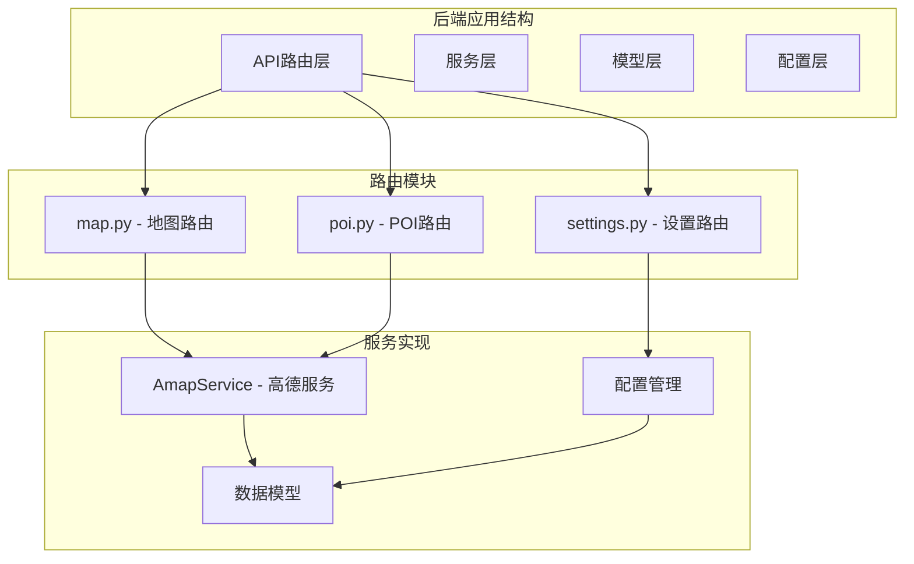
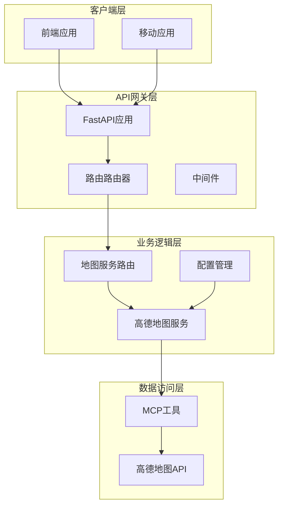
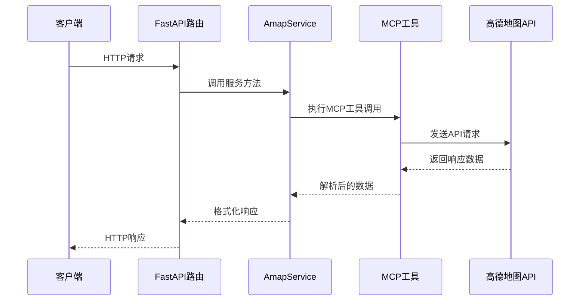
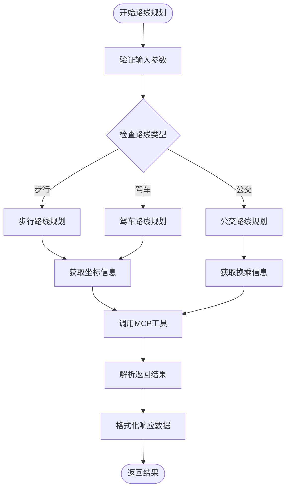
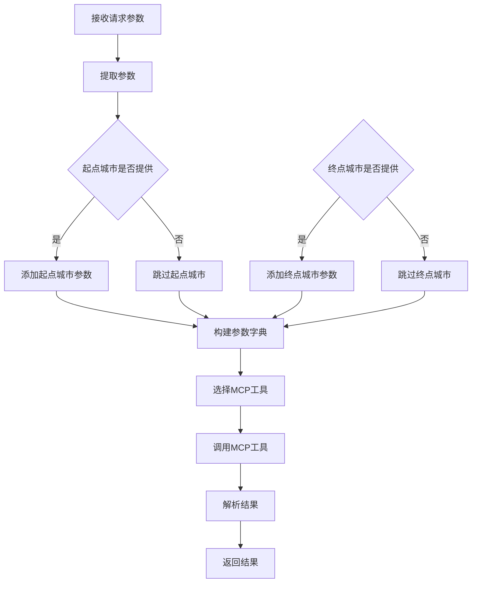
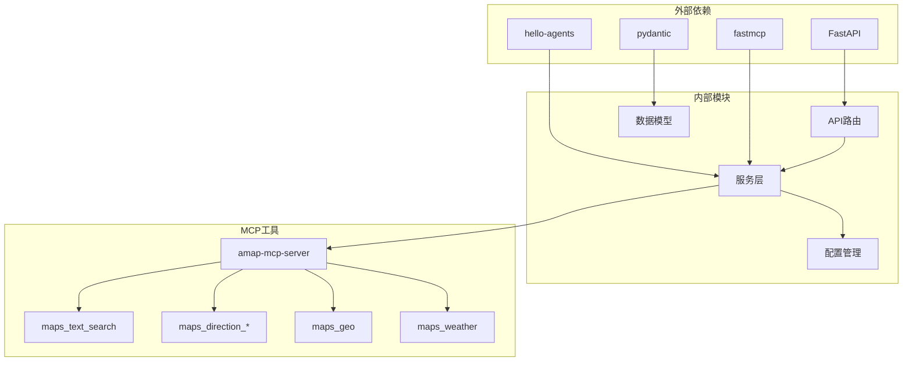

# 地图服务路由

<cite>
**本文档引用的文件**
- [backend/app/api/routes/map.py](file://backend/app/api/routes/map.py)
- [backend/app/services/amap_service.py](file://backend/app/services/amap_service.py)
- [backend/app/models/schemas.py](file://backend/app/models/schemas.py)
- [backend/app/config.py](file://backend/app/config.py)
- [backend/app/api/main.py](file://backend/app/api/main.py)
- [backend/app/api/routes/poi.py](file://backend/app/api/routes/poi.py)
- [backend/app/api/routes/settings.py](file://backend/app/api/routes/settings.py)
- [backend/requirements.txt](file://backend/requirements.txt)
</cite>

## 目录
1. [简介](#简介)
2. [项目结构](#项目结构)
3. [核心组件](#核心组件)
4. [架构概览](#架构概览)
5. [详细组件分析](#详细组件分析)
6. [依赖关系分析](#依赖关系分析)
7. [性能考虑](#性能考虑)
8. [故障排除指南](#故障排除指南)
9. [结论](#结论)
10. [附录](#附录)

## 简介

地图服务路由模块是 TripStar 旅行智能体项目中的核心地理信息服务模块，基于高德地图 MCP 服务实现。该模块提供了完整的地图相关功能，包括路线规划、POI 搜索、地理编码、天气查询等服务，为用户提供智能化的旅行规划支持。

本模块采用 FastAPI 框架构建，通过统一的 /map 路由前缀提供 RESTful API 接口，集成了高德地图的多种服务能力，包括驾车、步行、公交等多种交通方式的路线规划，以及 POI 搜索、地理编码、天气查询等基础地图服务。

## 项目结构

地图服务路由模块位于后端应用的 API 层，采用清晰的分层架构设计：



**图表来源**
- [backend/app/api/routes/map.py:1-164](file://backend/app/api/routes/map.py#L1-L164)
- [backend/app/services/amap_service.py:1-276](file://backend/app/services/amap_service.py#L1-L276)

**章节来源**
- [backend/app/api/routes/map.py:1-164](file://backend/app/api/routes/map.py#L1-L164)
- [backend/app/api/main.py:55-60](file://backend/app/api/main.py#L55-L60)

## 核心组件

地图服务路由模块包含以下核心组件：

### 1. 路由路由器
- **前缀**: `/api/map`
- **标签**: 地图服务
- **功能**: 提供统一的地图服务接口入口

### 2. 服务层组件
- **AmapService**: 高德地图服务封装类
- **单例模式**: 确保服务实例的唯一性和资源管理
- **MCP 工具集成**: 通过 MCP 协议与高德地图服务通信

### 3. 数据模型
- **RouteRequest/RouteResponse**: 路线规划请求和响应模型
- **POISearchRequest/POISearchResponse**: POI 搜索请求和响应模型
- **WeatherResponse**: 天气查询响应模型
- **Location**: 地理位置坐标模型

**章节来源**
- [backend/app/api/routes/map.py:14](file://backend/app/api/routes/map.py#L14)
- [backend/app/services/amap_service.py:50-56](file://backend/app/services/amap_service.py#L50-L56)
- [backend/app/models/schemas.py:43-233](file://backend/app/models/schemas.py#L43-L233)

## 架构概览

地图服务路由模块采用分层架构设计，实现了清晰的关注点分离：



**图表来源**
- [backend/app/api/main.py:24-31](file://backend/app/api/main.py#L24-L31)
- [backend/app/api/routes/map.py:12-14](file://backend/app/api/routes/map.py#L12-L14)
- [backend/app/services/amap_service.py:12-47](file://backend/app/services/amap_service.py#L12-L47)

### 服务架构流程



**图表来源**
- [backend/app/api/routes/map.py:105-139](file://backend/app/api/routes/map.py#L105-L139)
- [backend/app/services/amap_service.py:122-186](file://backend/app/services/amap_service.py#L122-L186)

## 详细组件分析

### 路由接口设计

地图服务路由模块提供了四个主要的 RESTful 接口：

#### 1. POI 搜索接口
- **路径**: `/api/map/poi`
- **方法**: GET
- **功能**: 根据关键词搜索兴趣点
- **参数**: keywords(关键词), city(城市), citylimit(城市限制)
- **响应**: POISearchResponse

#### 2. 天气查询接口
- **路径**: `/api/map/weather`
- **方法**: GET
- **功能**: 查询指定城市的天气信息
- **参数**: city(城市名称)
- **响应**: WeatherResponse

#### 3. 路线规划接口
- **路径**: `/api/map/route`
- **方法**: POST
- **功能**: 规划两点之间的最优路线
- **请求体**: RouteRequest
- **响应**: RouteResponse

#### 4. 健康检查接口
- **路径**: `/api/map/health`
- **方法**: GET
- **功能**: 检查地图服务状态
- **响应**: 健康状态信息

**章节来源**
- [backend/app/api/routes/map.py:17-162](file://backend/app/api/routes/map.py#L17-L162)

### 路线规划服务实现

路线规划服务是地图模块的核心功能，支持多种交通方式：

#### 支持的路线类型
- **步行 (walking)**: 适用于短距离、需要步行的场景
- **驾车 (driving)**: 考虑实时交通状况的最优路线
- **公交 (transit)**: 多模式公共交通换乘方案

#### 路线规划流程



**图表来源**
- [backend/app/services/amap_service.py:122-186](file://backend/app/services/amap_service.py#L122-L186)

#### 参数处理逻辑



**图表来源**
- [backend/app/services/amap_service.py:144-177](file://backend/app/services/amap_service.py#L144-L177)

**章节来源**
- [backend/app/services/amap_service.py:122-186](file://backend/app/services/amap_service.py#L122-L186)
- [backend/app/models/schemas.py:43-50](file://backend/app/models/schemas.py#L43-L50)

### 地理编码服务实现

地理编码服务提供地址与坐标之间的双向转换：

#### 地理编码功能
- **地址转坐标**: 将详细地址转换为经纬度坐标
- **坐标转地址**: 将经纬度坐标转换为标准化地址
- **城市过滤**: 支持可选的城市参数提高精度

#### 实现特点
- **MCP 工具集成**: 通过 maps_geo 工具实现地理编码
- **参数灵活性**: 支持带城市参数和不带城市参数的查询
- **错误处理**: 完善的异常捕获和错误返回机制

**章节来源**
- [backend/app/services/amap_service.py:188-217](file://backend/app/services/amap_service.py#L188-L217)

### POI 搜索服务

POI (Point of Interest) 搜索服务提供兴趣点的查找和详情获取：

#### 搜索功能
- **关键词搜索**: 支持多关键词组合搜索
- **城市限制**: 可限制搜索范围在指定城市内
- **结果过滤**: 返回结构化的 POI 信息

#### 详情获取
- **POI ID 查询**: 通过唯一标识符获取详细信息
- **图片提取**: 从搜索结果中提取相关图片链接
- **数据解析**: 解析复杂的 JSON 结构数据

**章节来源**
- [backend/app/services/amap_service.py:57-91](file://backend/app/services/amap_service.py#L57-L91)
- [backend/app/services/amap_service.py:219-254](file://backend/app/services/amap_service.py#L219-L254)

### 天气查询服务

天气查询服务提供旅行相关的天气信息：

#### 天气信息字段
- **日期**: 天气预报的日期
- **天气状况**: 白天和夜间天气描述
- **温度范围**: 白天和夜间温度
- **风力信息**: 风向和风力等级

#### 数据处理
- **温度解析**: 自动去除温度单位符号
- **格式标准化**: 统一不同来源的数据格式
- **错误容错**: 处理不完整或格式异常的天气数据

**章节来源**
- [backend/app/services/amap_service.py:93-120](file://backend/app/services/amap_service.py#L93-L120)
- [backend/app/models/schemas.py:111-135](file://backend/app/models/schemas.py#L111-L135)

## 依赖关系分析

地图服务路由模块的依赖关系体现了清晰的分层架构：



**图表来源**
- [backend/requirements.txt:1-18](file://backend/requirements.txt#L1-L18)
- [backend/app/services/amap_service.py:31-34](file://backend/app/services/amap_service.py#L31-L34)

### 关键依赖说明

#### 1. FastAPI 框架
- **版本**: >=0.115.0
- **功能**: 提供高性能的 Web 框架和自动 API 文档生成

#### 2. hello-agents 框架
- **版本**: >=0.2.4, <=0.2.9
- **功能**: 提供 MCP 协议支持和智能体框架

#### 3. fastmcp 库
- **版本**: >=2.0.0
- **功能**: 实现 MCP (Model Context Protocol) 协议

#### 4. 高德地图 MCP 服务器
- **工具**: amap-mcp-server
- **功能**: 提供高德地图 API 的 MCP 封装

**章节来源**
- [backend/requirements.txt:1-18](file://backend/requirements.txt#L1-L18)
- [backend/app/services/amap_service.py:31-34](file://backend/app/services/amap_service.py#L31-L34)

## 性能考虑

地图服务路由模块在设计时充分考虑了性能优化：

### 1. 缓存策略
- **单例模式**: 服务实例全局共享，避免重复创建
- **MCP 工具缓存**: MCP 工具实例缓存，减少连接开销
- **配置缓存**: 配置信息缓存，避免频繁读取

### 2. 异步处理
- **异步路由**: 使用 FastAPI 的异步特性
- **并发处理**: 支持多请求并发处理
- **资源池**: MCP 工具连接池管理

### 3. 错误处理优化
- **快速失败**: 及时检测和报告错误
- **降级策略**: 在服务不可用时提供降级响应
- **超时控制**: 合理的请求超时设置

### 4. 内存管理
- **垃圾回收**: 及时释放不需要的对象
- **连接复用**: 复用 MCP 连接减少内存占用
- **资源清理**: 定期清理临时资源

## 故障排除指南

### 常见问题及解决方案

#### 1. 高德地图 API Key 未配置
**症状**: 服务启动时报错，功能不可用
**解决方案**: 
- 检查环境变量 VITE_AMAP_WEB_KEY
- 通过设置路由更新运行时配置
- 重启服务使新配置生效

#### 2. MCP 工具连接失败
**症状**: 路线规划、POI 搜索等接口报错
**解决方案**:
- 检查 amap-mcp-server 是否正常运行
- 验证 API Key 配置正确性
- 查看 MCP 工具日志信息

#### 3. 路线规划结果为空
**症状**: 路线规划接口返回空数据
**解决方案**:
- 验证起终点地址的有效性
- 检查交通方式参数的正确性
- 确认网络连接正常

#### 4. 性能问题
**症状**: 接口响应缓慢
**解决方案**:
- 检查服务器资源使用情况
- 优化 MCP 工具连接配置
- 实施适当的缓存策略

**章节来源**
- [backend/app/config.py:162-179](file://backend/app/config.py#L162-L179)
- [backend/app/services/amap_service.py:24-25](file://backend/app/services/amap_service.py#L24-L25)

### 调试技巧

#### 1. 启用详细日志
- 检查服务启动时的配置信息输出
- 监控 MCP 工具的执行日志
- 分析请求处理过程中的错误信息

#### 2. API 测试
- 使用 Swagger UI 测试各接口
- 验证请求参数的正确性
- 检查响应数据的完整性

#### 3. 性能监控
- 监控请求响应时间
- 检查内存使用情况
- 分析并发处理能力

## 结论

地图服务路由模块是 TripStar 项目的重要组成部分，通过集成高德地图 MCP 服务，为用户提供了一站式的地理信息服务。模块设计具有以下特点：

### 设计优势
- **模块化设计**: 清晰的分层架构，职责分离明确
- **扩展性强**: 支持多种交通方式和地图服务
- **性能优化**: 采用单例模式和缓存策略
- **错误处理**: 完善的异常捕获和降级机制

### 技术特色
- **MCP 协议**: 通过 MCP 协议实现与高德地图的标准化集成
- **异步处理**: 利用 FastAPI 的异步特性提升性能
- **配置管理**: 支持运行时配置更新和热生效
- **数据模型**: 严格的 Pydantic 数据验证

### 应用价值
- **旅行规划**: 为智能旅行规划提供基础地理信息服务
- **用户体验**: 提供准确、及时的地图相关数据
- **系统集成**: 与其他服务模块无缝集成
- **扩展潜力**: 为未来功能扩展奠定技术基础

该模块为 TripStar 项目提供了坚实的地理信息服务基础，是实现智能旅行规划的关键技术支撑。

## 附录

### API 使用示例

#### 1. 路线规划示例
```javascript
// 驾车路线规划
fetch('/api/map/route', {
  method: 'POST',
  headers: {'Content-Type': 'application/json'},
  body: JSON.stringify({
    origin_address: '北京市朝阳区',
    destination_address: '北京市海淀区',
    route_type: 'driving'
  })
})
```

#### 2. POI 搜索示例
```javascript
// POI 搜索
fetch('/api/map/poi?keywords=故宫&city=北京&citylimit=true')
```

#### 3. 天气查询示例
```javascript
// 天气查询
fetch('/api/map/weather?city=北京')
```

### 配置说明

#### 1. 环境变量配置
- **VITE_AMAP_WEB_KEY**: 高德地图 Web 服务 Key
- **VITE_AMAP_WEB_JS_KEY**: 高德地图 JS SDK Key

#### 2. 运行时配置
- 通过 `/api/settings` 接口动态更新配置
- 支持热生效，无需重启服务

### 依赖版本要求

- **Python**: 3.10+
- **FastAPI**: >=0.115.0
- **hello-agents**: >=0.2.4, <=0.2.9
- **fastmcp**: >=2.0.0