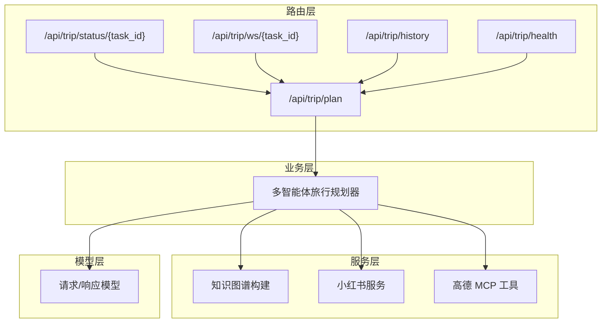
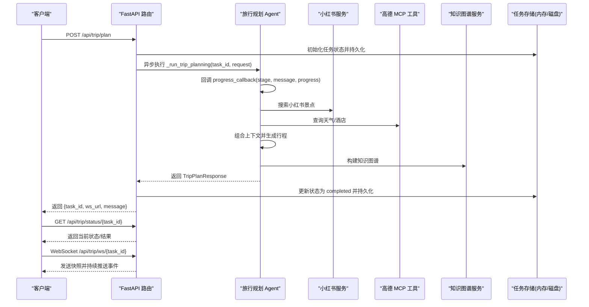
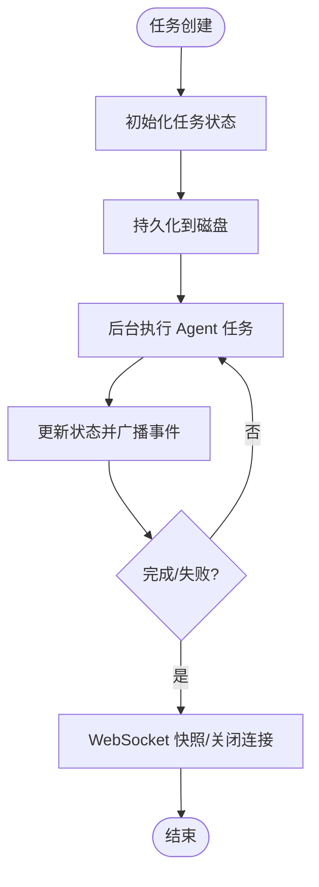
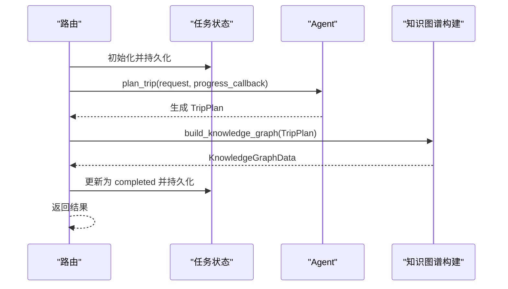
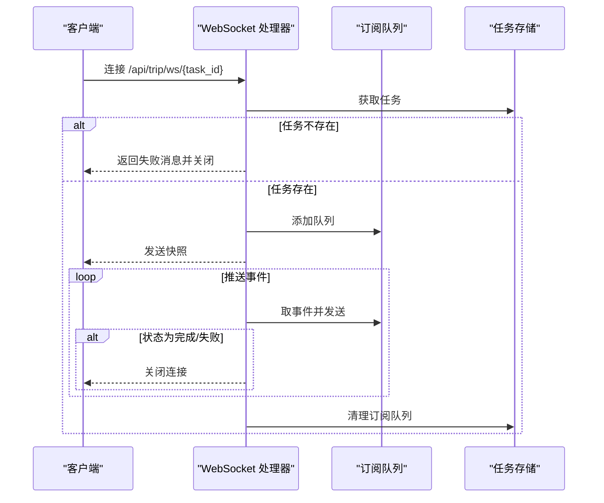
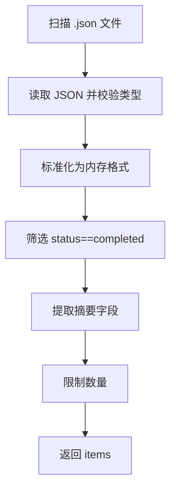
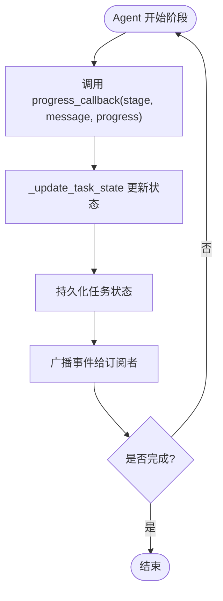
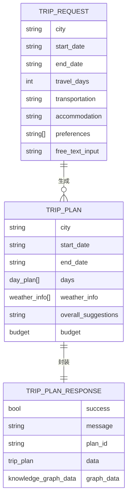
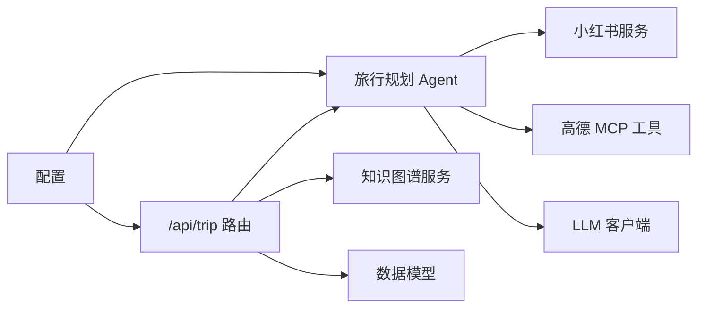

# 旅行规划路由

<cite>
**本文引用的文件**
- [trip.py](file://backend/app/api/routes/trip.py)
- [trip_planner_agent.py](file://backend/app/agents/trip_planner_agent.py)
- [schemas.py](file://backend/app/models/schemas.py)
- [main.py](file://backend/app/api/main.py)
- [config.py](file://backend/app/config.py)
- [knowledge_graph_service.py](file://backend/app/services/knowledge_graph_service.py)
- [xhs_service.py](file://backend/app/services/xhs_service.py)
- [amap_service.py](file://backend/app/services/amap_service.py)
- [README.md](file://README.md)
</cite>

## 目录
1. [简介](#简介)
2. [项目结构](#项目结构)
3. [核心组件](#核心组件)
4. [架构总览](#架构总览)
5. [详细组件分析](#详细组件分析)
6. [依赖关系分析](#依赖关系分析)
7. [性能考量](#性能考量)
8. [故障排查指南](#故障排查指南)
9. [结论](#结论)
10. [附录](#附录)

## 简介
本文件聚焦于 /trip 路由前缀下的旅行规划功能，涵盖任务提交、状态查询、WebSocket 实时订阅、任务状态管理（内存与磁盘持久化）、异步任务处理流程、WebSocket 通信机制、任务历史记录、任务状态回调机制与最佳实践。文档面向不同技术背景的读者，既提供高层架构说明，也给出代码级的可视化与参考路径，帮助快速理解与落地使用。

## 项目结构
后端采用 FastAPI + 多智能体协作的分层架构：
- 路由层：/api/trip 下的计划提交、状态查询、WebSocket 订阅、历史查询、健康检查
- 业务层：多智能体旅行规划 Agent，负责并发采集小红书、天气、酒店信息并生成行程
- 服务层：知识图谱构建、小红书搜索/签名校验、高德 MCP 工具封装
- 模型层：Pydantic 定义的请求/响应模型
- 配置层：运行时配置与校验

图表来源
- [trip.py:17-511](file://backend/app/api/routes/trip.py#L17-L511)
- [trip_planner_agent.py:173-826](file://backend/app/agents/trip_planner_agent.py#L173-L826)
- [knowledge_graph_service.py:34-169](file://backend/app/services/knowledge_graph_service.py#L34-L169)
- [xhs_service.py:247-444](file://backend/app/services/xhs_service.py#L247-L444)
- [amap_service.py:50-276](file://backend/app/services/amap_service.py#L50-L276)
- [schemas.py:10-264](file://backend/app/models/schemas.py#L10-L264)

章节来源
- [main.py:55-60](file://backend/app/api/main.py#L55-L60)
- [README.md:43-97](file://README.md#L43-L97)

## 核心组件
- 任务状态管理：内存字典 + 磁盘 JSON 持久化，支持服务重启后的状态恢复与失败兜底
- 异步任务执行：提交后立即返回 task_id，后台 asyncio 任务推进状态并广播
- WebSocket 实时订阅：连接即发送快照，断开自动清理订阅队列
- 历史记录：按最近更新时间返回已完成任务摘要，支持分页
- 状态回调：多智能体 Agent 通过回调推进进度，统一更新任务状态并持久化

章节来源
- [trip.py:19-145](file://backend/app/api/routes/trip.py#L19-L145)
- [trip.py:207-274](file://backend/app/api/routes/trip.py#L207-L274)
- [trip.py:390-440](file://backend/app/api/routes/trip.py#L390-L440)
- [trip.py:442-488](file://backend/app/api/routes/trip.py#L442-L488)
- [trip.py:491-508](file://backend/app/api/routes/trip.py#L491-L508)

## 架构总览
下图展示了从任务提交到完成的关键交互路径，包括多智能体 Agent 的数据采集与整合、知识图谱构建、以及状态持久化与广播。

图表来源
- [trip.py:276-388](file://backend/app/api/routes/trip.py#L276-L388)
- [trip_planner_agent.py:257-338](file://backend/app/agents/trip_planner_agent.py#L257-L338)
- [knowledge_graph_service.py:34-169](file://backend/app/services/knowledge_graph_service.py#L34-L169)
- [xhs_service.py:247-354](file://backend/app/services/xhs_service.py#L247-L354)
- [amap_service.py:50-121](file://backend/app/services/amap_service.py#L50-L121)

## 详细组件分析

### 任务状态管理与持久化
- 内存任务存储：以 task_id 为键的字典，包含状态、阶段、进度、消息、结果、错误、请求载荷、订阅队列等字段
- 磁盘持久化：任务状态序列化为 JSON，写入 data/trip_tasks/{task_id}.json，采用临时文件 + replace 的原子写入策略
- 服务重启处理：加载历史任务时，若状态不在完成集合，则标记为 failed 并写入错误消息，避免前端无限等待
- 任务生命周期：提交 -> 初始化 -> 执行中 -> 完成/失败 -> 持久化 -> 广播 -> 订阅结束

图表来源
- [trip.py:25-104](file://backend/app/api/routes/trip.py#L25-L104)
- [trip.py:125-145](file://backend/app/api/routes/trip.py#L125-L145)
- [trip.py:243-274](file://backend/app/api/routes/trip.py#L243-L274)
- [trip.py:390-440](file://backend/app/api/routes/trip.py#L390-L440)

章节来源
- [trip.py:19-104](file://backend/app/api/routes/trip.py#L19-L104)
- [trip.py:125-145](file://backend/app/api/routes/trip.py#L125-L145)
- [trip.py:243-274](file://backend/app/api/routes/trip.py#L243-L274)

### 异步任务处理流程
- 提交任务：生成 task_id，写入内存与磁盘，立即返回 task_id、ws_url 与提示
- 后台执行：创建 asyncio 任务，按阶段推进进度，通过回调更新状态
- 失败处理：捕获异常，区分小红书 Cookie 过期等特定错误，统一标记为 failed 并持久化
- 结果封装：生成 TripPlanResponse，包含 plan_id、data、graph_data

图表来源
- [trip.py:276-388](file://backend/app/api/routes/trip.py#L276-L388)
- [trip_planner_agent.py:257-338](file://backend/app/agents/trip_planner_agent.py#L257-L338)
- [knowledge_graph_service.py:34-169](file://backend/app/services/knowledge_graph_service.py#L34-L169)

章节来源
- [trip.py:276-388](file://backend/app/api/routes/trip.py#L276-L388)
- [trip_planner_agent.py:257-338](file://backend/app/agents/trip_planner_agent.py#L257-L338)

### WebSocket 通信机制
- 连接建立：接受 WebSocket，校验任务是否存在，不存在则返回失败并关闭
- 快照发送：向新订阅者发送当前任务快照，若已是最终状态则立即关闭
- 事件广播：通过队列向所有订阅者推送状态事件，清理断连的队列
- 断开处理：finally 中清理订阅队列并关闭连接

图表来源
- [trip.py:390-440](file://backend/app/api/routes/trip.py#L390-L440)

章节来源
- [trip.py:390-440](file://backend/app/api/routes/trip.py#L390-L440)

### 任务历史记录
- 历史加载：扫描 data/trip_tasks 目录，按修改时间倒序读取已完成任务
- 摘要提取：从磁盘 JSON 中抽取城市、日期、天数、总体建议等字段，生成首页摘要
- 分页查询：限制返回数量，避免一次性加载过多历史

图表来源
- [trip.py:183-204](file://backend/app/api/routes/trip.py#L183-L204)
- [trip.py:152-181](file://backend/app/api/routes/trip.py#L152-L181)

章节来源
- [trip.py:442-453](file://backend/app/api/routes/trip.py#L442-L453)
- [trip.py:183-204](file://backend/app/api/routes/trip.py#L183-L204)
- [trip.py:152-181](file://backend/app/api/routes/trip.py#L152-L181)

### 任务状态回调机制
- 回调签名：progress_callback(stage: str, message: str, progress: int)
- 多智能体推进：Agent 在每个阶段调用回调，统一通过 _update_task_state 更新状态并持久化
- 错误处理：捕获异常并标记为 failed，必要时区分小红书 Cookie 过期等特定错误

图表来源
- [trip_planner_agent.py:243-256](file://backend/app/agents/trip_planner_agent.py#L243-L256)
- [trip.py:243-274](file://backend/app/api/routes/trip.py#L243-L274)
- [trip.py:365-387](file://backend/app/api/routes/trip.py#L365-L387)

章节来源
- [trip_planner_agent.py:243-256](file://backend/app/agents/trip_planner_agent.py#L243-L256)
- [trip.py:243-274](file://backend/app/api/routes/trip.py#L243-L274)
- [trip.py:365-387](file://backend/app/api/routes/trip.py#L365-L387)

### 数据模型与知识图谱
- 请求/响应模型：TripRequest、TripPlan、TripPlanResponse、KnowledgeGraphData 等
- 知识图谱：从 TripPlan 中提取节点与边，生成 ECharts 可视化所需的数据结构

图表来源
- [schemas.py:10-264](file://backend/app/models/schemas.py#L10-L264)
- [knowledge_graph_service.py:34-169](file://backend/app/services/knowledge_graph_service.py#L34-L169)

章节来源
- [schemas.py:10-264](file://backend/app/models/schemas.py#L10-L264)
- [knowledge_graph_service.py:34-169](file://backend/app/services/knowledge_graph_service.py#L34-L169)

## 依赖关系分析
- 路由依赖：/api/trip 路由依赖多智能体 Agent、知识图谱服务、配置与模型
- Agent 依赖：小红书服务、高德 MCP 工具、LLM 客户端
- 服务依赖：配置读取、HTTP 客户端、签名工具
- 模型依赖：Pydantic 校验与序列化

图表来源
- [trip.py:13-15](file://backend/app/api/routes/trip.py#L13-L15)
- [trip_planner_agent.py:9-11](file://backend/app/agents/trip_planner_agent.py#L9-L11)
- [xhs_service.py:15-17](file://backend/app/services/xhs_service.py#L15-L17)
- [amap_service.py:5-6](file://backend/app/services/amap_service.py#L5-L6)
- [config.py:21-71](file://backend/app/config.py#L21-L71)

章节来源
- [trip.py:13-15](file://backend/app/api/routes/trip.py#L13-L15)
- [trip_planner_agent.py:9-11](file://backend/app/agents/trip_planner_agent.py#L9-L11)
- [xhs_service.py:15-17](file://backend/app/services/xhs_service.py#L15-L17)
- [amap_service.py:5-6](file://backend/app/services/amap_service.py#L5-L6)
- [config.py:21-71](file://backend/app/config.py#L21-L71)

## 性能考量
- 异步并发：Agent 在步骤1-3采用串行执行，避免多线程同时启动 uvx 子进程导致资源竞争；步骤4整合生成采用更长超时并支持重试
- JSON 解析容错：多轮修复策略（清理引号、截断修复、正则提取、LLM 修复），提升鲁棒性
- 任务持久化：原子写入（临时文件 + replace），降低损坏风险
- WebSocket 广播：队列去重与清理断连队列，避免内存泄漏

章节来源
- [trip_planner_agent.py:284-338](file://backend/app/agents/trip_planner_agent.py#L284-L338)
- [trip_planner_agent.py:424-602](file://backend/app/agents/trip_planner_agent.py#L424-L602)
- [trip.py:82-104](file://backend/app/api/routes/trip.py#L82-L104)
- [trip.py:226-241](file://backend/app/api/routes/trip.py#L226-L241)

## 故障排查指南
- 任务不存在：WebSocket 连接时若任务不存在，将返回失败消息并关闭连接
- 服务重启：重启后未完成任务会被标记为失败，避免前端无限等待
- 小红书 Cookie 过期：Agent 层捕获特定异常并返回友好错误消息
- 配置缺失：健康检查会暴露配置问题，需检查 LLM、高德、小红书 Cookie 等关键配置

章节来源
- [trip.py:394-408](file://backend/app/api/routes/trip.py#L394-L408)
- [trip.py:71-78](file://backend/app/api/routes/trip.py#L71-L78)
- [trip.py:496-507](file://backend/app/api/routes/trip.py#L496-L507)
- [xhs_service.py:22-24](file://backend/app/services/xhs_service.py#L22-L24)
- [config.py:163-179](file://backend/app/config.py#L163-L179)

## 结论
/ trip 路由实现了从任务提交到结果呈现的完整闭环：通过内存 + 磁盘的状态管理保障可靠性，借助多智能体 Agent 并发采集与整合数据，结合知识图谱构建与 WebSocket 实时订阅，为用户提供流畅的旅行规划体验。配套的健康检查与历史摘要进一步增强了系统的可观测性与可用性。

## 附录

### API 使用示例与最佳实践
- 提交任务
  - 方法与路径：POST /api/trip/plan
  - 请求体：符合 TripRequest 的 JSON
  - 返回：包含 task_id、ws_url、message
  - 最佳实践：在提交后立即启动轮询或 WebSocket 订阅，避免阻塞主线程
- 轮询状态
  - 方法与路径：GET /api/trip/status/{task_id}
  - 返回：processing/completed/failed 三种状态之一
  - 最佳实践：建议 3 秒轮询一次，完成后停止
- WebSocket 实时订阅
  - 路径：/api/trip/ws/{task_id}
  - 行为：连接即快照，随后持续推送事件，完成后自动关闭
  - 最佳实践：断开后可重新连接获取最新快照
- 历史摘要
  - 方法与路径：GET /api/trip/history?limit=N
  - 返回：最近 N 个已完成任务摘要
  - 最佳实践：limit 控制在 1-50 之间
- 健康检查
  - 方法与路径：GET /api/trip/health
  - 返回：服务健康状态与 Agent 信息
  - 最佳实践：部署后定期探测，异常时触发告警

章节来源
- [trip.py:276-312](file://backend/app/api/routes/trip.py#L276-L312)
- [trip.py:442-488](file://backend/app/api/routes/trip.py#L442-L488)
- [trip.py:390-440](file://backend/app/api/routes/trip.py#L390-L440)
- [trip.py:442-453](file://backend/app/api/routes/trip.py#L442-L453)
- [trip.py:491-508](file://backend/app/api/routes/trip.py#L491-L508)