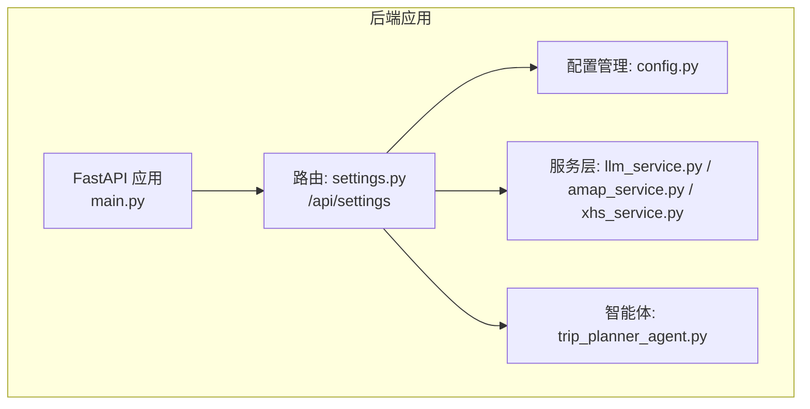
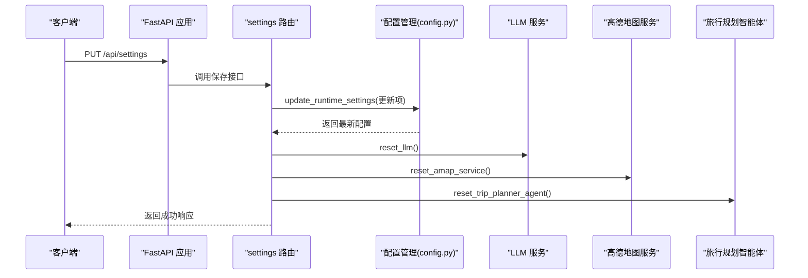
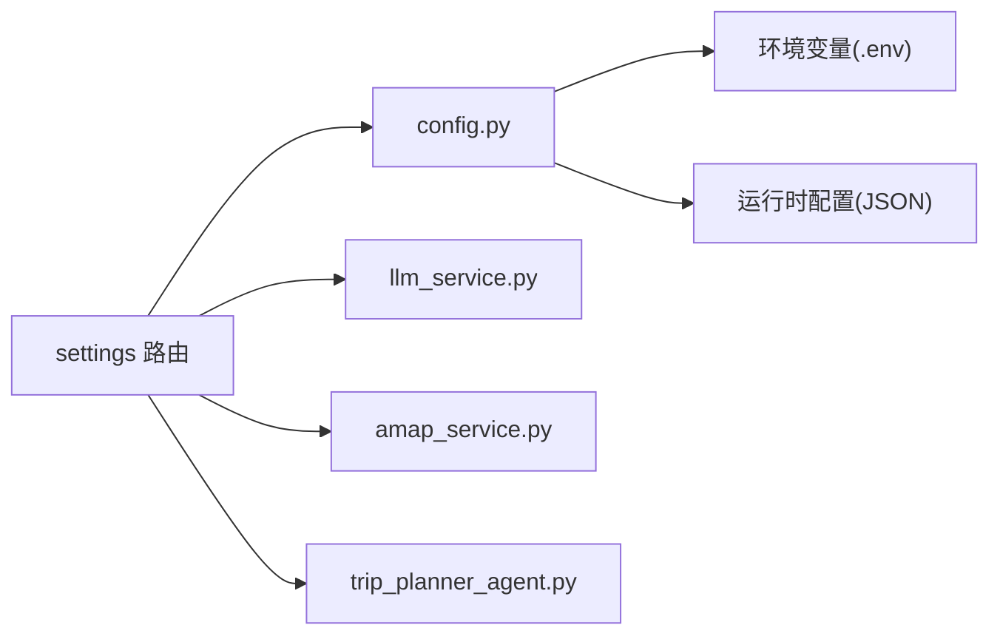

# 系统设置路由

<cite>
**本文引用的文件**
- [settings.py](file://backend/app/api/routes/settings.py)
- [config.py](file://backend/app/config.py)
- [main.py](file://backend/app/api/main.py)
- [schemas.py](file://backend/app/models/schemas.py)
- [amap_service.py](file://backend/app/services/amap_service.py)
- [llm_service.py](file://backend/app/services/llm_service.py)
- [trip_planner_agent.py](file://backend/app/agents/trip_planner_agent.py)
- [xhs_service.py](file://backend/app/services/xhs_service.py)
- [run.py](file://backend/run.py)
- [README.md](file://README.md)
</cite>

## 目录
1. [简介](#简介)
2. [项目结构](#项目结构)
3. [核心组件](#核心组件)
4. [架构总览](#架构总览)
5. [详细组件分析](#详细组件分析)
6. [依赖分析](#依赖分析)
7. [性能考量](#性能考量)
8. [故障排查指南](#故障排查指南)
9. [结论](#结论)
10. [附录](#附录)

## 简介
本文件聚焦于系统设置路由模块，围绕 /settings 路由前缀下的运行时配置管理与系统健康检查能力，系统性阐述以下主题：
- 环境配置与运行时配置的分层设计
- 配置项获取、动态更新与即时生效机制
- 权限控制与安全配置（CORS、认证、访问控制）
- 国际化配置与本地化资源管理
- 系统健康检查与依赖检查
- 使用示例与最佳实践

## 项目结构
系统设置路由位于后端 FastAPI 应用的路由层，与配置管理、服务层（LLM、高德地图、小红书）紧密耦合。整体结构如下：

图表来源
- [main.py:55-60](file://backend/app/api/main.py#L55-L60)
- [settings.py:13](file://backend/app/api/routes/settings.py#L13)

章节来源
- [main.py:55-60](file://backend/app/api/main.py#L55-L60)
- [settings.py:13](file://backend/app/api/routes/settings.py#L13)

## 核心组件
- 系统设置路由（/api/settings）
  - GET /api/settings：获取当前运行时配置
  - PUT /api/settings：保存运行时配置并立即生效
- 配置管理模块（config.py）
  - 运行时配置的读取、持久化与同步
  - 环境变量加载与兼容性处理
  - 配置校验与打印
- 服务层与智能体
  - LLM、高德地图、小红书服务在配置更新后热重启，确保新配置立即生效
- 健康检查
  - /api/health：系统健康状态检查

章节来源
- [settings.py:27-55](file://backend/app/api/routes/settings.py#L27-L55)
- [config.py:129-202](file://backend/app/config.py#L129-L202)
- [main.py:112-119](file://backend/app/api/main.py#L112-L119)

## 架构总览
系统设置路由通过 FastAPI 路由器挂载至 /api 前缀，与配置管理模块解耦，实现“运行时配置”的动态更新与即时生效。更新流程会触发相关服务与智能体的热重启，保证配置变更对下游服务的影响最小化。

图表来源
- [settings.py:37-55](file://backend/app/api/routes/settings.py#L37-L55)
- [config.py:146-159](file://backend/app/config.py#L146-L159)
- [llm_service.py:70-74](file://backend/app/services/llm_service.py#L70-L74)
- [amap_service.py:271-276](file://backend/app/services/amap_service.py#L271-L276)
- [trip_planner_agent.py:176-242](file://backend/app/agents/trip_planner_agent.py#L176-L242)

## 详细组件分析

### 系统设置路由（/api/settings）
- 路由前缀与标签
  - 前缀：/api/settings
  - 标签：运行时配置
- 数据模型
  - RuntimeSettingsPayload：定义可更新的运行时配置项，包括高德 Web Key、高德 JS SDK Key、小红书 Cookie、LLM API Key、Base URL、模型等
- 接口设计
  - GET /api/settings：返回当前运行时配置
  - PUT /api/settings：接收更新负载，持久化并同步到全局配置，随后重置相关服务与智能体，确保新配置立即生效
- 错误处理
  - 更新失败时抛出 HTTP 500 异常，包含错误详情

章节来源
- [settings.py:13-13](file://backend/app/api/routes/settings.py#L13)
- [settings.py:16-25](file://backend/app/api/routes/settings.py#L16-L25)
- [settings.py:27-34](file://backend/app/api/routes/settings.py#L27-L34)
- [settings.py:37-55](file://backend/app/api/routes/settings.py#L37-L55)

### 配置管理模块（config.py）
- 配置分层
  - 环境变量配置：通过 pydantic-settings 从 .env 加载，支持别名映射（OPENAI_* 与 LLM_*）
  - 运行时配置：以 JSON 文件形式持久化，覆盖环境变量，支持增量更新
- 运行时配置键集合
  - vite_amap_web_key、vite_amap_web_js_key、xhs_cookie、openai_api_key、openai_base_url、openai_model
- 关键函数
  - get_runtime_settings：返回当前运行时配置快照
  - update_runtime_settings：标准化更新项、持久化、同步到全局配置并返回最新值
  - _apply_runtime_overrides/_sync_env_from_settings：将运行时配置同步到环境变量，兼容第三方组件读取
  - validate_config/print_config：配置校验与调试打印
- CORS 配置
  - 通过字符串形式存储允许的源，运行时解析为列表

章节来源
- [config.py:21-67](file://backend/app/config.py#L21-L67)
- [config.py:72-80](file://backend/app/config.py#L72-L80)
- [config.py:134-159](file://backend/app/config.py#L134-L159)
- [config.py:162-179](file://backend/app/config.py#L162-L179)
- [config.py:65-67](file://backend/app/config.py#L65-L67)

### 服务与智能体热重启
- LLM 服务
  - reset_llm：重置全局 LLM 实例，使新配置（API Key、Base URL、模型）立即生效
- 高德地图服务
  - reset_amap_service：重置高德 MCP 工具与服务实例，确保新 Key 生效
- 旅行规划智能体
  - reset_trip_planner_agent：重置智能体内部工具与状态，保证新配置影响到后续规划

章节来源
- [settings.py:45-47](file://backend/app/api/routes/settings.py#L45-L47)
- [llm_service.py:70-74](file://backend/app/services/llm_service.py#L70-L74)
- [amap_service.py:271-276](file://backend/app/services/amap_service.py#L271-L276)
- [trip_planner_agent.py:176-242](file://backend/app/agents/trip_planner_agent.py#L176-L242)

### 健康检查与系统信息
- 健康检查
  - /api/health：返回服务健康状态、应用名称与版本
- 系统信息
  - /api/settings：返回当前运行时配置（可用于系统信息展示）

章节来源
- [main.py:112-119](file://backend/app/api/main.py#L112-L119)
- [settings.py:27-34](file://backend/app/api/routes/settings.py#L27-L34)

### 国际化配置管理
- 前端国际化
  - 项目 README 明确支持多语言（Vue I18n），前端具备多语言切换能力
- 后端国际化
  - 当前系统设置路由未暴露后端语言/区域设置接口；语言切换主要由前端负责
- 本地化资源
  - 前端 i18n 资源位于 frontend/src/i18n/locales，包含中文、英文、日文等

章节来源
- [README.md:30](file://README.md#L30)
- [README.md:205-232](file://README.md#L205-L232)

### 安全配置选项
- CORS 设置
  - 通过配置项 cors_origins（字符串，逗号分隔）在运行时解析为允许的源列表
  - 应用启动时注册 CORSMiddleware，允许凭据、任意方法与头部
- 认证与访问控制
  - 当前系统设置路由未实现专门的认证/授权中间件；如需增强，可在路由层添加权限装饰器或中间件
- 环境变量与敏感信息
  - LLM API Key、高德 Key、小红书 Cookie 等通过运行时配置管理，避免硬编码

章节来源
- [config.py:33-35](file://backend/app/config.py#L33-L35)
- [main.py:47-53](file://backend/app/api/main.py#L47-L53)

## 依赖分析
系统设置路由与配置管理、服务层、智能体之间存在清晰的依赖关系，更新配置会触发相关组件的热重启，确保一致性。

图表来源
- [settings.py:8-11](file://backend/app/api/routes/settings.py#L8-L11)
- [config.py:129-159](file://backend/app/config.py#L129-L159)
- [llm_service.py:12-67](file://backend/app/services/llm_service.py#L12-L67)
- [amap_service.py:12-47](file://backend/app/services/amap_service.py#L12-L47)
- [trip_planner_agent.py:176-242](file://backend/app/agents/trip_planner_agent.py#L176-L242)

章节来源
- [settings.py:8-11](file://backend/app/api/routes/settings.py#L8-L11)
- [config.py:129-159](file://backend/app/config.py#L129-L159)

## 性能考量
- 运行时配置更新成本
  - 更新操作涉及磁盘写入（持久化）、内存同步（全局配置）、服务热重启，属于轻量级操作
- 服务热重启开销
  - LLM、高德地图、智能体的重置为幂等操作，通常在毫秒到秒级完成
- 健康检查
  - /api/health 为轻量接口，适合高频探活

[本节为通用性能讨论，无需特定文件来源]

## 故障排查指南
- 配置更新后未生效
  - 确认 /api/settings 返回的 data 与预期一致
  - 检查运行时配置 JSON 文件是否成功写入
  - 确认 reset_* 调用链是否执行（LLM、高德、智能体）
- LLM 无法连接
  - 检查 openai_api_key、openai_base_url、openai_model 是否正确
  - 若使用第三方中转，确认 User-Agent 伪装与超时设置
- 高德地图功能不可用
  - 检查 vite_amap_web_key 是否配置
  - 确认 MCP 工具初始化日志
- 小红书功能异常
  - 检查 xhs_cookie 是否有效，必要时更换 Cookie
  - 关注风控拦截错误（300011）
- CORS 问题
  - 检查 cors_origins 配置，确认前端域名已包含
- 健康检查失败
  - 查看 /api/health 返回状态
  - 检查应用启动日志与配置校验输出

章节来源
- [settings.py:54-55](file://backend/app/api/routes/settings.py#L54-L55)
- [config.py:162-179](file://backend/app/config.py#L162-L179)
- [llm_service.py:51-61](file://backend/app/services/llm_service.py#L51-L61)
- [amap_service.py:24-25](file://backend/app/services/amap_service.py#L24-L25)
- [xhs_service.py:137-141](file://backend/app/services/xhs_service.py#L137-L141)
- [main.py:112-119](file://backend/app/api/main.py#L112-L119)

## 结论
系统设置路由提供了简洁而强大的运行时配置管理能力，结合配置持久化与服务热重启机制，实现了配置的即时生效与最小化影响。配合健康检查与配置校验，系统在开发与生产环境中均具备良好的可观测性与稳定性。未来可在路由层引入认证与审计日志，进一步提升安全性与可追溯性。

[本节为总结性内容，无需特定文件来源]

## 附录

### 使用示例
- 查询当前运行时配置
  - 请求：GET /api/settings
  - 响应：包含 success、message、data（运行时配置）
- 更新运行时配置并生效
  - 请求：PUT /api/settings
  - 负载：RuntimeSettingsPayload（可选字段）
  - 响应：包含 success、message、data（最新配置）
- 健康检查
  - 请求：GET /api/health
  - 响应：包含 status、service、version

章节来源
- [settings.py:27-34](file://backend/app/api/routes/settings.py#L27-L34)
- [settings.py:37-55](file://backend/app/api/routes/settings.py#L37-L55)
- [main.py:112-119](file://backend/app/api/main.py#L112-L119)

### 最佳实践
- 配置管理
  - 优先使用运行时配置管理，避免硬编码敏感信息
  - 更新配置后及时验证服务可用性
- 安全配置
  - 严格管理 CORS 源列表，仅允许可信域名
  - 对外暴露的路由建议增加认证与速率限制
- 国际化
  - 语言切换由前端负责，后端保持无状态
- 运维
  - 使用 /api/health 进行健康探活
  - 结合日志与配置校验输出进行问题定位

[本节为通用最佳实践，无需特定文件来源]