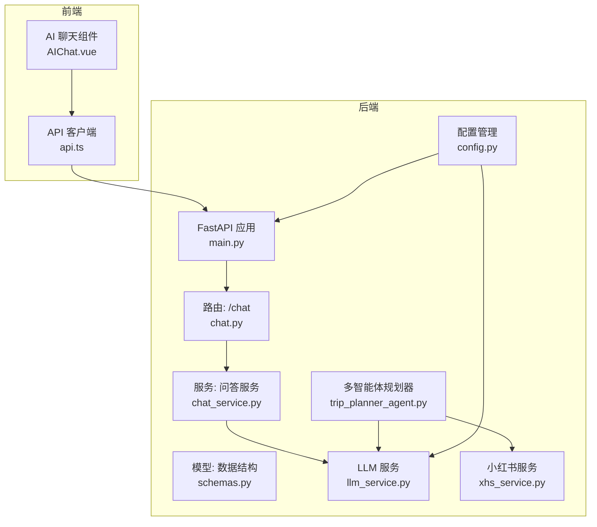
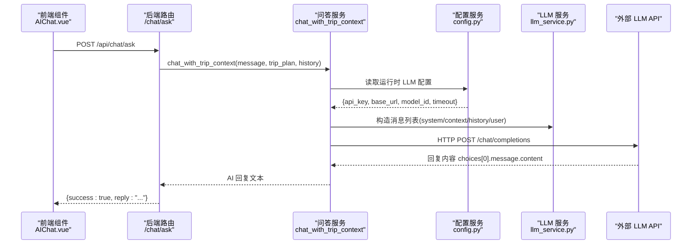
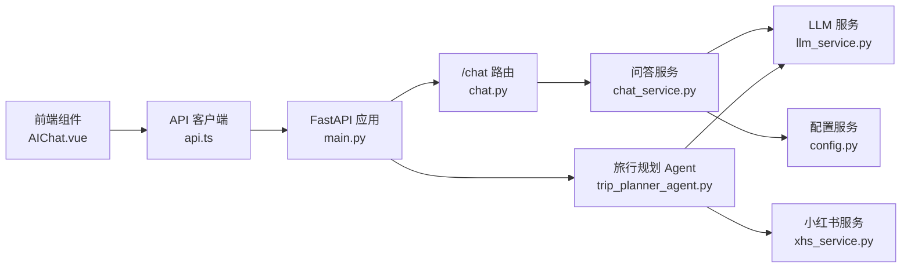

# 聊天问答路由

<cite>
**本文档引用的文件**
- [chat.py](file://backend/app/api/routes/chat.py)
- [schemas.py](file://backend/app/models/schemas.py)
- [chat_service.py](file://backend/app/services/chat_service.py)
- [trip_planner_agent.py](file://backend/app/agents/trip_planner_agent.py)
- [llm_service.py](file://backend/app/services/llm_service.py)
- [main.py](file://backend/app/api/main.py)
- [config.py](file://backend/app/config.py)
- [xhs_service.py](file://backend/app/services/xhs_service.py)
- [AIChat.vue](file://frontend/src/components/AIChat.vue)
- [api.ts](file://frontend/src/services/api.ts)
</cite>

## 目录
1. [简介](#简介)
2. [项目结构](#项目结构)
3. [核心组件](#核心组件)
4. [架构总览](#架构总览)
5. [详细组件分析](#详细组件分析)
6. [依赖关系分析](#依赖关系分析)
7. [性能考虑](#性能考虑)
8. [故障排查指南](#故障排查指南)
9. [结论](#结论)
10. [附录](#附录)

## 简介
本文件面向“聊天问答路由模块”，系统性阐述 /chat 路由前缀下的智能问答功能实现，重点覆盖：
- 旅行相关问题的处理机制与上下文注入策略
- 问答接口设计：请求参数校验、响应格式标准化、上下文管理
- 与多智能体系统的集成：Agent 调用、工具使用、结果处理
- 问答会话管理：会话状态保持、历史记录存储、上下文传递
- 错误处理与异常情况：网络错误、服务不可用、参数错误
- 使用示例：基础问答、复杂问题、多轮对话
- 性能优化建议与安全配置指导

## 项目结构
后端采用 FastAPI + HelloAgents 框架，前端 Vue3 + TypeScript。问答路由位于后端 API 层，服务层负责将旅行计划作为上下文注入 LLM，多智能体系统负责旅行规划生成与工具调用。

图表来源
- [main.py:55-60](file://backend/app/api/main.py#L55-L60)
- [chat.py:7-15](file://backend/app/api/routes/chat.py#L7-L15)
- [chat_service.py:65-100](file://backend/app/services/chat_service.py#L65-L100)
- [llm_service.py:12-67](file://backend/app/services/llm_service.py#L12-L67)
- [trip_planner_agent.py:173-241](file://backend/app/agents/trip_planner_agent.py#L173-L241)
- [config.py:21-71](file://backend/app/config.py#L21-L71)
- [xhs_service.py:68-198](file://backend/app/services/xhs_service.py#L68-L198)
- [AIChat.vue:154-200](file://frontend/src/components/AIChat.vue#L154-L200)
- [api.ts:117-147](file://frontend/src/services/api.ts#L117-L147)

章节来源
- [main.py:55-60](file://backend/app/api/main.py#L55-L60)
- [chat.py:7-15](file://backend/app/api/routes/chat.py#L7-L15)

## 核心组件
- 路由层：/chat/ask 接口，接收 TripChatRequest，返回 TripChatResponse
- 服务层：chat_with_trip_context 将旅行计划上下文注入 LLM，追加历史对话，调用外部 LLM API
- 模型层：TripChatRequest/TripChatResponse 定义问答请求与响应的数据结构
- LLM 层：get_llm 单例，统一管理模型、密钥、基础地址、超时等
- 多智能体层：MultiAgentTripPlanner 负责旅行规划，包含天气、酒店、景点等 Agent 与工具
- 配置层：Settings 统一读取环境变量与运行时配置，支持热更新
- 前端层：AIChat.vue + api.ts 负责聊天 UI、历史记录、快捷问题、WS/HTTP 交互

章节来源
- [chat.py:16-52](file://backend/app/api/routes/chat.py#L16-L52)
- [chat_service.py:65-133](file://backend/app/services/chat_service.py#L65-L133)
- [schemas.py:245-264](file://backend/app/models/schemas.py#L245-L264)
- [llm_service.py:12-67](file://backend/app/services/llm_service.py#L12-L67)
- [trip_planner_agent.py:173-241](file://backend/app/agents/trip_planner_agent.py#L173-L241)
- [config.py:21-71](file://backend/app/config.py#L21-L71)

## 架构总览
问答流程从前端发起，后端路由接收请求，服务层构造消息列表（系统提示 + 上下文 + 历史 + 当前问题），调用 LLM API 获取回复，最终以标准化响应返回。

图表来源
- [chat.py:16-52](file://backend/app/api/routes/chat.py#L16-L52)
- [chat_service.py:65-133](file://backend/app/services/chat_service.py#L65-L133)
- [llm_service.py:12-67](file://backend/app/services/llm_service.py#L12-L67)
- [config.py:21-71](file://backend/app/config.py#L21-L71)

## 详细组件分析

### 路由层：/chat/ask
- 路由前缀：/api/chat
- 方法：POST /ask
- 请求体：TripChatRequest（message, trip_plan, history）
- 响应体：TripChatResponse（success, reply）
- 参数转换：将 history 列表转换为 dict 列表，便于后续消息拼接
- 错误处理：捕获异常并抛出 HTTP 500，返回统一错误信息

章节来源
- [chat.py:7-15](file://backend/app/api/routes/chat.py#L7-L15)
- [chat.py:16-52](file://backend/app/api/routes/chat.py#L16-L52)
- [schemas.py:245-264](file://backend/app/models/schemas.py#L245-L264)

### 服务层：chat_with_trip_context
- 上下文构建：将 trip_plan 转为 JSON 文本，作为 system prompt 之外的上下文注入
- 历史对话：可选的历史消息列表，逐条追加到消息数组
- LLM 配置：运行时读取配置，支持前端设置页热更新
- 调用链路：构造 /chat/completions 请求，异步调用，处理 HTTPStatusError、TimeoutException、其他异常
- 返回值：AI 回复文本，或友好错误提示

章节来源
- [chat_service.py:65-133](file://backend/app/services/chat_service.py#L65-L133)

### 模型层：数据结构
- TripChatRequest：message（必填）、trip_plan（必填，dict）、history（可选）
- TripChatResponse：success（默认 true）、reply（AI 回复）

章节来源
- [schemas.py:245-264](file://backend/app/models/schemas.py#L245-L264)

### LLM 层：get_llm 单例
- 初始化：读取配置（API Key、Base URL、Model、Timeout），创建 HelloAgentsLLM 实例
- 安全增强：为底层 OpenAI client 设置浏览器 UA，规避第三方中转 API 的 WAF 拦截
- 重置：reset_llm 支持测试或重新配置

章节来源
- [llm_service.py:12-67](file://backend/app/services/llm_service.py#L12-L67)

### 多智能体层：MultiAgentTripPlanner
- 组件构成：天气 Agent、酒店 Agent、行程规划 Agent
- 工具集成：MCPTool（amap_maps_*），通过 hello_agents 注册
- 并发优化：旅行规划四阶段（景点/天气/酒店搜集 + 规划整合），前三步并发，第四步串行
- JSON 修复：多轮容错清理（去注释、修复引号、截断修复、正则提取、LLM 修复）
- 失败回退：_create_fallback_plan 生成基础计划

章节来源
- [trip_planner_agent.py:173-241](file://backend/app/agents/trip_planner_agent.py#L173-L241)
- [trip_planner_agent.py:354-422](file://backend/app/agents/trip_planner_agent.py#L354-L422)
- [trip_planner_agent.py:424-602](file://backend/app/agents/trip_planner_agent.py#L424-L602)
- [trip_planner_agent.py:650-758](file://backend/app/agents/trip_planner_agent.py#L650-L758)
- [trip_planner_agent.py:760-804](file://backend/app/agents/trip_planner_agent.py#L760-L804)

### 配置层：Settings
- 环境变量：OPENAI_API_KEY/OPENAI_BASE_URL/OPENAI_MODEL 等别名
- 运行时覆盖：runtime_settings.json 持久化，支持热更新同步至环境变量
- 校验：validate_config 输出警告，提示缺失配置项

章节来源
- [config.py:21-71](file://backend/app/config.py#L21-L71)
- [config.py:129-160](file://backend/app/config.py#L129-L160)
- [config.py:162-179](file://backend/app/config.py#L162-L179)

### 前端层：AIChat.vue 与 api.ts
- UI：浮动聊天面板、快捷问题、输入框、滚动到底部
- 交互：禁用条件（无 tripPlan、加载中、输入为空）、发送消息、快捷问题
- API：axios 客户端，请求 baseURL 动态切换，拦截器打印日志
- 任务：旅行规划使用 WS/HTTP 轮询，聊天问答使用 HTTP POST

章节来源
- [AIChat.vue:154-200](file://frontend/src/components/AIChat.vue#L154-L200)
- [api.ts:117-147](file://frontend/src/services/api.ts#L117-L147)

## 依赖关系分析

图表来源
- [chat.py:3-5](file://backend/app/api/routes/chat.py#L3-L5)
- [chat_service.py:11-11](file://backend/app/services/chat_service.py#L11-L11)
- [llm_service.py:5-6](file://backend/app/services/llm_service.py#L5-L6)
- [trip_planner_agent.py:7-11](file://backend/app/agents/trip_planner_agent.py#L7-L11)
- [xhs_service.py:15-17](file://backend/app/services/xhs_service.py#L15-L17)
- [main.py:18-20](file://backend/app/api/main.py#L18-L20)

章节来源
- [chat.py:3-5](file://backend/app/api/routes/chat.py#L3-L5)
- [chat_service.py:11-11](file://backend/app/services/chat_service.py#L11-L11)
- [trip_planner_agent.py:7-11](file://backend/app/agents/trip_planner_agent.py#L7-L11)
- [main.py:18-20](file://backend/app/api/main.py#L18-L20)

## 性能考虑
- LLM 调用超时：服务层默认超时可配置，避免阻塞；旅行规划 Agent 重试一次，提升稳定性
- 并发优化：旅行规划前三步并发，第四步串行，缩短总耗时
- JSON 修复：多轮容错清理，减少因 LLM 输出不规范导致的解析失败
- 前端交互：聊天面板懒加载、滚动到底部、禁用条件优化用户体验
- 网络安全：LLM 客户端设置浏览器 UA，降低被 WAF 拦截风险

章节来源
- [chat_service.py:50](file://backend/app/services/chat_service.py#L50)
- [trip_planner_agent.py:264-267](file://backend/app/agents/trip_planner_agent.py#L264-L267)
- [trip_planner_agent.py:372-387](file://backend/app/agents/trip_planner_agent.py#L372-L387)
- [llm_service.py:51-61](file://backend/app/services/llm_service.py#L51-L61)

## 故障排查指南
- 问答接口异常
  - 现象：HTTP 500，返回统一错误信息
  - 排查：查看后端日志，确认 LLM 配置是否正确、网络是否可达
- LLM 调用失败
  - HTTPStatusError：检查 API Key、Base URL、模型是否正确
  - TimeoutException：增大 LLM_TIMEOUT 或优化网络
  - 其他异常：查看服务层异常分支，返回友好提示
- 多智能体规划失败
  - JSON 解析失败：检查 _parse_response 的修复链路是否触发
  - 超时重试：确认 TRIP_PLANNER_TIMEOUT 是否合理
- 前端聊天不可用
  - 无 tripPlan：前端禁用输入框，需先生成旅行计划
  - API 基础 URL：检查本地存储的 runtime api_base_url 是否正确

章节来源
- [chat.py:45-52](file://backend/app/api/routes/chat.py#L45-L52)
- [chat_service.py:124-132](file://backend/app/services/chat_service.py#L124-L132)
- [trip_planner_agent.py:372-387](file://backend/app/agents/trip_planner_agent.py#L372-L387)
- [AIChat.vue:167-170](file://frontend/src/components/AIChat.vue#L167-L170)
- [api.ts:61-75](file://frontend/src/services/api.ts#L61-L75)

## 结论
本模块通过“路由 + 服务 + 模型 + LLM + 多智能体”的分层设计，实现了将旅行计划作为上下文注入的智能问答能力。服务层具备完善的错误处理与超时控制，前端提供友好的聊天体验。结合多智能体的并发优化与 JSON 修复策略，整体具备较好的稳定性与扩展性。

## 附录

### 接口定义与使用示例

- 接口路径
  - POST /api/chat/ask
- 请求体（TripChatRequest）
  - message: 用户提问内容
  - trip_plan: 当前旅行计划（dict）
  - history: 历史对话记录（可选）
- 响应体（TripChatResponse）
  - success: 是否成功
  - reply: AI 回复内容
- 示例场景
  - 基础问答：询问某天的景点详情
  - 复杂问题：结合预算、天气、交通的综合建议
  - 多轮对话：连续追问同一行程的不同方面

章节来源
- [chat.py:10-15](file://backend/app/api/routes/chat.py#L10-L15)
- [schemas.py:245-264](file://backend/app/models/schemas.py#L245-L264)

### 与多智能体系统的集成
- Agent 调用：天气、酒店 Agent 通过 MCPTool 调用 amap_maps_* 工具
- 工具使用：严格遵循工具调用格式，避免自定义格式
- 结果处理：多轮 JSON 修复，确保最终 TripPlan 可解析

章节来源
- [trip_planner_agent.py:184-196](file://backend/app/agents/trip_planner_agent.py#L184-L196)
- [trip_planner_agent.py:206-230](file://backend/app/agents/trip_planner_agent.py#L206-L230)
- [trip_planner_agent.py:424-602](file://backend/app/agents/trip_planner_agent.py#L424-L602)

### 问答会话管理
- 会话状态：后端不持久化会话，仅在请求内传递 history
- 历史记录：history 为可选数组，逐条追加到消息列表
- 上下文传递：trip_plan 作为 JSON 文本注入，保证上下文一致性

章节来源
- [chat_service.py:86-100](file://backend/app/services/chat_service.py#L86-L100)
- [schemas.py:245-257](file://backend/app/models/schemas.py#L245-L257)

### 错误处理与异常情况
- 网络错误：HTTPStatusError -> 返回友好提示
- 服务不可用：TimeoutException -> 返回超时提示
- 参数错误：路由层捕获异常 -> HTTP 500
- LLM 配置缺失：直接返回提示，引导用户配置

章节来源
- [chat_service.py:124-132](file://backend/app/services/chat_service.py#L124-L132)
- [chat.py:45-52](file://backend/app/api/routes/chat.py#L45-L52)
- [chat_service.py:83-84](file://backend/app/services/chat_service.py#L83-L84)

### 性能优化建议
- 合理设置 LLM_TIMEOUT，避免长时间阻塞
- 前端输入防抖与禁用条件，减少无效请求
- 多智能体规划的并发策略，缩短总耗时
- JSON 修复链路的顺序优化，优先本地修复，再考虑 LLM 修复

章节来源
- [chat_service.py:50](file://backend/app/services/chat_service.py#L50)
- [trip_planner_agent.py:264-267](file://backend/app/agents/trip_planner_agent.py#L264-L267)
- [trip_planner_agent.py:650-758](file://backend/app/agents/trip_planner_agent.py#L650-L758)

### 安全配置指导
- LLM 密钥与 Base URL：通过环境变量或运行时设置页配置
- 浏览器 UA：LLM 客户端已设置默认 UA，降低被 WAF 拦截概率
- CORS：后端统一配置允许的 Origin 列表
- 前端 API 基础 URL：支持本地存储与热更新

章节来源
- [config.py:44-55](file://backend/app/config.py#L44-L55)
- [llm_service.py:51-61](file://backend/app/services/llm_service.py#L51-L61)
- [main.py:47-53](file://backend/app/api/main.py#L47-L53)
- [api.ts:61-75](file://frontend/src/services/api.ts#L61-L75)