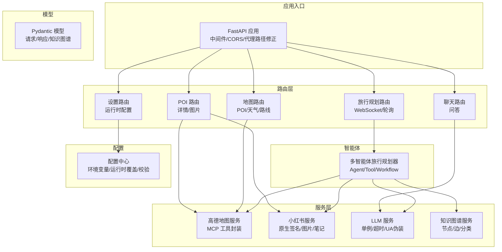
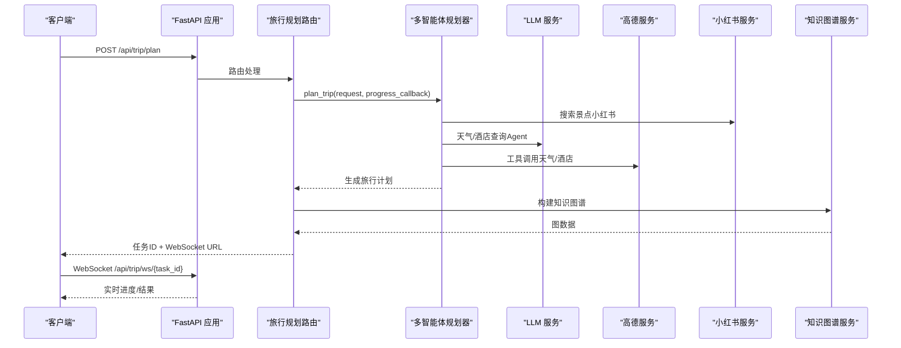
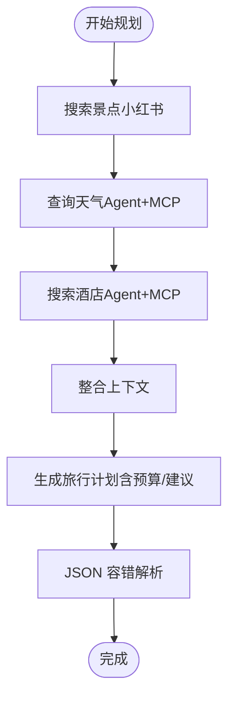
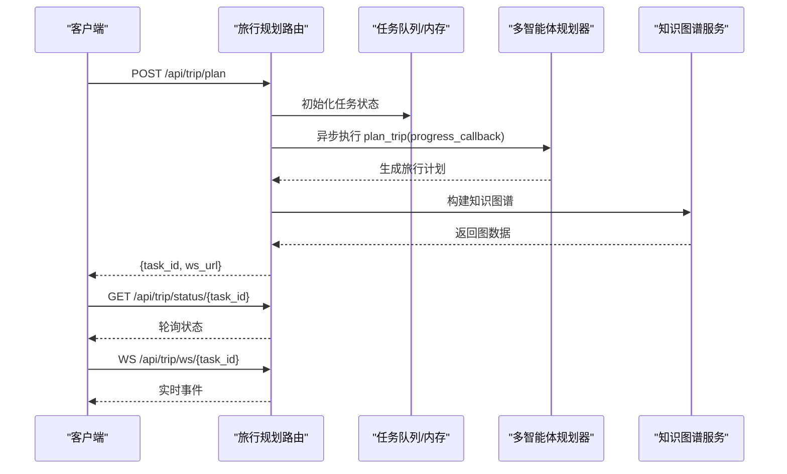
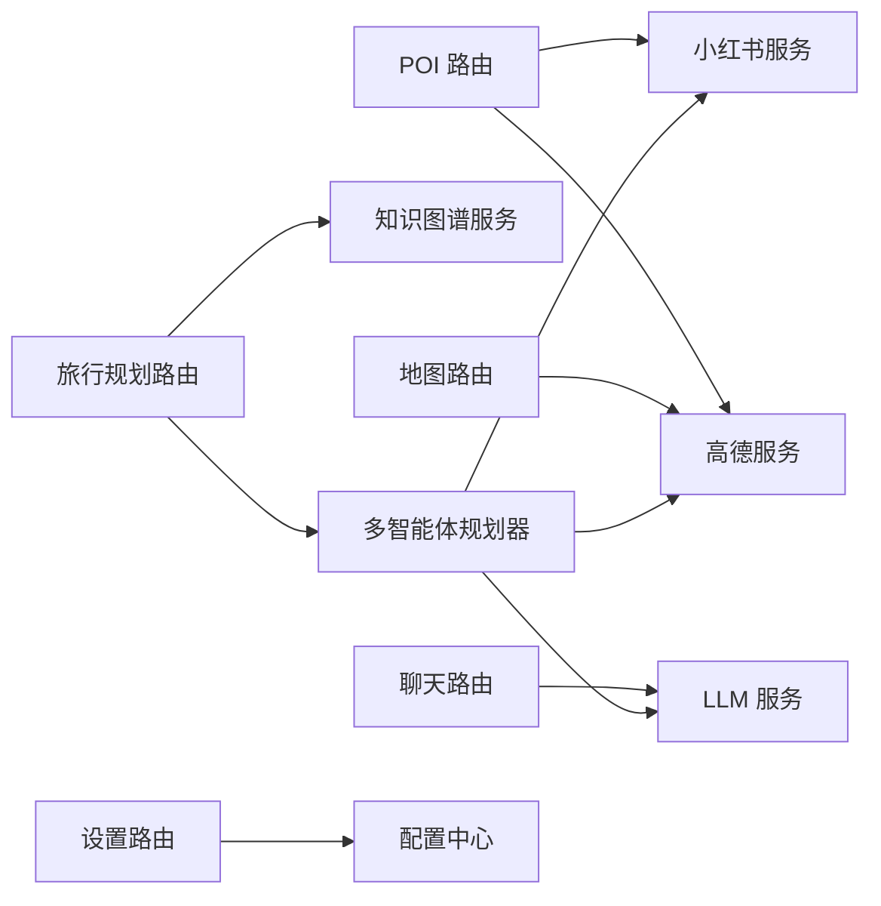

# 后端开发指南

<cite>
**本文引用的文件**
- [backend/app/api/main.py](file://backend/app/api/main.py)
- [backend/app/config.py](file://backend/app/config.py)
- [backend/app/models/schemas.py](file://backend/app/models/schemas.py)
- [backend/app/agents/trip_planner_agent.py](file://backend/app/agents/trip_planner_agent.py)
- [backend/app/services/amap_service.py](file://backend/app/services/amap_service.py)
- [backend/app/services/xhs_service.py](file://backend/app/services/xhs_service.py)
- [backend/app/services/llm_service.py](file://backend/app/services/llm_service.py)
- [backend/app/services/knowledge_graph_service.py](file://backend/app/services/knowledge_graph_service.py)
- [backend/app/api/routes/trip.py](file://backend/app/api/routes/trip.py)
- [backend/app/api/routes/map.py](file://backend/app/api/routes/map.py)
- [backend/app/api/routes/poi.py](file://backend/app/api/routes/poi.py)
- [backend/app/api/routes/chat.py](file://backend/app/api/routes/chat.py)
- [backend/app/api/routes/settings.py](file://backend/app/api/routes/settings.py)
- [backend/run.py](file://backend/run.py)
</cite>

## 目录
1. [简介](#简介)
2. [项目结构](#项目结构)
3. [核心组件](#核心组件)
4. [架构总览](#架构总览)
5. [详细组件分析](#详细组件分析)
6. [依赖分析](#依赖分析)
7. [性能考虑](#性能考虑)
8. [故障排查指南](#故障排查指南)
9. [结论](#结论)
10. [附录](#附录)

## 简介
本指南面向后端开发者，系统讲解基于 FastAPI 的 TripStar 后端架构与实现，涵盖路由组织、中间件配置、异常处理、多智能体系统、服务模块、API 设计、数据模型、异步任务与 WebSocket 状态推送、以及最佳实践。读者无需深入技术背景即可理解并扩展系统功能。

## 项目结构
后端采用分层与功能域结合的组织方式：
- 应用入口与中间件：FastAPI 应用、CORS、代理路径修正、静态文件与 SPA 回退
- 配置中心：统一读取环境变量、运行时覆盖、校验与打印
- 数据模型：Pydantic 模型定义请求/响应与知识图谱数据
- 服务层：高德地图、小红书、LLM、知识图谱构建
- 路由层：旅行规划（含 WebSocket 与轮询）、POI/地图/天气、聊天问答、运行时配置
- 代理与工具：多智能体 Agent、Tool 集成与 Workflow 编排

图表来源
- [backend/app/api/main.py:24-61](file://backend/app/api/main.py#L24-L61)
- [backend/app/api/routes/trip.py:17-18](file://backend/app/api/routes/trip.py#L17-L18)
- [backend/app/api/routes/map.py:14-14](file://backend/app/api/routes/map.py#L14-L14)
- [backend/app/api/routes/poi.py:8-8](file://backend/app/api/routes/poi.py#L8-L8)
- [backend/app/api/routes/chat.py:7-7](file://backend/app/api/routes/chat.py#L7-L7)
- [backend/app/api/routes/settings.py:13-13](file://backend/app/api/routes/settings.py#L13-L13)
- [backend/app/services/amap_service.py:50-56](file://backend/app/services/amap_service.py#L50-L56)
- [backend/app/services/xhs_service.py:68-78](file://backend/app/services/xhs_service.py#L68-L78)
- [backend/app/services/llm_service.py:12-19](file://backend/app/services/llm_service.py#L12-L19)
- [backend/app/services/knowledge_graph_service.py:34-44](file://backend/app/services/knowledge_graph_service.py#L34-L44)
- [backend/app/agents/trip_planner_agent.py:173-242](file://backend/app/agents/trip_planner_agent.py#L173-L242)
- [backend/app/models/schemas.py:10-264](file://backend/app/models/schemas.py#L10-L264)
- [backend/app/config.py:21-71](file://backend/app/config.py#L21-L71)

章节来源
- [backend/app/api/main.py:1-147](file://backend/app/api/main.py#L1-L147)
- [backend/app/config.py:1-202](file://backend/app/config.py#L1-L202)

## 核心组件
- FastAPI 应用与中间件
  - CORS、代理路径修正中间件、静态文件挂载与 SPA 回退、健康检查端点
- 配置中心
  - 统一读取 .env 与 HelloAgents 环境，运行时覆盖持久化，校验与打印
- 数据模型
  - 请求/响应/知识图谱/错误模型，含字段校验与示例
- 服务模块
  - 高德地图 MCP 工具封装、小红书原生签名客户端、LLM 单例、知识图谱构建
- 路由与任务系统
  - 旅行规划异步任务、WebSocket 实时推送、轮询兼容、历史计划摘要
- 多智能体系统
  - 天气/酒店 Agent、Planner Agent、Tool 集成、Workflow 编排与 JSON 容错解析

章节来源
- [backend/app/api/main.py:13-147](file://backend/app/api/main.py#L13-L147)
- [backend/app/config.py:21-202](file://backend/app/config.py#L21-L202)
- [backend/app/models/schemas.py:10-264](file://backend/app/models/schemas.py#L10-L264)
- [backend/app/agents/trip_planner_agent.py:173-800](file://backend/app/agents/trip_planner_agent.py#L173-L800)
- [backend/app/services/amap_service.py:50-276](file://backend/app/services/amap_service.py#L50-L276)
- [backend/app/services/xhs_service.py:68-444](file://backend/app/services/xhs_service.py#L68-L444)
- [backend/app/services/llm_service.py:12-75](file://backend/app/services/llm_service.py#L12-L75)
- [backend/app/services/knowledge_graph_service.py:34-169](file://backend/app/services/knowledge_graph_service.py#L34-L169)
- [backend/app/api/routes/trip.py:17-511](file://backend/app/api/routes/trip.py#L17-L511)
- [backend/app/api/routes/map.py:14-164](file://backend/app/api/routes/map.py#L14-L164)
- [backend/app/api/routes/poi.py:8-133](file://backend/app/api/routes/poi.py#L8-L133)
- [backend/app/api/routes/chat.py:1-53](file://backend/app/api/routes/chat.py#L1-L53)
- [backend/app/api/routes/settings.py:1-56](file://backend/app/api/routes/settings.py#L1-L56)

## 架构总览
系统以 FastAPI 为核心，通过路由层承接请求，服务层对接外部能力（高德、小红书、LLM），智能体层负责多 Agent 协作与 Workflow 编排，最终将旅行计划与知识图谱数据返回给前端。

图表来源
- [backend/app/api/main.py:55-60](file://backend/app/api/main.py#L55-L60)
- [backend/app/api/routes/trip.py:276-388](file://backend/app/api/routes/trip.py#L276-L388)
- [backend/app/agents/trip_planner_agent.py:257-339](file://backend/app/agents/trip_planner_agent.py#L257-L339)
- [backend/app/services/amap_service.py:50-276](file://backend/app/services/amap_service.py#L50-L276)
- [backend/app/services/xhs_service.py:247-354](file://backend/app/services/xhs_service.py#L247-L354)
- [backend/app/services/llm_service.py:12-75](file://backend/app/services/llm_service.py#L12-L75)
- [backend/app/services/knowledge_graph_service.py:34-169](file://backend/app/services/knowledge_graph_service.py#L34-L169)

## 详细组件分析

### 配置中心（Config）
- 功能要点
  - 读取 .env 与 HelloAgents 环境变量，支持运行时覆盖持久化
  - 提供 CORS 域列表、高德/小红书/LLM 配置项
  - 配置校验与打印，便于诊断
- 关键行为
  - 运行时覆盖写入 JSON 文件，重启后加载
  - 将运行时配置同步到环境变量，兼容第三方组件
  - 校验必要配置并输出警告

章节来源
- [backend/app/config.py:21-202](file://backend/app/config.py#L21-L202)

### 数据模型（Pydantic）
- 请求模型
  - 旅行规划请求、POI 搜索请求、路线请求
- 响应模型
  - 地点、景点、餐饮、酒店、单日行程、天气、预算、旅行计划
  - POI 详情、路线信息、天气响应、错误响应、聊天问答
- 知识图谱模型
  - 节点、边、分类、完整图数据
- 校验与示例
  - 字段范围、示例值、温度清洗、JSON 示例

章节来源
- [backend/app/models/schemas.py:10-264](file://backend/app/models/schemas.py#L10-L264)

### 多智能体旅行规划系统
- 设计模式
  - SimpleAgent + MCPTool 的 Agent 模式，Tool 通过 MCP 自动展开
- Tool 集成
  - 高德地图 MCP 工具（天气/酒店/POI 等），按严格格式输出工具调用
- Workflow 编排
  - 步骤1-3 并发采集（景点/天气/酒店），步骤4 串行整合
  - 超时重试与 JSON 容错修复（正则、引号、截断、LLM 修复）
- 进度回调
  - 支持同步/异步回调，向任务系统推送进度

图表来源
- [backend/app/agents/trip_planner_agent.py:257-339](file://backend/app/agents/trip_planner_agent.py#L257-L339)
- [backend/app/agents/trip_planner_agent.py:424-758](file://backend/app/agents/trip_planner_agent.py#L424-L758)

章节来源
- [backend/app/agents/trip_planner_agent.py:173-800](file://backend/app/agents/trip_planner_agent.py#L173-L800)

### 高德地图服务（AMAP）
- 能力
  - POI 搜索、天气查询、路线规划、地理编码、POI 详情
- 实现
  - 单例 MCPTool，按工具名调用，参数映射
  - 未解析 JSON 的占位实现，保留扩展点

章节来源
- [backend/app/services/amap_service.py:50-276](file://backend/app/services/amap_service.py#L50-L276)

### 小红书服务（XHS）
- 能力
  - 原生签名直连 API，搜索笔记、获取详情、提取结构化景点、获取图片
- 安全与风控
  - 本地 JS 签名引擎，规避 300011 风控
  - Cookie 归一化与过期异常
- 降级策略
  - SSR 抓取作为降级方案

章节来源
- [backend/app/services/xhs_service.py:68-444](file://backend/app/services/xhs_service.py#L68-L444)

### LLM 服务
- 能力
  - 单例 LLM，支持自定义 base_url/model/timeout
  - 伪装 UA，适配第三方中转 API 的 WAF
- 生命周期
  - 重置函数用于测试或重新配置

章节来源
- [backend/app/services/llm_service.py:12-75](file://backend/app/services/llm_service.py#L12-L75)

### 知识图谱服务
- 能力
  - 从旅行计划提取节点与边，生成 ECharts 兼容图数据
  - 节点颜色/大小/分类映射
- 输出
  - nodes/edges/categories

章节来源
- [backend/app/services/knowledge_graph_service.py:34-169](file://backend/app/services/knowledge_graph_service.py#L34-L169)

### 路由与 API 设计

#### 旅行规划（Trip）
- 异步任务
  - 提交任务立即返回 task_id，后台执行并持久化状态
  - WebSocket 实时推送进度，轮询兼容 /trip/status/{task_id}
- 历史计划
  - 按最近更新时间返回已完成摘要
- 健康检查
  - 检查 Agent 与工具数量

图表来源
- [backend/app/api/routes/trip.py:276-488](file://backend/app/api/routes/trip.py#L276-L488)

章节来源
- [backend/app/api/routes/trip.py:17-511](file://backend/app/api/routes/trip.py#L17-L511)

#### 地图服务（Map）
- POI 搜索、天气查询、路线规划
- 健康检查返回 MCP 工具数量

章节来源
- [backend/app/api/routes/map.py:14-164](file://backend/app/api/routes/map.py#L14-L164)

#### POI 详情与图片（POI）
- POI 详情（高德）
- 景点图片（小红书，带兜底）

章节来源
- [backend/app/api/routes/poi.py:8-133](file://backend/app/api/routes/poi.py#L8-L133)

#### AI 行程问答（Chat）
- 基于旅行计划上下文的问答
- 历史对话转换为字典传递

章节来源
- [backend/app/api/routes/chat.py:1-53](file://backend/app/api/routes/chat.py#L1-L53)

#### 运行时配置（Settings）
- 获取/更新运行时配置并热生效
- 重置 LLM/高德服务/智能体实例

章节来源
- [backend/app/api/routes/settings.py:1-56](file://backend/app/api/routes/settings.py#L1-L56)
- [backend/app/config.py:129-160](file://backend/app/config.py#L129-L160)

### 中间件与异常处理
- 中间件
  - CORS、代理路径修正（解决云部署/反向代理前缀问题）
- 异常处理
  - 路由层捕获异常并返回 HTTPException
  - 旅行规划任务失败时将错误消息返回给前端
  - 小红书 Cookie 过期异常特殊处理

章节来源
- [backend/app/api/main.py:33-53](file://backend/app/api/main.py#L33-L53)
- [backend/app/api/routes/trip.py:365-387](file://backend/app/api/routes/trip.py#L365-L387)
- [backend/app/api/routes/poi.py:46-51](file://backend/app/api/routes/poi.py#L46-L51)

## 依赖分析
- 组件耦合
  - 路由层仅依赖服务层与智能体，低耦合高内聚
  - 服务层通过配置中心获取密钥，避免硬编码
- 外部依赖
  - 高德 MCP 工具链、小红书原生 API、LLM 提供商
- 循环依赖
  - 未发现循环导入；服务与路由通过函数调用解耦

图表来源
- [backend/app/api/routes/trip.py:315-388](file://backend/app/api/routes/trip.py#L315-L388)
- [backend/app/agents/trip_planner_agent.py:173-242](file://backend/app/agents/trip_planner_agent.py#L173-L242)
- [backend/app/services/amap_service.py:50-56](file://backend/app/services/amap_service.py#L50-L56)
- [backend/app/services/xhs_service.py:68-78](file://backend/app/services/xhs_service.py#L68-L78)
- [backend/app/services/llm_service.py:12-19](file://backend/app/services/llm_service.py#L12-L19)
- [backend/app/services/knowledge_graph_service.py:34-44](file://backend/app/services/knowledge_graph_service.py#L34-L44)
- [backend/app/api/routes/map.py:14-14](file://backend/app/api/routes/map.py#L14-L14)
- [backend/app/api/routes/poi.py:8-8](file://backend/app/api/routes/poi.py#L8-L8)
- [backend/app/api/routes/chat.py:7-7](file://backend/app/api/routes/chat.py#L7-L7)
- [backend/app/api/routes/settings.py:13-13](file://backend/app/api/routes/settings.py#L13-L13)
- [backend/app/config.py:21-71](file://backend/app/config.py#L21-L71)

## 性能考虑
- 并发优化
  - 旅行规划步骤1-3 并发执行，显著缩短总耗时
- 超时与重试
  - Planner 阶段超时自动重试一次，提升鲁棒性
- JSON 容错
  - 多轮修复策略（引号、截断、正则提取、LLM 修复），降低大模型输出不稳定的影响
- I/O 与网络
  - MCP 工具与外部 API 调用采用异步线程池，避免阻塞事件循环
- 缓存与兜底
  - 高德地理编码兜底坐标，小红书图片为空时前端兜底

章节来源
- [backend/app/agents/trip_planner_agent.py:265-267](file://backend/app/agents/trip_planner_agent.py#L265-L267)
- [backend/app/agents/trip_planner_agent.py:362-387](file://backend/app/agents/trip_planner_agent.py#L362-L387)
- [backend/app/agents/trip_planner_agent.py:424-758](file://backend/app/agents/trip_planner_agent.py#L424-L758)
- [backend/app/services/xhs_service.py:203-223](file://backend/app/services/xhs_service.py#L203-L223)

## 故障排查指南
- 配置问题
  - 高德 Web Key 未配置：地图/POI/天气功能受限
  - LLM API Key 未配置：AI 功能不可用
  - 小红书 Cookie 未配置或过期：景点搜索/图片获取失败
- 任务失败
  - 查看 /api/trip/status/{task_id} 获取错误详情
  - WebSocket 订阅实时错误消息
- 健康检查
  - /api/trip/health 与 /api/map/health 检查服务可用性
- 日志与调试
  - 启动时打印配置摘要
  - 各模块内部异常捕获与堆栈输出

章节来源
- [backend/app/config.py:162-179](file://backend/app/config.py#L162-L179)
- [backend/app/api/routes/trip.py:496-508](file://backend/app/api/routes/trip.py#L496-L508)
- [backend/app/api/routes/map.py:147-163](file://backend/app/api/routes/map.py#L147-L163)
- [backend/app/api/main.py:63-85](file://backend/app/api/main.py#L63-L85)

## 结论
本后端以 FastAPI 为基础，结合多智能体与外部服务能力，提供了完整的旅行规划与可视化知识图谱输出。通过异步任务、WebSocket 推送、运行时配置热生效与完善的 JSON 容错机制，系统具备良好的扩展性与稳定性。建议后续完善高德服务的数据解析与缓存策略，增强监控与指标上报。

## 附录

### API 接口清单与规范

- 旅行规划
  - 提交任务：POST /api/trip/plan
    - 请求体：旅行规划请求模型
    - 响应：包含 task_id、ws_url
  - WebSocket 订阅：GET /api/trip/ws/{task_id}
    - 实时事件：status/stage/progress/message/result/error
  - 轮询查询：GET /api/trip/status/{task_id}
    - 响应：processing/completed/failed 三种状态
  - 历史计划：GET /api/trip/history?limit=N
    - 响应：最近完成的任务摘要列表
  - 健康检查：GET /api/trip/health
    - 响应：服务状态与 Agent 工具数量

- 地图服务
  - POI 搜索：GET /api/map/poi?keywords=&city=&citylimit=
    - 响应：POI 搜索结果
  - 天气查询：GET /api/map/weather?city=
    - 响应：天气信息
  - 路线规划：POST /api/map/route
    - 请求体：路线请求模型
    - 响应：路线信息
  - 健康检查：GET /api/map/health
    - 响应：服务状态与 MCP 工具数量

- POI 详情与图片
  - POI 详情：GET /api/poi/detail/{poi_id}
    - 响应：POI 详情
  - POI 搜索：GET /api/poi/search?keywords=&city=
    - 响应：POI 列表
  - 景点图片：GET /api/poi/photo?name=&city=
    - 响应：图片 URL（为空时前端兜底）

- AI 行程问答
  - 提问：POST /api/chat/ask
    - 请求体：TripChatRequest
    - 响应：TripChatResponse

- 运行时配置
  - 获取：GET /api/settings
    - 响应：当前运行时配置
  - 更新：PUT /api/settings
    - 请求体：RuntimeSettingsPayload
    - 响应：更新后的配置并热生效

章节来源
- [backend/app/api/routes/trip.py:276-488](file://backend/app/api/routes/trip.py#L276-L488)
- [backend/app/api/routes/map.py:17-163](file://backend/app/api/routes/map.py#L17-L163)
- [backend/app/api/routes/poi.py:18-132](file://backend/app/api/routes/poi.py#L18-L132)
- [backend/app/api/routes/chat.py:10-52](file://backend/app/api/routes/chat.py#L10-L52)
- [backend/app/api/routes/settings.py:27-55](file://backend/app/api/routes/settings.py#L27-L55)

### 数据模型字段说明（节选）
- 旅行规划请求
  - city、start_date、end_date、travel_days、transportation、accommodation、preferences、free_text_input
- 旅行计划响应
  - success、message、plan_id、data（TripPlan）、graph_data（KnowledgeGraphData）
- 知识图谱数据
  - nodes、edges、categories

章节来源
- [backend/app/models/schemas.py:10-264](file://backend/app/models/schemas.py#L10-L264)

### 启动与部署
- 本地启动
  - python -m uvicorn app.api.main:app --host 0.0.0.0 --port 8000
  - 或使用 run.py
- Docker 部署
  - 通过 Dockerfile 与 docker-compose.yaml 进行打包与编排

章节来源
- [backend/run.py:9-15](file://backend/run.py#L9-L15)
- [backend/app/api/main.py:138-147](file://backend/app/api/main.py#L138-L147)