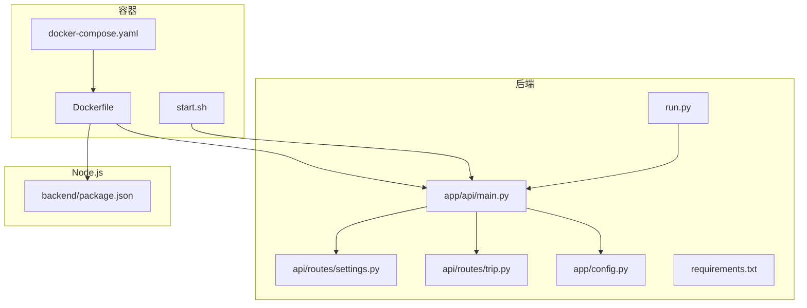
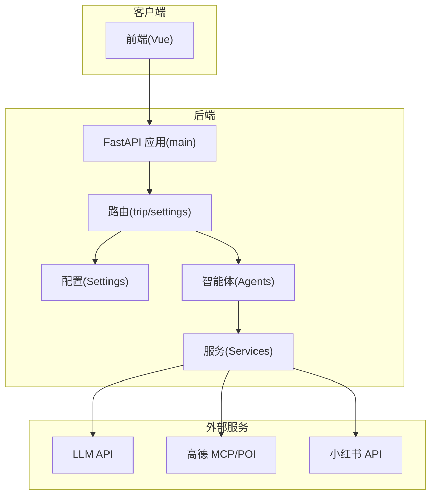
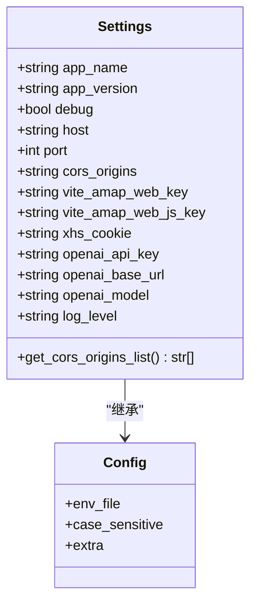
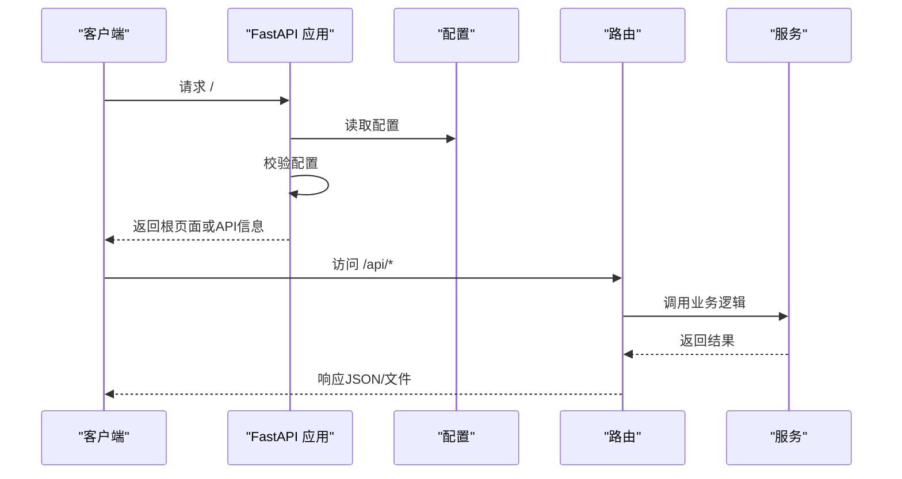
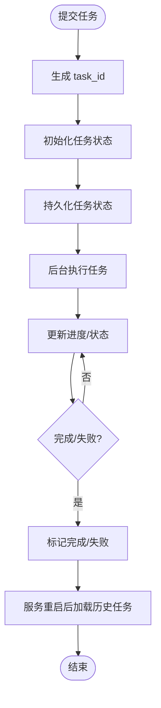
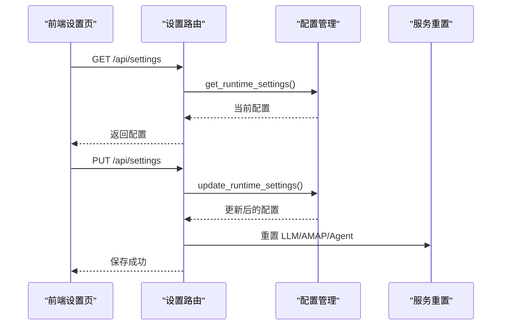
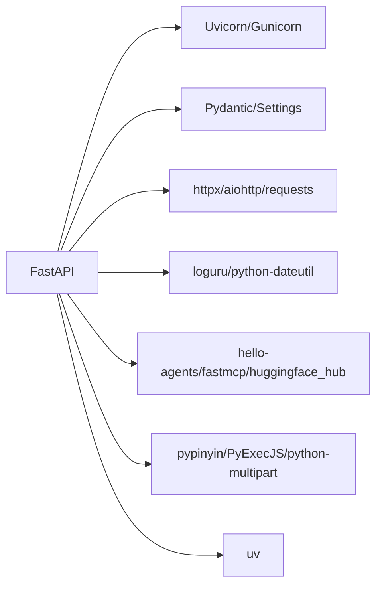

# 后端环境搭建

<cite>
**本文档引用的文件**
- [requirements.txt](file://backend/requirements.txt)
- [run.py](file://backend/run.py)
- [config.py](file://backend/app/config.py)
- [main.py](file://backend/app/api/main.py)
- [trip.py](file://backend/app/api/routes/trip.py)
- [settings.py](file://backend/app/api/routes/settings.py)
- [Dockerfile](file://Dockerfile)
- [docker-compose.yaml](file://docker-compose.yaml)
- [start.sh](file://start.sh)
- [package.json](file://backend/package.json)
- [README.md](file://README.md)
</cite>

## 目录
1. [简介](#简介)
2. [项目结构](#项目结构)
3. [核心组件](#核心组件)
4. [架构总览](#架构总览)
5. [详细组件分析](#详细组件分析)
6. [依赖分析](#依赖分析)
7. [性能考虑](#性能考虑)
8. [故障排除指南](#故障排除指南)
9. [结论](#结论)
10. [附录](#附录)

## 简介
本指南面向希望搭建 TripStar 后端开发环境的开发者，涵盖 Python 3.10+ 环境准备、虚拟环境创建与激活、依赖安装、配置文件设置、本地开发启动（直接运行与 Docker 两种方式）、开发工具配置以及常见问题排查。文档基于仓库实际代码与配置文件进行梳理，确保读者能够快速、准确地完成环境搭建。

## 项目结构
后端采用 FastAPI + Uvicorn/Gunicorn 的服务架构，配合多智能体与 LLM 服务实现旅行规划能力。核心目录与职责如下：
- backend/app/api/main.py：FastAPI 应用入口，注册路由、中间件与生命周期事件
- backend/app/config.py：配置管理，支持 .env 与运行时覆盖
- backend/app/api/routes/*：API 路由模块（旅行规划、POI、地图、聊天、设置等）
- backend/requirements.txt：Python 依赖清单
- backend/run.py：本地开发启动脚本（uvicorn）
- Dockerfile、docker-compose.yaml、start.sh：容器化部署方案
- backend/package.json：Node.js 依赖（小红书签名引擎相关）

**图表来源**
- [main.py:1-147](file://backend/app/api/main.py#L1-L147)
- [config.py:1-202](file://backend/app/config.py#L1-L202)
- [trip.py:1-200](file://backend/app/api/routes/trip.py#L1-L200)
- [settings.py:1-56](file://backend/app/api/routes/settings.py#L1-L56)
- [requirements.txt:1-18](file://backend/requirements.txt#L1-L18)
- [run.py:1-17](file://backend/run.py#L1-L17)
- [Dockerfile:1-64](file://Dockerfile#L1-L64)
- [docker-compose.yaml:1-24](file://docker-compose.yaml#L1-L24)
- [start.sh:1-20](file://start.sh#L1-L20)
- [package.json:1-7](file://backend/package.json#L1-L7)

**章节来源**
- [README.md:205-232](file://README.md#L205-L232)

## 核心组件
- 配置管理（Settings）：集中管理应用、服务器、CORS、高德地图、小红书、LLM、日志等配置，支持 .env 与运行时覆盖持久化
- API 应用（FastAPI）：注册路由、CORS 中间件、静态资源挂载、健康检查、启动/关闭事件
- 旅行规划路由：异步任务系统（内存 + 磁盘持久化）、WebSocket/轮询兼容、历史任务加载
- 设置路由：运行时配置读取与更新，支持即时生效与服务重置
- 启动脚本：本地 uvicorn 启动与容器 gunicorn 启动

**章节来源**
- [config.py:21-132](file://backend/app/config.py#L21-L132)
- [main.py:14-120](file://backend/app/api/main.py#L14-L120)
- [trip.py:17-145](file://backend/app/api/routes/trip.py#L17-L145)
- [settings.py:13-56](file://backend/app/api/routes/settings.py#L13-L56)
- [run.py:6-15](file://backend/run.py#L6-L15)
- [start.sh:13-19](file://start.sh#L13-L19)

## 架构总览
后端采用“配置中心 + API 网关 + 多智能体服务”的分层架构。配置通过 pydantic-settings 与 .env 管理，API 层负责路由与中间件，业务逻辑通过 agents 与 services 实现，容器化部署通过 Gunicorn + Uvicorn Worker 提供生产级稳定性。

**图表来源**
- [main.py:14-61](file://backend/app/api/main.py#L14-L61)
- [config.py:21-67](file://backend/app/config.py#L21-L67)
- [trip.py:13-16](file://backend/app/api/routes/trip.py#L13-L16)
- [settings.py:8-11](file://backend/app/api/routes/settings.py#L8-L11)

## 详细组件分析

### 配置管理（Settings）
- 支持的配置键：应用名/版本、主机/端口、CORS、高德 Web/JS Key、小红书 Cookie、LLM API Key/Base URL/Model、日志级别
- 环境变量加载：优先加载项目内 .env，再尝试 HelloAgents 根目录下的 .env（不覆盖已有变量）
- 运行时覆盖：将指定键持久化到 runtime_settings.json，并同步到环境变量，兼容第三方组件读取
- 配置校验：打印配置并给出缺失关键配置的警告
- CORS 解析：从逗号分隔字符串解析 origins 列表

**图表来源**
- [config.py:21-67](file://backend/app/config.py#L21-L67)

**章节来源**
- [config.py:11-127](file://backend/app/config.py#L11-L127)
- [config.py:162-202](file://backend/app/config.py#L162-L202)

### API 应用（FastAPI）
- 应用创建：标题、版本、文档路由
- 中间件：CORS（从配置解析 origins）、HTTP 中间件处理代理路径重写
- 路由注册：旅行规划、POI、地图、聊天、设置
- 生命周期：启动时打印配置并校验，关闭时输出友好提示
- 根路径与健康检查：开发返回 API 信息，生产返回前端页面或健康状态
- 静态资源与 SPA 回退：挂载前端 assets，未命中路由返回 index.html

**图表来源**
- [main.py:24-85](file://backend/app/api/main.py#L24-L85)
- [main.py:96-136](file://backend/app/api/main.py#L96-L136)

**章节来源**
- [main.py:14-120](file://backend/app/api/main.py#L14-L120)

### 旅行规划路由（异步任务系统）
- 任务状态：内存字典 + 磁盘 JSON 持久化，支持重启恢复失败任务
- 接口：提交任务返回 task_id，轮询状态，WebSocket 兼容
- 历史任务：按更新时间排序，提取摘要信息
- 数据目录：data/trip_tasks

**图表来源**
- [trip.py:25-145](file://backend/app/api/routes/trip.py#L25-L145)

**章节来源**
- [trip.py:17-200](file://backend/app/api/routes/trip.py#L17-L200)

### 设置路由（运行时配置）
- 读取：get /api/settings 返回当前运行时配置
- 更新：put /api/settings 接收前端设置页提交，持久化并重置相关单例以立即生效

**图表来源**
- [settings.py:27-55](file://backend/app/api/routes/settings.py#L27-L55)
- [config.py:146-159](file://backend/app/config.py#L146-L159)

**章节来源**
- [settings.py:1-56](file://backend/app/api/routes/settings.py#L1-L56)
- [config.py:129-159](file://backend/app/config.py#L129-L159)

## 依赖分析
后端依赖通过 requirements.txt 管理，主要类别包括：
- Web 框架与服务器：FastAPI、Uvicorn、Gunicorn
- 配置与类型：Pydantic、Pydantic Settings、python-dotenv
- HTTP 客户端：httpx、aiohttp、requests
- 日志与工具：loguru、python-dateutil、pypinyin、PyExecJS
- LLM 与多智能体：hello-agents、fastmcp、huggingface_hub
- 其他：python-multipart、uv

**图表来源**
- [requirements.txt:1-18](file://backend/requirements.txt#L1-L18)

**章节来源**
- [requirements.txt:1-18](file://backend/requirements.txt#L1-L18)

## 性能考虑
- 容器化生产：使用 Gunicorn + Uvicorn Worker，支持超时控制与日志输出到标准流
- 预热依赖：构建阶段预下载 amap-mcp-server，避免首次请求超时
- 任务持久化：旅行规划任务状态持久化到磁盘，服务重启后可恢复失败任务
- CORS 与静态资源：仅在生产环境挂载前端静态资源，减少不必要的 IO

**章节来源**
- [Dockerfile:45-47](file://Dockerfile#L45-L47)
- [start.sh:13-19](file://start.sh#L13-L19)
- [trip.py:82-104](file://backend/app/api/routes/trip.py#L82-L104)

## 故障排除指南
- 端口占用
  - 现象：启动失败或端口被占用
  - 处理：修改配置中的 host/port 或释放端口
  - 参考：配置项与启动脚本
- CORS 限制
  - 现象：跨域请求被拒绝
  - 处理：在 .env 中正确配置 cors_origins，确保与前端地址一致
  - 参考：配置解析与中间件
- LLM 配置缺失
  - 现象：AI 功能不可用或报错
  - 处理：在 .env 中设置 OPENAI_API_KEY/LLM_API_KEY 或容器环境变量
  - 参考：配置校验与运行时覆盖
- 高德地图 Key 缺失
  - 现象：POI 搜索/地理编码功能不可用
  - 处理：配置 VITE_AMAP_WEB_KEY 与 VITE_AMAP_WEB_JS_KEY
  - 参考：配置校验
- 小红书 Cookie 缺失
  - 现象：小红书相关功能不可用
  - 处理：在 .env 中配置 XHS_COOKIE
  - 参考：配置校验
- 任务持久化异常
  - 现象：服务重启后历史任务丢失或状态异常
  - 处理：检查 data/trip_tasks 目录权限与磁盘空间
  - 参考：任务持久化与加载
- Docker 构建失败
  - 现象：镜像构建阶段安装依赖失败
  - 处理：检查网络与镜像源，确认 Node.js 依赖安装
  - 参考：Dockerfile 与 package.json

**章节来源**
- [config.py:162-179](file://backend/app/config.py#L162-L179)
- [main.py:46-53](file://backend/app/api/main.py#L46-L53)
- [trip.py:82-104](file://backend/app/api/routes/trip.py#L82-L104)
- [Dockerfile:34-51](file://Dockerfile#L34-L51)

## 结论
通过本指南，您可以在本地或容器环境中快速搭建 TripStar 后端开发环境。建议优先使用 Docker Compose 进行本地开发，以获得与生产一致的运行时配置与依赖。遇到问题时，优先检查配置文件与环境变量，结合日志输出定位问题。

## 附录

### 环境要求与安装步骤
- Python 3.10+
- Node.js 18+
- 安装 uv 包管理器
- 大模型 API Key（推荐兼容 OpenAI 格式的提供商）
- 高德地图 Web Key 与 Web 端 JS Key
- 小红书 Cookie

**章节来源**
- [README.md:131-139](file://README.md#L131-L139)

### 虚拟环境创建与激活
- 创建虚拟环境：在 backend 目录执行
- 激活虚拟环境：Linux/macOS 使用 source .venv/bin/activate；Windows 使用 .venv\Scripts\activate

**章节来源**
- [README.md:162-166](file://README.md#L162-L166)

### 依赖安装
- 安装 Node.js 依赖：在 backend 目录执行
- 安装 Python 依赖：在 backend 目录执行

**章节来源**
- [README.md:159-169](file://README.md#L159-L169)
- [package.json:1-7](file://backend/package.json#L1-L7)
- [requirements.txt:1-18](file://backend/requirements.txt#L1-L18)

### 配置文件设置
- 复制示例配置：在 backend 目录执行
- 填写必要配置：LLM_API_KEY、LLM_BASE_URL、LLM_MODEL_ID、VITE_AMAP_WEB_KEY、XHS_COOKIE
- Docker 环境变量：通过 docker-compose.yaml 的 environment 字段注入

**章节来源**
- [README.md:171-175](file://README.md#L171-L175)
- [docker-compose.yaml:13-22](file://docker-compose.yaml#L13-L22)

### 本地开发启动
- 直接运行（uvicorn）：在 backend 目录执行
- 使用 Docker：在项目根目录执行

**章节来源**
- [README.md:177-179](file://README.md#L177-L179)
- [run.py:6-15](file://backend/run.py#L6-L15)
- [Dockerfile:60-63](file://Dockerfile#L60-L63)
- [docker-compose.yaml:1-24](file://docker-compose.yaml#L1-L24)

### 开发工具配置
- IDE 设置：启用 Python 虚拟环境，配置 Node.js 解释器
- 调试配置：使用 VS Code 等 IDE 的 Python/Node.js 调试器，分别指向 uvicorn 与前端开发服务器
- 日志级别：通过 LOG_LEVEL 调整

**章节来源**
- [config.py:58-58](file://backend/app/config.py#L58-L58)
- [README.md:183-199](file://README.md#L183-L199)