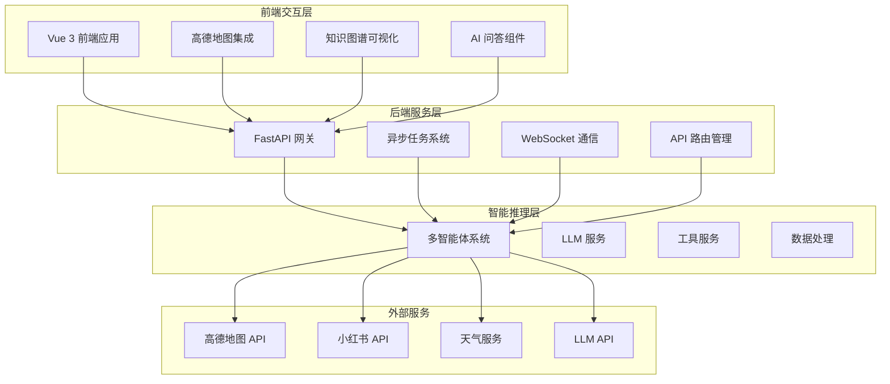
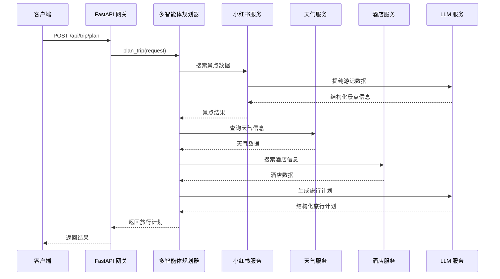
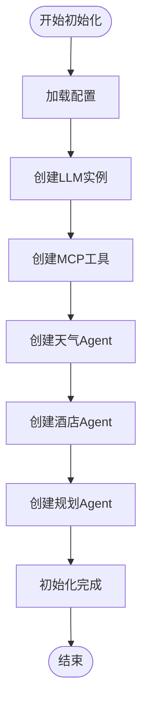
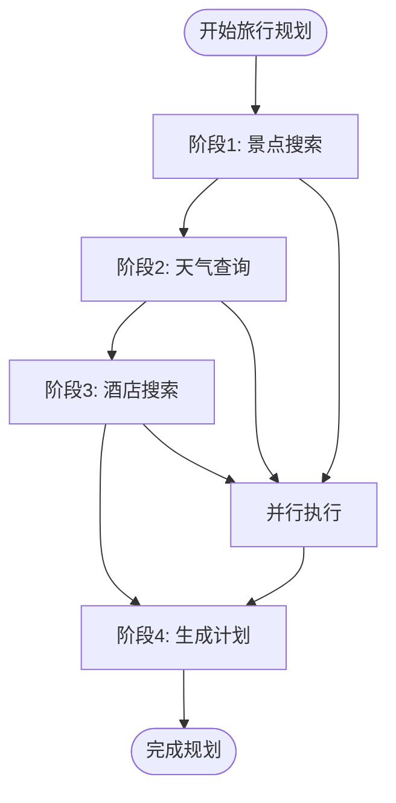
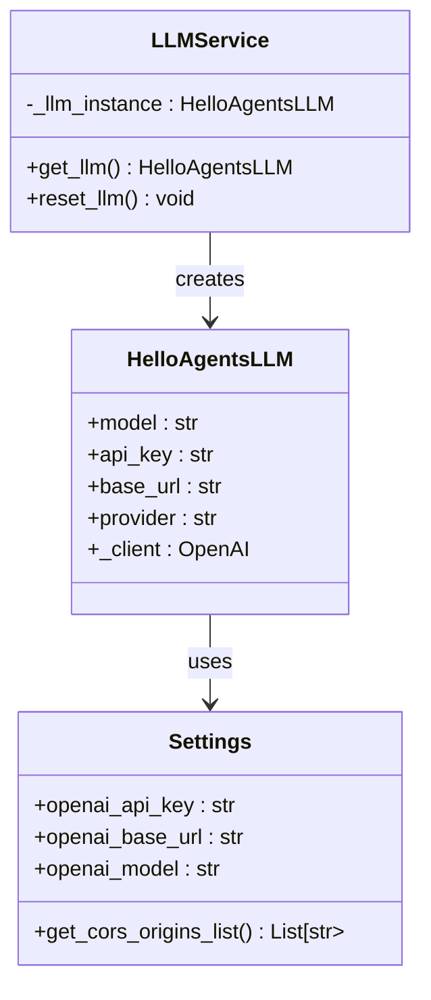
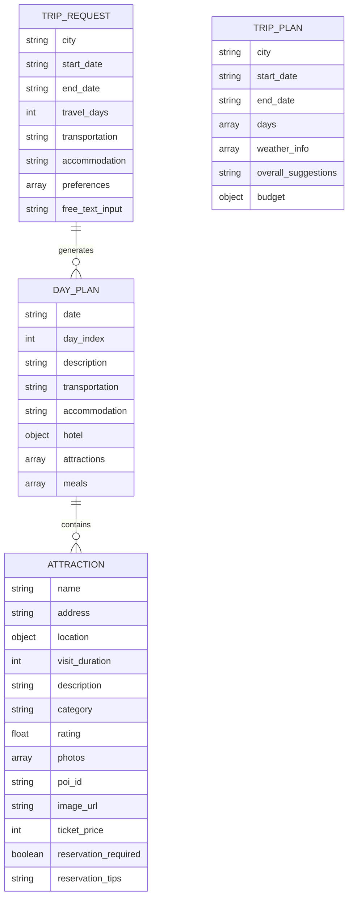
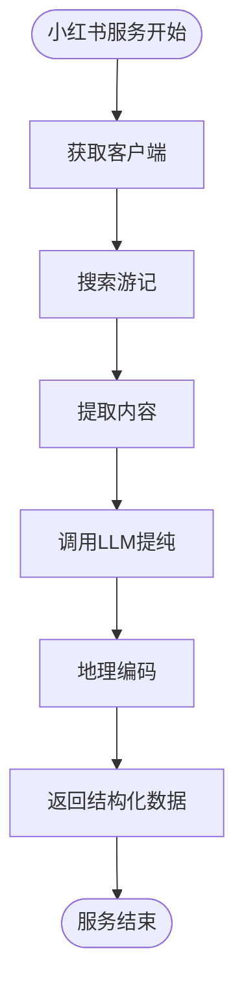
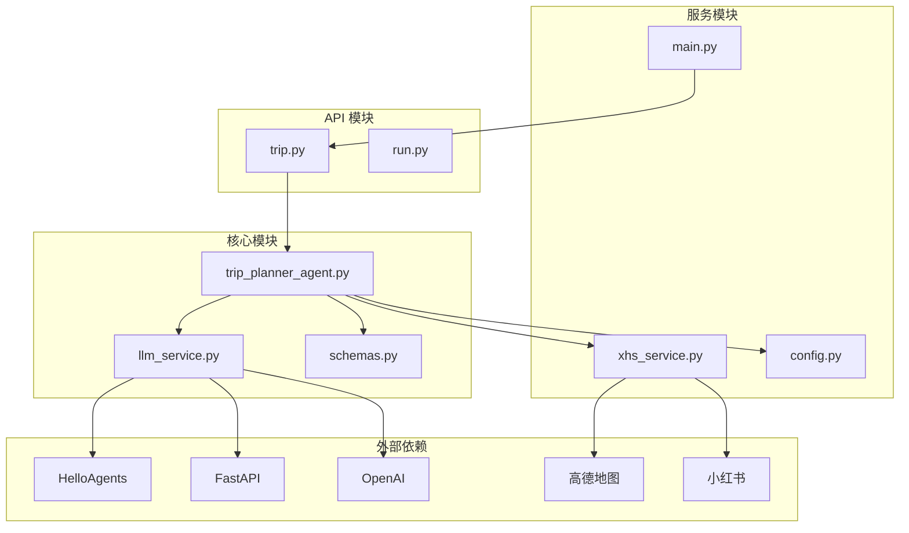
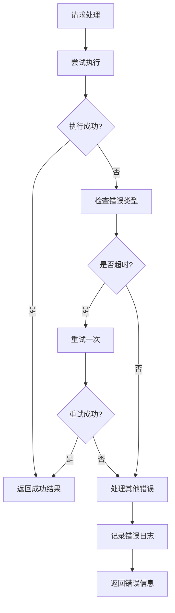

# Agent 设计模式

<cite>
**本文档引用的文件**
- [trip_planner_agent.py](file://backend/app/agents/trip_planner_agent.py)
- [llm_service.py](file://backend/app/services/llm_service.py)
- [config.py](file://backend/app/config.py)
- [main.py](file://backend/app/api/main.py)
- [run.py](file://backend/run.py)
- [schemas.py](file://backend/app/models/schemas.py)
- [xhs_service.py](file://backend/app/services/xhs_service.py)
- [trip.py](file://backend/app/api/routes/trip.py)
- [README.md](file://README.md)
</cite>

## 目录
1. [简介](#简介)
2. [项目结构](#项目结构)
3. [核心组件](#核心组件)
4. [架构概览](#架构概览)
5. [详细组件分析](#详细组件分析)
6. [依赖关系分析](#依赖关系分析)
7. [性能考量](#性能考量)
8. [故障排除指南](#故障排除指南)
9. [结论](#结论)

## 简介

TripStar 是一个基于 HelloAgents 框架打造的多智能体协作文旅规划平台。该项目采用创新的多智能体协作架构，通过多个专门化的智能体（Agent）协同工作，为用户提供个性化的旅行规划服务。系统能够自动搜索旅行信息、查询当地天气、精选酒店并规划最优景点路线，以快速完成旅游攻略。

该项目的核心亮点包括：
- 基于 HelloAgents 框架的多智能体协作
- 小红书深度集成，获取真实的用户游记数据
- 景点预约提醒功能
- 多语言支持和高定主题界面
- 知识图谱可视化和沉浸式伴游 AI 问答

## 项目结构

TripStar 采用标准的前后端分离架构，主要分为三个层次：

**图表来源**
- [README.md:47-97](file://README.md#L47-L97)
- [main.py:24-31](file://backend/app/api/main.py#L24-L31)

**章节来源**
- [README.md:43-127](file://README.md#L43-L127)
- [main.py:1-147](file://backend/app/api/main.py#L1-L147)

## 核心组件

### 多智能体旅行规划系统

MultiAgentTripPlanner 是整个系统的核心控制器，负责协调各个专业智能体的工作。该类实现了完整的多智能体协作流程，包括智能体初始化、任务分配、结果整合等功能。

### 智能体类型

系统包含四种专门化的智能体：

1. **景点搜索专家 (Attraction Agent)**: 负责搜索和推荐景点
2. **天气查询专家 (Weather Agent)**: 查询目标城市的天气信息
3. **酒店推荐专家 (Hotel Agent)**: 根据用户偏好推荐合适的酒店
4. **行程规划专家 (Planner Agent)**: 整合所有信息生成最终旅行计划

### LLM 服务集成

系统通过 HelloAgents 框架集成 LLM 服务，支持多种大语言模型提供商。LLM 服务采用单例模式，确保资源的有效利用和配置的一致性。

**章节来源**
- [trip_planner_agent.py:173-242](file://backend/app/agents/trip_planner_agent.py#L173-L242)
- [llm_service.py:12-67](file://backend/app/services/llm_service.py#L12-L67)

## 架构概览

**图表来源**
- [trip.py:315-388](file://backend/app/api/routes/trip.py#L315-L388)
- [trip_planner_agent.py:257-338](file://backend/app/agents/trip_planner_agent.py#L257-L338)

## 详细组件分析

### MultiAgentTripPlanner 类分析

MultiAgentTripPlanner 是系统的核心控制器，负责管理整个多智能体协作流程。

#### 初始化流程

**图表来源**
- [trip_planner_agent.py:176-241](file://backend/app/agents/trip_planner_agent.py#L176-L241)

#### 旅行规划流程

系统采用分阶段的旅行规划策略，将复杂的规划任务分解为多个可管理的步骤：

**图表来源**
- [trip_planner_agent.py:284-338](file://backend/app/agents/trip_planner_agent.py#L284-L338)

#### Agent 系统提示词设计

每个智能体都有专门设计的系统提示词，确保智能体能够准确理解和执行特定任务：

**ATTRACTION_AGENT_PROMPT 设计原则**:
- 明确要求使用特定工具进行景点搜索
- 严格规定工具调用格式
- 提供具体的示例和注意事项
- 强调必须使用真实工具名称

**WEATHER_AGENT_PROMPT 设计原则**:
- 专注于天气信息查询
- 规定工具调用格式和参数
- 提供清晰的示例和格式要求
- 强调数据准确性的重要性

**HOTEL_AGENT_PROMPT 设计原则**:
- 专门处理酒店推荐任务
- 规定关键词使用规范
- 强调工具调用的必要性
- 提供格式化的工具调用示例

**PLANNER_AGENT_PROMPT 设计原则**:
- 负责整合所有信息生成最终计划
- 规定严格的 JSON 输出格式
- 要求包含预算信息和详细参数
- 强调数据完整性和准确性

**章节来源**
- [trip_planner_agent.py:15-170](file://backend/app/agents/trip_planner_agent.py#L15-L170)
- [trip_planner_agent.py:173-338](file://backend/app/agents/trip_planner_agent.py#L173-L338)

### LLM 服务设计

LLM 服务采用单例模式设计，确保在整个应用中只有一个 LLM 实例被使用。

#### 配置管理

**图表来源**
- [llm_service.py:12-67](file://backend/app/services/llm_service.py#L12-L67)
- [config.py:21-56](file://backend/app/config.py#L21-L56)

#### LLM 实例特性

- **单例模式**: 确保资源的有效利用
- **配置灵活性**: 支持多种 LLM 提供商
- **超时处理**: 自动处理网络超时情况
- **User-Agent 伪装**: 解决第三方 API 的 WAF 限制

**章节来源**
- [llm_service.py:12-75](file://backend/app/services/llm_service.py#L12-L75)
- [config.py:21-131](file://backend/app/config.py#L21-L131)

### 数据模型设计

系统使用 Pydantic 定义了完整的数据模型体系，确保数据的结构化和类型安全。

#### 核心数据模型

**图表来源**
- [schemas.py:10-154](file://backend/app/models/schemas.py#L10-L154)

#### 数据验证和转换

系统实现了多层次的数据验证和转换机制：

1. **Pydantic 模型验证**: 确保输入数据的结构正确性
2. **温度数据解析**: 自动处理温度单位转换
3. **JSON 解析容错**: 提供多种 JSON 解析策略
4. **数据类型转换**: 自动转换不同格式的数据

**章节来源**
- [schemas.py:10-264](file://backend/app/models/schemas.py#L10-L264)

### 小红书服务集成

小红书服务是系统的重要组成部分，负责获取真实的用户游记数据并进行智能提纯。

#### 服务架构

**图表来源**
- [xhs_service.py:247-354](file://backend/app/services/xhs_service.py#L247-L354)

#### Cookie 管理

系统提供了灵活的 Cookie 管理机制：

- **Cookie 格式兼容**: 支持多种 Cookie 输入格式
- **自动规范化**: 将不同格式的 Cookie 转换为统一格式
- **错误处理**: 提供明确的 Cookie 过期错误信息

**章节来源**
- [xhs_service.py:29-64](file://backend/app/services/xhs_service.py#L29-L64)
- [xhs_service.py:247-354](file://backend/app/services/xhs_service.py#L247-L354)

## 依赖关系分析

**图表来源**
- [trip_planner_agent.py:7-11](file://backend/app/agents/trip_planner_agent.py#L7-L11)
- [llm_service.py:5-6](file://backend/app/services/llm_service.py#L5-L6)
- [xhs_service.py:15-17](file://backend/app/services/xhs_service.py#L15-L17)

### 模块间耦合关系

系统采用了松耦合的设计原则：

1. **低耦合高内聚**: 每个模块职责明确，相互依赖最小化
2. **接口抽象**: 通过抽象接口减少模块间的直接依赖
3. **配置驱动**: 通过配置文件管理外部依赖和服务参数
4. **异常隔离**: 各模块独立处理自己的异常情况

**章节来源**
- [trip_planner_agent.py:1-12](file://backend/app/agents/trip_planner_agent.py#L1-L12)
- [llm_service.py:1-7](file://backend/app/services/llm_service.py#L1-L7)

## 性能考量

### 并发优化策略

系统采用了多种并发优化技术来提升性能：

1. **异步任务处理**: 使用 asyncio 实现非阻塞的任务执行
2. **并行工具调用**: 在可能的情况下并行执行多个工具调用
3. **缓存机制**: 利用 LLM 单例模式减少重复初始化开销
4. **资源池管理**: 合理管理外部服务的连接和资源

### 错误处理和重试机制

系统实现了多层次的错误处理和重试机制：

**图表来源**
- [trip_planner_agent.py:354-387](file://backend/app/agents/trip_planner_agent.py#L354-L387)

### 资源管理最佳实践

1. **连接池管理**: 合理管理外部 API 的连接和超时设置
2. **内存使用优化**: 使用生成器和惰性加载减少内存占用
3. **缓存策略**: 实现多级缓存机制提升响应速度
4. **监控和日志**: 提供详细的性能监控和错误日志

## 故障排除指南

### 常见问题诊断

#### LLM 配置问题

**症状**: LLM 服务初始化失败或调用超时
**解决方案**:
1. 检查环境变量配置是否正确
2. 验证 API Key 和 Base URL 设置
3. 确认网络连接和防火墙设置
4. 尝试降低模型复杂度或调整超时参数

#### 小红书服务问题

**症状**: 小红书数据获取失败或 Cookie 过期
**解决方案**:
1. 更新小红书 Cookie 到最新有效状态
2. 检查网络连接和代理设置
3. 验证小红书 API 的可用性
4. 考虑使用备用的 SSR 抓取机制

#### 高德地图服务问题

**症状**: 地理编码或 POI 搜索失败
**解决方案**:
1. 检查高德地图 API Key 配置
2. 验证 API 服务的可用性和配额
3. 确认请求频率和限制设置
4. 考虑使用备用的地理编码服务

### 调试技巧

1. **启用详细日志**: 设置日志级别为 DEBUG 获取更多信息
2. **分步调试**: 将复杂流程分解为多个简单步骤逐一调试
3. **单元测试**: 为关键组件编写单元测试确保功能正确性
4. **性能分析**: 使用性能分析工具识别瓶颈和优化机会

**章节来源**
- [config.py:162-179](file://backend/app/config.py#L162-L179)
- [xhs_service.py:22-25](file://backend/app/services/xhs_service.py#L22-L25)

## 结论

TripStar 项目展示了基于 HelloAgents 框架的多智能体系统设计和实现的最佳实践。通过精心设计的智能体架构、完善的配置管理、健壮的错误处理机制和优化的性能策略，系统能够为用户提供高质量的旅行规划服务。

### 主要成就

1. **架构创新**: 成功实现了基于多智能体的协作文旅规划系统
2. **数据质量**: 通过小红书真实用户数据提升了规划的实用性和可靠性
3. **用户体验**: 提供了流畅的异步任务处理和实时状态更新
4. **扩展性**: 设计了良好的架构便于后续功能扩展和优化

### 未来发展方向

1. **多城市旅行支持**: 扩展系统以支持跨城市的复杂旅行规划
2. **模型国际化**: 改进多语言支持和本地化适配
3. **代理配置**: 添加代理服务器支持以提升网络稳定性
4. **Google Maps 集成**: 考虑替代高德地图服务以扩大覆盖范围

该项目为基于多智能体的 AI 应用开发提供了优秀的参考案例，展示了如何将复杂的 AI 功能组织为可管理、可扩展的智能体系统。