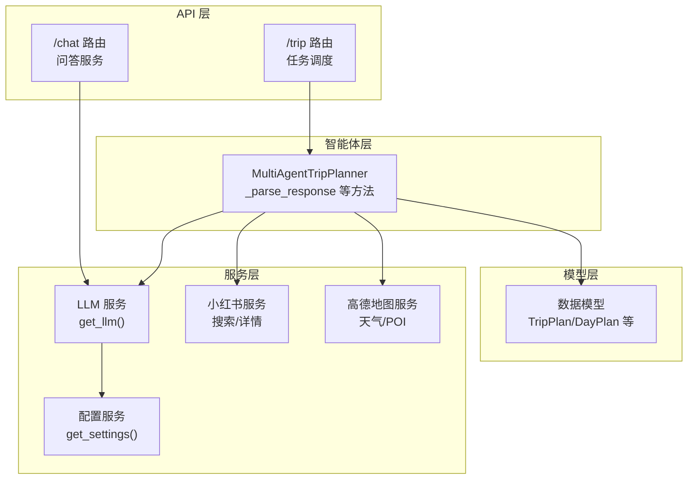
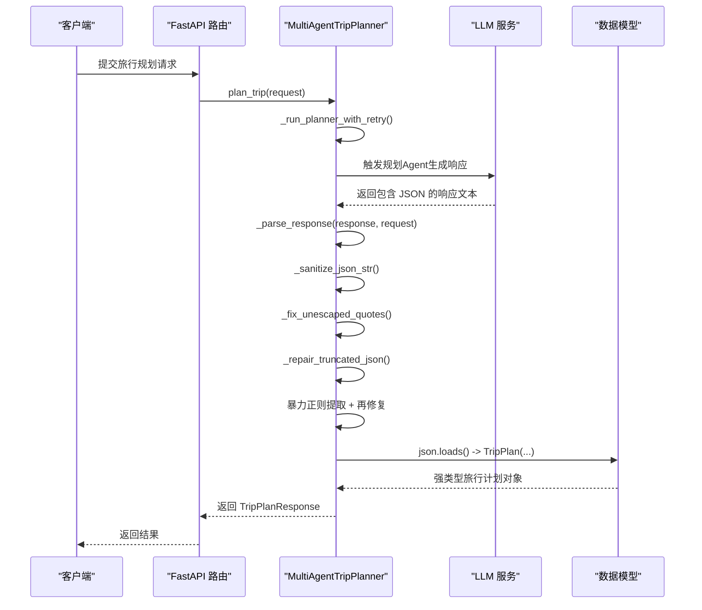
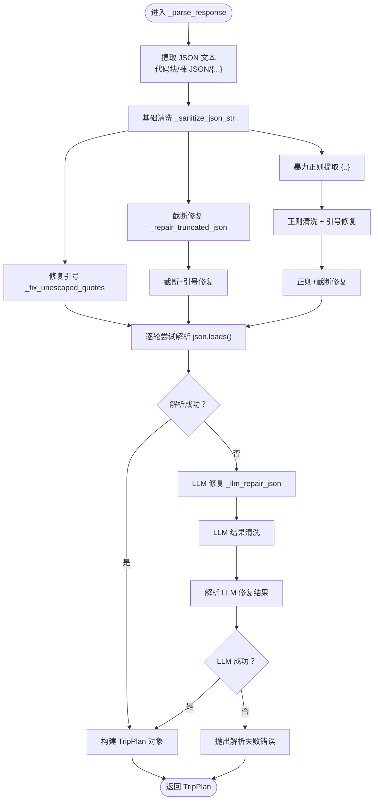
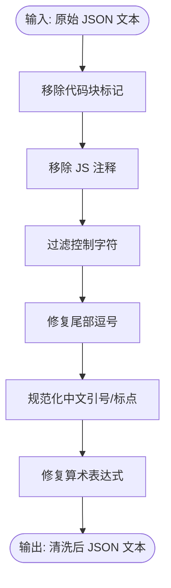
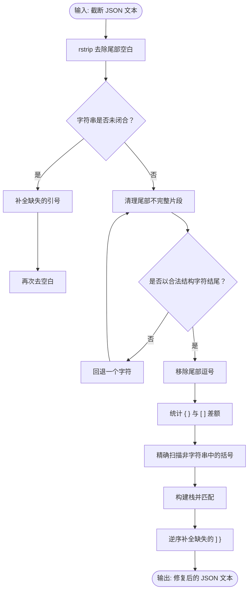
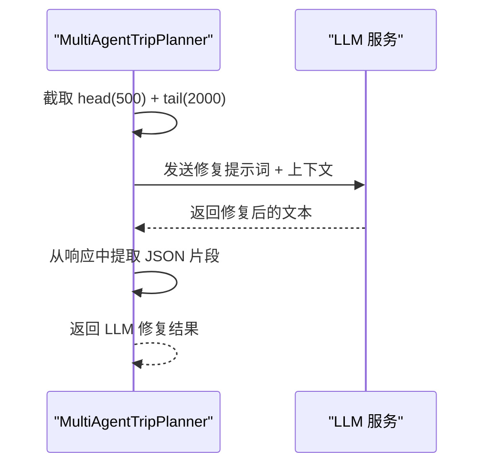
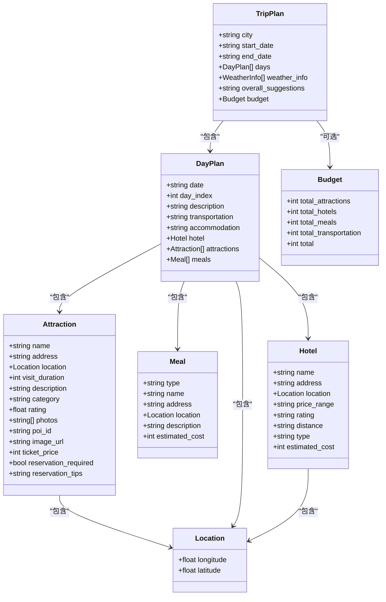
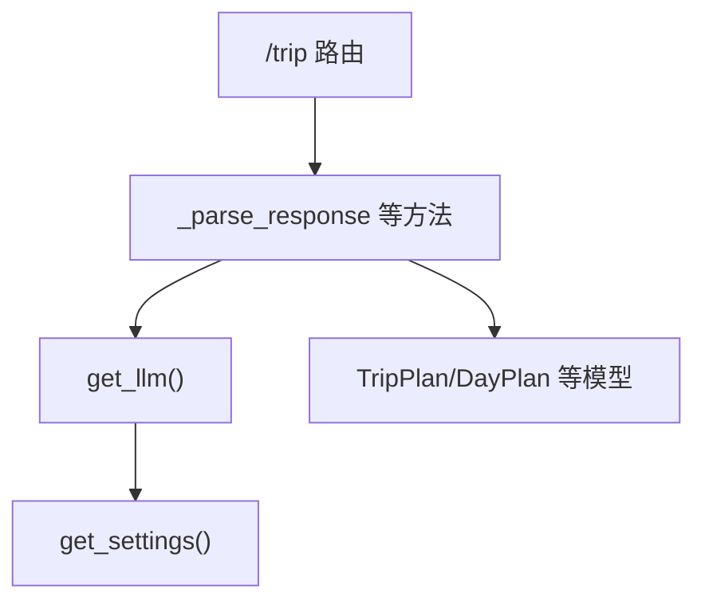

# JSON 解析与恢复

<cite>
**本文档引用的文件**
- [trip_planner_agent.py](file://backend/app/agents/trip_planner_agent.py)
- [schemas.py](file://backend/app/models/schemas.py)
- [llm_service.py](file://backend/app/services/llm_service.py)
- [config.py](file://backend/app/config.py)
- [trip.py](file://backend/app/api/routes/trip.py)
- [chat_service.py](file://backend/app/services/chat_service.py)
- [xhs_service.py](file://backend/app/services/xhs_service.py)
</cite>

## 目录
1. [简介](#简介)
2. [项目结构](#项目结构)
3. [核心组件](#核心组件)
4. [架构概览](#架构概览)
5. [详细组件分析](#详细组件分析)
6. [依赖分析](#依赖分析)
7. [性能考虑](#性能考虑)
8. [故障排除指南](#故障排除指南)
9. [结论](#结论)
10. [附录](#附录)

## 简介
本文件聚焦 TripStar 项目中的 JSON 解析与恢复系统，深入解析多智能体旅行规划器中的 _parse_response 方法及其配套的容错解析机制。文档涵盖以下关键能力：
- 多层容错解析：从基础清洗到暴力提取，再到 LLM 辅助修复的完整策略链
- _sanitize_json_str 清洗逻辑：代码块标记移除、注释清理、控制字符过滤、尾部逗号修复、中文标点规范化、算术表达式修复
- _fix_unescaped_quotes 引号修复算法：字符串边界检测与未转义引号处理
- _repair_truncated_json 截断修复机制：括号平衡检查与结构完整性保证
- _llm_repair_json LLM 辅助修复策略：上下文截取与修复提示词设计
- 异常情况处理示例与调试技巧，帮助开发者理解并优化 JSON 解析的可靠性

## 项目结构
本项目采用分层架构，JSON 解析与恢复主要位于智能体层（agents），并与模型层（models）、服务层（services）协同工作：
- agents 层：多智能体旅行规划器，负责最终响应解析与容错修复
- models 层：旅行计划数据模型，确保解析后的 JSON 能被正确反序列化为强类型对象
- services 层：LLM 服务、地图服务、小红书服务等，为解析提供上游数据
- api 层：FastAPI 路由，接收请求并触发规划流程



**图表来源**
- [trip.py:276-338](file://backend/app/api/routes/trip.py#L276-L338)
- [trip_planner_agent.py:173-241](file://backend/app/agents/trip_planner_agent.py#L173-L241)
- [schemas.py:146-155](file://backend/app/models/schemas.py#L146-L155)
- [llm_service.py:12-67](file://backend/app/services/llm_service.py#L12-L67)
- [config.py:21-71](file://backend/app/config.py#L21-L71)

**章节来源**
- [trip.py:276-338](file://backend/app/api/routes/trip.py#L276-L338)
- [trip_planner_agent.py:173-241](file://backend/app/agents/trip_planner_agent.py#L173-L241)
- [schemas.py:146-155](file://backend/app/models/schemas.py#L146-L155)
- [llm_service.py:12-67](file://backend/app/services/llm_service.py#L12-L67)
- [config.py:21-71](file://backend/app/config.py#L21-L71)

## 核心组件
本节聚焦 JSON 解析与恢复的核心方法与数据模型。

- MultiAgentTripPlanner._parse_response：多层容错解析入口，串联清洗、修复与暴力提取策略
- MultiAgentTripPlanner._sanitize_json_str：基础清洗与格式修复
- MultiAgentTripPlanner._fix_unescaped_quotes：字符串内未转义引号修复
- MultiAgentTripPlanner._repair_truncated_json：截断 JSON 修复
- MultiAgentTripPlanner._llm_repair_json：LLM 辅助修复
- 数据模型 TripPlan/DayPlan/Attraction/Meal/Budget：解析后强类型对象

**章节来源**
- [trip_planner_agent.py:424-758](file://backend/app/agents/trip_planner_agent.py#L424-L758)
- [schemas.py:146-155](file://backend/app/models/schemas.py#L146-L155)

## 架构概览
下图展示 JSON 解析与恢复在旅行规划流程中的位置与交互：



**图表来源**
- [trip.py:315-338](file://backend/app/api/routes/trip.py#L315-L338)
- [trip_planner_agent.py:257-338](file://backend/app/agents/trip_planner_agent.py#L257-L338)
- [trip_planner_agent.py:650-758](file://backend/app/agents/trip_planner_agent.py#L650-L758)
- [schemas.py:146-155](file://backend/app/models/schemas.py#L146-L155)

## 详细组件分析

### _parse_response 多层容错解析机制
_multiAgentTripPlanner._parse_response 是整个 JSON 解析与恢复的中枢，其策略链如下：
- JSON 提取：优先从代码块标记中提取，其次从裸露的 JSON 对象中提取，最后回退到从首个 { 到最后一个 } 的范围
- 基础清洗：调用 _sanitize_json_str 进行格式修复
- 引号修复：对清洗后的 JSON 再执行 _fix_unescaped_quotes
- 截断修复：对原始 JSON 执行 _repair_truncated_json，并在必要时再执行引号修复
- 暴力提取：使用正则匹配最外层 JSON 对象，重复上述清洗与修复流程
- 逐轮尝试：按顺序尝试每种候选，直至解析成功
- LLM 修复：若本地修复全部失败，调用 _llm_repair_json 进行最后手段修复



**图表来源**
- [trip_planner_agent.py:650-758](file://backend/app/agents/trip_planner_agent.py#L650-L758)

**章节来源**
- [trip_planner_agent.py:650-758](file://backend/app/agents/trip_planner_agent.py#L650-L758)

### _sanitize_json_str 清洗逻辑详解
该方法针对大模型输出中常见的 JSON 格式污染进行系统性修复：
- 代码块标记移除：去除包裹在 ```json ... ``` 或 ``` ... ``` 中的代码块标记
- 注释清理：移除 JavaScript 风格的单行注释 // ... 与块注释 /* ... */
- 控制字符过滤：移除 ASCII 0x00-0x1f 范围内的控制字符
- 尾部逗号修复：将 },] 或 },} 形式的尾部逗号移除
- 中文标点与引号规范化：将中文引号 "" '' 替换为英文单引号，全角冒号与逗号替换为半角
- 算术表达式修复：针对预算等数值字段中的算术表达式进行修复，若存在等号则取等号右侧结果，否则尝试安全求值



**图表来源**
- [trip_planner_agent.py](file://backend/app/agents/trip_planner_agent.py#L424-L466)

**章节来源**
- [trip_planner_agent.py](file://backend/app/agents/trip_planner_agent.py#L424-L466)

### _fix_unescaped_quotes 引号修复算法
该算法通过状态机扫描字符串，识别字符串边界与未转义引号：
- 状态：in_string（是否处于字符串内）、escape_next（是否处于转义状态）
- 扫描逻辑：
  - 遇到转义符 \ 且处于字符串内：标记 escape_next，追加字符并跳过
  - 遇到引号 " 且不在字符串内：进入字符串
  - 遇到引号 " 且在字符串内：判断引号后是否为 JSON 结构字符（如 , } ] :），若是则结束字符串；否则视为内嵌未转义引号，替换为单引号
  - 其他字符：直接追加
- 输出：修复后的 JSON 文本

```mermaid
flowchart TD
FStart(["输入: JSON 文本"]) --> Init["初始化 in_string=false, escape_next=false"]
Init --> Scan{"逐字符扫描"}
Scan --> EscapeCheck{"escape_next ?"}
EscapeCheck --> |是| AppendEsc["追加字符并清除 escape_next"] --> NextChar["i += 1"] --> Scan
EscapeCheck --> |否| Backslash{"ch == '\\' 且 in_string ?"}
Backslash --> |是| SetEscape["escape_next = true"] --> AppendEsc --> NextChar --> Scan
Backslash --> |否| Quote{"ch == '\"' ?"}
Quote --> |否| AppendPlain["追加字符"] --> NextChar --> Scan
Quote --> |是| InString{"in_string ?"}
InString --> |否| EnterStr["in_string = true"] --> AppendQuote --> NextChar --> Scan
InString --> |是| CheckNext{"引号后是否为结构字符？"}
CheckNext --> |是| ExitStr["in_string = false"] --> AppendQuote --> NextChar --> Scan
CheckNext --> |否| CheckEnd{"是否到末尾？"}
CheckEnd --> |是| ExitStr2["in_string = false"] --> AppendQuote --> NextChar --> Scan
CheckEnd --> |否| ReplaceQuote["替换为单引号 '"] --> NextChar --> Scan
Scan --> Done{"扫描结束？"}
Done --> |否| Scan
Done --> |是| FOut(["输出: 修复后的 JSON 文本"])
```

**图表来源**
- [trip_planner_agent.py](file://backend/app/agents/trip_planner_agent.py#L468-L518)

**章节来源**
- [trip_planner_agent.py](file://backend/app/agents/trip_planner_agent.py#L468-L518)

### _repair_truncated_json 截断修复机制
该方法专门处理因 max_tokens 导致的 JSON 截断问题：
- 字符串闭合：扫描最后一个引号是否闭合，若未闭合则补全
- 尾部碎片清理：反复回退尾部，直到以合法的 JSON 结构字符结尾（如 }, ], ", 数字, true/false/null 的首字母等）
- 悬挂逗号移除：移除尾部逗号
- 括号平衡：扫描非字符串中的 { } 与 [ ]，统计差额并逆序补全缺失的闭合括号



**图表来源**
- [trip_planner_agent.py](file://backend/app/agents/trip_planner_agent.py#L520-L602)

**章节来源**
- [trip_planner_agent.py](file://backend/app/agents/trip_planner_agent.py#L520-L602)

### _llm_repair_json LLM 辅助修复策略
当本地修复均失败时，使用 LLM 进行最后手段修复：
- 上下文截取：仅发送尾部 2000 字符与头部约 500 字符，以控制 token 消耗
- 修复提示词：要求 LLM 仅输出补全后的完整 JSON，不包含解释文字
- 结果提取：从 LLM 响应中提取 JSON 片段，若未找到则直接返回响应文本



**图表来源**
- [trip_planner_agent.py](file://backend/app/agents/trip_planner_agent.py#L604-L648)
- [llm_service.py](file://backend/app/services/llm_service.py#L12-L67)

**章节来源**
- [trip_planner_agent.py](file://backend/app/agents/trip_planner_agent.py#L604-L648)
- [llm_service.py](file://backend/app/services/llm_service.py#L12-L67)

### 数据模型与解析结果
解析后的 JSON 会被转换为强类型对象，确保后续业务逻辑的健壮性：
- TripPlan：旅行计划根对象，包含城市、日期、每日行程、天气信息、总体建议与预算
- DayPlan：单日行程，包含日期、交通、住宿、景点列表、餐饮列表
- Attraction/Meal/Hotel：具体实体模型
- Budget：预算明细



**图表来源**
- [schemas.py](file://backend/app/models/schemas.py#L146-L155)
- [schemas.py](file://backend/app/models/schemas.py#L99-L109)
- [schemas.py](file://backend/app/models/schemas.py#L60-L75)
- [schemas.py](file://backend/app/models/schemas.py#L77-L85)
- [schemas.py](file://backend/app/models/schemas.py#L87-L97)
- [schemas.py](file://backend/app/models/schemas.py#L137-L144)
- [schemas.py](file://backend/app/models/schemas.py#L54-L58)

**章节来源**
- [schemas.py](file://backend/app/models/schemas.py#L146-L155)

## 依赖分析
- LLM 服务依赖配置模块，通过 get_llm() 获取单例实例
- 智能体依赖数据模型进行强类型解析
- API 路由依赖智能体进行任务执行与状态推送



**图表来源**
- [trip_planner_agent.py](file://backend/app/agents/trip_planner_agent.py#L182-L182)
- [llm_service.py](file://backend/app/services/llm_service.py#L12-L67)
- [config.py](file://backend/app/config.py#L21-L71)
- [trip.py](file://backend/app/api/routes/trip.py#L315-L338)

**章节来源**
- [trip_planner_agent.py](file://backend/app/agents/trip_planner_agent.py#L182-L182)
- [llm_service.py](file://backend/app/services/llm_service.py#L12-L67)
- [config.py](file://backend/app/config.py#L21-L71)
- [trip.py](file://backend/app/api/routes/trip.py#L315-L338)

## 性能考虑
- 正则与字符串扫描：_sanitize_json_str 与 _fix_unescaped_quotes 为 O(n) 扫描，适合大多数场景
- 截断修复：_repair_truncated_json 通过栈匹配括号，复杂度近似 O(n)
- LLM 修复：作为最后手段，需控制上下文长度（默认尾部 2000 字符 + 头部约 500 字符），避免过度 token 消耗
- 逐轮尝试：_parse_response 会生成多个候选，解析失败时会继续尝试下一种策略，整体复杂度取决于候选数量与 JSON 大小

[本节为一般性指导，无需特定文件来源]

## 故障排除指南
- 首次解析失败定位：_parse_response 在首次失败时会打印错误位置附近的上下文，便于快速定位问题字符
- 常见污染类型：
  - 代码块标记：```json ... ``` 或 ``` ... ```
  - 注释：// 或 /* ... */
  - 控制字符：ASCII 0x00-0x1f
  - 尾部逗号：},] 或 },}
  - 中文引号与全角标点："" '' 、：、，
  - 算术表达式：预算字段中的 30+54+120+120=324
- 引号问题：字符串内未转义引号会导致解析失败，使用 _fix_unescaped_quotes 修复
- 截断问题：max_tokens 导致的不完整 JSON，使用 _repair_truncated_json 修复
- LLM 修复：若本地修复失败，启用 _llm_repair_json，注意检查 LLM 返回的 JSON 片段提取逻辑

**章节来源**
- [trip_planner_agent.py:732-739](file://backend/app/agents/trip_planner_agent.py#L732-L739)
- [trip_planner_agent.py:424-466](file://backend/app/agents/trip_planner_agent.py#L424-L466)
- [trip_planner_agent.py:468-518](file://backend/app/agents/trip_planner_agent.py#L468-L518)
- [trip_planner_agent.py:520-602](file://backend/app/agents/trip_planner_agent.py#L520-L602)
- [trip_planner_agent.py:604-648](file://backend/app/agents/trip_planner_agent.py#L604-L648)

## 结论
本 JSON 解析与恢复系统通过多层容错策略，有效应对大模型输出中的格式污染与截断问题。从基础清洗、引号修复、截断修复到暴力提取与 LLM 辅助修复，形成完整的修复链条。结合强类型数据模型，确保解析结果的稳定性与可维护性。开发者可根据实际场景调整策略优先级与阈值，进一步提升解析成功率与性能。

[本节为总结性内容，无需特定文件来源]

## 附录
- 其他服务中的 JSON 处理示例：
  - 小红书服务：normalize_xhs_cookie 与多种 JSON 解析场景
  - 聊天服务：将旅行计划序列化为 JSON 字符串用于上下文注入

**章节来源**
- [xhs_service.py:29-63](file://backend/app/services/xhs_service.py#L29-L63)
- [chat_service.py:60-62](file://backend/app/services/chat_service.py#L60-L62)