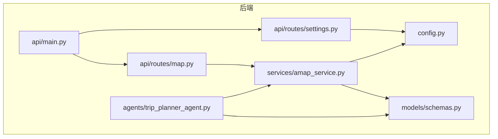
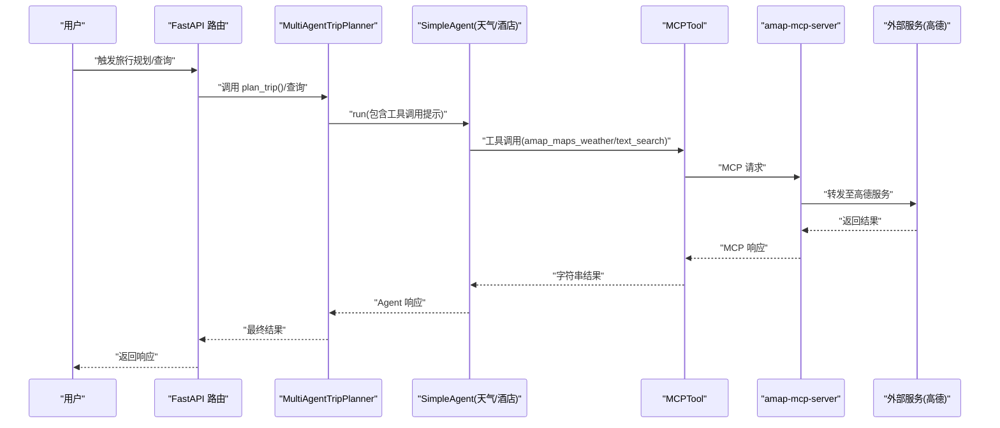
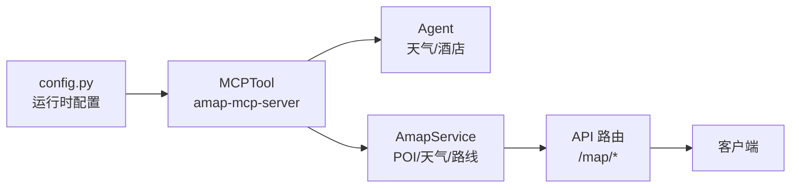

# Tool 集成机制

<cite>
**本文档引用的文件**
- [trip_planner_agent.py](file://backend/app/agents/trip_planner_agent.py)
- [amap_service.py](file://backend/app/services/amap_service.py)
- [schemas.py](file://backend/app/models/schemas.py)
- [config.py](file://backend/app/config.py)
- [map.py](file://backend/app/api/routes/map.py)
- [settings.py](file://backend/app/api/routes/settings.py)
- [main.py](file://backend/app/api/main.py)
- [README.md](file://README.md)
</cite>

## 目录
1. [简介](#简介)
2. [项目结构](#项目结构)
3. [核心组件](#核心组件)
4. [架构总览](#架构总览)
5. [详细组件分析](#详细组件分析)
6. [依赖关系分析](#依赖关系分析)
7. [性能考量](#性能考量)
8. [故障排查指南](#故障排查指南)
9. [结论](#结论)
10. [附录](#附录)

## 简介
本文件系统性阐述 TripStar 项目中的 Tool 集成机制，重点围绕 MCPTool 的工作原理与高德地图服务的工具集成展开，涵盖工具注册、发现与调用流程；详解 amap_maps_text_search 与 amap_maps_weather 两个工具的使用方法与参数传递；明确工具调用格式的严格规范、参数命名约定与返回值处理策略；提供工具扩展开发指南，包括自定义工具创建、配置管理、错误处理与性能优化；说明工具与 Agent 的绑定机制（add_tool 方法、权限管理与安全考虑），并给出实际代码示例与最佳实践，帮助开发者理解与扩展工具系统。

## 项目结构
后端采用 FastAPI + HelloAgents 框架，核心模块如下：
- agents：多智能体编排与工具绑定
- services：业务服务封装（含高德 MCP 服务）
- models：数据模型与校验
- api：HTTP 路由与对外接口
- config：配置管理与运行时设置

图表来源
- [trip_planner_agent.py:173-241](file://backend/app/agents/trip_planner_agent.py#L173-L241)
- [amap_service.py:1-47](file://backend/app/services/amap_service.py#L1-L47)
- [map.py:1-164](file://backend/app/api/routes/map.py#L1-L164)
- [settings.py:1-56](file://backend/app/api/routes/settings.py#L1-L56)
- [main.py:1-147](file://backend/app/api/main.py#L1-L147)
- [config.py:1-202](file://backend/app/config.py#L1-L202)

章节来源
- [README.md:205-232](file://README.md#L205-L232)

## 核心组件
- MCPTool：基于 MCP 协议的外部工具桥接器，负责与 amap-mcp-server 通信，自动展开为 amap_maps_* 子工具集合。
- MultiAgentTripPlanner：多智能体系统，负责创建共享 MCPTool 实例并将其绑定到不同 Agent。
- AmapService：高德地图服务封装，统一暴露 POI、天气、路线、地理编码等工具调用。
- 配置系统：集中管理运行时配置（如高德 API Key），支持前端设置页动态更新并热生效。

章节来源
- [trip_planner_agent.py:173-241](file://backend/app/agents/trip_planner_agent.py#L173-L241)
- [amap_service.py:12-47](file://backend/app/services/amap_service.py#L12-L47)
- [config.py:129-160](file://backend/app/config.py#L129-L160)

## 架构总览
工具集成的整体流程：
- 初始化阶段：创建 MCPTool 实例，设置环境变量（AMAP_MAPS_API_KEY），启用 auto_expand。
- Agent 绑定：将 MCPTool 添加到需要的 Agent，使 Agent 能看到 amap_maps_* 子工具。
- 工具发现：MCPTool 通过 amap-mcp-server 发现可用工具列表。
- 工具调用：Agent 以严格格式输出工具调用；或服务层直接调用 MCPTool.run(...)。
- 返回处理：解析 MCPTool 返回的字符串结果，提取所需数据。

图表来源
- [trip_planner_agent.py:257-338](file://backend/app/agents/trip_planner_agent.py#L257-L338)
- [amap_service.py:103-120](file://backend/app/services/amap_service.py#L103-L120)

## 详细组件分析

### MCPTool 工作原理与集成方式
- 工具注册与发现
  - 通过 server_command 指定 amap-mcp-server，自动拉起 MCP 服务。
  - auto_expand=True 与 expandable=True 配合，使 MCPTool 展开为 amap_maps_* 子工具集合。
  - 初始化时打印可用工具数量与名称，便于调试与确认。
- 工具绑定机制
  - 在 MultiAgentTripPlanner.__init__ 中创建共享 MCPTool 实例。
  - 使用 Agent.add_tool 将 MCPTool 绑定到天气/酒店 Agent，使其具备 amap_maps_* 工具。
- 工具调用格式
  - Agent 输出严格格式：[TOOL_CALL:工具名:参数1=值1,参数2=值2,...]，单行，无多余字符或 JSON block。
  - 服务层直接调用时，使用 MCPTool.run({action:"call_tool", tool_name:"maps_weather", arguments:{...}})。

章节来源
- [trip_planner_agent.py:184-195](file://backend/app/agents/trip_planner_agent.py#L184-L195)
- [trip_planner_agent.py:207-222](file://backend/app/agents/trip_planner_agent.py#L207-L222)
- [trip_planner_agent.py:15-59](file://backend/app/agents/trip_planner_agent.py#L15-L59)

### 高德地图服务工具集成
- amap_maps_text_search（POI 搜索）
  - 参数：keywords（关键词）、city（城市）、citylimit（是否限制在城市范围内）。
  - 调用方式：Agent 输出严格格式工具调用；或服务层直接调用 maps_text_search。
  - 返回处理：当前示例返回占位列表，实际应解析 MCPTool 返回的字符串并映射到 POIInfo。
- amap_maps_weather（天气查询）
  - 参数：city（城市）。
  - 调用方式：Agent 输出严格格式工具调用；或服务层直接调用 maps_weather。
  - 返回处理：当前示例返回占位列表，实际应解析 MCPTool 返回的字符串并映射到 WeatherInfo。
- 其他工具（示例）
  - maps_direction_walking_by_address、maps_direction_driving_by_address、maps_direction_transit_integrated_by_address（路线规划）。
  - maps_geo（地理编码）、maps_search_detail（POI 详情）。

章节来源
- [trip_planner_agent.py:15-59](file://backend/app/agents/trip_planner_agent.py#L15-L59)
- [amap_service.py:57-120](file://backend/app/services/amap_service.py#L57-L120)
- [amap_service.py:122-186](file://backend/app/services/amap_service.py#L122-L186)
- [amap_service.py:188-217](file://backend/app/services/amap_service.py#L188-L217)
- [amap_service.py:219-254](file://backend/app/services/amap_service.py#L219-L254)

### 工具调用格式严格要求
- 格式规范
  - 单行输出，格式为：[TOOL_CALL:工具名:参数1=值1,参数2=值2,...]
  - 工具名必须与 MCPTool 展开后的子工具名一致（如 amap_maps_text_search、amap_maps_weather）。
  - 参数之间用逗号分隔，参数名与值之间用等号连接。
  - 绝对不能包含多余的字符、JSON block 或解释性文字。
- 参数命名约定
  - 严格遵循工具定义的参数名（如 keywords、city、citylimit、origin_address、destination_address 等）。
  - 布尔值建议以字符串形式传递（如 str(bool).lower()），避免类型不匹配。
- 返回值处理
  - MCPTool.run 返回字符串，需解析为结构化数据。
  - 建议先尝试 JSON 提取，再进行引号修复、截断修复与正则提取等容错处理。
  - 若仍失败，可考虑使用 LLM 修复 JSON 的兜底方案。

章节来源
- [trip_planner_agent.py:15-59](file://backend/app/agents/trip_planner_agent.py#L15-L59)
- [trip_planner_agent.py:650-758](file://backend/app/agents/trip_planner_agent.py#L650-L758)

### 工具扩展开发指南
- 创建自定义工具
  - 通过 MCPTool.server_command 指向自定义 MCP 服务，或在现有 amap-mcp-server 上扩展。
  - 确保 auto_expand=True 与 expandable=True，以便工具自动展开为子工具集合。
  - 在 Agent 中使用 add_tool 绑定工具，Agent 即可看到并调用新工具。
- 配置管理
  - 使用 config.Settings 管理运行时配置（如 API Key、Base URL、模型等）。
  - 通过 /api/settings 接口提供前端设置页，支持 PUT 更新并立即热生效。
  - 更新后调用 reset_* 函数重置单例，确保新配置立即生效。
- 错误处理
  - 服务层捕获异常并返回 HTTP 500，前端显示友好错误信息。
  - MCPTool 调用失败时，记录错误并返回空结果或默认值，避免中断主流程。
- 性能优化
  - Agent 并发执行多个子任务，缩短总耗时。
  - 对 MCPTool 调用结果进行多轮容错修复，提升成功率。
  - 合理设置超时与重试策略，避免长时间阻塞。

章节来源
- [trip_planner_agent.py:257-338](file://backend/app/agents/trip_planner_agent.py#L257-L338)
- [trip_planner_agent.py:650-758](file://backend/app/agents/trip_planner_agent.py#L650-L758)
- [settings.py:37-55](file://backend/app/api/routes/settings.py#L37-L55)
- [config.py:146-160](file://backend/app/config.py#L146-L160)

### 工具与 Agent 的绑定机制
- 绑定方式
  - 在 MultiAgentTripPlanner.__init__ 中创建 MCPTool 实例并设置 expandable=True。
  - 使用 Agent.add_tool(self.amap_tool) 将工具绑定到天气/酒店 Agent。
- 权限管理与安全考虑
  - 仅将必要工具绑定到对应 Agent，避免过度授权。
  - 配置 AMAP_MAPS_API_KEY 环境变量，确保 MCP 服务端认证通过。
  - 对 Agent 输出进行严格校验，拒绝非 TOOL_CALL 格式的调用。

章节来源
- [trip_planner_agent.py:184-195](file://backend/app/agents/trip_planner_agent.py#L184-L195)
- [trip_planner_agent.py:207-222](file://backend/app/agents/trip_planner_agent.py#L207-L222)

### 数据模型与工具返回映射
- POIInfo：包含 id、name、type、address、location、tel 等字段，用于映射 amap_maps_text_search 的结果。
- WeatherInfo：包含 date、day_weather、night_weather、day_temp、night_temp、wind_direction、wind_power 等字段，用于映射 amap_maps_weather 的结果。
- Location：包含 longitude、latitude，用于 POI 与地理编码结果。

章节来源
- [schemas.py:197-212](file://backend/app/models/schemas.py#L197-L212)
- [schemas.py:111-120](file://backend/app/models/schemas.py#L111-L120)
- [schemas.py:54-58](file://backend/app/models/schemas.py#L54-L58)

## 依赖关系分析
- 组件耦合
  - MultiAgentTripPlanner 依赖 MCPTool 与配置系统，为 Agent 提供工具。
  - AmapService 依赖 MCPTool 与配置系统，封装高德工具调用。
  - API 路由依赖服务层，服务层依赖 MCPTool。
- 外部依赖
  - amap-mcp-server：MCP 协议服务端，提供 amap_maps_* 工具。
  - 高德地图 Web 服务 Key：通过环境变量注入，用于认证。
- 潜在风险
  - 环境变量缺失会导致 MCPTool 初始化失败。
  - MCPTool 返回字符串解析失败会影响整体流程，需多重容错。

图表来源
- [config.py:129-160](file://backend/app/config.py#L129-L160)
- [trip_planner_agent.py:184-195](file://backend/app/agents/trip_planner_agent.py#L184-L195)
- [amap_service.py:12-47](file://backend/app/services/amap_service.py#L12-L47)
- [map.py:1-164](file://backend/app/api/routes/map.py#L1-L164)

章节来源
- [config.py:129-160](file://backend/app/config.py#L129-L160)
- [trip_planner_agent.py:184-195](file://backend/app/agents/trip_planner_agent.py#L184-L195)
- [amap_service.py:12-47](file://backend/app/services/amap_service.py#L12-L47)
- [map.py:1-164](file://backend/app/api/routes/map.py#L1-L164)

## 性能考量
- 并发优化：MultiAgentTripPlanner 在收集基础信息阶段使用 asyncio.gather 并发执行，缩短总耗时。
- 超时与重试：规划阶段设置较长超时，若超时则重试一次并补充要求，提升成功率。
- 容错修复：对 MCPTool 返回的字符串进行多轮清洗与修复（引号修复、截断修复、正则提取），降低解析失败率。
- 资源竞争规避：串行执行多个 Agent 的启动，避免 uvx 子进程资源竞争导致超时。

章节来源
- [trip_planner_agent.py:257-338](file://backend/app/agents/trip_planner_agent.py#L257-L338)
- [trip_planner_agent.py:354-387](file://backend/app/agents/trip_planner_agent.py#L354-L387)
- [trip_planner_agent.py:424-602](file://backend/app/agents/trip_planner_agent.py#L424-L602)

## 故障排查指南
- 配置问题
  - 检查 VITE_AMAP_WEB_KEY 是否配置，否则 MCPTool 初始化会抛出异常。
  - 通过 /api/settings 获取当前运行时配置，确认是否正确。
- 工具不可用
  - 检查 amap-mcp-server 是否正常运行，确认 MCPTool._available_tools 数量。
  - 使用 /api/map/health 健康检查接口验证服务状态。
- Agent 输出格式错误
  - 确认 Agent 输出严格遵循 [TOOL_CALL:工具名:参数=值,...] 格式，无多余字符。
  - 如使用服务层直接调用，确保 arguments 字段与工具定义一致。
- 返回解析失败
  - 查看容错修复日志，定位失败原因（引号、截断、算术表达式等）。
  - 必要时启用 LLM 修复 JSON 的兜底方案。

章节来源
- [config.py:162-179](file://backend/app/config.py#L162-L179)
- [settings.py:27-55](file://backend/app/api/routes/settings.py#L27-L55)
- [map.py:142-162](file://backend/app/api/routes/map.py#L142-L162)
- [trip_planner_agent.py:15-59](file://backend/app/agents/trip_planner_agent.py#L15-L59)
- [trip_planner_agent.py:424-602](file://backend/app/agents/trip_planner_agent.py#L424-L602)

## 结论
本项目通过 MCPTool 将高德地图服务无缝集成到多智能体系统中，实现了工具的注册、发现与调用闭环。通过严格的工具调用格式、完善的容错修复与并发优化策略，系统在复杂旅行规划场景中具备良好的稳定性与可扩展性。开发者可在此基础上快速扩展更多工具与 Agent，实现更丰富的智能体协作能力。

## 附录
- 实际代码示例路径
  - MCPTool 初始化与绑定：[trip_planner_agent.py:184-195](file://backend/app/agents/trip_planner_agent.py#L184-L195)
  - Agent 输出严格格式工具调用：[trip_planner_agent.py:15-59](file://backend/app/agents/trip_planner_agent.py#L15-L59)
  - 服务层直接调用工具：[amap_service.py:103-120](file://backend/app/services/amap_service.py#L103-L120)
  - 运行时配置更新与热生效：[settings.py:37-55](file://backend/app/api/routes/settings.py#L37-L55)
  - 健康检查接口：[map.py:142-162](file://backend/app/api/routes/map.py#L142-L162)