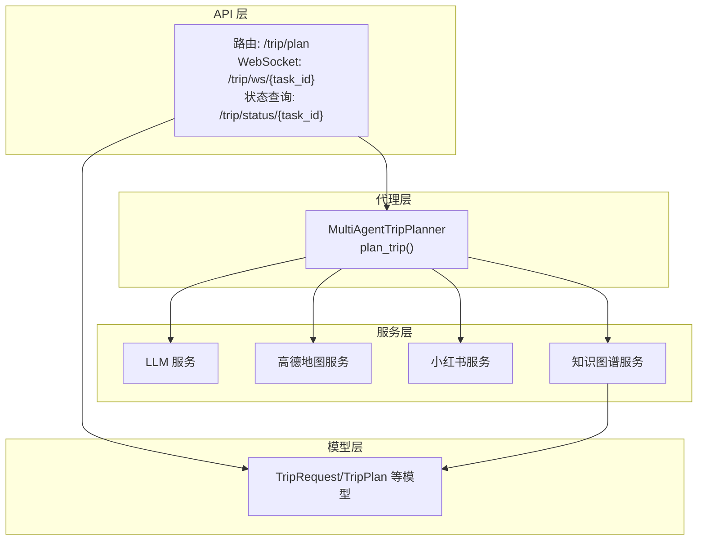
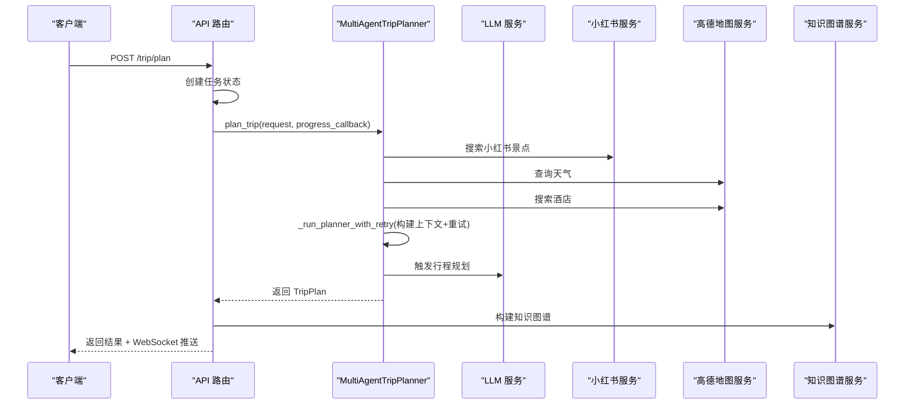
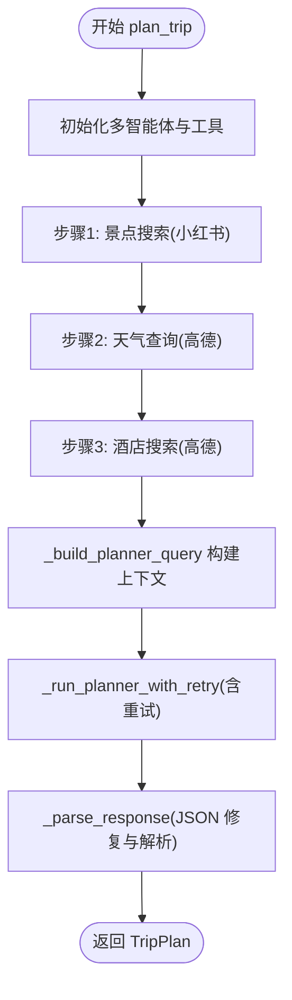
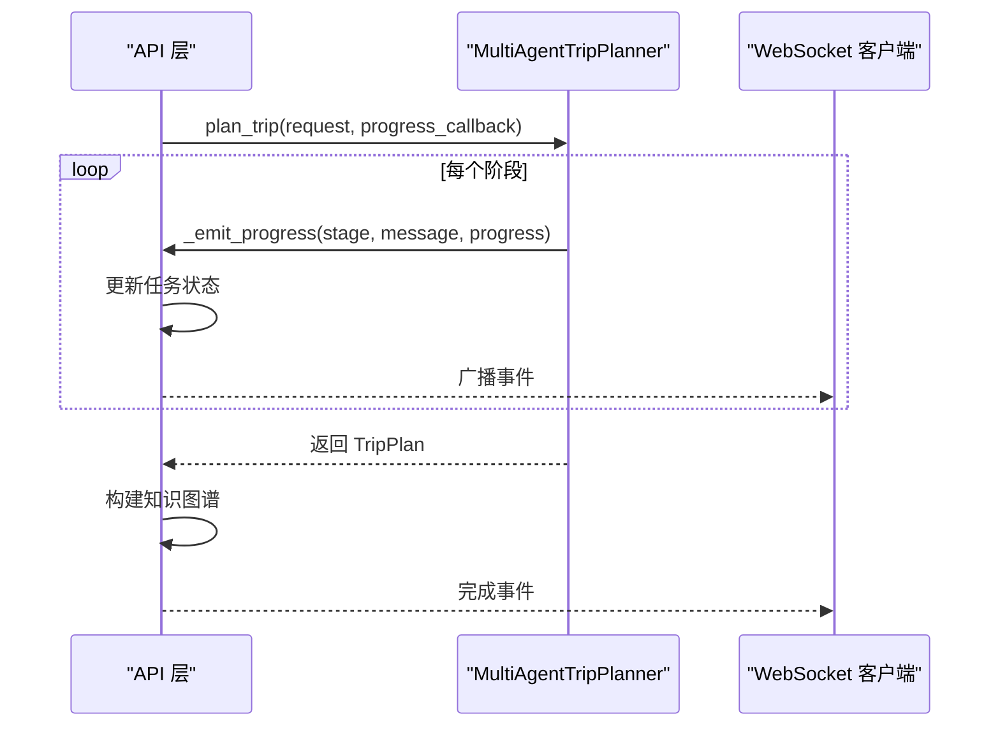
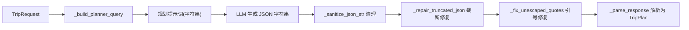
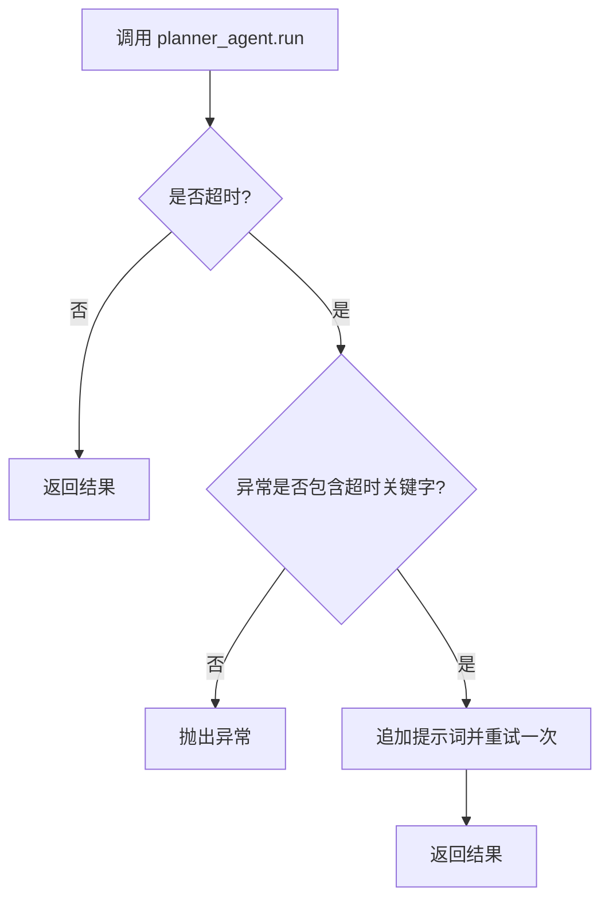
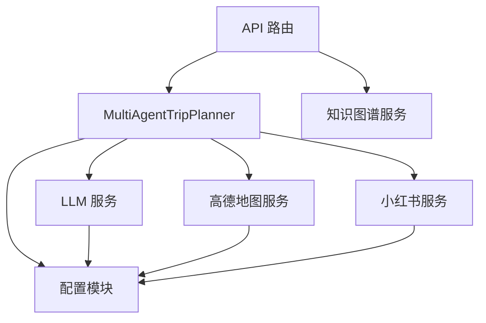

# Workflow 编排流程

<cite>
**本文引用的文件**
- [trip_planner_agent.py](file://backend/app/agents/trip_planner_agent.py)
- [trip.py](file://backend/app/api/routes/trip.py)
- [schemas.py](file://backend/app/models/schemas.py)
- [knowledge_graph_service.py](file://backend/app/services/knowledge_graph_service.py)
- [xhs_service.py](file://backend/app/services/xhs_service.py)
- [amap_service.py](file://backend/app/services/amap_service.py)
- [llm_service.py](file://backend/app/services/llm_service.py)
- [config.py](file://backend/app/config.py)
</cite>

## 目录
1. [简介](#简介)
2. [项目结构](#项目结构)
3. [核心组件](#核心组件)
4. [架构总览](#架构总览)
5. [详细组件分析](#详细组件分析)
6. [依赖分析](#依赖分析)
7. [性能考量](#性能考量)
8. [故障排查指南](#故障排查指南)
9. [结论](#结论)
10. [附录](#附录)

## 简介
本文件面向开发者，系统性阐述多智能体旅行规划系统（MultiAgentTripPlanner）的 Workflow 编排流程。重点覆盖四大核心阶段：景点搜索、天气查询、酒店搜索与行程规划；并发优化策略（串行与并行混合）、任务状态管理与进度回调、重试机制与超时处理、数据流转与上下文构建，以及前端通信与可视化集成。文档提供流程图与代码路径引用，帮助快速理解与优化多智能体编排逻辑。

## 项目结构
后端采用分层组织：API 路由负责任务提交与状态推送，代理层协调多智能体与外部服务，服务层封装 LLM、地图与小红书等能力，模型层定义数据结构，知识图谱服务负责结果可视化。

图表来源
- [trip.py:276-388](file://backend/app/api/routes/trip.py#L276-L388)
- [trip_planner_agent.py:173-242](file://backend/app/agents/trip_planner_agent.py#L173-L242)
- [llm_service.py:12-67](file://backend/app/services/llm_service.py#L12-L67)
- [amap_service.py:50-121](file://backend/app/services/amap_service.py#L50-L121)
- [xhs_service.py:247-354](file://backend/app/services/xhs_service.py#L247-L354)
- [knowledge_graph_service.py:34-168](file://backend/app/services/knowledge_graph_service.py#L34-L168)
- [schemas.py:10-264](file://backend/app/models/schemas.py#L10-L264)

章节来源
- [trip.py:1-511](file://backend/app/api/routes/trip.py#L1-L511)
- [trip_planner_agent.py:1-826](file://backend/app/agents/trip_planner_agent.py#L1-L826)
- [schemas.py:1-264](file://backend/app/models/schemas.py#L1-L264)

## 核心组件
- MultiAgentTripPlanner：多智能体编排器，负责四大阶段的调度、并发控制、重试与上下文构建。
- API 路由：接收请求、创建任务、推送进度、WebSocket 广播、轮询兼容。
- 服务层：
  - LLM 服务：统一的 LLM 客户端与超时配置。
  - 高德地图服务：MCP 工具封装，提供 POI、天气、路线、地理编码等能力。
  - 小红书服务：原生签名直连 API，提取结构化景点信息。
  - 知识图谱服务：将 TripPlan 转换为 ECharts 图数据。
- 模型层：TripRequest、TripPlan、DayPlan、Attraction、Hotel、WeatherInfo 等。

章节来源
- [trip_planner_agent.py:173-242](file://backend/app/agents/trip_planner_agent.py#L173-L242)
- [trip.py:276-388](file://backend/app/api/routes/trip.py#L276-L388)
- [llm_service.py:12-67](file://backend/app/services/llm_service.py#L12-L67)
- [amap_service.py:50-121](file://backend/app/services/amap_service.py#L50-L121)
- [xhs_service.py:247-354](file://backend/app/services/xhs_service.py#L247-L354)
- [knowledge_graph_service.py:34-168](file://backend/app/services/knowledge_graph_service.py#L34-L168)
- [schemas.py:10-264](file://backend/app/models/schemas.py#L10-L264)

## 架构总览
系统采用“异步任务 + 多智能体编排 + 外部服务调用”的整体架构。API 层负责任务生命周期管理与前端通信，代理层负责业务编排与容错，服务层负责与 LLM、地图、小红书等外部能力交互。

图表来源
- [trip.py:276-388](file://backend/app/api/routes/trip.py#L276-L388)
- [trip_planner_agent.py:257-338](file://backend/app/agents/trip_planner_agent.py#L257-L338)
- [xhs_service.py:247-354](file://backend/app/services/xhs_service.py#L247-L354)
- [amap_service.py:93-121](file://backend/app/services/amap_service.py#L93-L121)
- [llm_service.py:12-67](file://backend/app/services/llm_service.py#L12-L67)
- [knowledge_graph_service.py:34-168](file://backend/app/services/knowledge_graph_service.py#L34-L168)

## 详细组件分析

### MultiAgentTripPlanner 编排流程
- 四大阶段：
  1) 景点搜索：调用小红书服务，提取结构化景点并拼装经纬度与描述。
  2) 天气查询：通过高德天气工具查询目标城市天气。
  3) 酒店搜索：通过高德 POI 工具搜索目标城市酒店。
  4) 行程规划：将前三阶段结果整合为规划上下文，调用 LLM 生成 TripPlan，并进行多轮 JSON 修复与解析。
- 并发策略：
  - 步骤1-3：串行执行，避免多个 uvx 子进程同时启动导致资源竞争与超时。
  - 步骤4：在前三阶段完成后串行执行，确保上下文完备。
- 重试与超时：
  - 行程规划阶段使用更长超时（可配置），若检测到超时异常则追加提示并重试一次。
- 进度回调：
  - 通过 _emit_progress 支持同步/异步回调，API 层将其映射为任务状态与 WebSocket 事件。

图表来源
- [trip_planner_agent.py:257-338](file://backend/app/agents/trip_planner_agent.py#L257-L338)
- [trip_planner_agent.py:354-387](file://backend/app/agents/trip_planner_agent.py#L354-L387)
- [trip_planner_agent.py:389-422](file://backend/app/agents/trip_planner_agent.py#L389-L422)
- [trip_planner_agent.py:650-758](file://backend/app/agents/trip_planner_agent.py#L650-L758)

章节来源
- [trip_planner_agent.py:257-338](file://backend/app/agents/trip_planner_agent.py#L257-L338)
- [trip_planner_agent.py:354-387](file://backend/app/agents/trip_planner_agent.py#L354-L387)
- [trip_planner_agent.py:389-422](file://backend/app/agents/trip_planner_agent.py#L389-L422)
- [trip_planner_agent.py:650-758](file://backend/app/agents/trip_planner_agent.py#L650-L758)

### 任务状态管理与进度回调
- API 层维护任务状态（内存 + 本地持久化），支持 WebSocket 实时推送与轮询查询。
- 进度回调桥接：API 层将 MultiAgentTripPlanner 的进度回调转换为任务状态更新，并广播给订阅者。
- 任务生命周期：提交 -> 初始化 -> 执行 -> 构建知识图谱 -> 完成/失败。

图表来源
- [trip.py:315-388](file://backend/app/api/routes/trip.py#L315-L388)
- [trip_planner_agent.py:243-256](file://backend/app/agents/trip_planner_agent.py#L243-L256)

章节来源
- [trip.py:25-123](file://backend/app/api/routes/trip.py#L25-L123)
- [trip.py:207-274](file://backend/app/api/routes/trip.py#L207-L274)
- [trip.py:315-388](file://backend/app/api/routes/trip.py#L315-L388)
- [trip_planner_agent.py:243-256](file://backend/app/agents/trip_planner_agent.py#L243-L256)

### 数据流转与上下文构建
- 上下文构建：_build_planner_query 将城市、日期、偏好、景点、天气、酒店信息拼装为规划提示词。
- 参数传递：TripRequest 作为输入，TripPlan 作为输出，中间通过字符串上下文传递。
- JSON 修复链路：多轮清理（去标记、注释、控制字符、尾逗号、中文引号、算术表达式）、截断修复、正则提取、LLM 修复，最终解析为 TripPlan。

图表来源
- [trip_planner_agent.py:389-422](file://backend/app/agents/trip_planner_agent.py#L389-L422)
- [trip_planner_agent.py:424-466](file://backend/app/agents/trip_planner_agent.py#L424-L466)
- [trip_planner_agent.py:520-602](file://backend/app/agents/trip_planner_agent.py#L520-L602)
- [trip_planner_agent.py:650-758](file://backend/app/agents/trip_planner_agent.py#L650-L758)

章节来源
- [trip_planner_agent.py:389-422](file://backend/app/agents/trip_planner_agent.py#L389-L422)
- [trip_planner_agent.py:424-466](file://backend/app/agents/trip_planner_agent.py#L424-L466)
- [trip_planner_agent.py:520-602](file://backend/app/agents/trip_planner_agent.py#L520-L602)
- [trip_planner_agent.py:650-758](file://backend/app/agents/trip_planner_agent.py#L650-L758)

### 重试机制与超时处理
- 超时策略：行程规划阶段使用 TRIP_PLANNER_TIMEOUT（默认 180 秒）。
- 重试条件：仅当异常包含“timeout/timed out”字样时触发重试。
- 重试增强：在提示词中追加“在信息不足时使用保守建议补齐”的指令，提升稳定性。

图表来源
- [trip_planner_agent.py:354-387](file://backend/app/agents/trip_planner_agent.py#L354-L387)

章节来源
- [trip_planner_agent.py:354-387](file://backend/app/agents/trip_planner_agent.py#L354-L387)

### 并发优化策略与资源竞争避免
- 步骤1-3 串行执行：避免多个 uvx 子进程同时启动导致资源竞争与超时。
- 步骤4 串行执行：依赖前三阶段结果，确保上下文完整性。
- 异步执行：使用 asyncio.to_thread 将阻塞式调用（如 LLM、HTTP 请求）放入线程池，避免阻塞事件循环。
- 进度回调：支持同步/异步回调，API 层统一处理。

章节来源
- [trip_planner_agent.py:284-338](file://backend/app/agents/trip_planner_agent.py#L284-L338)
- [trip_planner_agent.py:243-256](file://backend/app/agents/trip_planner_agent.py#L243-L256)

### 外部服务集成
- LLM 服务：统一初始化与超时配置，注入 User-Agent 以规避第三方中转 API 的 WAF 拦截。
- 高德地图服务：MCP 工具封装，提供 POI、天气、路线、地理编码等能力。
- 小红书服务：原生签名直连 API，提取结构化景点并补全经纬度。

章节来源
- [llm_service.py:12-67](file://backend/app/services/llm_service.py#L12-L67)
- [amap_service.py:50-121](file://backend/app/services/amap_service.py#L50-L121)
- [xhs_service.py:247-354](file://backend/app/services/xhs_service.py#L247-L354)

### 知识图谱构建与前端可视化
- 知识图谱服务：从 TripPlan 中抽取节点与边，生成 ECharts 所需的 nodes/edges/categories。
- API 层：在任务完成后构建图数据并随结果返回，前端可直接渲染。

章节来源
- [knowledge_graph_service.py:34-168](file://backend/app/services/knowledge_graph_service.py#L34-L168)
- [trip.py:345-353](file://backend/app/api/routes/trip.py#L345-L353)

## 依赖分析
- 组件耦合：
  - API 路由依赖代理层与知识图谱服务。
  - 代理层依赖 LLM、高德地图与小红书服务。
  - 服务层依赖配置模块与 LLM 客户端。
- 外部依赖：
  - LLM 提供商（OpenAI/第三方）。
  - 高德地图 MCP 服务。
  - 小红书原生 API（需有效 Cookie）。
- 潜在风险：
  - 小红书 Cookie 失效会导致致命异常，需在 API 层捕获并友好提示。
  - 高德 API Key 未配置会影响地理编码与 POI 搜索。

图表来源
- [trip.py:13-15](file://backend/app/api/routes/trip.py#L13-L15)
- [trip_planner_agent.py:180-241](file://backend/app/agents/trip_planner_agent.py#L180-L241)
- [llm_service.py:12-67](file://backend/app/services/llm_service.py#L12-L67)
- [amap_service.py:12-47](file://backend/app/services/amap_service.py#L12-L47)
- [xhs_service.py:192-198](file://backend/app/services/xhs_service.py#L192-L198)
- [config.py:21-71](file://backend/app/config.py#L21-L71)

章节来源
- [trip.py:13-15](file://backend/app/api/routes/trip.py#L13-L15)
- [trip_planner_agent.py:180-241](file://backend/app/agents/trip_planner_agent.py#L180-L241)
- [llm_service.py:12-67](file://backend/app/services/llm_service.py#L12-L67)
- [amap_service.py:12-47](file://backend/app/services/amap_service.py#L12-L47)
- [xhs_service.py:192-198](file://backend/app/services/xhs_service.py#L192-L198)
- [config.py:21-71](file://backend/app/config.py#L21-L71)

## 性能考量
- 并发与串行的平衡：步骤1-3串行避免资源竞争，步骤4串行确保上下文完整；若外部服务具备更强并发能力，可考虑在代理层引入 asyncio.gather 并加锁或限流。
- 超时与重试：合理设置 TRIP_PLANNER_TIMEOUT，避免长时间阻塞；重试仅在超时场景触发，减少无效重试。
- JSON 修复成本：多轮修复与 LLM 修复会增加开销，建议在提示词中尽量引导 LLM 输出规范 JSON，减少修复路径。
- I/O 密集优化：将 HTTP 请求与 LLM 调用放入线程池，避免阻塞事件循环。

## 故障排查指南
- 小红书 Cookie 失效：
  - 现象：抛出 XHSCookieExpiredError，API 层捕获并返回友好错误。
  - 处理：在前端设置页更新 Cookie，或更换有效 Cookie。
- 高德 API Key 未配置：
  - 现象：地理编码/POI 搜索功能受限。
  - 处理：在前端设置页配置 VITE_AMAP_WEB_KEY。
- LLM 超时：
  - 现象：_run_planner_with_retry 检测到超时并重试一次。
  - 处理：适当增大 TRIP_PLANNER_TIMEOUT，或优化提示词长度与复杂度。
- JSON 解析失败：
  - 现象：_parse_response 多轮修复后仍失败。
  - 处理：检查提示词与 LLM 输出，必要时启用 LLM 修复链路。

章节来源
- [trip.py:365-387](file://backend/app/api/routes/trip.py#L365-L387)
- [xhs_service.py:22-24](file://backend/app/services/xhs_service.py#L22-L24)
- [xhs_service.py:134-141](file://backend/app/services/xhs_service.py#L134-L141)
- [trip_planner_agent.py:354-387](file://backend/app/agents/trip_planner_agent.py#L354-L387)
- [trip_planner_agent.py:650-758](file://backend/app/agents/trip_planner_agent.py#L650-L758)

## 结论
MultiAgentTripPlanner 通过“串行+异步”的编排策略，在保证上下文完整性的同时兼顾性能与稳定性。结合完善的进度回调、重试与超时处理、多轮 JSON 修复与前端可视化，形成从请求到结果的完整闭环。建议在生产环境中进一步优化外部服务并发与缓存策略，并持续监控与改进 JSON 输出质量，以降低修复成本。

## 附录
- 关键实现路径参考：
  - [plan_trip 主流程:257-338](file://backend/app/agents/trip_planner_agent.py#L257-L338)
  - [进度回调 _emit_progress:243-256](file://backend/app/agents/trip_planner_agent.py#L243-L256)
  - [重试与超时 _run_planner_with_retry:354-387](file://backend/app/agents/trip_planner_agent.py#L354-L387)
  - [上下文构建 _build_planner_query:389-422](file://backend/app/agents/trip_planner_agent.py#L389-L422)
  - [JSON 修复链路 _parse_response:650-758](file://backend/app/agents/trip_planner_agent.py#L650-L758)
  - [API 任务状态与 WebSocket:25-123](file://backend/app/api/routes/trip.py#L25-L123)
  - [API 任务执行与进度推送:315-388](file://backend/app/api/routes/trip.py#L315-L388)
  - [LLM 服务初始化:12-67](file://backend/app/services/llm_service.py#L12-L67)
  - [高德地图服务封装:50-121](file://backend/app/services/amap_service.py#L50-L121)
  - [小红书服务封装:247-354](file://backend/app/services/xhs_service.py#L247-L354)
  - [知识图谱构建:34-168](file://backend/app/services/knowledge_graph_service.py#L34-L168)
  - [数据模型定义:10-264](file://backend/app/models/schemas.py#L10-L264)
  - [配置管理:21-71](file://backend/app/config.py#L21-L71)