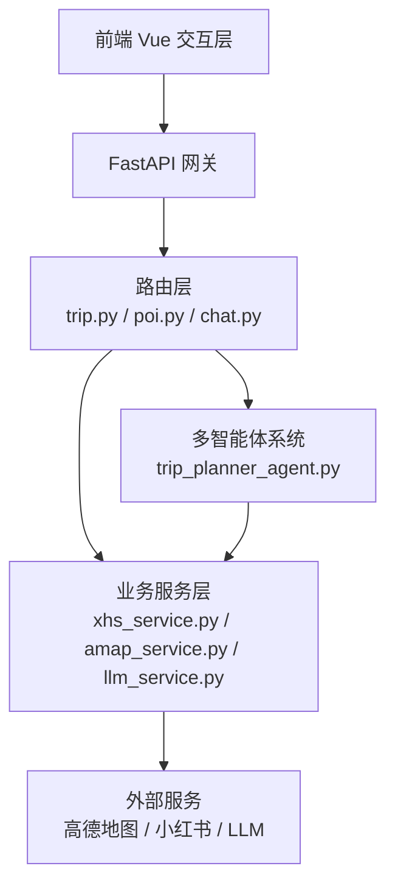
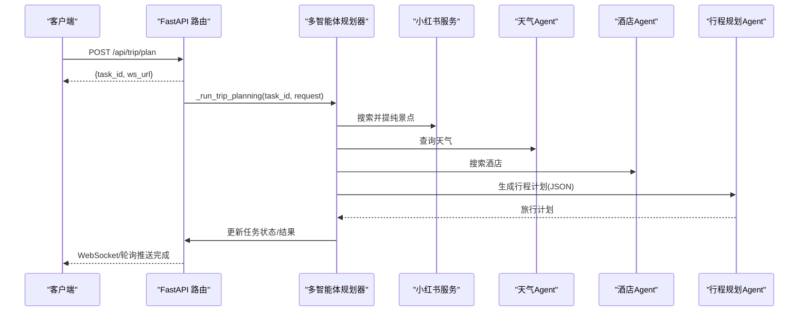
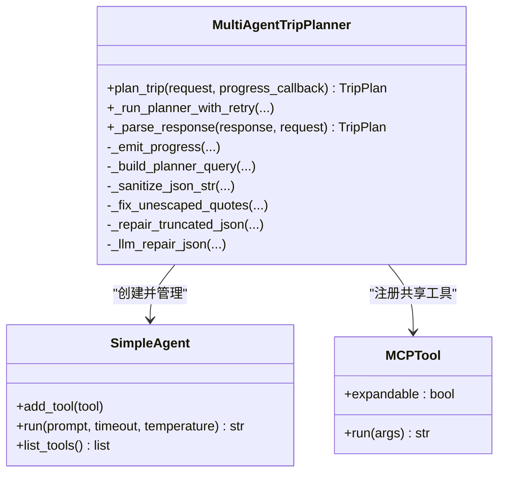
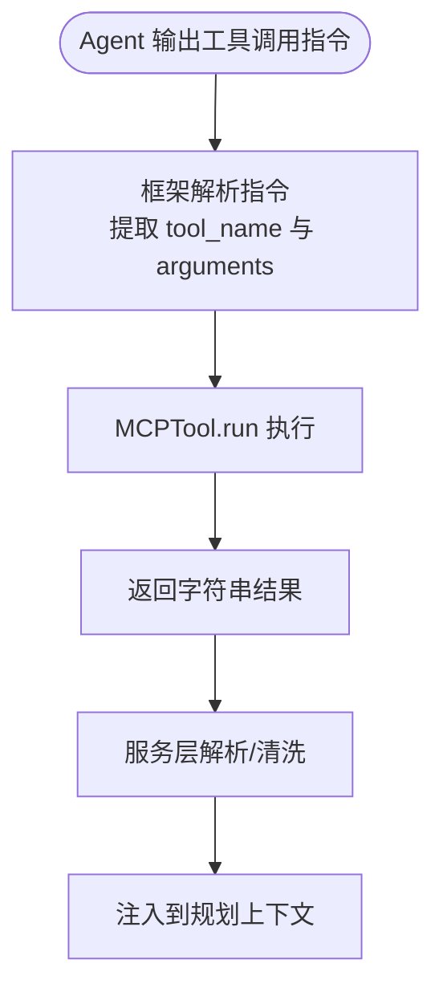
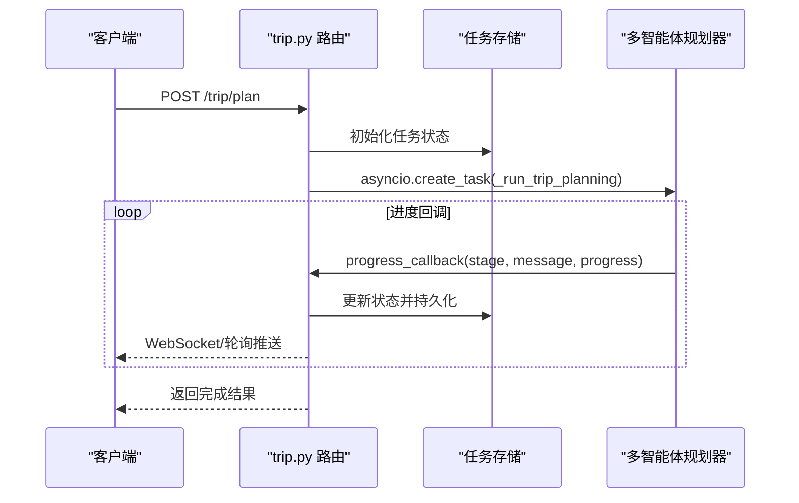
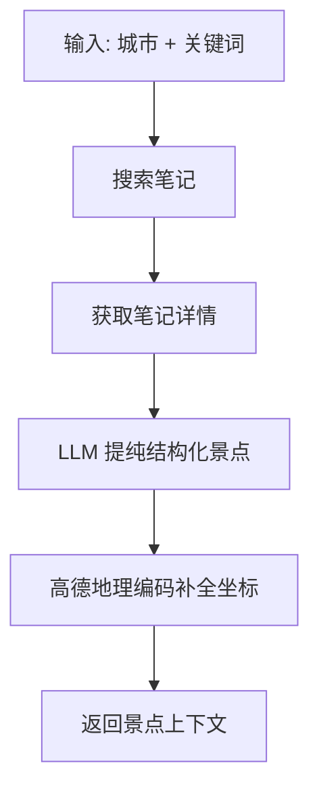
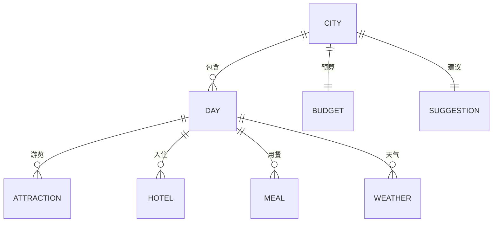
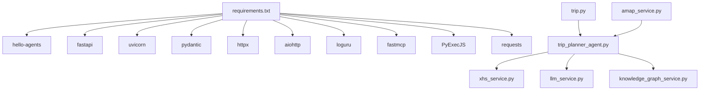

# 多智能体系统

<cite>
**本文档引用的文件**
- [README.md](file://README.md)
- [trip_planner_agent.py](file://backend/app/agents/trip_planner_agent.py)
- [main.py](file://backend/app/api/main.py)
- [config.py](file://backend/app/config.py)
- [schemas.py](file://backend/app/models/schemas.py)
- [trip.py](file://backend/app/api/routes/trip.py)
- [xhs_service.py](file://backend/app/services/xhs_service.py)
- [amap_service.py](file://backend/app/services/amap_service.py)
- [llm_service.py](file://backend/app/services/llm_service.py)
- [knowledge_graph_service.py](file://backend/app/services/knowledge_graph_service.py)
- [chat_service.py](file://backend/app/services/chat_service.py)
- [requirements.txt](file://backend/requirements.txt)
</cite>

## 目录
1. [简介](#简介)
2. [项目结构](#项目结构)
3. [核心组件](#核心组件)
4. [架构总览](#架构总览)
5. [详细组件分析](#详细组件分析)
6. [依赖关系分析](#依赖关系分析)
7. [性能考量](#性能考量)
8. [故障排查指南](#故障排查指南)
9. [结论](#结论)
10. [附录](#附录)

## 简介
本项目基于 HelloAgents 框架构建的多智能体协作文旅规划平台，旨在解决旅行规划中的“信息过载”和“决策疲劳”。系统通过多智能体协作（天气预报员、酒店推荐专家、行程规划专家等）与 LLM/Tools 协同，结合高德地图、小红书等外部服务，输出结构化的旅行计划，包括每日行程、预算明细、天气信息、知识图谱可视化等。

## 项目结构
后端采用前后端分离架构，主要分为三层：
- 前端 Vue 交互层：负责参数输入、结果展示、知识图谱与 AI 问答。
- 后端 FastAPI 服务层：提供异步任务调度、WebSocket 实时状态推送、REST API。
- 智能推理层：多智能体系统（Agent）、工具（Tool）、工作流（Workflow）与服务（Service）。

**图表来源**
- [main.py:24-61](file://backend/app/api/main.py#L24-L61)
- [trip.py:17-17](file://backend/app/api/routes/trip.py#L17-L17)
- [trip_planner_agent.py:173-242](file://backend/app/agents/trip_planner_agent.py#L173-L242)
- [xhs_service.py:247-354](file://backend/app/services/xhs_service.py#L247-L354)
- [amap_service.py:50-121](file://backend/app/services/amap_service.py#L50-L121)

**章节来源**
- [README.md:43-97](file://README.md#L43-L97)
- [main.py:24-61](file://backend/app/api/main.py#L24-L61)

## 核心组件
- 多智能体旅行规划系统：封装 Agent 初始化、工具注册、并发工作流与结果解析。
- 旅行规划 API：异步任务提交、WebSocket 实时状态推送、历史任务持久化。
- 服务层：小红书原生签名抓取与 LLM 提纯、高德 MCP 工具封装、知识图谱构建、LLM 客户端封装。
- 配置与模型：统一配置管理、运行时设置、Pydantic 数据模型与响应结构。

**章节来源**
- [trip_planner_agent.py:173-242](file://backend/app/agents/trip_planner_agent.py#L173-L242)
- [trip.py:25-52](file://backend/app/api/routes/trip.py#L25-L52)
- [xhs_service.py:247-354](file://backend/app/services/xhs_service.py#L247-L354)
- [amap_service.py:50-121](file://backend/app/services/amap_service.py#L50-L121)
- [config.py:21-68](file://backend/app/config.py#L21-L68)
- [schemas.py:10-20](file://backend/app/models/schemas.py#L10-L20)

## 架构总览
系统采用“任务驱动 + 多智能体 + 工具编排”的工作流：
- 前端提交旅行请求，后端立即返回 task_id 并异步执行。
- 多智能体系统并发收集景点、天气、酒店信息，随后串行生成行程计划。
- 生成完成后构建知识图谱并返回结果，支持 WebSocket 与轮询两种状态获取方式。

**图表来源**
- [trip.py:276-388](file://backend/app/api/routes/trip.py#L276-L388)
- [trip_planner_agent.py:257-338](file://backend/app/agents/trip_planner_agent.py#L257-L338)
- [xhs_service.py:247-354](file://backend/app/services/xhs_service.py#L247-L354)

## 详细组件分析

### 多智能体旅行规划系统（TripPlannerAgent）
- 设计理念
  - 基于 HelloAgents 的 SimpleAgent 与 MCPTool，将外部服务抽象为工具，Agent 仅负责任务分解与调用。
  - 通过系统提示词限定工具调用格式，确保 LLM 输出严格可控。
- 初始化与工具注册
  - 创建共享 MCPTool（高德地图），自动展开子工具，注册到天气与酒店 Agent。
  - 行程规划 Agent 不依赖外部工具，专注结构化解析与生成。
- 并发与串行流程
  - 步骤1-3（景点/天气/酒店）并发执行，缩短总耗时。
  - 步骤4（行程规划）串行，依赖前三步结果。
- 错误处理与重试
  - 规划阶段超时重试一次，必要时追加保守建议提示。
  - JSON 解析多层容错：基础清理、引号修复、截断修复、正则提取、LLM 修复。
- 进度回调与可观测性
  - 支持同步/异步进度回调，便于 WebSocket 与轮询推送。

**图表来源**
- [trip_planner_agent.py:173-242](file://backend/app/agents/trip_planner_agent.py#L173-L242)
- [trip_planner_agent.py:354-422](file://backend/app/agents/trip_planner_agent.py#L354-L422)
- [trip_planner_agent.py:650-759](file://backend/app/agents/trip_planner_agent.py#L650-L759)

**章节来源**
- [trip_planner_agent.py:173-242](file://backend/app/agents/trip_planner_agent.py#L173-L242)
- [trip_planner_agent.py:257-338](file://backend/app/agents/trip_planner_agent.py#L257-L338)
- [trip_planner_agent.py:354-422](file://backend/app/agents/trip_planner_agent.py#L354-L422)
- [trip_planner_agent.py:424-650](file://backend/app/agents/trip_planner_agent.py#L424-L650)
- [trip_planner_agent.py:650-759](file://backend/app/agents/trip_planner_agent.py#L650-L759)

### 工具集成机制（Tool）
- 工具注册
  - 通过 MCPTool 封装高德地图服务，自动展开为多个子工具（如文本搜索、天气查询、路线规划等）。
  - 设置环境变量（高德 Web 服务 Key），确保工具可用。
- 调用方式
  - Agent 通过系统提示词输出严格格式的工具调用指令，由框架解析并执行。
  - 服务层也可直接调用 MCPTool 的 run 方法，进行批量或复杂查询。
- 参数传递
  - 工具调用参数遵循统一键值对格式，支持城市、关键词、路线类型等。

**图表来源**
- [trip_planner_agent.py:15-80](file://backend/app/agents/trip_planner_agent.py#L15-L80)
- [amap_service.py:12-47](file://backend/app/services/amap_service.py#L12-L47)
- [amap_service.py:50-121](file://backend/app/services/amap_service.py#L50-L121)

**章节来源**
- [amap_service.py:12-47](file://backend/app/services/amap_service.py#L12-L47)
- [amap_service.py:50-121](file://backend/app/services/amap_service.py#L50-L121)
- [trip_planner_agent.py:15-80](file://backend/app/agents/trip_planner_agent.py#L15-L80)

### 工作流编排（Workflow）
- 任务提交与状态管理
  - 提交任务立即返回 task_id，后台以异步任务执行，状态持久化至本地 JSON。
  - 支持 WebSocket 实时订阅与轮询查询两种方式。
- 并发与串行策略
  - 步骤1-3 并发执行，避免多个子进程同时启动导致资源竞争。
  - 步骤4 串行，确保依赖满足。
- 状态事件与广播
  - 任务状态变更通过队列广播给所有订阅者，支持断线重连快照。

**图表来源**
- [trip.py:276-388](file://backend/app/api/routes/trip.py#L276-L388)
- [trip.py:207-274](file://backend/app/api/routes/trip.py#L207-L274)

**章节来源**
- [trip.py:25-52](file://backend/app/api/routes/trip.py#L25-L52)
- [trip.py:207-274](file://backend/app/api/routes/trip.py#L207-L274)
- [trip.py:315-388](file://backend/app/api/routes/trip.py#L315-L388)

### 小红书集成（XHS Service）
- 原生签名直连 API，绕过风控拦截，支持搜索笔记、获取详情、提取首图。
- 通过 LLM 对游记内容进行结构化提取（景点名称、游玩时长、预约信息等）。
- 地理编码补全经纬度，为后续知识图谱与地图展示提供坐标。

**图表来源**
- [xhs_service.py:247-354](file://backend/app/services/xhs_service.py#L247-L354)
- [xhs_service.py:304-353](file://backend/app/services/xhs_service.py#L304-L353)

**章节来源**
- [xhs_service.py:247-354](file://backend/app/services/xhs_service.py#L247-L354)
- [xhs_service.py:304-353](file://backend/app/services/xhs_service.py#L304-L353)

### 知识图谱构建（Knowledge Graph）
- 输入：TripPlan 数据模型。
- 节点与边：城市、日程、景点、酒店、餐饮、天气、预算、建议等分类节点与关系边。
- ECharts 图数据：节点颜色、大小、分类映射，便于前端可视化。

**图表来源**
- [knowledge_graph_service.py:34-168](file://backend/app/services/knowledge_graph_service.py#L34-L168)
- [schemas.py:146-155](file://backend/app/models/schemas.py#L146-L155)

**章节来源**
- [knowledge_graph_service.py:34-168](file://backend/app/services/knowledge_graph_service.py#L34-L168)
- [schemas.py:146-155](file://backend/app/models/schemas.py#L146-L155)

### 配置与模型
- 配置管理：统一读取 .env 与 HelloAgents 环境，支持运行时设置持久化与热更新。
- 数据模型：Pydantic 定义旅行请求、响应、每日行程、预算、天气、知识图谱等结构。

**章节来源**
- [config.py:21-68](file://backend/app/config.py#L21-L68)
- [config.py:129-202](file://backend/app/config.py#L129-L202)
- [schemas.py:10-20](file://backend/app/models/schemas.py#L10-L20)
- [schemas.py:146-155](file://backend/app/models/schemas.py#L146-L155)

## 依赖关系分析
- 框架与库
  - hello-agents、fastapi、uvicorn、pydantic、httpx、aiohttp、loguru、fastmcp、uv、PyExecJS、requests 等。
- 组件耦合
  - 路由层依赖多智能体规划器与知识图谱服务。
  - 多智能体规划器依赖 LLM 服务与小红书服务。
  - 服务层依赖配置与 LLM 客户端。

**图表来源**
- [requirements.txt:1-18](file://backend/requirements.txt#L1-L18)
- [trip.py:13-15](file://backend/app/api/routes/trip.py#L13-L15)
- [trip_planner_agent.py:8-11](file://backend/app/agents/trip_planner_agent.py#L8-L11)

**章节来源**
- [requirements.txt:1-18](file://backend/requirements.txt#L1-L18)
- [trip.py:13-15](file://backend/app/api/routes/trip.py#L13-L15)

## 性能考量
- 异步与并发
  - 使用 asyncio.create_task 与并发执行（步骤1-3），显著降低总耗时。
  - 使用 asyncio.to_thread 将阻塞操作（LLM、HTTP 请求）隔离，避免阻塞事件循环。
- 超时与重试
  - 规划阶段设置较长超时，首次超时自动重试一次，提升成功率。
- JSON 解析容错
  - 多轮修复策略（基础清理、引号修复、截断修复、正则提取、LLM 修复），最大化解析成功率。
- 工具调用优化
  - MCPTool 自动展开工具，减少重复初始化成本；高德工具按需调用，避免无效请求。

**章节来源**
- [trip.py:304-305](file://backend/app/api/routes/trip.py#L304-L305)
- [trip_planner_agent.py:361-387](file://backend/app/agents/trip_planner_agent.py#L361-L387)
- [trip_planner_agent.py:424-650](file://backend/app/agents/trip_planner_agent.py#L424-L650)

## 故障排查指南
- 任务状态异常
  - 检查任务持久化文件是否存在与可读；服务重启后未完成任务会被标记为失败。
  - 通过 WebSocket 或轮询接口确认最终状态与错误信息。
- LLM 服务问题
  - 确认 LLM API Key、Base URL、Model、Timeout 等配置；必要时重置 LLM 实例。
- 小红书 Cookie 失效
  - 当出现特定风控错误时，前端会收到明确提示；需重新配置 Cookie。
- 高德工具不可用
  - 确认高德 Web 服务 Key 已配置；MCPTool 初始化失败会导致工具不可用。
- JSON 解析失败
  - 查看多轮修复日志；如仍失败，检查 LLM 输出格式与提示词约束。

**章节来源**
- [trip.py:71-79](file://backend/app/api/routes/trip.py#L71-L79)
- [trip.py:365-387](file://backend/app/api/routes/trip.py#L365-L387)
- [llm_service.py:12-67](file://backend/app/services/llm_service.py#L12-L67)
- [xhs_service.py:22-25](file://backend/app/services/xhs_service.py#L22-L25)
- [xhs_service.py:192-199](file://backend/app/services/xhs_service.py#L192-L199)
- [amap_service.py:24-26](file://backend/app/services/amap_service.py#L24-L26)
- [trip_planner_agent.py:604-758](file://backend/app/agents/trip_planner_agent.py#L604-L758)

## 结论
本系统通过多智能体与工具编排，实现了从“信息采集—结构化提取—规划生成—可视化呈现”的完整闭环。借助异步任务、并发执行与多层 JSON 容错，系统在稳定性与性能上具备良好表现。未来可进一步扩展智能体类型、接入更多外部服务与可视化组件，持续提升用户体验。

## 附录

### 扩展示例
- 添加新的智能体类型
  - 参考现有 Agent 的系统提示词与工具注册方式，创建新的 SimpleAgent 并注入 MCPTool。
  - 在多智能体规划器中新增步骤并在工作流中编排。
- 自定义工具
  - 通过 MCPTool 封装新的外部服务，确保工具名称与参数格式符合框架规范。
  - 在 Agent 的提示词中声明工具调用格式，保证 LLM 输出严格可控。

**章节来源**
- [trip_planner_agent.py:173-242](file://backend/app/agents/trip_planner_agent.py#L173-L242)
- [amap_service.py:12-47](file://backend/app/services/amap_service.py#L12-L47)