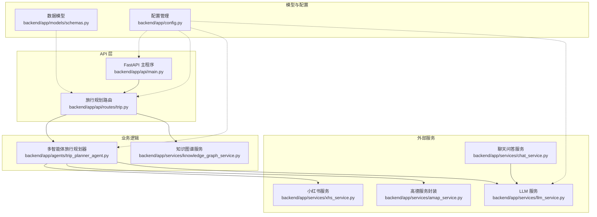
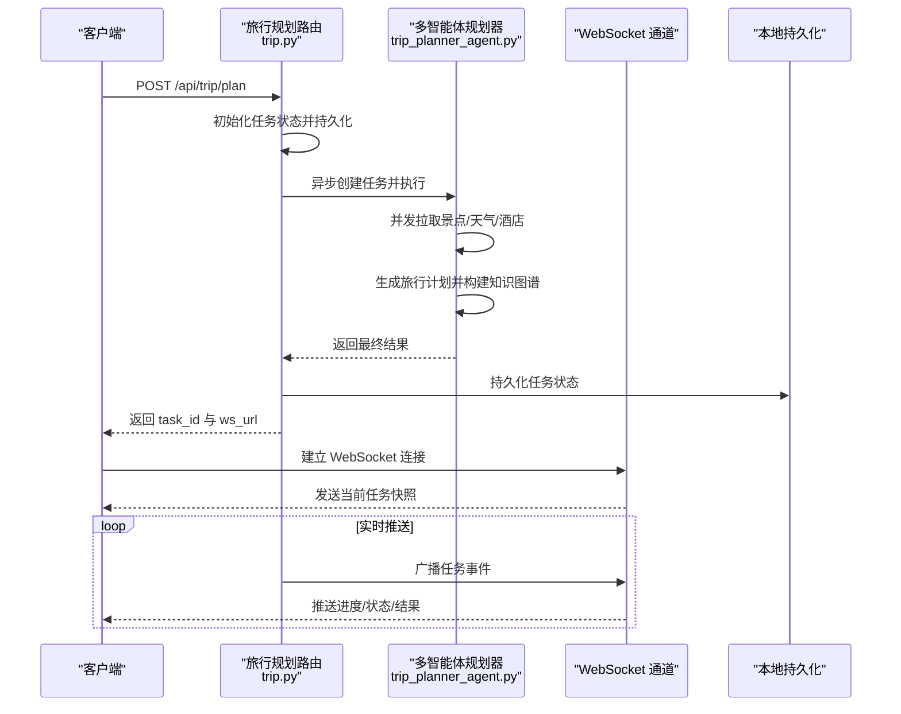
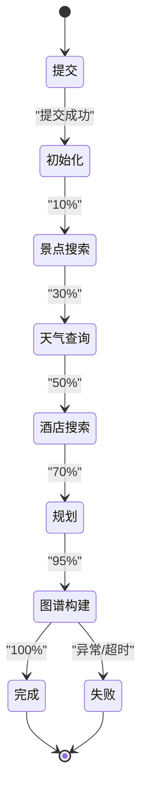
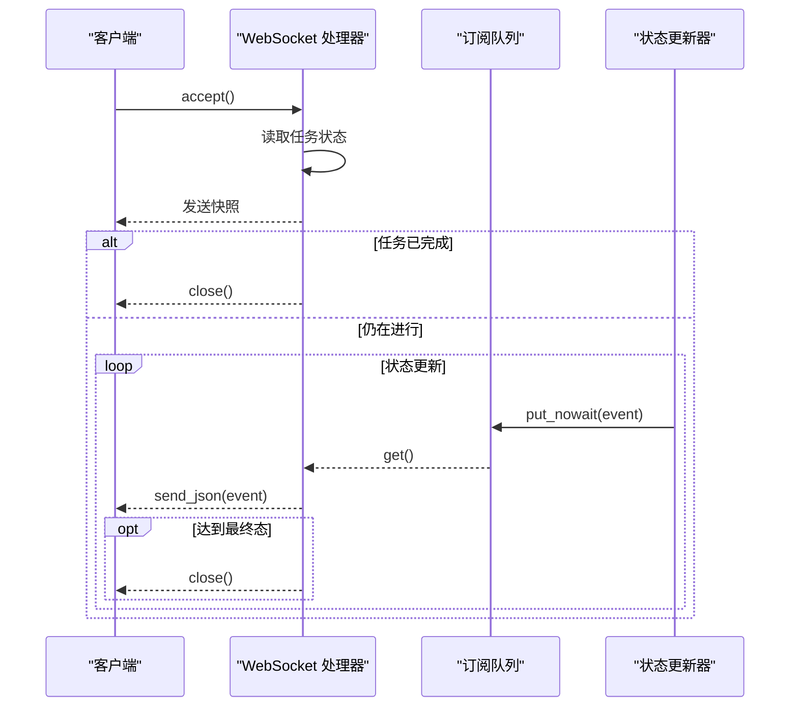
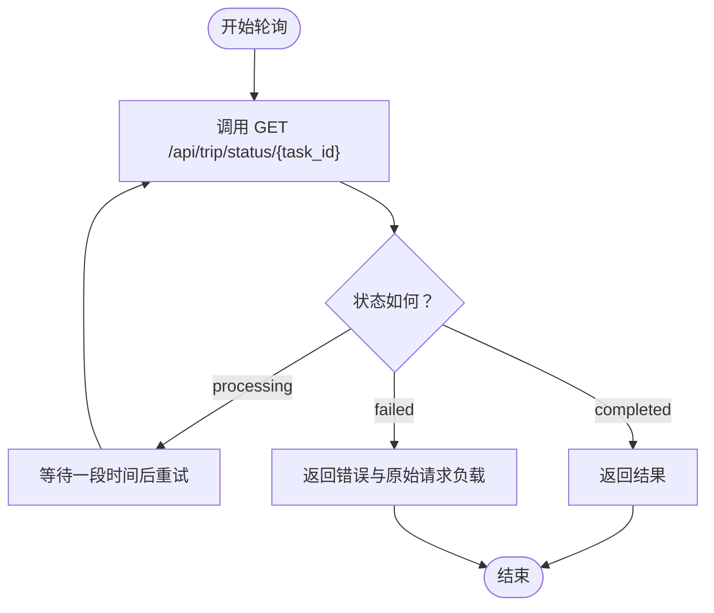
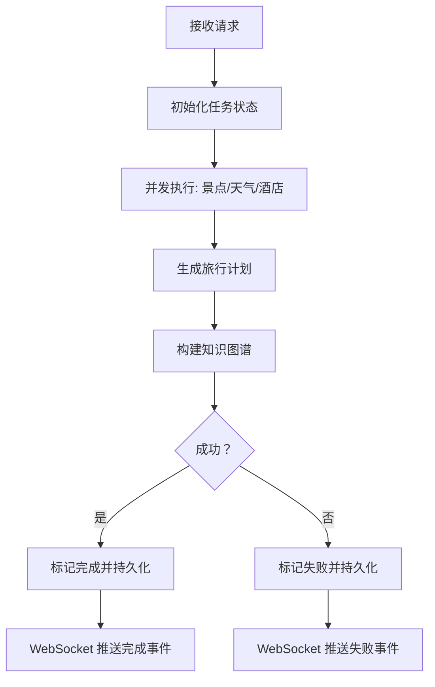
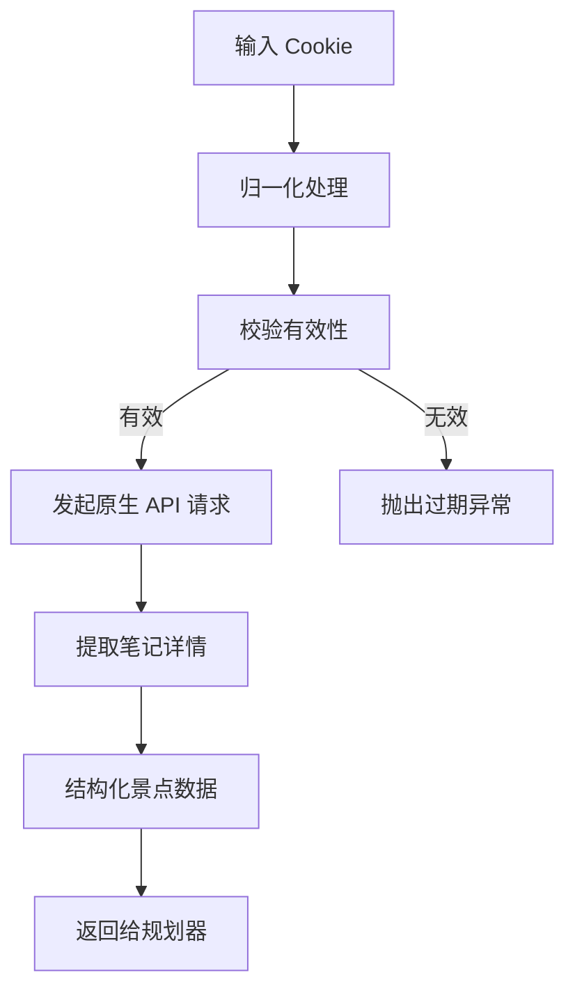
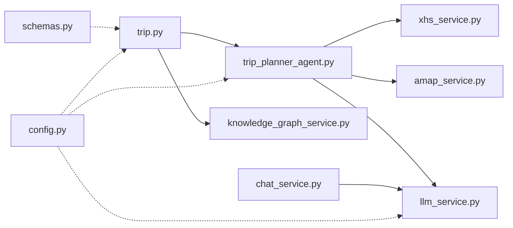

# 异步任务处理

<cite>
**本文档引用的文件**
- [backend/app/api/main.py](file://backend/app/api/main.py)
- [backend/app/api/routes/trip.py](file://backend/app/api/routes/trip.py)
- [backend/app/agents/trip_planner_agent.py](file://backend/app/agents/trip_planner_agent.py)
- [backend/app/services/knowledge_graph_service.py](file://backend/app/services/knowledge_graph_service.py)
- [backend/app/services/xhs_service.py](file://backend/app/services/xhs_service.py)
- [backend/app/services/amap_service.py](file://backend/app/services/amap_service.py)
- [backend/app/services/llm_service.py](file://backend/app/services/llm_service.py)
- [backend/app/services/chat_service.py](file://backend/app/services/chat_service.py)
- [backend/app/models/schemas.py](file://backend/app/models/schemas.py)
- [backend/app/config.py](file://backend/app/config.py)
- [backend/run.py](file://backend/run.py)
</cite>

## 目录
1. [简介](#简介)
2. [项目结构](#项目结构)
3. [核心组件](#核心组件)
4. [架构总览](#架构总览)
5. [详细组件分析](#详细组件分析)
6. [依赖分析](#依赖分析)
7. [性能考量](#性能考量)
8. [故障排查指南](#故障排查指南)
9. [结论](#结论)
10. [附录](#附录)

## 简介
本文件系统性阐述 TripStar 异步任务处理体系，围绕旅行规划任务的创建、调度、执行与状态管理展开，涵盖 WebSocket 实时推送与轮询降级方案、任务状态机与生命周期、持久化存储策略、监控与调试方法，以及性能优化与扩展性设计建议。读者无需深入技术背景即可理解整体工作原理与使用方式。

## 项目结构
后端采用 FastAPI + asyncio 的异步架构，核心位于 backend/app/api/routes/trip.py，负责任务生命周期与状态分发；旅行规划智能体位于 backend/app/agents/trip_planner_agent.py，负责多智能体协作与数据清洗；服务层封装外部能力（如小红书、高德、LLM），并通过知识图谱服务生成可视化数据。

图表来源
- [backend/app/api/main.py:13-60](file://backend/app/api/main.py#L13-L60)
- [backend/app/api/routes/trip.py:17-22](file://backend/app/api/routes/trip.py#L17-L22)
- [backend/app/agents/trip_planner_agent.py:173-241](file://backend/app/agents/trip_planner_agent.py#L173-L241)
- [backend/app/services/knowledge_graph_service.py:34-168](file://backend/app/services/knowledge_graph_service.py#L34-L168)
- [backend/app/services/xhs_service.py:247-354](file://backend/app/services/xhs_service.py#L247-L354)
- [backend/app/services/amap_service.py:50-276](file://backend/app/services/amap_service.py#L50-L276)
- [backend/app/services/llm_service.py:12-75](file://backend/app/services/llm_service.py#L12-L75)
- [backend/app/services/chat_service.py:65-133](file://backend/app/services/chat_service.py#L65-L133)
- [backend/app/models/schemas.py:10-264](file://backend/app/models/schemas.py#L10-L264)
- [backend/app/config.py:21-122](file://backend/app/config.py#L21-L122)

章节来源
- [backend/app/api/main.py:13-60](file://backend/app/api/main.py#L13-L60)
- [backend/app/api/routes/trip.py:17-22](file://backend/app/api/routes/trip.py#L17-L22)
- [backend/app/config.py:21-122](file://backend/app/config.py#L21-L122)

## 核心组件
- 异步任务路由与状态管理：在旅行规划路由中实现任务创建、状态持久化、WebSocket 实时推送与轮询查询。
- 多智能体旅行规划器：负责并发拉取景点、天气、酒店数据，再由规划器生成结构化旅行计划，并进行多轮 JSON 修复。
- 知识图谱服务：从旅行计划中抽取节点与边，生成 ECharts 可视化数据。
- 外部服务集成：小红书原生签名直连、高德 MCP 工具、LLM 单例与伪装 UA、聊天问答服务。
- 数据模型与配置：统一的请求/响应模型与运行时配置管理。

章节来源
- [backend/app/api/routes/trip.py:25-123](file://backend/app/api/routes/trip.py#L25-L123)
- [backend/app/agents/trip_planner_agent.py:257-338](file://backend/app/agents/trip_planner_agent.py#L257-L338)
- [backend/app/services/knowledge_graph_service.py:34-168](file://backend/app/services/knowledge_graph_service.py#L34-L168)
- [backend/app/services/xhs_service.py:247-354](file://backend/app/services/xhs_service.py#L247-L354)
- [backend/app/services/amap_service.py:50-276](file://backend/app/services/amap_service.py#L50-L276)
- [backend/app/services/llm_service.py:12-75](file://backend/app/services/llm_service.py#L12-L75)
- [backend/app/services/chat_service.py:65-133](file://backend/app/services/chat_service.py#L65-L133)
- [backend/app/models/schemas.py:10-264](file://backend/app/models/schemas.py#L10-L264)
- [backend/app/config.py:21-122](file://backend/app/config.py#L21-L122)

## 架构总览
异步任务处理采用“提交即返回 + 后台执行 + 实时推送”的模式。客户端提交任务后立即获得 task_id，随后可通过 WebSocket 实时订阅状态，或通过轮询查询状态。任务状态在内存中维护，并持久化到本地 JSON 文件，服务重启后会将未完成的任务标记为失败，避免前端无限等待。

图表来源
- [backend/app/api/routes/trip.py:281-312](file://backend/app/api/routes/trip.py#L281-L312)
- [backend/app/api/routes/trip.py:315-387](file://backend/app/api/routes/trip.py#L315-L387)
- [backend/app/api/routes/trip.py:390-440](file://backend/app/api/routes/trip.py#L390-L440)
- [backend/app/api/routes/trip.py:82-104](file://backend/app/api/routes/trip.py#L82-L104)

## 详细组件分析

### 任务状态与生命周期
- 状态定义：任务状态包含 processing（处理中）、completed（已完成）、failed（失败）；阶段 stage 包含 submitted、initializing、attraction_search、weather_search、hotel_search、planning、graph_building 等。
- 生命周期：提交任务 -> 初始化 -> 并发拉取 -> 规划生成 -> 知识图谱构建 -> 完成或失败。
- 持久化：每次状态变更都会写入本地 JSON 文件，文件名以 task_id 命名，目录位于 data/trip_tasks。
- 重启策略：服务启动时加载历史任务，若状态非最终态，则标记为失败并附带重启提示，避免前端长时间等待。

图表来源
- [backend/app/api/routes/trip.py:25-38](file://backend/app/api/routes/trip.py#L25-L38)
- [backend/app/api/routes/trip.py:315-387](file://backend/app/api/routes/trip.py#L315-L387)

章节来源
- [backend/app/api/routes/trip.py:25-38](file://backend/app/api/routes/trip.py#L25-L38)
- [backend/app/api/routes/trip.py:125-144](file://backend/app/api/routes/trip.py#L125-L144)
- [backend/app/api/routes/trip.py:315-387](file://backend/app/api/routes/trip.py#L315-L387)

### WebSocket 通信机制
- 连接建立：客户端通过 /api/trip/ws/{task_id} 建立连接，服务端接受连接后发送当前任务快照。
- 订阅与推送：任务状态变更时，服务端将事件广播给当前所有订阅队列；当任务进入最终态时，主动关闭连接并清理订阅。
- 断开处理：捕获 WebSocketDisconnect，清理订阅队列并确保连接关闭。

图表来源
- [backend/app/api/routes/trip.py:390-440](file://backend/app/api/routes/trip.py#L390-L440)
- [backend/app/api/routes/trip.py:226-241](file://backend/app/api/routes/trip.py#L226-L241)

章节来源
- [backend/app/api/routes/trip.py:390-440](file://backend/app/api/routes/trip.py#L390-L440)
- [backend/app/api/routes/trip.py:226-241](file://backend/app/api/routes/trip.py#L226-L241)

### 轮询机制（WebSocket 降级）
- 适用场景：WebSocket 不可用或客户端不支持时，使用轮询查询任务状态。
- 接口：GET /api/trip/status/{task_id}，返回当前状态、进度、消息及结果或错误信息。
- 降级策略：前端可先尝试 WebSocket，若失败则切换至轮询；轮询间隔建议指数退避，避免过度请求。

图表来源
- [backend/app/api/routes/trip.py:455-488](file://backend/app/api/routes/trip.py#L455-L488)

章节来源
- [backend/app/api/routes/trip.py:455-488](file://backend/app/api/routes/trip.py#L455-L488)

### 旅行规划执行流程
- 并发优化：景点搜索（小红书）、天气查询（高德）、酒店搜索（高德）通过并发执行缩短总耗时。
- 进度回调：规划器通过回调函数向上层推送阶段、消息与进度，确保前端实时感知。
- 超时与重试：规划阶段具备超时检测与一次性重试机制，提升稳定性。
- JSON 修复：多轮自动修复（引号、截断、算术表达式、正则提取）与 LLM 修复兜底，确保输出合法。

图表来源
- [backend/app/agents/trip_planner_agent.py:257-338](file://backend/app/agents/trip_planner_agent.py#L257-L338)
- [backend/app/api/routes/trip.py:315-387](file://backend/app/api/routes/trip.py#L315-L387)
- [backend/app/services/knowledge_graph_service.py:34-168](file://backend/app/services/knowledge_graph_service.py#L34-L168)

章节来源
- [backend/app/agents/trip_planner_agent.py:257-338](file://backend/app/agents/trip_planner_agent.py#L257-L338)
- [backend/app/api/routes/trip.py:315-387](file://backend/app/api/routes/trip.py#L315-L387)
- [backend/app/services/knowledge_graph_service.py:34-168](file://backend/app/services/knowledge_graph_service.py#L34-L168)

### 小红书服务与 Cookie 管理
- 原生直连：使用本地 JS 签名引擎生成完整请求参数，绕过风控拦截。
- Cookie 归一化：兼容多种 Cookie 输入格式，统一为请求头字符串。
- 异常处理：当检测到风控拦截或 Cookie 失效时抛出自定义异常，前端可识别并提示更换 Cookie。

图表来源
- [backend/app/services/xhs_service.py:29-64](file://backend/app/services/xhs_service.py#L29-L64)
- [backend/app/services/xhs_service.py:192-198](file://backend/app/services/xhs_service.py#L192-L198)
- [backend/app/services/xhs_service.py:247-354](file://backend/app/services/xhs_service.py#L247-L354)

章节来源
- [backend/app/services/xhs_service.py:29-64](file://backend/app/services/xhs_service.py#L29-L64)
- [backend/app/services/xhs_service.py:192-198](file://backend/app/services/xhs_service.py#L192-L198)
- [backend/app/services/xhs_service.py:247-354](file://backend/app/services/xhs_service.py#L247-L354)

### 高德服务与 MCP 工具
- MCP 工具：通过 uvx 启动 amap-mcp-server，自动展开为多个子工具（POI、天气、路线、地理编码等）。
- 单例模式：全局缓存 MCP 工具与服务实例，支持运行时配置更新后重置。
- 解析与容错：对 MCP 返回的字符串进行解析与容错处理，逐步完善数据结构。

章节来源
- [backend/app/services/amap_service.py:12-47](file://backend/app/services/amap_service.py#L12-L47)
- [backend/app/services/amap_service.py:261-276](file://backend/app/services/amap_service.py#L261-L276)

### LLM 服务与聊天问答
- 单例与伪装：LLM 单例支持运行时配置热更新，并通过自定义默认头部伪装浏览器 UA，降低风控风险。
- 聊天问答：将旅行计划作为上下文注入，结合历史对话生成智能回复；对 HTTP 错误、超时等异常进行友好提示。

章节来源
- [backend/app/services/llm_service.py:12-75](file://backend/app/services/llm_service.py#L12-L75)
- [backend/app/services/chat_service.py:65-133](file://backend/app/services/chat_service.py#L65-L133)

## 依赖分析
- 组件耦合：路由层依赖智能体与知识图谱服务；智能体依赖小红书、高德与 LLM；服务层依赖配置与模型。
- 外部依赖：uvx（MCP 工具）、OpenAI 兼容 API、高德地图 Web API、小红书原生 API。
- 循环依赖：当前结构未发现循环导入；若后续扩展，建议通过抽象接口与延迟导入规避。

图表来源
- [backend/app/api/routes/trip.py:13-15](file://backend/app/api/routes/trip.py#L13-L15)
- [backend/app/agents/trip_planner_agent.py:9-11](file://backend/app/agents/trip_planner_agent.py#L9-L11)
- [backend/app/services/knowledge_graph_service.py](file://backend/app/services/knowledge_graph_service.py#L7)
- [backend/app/services/xhs_service.py:15-17](file://backend/app/services/xhs_service.py#L15-L17)
- [backend/app/services/amap_service.py:4-5](file://backend/app/services/amap_service.py#L4-L5)
- [backend/app/services/llm_service.py](file://backend/app/services/llm_service.py#L5)
- [backend/app/services/chat_service.py](file://backend/app/services/chat_service.py#L11)
- [backend/app/models/schemas.py:3-5](file://backend/app/models/schemas.py#L3-L5)
- [backend/app/config.py:7-8](file://backend/app/config.py#L7-L8)

章节来源
- [backend/app/api/routes/trip.py:13-15](file://backend/app/api/routes/trip.py#L13-L15)
- [backend/app/agents/trip_planner_agent.py:9-11](file://backend/app/agents/trip_planner_agent.py#L9-L11)
- [backend/app/services/knowledge_graph_service.py](file://backend/app/services/knowledge_graph_service.py#L7)
- [backend/app/services/xhs_service.py:15-17](file://backend/app/services/xhs_service.py#L15-L17)
- [backend/app/services/amap_service.py:4-5](file://backend/app/services/amap_service.py#L4-L5)
- [backend/app/services/llm_service.py](file://backend/app/services/llm_service.py#L5)
- [backend/app/services/chat_service.py](file://backend/app/services/chat_service.py#L11)
- [backend/app/models/schemas.py:3-5](file://backend/app/models/schemas.py#L3-L5)
- [backend/app/config.py:7-8](file://backend/app/config.py#L7-L8)

## 性能考量
- 并发与并行：旅行规划阶段对景点、天气、酒店查询采用并发，显著缩短总耗时；规划阶段使用较长超时与一次性重试，兼顾稳定性。
- I/O 优化：小红书与高德 API 采用异步/线程池封装，避免阻塞事件循环；知识图谱构建为纯内存计算，复杂度与节点数量线性相关。
- 存储策略：任务状态以 JSON 文件持久化，采用临时文件写入后原子替换，减少损坏风险；建议在高并发场景引入 Redis 或数据库替代本地文件。
- WebSocket 优化：订阅队列采用 asyncio.Queue，广播时过滤死队列，避免阻塞；建议限制单任务最大订阅数，防止资源耗尽。
- LLM 优化：伪装 UA 降低风控概率；对超时与错误进行降级提示；建议引入缓存与限流策略。

## 故障排查指南
- 任务状态异常
  - 现象：任务卡在某阶段或状态不更新。
  - 排查：检查 /api/trip/status/{task_id} 返回的 stage 与 message；查看服务端日志与异常堆栈。
  - 处理：若服务重启，未完成任务会被标记为失败；前端应提示重新发起任务。
- WebSocket 推送失败
  - 现象：前端无法收到实时状态。
  - 排查：确认 /api/trip/ws/{task_id} 连接是否建立；检查订阅队列是否被清理。
  - 处理：切换至轮询；检查网络与代理配置。
- 小红书 Cookie 失效
  - 现象：触发风控拦截或 Cookie 失效异常。
  - 排查：确认 Cookie 格式与有效期；检查服务端日志中的异常信息。
  - 处理：在前端设置页更新 Cookie；必要时更换账号。
- 高德/LLM 配置问题
  - 现象：高德工具不可用或 LLM 调用失败。
  - 排查：检查配置项与网络连通性；查看运行时配置同步情况。
  - 处理：在设置页更新密钥与地址；重启服务使配置生效。

章节来源
- [backend/app/api/routes/trip.py:455-488](file://backend/app/api/routes/trip.py#L455-L488)
- [backend/app/api/routes/trip.py:390-440](file://backend/app/api/routes/trip.py#L390-L440)
- [backend/app/services/xhs_service.py:134-143](file://backend/app/services/xhs_service.py#L134-L143)
- [backend/app/services/amap_service.py:24-26](file://backend/app/services/amap_service.py#L24-L26)
- [backend/app/services/llm_service.py:51-61](file://backend/app/services/llm_service.py#L51-L61)

## 结论
TripStar 的异步任务处理体系以 FastAPI + asyncio 为基础，结合多智能体协作与外部服务集成，实现了从任务提交到实时推送的完整闭环。通过内存状态 + 本地持久化的组合、WebSocket 与轮询双通道、以及多轮 JSON 修复与异常降级，系统在易用性与可靠性之间取得良好平衡。建议在生产环境中进一步引入分布式存储与限流缓存，以增强扩展性与稳定性。

## 附录
- 启动方式：通过 run.py 或 uvicorn 直接启动 FastAPI 应用，默认监听配置中的 host 与 port。
- 健康检查：/api/trip/health 用于检查旅行规划服务与智能体可用性。

章节来源
- [backend/run.py:9-15](file://backend/run.py#L9-L15)
- [backend/app/api/routes/trip.py:491-508](file://backend/app/api/routes/trip.py#L491-L508)