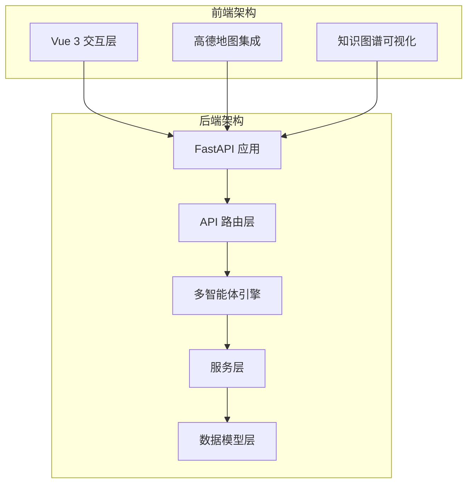
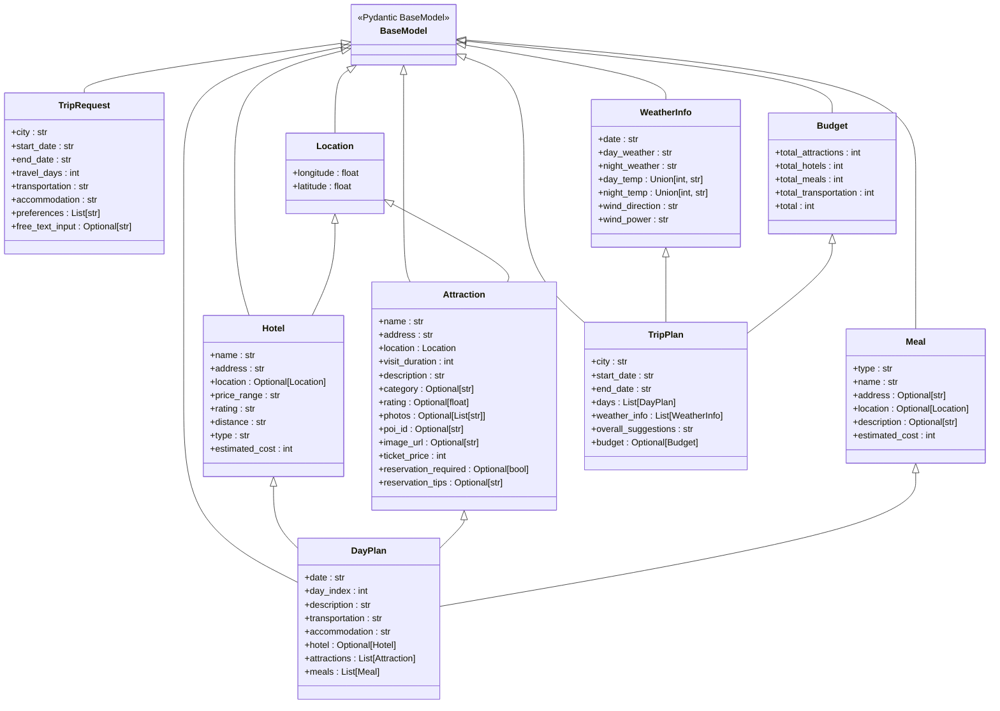
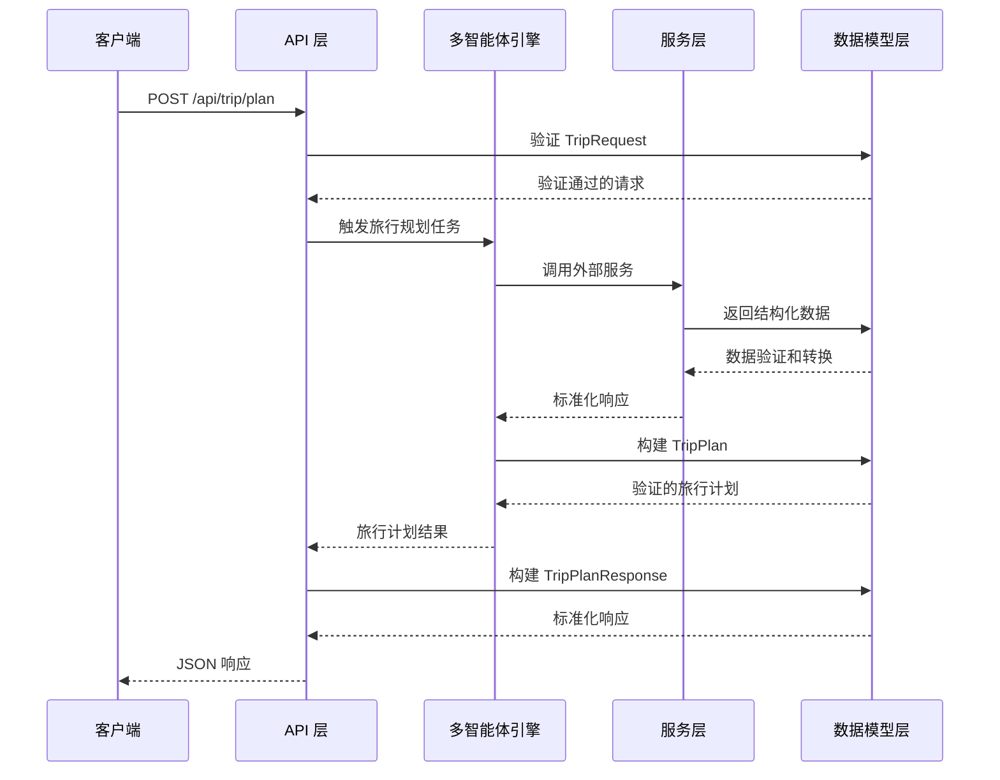
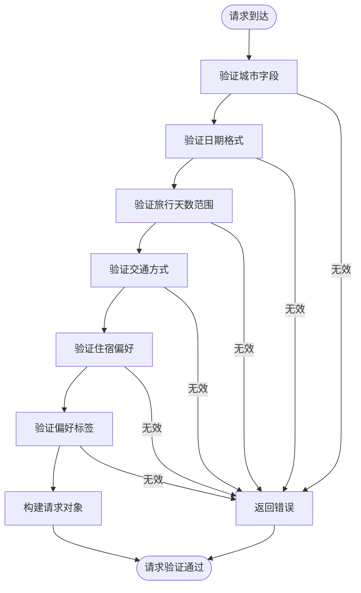
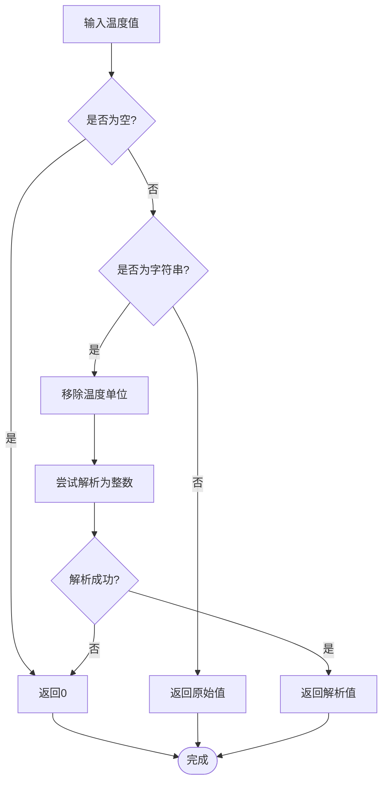
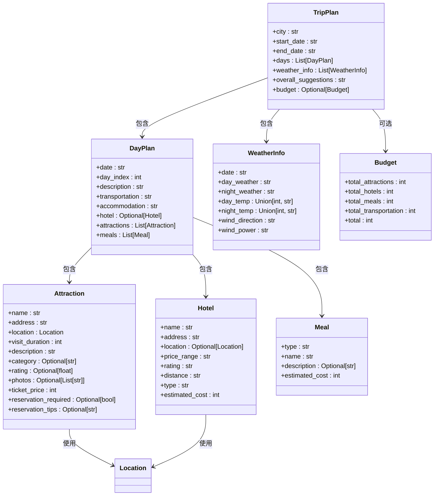
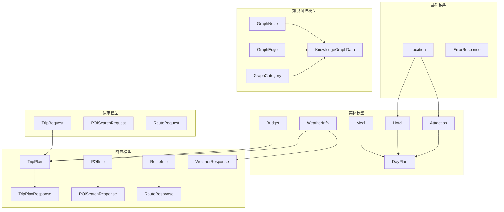

# 数据模型设计

<cite>
**本文档引用的文件**
- [schemas.py](file://backend/app/models/schemas.py)
- [trip.py](file://backend/app/api/routes/trip.py)
- [map.py](file://backend/app/api/routes/map.py)
- [poi.py](file://backend/app/api/routes/poi.py)
- [trip_planner_agent.py](file://backend/app/agents/trip_planner_agent.py)
- [amap_service.py](file://backend/app/services/amap_service.py)
- [main.py](file://backend/app/api/main.py)
- [config.py](file://backend/app/config.py)
- [requirements.txt](file://backend/requirements.txt)
</cite>

## 目录
1. [简介](#简介)
2. [项目结构](#项目结构)
3. [核心数据模型](#核心数据模型)
4. [架构概览](#架构概览)
5. [详细组件分析](#详细组件分析)
6. [依赖关系分析](#依赖关系分析)
7. [性能考量](#性能考量)
8. [故障排除指南](#故障排除指南)
9. [结论](#结论)

## 简介

TripStar 是一个基于 Pydantic 的数据模型架构，采用多智能体协作的方式为用户提供智能化的旅行规划服务。本文档深入分析了基于 Pydantic 的数据模型设计，包括模型的继承关系、复用机制、验证规则、序列化和反序列化机制，以及最佳实践和性能优化策略。

## 项目结构

项目采用前后端分离架构，后端使用 FastAPI 和 Pydantic 构建，前端使用 Vue 3。数据模型主要集中在 `backend/app/models/schemas.py` 文件中，形成了完整的数据传输对象（DTO）体系。

**图表来源**
- [main.py:1-147](file://backend/app/api/main.py#L1-L147)
- [schemas.py:1-264](file://backend/app/models/schemas.py#L1-L264)

**章节来源**
- [main.py:1-147](file://backend/app/api/main.py#L1-L147)
- [requirements.txt:1-18](file://backend/requirements.txt#L1-L18)

## 核心数据模型

### 模型层次结构

数据模型按照功能域进行了清晰的分层设计，形成了完整的继承和组合关系：

**图表来源**
- [schemas.py:10-264](file://backend/app/models/schemas.py#L10-L264)

### 请求模型

请求模型负责接收和验证用户输入的旅行规划请求：

| 模型名称 | 字段 | 类型 | 必填 | 描述 |
|---------|------|------|------|------|
| TripRequest | city | str | ✓ | 目的地城市 |
| TripRequest | start_date | str | ✓ | 开始日期 YYYY-MM-DD |
| TripRequest | end_date | str | ✓ | 结束日期 YYYY-MM-DD |
| TripRequest | travel_days | int | ✓ | 旅行天数 (1-30) |
| TripRequest | transportation | str | ✓ | 交通方式 |
| TripRequest | accommodation | str | ✓ | 住宿偏好 |
| TripRequest | preferences | List[str] | ✗ | 旅行偏好标签 |
| TripRequest | free_text_input | Optional[str] | ✗ | 额外要求 |

### 响应模型

响应模型负责标准化 API 输出格式：

| 模型名称 | 字段 | 类型 | 必填 | 描述 |
|---------|------|------|------|------|
| TripPlanResponse | success | bool | ✓ | 是否成功 |
| TripPlanResponse | message | str | ✓ | 消息 |
| TripPlanResponse | plan_id | Optional[str] | ✗ | 计划ID |
| TripPlanResponse | data | Optional[TripPlan] | ✗ | 旅行计划数据 |
| TripPlanResponse | graph_data | Optional[KnowledgeGraphData] | ✗ | 知识图谱数据 |

**章节来源**
- [schemas.py:10-264](file://backend/app/models/schemas.py#L10-L264)

## 架构概览

数据模型在整个系统中的作用和交互关系如下：

**图表来源**
- [trip.py:281-363](file://backend/app/api/routes/trip.py#L281-L363)
- [trip_planner_agent.py:257-332](file://backend/app/agents/trip_planner_agent.py#L257-L332)

## 详细组件分析

### 旅行请求模型 (TripRequest)

旅行请求模型是整个系统的核心输入模型，负责收集用户的旅行偏好和约束条件。

**图表来源**
- [schemas.py:10-33](file://backend/app/models/schemas.py#L10-L33)

### 天气信息模型 (WeatherInfo)

天气信息模型包含了温度解析的特殊处理逻辑，体现了数据模型的复杂验证需求。

**图表来源**
- [schemas.py:121-134](file://backend/app/models/schemas.py#L121-L134)

### 旅行计划模型 (TripPlan)

旅行计划模型是系统的核心输出模型，包含了完整的旅行规划信息。

**图表来源**
- [schemas.py:99-155](file://backend/app/models/schemas.py#L99-L155)

**章节来源**
- [schemas.py:99-155](file://backend/app/models/schemas.py#L99-L155)

### 知识图谱数据模型

知识图谱数据模型支持旅行计划的可视化展示：

| 模型名称 | 字段 | 类型 | 描述 |
|---------|------|------|------|
| GraphNode | id | str | 节点ID |
| GraphNode | name | str | 节点名称 |
| GraphNode | category | int | 分类索引 |
| GraphNode | symbolSize | int | 节点大小 |
| GraphEdge | source | str | 源节点ID |
| GraphEdge | target | str | 目标节点ID |
| GraphEdge | label | str | 关系标签 |
| GraphCategory | name | str | 分类名称 |
| KnowledgeGraphData | nodes | List[GraphNode] | 节点列表 |
| KnowledgeGraphData | edges | List[GraphEdge] | 边列表 |
| KnowledgeGraphData | categories | List[GraphCategory] | 分类列表 |

**章节来源**
- [schemas.py:159-186](file://backend/app/models/schemas.py#L159-L186)

## 依赖关系分析

数据模型之间的依赖关系体现了系统的模块化设计：

**图表来源**
- [schemas.py:10-264](file://backend/app/models/schemas.py#L10-L264)

**章节来源**
- [schemas.py:10-264](file://backend/app/models/schemas.py#L10-L264)

## 性能考量

### 序列化优化

系统在序列化过程中采用了多种优化策略：

1. **延迟序列化**: 在任务状态持久化时使用 `mode="json"` 参数
2. **条件序列化**: 只在需要时进行模型序列化
3. **缓存机制**: 对频繁使用的数据进行缓存

### 验证性能

数据验证过程的性能优化：

1. **字段级验证**: 使用 Pydantic 的字段级验证器
2. **类型检查**: 在编译时进行类型检查
3. **约束验证**: 使用 `ge`、`le` 等约束减少无效数据传递

### 内存管理

1. **模型实例复用**: 在多智能体环境中复用模型实例
2. **批量处理**: 对大量数据进行批量处理
3. **垃圾回收**: 及时释放不再使用的模型实例

## 故障排除指南

### 常见验证错误

| 错误类型 | 原因 | 解决方案 |
|---------|------|----------|
| 类型错误 | 字段类型不匹配 | 检查字段类型定义 |
| 范围错误 | 数值超出允许范围 | 调整字段约束 |
| 必填字段缺失 | 必填字段为空 | 补充必填字段 |
| 格式错误 | 日期格式不正确 | 使用正确的日期格式 |

### 数据模型扩展

#### 添加新字段

1. **确定字段类型**: 明确新字段的数据类型
2. **设置验证规则**: 添加适当的验证约束
3. **更新序列化逻辑**: 如需自定义序列化，添加相应方法
4. **测试验证**: 确保新字段的验证逻辑正确

#### 修改现有模型

1. **向后兼容性**: 确保新版本与旧版本兼容
2. **迁移策略**: 制定数据迁移计划
3. **测试覆盖**: 更新单元测试和集成测试
4. **文档更新**: 更新相关文档和示例

### 最佳实践

1. **字段命名**: 使用清晰、一致的字段命名规范
2. **类型注解**: 始终提供完整的类型注解
3. **默认值**: 为可选字段提供合理的默认值
4. **文档字符串**: 为每个字段添加详细的文档说明
5. **验证规则**: 使用适当的验证规则确保数据质量
6. **序列化配置**: 根据使用场景配置合适的序列化选项

**章节来源**
- [trip.py:41-46](file://backend/app/api/routes/trip.py#L41-L46)
- [trip_planner_agent.py:650-758](file://backend/app/agents/trip_planner_agent.py#L650-L758)

## 结论

TripStar 的数据模型设计充分体现了现代 Python Web 开发的最佳实践。通过 Pydantic 的强类型系统和自动验证机制，系统实现了数据的完整性保证和类型安全。模型的层次化设计使得代码具有良好的可维护性和扩展性。

系统的设计特点包括：

1. **类型安全**: 完整的类型注解确保了编译时的类型检查
2. **自动验证**: Pydantic 的验证机制减少了手动验证的代码量
3. **灵活扩展**: 模型的继承和组合机制支持灵活的功能扩展
4. **性能优化**: 通过合理的序列化策略和缓存机制提升了性能
5. **错误处理**: 完善的错误处理和验证机制提高了系统的稳定性

这些设计原则为其他类似项目的开发提供了宝贵的参考经验。