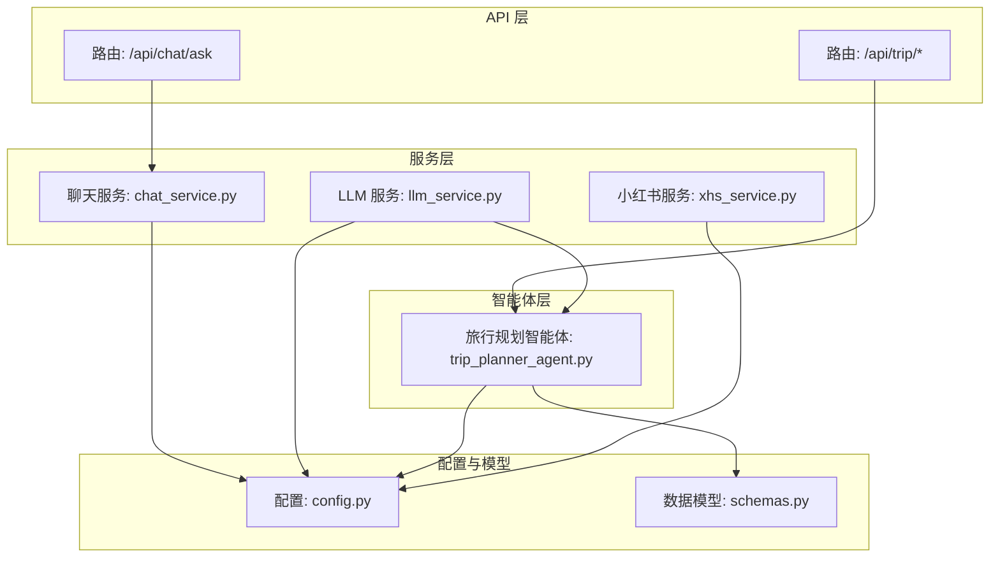
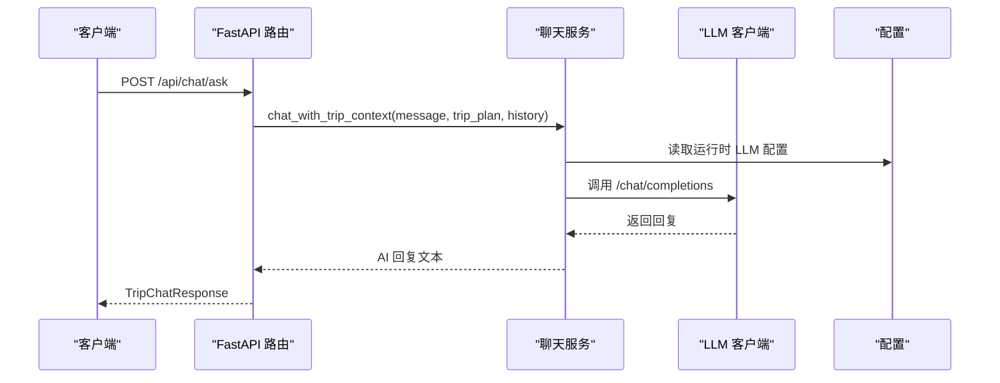
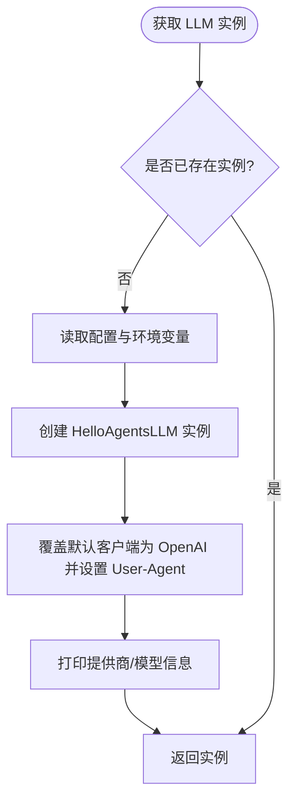
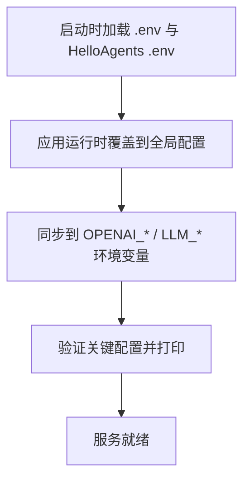
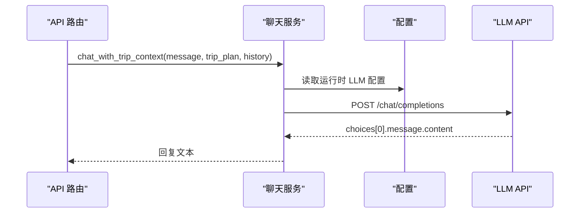
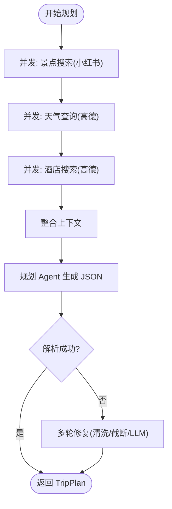
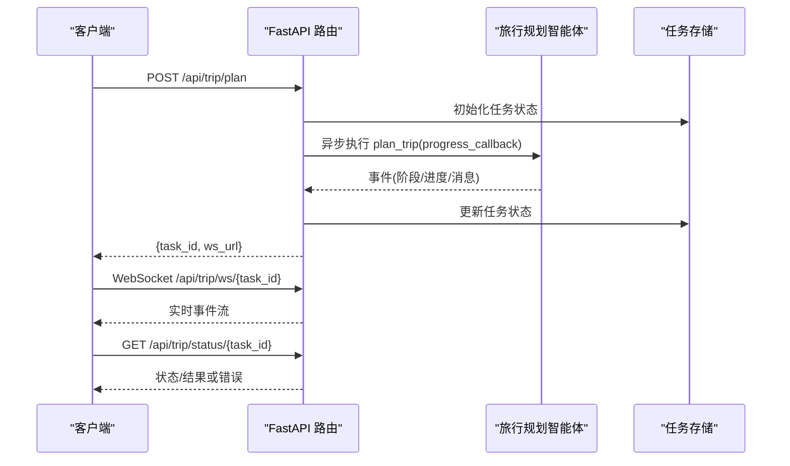
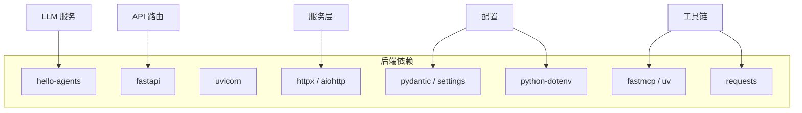

# LLM 服务

<cite>
**本文档引用的文件**
- [llm_service.py](file://backend/app/services/llm_service.py)
- [config.py](file://backend/app/config.py)
- [chat_service.py](file://backend/app/services/chat_service.py)
- [trip_planner_agent.py](file://backend/app/agents/trip_planner_agent.py)
- [schemas.py](file://backend/app/models/schemas.py)
- [chat.py](file://backend/app/api/routes/chat.py)
- [trip.py](file://backend/app/api/routes/trip.py)
- [main.py](file://backend/app/api/main.py)
- [run.py](file://backend/run.py)
- [xhs_service.py](file://backend/app/services/xhs_service.py)
- [requirements.txt](file://backend/requirements.txt)
- [README.md](file://README.md)
</cite>

## 目录
1. [简介](#简介)
2. [项目结构](#项目结构)
3. [核心组件](#核心组件)
4. [架构总览](#架构总览)
5. [详细组件分析](#详细组件分析)
6. [依赖分析](#依赖分析)
7. [性能考量](#性能考量)
8. [故障排查指南](#故障排查指南)
9. [结论](#结论)
10. [附录](#附录)

## 简介
本文件聚焦后端 LLM 服务模块，系统性阐述大语言模型的集成与使用机制，涵盖模型初始化、参数配置、推理调用、提示词工程最佳实践、性能优化策略、错误处理与重试机制，以及完整的 API 使用示例与调优建议。项目基于 HelloAgents 框架与 FastAPI，支持 OpenAI 兼容 API 与本地/第三方中转服务，提供多智能体旅行规划与上下文问答能力。

## 项目结构
后端采用分层架构：API 层负责路由与协议（WebSocket/轮询），服务层封装业务逻辑（LLM、小红书、知识图谱），模型层定义数据结构，配置层统一管理运行时参数与环境变量。

图表来源
- [main.py:1-147](file://backend/app/api/main.py#L1-L147)
- [chat.py:1-53](file://backend/app/api/routes/chat.py#L1-L53)
- [trip.py:1-511](file://backend/app/api/routes/trip.py#L1-L511)
- [llm_service.py:1-75](file://backend/app/services/llm_service.py#L1-L75)
- [chat_service.py:1-133](file://backend/app/services/chat_service.py#L1-L133)
- [trip_planner_agent.py:1-826](file://backend/app/agents/trip_planner_agent.py#L1-L826)
- [config.py:1-202](file://backend/app/config.py#L1-L202)
- [schemas.py:1-264](file://backend/app/models/schemas.py#L1-L264)
- [xhs_service.py:1-444](file://backend/app/services/xhs_service.py#L1-L444)

章节来源
- [main.py:1-147](file://backend/app/api/main.py#L1-L147)
- [README.md:43-97](file://README.md#L43-L97)

## 核心组件
- LLM 服务封装：提供单例模式的 LLM 实例，自动合并环境变量与运行时配置，支持第三方中转 API 的浏览器 UA 伪装，确保稳定访问。
- 配置管理：集中管理应用、CORS、高德地图、小红书与 LLM 的运行时参数，支持 .env 与容器环境变量，提供运行时覆盖与持久化。
- 聊天服务：基于 HTTP 直连 OpenAI 兼容 API，将旅行计划作为上下文注入，实现针对行程的智能问答。
- 旅行规划智能体：多智能体协作（天气、酒店、小红书景点），并发优化与 JSON 输出修复，支持超时重试与降级方案。
- API 路由：提供旅行规划任务提交、WebSocket 实时订阅、历史查询与健康检查；聊天问答路由提供上下文问答。

章节来源
- [llm_service.py:12-75](file://backend/app/services/llm_service.py#L12-L75)
- [config.py:21-131](file://backend/app/config.py#L21-L131)
- [chat_service.py:65-133](file://backend/app/services/chat_service.py#L65-L133)
- [trip_planner_agent.py:173-388](file://backend/app/agents/trip_planner_agent.py#L173-L388)
- [chat.py:10-53](file://backend/app/api/routes/chat.py#L10-L53)
- [trip.py:276-488](file://backend/app/api/routes/trip.py#L276-L488)

## 架构总览
LLM 服务贯穿三层：配置层提供参数来源，服务层封装 LLM 调用与上下文注入，API 层对外暴露 REST/WebSocket 接口。多智能体在智能体层协调外部工具（高德、小红书）与 LLM，形成闭环。

图表来源
- [chat.py:16-52](file://backend/app/api/routes/chat.py#L16-L52)
- [chat_service.py:65-133](file://backend/app/services/chat_service.py#L65-L133)
- [config.py:21-131](file://backend/app/config.py#L21-L131)

## 详细组件分析

### LLM 服务封装（单例与参数合并）
- 单例模式：首次调用时创建实例，后续复用，避免重复初始化。
- 参数来源优先级：配置类字段 > 环境变量（OPENAI_* 与 LLM_* 别名）> 默认值。
- 超时与模型：支持通过环境变量设置超时；模型 ID 支持 gpt-4 等默认值。
- 浏览器 UA 伪装：针对第三方中转 API 的 WAF/Cloudflare 拦截，覆盖底层 OpenAI 客户端的默认请求头，提升稳定性。

图表来源
- [llm_service.py:12-75](file://backend/app/services/llm_service.py#L12-L75)

章节来源
- [llm_service.py:12-75](file://backend/app/services/llm_service.py#L12-L75)

### 配置管理（Settings 与运行时覆盖）
- 配置类：集中定义应用、服务器、CORS、高德地图、小红书、LLM 等参数，支持别名映射（OPENAI_* 与 LLM_*）。
- 运行时覆盖：支持将前端设置页的变更持久化到 runtime_settings.json，并同步到环境变量，兼容第三方组件读取。
- 配置校验：打印配置并输出必要项缺失的警告，便于快速定位问题。

图表来源
- [config.py:11-131](file://backend/app/config.py#L11-L131)
- [config.py:146-180](file://backend/app/config.py#L146-L180)

章节来源
- [config.py:21-131](file://backend/app/config.py#L21-L131)
- [config.py:146-180](file://backend/app/config.py#L146-L180)

### 聊天服务（上下文问答）
- 系统提示词：强调基于旅行计划的精准回答，控制长度与语气。
- 上下文注入：将当前旅行计划 JSON 作为上下文注入 messages，支持历史对话追加。
- 直连 LLM：构造 /chat/completions 请求，支持运行时配置热更新（前端设置页即时生效）。
- 错误处理：HTTP 状态错误、超时、未知异常分别返回友好提示。

图表来源
- [chat.py:16-52](file://backend/app/api/routes/chat.py#L16-L52)
- [chat_service.py:65-133](file://backend/app/services/chat_service.py#L65-L133)

章节来源
- [chat_service.py:14-26](file://backend/app/services/chat_service.py#L14-L26)
- [chat_service.py:65-133](file://backend/app/services/chat_service.py#L65-L133)
- [chat.py:16-52](file://backend/app/api/routes/chat.py#L16-L52)

### 旅行规划智能体（多智能体与 JSON 修复）
- 多智能体编排：天气、酒店 Agent 通过 MCP 工具链接入高德；景点通过小红书服务获取；最终由规划 Agent 生成结构化 JSON。
- 并发优化：步骤1-3（景点/天气/酒店）并发执行，缩短总耗时；步骤4（整合）串行依赖前三步结果。
- 超时与重试：规划阶段使用更长超时并在超时后重试一次，补充“保守建议补齐”的提示。
- JSON 输出修复：多轮清洗（去注释、修复算术表达式、引号转义、截断修复、LLM 自修复），确保最终可解析为 TripPlan。

图表来源
- [trip_planner_agent.py:257-338](file://backend/app/agents/trip_planner_agent.py#L257-L338)
- [trip_planner_agent.py:354-388](file://backend/app/agents/trip_planner_agent.py#L354-L388)
- [trip_planner_agent.py:424-650](file://backend/app/agents/trip_planner_agent.py#L424-L650)

章节来源
- [trip_planner_agent.py:173-242](file://backend/app/agents/trip_planner_agent.py#L173-L242)
- [trip_planner_agent.py:257-338](file://backend/app/agents/trip_planner_agent.py#L257-L338)
- [trip_planner_agent.py:354-388](file://backend/app/agents/trip_planner_agent.py#L354-L388)
- [trip_planner_agent.py:424-650](file://backend/app/agents/trip_planner_agent.py#L424-L650)

### API 路由与任务系统
- 旅行规划：POST /api/trip/plan 立即返回 task_id，后台异步执行；WebSocket /api/trip/ws/{task_id} 实时推送进度；轮询 /api/trip/status/{task_id} 获取结果。
- 历史查询：/api/trip/history 返回最近完成的计划摘要。
- 健康检查：/api/trip/health 检查智能体与工具可用性。
- 聊天问答：/api/chat/ask 接收 TripChatRequest，返回 TripChatResponse。

图表来源
- [trip.py:276-488](file://backend/app/api/routes/trip.py#L276-L488)

章节来源
- [trip.py:276-488](file://backend/app/api/routes/trip.py#L276-L488)
- [chat.py:10-53](file://backend/app/api/routes/chat.py#L10-L53)

## 依赖分析
- 核心依赖：hello-agents、fastapi、uvicorn、pydantic、pydantic-settings、httpx、aiohttp、python-dotenv、fastmcp、uv、requests 等。
- LLM 适配：通过 HelloAgentsLLM 统一封装，底层可对接 OpenAI 兼容 API 或第三方中转服务；聊天服务直接使用 httpx 调用 /chat/completions。
- 工具链：MCP 工具链连接高德地图服务；小红书服务通过本地 JS 签名直连原生 API，规避风控。

图表来源
- [requirements.txt:1-18](file://backend/requirements.txt#L1-L18)
- [llm_service.py:3-6](file://backend/app/services/llm_service.py#L3-L6)
- [trip_planner_agent.py:7-11](file://backend/app/agents/trip_planner_agent.py#L7-L11)
- [xhs_service.py:14-17](file://backend/app/services/xhs_service.py#L14-L17)

章节来源
- [requirements.txt:1-18](file://backend/requirements.txt#L1-L18)
- [llm_service.py:3-6](file://backend/app/services/llm_service.py#L3-L6)
- [trip_planner_agent.py:7-11](file://backend/app/agents/trip_planner_agent.py#L7-L11)
- [xhs_service.py:14-17](file://backend/app/services/xhs_service.py#L14-L17)

## 性能考量
- 并发与流水线：旅行规划中步骤1-3并发执行，显著降低端到端时延；步骤4串行整合，避免资源竞争。
- 超时与重试：规划阶段使用更长超时并在超时后重试一次，减少因网络抖动导致的失败。
- JSON 修复：多轮清洗与截断修复，降低因模型输出不规范导致的解析失败成本。
- 运行时配置热更新：前端设置页修改 LLM 参数后，聊天服务按请求实时读取，无需重启服务。
- 任务持久化：旅行规划任务状态持久化到 JSON 文件，服务重启后可恢复（处理中任务标记失败，避免前端无限等待）。

章节来源
- [trip_planner_agent.py:257-338](file://backend/app/agents/trip_planner_agent.py#L257-L338)
- [trip_planner_agent.py:354-388](file://backend/app/agents/trip_planner_agent.py#L354-L388)
- [trip.py:82-123](file://backend/app/api/routes/trip.py#L82-L123)
- [chat_service.py:28-57](file://backend/app/services/chat_service.py#L28-L57)

## 故障排查指南
- LLM API Key 未配置：配置校验会输出警告；聊天服务在运行时检测到空 API Key 时返回提示。
- 第三方中转 API 被拦截：LLM 服务已覆盖默认 UA，若仍失败，检查 base_url 与网络策略。
- 旅行规划超时：规划阶段已内置超时重试；若仍失败，检查模型能力与网络质量。
- JSON 解析失败：多轮修复策略（清洗、截断修复、LLM 自修复）逐步尝试；若仍失败，检查提示词约束与模型输出稳定性。
- 小红书 Cookie 过期：小红书服务抛出特定异常，API 层将其包装为前端可读的错误消息。
- 任务状态异常：任务持久化文件损坏或格式不符时，服务会记录告警并跳过；检查 data/trip_tasks 目录权限与磁盘空间。

章节来源
- [config.py:162-180](file://backend/app/config.py#L162-L180)
- [llm_service.py:51-61](file://backend/app/services/llm_service.py#L51-L61)
- [trip_planner_agent.py:354-388](file://backend/app/agents/trip_planner_agent.py#L354-L388)
- [trip_planner_agent.py:604-650](file://backend/app/agents/trip_planner_agent.py#L604-L650)
- [xhs_service.py:22-25](file://backend/app/services/xhs_service.py#L22-L25)
- [trip.py:369-387](file://backend/app/api/routes/trip.py#L369-L387)

## 结论
本 LLM 服务模块以配置为中心、以单例 LLM 客户端为枢纽，结合多智能体与工具链，实现了从旅行规划到上下文问答的完整闭环。通过运行时覆盖、并发优化、多轮 JSON 修复与任务持久化，系统在稳定性、性能与可维护性方面达到良好平衡。建议在生产环境中配合容器化部署与可观测性监控，持续优化提示词与工具链配置。

## 附录

### 提示词工程最佳实践
- 明确角色与约束：为每个 Agent 设计清晰的角色与输出格式约束，避免模型自由发挥导致结构化输出困难。
- 上下文注入：在聊天服务中将旅行计划 JSON 作为上下文注入，确保回答基于真实数据。
- 输出格式控制：在规划 Agent 的提示词中严格限定 JSON 字段类型与约束（如预算字段必须为纯数字），并在解析阶段进行二次修复。
- 降级与兜底：在解析失败时启用 LLM 自修复或回退到备用计划，保障用户体验。

章节来源
- [trip_planner_agent.py:15-170](file://backend/app/agents/trip_planner_agent.py#L15-L170)
- [trip_planner_agent.py:604-650](file://backend/app/agents/trip_planner_agent.py#L604-L650)
- [chat_service.py:14-26](file://backend/app/services/chat_service.py#L14-L26)

### 性能优化策略
- 并发执行：步骤1-3并发，缩短总时延。
- 超时与重试：规划阶段更长超时与一次重试，提升成功率。
- JSON 修复：多轮清洗与截断修复，降低解析失败成本。
- 运行时配置热更新：前端设置页即时生效，无需重启服务。
- 任务持久化：服务重启后可恢复已完成任务，处理中任务标记失败避免前端阻塞。

章节来源
- [trip_planner_agent.py:257-338](file://backend/app/agents/trip_planner_agent.py#L257-L338)
- [trip_planner_agent.py:354-388](file://backend/app/agents/trip_planner_agent.py#L354-L388)
- [trip.py:82-123](file://backend/app/api/routes/trip.py#L82-L123)
- [chat_service.py:28-57](file://backend/app/services/chat_service.py#L28-L57)

### 错误处理与重试机制
- HTTP 错误：捕获状态码错误并返回友好提示。
- 超时处理：聊天服务与规划阶段分别设置超时与重试策略。
- JSON 解析：多轮修复与 LLM 自修复，确保最终可解析。
- 任务状态：持久化失败时记录告警并跳过，避免影响其他任务。

章节来源
- [chat_service.py:124-133](file://backend/app/services/chat_service.py#L124-L133)
- [trip_planner_agent.py:354-388](file://backend/app/agents/trip_planner_agent.py#L354-L388)
- [trip_planner_agent.py:604-650](file://backend/app/agents/trip_planner_agent.py#L604-L650)
- [trip.py:102-123](file://backend/app/api/routes/trip.py#L102-L123)

### API 使用示例与调优建议
- 旅行规划任务
  - 提交任务：POST /api/trip/plan，接收 {task_id, ws_url}。
  - 实时订阅：WebSocket /api/trip/ws/{task_id} 获取进度事件。
  - 轮询查询：GET /api/trip/status/{task_id} 获取状态与结果。
  - 历史查询：GET /api/trip/history?limit=N。
  - 健康检查：GET /api/trip/health。
- 上下文问答
  - POST /api/chat/ask，请求体包含 message、trip_plan（dict）、history（可选）。
  - 返回 TripChatResponse，包含 success 与 reply。
- 调优建议
  - 选择具备结构化输出能力的模型（如 gpt-4 等）。
  - 合理设置超时与温度参数，兼顾稳定性与创造性。
  - 在第三方中转 API 环境下启用浏览器 UA 伪装。
  - 通过前端设置页热更新 LLM 参数，快速验证效果。

章节来源
- [trip.py:276-488](file://backend/app/api/routes/trip.py#L276-L488)
- [chat.py:16-52](file://backend/app/api/routes/chat.py#L16-L52)
- [schemas.py:253-264](file://backend/app/models/schemas.py#L253-L264)