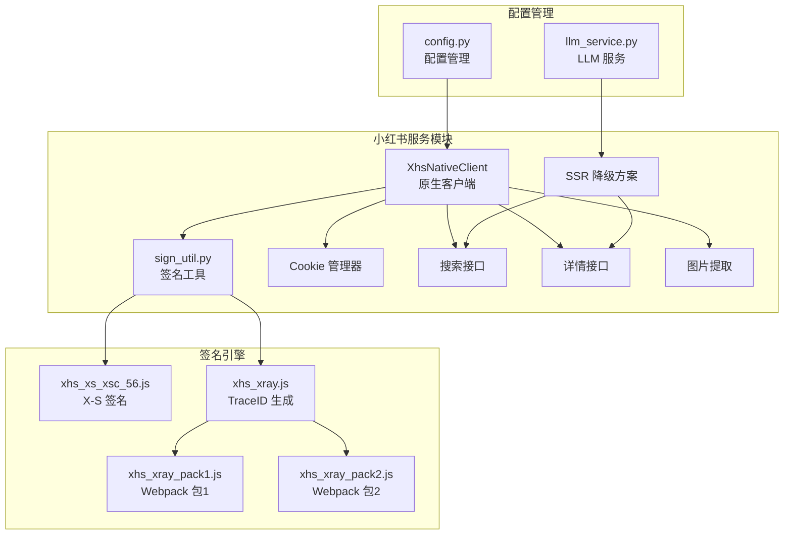
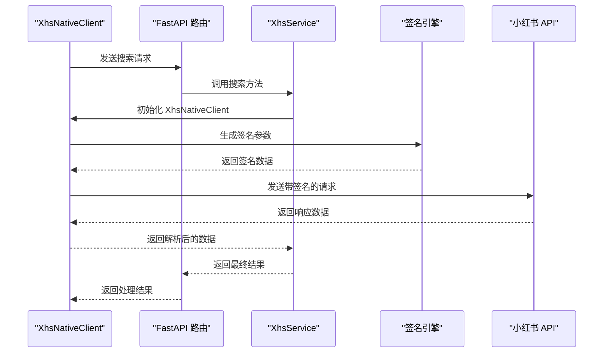
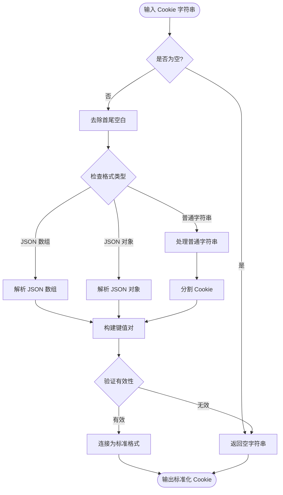
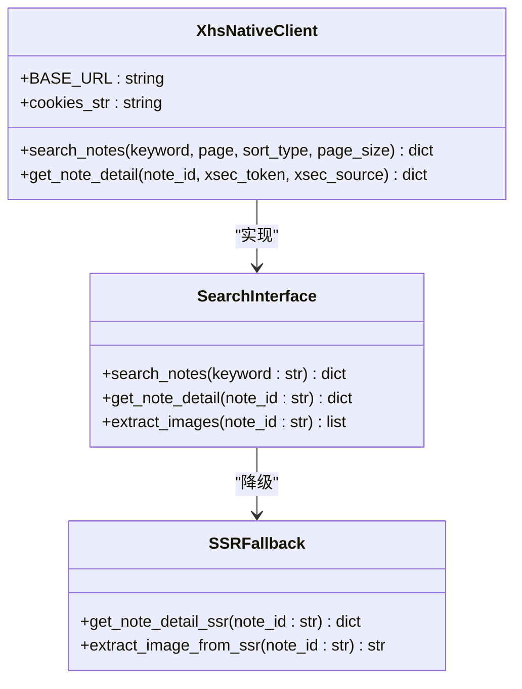
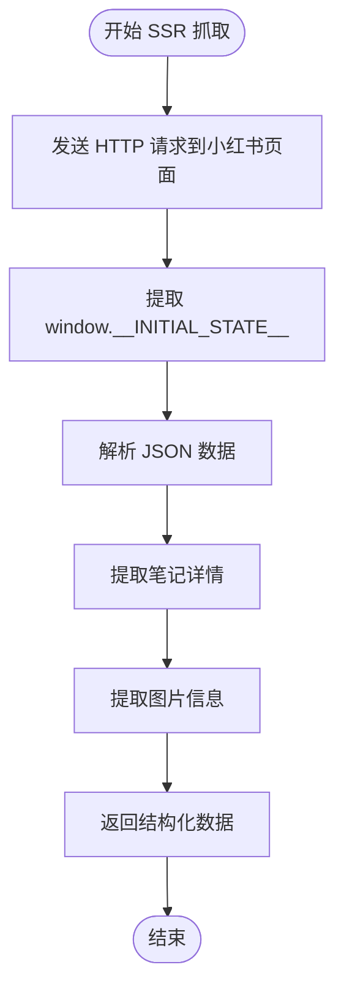
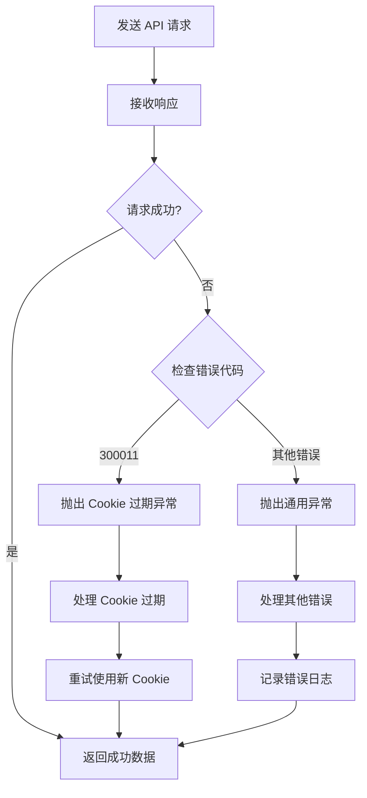
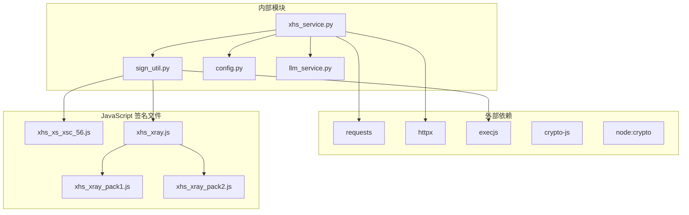

# 小红书服务

<cite>
**本文档引用的文件**
- [xhs_service.py](file://backend/app/services/xhs_service.py)
- [sign_util.py](file://backend/app/services/xhs_sign/sign_util.py)
- [xhs_xray.js](file://backend/app/services/xhs_sign/xhs_xray.js)
- [xhs_xs_xsc_56.js](file://backend/app/services/xhs_sign/xhs_xs_xsc_56.js)
- [xhs_xray_pack1.js](file://backend/app/services/xhs_sign/xhs_xray_pack1.js)
- [xhs_xray_pack2.js](file://backend/app/services/xhs_sign/xhs_xray_pack2.js)
- [config.py](file://backend/app/config.py)
- [llm_service.py](file://backend/app/services/llm_service.py)
- [trip.py](file://backend/app/api/routes/trip.py)
</cite>

## 目录
1. [简介](#简介)
2. [项目结构](#项目结构)
3. [核心组件](#核心组件)
4. [架构概览](#架构概览)
5. [详细组件分析](#详细组件分析)
6. [依赖关系分析](#依赖关系分析)
7. [性能考虑](#性能考虑)
8. [故障排除指南](#故障排除指南)
9. [结论](#结论)

## 简介

小红书服务模块是一个基于 Spider_XHS 原生签名引擎的完整解决方案，旨在替代第三方 xhs 库，通过本地 JavaScript 签名和直连 edith.xiaohongshu.com API 来解决 300011 账号异常风控误杀问题。该模块提供了小红书搜索接口、笔记详情获取、图片提取等功能，并实现了完整的 Cookie 管理机制和 SSR 降级方案。

## 项目结构

小红书服务模块位于后端应用的服务层，采用模块化设计，主要包含以下组件：



**图表来源**
- [xhs_service.py:1-444](file://backend/app/services/xhs_service.py#L1-L444)
- [sign_util.py:1-149](file://backend/app/services/xhs_sign/sign_util.py#L1-L149)

**章节来源**
- [xhs_service.py:1-444](file://backend/app/services/xhs_service.py#L1-L444)
- [config.py:1-202](file://backend/app/config.py#L1-L202)

## 核心组件

### XhsNativeClient 类

XhsNativeClient 是小红书服务的核心客户端类，负责与小红书 API 进行交互。它完全绕过了第三方 xhs 库，通过 PyExecJS 调用本地 JavaScript 签名引擎来生成必要的请求头。

**主要功能特性：**
- 直连 edith.xiaohongshu.com API
- 基于 Spider_XHS 签名引擎的本地签名
- 完整的 Cookie 处理机制
- 支持多种排序类型的笔记搜索
- 笔记详情获取和图片提取

### 签名引擎系统

签名引擎系统是整个模块的技术核心，包含两个主要的 JavaScript 签名脚本：

1. **xhs_xs_xsc_56.js**: 生成 x-s、x-t、x-s-common 等核心请求头字段
2. **xhs_xray.js**: 生成 x-b3-traceid 和 x-xray-traceid

这些脚本通过 PyExecJS 在 Python 环境中执行，模拟浏览器环境来生成符合小红书 API 要求的签名。

**章节来源**
- [xhs_service.py:68-143](file://backend/app/services/xhs_service.py#L68-L143)
- [sign_util.py:1-149](file://backend/app/services/xhs_sign/sign_util.py#L1-L149)

## 架构概览

小红书服务模块采用了分层架构设计，确保了良好的可维护性和扩展性：



**图表来源**
- [xhs_service.py:247-354](file://backend/app/services/xhs_service.py#L247-L354)
- [trip.py:315-388](file://backend/app/api/routes/trip.py#L315-L388)

## 详细组件分析

### Cookie 管理机制

Cookie 管理是小红书服务的关键组成部分，负责处理各种格式的 Cookie 输入并转换为标准格式。

#### Cookie 格式兼容处理

系统支持多种 Cookie 输入格式：

1. **标准请求头格式**: `"a1=xxxx; webId=yyyy; sid=zzzz"`
2. **浏览器导出的 JSON 格式**: 
   ```json
   [{"name": "a1", "value": "xxxx"}, {"name": "webId", "value": "yyyy"}]
   ```
3. **单个 Cookie 字符串**: `"a1=xxxx"`

#### Cookie 处理流程



**图表来源**
- [xhs_service.py:29-63](file://backend/app/services/xhs_service.py#L29-L63)

**章节来源**
- [xhs_service.py:29-63](file://backend/app/services/xhs_service.py#L29-L63)

### 签名生成机制

签名生成机制是小红书服务的核心技术，通过 JavaScript 引擎生成符合小红书 API 要求的请求头。

#### 签名参数生成流程

```mermaid
flowchart TD
Input[输入: API 路径, 数据, 方法] --> GetA1["从 Cookie 中提取 a1"]
GetA1 --> CallXS["调用 xhs_xs_xsc_56.js 生成签名"]
CallXS --> GenerateHeaders["生成基础请求头模板"]
GenerateHeaders --> AddSignatures["添加 x-s, x-t, x-s-common"]
AddSignatures --> GenerateTraceIDs["生成 TraceID"]
GenerateTraceIDs --> SerializeData["序列化请求数据"]
SerializeData --> Output[输出: (headers, cookies, data)]
```

**图表来源**
- [sign_util.py:74-138](file://backend/app/services/xhs_sign/sign_util.py#L74-L138)

#### 签名引擎工作原理

签名引擎通过以下步骤工作：

1. **环境补全**: 模拟浏览器环境，包括 navigator、location、storage 等对象
2. **依赖加载**: 动态加载 webpack 打包的依赖文件
3. **签名计算**: 使用加密算法生成 x-s、x-t、x-s-common 字段
4. **TraceID 生成**: 生成 x-b3-traceid 和 x-xray-traceid

**章节来源**
- [sign_util.py:1-149](file://backend/app/services/xhs_sign/sign_util.py#L1-L149)
- [xhs_xs_xsc_56.js:1-282](file://backend/app/services/xhs_sign/xhs_xs_xsc_56.js#L1-L282)

### 搜索接口实现

搜索接口提供了多种搜索功能，包括笔记搜索、详情获取和图片提取。

#### 搜索功能架构



**图表来源**
- [xhs_service.py:68-187](file://backend/app/services/xhs_service.py#L68-L187)

#### 搜索参数优化

系统支持多种排序类型和过滤条件：

| 排序类型 | 数值 | 描述 |
|---------|------|------|
| 综合 | 0 | 默认综合排序 |
| 最新 | 1 | 按发布时间排序 |
| 最多点赞 | 2 | 按点赞数排序 |
| 最多评论 | 3 | 按评论数排序 |
| 最多收藏 | 4 | 按收藏数排序 |

**章节来源**
- [xhs_service.py:79-143](file://backend/app/services/xhs_service.py#L79-L143)

### SSR 降级方案

当原生 API 访问失败时，系统提供 SSR 降级方案，通过网页抓取的方式获取数据。

#### SSR 抓取流程



**图表来源**
- [xhs_service.py:228-242](file://backend/app/services/xhs_service.py#L228-L242)

**章节来源**
- [xhs_service.py:226-242](file://backend/app/services/xhs_service.py#L226-L242)

### 错误处理机制

系统实现了完善的错误处理机制，包括 Cookie 过期检测和异常恢复。

#### 错误处理流程



**图表来源**
- [xhs_service.py:134-141](file://backend/app/services/xhs_service.py#L134-L141)

**章节来源**
- [xhs_service.py:22-24](file://backend/app/services/xhs_service.py#L22-L24)
- [xhs_service.py:134-141](file://backend/app/services/xhs_service.py#L134-L141)

## 依赖关系分析

小红书服务模块的依赖关系清晰明确，遵循了单一职责原则：



**图表来源**
- [xhs_service.py:7-17](file://backend/app/services/xhs_service.py#L7-L17)
- [sign_util.py:7-14](file://backend/app/services/xhs_sign/sign_util.py#L7-L14)

**章节来源**
- [xhs_service.py:7-17](file://backend/app/services/xhs_service.py#L7-L17)
- [sign_util.py:7-14](file://backend/app/services/xhs_sign/sign_util.py#L7-L14)

## 性能考虑

小红书服务模块在设计时充分考虑了性能优化：

### 缓存策略
- JavaScript 签名引擎初始化后保持常驻内存
- Cookie 解析结果进行缓存
- API 响应数据进行适当的缓存

### 异步处理
- 图片搜索支持异步调用
- SSR 抓取使用异步 HTTP 客户端
- 大量数据处理采用流式处理

### 超时控制
- API 请求设置合理的超时时间
- JavaScript 执行设置超时保护
- 网络请求具备重试机制

## 故障排除指南

### 常见问题及解决方案

#### 1. Cookie 过期问题
**症状**: 请求返回 300011 错误代码
**解决方案**: 
- 更新有效的 Cookie
- 检查 Cookie 格式是否正确
- 确认 Cookie 未过期

#### 2. 签名生成失败
**症状**: JavaScript 执行异常
**解决方案**:
- 检查 Node.js 环境
- 验证签名脚本完整性
- 确认依赖文件存在

#### 3. API 访问超时
**症状**: 请求超时或响应缓慢
**解决方案**:
- 检查网络连接
- 调整超时参数
- 使用 SSR 降级方案

#### 4. 数据解析错误
**症状**: JSON 解析失败
**解决方案**:
- 检查响应格式
- 验证数据完整性
- 实施数据清洗

**章节来源**
- [xhs_service.py:22-24](file://backend/app/services/xhs_service.py#L22-L24)
- [xhs_service.py:290-296](file://backend/app/services/xhs_service.py#L290-L296)

## 结论

小红书服务模块通过创新的签名引擎集成和完整的降级机制，成功解决了小红书 API 访问的技术挑战。该模块具有以下优势：

1. **技术先进性**: 使用 Spider_XHS 原生签名引擎，绕过第三方库限制
2. **可靠性强**: 实现了完整的错误处理和降级机制
3. **扩展性好**: 模块化设计便于功能扩展和维护
4. **性能优化**: 采用多种优化策略提升系统性能

该模块为旅行规划系统提供了强大的内容获取能力，能够有效地从小红书平台获取高质量的旅游相关内容，为用户提供更好的旅行体验。