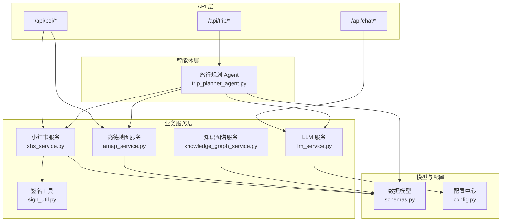
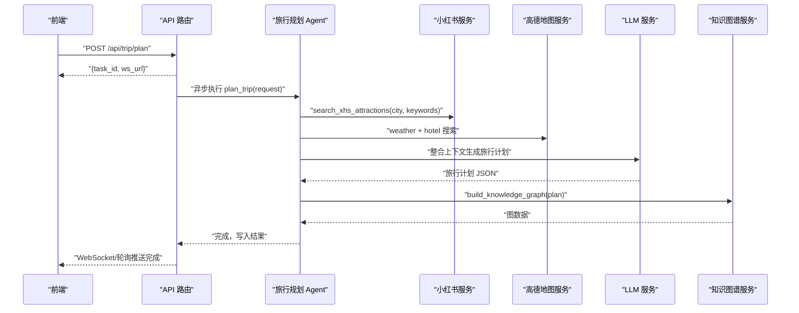
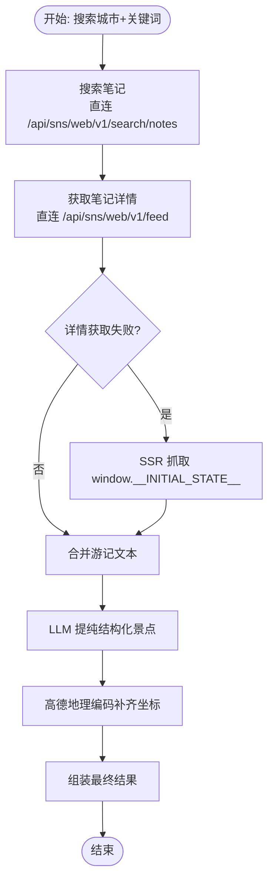
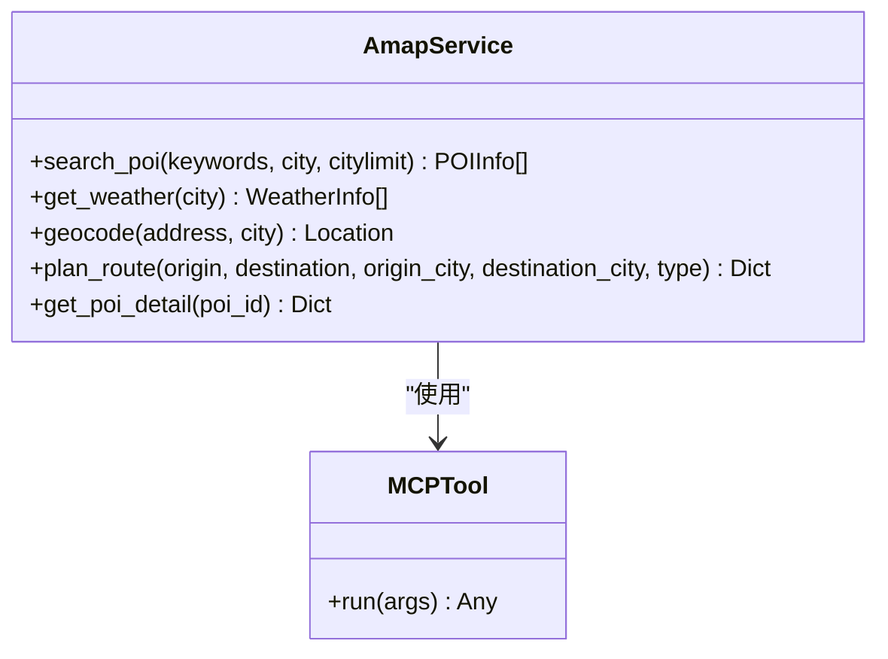
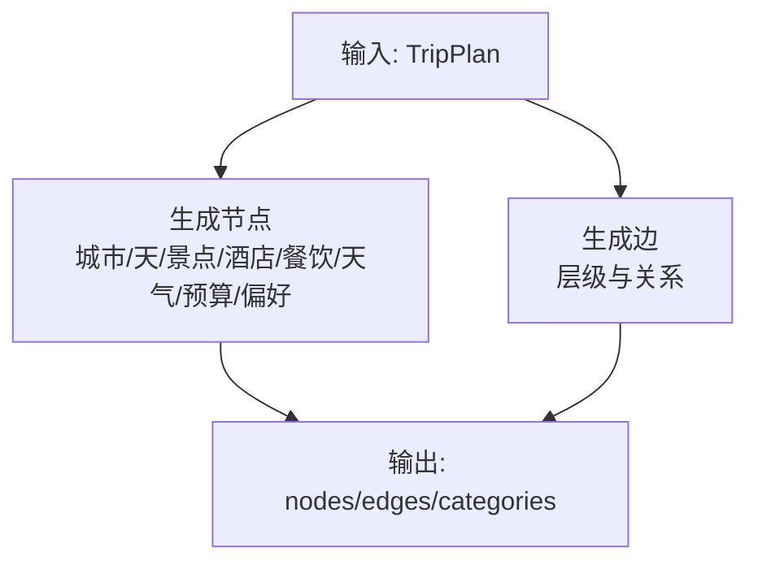
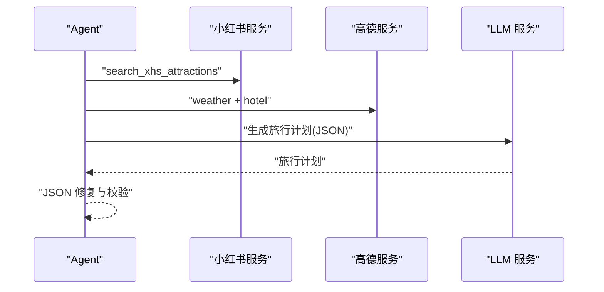
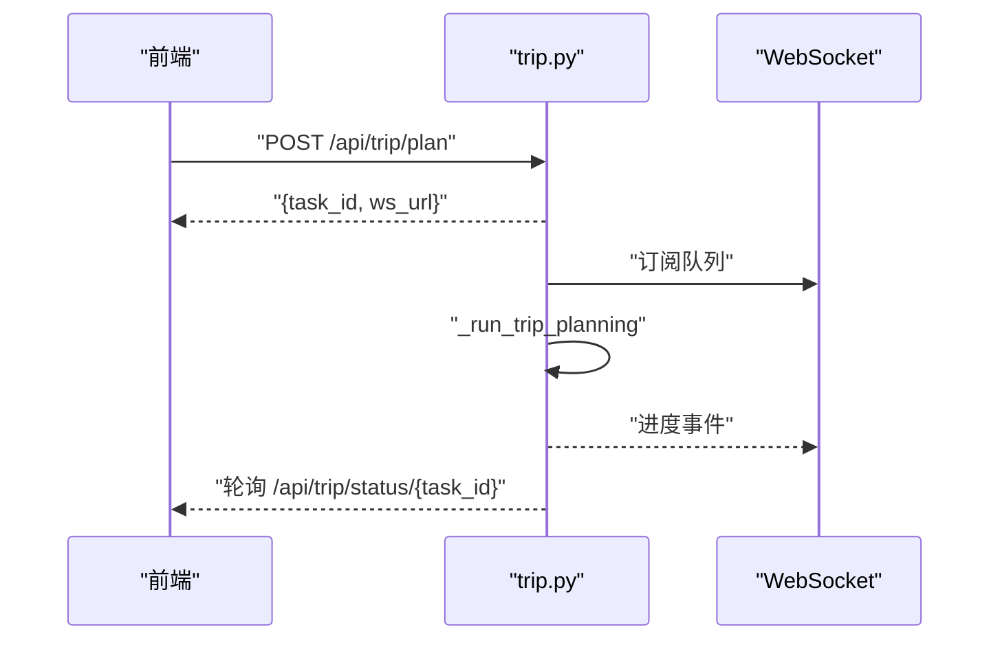
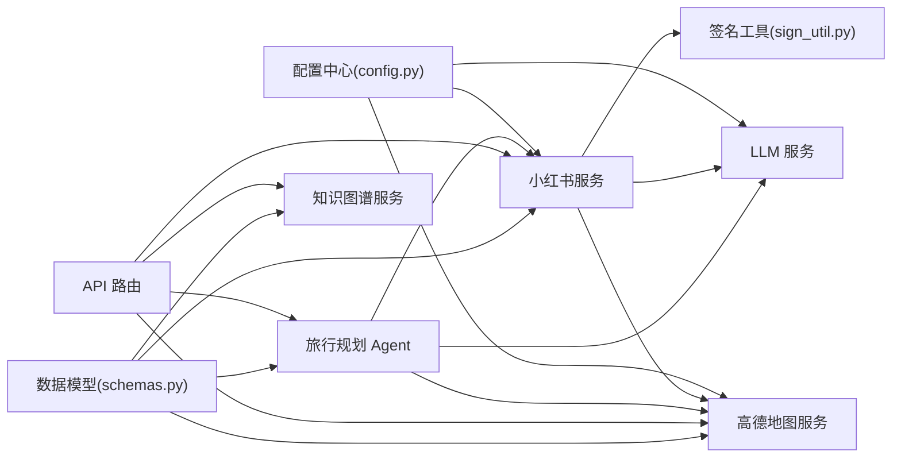

# 服务层设计

<cite>
**本文引用的文件**
- [README.md](file://README.md)
- [run.py](file://run.py)
- [app/api/main.py](file://app/api/main.py)
- [app/api/routes/trip.py](file://app/api/routes/trip.py)
- [app/api/routes/poi.py](file://app/api/routes/poi.py)
- [app/api/routes/chat.py](file://app/api/routes/chat.py)
- [app/agents/trip_planner_agent.py](file://app/agents/trip_planner_agent.py)
- [app/services/xhs_service.py](file://app/services/xhs_service.py)
- [app/services/xhs_sign/sign_util.py](file://app/services/xhs_sign/sign_util.py)
- [app/services/amap_service.py](file://app/services/amap_service.py)
- [app/services/knowledge_graph_service.py](file://app/services/knowledge_graph_service.py)
- [app/services/llm_service.py](file://app/services/llm_service.py)
- [app/models/schemas.py](file://app/models/schemas.py)
- [app/config.py](file://app/config.py)
</cite>

## 目录
1. [简介](#简介)
2. [项目结构](#项目结构)
3. [核心组件](#核心组件)
4. [架构总览](#架构总览)
5. [详细组件分析](#详细组件分析)
6. [依赖分析](#依赖分析)
7. [性能考量](#性能考量)
8. [故障排查指南](#故障排查指南)
9. [结论](#结论)
10. [附录](#附录)

## 简介
本文件面向 TripStar 服务层，系统化梳理后端服务层的设计与实现，重点覆盖以下方面：
- 服务层架构与职责划分：服务抽象层次、依赖关系与协作机制
- 各服务模块功能实现：小红书服务的数据抓取与处理、高德地图服务的地理编码与路线计算、知识图谱服务的数据构建与可视化、LLM 服务的智能问答与内容生成
- 服务间协作与数据流转：多智能体 Agent 的编排、服务组合使用与状态管理
- 扩展与优化：新增服务模块与现有服务优化策略
- 错误处理与重试机制、性能监控与调优方法

## 项目结构
后端采用前后端分离架构，服务层位于 Python FastAPI 层，围绕多智能体与外部服务集成，形成清晰的分层：
- API 层：路由与任务编排，负责接收请求、异步任务调度与状态广播
- 业务服务层：封装外部服务（小红书、高德、LLM、知识图谱）
- 模型与配置：Pydantic 数据模型与统一配置中心
- 智能体层：多智能体编排与任务执行

图表来源
- [app/api/main.py:1-147](file://app/api/main.py#L1-L147)
- [app/api/routes/trip.py:1-511](file://app/api/routes/trip.py#L1-L511)
- [app/api/routes/poi.py:1-133](file://app/api/routes/poi.py#L1-L133)
- [app/api/routes/chat.py:1-53](file://app/api/routes/chat.py#L1-L53)
- [app/agents/trip_planner_agent.py:1-826](file://app/agents/trip_planner_agent.py#L1-L826)
- [app/services/xhs_service.py:1-444](file://app/services/xhs_service.py#L1-L444)
- [app/services/xhs_sign/sign_util.py:1-149](file://app/services/xhs_sign/sign_util.py#L1-L149)
- [app/services/amap_service.py:1-276](file://app/services/amap_service.py#L1-L276)
- [app/services/knowledge_graph_service.py:1-169](file://app/services/knowledge_graph_service.py#L1-L169)
- [app/services/llm_service.py:1-75](file://app/services/llm_service.py#L1-L75)
- [app/models/schemas.py:1-264](file://app/models/schemas.py#L1-L264)
- [app/config.py:1-202](file://app/config.py#L1-L202)

章节来源
- [README.md:43-97](file://README.md#L43-L97)
- [app/api/main.py:1-147](file://app/api/main.py#L1-L147)

## 核心组件
- 配置中心：集中管理运行时配置（高德 Web Key、小红书 Cookie、LLM Key/URL/Model 等），支持持久化与热更新
- LLM 服务：统一的 LLM 客户端封装，支持多来源 API Key 与 Base URL，内置请求头伪装以规避 WAF
- 小红书服务：原生直连小红书 API 的签名客户端，支持搜索、详情抓取、SSR 降级、地理编码补齐与图片搜索
- 高德地图服务：基于 MCP 工具的封装，提供 POI 搜索、天气、地理编码、路线规划、POI 详情等能力
- 知识图谱服务：从旅行计划中抽取节点与边，生成 ECharts 可视化所需的数据结构
- 旅行规划智能体：多智能体编排，负责并发拉取数据、整合上下文并生成结构化旅行计划
- API 路由：异步任务系统、WebSocket 状态推送、轮询兼容、聊天问答、POI 搜索与图片抓取

章节来源
- [app/config.py:21-202](file://app/config.py#L21-L202)
- [app/services/llm_service.py:1-75](file://app/services/llm_service.py#L1-L75)
- [app/services/xhs_service.py:1-444](file://app/services/xhs_service.py#L1-L444)
- [app/services/amap_service.py:1-276](file://app/services/amap_service.py#L1-L276)
- [app/services/knowledge_graph_service.py:1-169](file://app/services/knowledge_graph_service.py#L1-L169)
- [app/agents/trip_planner_agent.py:1-826](file://app/agents/trip_planner_agent.py#L1-L826)
- [app/api/routes/trip.py:1-511](file://app/api/routes/trip.py#L1-L511)
- [app/api/routes/poi.py:1-133](file://app/api/routes/poi.py#L1-L133)
- [app/api/routes/chat.py:1-53](file://app/api/routes/chat.py#L1-L53)

## 架构总览
服务层围绕“异步任务 + 多智能体 + 外部服务”的模式组织，核心流程：
- 前端提交旅行规划任务，后端立即返回 task_id，并在后台异步执行
- 旅行规划 Agent 并发拉取小红书景点、高德天气与酒店信息，再由 LLM 整合生成结构化旅行计划
- 生成完成后构建知识图谱数据，通过 WebSocket 与轮询接口实时推送结果
- 前端可在旅行计划生成后，按景点名称调用 POI 图片接口，后端通过小红书 SSR 抓取首图

图表来源
- [app/api/routes/trip.py:276-388](file://app/api/routes/trip.py#L276-L388)
- [app/agents/trip_planner_agent.py:257-339](file://app/agents/trip_planner_agent.py#L257-L339)
- [app/services/xhs_service.py:247-354](file://app/services/xhs_service.py#L247-L354)
- [app/services/amap_service.py:50-276](file://app/services/amap_service.py#L50-L276)
- [app/services/knowledge_graph_service.py:34-169](file://app/services/knowledge_graph_service.py#L34-L169)

## 详细组件分析

### 小红书服务（XHS）
职责与能力
- 原生直连小红书 API，使用本地 JS 签名引擎生成 x-s/x-t/x-s-common/x-b3-traceid，绕过风控拦截
- 搜索笔记、获取笔记详情，支持 SSR 降级抓取
- 将游记内容交给 LLM 提纯为结构化景点信息，并通过高德地理编码补齐经纬度
- 提供图片搜索接口，按关键词从小红书最新帖子抓取首图

关键实现要点
- 签名工具：加载本地 JS，动态替换 require 路径，生成完整请求头与序列化数据
- 客户端工厂：从配置读取 Cookie，构造原生客户端
- 地理编码：高德 place/text 接口优先于 geocode，失败时提供兜底坐标
- 错误处理：区分 Cookie 失效与接口异常，抛出自定义异常以便前端提示

图表来源
- [app/services/xhs_service.py:68-198](file://app/services/xhs_service.py#L68-L198)
- [app/services/xhs_service.py:203-224](file://app/services/xhs_service.py#L203-L224)
- [app/services/xhs_service.py:247-354](file://app/services/xhs_service.py#L247-L354)
- [app/services/xhs_sign/sign_util.py:1-149](file://app/services/xhs_sign/sign_util.py#L1-L149)

章节来源
- [app/services/xhs_service.py:1-444](file://app/services/xhs_service.py#L1-L444)
- [app/services/xhs_sign/sign_util.py:1-149](file://app/services/xhs_sign/sign_util.py#L1-L149)

### 高德地图服务（AMAP）
职责与能力
- 基于 MCP 工具封装，提供 POI 搜索、天气查询、地理编码、路线规划、POI 详情等
- 单例模式管理 MCP 工具与服务实例，支持运行时配置更新后热生效
- 参数校验与异常捕获，返回结构化数据模型

图表来源
- [app/services/amap_service.py:50-276](file://app/services/amap_service.py#L50-L276)
- [app/models/schemas.py:197-234](file://app/models/schemas.py#L197-L234)

章节来源
- [app/services/amap_service.py:1-276](file://app/services/amap_service.py#L1-L276)
- [app/models/schemas.py:197-234](file://app/models/schemas.py#L197-L234)

### 知识图谱服务（Knowledge Graph）
职责与能力
- 从旅行计划中抽取节点与边，生成 ECharts 所需的 nodes/edges/categories
- 节点按类别配置颜色与尺寸，边标注关系标签，支持预算与建议等扩展节点

图表来源
- [app/services/knowledge_graph_service.py:34-169](file://app/services/knowledge_graph_service.py#L34-L169)
- [app/models/schemas.py:146-186](file://app/models/schemas.py#L146-L186)

章节来源
- [app/services/knowledge_graph_service.py:1-169](file://app/services/knowledge_graph_service.py#L1-L169)
- [app/models/schemas.py:146-186](file://app/models/schemas.py#L146-L186)

### LLM 服务（LLM）
职责与能力
- 统一 LLM 客户端封装，支持多来源 API Key/URL/Model 读取
- 针对第三方中转 API 的 WAF 拦截，覆盖底层 OpenAI client，默认注入浏览器 UA
- 单例模式，支持重置以适配运行时配置变更

章节来源
- [app/services/llm_service.py:1-75](file://app/services/llm_service.py#L1-L75)
- [app/config.py:21-202](file://app/config.py#L21-L202)

### 旅行规划智能体（Agent）
职责与能力
- 多智能体编排：天气 Agent、酒店 Agent、规划 Agent
- 并发优化：景点搜索、天气查询、酒店搜索并发执行，降低总耗时
- JSON 修复：多轮清洗与修复策略，必要时使用 LLM 自身修复
- 重试机制：规划阶段超时自动重试一次，提升稳定性

图表来源
- [app/agents/trip_planner_agent.py:173-339](file://app/agents/trip_planner_agent.py#L173-L339)
- [app/services/xhs_service.py:247-354](file://app/services/xhs_service.py#L247-L354)
- [app/services/amap_service.py:50-276](file://app/services/amap_service.py#L50-L276)
- [app/services/llm_service.py:12-67](file://app/services/llm_service.py#L12-L67)

章节来源
- [app/agents/trip_planner_agent.py:1-826](file://app/agents/trip_planner_agent.py#L1-L826)

### API 路由与任务系统
职责与能力
- 异步任务系统：提交任务立即返回 task_id，后台异步执行，支持 WebSocket 实时推送与轮询兼容
- 旅行规划：接收请求，调用 Agent，构建知识图谱，返回结构化结果
- POI 搜索与图片：提供 POI 详情、搜索与图片抓取接口
- 聊天问答：基于旅行计划上下文的智能问答

图表来源
- [app/api/routes/trip.py:276-488](file://app/api/routes/trip.py#L276-L488)

章节来源
- [app/api/routes/trip.py:1-511](file://app/api/routes/trip.py#L1-L511)
- [app/api/routes/poi.py:1-133](file://app/api/routes/poi.py#L1-L133)
- [app/api/routes/chat.py:1-53](file://app/api/routes/chat.py#L1-L53)

## 依赖分析
- 低耦合高内聚：服务层以“单一职责”为原则，小红书、高德、LLM、知识图谱各自独立
- 外部依赖：小红书 API（直连 + SSR）、高德 MCP 工具、OpenAI 兼容 LLM API
- 配置驱动：通过配置中心集中管理密钥与模型参数，支持运行时持久化与热更新
- 模型契约：Pydantic 模型统一数据结构，保障跨模块数据一致性

图表来源
- [app/config.py:21-202](file://app/config.py#L21-L202)
- [app/services/llm_service.py:1-75](file://app/services/llm_service.py#L1-L75)
- [app/services/xhs_service.py:1-444](file://app/services/xhs_service.py#L1-L444)
- [app/services/xhs_sign/sign_util.py:1-149](file://app/services/xhs_sign/sign_util.py#L1-L149)
- [app/services/amap_service.py:1-276](file://app/services/amap_service.py#L1-L276)
- [app/agents/trip_planner_agent.py:1-826](file://app/agents/trip_planner_agent.py#L1-L826)
- [app/api/routes/trip.py:1-511](file://app/api/routes/trip.py#L1-L511)
- [app/services/knowledge_graph_service.py:1-169](file://app/services/knowledge_graph_service.py#L1-L169)
- [app/models/schemas.py:1-264](file://app/models/schemas.py#L1-L264)

章节来源
- [app/config.py:21-202](file://app/config.py#L21-L202)
- [app/models/schemas.py:1-264](file://app/models/schemas.py#L1-L264)

## 性能考量
- 并发优化：旅行规划阶段对景点、天气、酒店搜索采用并发执行，显著缩短总耗时
- 超时与重试：规划阶段对超时进行一次性重试，提升成功率
- 异步任务：长耗时任务通过后台任务与 WebSocket/轮询推送，避免网关超时
- 缓存与兜底：小红书与高德接口失败时提供兜底策略（SSR 降级、默认坐标）
- 日志与可观测：统一配置打印与错误日志，便于定位性能瓶颈

章节来源
- [app/agents/trip_planner_agent.py:257-388](file://app/agents/trip_planner_agent.py#L257-L388)
- [app/api/routes/trip.py:315-388](file://app/api/routes/trip.py#L315-L388)
- [app/services/xhs_service.py:228-243](file://app/services/xhs_service.py#L228-L243)
- [app/services/xhs_service.py:203-224](file://app/services/xhs_service.py#L203-L224)

## 故障排查指南
常见问题与处理
- 小红书 Cookie 失效/风控拦截
  - 现象：抛出特定异常，提示 Cookie 已被拦截
  - 处理：更新 Cookie，或切换账号；前端收到错误时提示更换
- 高德 API Key 未配置
  - 现象：初始化 MCP 工具时报错
  - 处理：在运行时配置中填入 Web Key
- LLM API Key/URL/Model 未配置
  - 现象：LLM 初始化失败或请求被拦截
  - 处理：在运行时配置中填入有效 Key/URL/Model，或通过环境变量覆盖
- 任务状态异常
  - 现象：服务重启后处理中任务无法恢复
  - 处理：服务启动时将未完成任务标记为失败，前端重新发起任务

章节来源
- [app/services/xhs_service.py:22-24](file://app/services/xhs_service.py#L22-L24)
- [app/services/amap_service.py:24-26](file://app/services/amap_service.py#L24-L26)
- [app/config.py:162-179](file://app/config.py#L162-L179)
- [app/api/routes/trip.py:71-78](file://app/api/routes/trip.py#L71-L78)

## 结论
服务层通过“配置中心 + 单例服务 + 智能体编排 + 异步任务”的设计，实现了高内聚、低耦合的服务体系。小红书与高德服务分别承担内容与地理信息的外部数据源，LLM 负责结构化生成，知识图谱服务提供可视化支撑。整体具备良好的扩展性与稳定性，适合进一步引入更多外部服务与优化策略。

## 附录
- 启动方式：通过 uvicorn 启动 FastAPI 应用，支持热重载与日志级别配置
- 部署建议：Docker 环境通过容器环境变量注入运行时配置，前后端分离部署

章节来源
- [run.py:1-17](file://run.py#L1-L17)
- [README.md:129-200](file://README.md#L129-L200)