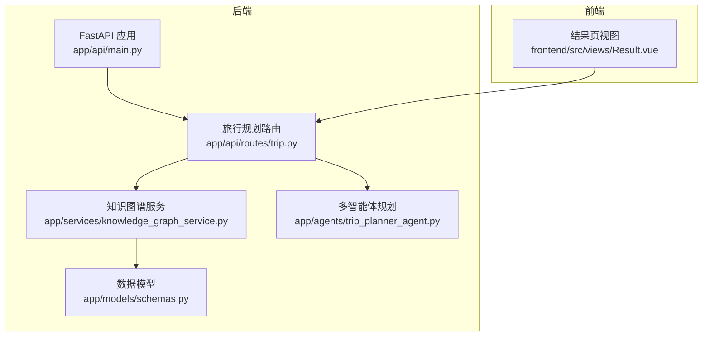
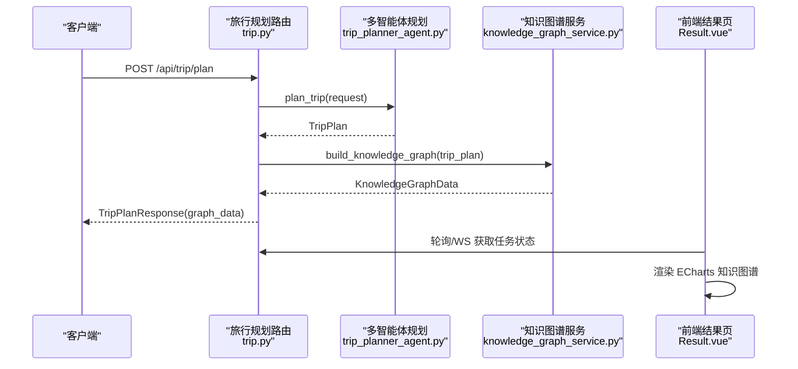
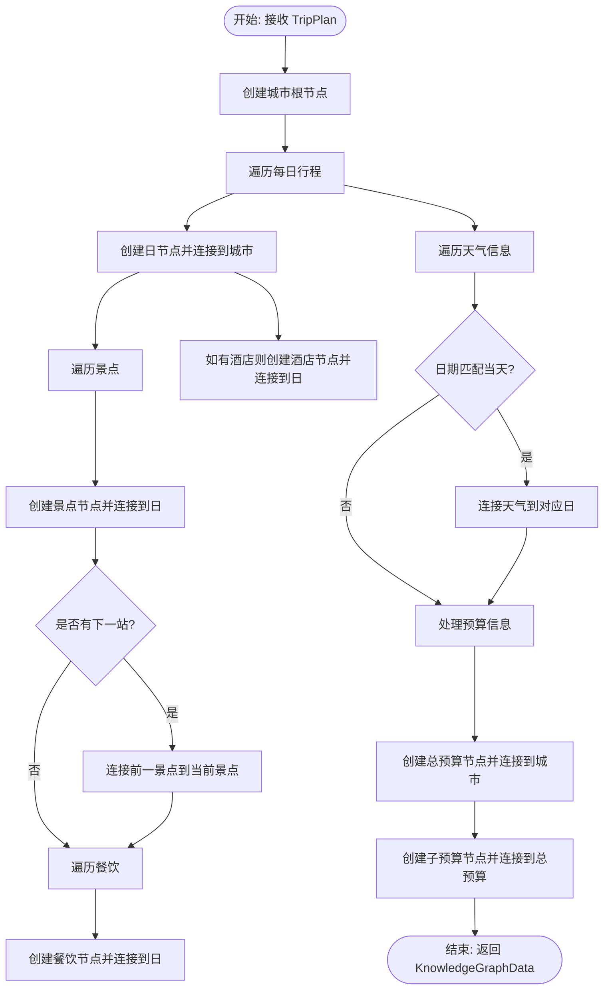
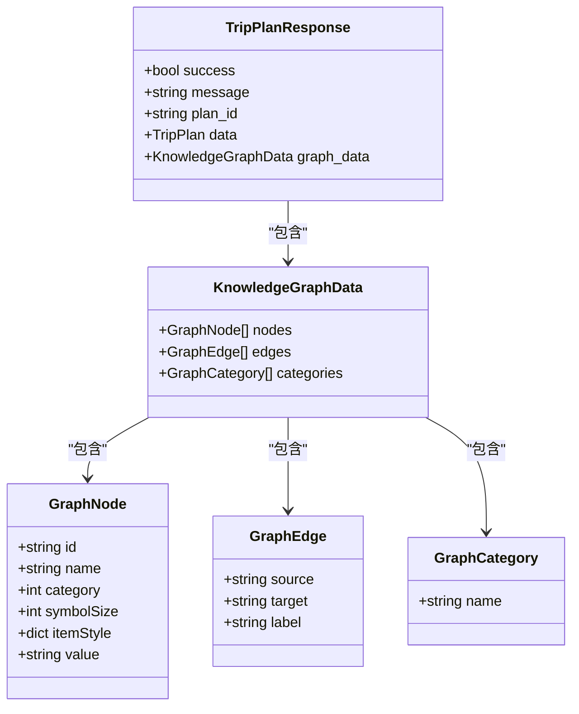
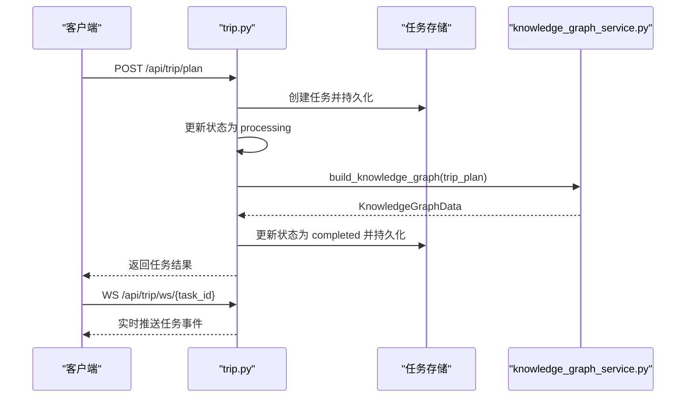
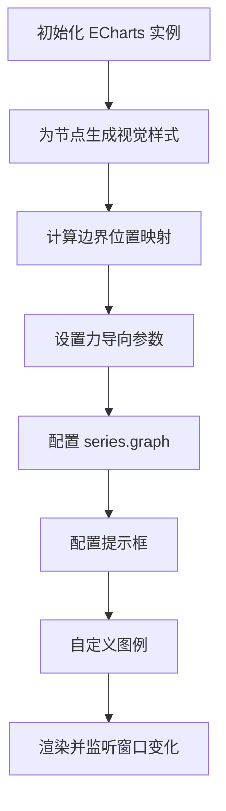
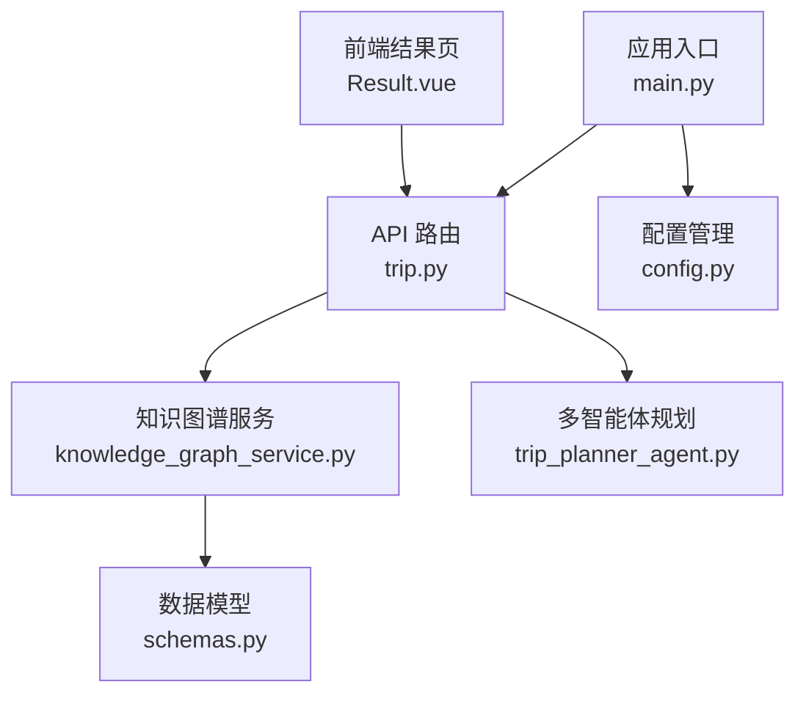

# 知识图谱服务

<cite>
**本文档引用的文件**
- [knowledge_graph_service.py](file://backend/app/services/knowledge_graph_service.py)
- [schemas.py](file://backend/app/models/schemas.py)
- [trip.py](file://backend/app/api/routes/trip.py)
- [main.py](file://backend/app/api/main.py)
- [config.py](file://backend/app/config.py)
- [trip_planner_agent.py](file://backend/app/agents/trip_planner_agent.py)
- [README.md](file://README.md)
- [Result.vue](file://frontend/src/views/Result.vue)
</cite>

## 目录
1. [简介](#简介)
2. [项目结构](#项目结构)
3. [核心组件](#核心组件)
4. [架构概览](#架构概览)
5. [详细组件分析](#详细组件分析)
6. [依赖关系分析](#依赖关系分析)
7. [性能考量](#性能考量)
8. [故障排除指南](#故障排除指南)
9. [结论](#结论)
10. [附录](#附录)

## 简介
本项目基于多智能体协作的旅行规划系统，提供从 TripPlan 数据中提取实体与关系，构建知识图谱并进行可视化的能力。知识图谱服务负责将结构化的旅行计划数据转换为 ECharts 图数据，支持节点分类、边关系标注、力导向布局与交互式渲染，帮助用户直观理解行程结构与各要素之间的关联。

## 项目结构
后端采用 FastAPI + 多智能体架构，前端使用 Vue 3 + ECharts 实现可视化。知识图谱服务位于后端，主要文件如下：
- 后端服务层：`backend/app/services/knowledge_graph_service.py`
- 数据模型：`backend/app/models/schemas.py`
- API 路由：`backend/app/api/routes/trip.py`
- 应用入口：`backend/app/api/main.py`
- 配置管理：`backend/app/config.py`
- 多智能体规划：`backend/app/agents/trip_planner_agent.py`
- 前端可视化：`frontend/src/views/Result.vue`

**图表来源**
- [main.py:25-60](file://backend/app/api/main.py#L25-L60)
- [trip.py:17-313](file://backend/app/api/routes/trip.py#L17-L313)
- [knowledge_graph_service.py:34-169](file://backend/app/services/knowledge_graph_service.py#L34-L169)
- [schemas.py:146-186](file://backend/app/models/schemas.py#L146-L186)
- [trip_planner_agent.py:173-339](file://backend/app/agents/trip_planner_agent.py#L173-L339)
- [Result.vue:241-250](file://frontend/src/views/Result.vue#L241-L250)

**章节来源**
- [main.py:25-60](file://backend/app/api/main.py#L25-L60)
- [trip.py:17-313](file://backend/app/api/routes/trip.py#L17-L313)
- [knowledge_graph_service.py:34-169](file://backend/app/services/knowledge_graph_service.py#L34-L169)
- [schemas.py:146-186](file://backend/app/models/schemas.py#L146-L186)
- [trip_planner_agent.py:173-339](file://backend/app/agents/trip_planner_agent.py#L173-L339)
- [Result.vue:241-250](file://frontend/src/views/Result.vue#L241-L250)

## 核心组件
- 知识图谱构建服务：将 TripPlan 转换为 ECharts 所需的 nodes、edges、categories 格式，内置节点颜色与尺寸映射。
- 数据模型：定义 GraphNode、GraphEdge、GraphCategory、KnowledgeGraphData 等知识图谱数据结构。
- API 路由：提供旅行规划任务提交、状态查询、WebSocket 实时通知，最终在完成后注入 graph_data。
- 前端可视化：基于 ECharts 的 graph 组件渲染知识图谱，支持力导向布局、交互高亮、自定义图例与提示框。

**章节来源**
- [knowledge_graph_service.py:34-169](file://backend/app/services/knowledge_graph_service.py#L34-L169)
- [schemas.py:159-186](file://backend/app/models/schemas.py#L159-L186)
- [trip.py:315-388](file://backend/app/api/routes/trip.py#L315-L388)
- [Result.vue:2096-2248](file://frontend/src/views/Result.vue#L2096-L2248)

## 架构概览
知识图谱服务在旅行规划流程中承担“数据转换”的角色：多智能体生成 TripPlan 后，由路由触发知识图谱构建，将结构化数据映射为图数据，随旅行计划一起返回给前端。

**图表来源**
- [trip.py:315-388](file://backend/app/api/routes/trip.py#L315-L388)
- [trip_planner_agent.py:257-339](file://backend/app/agents/trip_planner_agent.py#L257-L339)
- [knowledge_graph_service.py:34-169](file://backend/app/services/knowledge_graph_service.py#L34-L169)
- [Result.vue:2096-2248](file://frontend/src/views/Result.vue#L2096-L2248)

## 详细组件分析

### 知识图谱构建服务
- 输入：TripPlan（城市、日期范围、每日行程、天气、预算、总体建议等）
- 输出：KnowledgeGraphData（nodes、edges、categories）
- 节点分类与样式：内置节点颜色与尺寸映射，支持按分类索引渲染不同视觉样式
- 边关系：涵盖“行程-日程-景点-酒店-餐饮-天气-预算-建议”等多维关系
- 关联策略：按日期将天气节点与对应天数连接；预算节点形成父子层级

**图表来源**
- [knowledge_graph_service.py:83-168](file://backend/app/services/knowledge_graph_service.py#L83-L168)

**章节来源**
- [knowledge_graph_service.py:34-169](file://backend/app/services/knowledge_graph_service.py#L34-L169)

### 数据模型设计
- GraphNode：节点标识、名称、分类索引、符号大小、样式、附加信息
- GraphEdge：源节点、目标节点、关系标签
- GraphCategory：分类名称
- KnowledgeGraphData：节点列表、边列表、分类列表
- TripPlanResponse：包含旅行计划与知识图谱数据的统一响应

**图表来源**
- [schemas.py:159-186](file://backend/app/models/schemas.py#L159-L186)
- [schemas.py:188-195](file://backend/app/models/schemas.py#L188-L195)

**章节来源**
- [schemas.py:159-186](file://backend/app/models/schemas.py#L159-L186)
- [schemas.py:188-195](file://backend/app/models/schemas.py#L188-L195)

### API 集成与任务流程
- 任务状态：内存存储 + 本地持久化，支持 WebSocket 实时推送与轮询查询
- 任务生命周期：提交 -> 初始化 -> 规划 -> 构建知识图谱 -> 完成/失败
- 错误处理：捕获异常并返回友好错误信息，区分小红书 Cookie 过期等特定异常

**图表来源**
- [trip.py:276-388](file://backend/app/api/routes/trip.py#L276-L388)
- [knowledge_graph_service.py:34-169](file://backend/app/services/knowledge_graph_service.py#L34-L169)

**章节来源**
- [trip.py:276-388](file://backend/app/api/routes/trip.py#L276-L388)

### 前端可视化实现（ECharts 集成）
- 初始化：根据容器尺寸动态调整力引导参数（重力、斥力、边长范围）
- 节点视觉：按分类生成渐变圆形 SVG 作为节点图标，支持不同尺寸与透明度
- 布局策略：基于节点度数确定根节点，按分类分组围绕中心分布，多层径向排列
- 交互：支持缩放、拖拽、悬停聚焦邻接节点，提示框显示节点类型与附加信息

**图表来源**
- [Result.vue:2096-2248](file://frontend/src/views/Result.vue#L2096-L2248)
- [Result.vue:1115-1199](file://frontend/src/views/Result.vue#L1115-L1199)
- [Result.vue:1030-1113](file://frontend/src/views/Result.vue#L1030-L1113)

**章节来源**
- [Result.vue:2096-2248](file://frontend/src/views/Result.vue#L2096-L2248)
- [Result.vue:1115-1199](file://frontend/src/views/Result.vue#L1115-L1199)
- [Result.vue:1030-1113](file://frontend/src/views/Result.vue#L1030-L1113)

## 依赖关系分析
- 后端依赖：FastAPI、Pydantic、uvicorn（开发）、多智能体框架（HelloAgents）
- 前端依赖：Vue 3、Ant Design Vue、ECharts、高德地图 JS API
- 配置：通过 Settings 类集中管理运行时配置，支持环境变量与本地持久化覆盖

**图表来源**
- [knowledge_graph_service.py:6-8](file://backend/app/services/knowledge_graph_service.py#L6-L8)
- [trip.py:13-15](file://backend/app/api/routes/trip.py#L13-L15)
- [main.py:19-20](file://backend/app/api/main.py#L19-L20)
- [config.py:21-72](file://backend/app/config.py#L21-L72)
- [trip_planner_agent.py:9-11](file://backend/app/agents/trip_planner_agent.py#L9-L11)
- [Result.vue:578-590](file://frontend/src/views/Result.vue#L578-L590)

**章节来源**
- [knowledge_graph_service.py:6-8](file://backend/app/services/knowledge_graph_service.py#L6-L8)
- [trip.py:13-15](file://backend/app/api/routes/trip.py#L13-L15)
- [main.py:19-20](file://backend/app/api/main.py#L19-L20)
- [config.py:21-72](file://backend/app/config.py#L21-L72)
- [trip_planner_agent.py:9-11](file://backend/app/agents/trip_planner_agent.py#L9-L11)
- [Result.vue:578-590](file://frontend/src/views/Result.vue#L578-L590)

## 性能考量
- 知识图谱构建复杂度：线性遍历每日行程与节点，整体 O(N+E)，其中 N 为节点数、E 为边数
- 前端渲染优化：按节点尺寸与分类生成缓存的 SVG 符号，减少重复计算；力导向参数随容器尺寸自适应
- 任务持久化：磁盘序列化/反序列化，避免内存压力；重启后失败任务标记为失败，防止前端无限等待
- 多智能体规划：步骤1-3并发执行，步骤4串行整合，缩短总耗时

**章节来源**
- [knowledge_graph_service.py:34-169](file://backend/app/services/knowledge_graph_service.py#L34-L169)
- [Result.vue:2096-2248](file://frontend/src/views/Result.vue#L2096-L2248)
- [trip.py:82-145](file://backend/app/api/routes/trip.py#L82-L145)
- [trip_planner_agent.py:264-268](file://backend/app/agents/trip_planner_agent.py#L264-L268)

## 故障排除指南
- 任务状态异常：检查任务持久化文件是否存在与可读；确认服务重启后对未完成任务的处理逻辑
- WebSocket 连接：确认 task_id 是否存在；检查订阅队列与广播逻辑
- 小红书 Cookie 过期：路由层对特定异常进行特殊处理并返回前端
- 前端渲染问题：确认容器尺寸变化事件监听与 ECharts 实例销毁/重建逻辑

**章节来源**
- [trip.py:106-123](file://backend/app/api/routes/trip.py#L106-L123)
- [trip.py:370-379](file://backend/app/api/routes/trip.py#L370-L379)
- [Result.vue:2274-2281](file://frontend/src/views/Result.vue#L2274-L2281)
- [Result.vue:1265-1282](file://frontend/src/views/Result.vue#L1265-L1282)

## 结论
知识图谱服务通过将旅行计划数据结构化为图数据，结合前端 ECharts 的力导向渲染，实现了对行程要素关系的直观呈现。服务具备清晰的模块划分、完善的任务状态管理与良好的扩展性，便于后续添加新的实体类型与关系规则。

## 附录

### 数据模型与字段定义
- GraphNode：id、name、category、symbolSize、itemStyle、value
- GraphEdge：source、target、label
- GraphCategory：name
- KnowledgeGraphData：nodes、edges、categories
- TripPlanResponse：success、message、plan_id、data、graph_data

**章节来源**
- [schemas.py:159-186](file://backend/app/models/schemas.py#L159-L186)
- [schemas.py:188-195](file://backend/app/models/schemas.py#L188-L195)

### 扩展机制
- 新增实体类型：在知识图谱构建函数中扩展节点创建逻辑与分类映射
- 新增关系规则：在相应遍历处添加边的创建与标签设置
- 前端样式与交互：在 Result.vue 中扩展节点视觉样式、提示框内容与图例

**章节来源**
- [knowledge_graph_service.py:62-82](file://backend/app/services/knowledge_graph_service.py#L62-L82)
- [knowledge_graph_service.py:106-111](file://backend/app/services/knowledge_graph_service.py#L106-L111)
- [Result.vue:1030-1113](file://frontend/src/views/Result.vue#L1030-L1113)

### 使用示例
- 提交旅行规划任务：POST /api/trip/plan
- 实时获取状态：WebSocket /api/trip/ws/{task_id} 或轮询 GET /api/trip/status/{task_id}
- 前端查看知识图谱：在结果页切换至“知识图谱”标签

**章节来源**
- [trip.py:276-313](file://backend/app/api/routes/trip.py#L276-L313)
- [trip.py:390-440](file://backend/app/api/routes/trip.py#L390-L440)
- [trip.py:455-488](file://backend/app/api/routes/trip.py#L455-L488)
- [Result.vue:241-250](file://frontend/src/views/Result.vue#L241-L250)