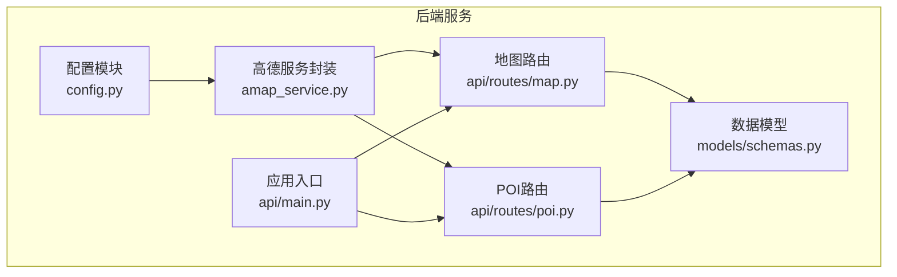
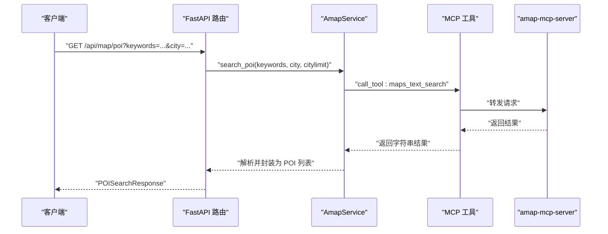
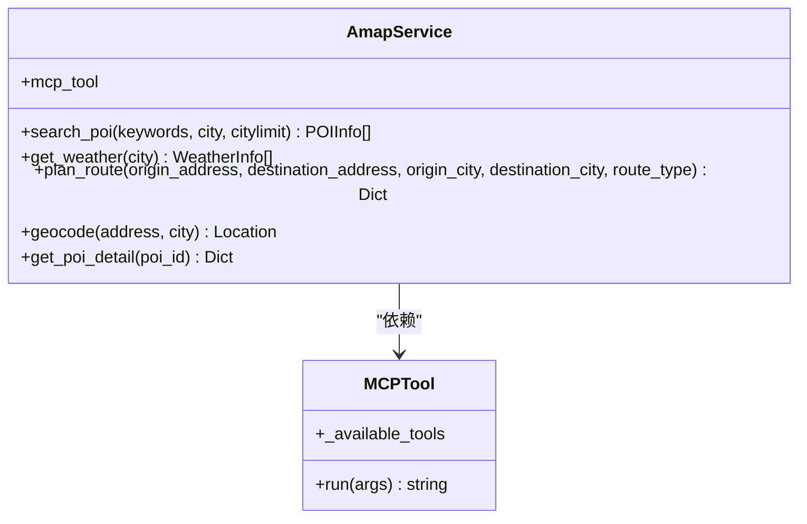
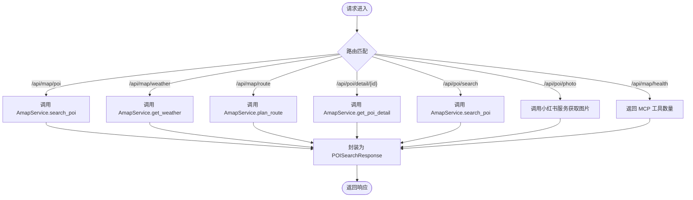
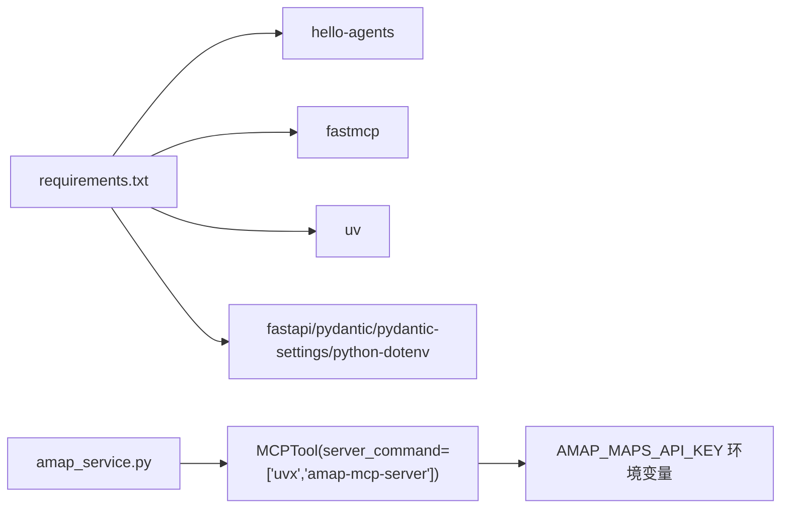

# 高德地图服务

<cite>
**本文引用的文件**
- [amap_service.py](file://backend/app/services/amap_service.py)
- [config.py](file://backend/app/config.py)
- [map.py](file://backend/app/api/routes/map.py)
- [poi.py](file://backend/app/api/routes/poi.py)
- [schemas.py](file://backend/app/models/schemas.py)
- [main.py](file://backend/app/api/main.py)
- [settings.py](file://backend/app/api/routes/settings.py)
- [requirements.txt](file://backend/requirements.txt)
- [README.md](file://README.md)
</cite>

## 目录
1. [简介](#简介)
2. [项目结构](#项目结构)
3. [核心组件](#核心组件)
4. [架构总览](#架构总览)
5. [详细组件分析](#详细组件分析)
6. [依赖关系分析](#依赖关系分析)
7. [性能考量](#性能考量)
8. [故障排查指南](#故障排查指南)
9. [结论](#结论)
10. [附录](#附录)

## 简介
本文件面向“高德地图服务模块”的使用者与维护者，系统性阐述基于 MCP（Model Context Protocol）的高德地图服务集成方案，涵盖地理编码、POI 搜索、路线规划、天气查询等核心能力，以及配置与初始化流程、错误处理与重试策略、使用示例与最佳实践。该模块通过 FastAPI 路由对外提供 REST 接口，并以单例模式管理 MCP 工具实例，确保 API Key 的安全注入与运行时热更新。

## 项目结构
后端采用 FastAPI + Pydantic + MCP 的分层架构：
- 配置层：集中管理运行时配置与环境变量，支持运行时热更新与持久化
- 服务层：封装高德地图 MCP 工具调用，提供 POI、地理编码、路线规划、天气等能力
- 路由层：暴露 REST API，统一响应模型与错误处理
- 模型层：定义请求/响应数据结构，保证接口契约一致性

图表来源
- [config.py:1-202](file://backend/app/config.py#L1-L202)
- [amap_service.py:1-276](file://backend/app/services/amap_service.py#L1-L276)
- [map.py:1-164](file://backend/app/api/routes/map.py#L1-L164)
- [poi.py:1-133](file://backend/app/api/routes/poi.py#L1-L133)
- [schemas.py:1-264](file://backend/app/models/schemas.py#L1-L264)
- [main.py:1-147](file://backend/app/api/main.py#L1-L147)

章节来源
- [main.py:1-147](file://backend/app/api/main.py#L1-L147)
- [config.py:1-202](file://backend/app/config.py#L1-L202)

## 核心组件
- 配置管理：集中读取与校验环境变量，支持运行时覆盖与持久化，提供健康检查与打印配置信息
- 高德服务封装：通过 MCP 工具调用高德地图能力，提供 POI 搜索、地理编码、路线规划、天气查询、POI 详情等接口
- 路由层：定义 REST API，统一响应模型与异常处理
- 数据模型：定义请求/响应结构，确保接口契约一致

章节来源
- [config.py:21-122](file://backend/app/config.py#L21-L122)
- [amap_service.py:50-276](file://backend/app/services/amap_service.py#L50-L276)
- [map.py:17-164](file://backend/app/api/routes/map.py#L17-L164)
- [poi.py:18-133](file://backend/app/api/routes/poi.py#L18-L133)
- [schemas.py:36-234](file://backend/app/models/schemas.py#L36-L234)

## 架构总览
高德地图服务通过 MCP 工具桥接到 amap-mcp-server，后端仅负责参数组装与结果解析，实现与具体地图服务提供商的解耦。

图表来源
- [map.py:23-57](file://backend/app/api/routes/map.py#L23-L57)
- [amap_service.py:57-92](file://backend/app/services/amap_service.py#L57-L92)

## 详细组件分析

### 配置与初始化
- 配置来源与优先级：优先加载项目根目录的 .env，再尝试加载 HelloAgents 的 .env（不覆盖已有值）
- 关键配置项：
  - vite_amap_web_key：高德 Web 服务 Key（后端注入到 MCP 工具环境）
  - vite_amap_web_js_key：高德 JS SDK Key（前端使用）
- 运行时配置：支持通过 /api/settings 接口更新并持久化，同时触发服务单例重置，确保新配置立即生效
- 健康检查：/api/map/health 返回 MCP 工具可用数量，便于监控

章节来源
- [config.py:11-19](file://backend/app/config.py#L11-L19)
- [config.py:36-56](file://backend/app/config.py#L36-L56)
- [config.py:129-160](file://backend/app/config.py#L129-L160)
- [settings.py:27-56](file://backend/app/api/routes/settings.py#L27-L56)
- [map.py:147-162](file://backend/app/api/routes/map.py#L147-L162)

### 高德服务封装类（AmapService）
- 单例模式：全局唯一 MCP 工具实例，避免重复创建与资源浪费
- 关键方法：
  - search_poi：文本搜索 POI
  - get_weather：查询天气
  - plan_route：路线规划（步行/驾车/公交）
  - geocode：地址转坐标
  - get_poi_detail：获取 POI 详情（含图片提取逻辑）
- 结果处理：当前返回结构为占位符，实际解析逻辑待完善（TODO）

图表来源
- [amap_service.py:50-276](file://backend/app/services/amap_service.py#L50-L276)

章节来源
- [amap_service.py:50-276](file://backend/app/services/amap_service.py#L50-L276)

### 路由与接口
- 地图服务路由（/api/map）：
  - GET /poi：POI 搜索
  - GET /weather：天气查询
  - POST /route：路线规划
  - GET /health：健康检查
- POI 路由（/api/poi）：
  - GET /detail/{poi_id}：POI 详情
  - GET /search：POI 搜索
  - GET /photo：根据名称从小红书获取图片（补充用途）

图表来源
- [map.py:17-164](file://backend/app/api/routes/map.py#L17-L164)
- [poi.py:18-133](file://backend/app/api/routes/poi.py#L18-L133)

章节来源
- [map.py:17-164](file://backend/app/api/routes/map.py#L17-L164)
- [poi.py:18-133](file://backend/app/api/routes/poi.py#L18-L133)

### 数据模型
- 请求模型：POISearchRequest、RouteRequest
- 响应模型：POISearchResponse、RouteResponse、WeatherResponse
- 数据结构：Location、POIInfo、WeatherInfo 等，确保字段约束与类型安全

章节来源
- [schemas.py:36-234](file://backend/app/models/schemas.py#L36-L234)

## 依赖关系分析
- 依赖 MCP 工具链：hello-agents、fastmcp、uvx amap-mcp-server
- 依赖框架：FastAPI、Pydantic、Pydantic Settings、python-dotenv
- 运行时命令：uvx amap-mcp-server 由 MCPTool 启动并注入 AMAP_MAPS_API_KEY

图表来源
- [requirements.txt:1-18](file://backend/requirements.txt#L1-L18)
- [amap_service.py:28-34](file://backend/app/services/amap_service.py#L28-L34)

章节来源
- [requirements.txt:1-18](file://backend/requirements.txt#L1-L18)
- [amap_service.py:28-34](file://backend/app/services/amap_service.py#L28-L34)

## 性能考量
- 单例模式：避免重复创建 MCP 工具实例，降低进程与内存开销
- 参数优化：路线规划时传入城市参数可提升精度；POI 搜索支持 citylimit 限制范围
- 结果解析：当前返回结构为占位符，建议在 get_poi_detail 中完善 JSON 解析与图片提取逻辑，减少后续前端二次处理
- 缓存策略：建议在业务层引入 TTL 缓存（如 POI 名称+城市组合键），针对高频查询进行缓存，降低外部 API 调用频率
- 并发与限流：结合上游 MCP 服务的并发能力与高德 API 限额，合理设置超时与重试策略

[本节为通用性能建议，不直接分析具体文件]

## 故障排查指南
- API Key 未配置
  - 现象：初始化 MCP 工具时报错，提示未配置高德地图 API Key
  - 处理：通过 /api/settings 更新运行时配置，或设置环境变量 vite_amap_web_key
- 健康检查失败
  - 现象：/api/map/health 返回 503
  - 处理：确认 amap-mcp-server 可用、uvx 可执行、AMAP_MAPS_API_KEY 注入正确
- 路由规划失败
  - 现象：plan_route 返回空字典
  - 处理：检查地址格式、城市参数、路线类型；完善结果解析逻辑
- POI 搜索失败
  - 现象：search_poi 返回空列表
  - 处理：检查关键词与城市参数；完善结果解析逻辑

章节来源
- [amap_service.py:24-25](file://backend/app/services/amap_service.py#L24-L25)
- [map.py:147-162](file://backend/app/api/routes/map.py#L147-L162)
- [amap_service.py:89-91](file://backend/app/services/amap_service.py#L89-L91)
- [amap_service.py:184-186](file://backend/app/services/amap_service.py#L184-L186)

## 结论
本模块通过 MCP 工具桥接高德地图服务，实现了 POI 搜索、地理编码、路线规划、天气查询等核心能力，并提供了运行时配置热更新与健康检查机制。当前实现以占位符为主，建议尽快完善结果解析与错误处理，同时引入缓存与重试策略，以提升稳定性与性能。

[本节为总结性内容，不直接分析具体文件]

## 附录

### 使用示例与最佳实践
- 配置与启动
  - 设置 vite_amap_web_key（后端注入到 MCP 工具）
  - 通过 /api/settings 保存配置并触发热更新
  - 访问 /docs 查看接口文档
- 接口调用
  - POI 搜索：GET /api/map/poi?keywords=...&city=...
  - 天气查询：GET /api/map/weather?city=...
  - 路线规划：POST /api/map/route（Body：RouteRequest）
  - POI 详情：GET /api/poi/detail/{poi_id}
- 最佳实践
  - 对高频查询（如 POI 名称+城市）引入缓存
  - 在 plan_route 中传入城市参数以提升精度
  - 完善 get_poi_detail 的 JSON 解析与图片提取逻辑
  - 在路由层增加超时与重试策略，避免上游服务抖动影响用户体验

章节来源
- [map.py:17-164](file://backend/app/api/routes/map.py#L17-L164)
- [poi.py:18-133](file://backend/app/api/routes/poi.py#L18-L133)
- [settings.py:27-56](file://backend/app/api/routes/settings.py#L27-L56)
- [README.md:129-200](file://README.md#L129-L200)