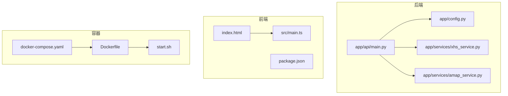
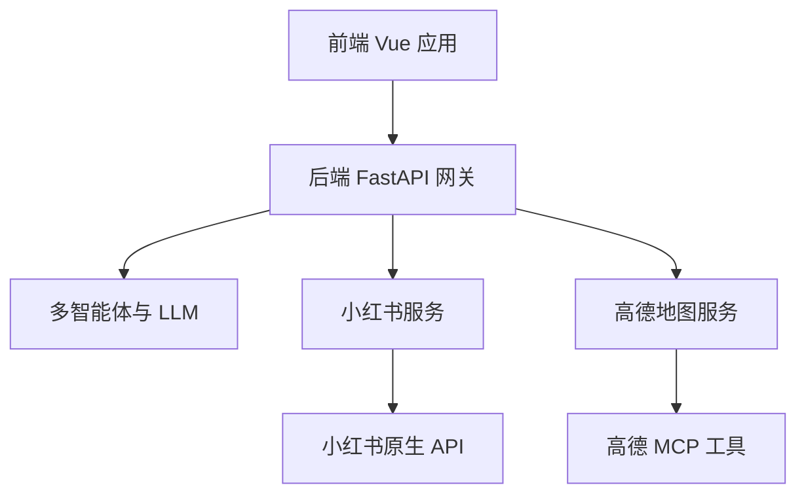
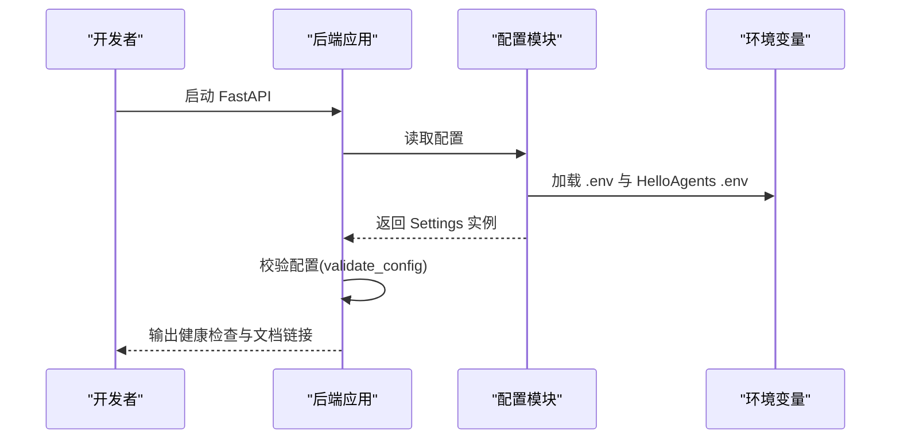
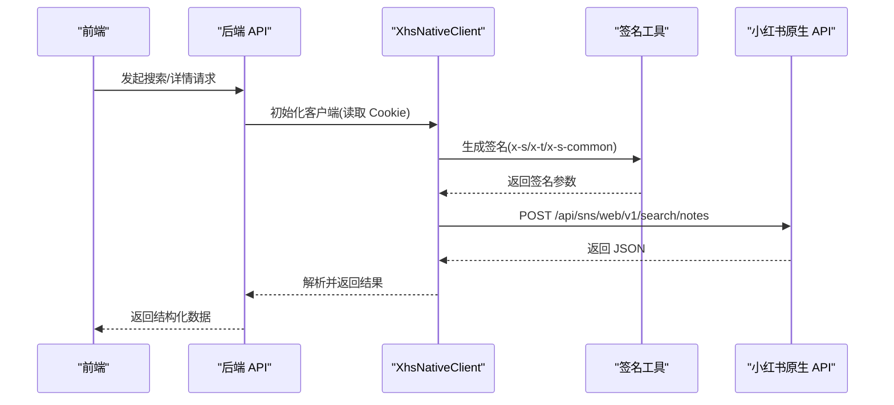
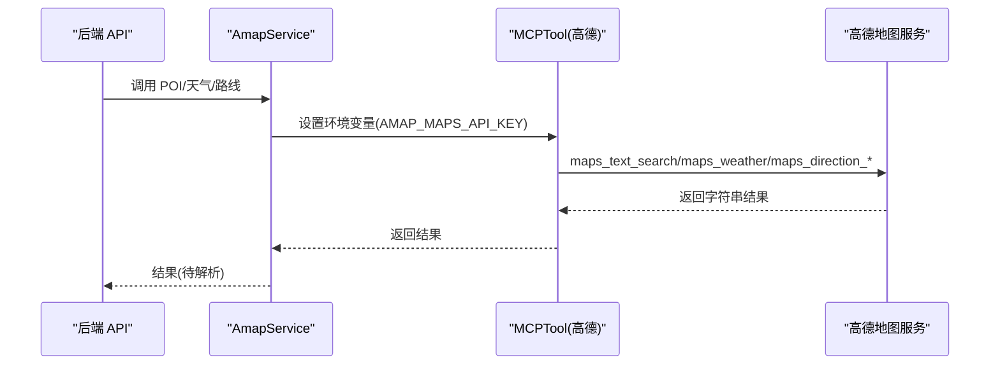

# 快速开始

<cite>
**本文引用的文件**
- [README.md](file://README.md)
- [backend/app/config.py](file://backend/app/config.py)
- [backend/app/api/main.py](file://backend/app/api/main.py)
- [backend/app/services/xhs_service.py](file://backend/app/services/xhs_service.py)
- [backend/app/services/amap_service.py](file://backend/app/services/amap_service.py)
- [backend/run.py](file://backend/run.py)
- [backend/requirements.txt](file://backend/requirements.txt)
- [frontend/package.json](file://frontend/package.json)
- [frontend/index.html](file://frontend/index.html)
- [frontend/src/main.ts](file://frontend/src/main.ts)
- [Dockerfile](file://Dockerfile)
- [docker-compose.yaml](file://docker-compose.yaml)
- [start.sh](file://start.sh)
</cite>

## 目录
1. [简介](#简介)
2. [项目结构](#项目结构)
3. [核心组件](#核心组件)
4. [架构总览](#架构总览)
5. [详细组件分析](#详细组件分析)
6. [依赖分析](#依赖分析)
7. [性能考虑](#性能考虑)
8. [故障排除指南](#故障排除指南)
9. [结论](#结论)
10. [附录](#附录)

## 简介
本指南面向希望快速搭建 TripStar 项目的开发者，涵盖环境准备、本地开发、Docker 容器化部署、API Key 获取与配置、Cookie 与安全密钥设置，以及常见问题排查。项目采用前后端分离架构，后端基于 FastAPI，前端基于 Vue 3，集成多智能体与 LLM 能力，并与高德地图、小红书等外部服务对接。

## 项目结构
- 后端（Python 3.10+，FastAPI）位于 backend/，包含 API 路由、配置、服务层与多智能体编排。
- 前端（Vue 3 + Vite）位于 frontend/，包含路由、组件、国际化与服务层。
- 容器化部署使用 Dockerfile 与 docker-compose.yaml，统一构建与编排。
- 顶层 README.md 提供总体说明、架构图与部署指引。

图表来源
- [backend/app/api/main.py:1-147](file://backend/app/api/main.py#L1-L147)
- [backend/app/config.py:1-202](file://backend/app/config.py#L1-L202)
- [backend/app/services/xhs_service.py:1-200](file://backend/app/services/xhs_service.py#L1-L200)
- [backend/app/services/amap_service.py:1-200](file://backend/app/services/amap_service.py#L1-L200)
- [frontend/index.html:1-25](file://frontend/index.html#L1-L25)
- [frontend/src/main.ts:1-35](file://frontend/src/main.ts#L1-L35)
- [Dockerfile:1-64](file://Dockerfile#L1-L64)
- [docker-compose.yaml:1-24](file://docker-compose.yaml#L1-L24)
- [start.sh:1-20](file://start.sh#L1-L20)

章节来源
- [README.md:205-232](file://README.md#L205-L232)

## 核心组件
- 配置管理：集中读取与校验环境变量，支持运行时覆盖与持久化，便于前端设置页动态更新。
- API 网关：FastAPI 应用，注册路由、CORS、健康检查与 SPA 回退，支持开发与生产环境。
- 服务层：
  - 小红书服务：原生直连 API，使用本地 JS 签名引擎，规避风控拦截。
  - 高德地图服务：通过 MCP 工具调用高德地图能力（POI、天气、路线）。
- 前端：路由、UI 组件、国际化、Axios 服务层与高德 JS API 安全密钥注入。
- 容器化：分阶段构建前端与后端，统一暴露端口并通过环境变量注入配置。

章节来源
- [backend/app/config.py:21-127](file://backend/app/config.py#L21-L127)
- [backend/app/api/main.py:13-86](file://backend/app/api/main.py#L13-L86)
- [backend/app/services/xhs_service.py:68-199](file://backend/app/services/xhs_service.py#L68-L199)
- [backend/app/services/amap_service.py:12-47](file://backend/app/services/amap_service.py#L12-L47)
- [frontend/index.html:17-21](file://frontend/index.html#L17-L21)
- [Dockerfile:1-64](file://Dockerfile#L1-L64)

## 架构总览

图表来源
- [README.md:47-97](file://README.md#L47-L97)
- [backend/app/api/main.py:55-60](file://backend/app/api/main.py#L55-L60)
- [backend/app/services/xhs_service.py:68-199](file://backend/app/services/xhs_service.py#L68-L199)
- [backend/app/services/amap_service.py:12-47](file://backend/app/services/amap_service.py#L12-L47)

## 详细组件分析

### 环境准备与依赖
- Python 3.10+：后端运行时要求。
- Node.js 18+：前端与小红书签名引擎依赖。
- 包管理器：推荐安装 uv，提升依赖安装效率。
- 大模型 API Key：需兼容 OpenAI 格式的服务商（如豆包），配置项见后文。
- 高德地图 Key：
  - Web 服务 Key：用于后端 MCP 工具调用。
  - Web 端（JS API）Key：前端高德 JS API 使用。
  - 安全密钥（securityJsCode）：在前端 index.html 中注入。
- 小红书 Cookie：登录后从浏览器复制，用于直连小红书原生 API。

章节来源
- [README.md:131-139](file://README.md#L131-L139)
- [backend/app/config.py:36-55](file://backend/app/config.py#L36-L55)
- [frontend/index.html:17-21](file://frontend/index.html#L17-L21)

### 本地开发环境搭建

#### 后端启动
- 进入后端目录，安装小红书签名引擎依赖。
- 创建并激活虚拟环境，安装 Python 依赖。
- 复制示例配置文件并填入必要 Key。
- 使用 Uvicorn 启动 FastAPI 应用。

命令示例（路径与命令片段参考）：
- [后端启动命令片段:153-179](file://README.md#L153-L179)

章节来源
- [README.md:151-179](file://README.md#L151-L179)
- [backend/requirements.txt:1-18](file://backend/requirements.txt#L1-L18)
- [backend/run.py:1-17](file://backend/run.py#L1-L17)

#### 前端启动
- 进入前端目录，安装依赖。
- 配置前端环境变量（与后端保持一致的高德 Key）。
- 在 index.html 中注入高德安全密钥。
- 启动 Vite 开发服务器。

命令示例（路径与命令片段参考）：
- [前端启动命令片段:183-199](file://README.md#L183-L199)

章节来源
- [README.md:183-199](file://README.md#L183-L199)
- [frontend/package.json:1-35](file://frontend/package.json#L1-L35)
- [frontend/index.html:17-21](file://frontend/index.html#L17-L21)

### Docker 容器化部署

#### 构建与运行
- Dockerfile 分阶段构建前端与后端，安装系统依赖与 Node.js，预热 MCP 工具。
- docker-compose.yaml 通过环境变量注入运行时配置，映射端口至 7860。
- start.sh 使用 Gunicorn + Uvicorn Worker 启动应用。

命令示例（路径与命令片段参考）：
- [Dockerfile 构建参数与环境变量:15-23](file://Dockerfile#L15-L23)
- [docker-compose 环境变量与端口映射:8-21](file://docker-compose.yaml#L8-L21)
- [start.sh 绑定地址与端口:5-19](file://start.sh#L5-L19)

章节来源
- [Dockerfile:1-64](file://Dockerfile#L1-L64)
- [docker-compose.yaml:1-24](file://docker-compose.yaml#L1-L24)
- [start.sh:1-20](file://start.sh#L1-L20)

### API Key 与配置要点

#### 大模型 API Key
- 配置项：LLM_API_KEY、LLM_BASE_URL、LLM_MODEL_ID。
- 兼容 OpenAI 格式的服务商（如豆包）。
- 后端同时支持 OPENAI_API_KEY、OPENAI_BASE_URL、OPENAI_MODEL 的别名读取。

章节来源
- [backend/app/config.py:44-55](file://backend/app/config.py#L44-L55)
- [README.md:135-135](file://README.md#L135-L135)

#### 高德地图 Key
- Web 服务 Key：VITE_AMAP_WEB_KEY，用于后端 MCP 工具调用。
- Web 端（JS API）Key：VITE_AMAP_WEB_JS_KEY，前端高德 JS API 使用。
- 安全密钥：在前端 index.html 中注入 securityJsCode。

章节来源
- [backend/app/config.py:36-38](file://backend/app/config.py#L36-L38)
- [frontend/index.html:17-21](file://frontend/index.html#L17-L21)
- [Dockerfile:15-20](file://Dockerfile#L15-L20)

#### 小红书 Cookie
- 配置项：XHS_COOKIE。
- 登录小红书网页端后，从浏览器开发者工具复制 Cookie。
- 后端支持多种 Cookie 格式输入，内部会标准化处理。

章节来源
- [backend/app/config.py:40-41](file://backend/app/config.py#L40-L41)
- [backend/app/services/xhs_service.py:29-63](file://backend/app/services/xhs_service.py#L29-L63)
- [README.md:137-137](file://README.md#L137-L137)

### 关键流程时序

#### 启动与配置加载

图表来源
- [backend/app/api/main.py:63-85](file://backend/app/api/main.py#L63-L85)
- [backend/app/config.py:11-18](file://backend/app/config.py#L11-L18)
- [backend/app/config.py:162-179](file://backend/app/config.py#L162-L179)

#### 小红书原生 API 调用

图表来源
- [backend/app/services/xhs_service.py:68-199](file://backend/app/services/xhs_service.py#L68-L199)

#### 高德地图 MCP 工具调用

图表来源
- [backend/app/services/amap_service.py:12-47](file://backend/app/services/amap_service.py#L12-L47)

## 依赖分析
- 后端依赖：FastAPI、Uvicorn、Pydantic、HTTP 客户端、MCP 工具、Node.js 执行器等。
- 前端依赖：Vue 3、Ant Design Vue、Axios、高德 JS API 加载器、ECharts、Swiper 等。
- 容器镜像：Node 18（前端构建）、Python 3.10（后端运行）、系统级依赖（gcc、curl、nodejs、npm）。

章节来源
- [backend/requirements.txt:1-18](file://backend/requirements.txt#L1-L18)
- [frontend/package.json:11-33](file://frontend/package.json#L11-L33)
- [Dockerfile:33-36](file://Dockerfile#L33-L36)

## 性能考虑
- 后端任务异步化：通过后台任务与轮询机制避免网关超时。
- MCP 工具预热：构建阶段预下载高德 MCP 服务，减少首次请求延迟。
- 前端静态资源：生产环境挂载 dist 目录，SPA 回退至 index.html。
- 日志与超时：Gunicorn + Uvicorn Worker，合理设置超时与日志级别。

章节来源
- [README.md:103-109](file://README.md#L103-L109)
- [Dockerfile:45-47](file://Dockerfile#L45-L47)
- [backend/app/api/main.py:121-136](file://backend/app/api/main.py#L121-L136)
- [start.sh:13-19](file://start.sh#L13-L19)

## 故障排除指南
- 配置缺失或不正确
  - 现象：启动时报错或功能不可用。
  - 排查：确认 LLM API Key、高德 Web Key、小红书 Cookie 是否配置；检查 .env 或容器环境变量。
  - 参考：配置校验与打印逻辑。
- 小红书风控拦截
  - 现象：返回特定错误码或异常信息。
  - 排查：更换有效 Cookie；确认签名引擎正常工作。
  - 参考：Cookie 标准化与异常抛出。
- 高德 MCP 工具未就绪
  - 现象：地图相关功能报错。
  - 排查：确认高德 Web Key 已配置；检查 MCP 工具初始化日志。
- 前端安全密钥未注入
  - 现象：高德 JS API 无法加载或受限。
  - 排查：在 index.html 中注入 securityJsCode。

章节来源
- [backend/app/config.py:162-179](file://backend/app/config.py#L162-L179)
- [backend/app/services/xhs_service.py:134-141](file://backend/app/services/xhs_service.py#L134-L141)
- [backend/app/services/amap_service.py:24-25](file://backend/app/services/amap_service.py#L24-L25)
- [frontend/index.html:17-21](file://frontend/index.html#L17-L21)

## 结论
通过本指南，您可以在本地或容器环境中快速完成 TripStar 的环境准备与部署。建议优先完成 API Key 与 Cookie 的配置，并在本地验证后端与前端的连通性，再推进到 Docker 部署。遇到问题时，结合配置校验与日志输出进行定位。

## 附录

### 环境变量清单（后端）
- LLM_API_KEY / OPENAI_API_KEY
- LLM_BASE_URL / OPENAI_BASE_URL
- LLM_MODEL_ID / OPENAI_MODEL
- VITE_AMAP_WEB_KEY
- VITE_AMAP_WEB_JS_KEY
- XHS_COOKIE
- HOST / PORT
- LOG_LEVEL

章节来源
- [backend/app/config.py:44-55](file://backend/app/config.py#L44-L55)
- [backend/app/config.py:36-41](file://backend/app/config.py#L36-L41)
- [docker-compose.yaml:13-22](file://docker-compose.yaml#L13-L22)

### 前端环境变量（构建期）
- VITE_AMAP_WEB_JS_KEY（通过 Docker 构建参数注入）
- VITE_API_BASE_URL（同源部署时为空）

章节来源
- [Dockerfile:15-20](file://Dockerfile#L15-L20)
- [frontend/package.json:1-35](file://frontend/package.json#L1-L35)