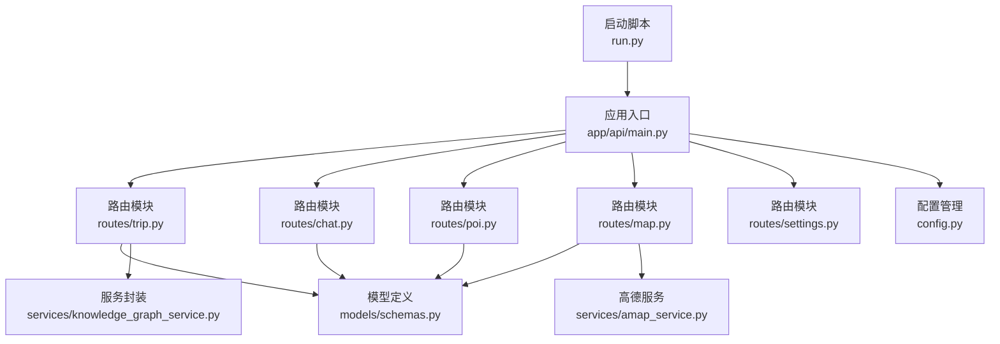
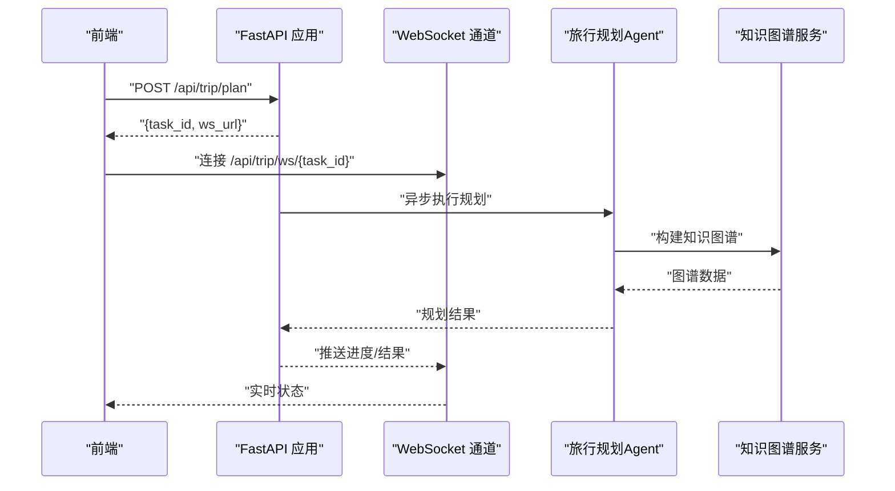
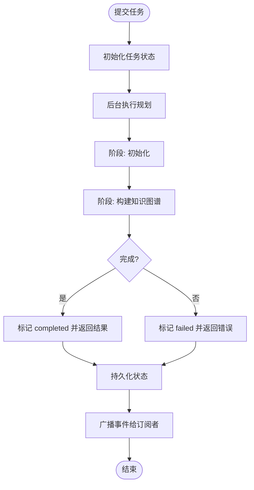
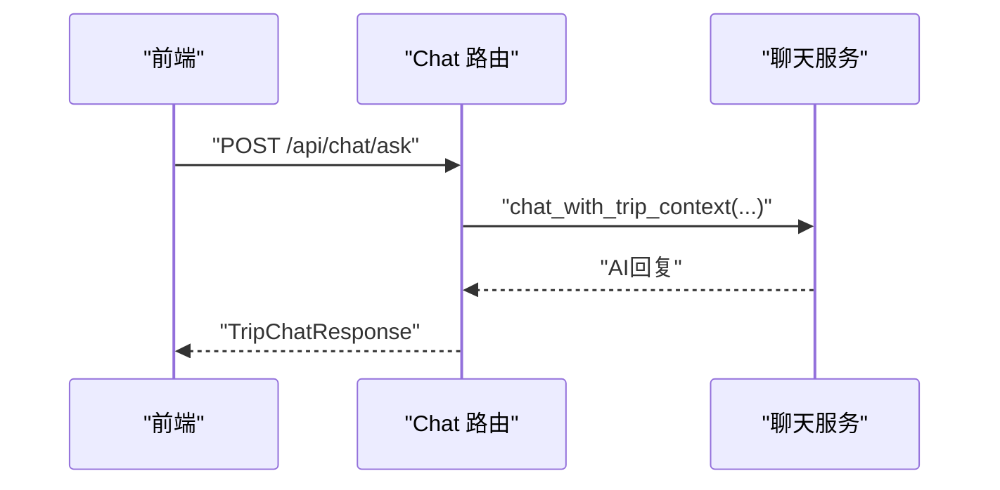
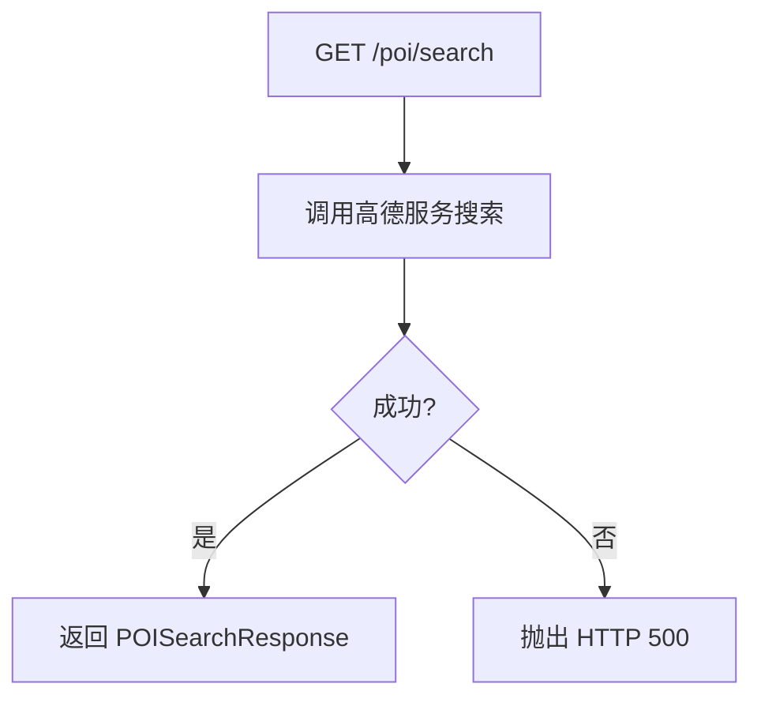
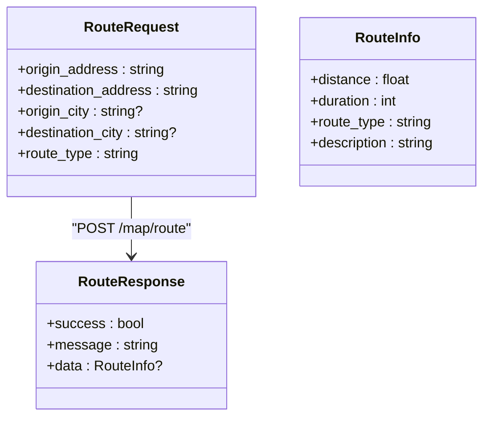
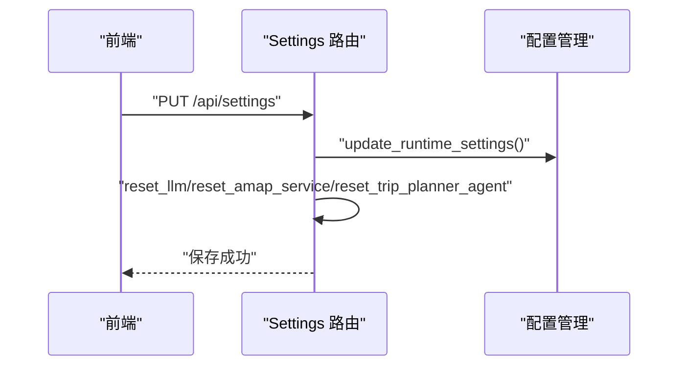
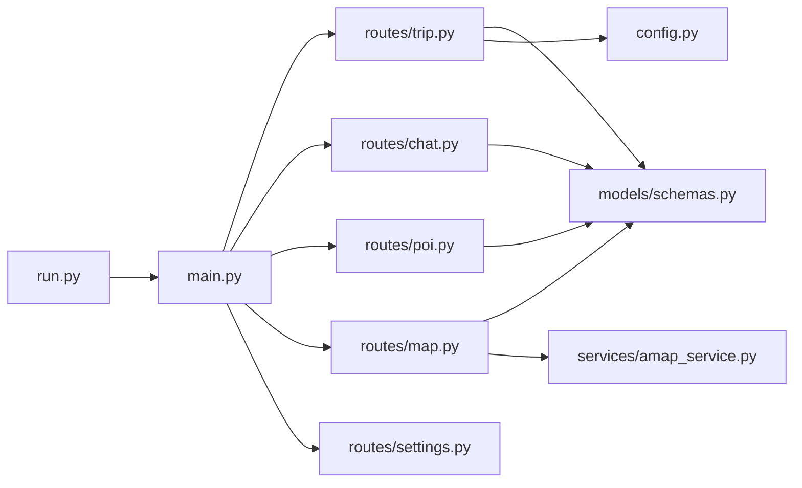

# API 接口扩展

<cite>
**本文引用的文件**
- [backend/app/api/main.py](file://backend/app/api/main.py)
- [backend/app/api/routes/trip.py](file://backend/app/api/routes/trip.py)
- [backend/app/api/routes/chat.py](file://backend/app/api/routes/chat.py)
- [backend/app/api/routes/poi.py](file://backend/app/api/routes/poi.py)
- [backend/app/api/routes/map.py](file://backend/app/api/routes/map.py)
- [backend/app/api/routes/settings.py](file://backend/app/api/routes/settings.py)
- [backend/app/models/schemas.py](file://backend/app/models/schemas.py)
- [backend/app/config.py](file://backend/app/config.py)
- [backend/run.py](file://backend/run.py)
- [backend/app/services/amap_service.py](file://backend/app/services/amap_service.py)
- [README.md](file://README.md)
</cite>

## 目录
1. [简介](#简介)
2. [项目结构](#项目结构)
3. [核心组件](#核心组件)
4. [架构总览](#架构总览)
5. [详细组件分析](#详细组件分析)
6. [依赖分析](#依赖分析)
7. [性能考量](#性能考量)
8. [故障排查指南](#故障排查指南)
9. [结论](#结论)
10. [附录](#附录)

## 简介
本指南面向希望在 TripStar 项目中扩展 API 的开发者，系统讲解如何新增 FastAPI 路由、处理请求与响应、实现异步任务与 WebSocket 实时推送、进行 API 版本控制与向后兼容、保障安全与认证授权、以及最佳实践（错误处理、文档生成、性能优化）。文档结合现有代码示例，提供可操作的扩展步骤与参考路径。

## 项目结构
后端采用 FastAPI + Python 的分层架构，核心位于 backend/app 目录：
- app/api/main.py：应用入口与路由注册、中间件、CORS、健康检查、静态资源挂载
- app/api/routes/*：各功能域路由模块（旅行规划、聊天问答、POI、地图、设置）
- app/models/schemas.py：Pydantic 数据模型（请求/响应/错误）
- app/config.py：配置管理与运行时设置
- app/services/*：业务服务封装（如高德地图服务）
- run.py：本地启动脚本

图表来源
- [backend/app/api/main.py:55-60](file://backend/app/api/main.py#L55-L60)
- [backend/app/api/routes/trip.py:17](file://backend/app/api/routes/trip.py#L17)
- [backend/app/api/routes/chat.py:7](file://backend/app/api/routes/chat.py#L7)
- [backend/app/api/routes/poi.py:8](file://backend/app/api/routes/poi.py#L8)
- [backend/app/api/routes/map.py:14](file://backend/app/api/routes/map.py#L14)
- [backend/app/api/routes/settings.py:13](file://backend/app/api/routes/settings.py#L13)
- [backend/app/models/schemas.py:1-264](file://backend/app/models/schemas.py#L1-L264)
- [backend/app/config.py:70-72](file://backend/app/config.py#L70-L72)
- [backend/run.py:6-15](file://backend/run.py#L6-L15)

章节来源
- [backend/app/api/main.py:138-147](file://backend/app/api/main.py#L138-L147)
- [README.md:205-232](file://README.md#L205-L232)

## 核心组件
- 应用入口与路由注册：集中注册各路由模块，统一前缀 /api，并配置 CORS、中间件与静态资源
- 路由模块：按功能域划分（旅行规划、聊天问答、POI、地图、设置），每个模块定义 APIRouter 并暴露 HTTP 接口
- 数据模型：统一使用 Pydantic 模型定义请求与响应，便于自动文档生成与校验
- 配置管理：支持环境变量与运行时设置，提供健康检查与配置验证
- 服务封装：将外部服务（如高德地图）抽象为服务类，便于替换与测试

章节来源
- [backend/app/api/main.py:14-60](file://backend/app/api/main.py#L14-L60)
- [backend/app/models/schemas.py:1-264](file://backend/app/models/schemas.py#L1-L264)
- [backend/app/config.py:21-72](file://backend/app/config.py#L21-L72)

## 架构总览
系统采用前后端分离，后端提供 REST API 与 WebSocket，前端通过异步轮询与实时订阅获取旅行规划状态。

图表来源
- [backend/app/api/routes/trip.py:276-313](file://backend/app/api/routes/trip.py#L276-L313)
- [backend/app/api/routes/trip.py:390-440](file://backend/app/api/routes/trip.py#L390-L440)
- [backend/app/api/routes/trip.py:315-388](file://backend/app/api/routes/trip.py#L315-L388)

## 详细组件分析

### 旅行规划路由（异步任务 + WebSocket）
- 路由前缀：/api/trip
- 关键接口
  - POST /plan：提交旅行规划任务，立即返回 task_id 与 ws_url
  - GET /status/{task_id}：轮询查询任务状态（兼容旧客户端）
  - WebSocket /ws/{task_id}：实时订阅任务状态
  - GET /history：查询最近历史计划摘要
  - GET /health：健康检查
- 任务状态管理
  - 内存字典维护任务状态，支持持久化到 JSON 文件
  - 任务生命周期：submitted → initializing → graph_building → completed/failed
  - WebSocket 订阅者队列广播事件，完成后自动关闭连接
- 错误处理
  - 对特定异常（如小红书 Cookie 过期）做特殊处理并返回友好提示
  - 服务重启后未完成任务标记失败，避免前端无限等待

图表来源
- [backend/app/api/routes/trip.py:243-274](file://backend/app/api/routes/trip.py#L243-L274)
- [backend/app/api/routes/trip.py:315-388](file://backend/app/api/routes/trip.py#L315-L388)
- [backend/app/api/routes/trip.py:207-224](file://backend/app/api/routes/trip.py#L207-L224)

章节来源
- [backend/app/api/routes/trip.py:17-511](file://backend/app/api/routes/trip.py#L17-L511)

### 聊天问答路由（异步处理）
- 路由前缀：/api/chat
- 关键接口
  - POST /ask：根据旅行计划上下文回答用户问题
- 处理流程
  - 将历史消息转换为字典列表
  - 调用聊天服务异步生成回复
  - 返回统一响应模型

图表来源
- [backend/app/api/routes/chat.py:10-53](file://backend/app/api/routes/chat.py#L10-L53)

章节来源
- [backend/app/api/routes/chat.py:1-53](file://backend/app/api/routes/chat.py#L1-L53)

### POI 路由（查询与搜索）
- 路由前缀：/api/poi
- 关键接口
  - GET /detail/{poi_id}：获取 POI 详情
  - GET /search：关键词搜索 POI
  - GET /photo：根据景点名称从小红书获取图片
- 错误处理
  - 统一捕获异常并返回 HTTP 500 与详细错误信息

图表来源
- [backend/app/api/routes/poi.py:54-86](file://backend/app/api/routes/poi.py#L54-L86)

章节来源
- [backend/app/api/routes/poi.py:1-133](file://backend/app/api/routes/poi.py#L1-L133)

### 地图服务路由（查询天气、路线规划）
- 路由前缀：/api/map
- 关键接口
  - GET /poi：POI 搜索
  - GET /weather：天气查询
  - POST /route：路线规划
  - GET /health：健康检查
- 参数绑定
  - 使用 Query 对查询参数进行绑定与校验
  - 使用 Pydantic 模型对请求体进行校验

图表来源
- [backend/app/models/schemas.py:43-50](file://backend/app/models/schemas.py#L43-L50)
- [backend/app/models/schemas.py:214-227](file://backend/app/models/schemas.py#L214-L227)
- [backend/app/models/schemas.py:214-220](file://backend/app/models/schemas.py#L214-L220)

章节来源
- [backend/app/api/routes/map.py:1-164](file://backend/app/api/routes/map.py#L1-L164)
- [backend/app/models/schemas.py:1-264](file://backend/app/models/schemas.py#L1-L264)

### 设置路由（运行时配置）
- 路由前缀：/api/settings
- 关键接口
  - GET ""：获取当前运行时配置
  - PUT ""：保存运行时配置并重置相关单例以立即生效
- 配置项
  - 高德 Web Key、JS Key、小红书 Cookie、LLM API Key/Base URL/Model

图表来源
- [backend/app/api/routes/settings.py:27-56](file://backend/app/api/routes/settings.py#L27-L56)
- [backend/app/config.py:146-160](file://backend/app/config.py#L146-L160)

章节来源
- [backend/app/api/routes/settings.py:1-56](file://backend/app/api/routes/settings.py#L1-L56)
- [backend/app/config.py:70-160](file://backend/app/config.py#L70-L160)

### 数据模型与响应规范
- 请求模型：TripRequest、RouteRequest、POISearchRequest 等
- 响应模型：TripPlanResponse、RouteResponse、POISearchResponse、WeatherResponse、ErrorResponse、TripChatResponse 等
- 统一字段：success、message、data/error_code 等
- 示例：在模型中提供 json_schema_extra 与 example 字段，便于自动生成文档

章节来源
- [backend/app/models/schemas.py:10-33](file://backend/app/models/schemas.py#L10-L33)
- [backend/app/models/schemas.py:188-195](file://backend/app/models/schemas.py#L188-L195)
- [backend/app/models/schemas.py:238-243](file://backend/app/models/schemas.py#L238-L243)

## 依赖分析
- 应用入口依赖各路由模块，统一注册 /api 前缀
- 路由模块依赖模型定义与服务封装
- 配置模块提供运行时设置与健康检查
- 启动脚本读取配置并运行 Uvicorn

图表来源
- [backend/app/api/main.py:19-60](file://backend/app/api/main.py#L19-L60)
- [backend/app/api/routes/trip.py:14-16](file://backend/app/api/routes/trip.py#L14-L16)
- [backend/app/api/routes/chat.py:4-5](file://backend/app/api/routes/chat.py#L4-L5)
- [backend/app/api/routes/poi.py:6](file://backend/app/api/routes/poi.py#L6)
- [backend/app/api/routes/map.py:12-13](file://backend/app/api/routes/map.py#L12-L13)
- [backend/app/config.py:70-72](file://backend/app/config.py#L70-L72)
- [backend/run.py:6-15](file://backend/run.py#L6-L15)

章节来源
- [backend/app/api/main.py:19-60](file://backend/app/api/main.py#L19-L60)
- [backend/app/config.py:70-72](file://backend/app/config.py#L70-L72)

## 性能考量
- 异步任务与后台执行：旅行规划通过 asyncio.create_task 在后台执行，避免阻塞请求线程
- WebSocket 实时推送：使用队列广播事件，减少重复计算与网络开销
- 任务持久化：将任务状态写入本地 JSON 文件，服务重启后可恢复（仅限内存中未完成任务标记失败）
- 轮询与 WebSocket 兼容：同时提供轮询接口与 WebSocket，兼顾旧客户端与现代前端
- 健康检查：各服务提供 /health 接口，便于监控与自动恢复

章节来源
- [backend/app/api/routes/trip.py:304-305](file://backend/app/api/routes/trip.py#L304-L305)
- [backend/app/api/routes/trip.py:82-104](file://backend/app/api/routes/trip.py#L82-L104)
- [backend/app/api/routes/trip.py:491-508](file://backend/app/api/routes/trip.py#L491-L508)
- [backend/app/api/routes/map.py:142-163](file://backend/app/api/routes/map.py#L142-L163)

## 故障排查指南
- 配置验证失败
  - 现象：启动时报错并中断
  - 处理：检查环境变量（LLM API Key、高德 Web Key、小红书 Cookie 等），确保 .env 文件正确
- WebSocket 连接异常
  - 现象：连接后立即断开或无事件推送
  - 处理：确认 task_id 存在且状态未进入最终态；检查订阅者队列是否被清理
- 旅行规划任务失败
  - 现象：任务状态为 failed，返回错误信息
  - 处理：查看服务日志与异常栈；对于小红书 Cookie 过期等特定异常，前端会收到特殊提示
- 高德服务不可用
  - 现象：地图相关接口返回 503
  - 处理：检查高德 Web Key 配置与网络连通性；确认 MCP 工具可用

章节来源
- [backend/app/api/main.py:74-81](file://backend/app/api/main.py#L74-L81)
- [backend/app/api/routes/trip.py:370-388](file://backend/app/api/routes/trip.py#L370-L388)
- [backend/app/api/routes/map.py:149-162](file://backend/app/api/routes/map.py#L149-L162)

## 结论
通过现有代码可以看出，TripStar 的 API 设计遵循清晰的分层与职责分离原则：路由负责接口定义与参数绑定，模型负责数据校验与文档生成，服务负责业务逻辑封装，配置负责运行时参数管理。新增 API 时，建议严格遵循既有模式：定义路由模块与 APIRouter、编写 Pydantic 模型、实现业务逻辑、注册路由、补充健康检查与错误处理。对于复杂任务，优先采用异步 + WebSocket 的实时推送方案，兼顾兼容性与用户体验。

## 附录

### 新增 API 路由步骤清单
- 在 app/api/routes 下创建新路由文件（如 new_feature.py）
- 定义 APIRouter 与前缀
- 编写请求/响应模型（Pydantic）
- 实现业务逻辑与错误处理
- 在 app/api/main.py 中注册路由（include_router）
- 添加健康检查接口
- 更新 README 或内部文档

章节来源
- [backend/app/api/main.py:55-60](file://backend/app/api/main.py#L55-L60)
- [backend/app/models/schemas.py:1-264](file://backend/app/models/schemas.py#L1-L264)

### FastAPI 路由装饰器与参数绑定要点
- HTTP 方法：@router.get/@router.post/@router.put/@router.delete 等
- 路径参数：函数形参直接接收，如 task_id: str
- 查询参数：使用 Query(...) 显式声明与校验
- 请求体：使用 Pydantic 模型自动解析与校验
- 响应模型：使用 response_model 指定统一响应结构

章节来源
- [backend/app/api/routes/map.py:23-27](file://backend/app/api/routes/map.py#L23-L27)
- [backend/app/models/schemas.py:10-33](file://backend/app/models/schemas.py#L10-L33)

### 异步处理与 WebSocket 实现实战
- 异步任务：使用 asyncio.create_task 启动后台任务
- 状态管理：内存字典 + JSON 持久化，广播事件给订阅者
- WebSocket：接受连接后发送快照，循环推送事件，最终关闭连接

章节来源
- [backend/app/api/routes/trip.py:304-305](file://backend/app/api/routes/trip.py#L304-L305)
- [backend/app/api/routes/trip.py:390-440](file://backend/app/api/routes/trip.py#L390-L440)

### API 版本控制与向后兼容
- 版本策略：在应用启动时设置 version，Swagger/ReDoc 展示版本信息
- 兼容性：保留旧接口（如 /trip/status）以兼容旧客户端
- 迁移指南：变更前提供 deprecation warning，逐步引导客户端升级

章节来源
- [backend/app/api/main.py:25-31](file://backend/app/api/main.py#L25-L31)
- [backend/app/api/routes/trip.py:455-488](file://backend/app/api/routes/trip.py#L455-L488)

### 安全性与认证授权
- CORS：在中间件中配置允许的来源、方法与头
- 运行时配置：通过 /api/settings 提供安全的配置更新与重置机制
- 健康检查：对外暴露 /health 便于外部监控与负载均衡

章节来源
- [backend/app/api/main.py:47-53](file://backend/app/api/main.py#L47-L53)
- [backend/app/api/routes/settings.py:27-56](file://backend/app/api/routes/settings.py#L27-L56)
- [backend/app/api/routes/trip.py:491-508](file://backend/app/api/routes/trip.py#L491-L508)

### API 开发最佳实践
- 错误处理：统一捕获异常并返回 HTTP 状态码与错误信息
- 文档生成：利用 Pydantic 模型与 FastAPI 自动生成交互式文档
- 性能优化：异步执行、队列广播、任务持久化、健康检查
- 兼容性：提供轮询与 WebSocket 双通道，保障旧客户端可用

章节来源
- [backend/app/api/routes/poi.py:46-51](file://backend/app/api/routes/poi.py#L46-L51)
- [backend/app/api/main.py:25-31](file://backend/app/api/main.py#L25-L31)
- [backend/app/api/routes/trip.py:243-274](file://backend/app/api/routes/trip.py#L243-L274)