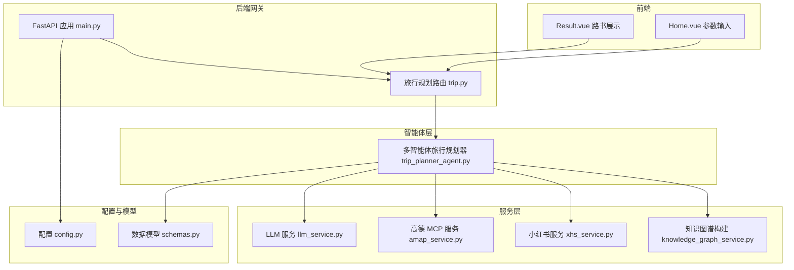
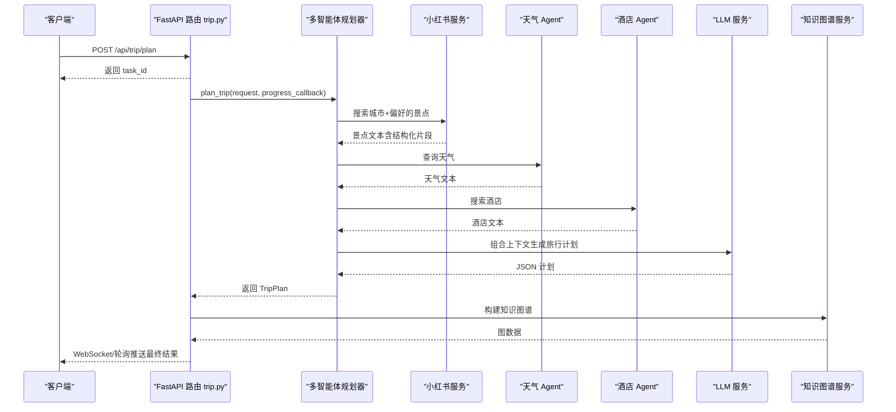
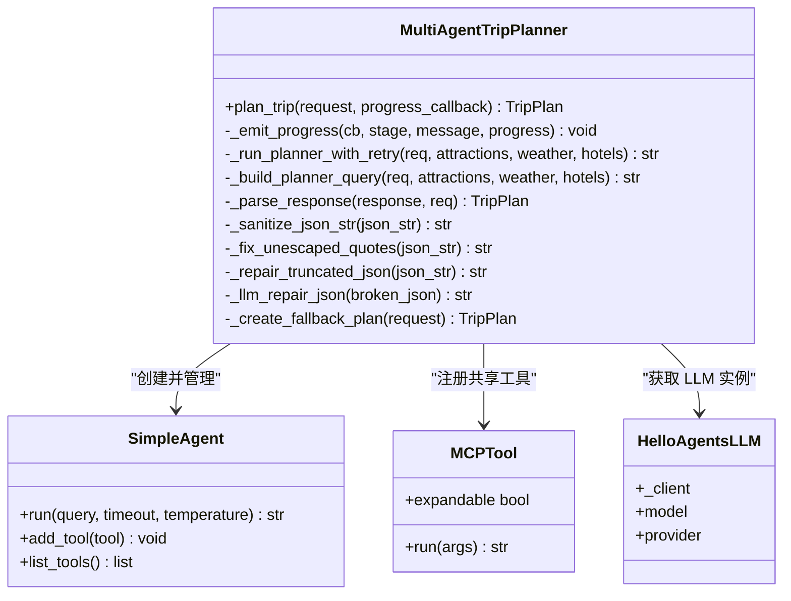
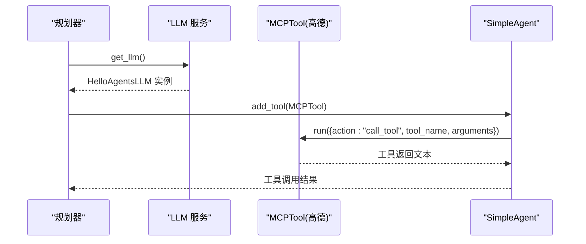
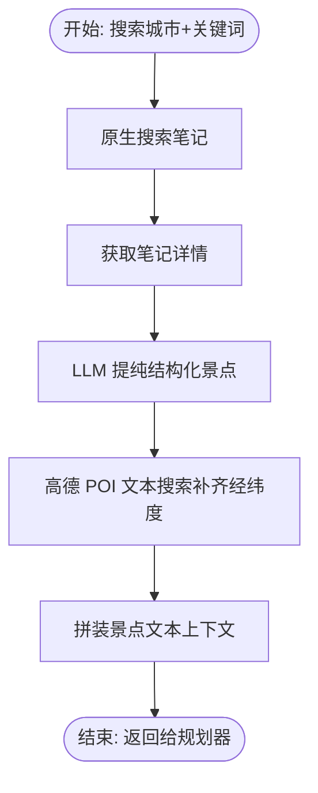
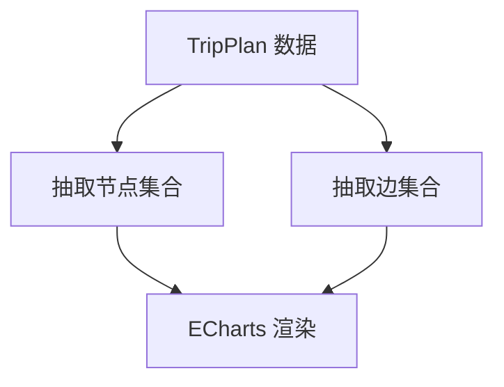
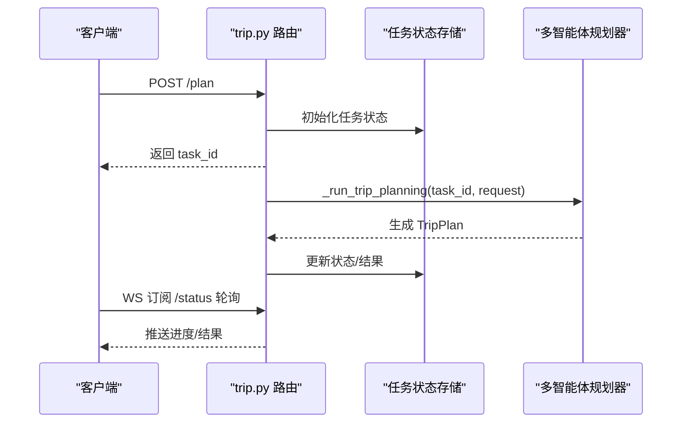
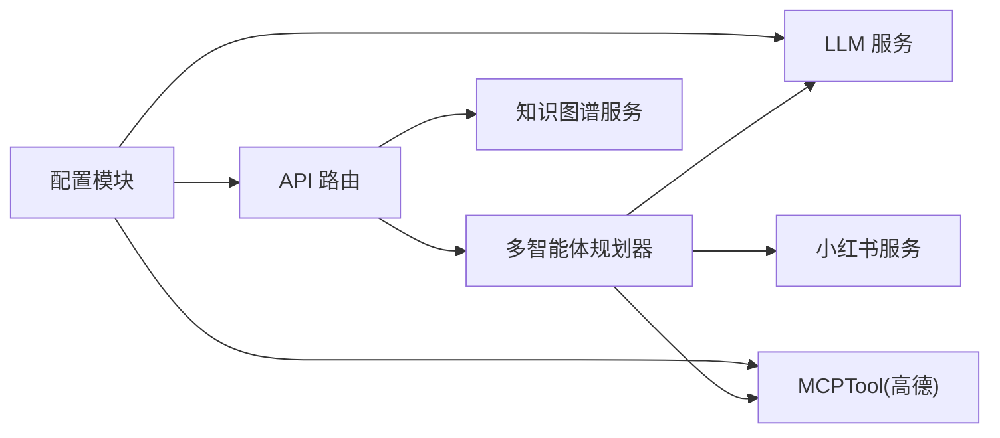

# Agent 扩展开发

<cite>
**本文引用的文件**
- [trip_planner_agent.py](file://backend/app/agents/trip_planner_agent.py)
- [config.py](file://backend/app/config.py)
- [main.py](file://backend/app/api/main.py)
- [llm_service.py](file://backend/app/services/llm_service.py)
- [amap_service.py](file://backend/app/services/amap_service.py)
- [schemas.py](file://backend/app/models/schemas.py)
- [trip.py](file://backend/app/api/routes/trip.py)
- [xhs_service.py](file://backend/app/services/xhs_service.py)
- [knowledge_graph_service.py](file://backend/app/services/knowledge_graph_service.py)
- [run.py](file://backend/run.py)
- [README.md](file://README.md)
</cite>

## 目录
1. [简介](#简介)
2. [项目结构](#项目结构)
3. [核心组件](#核心组件)
4. [架构总览](#架构总览)
5. [详细组件分析](#详细组件分析)
6. [依赖分析](#依赖分析)
7. [性能考量](#性能考量)
8. [故障排查指南](#故障排查指南)
9. [结论](#结论)
10. [附录](#附录)

## 简介
本指南面向希望在 TripStar 多智能体系统中扩展新 Agent 的开发者，围绕以下目标展开：
- 如何创建新的智能体类，包括智能体的基本结构、生命周期管理、状态转换等
- 智能体与工具（Tool）的集成方式，包括工具的注册、调用、参数传递等
- 智能体间的协作机制，包括任务分配、结果共享、冲突解决等
- 智能体配置与参数化，包括环境变量、配置文件、运行时参数等
- 智能体的调试与测试方法，包括单元测试、集成测试、性能测试等
- 提供从简单问答智能体到复杂多步骤规划智能体的开发示例与最佳实践

## 项目结构
后端采用标准的前后端分离架构，核心由 FastAPI 提供 API 网关，多智能体在 Agent 层编排，服务层负责与外部工具（LLM、高德地图、小红书）交互。

图表来源
- [main.py:24-61](file://backend/app/api/main.py#L24-L61)
- [trip.py:17-61](file://backend/app/api/routes/trip.py#L17-L61)
- [trip_planner_agent.py:173-242](file://backend/app/agents/trip_planner_agent.py#L173-L242)
- [llm_service.py:12-67](file://backend/app/services/llm_service.py#L12-L67)
- [amap_service.py:12-47](file://backend/app/services/amap_service.py#L12-L47)
- [xhs_service.py:247-354](file://backend/app/services/xhs_service.py#L247-L354)
- [knowledge_graph_service.py:34-168](file://backend/app/services/knowledge_graph_service.py#L34-L168)
- [config.py:21-71](file://backend/app/config.py#L21-L71)
- [schemas.py:10-264](file://backend/app/models/schemas.py#L10-L264)

章节来源
- [README.md:43-97](file://README.md#L43-L97)
- [main.py:24-61](file://backend/app/api/main.py#L24-L61)
- [trip.py:17-61](file://backend/app/api/routes/trip.py#L17-L61)

## 核心组件
- 多智能体旅行规划器：负责创建天气、酒店、小红书景点等子智能体，协调并行/串行执行，最终整合生成旅行计划
- LLM 服务：统一管理 LLM 客户端，支持单例、超时与 UA 伪装
- 高德 MCP 服务：封装高德地图工具集，提供 POI、天气、路线、地理编码等能力
- 小红书服务：原生签名直连小红书 API，进行笔记搜索、详情抓取、LLM 提纯、图片搜索
- 知识图谱服务：将旅行计划转换为 ECharts 可视化图数据
- 配置与模型：集中管理运行时配置、CORS、LLM 参数，以及旅行计划的数据模型

章节来源
- [trip_planner_agent.py:173-242](file://backend/app/agents/trip_planner_agent.py#L173-L242)
- [llm_service.py:12-67](file://backend/app/services/llm_service.py#L12-L67)
- [amap_service.py:12-47](file://backend/app/services/amap_service.py#L12-L47)
- [xhs_service.py:247-354](file://backend/app/services/xhs_service.py#L247-L354)
- [knowledge_graph_service.py:34-168](file://backend/app/services/knowledge_graph_service.py#L34-L168)
- [config.py:21-71](file://backend/app/config.py#L21-L71)
- [schemas.py:10-264](file://backend/app/models/schemas.py#L10-L264)

## 架构总览
多智能体系统通过主控 Agent 协调多个专业 Agent 完成旅行规划任务。系统采用异步任务队列与 WebSocket 推送，确保长耗时 LLM 生成过程的稳定与可观测性。

图表来源
- [trip.py:276-388](file://backend/app/api/routes/trip.py#L276-L388)
- [trip_planner_agent.py:257-338](file://backend/app/agents/trip_planner_agent.py#L257-L338)
- [xhs_service.py:247-354](file://backend/app/services/xhs_service.py#L247-L354)
- [llm_service.py:12-67](file://backend/app/services/llm_service.py#L12-L67)
- [knowledge_graph_service.py:34-168](file://backend/app/services/knowledge_graph_service.py#L34-L168)

## 详细组件分析

### 多智能体旅行规划器（Agent 编排核心）
- 初始化与工具注册：创建共享的 MCPTool（高德地图），注册到天气与酒店 Agent；行程规划 Agent 不依赖工具
- 并发优化：景点/天气/酒店三阶段通过并发执行，降低总耗时
- 超时与重试：规划阶段使用更长超时并在超时后重试一次
- JSON 容错解析：提供多轮清洗与修复策略，必要时使用 LLM 修复 JSON
- 回调进度：支持同步/异步进度回调，便于前端实时反馈

图表来源
- [trip_planner_agent.py:173-242](file://backend/app/agents/trip_planner_agent.py#L173-L242)
- [trip_planner_agent.py:257-338](file://backend/app/agents/trip_planner_agent.py#L257-L338)
- [trip_planner_agent.py:354-387](file://backend/app/agents/trip_planner_agent.py#L354-L387)
- [trip_planner_agent.py:424-466](file://backend/app/agents/trip_planner_agent.py#L424-L466)
- [trip_planner_agent.py:650-758](file://backend/app/agents/trip_planner_agent.py#L650-L758)
- [llm_service.py:12-67](file://backend/app/services/llm_service.py#L12-L67)

章节来源
- [trip_planner_agent.py:173-242](file://backend/app/agents/trip_planner_agent.py#L173-L242)
- [trip_planner_agent.py:257-338](file://backend/app/agents/trip_planner_agent.py#L257-L338)
- [trip_planner_agent.py:354-387](file://backend/app/agents/trip_planner_agent.py#L354-L387)
- [trip_planner_agent.py:424-466](file://backend/app/agents/trip_planner_agent.py#L424-L466)
- [trip_planner_agent.py:650-758](file://backend/app/agents/trip_planner_agent.py#L650-L758)

### LLM 服务与工具集成
- LLM 单例：统一管理模型、API Key、Base URL、超时与 UA 伪装
- 工具集成：通过 MCPTool 将高德地图工具集注册到 Agent，实现“提示词内工具调用”
- 超时与重试：规划阶段延长超时并允许重试，提升稳定性

图表来源
- [llm_service.py:12-67](file://backend/app/services/llm_service.py#L12-L67)
- [trip_planner_agent.py:184-196](file://backend/app/agents/trip_planner_agent.py#L184-L196)
- [amap_service.py:12-47](file://backend/app/services/amap_service.py#L12-L47)

章节来源
- [llm_service.py:12-67](file://backend/app/services/llm_service.py#L12-L67)
- [amap_service.py:12-47](file://backend/app/services/amap_service.py#L12-L47)
- [trip_planner_agent.py:184-196](file://backend/app/agents/trip_planner_agent.py#L184-L196)

### 小红书服务与数据提纯
- 原生签名直连 API：绕过风控拦截，稳定获取笔记与详情
- LLM 提纯：从长文本游记中提取结构化景点清单（名称、理由、时长、预约等）
- 地理编码补齐：对景点名称进行高德 POI 文本搜索，补齐经纬度
- 图片搜索：按关键词搜索首图 URL，供前端展示

图表来源
- [xhs_service.py:247-354](file://backend/app/services/xhs_service.py#L247-L354)
- [xhs_service.py:203-224](file://backend/app/services/xhs_service.py#L203-L224)

章节来源
- [xhs_service.py:247-354](file://backend/app/services/xhs_service.py#L247-L354)
- [xhs_service.py:203-224](file://backend/app/services/xhs_service.py#L203-L224)

### 知识图谱构建
- 从旅行计划中抽取节点与边，生成 ECharts 可视化数据
- 节点分类与颜色：城市、日程、景点、酒店、餐饮、天气、预算、偏好/建议
- 边关系：行程、游览、下一站、入住、早餐/午餐/晚餐、天气、预算、建议

图表来源
- [knowledge_graph_service.py:34-168](file://backend/app/services/knowledge_graph_service.py#L34-L168)

章节来源
- [knowledge_graph_service.py:34-168](file://backend/app/services/knowledge_graph_service.py#L34-L168)

### API 路由与任务系统
- 异步任务：提交后立即返回 task_id，后台执行并持久化状态
- WebSocket 与轮询：前端可实时订阅任务进度，或轮询查询状态
- 健康检查：对外暴露服务健康状态与 Agent 工具数量

图表来源
- [trip.py:276-388](file://backend/app/api/routes/trip.py#L276-L388)
- [trip.py:390-440](file://backend/app/api/routes/trip.py#L390-L440)
- [trip.py:455-488](file://backend/app/api/routes/trip.py#L455-L488)

章节来源
- [trip.py:276-388](file://backend/app/api/routes/trip.py#L276-L388)
- [trip.py:390-440](file://backend/app/api/routes/trip.py#L390-L440)
- [trip.py:455-488](file://backend/app/api/routes/trip.py#L455-L488)

## 依赖分析
- 组件耦合：Agent 依赖 LLM 与工具（MCPTool），服务层提供外部能力；API 路由负责任务编排与状态管理
- 外部依赖：高德地图 MCP 服务、小红书原生 API、LLM 提供商
- 配置依赖：通过配置模块集中管理运行时参数，支持环境变量与运行时覆盖

图表来源
- [trip_planner_agent.py:173-242](file://backend/app/agents/trip_planner_agent.py#L173-L242)
- [llm_service.py:12-67](file://backend/app/services/llm_service.py#L12-L67)
- [amap_service.py:12-47](file://backend/app/services/amap_service.py#L12-L47)
- [xhs_service.py:247-354](file://backend/app/services/xhs_service.py#L247-L354)
- [trip.py:276-388](file://backend/app/api/routes/trip.py#L276-L388)
- [knowledge_graph_service.py:34-168](file://backend/app/services/knowledge_graph_service.py#L34-L168)
- [config.py:21-71](file://backend/app/config.py#L21-L71)

章节来源
- [config.py:21-71](file://backend/app/config.py#L21-L71)
- [trip_planner_agent.py:173-242](file://backend/app/agents/trip_planner_agent.py#L173-L242)
- [llm_service.py:12-67](file://backend/app/services/llm_service.py#L12-L67)
- [amap_service.py:12-47](file://backend/app/services/amap_service.py#L12-L47)
- [xhs_service.py:247-354](file://backend/app/services/xhs_service.py#L247-L354)
- [trip.py:276-388](file://backend/app/api/routes/trip.py#L276-L388)
- [knowledge_graph_service.py:34-168](file://backend/app/services/knowledge_graph_service.py#L34-L168)

## 性能考量
- 并发执行：景点/天气/酒店三阶段并发，显著缩短总耗时
- 超时与重试：规划阶段延长超时并允许重试，提升成功率
- JSON 容错：多轮清洗与修复策略，减少因 LLM 输出不稳定导致的失败
- 任务持久化：将任务状态持久化到磁盘，服务重启后可恢复（处理中任务标记失败）

章节来源
- [trip_planner_agent.py:257-338](file://backend/app/agents/trip_planner_agent.py#L257-L338)
- [trip_planner_agent.py:354-387](file://backend/app/agents/trip_planner_agent.py#L354-L387)
- [trip_planner_agent.py:424-466](file://backend/app/agents/trip_planner_agent.py#L424-L466)
- [trip.py:82-104](file://backend/app/api/routes/trip.py#L82-L104)

## 故障排查指南
- 配置校验：检查 LLM API Key、高德地图 Key、小红书 Cookie 是否配置
- LLM 超时：适当提高 LLM 超时或规划阶段超时；必要时启用重试
- JSON 解析失败：确认提示词严格遵循工具调用格式；启用多轮清洗与 LLM 修复
- 小红书风控：Cookie 过期会抛出特定异常，需更新 Cookie
- 任务状态：通过 /api/trip/status/{task_id} 或 WebSocket 查看进度与错误信息

章节来源
- [config.py:163-179](file://backend/app/config.py#L163-L179)
- [trip_planner_agent.py:354-387](file://backend/app/agents/trip_planner_agent.py#L354-L387)
- [trip_planner_agent.py:650-758](file://backend/app/agents/trip_planner_agent.py#L650-L758)
- [xhs_service.py:22-25](file://backend/app/services/xhs_service.py#L22-L25)
- [trip.py:455-488](file://backend/app/api/routes/trip.py#L455-L488)

## 结论
本指南提供了在 TripStar 中扩展 Agent 的系统化方法，涵盖从 Agent 设计、工具集成、任务编排到配置管理与故障排查的全流程。通过参考现有实现，开发者可以快速创建从简单问答到复杂多步骤规划的智能体，并在生产环境中保持高可靠与高性能。

## 附录

### Agent 开发示例（从简单到复杂）
- 简单问答智能体
  - 目标：接收用户问题，直接调用 LLM 返回答案
  - 关键点：创建 SimpleAgent，注入 LLM，编写简洁提示词，无需工具
  - 参考实现路径：[llm_service.py:12-67](file://backend/app/services/llm_service.py#L12-L67)
- 景点搜索智能体
  - 目标：根据城市与偏好搜索景点，使用高德工具
  - 关键点：注册 MCPTool，提示词中严格输出工具调用格式，解析工具返回
  - 参考实现路径：[trip_planner_agent.py:15-80](file://backend/app/agents/trip_planner_agent.py#L15-L80), [amap_service.py:12-47](file://backend/app/services/amap_service.py#L12-L47)
- 天气查询智能体
  - 目标：查询指定城市的天气
  - 关键点：与景点搜索类似，但工具不同
  - 参考实现路径：[trip_planner_agent.py:38-59](file://backend/app/agents/trip_planner_agent.py#L38-L59), [amap_service.py:93-121](file://backend/app/services/amap_service.py#L93-L121)
- 酒店推荐智能体
  - 目标：根据城市与偏好推荐酒店
  - 关键点：提示词中严格输出工具调用格式
  - 参考实现路径：[trip_planner_agent.py:61-80](file://backend/app/agents/trip_planner_agent.py#L61-L80), [amap_service.py:57-92](file://backend/app/services/amap_service.py#L57-L92)
- 复杂多步骤规划智能体
  - 目标：整合景点、天气、酒店信息，生成旅行计划
  - 关键点：并发执行三阶段，规划阶段延长超时并重试，多轮 JSON 清洗与修复
  - 参考实现路径：[trip_planner_agent.py:257-338](file://backend/app/agents/trip_planner_agent.py#L257-L338), [trip_planner_agent.py:354-387](file://backend/app/agents/trip_planner_agent.py#L354-L387), [trip_planner_agent.py:424-466](file://backend/app/agents/trip_planner_agent.py#L424-L466)

### 智能体配置与参数化
- 环境变量：通过 .env 文件配置 LLM、高德地图、小红书等关键参数
- 运行时参数：支持通过前端设置页更新并持久化运行时配置
- 配置同步：将运行时配置同步到环境变量，兼容第三方组件

章节来源
- [config.py:11-18](file://backend/app/config.py#L11-L18)
- [config.py:146-159](file://backend/app/config.py#L146-L159)
- [config.py:104-122](file://backend/app/config.py#L104-L122)

### 调试与测试方法
- 单元测试：针对 JSON 清洗、地理编码、知识图谱构建等模块编写单元测试
- 集成测试：通过 API 路由提交任务，验证 WebSocket/轮询进度与最终结果
- 性能测试：模拟高并发任务提交，观察任务队列与响应时间

章节来源
- [trip.py:276-388](file://backend/app/api/routes/trip.py#L276-L388)
- [trip.py:390-440](file://backend/app/api/routes/trip.py#L390-L440)
- [trip.py:455-488](file://backend/app/api/routes/trip.py#L455-L488)

### 最佳实践
- 代码结构：按功能分层（API、Agent、Service、Model、Config），保持高内聚低耦合
- 错误处理：区分致命错误与可恢复错误，提供清晰的错误信息与回退策略
- 日志记录：在关键节点输出进度与错误日志，便于问题定位
- 工具调用：严格遵循工具调用格式，避免格式污染导致解析失败
- 配置管理：集中管理配置，支持环境变量与运行时覆盖，确保一致性

章节来源
- [trip_planner_agent.py:243-256](file://backend/app/agents/trip_planner_agent.py#L243-L256)
- [trip_planner_agent.py:424-466](file://backend/app/agents/trip_planner_agent.py#L424-L466)
- [trip_planner_agent.py:650-758](file://backend/app/agents/trip_planner_agent.py#L650-L758)
- [config.py:163-179](file://backend/app/config.py#L163-L179)