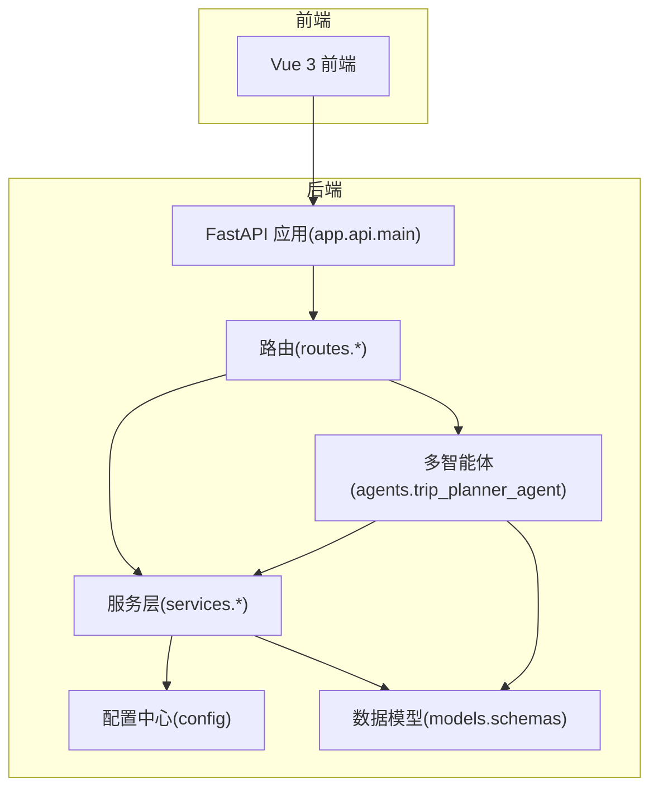
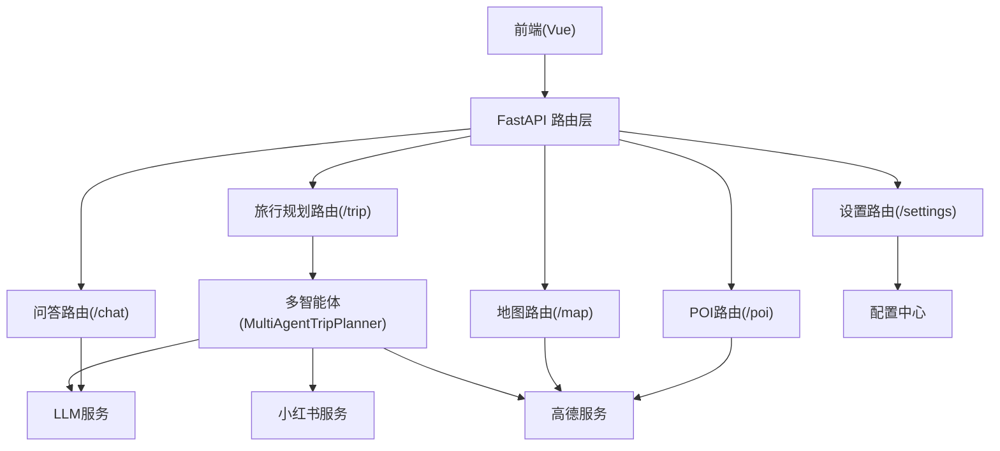
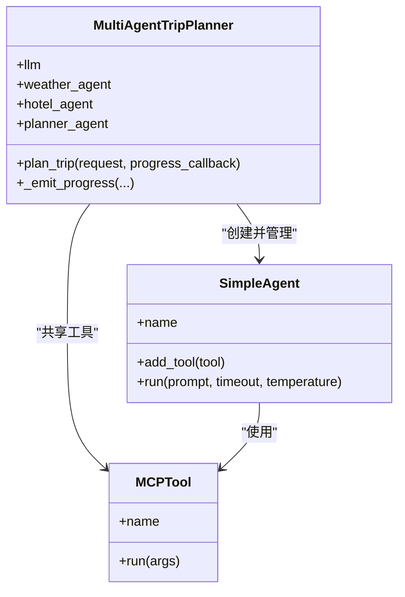
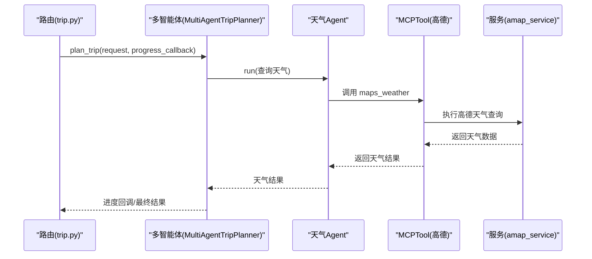
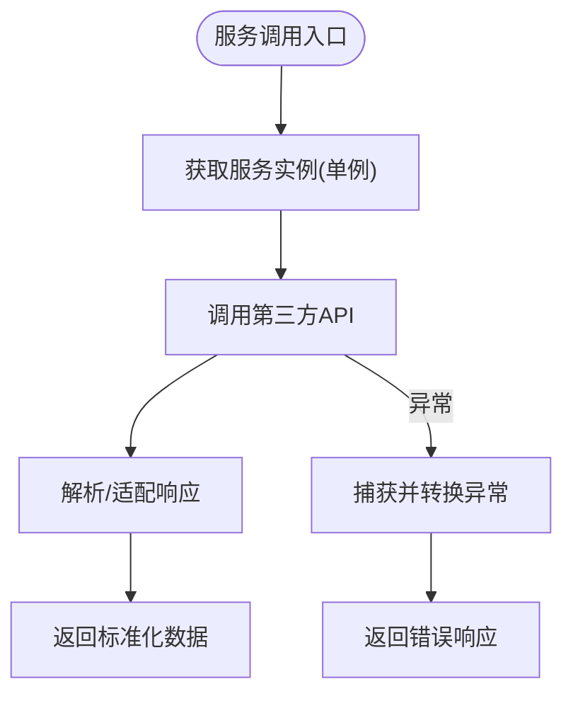
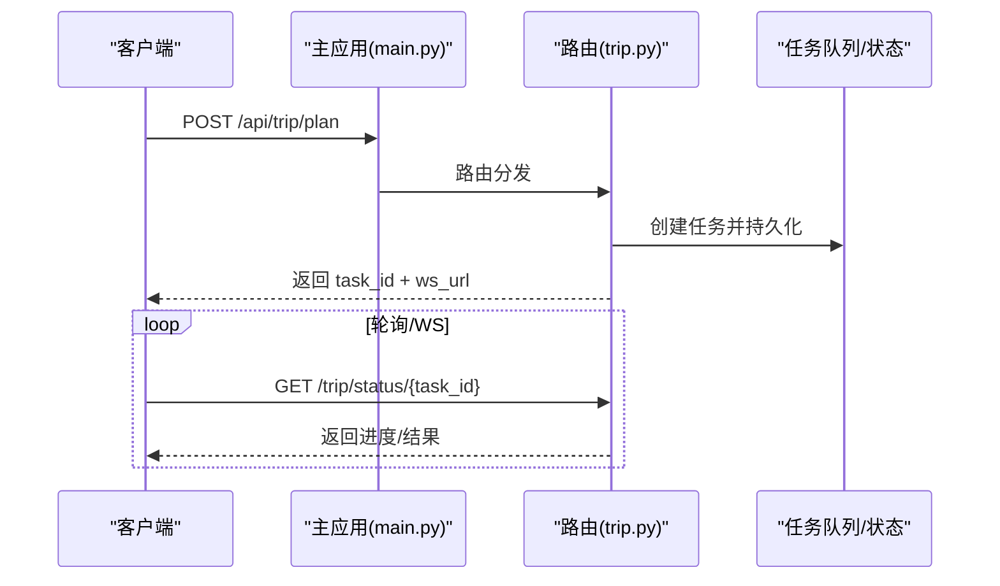
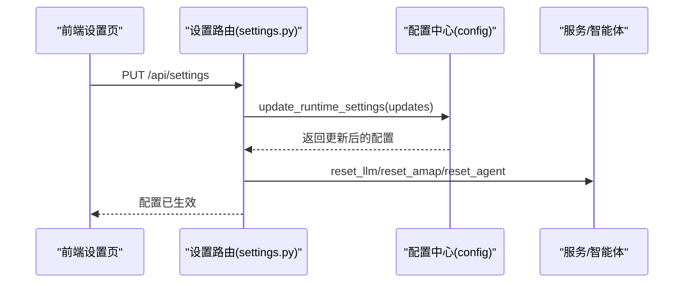
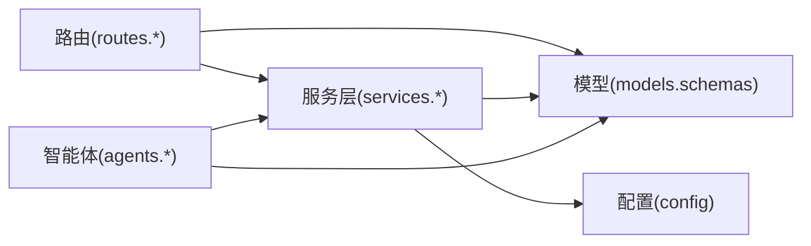

# 扩展开发

<cite>
**本文引用的文件**
- [README.md](file://README.md)
- [backend/app/config.py](file://backend/app/config.py)
- [backend/app/api/main.py](file://backend/app/api/main.py)
- [backend/run.py](file://backend/run.py)
- [backend/app/models/schemas.py](file://backend/app/models/schemas.py)
- [backend/app/agents/trip_planner_agent.py](file://backend/app/agents/trip_planner_agent.py)
- [backend/app/api/routes/trip.py](file://backend/app/api/routes/trip.py)
- [backend/app/api/routes/poi.py](file://backend/app/api/routes/poi.py)
- [backend/app/api/routes/chat.py](file://backend/app/api/routes/chat.py)
- [backend/app/api/routes/map.py](file://backend/app/api/routes/map.py)
- [backend/app/api/routes/settings.py](file://backend/app/api/routes/settings.py)
- [backend/app/services/xhs_service.py](file://backend/app/services/xhs_service.py)
- [backend/app/services/amap_service.py](file://backend/app/services/amap_service.py)
- [backend/app/services/knowledge_graph_service.py](file://backend/app/services/knowledge_graph_service.py)
- [backend/app/services/llm_service.py](file://backend/app/services/llm_service.py)
</cite>

## 目录
1. [简介](#简介)
2. [项目结构](#项目结构)
3. [核心组件](#核心组件)
4. [架构总览](#架构总览)
5. [详细组件分析](#详细组件分析)
6. [依赖分析](#依赖分析)
7. [性能考量](#性能考量)
8. [故障排查指南](#故障排查指南)
9. [结论](#结论)
10. [附录](#附录)

## 简介
本指南面向希望在 TripStar 项目基础上进行扩展开发的工程师，围绕多智能体系统、工具扩展、服务层扩展、API 接口扩展、插件系统扩展点、自定义功能开发等方面提供系统化的方法论与最佳实践。文档结合现有代码结构，给出可操作的扩展步骤、示例与模板路径，帮助开发者快速落地。

## 项目结构
- 后端采用前后端分离架构，前端为 Vue 3 应用，后端为 FastAPI 应用，核心业务由多智能体协作与服务层封装构成。
- 关键模块划分：
  - 配置中心：集中管理运行时配置与环境变量，支持运行时更新与持久化。
  - API 层：统一注册路由，提供旅行规划、POI/地图、问答、设置等接口。
  - 服务层：封装第三方服务（高德地图、小红书、LLM），提供稳定抽象与单例管理。
  - 模型层：Pydantic 数据模型，统一请求/响应结构。
  - 智能体层：多智能体编排与任务生命周期管理，支持并发优化与进度回调。

图表来源
- [backend/app/api/main.py:24-61](file://backend/app/api/main.py#L24-L61)
- [backend/app/config.py:21-71](file://backend/app/config.py#L21-L71)
- [backend/app/models/schemas.py:10-264](file://backend/app/models/schemas.py#L10-L264)
- [backend/app/agents/trip_planner_agent.py:173-242](file://backend/app/agents/trip_planner_agent.py#L173-L242)
- [backend/app/services/amap_service.py:50-276](file://backend/app/services/amap_service.py#L50-L276)
- [backend/app/services/xhs_service.py:68-198](file://backend/app/services/xhs_service.py#L68-L198)

章节来源
- [README.md:43-97](file://README.md#L43-L97)
- [backend/app/api/main.py:24-61](file://backend/app/api/main.py#L24-L61)

## 核心组件
- 配置中心：集中读取环境变量，支持运行时覆盖与持久化，提供校验与调试打印。
- 多智能体系统：包含天气、酒店、行程规划等 Agent，统一通过 MCPTool 注册高德地图工具，支持并发执行与进度回调。
- 服务层：封装 LLM、高德地图、小红书等第三方能力，提供单例与重置机制，便于运行时配置更新。
- API 路由：统一注册旅行规划、POI/地图、问答、设置等路由，支持 WebSocket 实时状态推送与轮询兼容。
- 数据模型：统一请求/响应结构，保障前后端契约稳定。

章节来源
- [backend/app/config.py:21-202](file://backend/app/config.py#L21-L202)
- [backend/app/agents/trip_planner_agent.py:173-242](file://backend/app/agents/trip_planner_agent.py#L173-L242)
- [backend/app/services/llm_service.py:12-75](file://backend/app/services/llm_service.py#L12-L75)
- [backend/app/services/amap_service.py:50-276](file://backend/app/services/amap_service.py#L50-L276)
- [backend/app/services/xhs_service.py:247-354](file://backend/app/services/xhs_service.py#L247-L354)
- [backend/app/api/routes/trip.py:276-388](file://backend/app/api/routes/trip.py#L276-L388)
- [backend/app/models/schemas.py:10-264](file://backend/app/models/schemas.py#L10-L264)

## 架构总览
下图展示了前端、后端、多智能体与服务层之间的交互关系，以及旅行规划任务的异步执行与状态推送机制。

图表来源
- [backend/app/api/main.py:55-60](file://backend/app/api/main.py#L55-L60)
- [backend/app/api/routes/trip.py:315-388](file://backend/app/api/routes/trip.py#L315-L388)
- [backend/app/agents/trip_planner_agent.py:173-242](file://backend/app/agents/trip_planner_agent.py#L173-L242)
- [backend/app/services/amap_service.py:50-276](file://backend/app/services/amap_service.py#L50-L276)
- [backend/app/services/xhs_service.py:247-354](file://backend/app/services/xhs_service.py#L247-L354)
- [backend/app/services/llm_service.py:12-75](file://backend/app/services/llm_service.py#L12-L75)
- [backend/app/api/routes/settings.py:37-55](file://backend/app/api/routes/settings.py#L37-L55)

## 详细组件分析

### 多智能体系统扩展
- 新增 Agent 的步骤
  - 在智能体层新增 Agent 类，定义系统提示词与职责边界。
  - 在多智能体编排类中注册新 Agent，并为其绑定所需工具（如 MCPTool）。
  - 在旅行规划流程中调用新 Agent，或将新 Agent 作为子流程参与。
  - 通过进度回调上报新阶段的执行状态，保持前端可观测性。
- Agent 间协作机制
  - 通过共享 LLM 实例与工具集合，实现跨 Agent 的能力复用。
  - 使用并发策略（如 asyncio.gather）优化耗时任务，串行依赖任务保持顺序。
  - 通过统一的提示词格式与工具调用约定，降低耦合度。
- Agent 生命周期管理
  - 初始化阶段：加载配置、创建工具、注册 Agent。
  - 执行阶段：接收请求、调用工具、处理结果、解析 JSON。
  - 失败回退：提供备用计划与错误恢复策略。
- 示例与模板参考
  - 新增 Agent 的注册与工具绑定可参考现有天气与酒店 Agent 的实现。
  - 旅行规划流程与进度回调可参考多智能体编排类中的 plan_trip 与进度上报逻辑。

图表来源
- [backend/app/agents/trip_planner_agent.py:173-242](file://backend/app/agents/trip_planner_agent.py#L173-L242)
- [backend/app/agents/trip_planner_agent.py:257-339](file://backend/app/agents/trip_planner_agent.py#L257-L339)

章节来源
- [backend/app/agents/trip_planner_agent.py:173-242](file://backend/app/agents/trip_planner_agent.py#L173-L242)
- [backend/app/agents/trip_planner_agent.py:257-339](file://backend/app/agents/trip_planner_agent.py#L257-L339)

### 工具扩展（Tool）
- 自定义工具开发
  - 基于 MCPTool 封装第三方能力，统一 action 与参数格式。
  - 在工具初始化时注入环境变量（如 API Key），确保运行时可配置。
  - 通过 auto_expand 选项将子工具自动注册到 Agent，减少硬编码。
- 第三方服务集成
  - 高德地图：通过 MCPTool 调用 maps_text_search、maps_weather 等工具。
  - 小红书：通过原生签名客户端直连 API，规避风控拦截。
- 工具注册与调用
  - 在服务层创建工具单例，提供 reset 机制以便运行时更新。
  - 在 Agent 中 add_tool 注册工具，按约定格式调用。

图表来源
- [backend/app/api/routes/trip.py:315-388](file://backend/app/api/routes/trip.py#L315-L388)
- [backend/app/agents/trip_planner_agent.py:300-307](file://backend/app/agents/trip_planner_agent.py#L300-L307)
- [backend/app/services/amap_service.py:93-120](file://backend/app/services/amap_service.py#L93-L120)

章节来源
- [backend/app/services/amap_service.py:12-47](file://backend/app/services/amap_service.py#L12-L47)
- [backend/app/services/amap_service.py:50-276](file://backend/app/services/amap_service.py#L50-L276)
- [backend/app/services/xhs_service.py:68-198](file://backend/app/services/xhs_service.py#L68-L198)

### 服务层扩展
- 新服务添加
  - 在 services 目录新增模块，封装第三方 API，提供单例工厂与 reset 方法。
  - 在路由中注入服务实例，暴露统一接口。
- 现有服务修改
  - 若需调整工具调用参数或返回结构，优先在服务层进行适配与解析。
  - 保持对外接口不变，内部实现可演进。
- 依赖关系处理
  - 服务层之间通过配置中心与模型层解耦，避免循环依赖。
  - 对外部服务的异常进行捕获与转换，向上抛出统一错误类型。

图表来源
- [backend/app/services/amap_service.py:50-276](file://backend/app/services/amap_service.py#L50-L276)
- [backend/app/services/xhs_service.py:247-354](file://backend/app/services/xhs_service.py#L247-L354)
- [backend/app/services/llm_service.py:12-75](file://backend/app/services/llm_service.py#L12-L75)

章节来源
- [backend/app/services/amap_service.py:50-276](file://backend/app/services/amap_service.py#L50-L276)
- [backend/app/services/xhs_service.py:247-354](file://backend/app/services/xhs_service.py#L247-L354)
- [backend/app/services/llm_service.py:12-75](file://backend/app/services/llm_service.py#L12-L75)

### API 接口扩展
- 新路由添加
  - 在 routes 目录新增模块，定义路由与响应模型。
  - 在主应用中注册路由，设置前缀与标签。
- 现有接口修改
  - 保持请求/响应模型稳定，必要时引入版本兼容策略。
  - 对历史任务与状态持久化进行兼容处理。
- 版本兼容性
  - 通过路由前缀区分版本，逐步迁移旧接口。
  - 对历史数据结构进行向后兼容解析。

图表来源
- [backend/app/api/main.py:55-60](file://backend/app/api/main.py#L55-L60)
- [backend/app/api/routes/trip.py:276-388](file://backend/app/api/routes/trip.py#L276-L388)

章节来源
- [backend/app/api/main.py:55-60](file://backend/app/api/main.py#L55-L60)
- [backend/app/api/routes/trip.py:276-388](file://backend/app/api/routes/trip.py#L276-L388)

### 插件系统与扩展点
- 配置扩展
  - 通过配置中心的运行时设置接口，支持前端动态更新并立即生效。
  - 更新后触发服务与智能体的 reset，确保新配置热生效。
- 中间件扩展
  - 通过 HTTP 中间件实现路径重写、CORS 等横切能力。
- 钩子机制
  - 在任务执行过程中通过进度回调实现“钩子”式的可观测性与可观测性扩展。

图表来源
- [backend/app/api/routes/settings.py:37-55](file://backend/app/api/routes/settings.py#L37-L55)
- [backend/app/config.py:146-159](file://backend/app/config.py#L146-L159)
- [backend/app/services/llm_service.py:70-75](file://backend/app/services/llm_service.py#L70-L75)
- [backend/app/services/amap_service.py:271-276](file://backend/app/services/amap_service.py#L271-L276)
- [backend/app/agents/trip_planner_agent.py:173-242](file://backend/app/agents/trip_planner_agent.py#L173-L242)

章节来源
- [backend/app/api/routes/settings.py:37-55](file://backend/app/api/routes/settings.py#L37-L55)
- [backend/app/config.py:146-159](file://backend/app/config.py#L146-L159)

### 自定义功能开发
- 前端组件
  - 在 src/components 中新增可复用组件，遵循现有命名与样式规范。
  - 通过 i18n 管理多语言文案，确保国际化一致性。
- 数据模型
  - 在 models.schemas 中新增或扩展 Pydantic 模型，保持与后端契约一致。
- 业务逻辑
  - 在 services 中封装新能力，提供单例与重置机制。
  - 在 routes 中暴露接口，确保错误处理与状态持久化。

章节来源
- [backend/app/models/schemas.py:10-264](file://backend/app/models/schemas.py#L10-L264)
- [backend/app/services/knowledge_graph_service.py:34-169](file://backend/app/services/knowledge_graph_service.py#L34-L169)

## 依赖分析
- 组件耦合
  - 路由层仅依赖服务层与模型层，低耦合高内聚。
  - 服务层通过配置中心与模型层解耦第三方依赖。
  - 智能体层通过工具抽象与服务层解耦。
- 外部依赖
  - 高德地图 MCP 工具、小红书原生 API、LLM 提供商。
- 循环依赖
  - 通过模块拆分与延迟导入避免循环依赖风险。

图表来源
- [backend/app/api/main.py:55-60](file://backend/app/api/main.py#L55-L60)
- [backend/app/models/schemas.py:10-264](file://backend/app/models/schemas.py#L10-L264)
- [backend/app/config.py:21-71](file://backend/app/config.py#L21-L71)
- [backend/app/agents/trip_planner_agent.py:173-242](file://backend/app/agents/trip_planner_agent.py#L173-L242)
- [backend/app/services/amap_service.py:50-276](file://backend/app/services/amap_service.py#L50-L276)
- [backend/app/services/xhs_service.py:247-354](file://backend/app/services/xhs_service.py#L247-L354)
- [backend/app/services/llm_service.py:12-75](file://backend/app/services/llm_service.py#L12-L75)

章节来源
- [backend/app/api/main.py:55-60](file://backend/app/api/main.py#L55-L60)

## 性能考量
- 并发优化：多智能体阶段 1-3 并行执行，显著缩短总耗时。
- 超时与重试：规划阶段设置较长超时并支持重试，提升稳定性。
- JSON 解析容错：提供多轮清洗与修复策略，降低 LLM 输出不稳定带来的失败率。
- 任务持久化：旅行规划任务状态持久化至磁盘，服务重启后可恢复，避免丢失。

章节来源
- [backend/app/agents/trip_planner_agent.py:264-267](file://backend/app/agents/trip_planner_agent.py#L264-L267)
- [backend/app/agents/trip_planner_agent.py:354-387](file://backend/app/agents/trip_planner_agent.py#L354-L387)
- [backend/app/agents/trip_planner_agent.py:424-602](file://backend/app/agents/trip_planner_agent.py#L424-L602)
- [backend/app/api/routes/trip.py:82-104](file://backend/app/api/routes/trip.py#L82-L104)

## 故障排查指南
- 配置问题
  - 检查配置中心的验证函数与打印信息，确认关键配置是否就绪。
- 小红书 Cookie 失效
  - 设置路由会捕获特定异常并返回前端友好提示。
- 任务状态异常
  - 服务重启后未完成任务会被标记为失败，避免前端无限等待。
- LLM/WAF 阻断
  - 服务层已注入浏览器 UA，降低被拦截概率。

章节来源
- [backend/app/config.py:163-179](file://backend/app/config.py#L163-L179)
- [backend/app/api/routes/trip.py:369-387](file://backend/app/api/routes/trip.py#L369-L387)
- [backend/app/api/routes/settings.py:37-55](file://backend/app/api/routes/settings.py#L37-L55)
- [backend/app/services/llm_service.py:51-61](file://backend/app/services/llm_service.py#L51-L61)

## 结论
通过模块化的设计与清晰的扩展点，TripStar 项目为多智能体系统、工具与服务层、API 接口与配置系统的扩展提供了稳健的基础设施。遵循本文档的扩展方法与最佳实践，可在不破坏既有契约的前提下快速迭代新功能。

## 附录
- 快速启动与开发
  - 后端：安装依赖、配置环境变量、启动 uvicorn。
  - 前端：安装依赖、配置环境变量、启动 Vite。
- 版本与兼容
  - 通过路由前缀与模型版本管理，确保接口演进的平滑过渡。
- 最佳实践清单
  - 代码规范：模块职责单一、命名一致、注释清晰。
  - 测试要求：单元测试覆盖关键服务与工具；集成测试覆盖端到端流程。
  - 文档编写：接口文档与变更日志同步更新，确保团队协作顺畅。

章节来源
- [README.md:129-200](file://README.md#L129-L200)
- [backend/run.py:6-15](file://backend/run.py#L6-L15)
- [backend/app/api/main.py:138-147](file://backend/app/api/main.py#L138-L147)