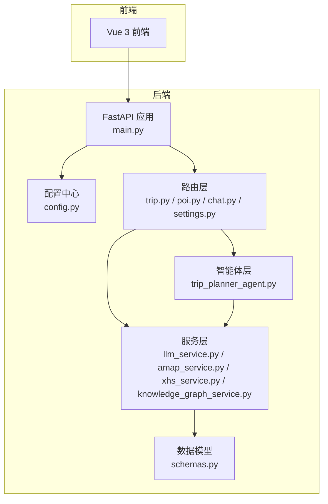
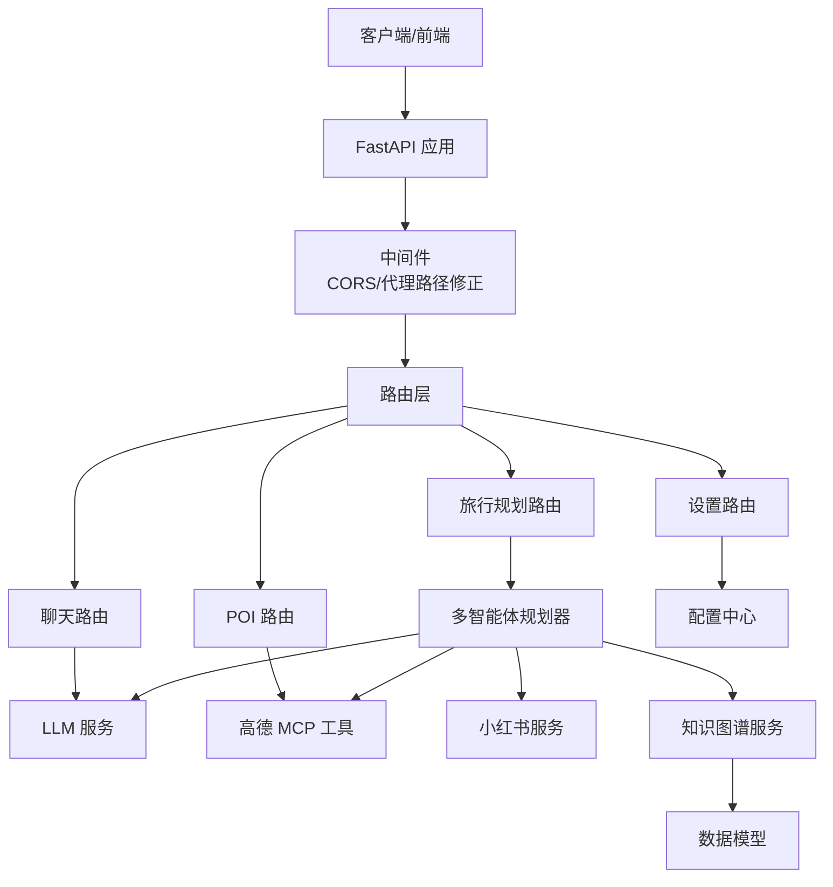
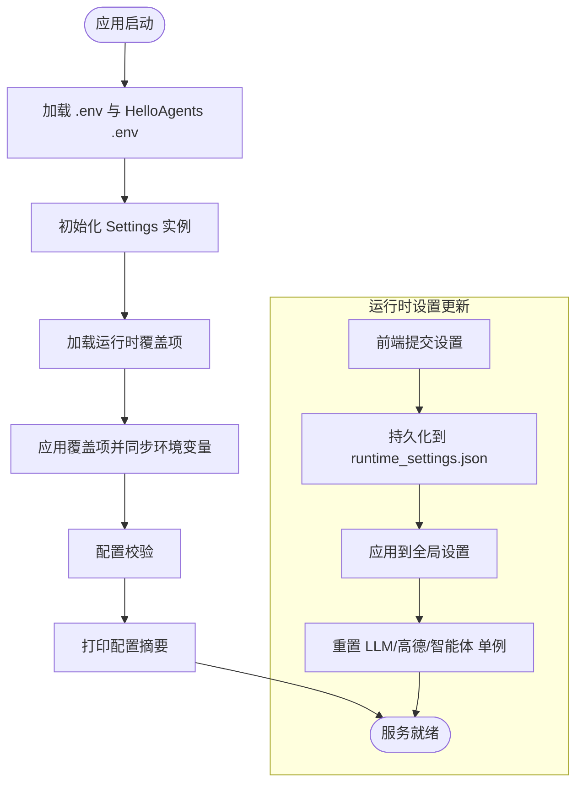
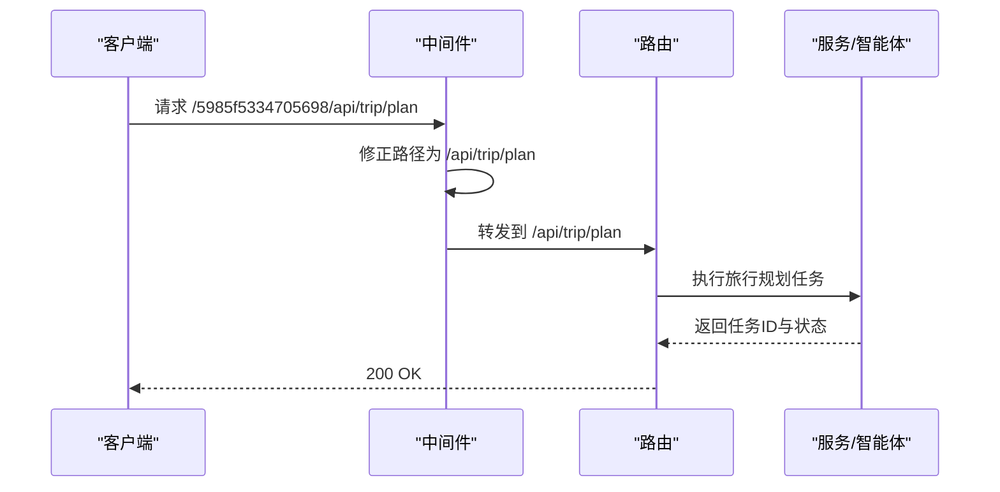
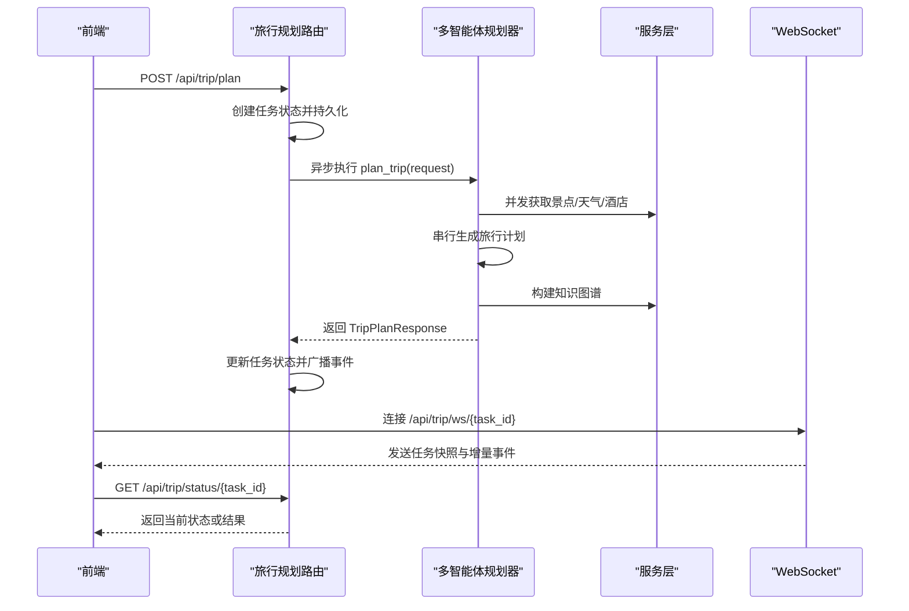
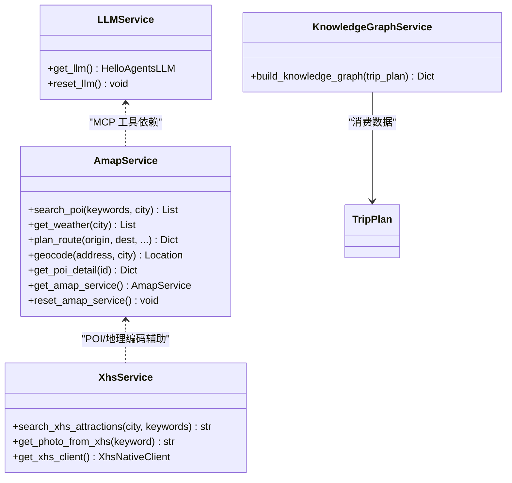
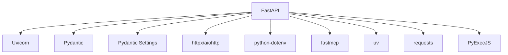

# 插件系统架构

<cite>
**本文档引用的文件**
- [README.md](file://README.md)
- [backend/app/__init__.py](file://backend/app/__init__.py)
- [backend/app/config.py](file://backend/app/config.py)
- [backend/run.py](file://backend/run.py)
- [backend/app/api/main.py](file://backend/app/api/main.py)
- [backend/app/api/routes/trip.py](file://backend/app/api/routes/trip.py)
- [backend/app/api/routes/poi.py](file://backend/app/api/routes/poi.py)
- [backend/app/api/routes/chat.py](file://backend/app/api/routes/chat.py)
- [backend/app/api/routes/settings.py](file://backend/app/api/routes/settings.py)
- [backend/app/agents/trip_planner_agent.py](file://backend/app/agents/trip_planner_agent.py)
- [backend/app/services/xhs_service.py](file://backend/app/services/xhs_service.py)
- [backend/app/services/amap_service.py](file://backend/app/services/amap_service.py)
- [backend/app/services/llm_service.py](file://backend/app/services/llm_service.py)
- [backend/app/services/knowledge_graph_service.py](file://backend/app/services/knowledge_graph_service.py)
- [backend/app/models/schemas.py](file://backend/app/models/schemas.py)
- [backend/package.json](file://backend/package.json)
- [backend/requirements.txt](file://backend/requirements.txt)
</cite>

## 目录
1. [简介](#简介)
2. [项目结构](#项目结构)
3. [核心组件](#核心组件)
4. [架构总览](#架构总览)
5. [详细组件分析](#详细组件分析)
6. [依赖分析](#依赖分析)
7. [性能考量](#性能考量)
8. [故障排查指南](#故障排查指南)
9. [结论](#结论)
10. [附录](#附录)

## 简介
本文件面向“TripStar 插件系统”的架构设计与实现，围绕模块解耦、功能扩展、配置管理、插件注册与发现、插件间通信与协作、配置与环境适配、生命周期管理、中间件与钩子机制、开发示例与最佳实践等方面进行系统化阐述。文档以项目现有代码为依据，结合 FastAPI 路由体系、HelloAgents 多智能体框架、MCP 工具协议与服务层封装，给出可操作的架构说明与实践建议。

## 项目结构
后端采用标准分层架构：API 层负责路由与中间件，服务层封装外部能力（LLM、地图、小红书等），模型层定义数据结构，智能体层组织多智能体协作。整体通过配置中心统一管理运行时参数，支持运行时热更新与持久化覆盖。

图表来源
- [backend/app/api/main.py:1-147](file://backend/app/api/main.py#L1-L147)
- [backend/app/config.py:1-202](file://backend/app/config.py#L1-L202)
- [backend/app/api/routes/trip.py:1-511](file://backend/app/api/routes/trip.py#L1-L511)
- [backend/app/api/routes/poi.py:1-133](file://backend/app/api/routes/poi.py#L1-L133)
- [backend/app/api/routes/chat.py:1-53](file://backend/app/api/routes/chat.py#L1-L53)
- [backend/app/api/routes/settings.py:1-56](file://backend/app/api/routes/settings.py#L1-L56)
- [backend/app/agents/trip_planner_agent.py:1-826](file://backend/app/agents/trip_planner_agent.py#L1-L826)
- [backend/app/services/llm_service.py:1-75](file://backend/app/services/llm_service.py#L1-L75)
- [backend/app/services/amap_service.py:1-276](file://backend/app/services/amap_service.py#L1-L276)
- [backend/app/services/xhs_service.py:1-444](file://backend/app/services/xhs_service.py#L1-L444)
- [backend/app/services/knowledge_graph_service.py:1-169](file://backend/app/services/knowledge_graph_service.py#L1-L169)
- [backend/app/models/schemas.py:1-264](file://backend/app/models/schemas.py#L1-L264)

章节来源
- [README.md:43-97](file://README.md#L43-L97)
- [backend/app/api/main.py:1-147](file://backend/app/api/main.py#L1-L147)
- [backend/app/config.py:1-202](file://backend/app/config.py#L1-L202)

## 核心组件
- 配置中心：集中管理应用、服务器、CORS、高德、小红书、LLM 等配置，支持运行时覆盖与持久化，兼容环境变量与 HelloAgents 的 .env。
- API 路由层：提供旅行规划、POI、聊天问答、设置管理等接口，内置 CORS、代理路径修正等中间件。
- 服务层：封装 LLM、高德 MCP、小红书原生签名客户端、知识图谱构建等能力，提供单例与重置机制以支持运行时热更新。
- 智能体层：基于 HelloAgents 的多智能体编排，使用 MCP 工具协议对接高德地图能力，结合 LLM 生成结构化旅行计划。
- 数据模型：统一定义旅行计划、POI、天气、预算、知识图谱等数据结构，保障前后端契约稳定。

章节来源
- [backend/app/config.py:21-202](file://backend/app/config.py#L21-L202)
- [backend/app/api/main.py:13-147](file://backend/app/api/main.py#L13-L147)
- [backend/app/api/routes/settings.py:1-56](file://backend/app/api/routes/settings.py#L1-L56)
- [backend/app/agents/trip_planner_agent.py:173-242](file://backend/app/agents/trip_planner_agent.py#L173-L242)
- [backend/app/services/llm_service.py:12-75](file://backend/app/services/llm_service.py#L12-L75)
- [backend/app/services/amap_service.py:12-276](file://backend/app/services/amap_service.py#L12-L276)
- [backend/app/services/xhs_service.py:68-199](file://backend/app/services/xhs_service.py#L68-L199)
- [backend/app/services/knowledge_graph_service.py:34-169](file://backend/app/services/knowledge_graph_service.py#L34-L169)
- [backend/app/models/schemas.py:10-264](file://backend/app/models/schemas.py#L10-L264)

## 架构总览
系统采用“路由-服务-智能体-模型”的分层设计，配合配置中心与运行时设置接口，形成可扩展、可热更新的插件化能力基座。MCP 工具协议与 HelloAgents 框架为插件化提供了天然的扩展点。

图表来源
- [backend/app/api/main.py:33-60](file://backend/app/api/main.py#L33-L60)
- [backend/app/api/routes/trip.py:1-511](file://backend/app/api/routes/trip.py#L1-L511)
- [backend/app/api/routes/poi.py:1-133](file://backend/app/api/routes/poi.py#L1-L133)
- [backend/app/api/routes/chat.py:1-53](file://backend/app/api/routes/chat.py#L1-L53)
- [backend/app/api/routes/settings.py:1-56](file://backend/app/api/routes/settings.py#L1-L56)
- [backend/app/agents/trip_planner_agent.py:173-242](file://backend/app/agents/trip_planner_agent.py#L173-L242)
- [backend/app/services/llm_service.py:12-75](file://backend/app/services/llm_service.py#L12-L75)
- [backend/app/services/amap_service.py:12-276](file://backend/app/services/amap_service.py#L12-L276)
- [backend/app/services/xhs_service.py:247-354](file://backend/app/services/xhs_service.py#L247-L354)
- [backend/app/services/knowledge_graph_service.py:34-169](file://backend/app/services/knowledge_graph_service.py#L34-L169)
- [backend/app/models/schemas.py:146-186](file://backend/app/models/schemas.py#L146-L186)

## 详细组件分析

### 配置管理与运行时设置
- 配置来源与优先级：项目目录 .env → HelloAgents .env（若存在）→ 环境变量覆盖。
- 运行时设置：支持前端设置页提交的键集合，持久化到 runtime_settings.json，并同步到环境变量以兼容第三方组件。
- 配置校验：启动时打印配置摘要并进行必要字段校验，输出警告提示。
- 设置热更新：设置变更后触发 LLM、高德、智能体单例重置，确保新配置立即生效。

图表来源
- [backend/app/config.py:83-160](file://backend/app/config.py#L83-L160)
- [backend/app/api/main.py:63-85](file://backend/app/api/main.py#L63-L85)
- [backend/app/api/routes/settings.py:27-56](file://backend/app/api/routes/settings.py#L27-L56)

章节来源
- [backend/app/config.py:21-202](file://backend/app/config.py#L21-L202)
- [backend/app/api/routes/settings.py:1-56](file://backend/app/api/routes/settings.py#L1-L56)
- [backend/app/api/main.py:63-85](file://backend/app/api/main.py#L63-L85)

### 路由与中间件
- 中间件：HTTP 中间件用于代理路径修正，解决云部署或前端代理在路径前拼接动态 ID 的问题。
- CORS：允许跨域来源、凭证、方法与头部。
- 路由：统一前缀 /api，包含旅行规划、POI、地图、聊天、设置等路由模块。
- SPA 回退：生产环境挂载前端静态资源并提供 SPA 路由回退。

图表来源
- [backend/app/api/main.py:33-60](file://backend/app/api/main.py#L33-L60)
- [backend/app/api/main.py:96-136](file://backend/app/api/main.py#L96-L136)

章节来源
- [backend/app/api/main.py:13-147](file://backend/app/api/main.py#L13-L147)

### 旅行规划与任务系统
- 异步任务：提交任务立即返回 task_id，后台使用 asyncio.create_task 执行，支持 WebSocket 与轮询两种状态订阅。
- 任务持久化：任务状态持久化到 JSON 文件，支持服务重启后加载与恢复策略。
- 任务事件：通过队列广播事件，支持订阅者断开与清理。
- 多智能体协作：并发收集景点、天气、酒店信息，串行生成旅行计划，最后构建知识图谱。

图表来源
- [backend/app/api/routes/trip.py:25-312](file://backend/app/api/routes/trip.py#L25-L312)
- [backend/app/api/routes/trip.py:315-388](file://backend/app/api/routes/trip.py#L315-L388)
- [backend/app/api/routes/trip.py:390-440](file://backend/app/api/routes/trip.py#L390-L440)
- [backend/app/api/routes/trip.py:442-488](file://backend/app/api/routes/trip.py#L442-L488)
- [backend/app/agents/trip_planner_agent.py:257-339](file://backend/app/agents/trip_planner_agent.py#L257-L339)
- [backend/app/services/knowledge_graph_service.py:34-169](file://backend/app/services/knowledge_graph_service.py#L34-L169)

章节来源
- [backend/app/api/routes/trip.py:1-511](file://backend/app/api/routes/trip.py#L1-L511)
- [backend/app/agents/trip_planner_agent.py:173-339](file://backend/app/agents/trip_planner_agent.py#L173-L339)

### 服务层与插件化扩展点
- LLM 服务：单例封装 HelloAgentsLLM，支持运行时重置与 UA 伪装，适配第三方 WAF。
- 高德 MCP 服务：通过 MCPTool 暴露 amap-mcp-server 工具集，自动展开为独立工具，支持 POI、天气、路线、地理编码等。
- 小红书服务：原生签名直连 edith.xiaohongshu.com，规避风控拦截；提供笔记搜索、详情提取、图片抓取与结构化提纯。
- 知识图谱服务：从旅行计划中抽取节点与边，生成 ECharts 可视化所需的数据结构。

图表来源
- [backend/app/services/llm_service.py:12-75](file://backend/app/services/llm_service.py#L12-L75)
- [backend/app/services/amap_service.py:50-276](file://backend/app/services/amap_service.py#L50-L276)
- [backend/app/services/xhs_service.py:68-444](file://backend/app/services/xhs_service.py#L68-L444)
- [backend/app/services/knowledge_graph_service.py:34-169](file://backend/app/services/knowledge_graph_service.py#L34-L169)

章节来源
- [backend/app/services/llm_service.py:1-75](file://backend/app/services/llm_service.py#L1-L75)
- [backend/app/services/amap_service.py:1-276](file://backend/app/services/amap_service.py#L1-L276)
- [backend/app/services/xhs_service.py:1-444](file://backend/app/services/xhs_service.py#L1-L444)
- [backend/app/services/knowledge_graph_service.py:1-169](file://backend/app/services/knowledge_graph_service.py#L1-L169)

### 数据模型与契约
- 请求模型：TripRequest、POISearchRequest、RouteRequest 等，定义输入参数与示例。
- 响应模型：TripPlan、KnowledgeGraphData、WeatherResponse、RouteResponse 等，统一输出结构。
- 校验与转换：温度字段解析、预算字段约束、聊天消息结构等，确保数据一致性。

章节来源
- [backend/app/models/schemas.py:10-264](file://backend/app/models/schemas.py#L10-L264)

### 插件注册与发现机制
- 自动扫描与动态加载：通过路由 include_router 与服务单例工厂函数实现“按需加载”，无需显式 import 即可接入新路由或服务。
- 依赖解析：服务层通过 get_* 工厂函数延迟初始化，结合配置中心注入 API Key、Base URL、模型等参数，实现运行时依赖注入。
- MCP 工具扩展：高德 MCP 工具自动展开为独立工具，智能体通过工具名直接调用，形成“插件即工具”的扩展模式。

章节来源
- [backend/app/api/main.py:55-60](file://backend/app/api/main.py#L55-L60)
- [backend/app/services/amap_service.py:12-47](file://backend/app/services/amap_service.py#L12-L47)
- [backend/app/agents/trip_planner_agent.py:184-196](file://backend/app/agents/trip_planner_agent.py#L184-L196)

### 插件间通信与协作
- 事件总线与消息传递：旅行规划任务通过内存队列广播事件，支持 WebSocket 与轮询两种订阅方式，前端可实时获知进度。
- 状态同步：任务状态持久化到文件，服务重启后进行恢复策略，避免前端无限等待。
- 上下文传递：聊天问答路由将旅行计划上下文与历史对话传递给 LLM，实现“有记忆”的智能问答。

章节来源
- [backend/app/api/routes/trip.py:207-274](file://backend/app/api/routes/trip.py#L207-L274)
- [backend/app/api/routes/trip.py:390-440](file://backend/app/api/routes/trip.py#L390-L440)
- [backend/app/api/routes/chat.py:16-43](file://backend/app/api/routes/chat.py#L16-L43)

### 生命周期管理
- 初始化：应用启动时加载配置、打印摘要、验证配置、注册路由与中间件。
- 激活：服务就绪，对外提供 API 与静态资源。
- 停用：应用关闭时输出友好提示。
- 卸载：通过重置单例（LLM、高德、智能体）实现“热卸载”，配合运行时设置更新达到“热插拔”。

章节来源
- [backend/app/api/main.py:63-94](file://backend/app/api/main.py#L63-L94)
- [backend/app/api/routes/settings.py:44-47](file://backend/app/api/routes/settings.py#L44-L47)

### 中间件与钩子机制
- HTTP 中间件：路径修正钩子，适配代理场景。
- CORS 中间件：统一跨域策略。
- 启动/关闭事件钩子：打印启动日志、健康检查、优雅关闭。

章节来源
- [backend/app/api/main.py:33-60](file://backend/app/api/main.py#L33-L60)
- [backend/app/api/main.py:63-94](file://backend/app/api/main.py#L63-L94)

### 插件开发示例与模板
- 新增服务插件：参考 LLM/高德/小红书服务的单例工厂与重置函数，遵循“get_service() + reset_service()”模式，确保可热更新。
- 新增路由插件：在 routes 目录新增模块，定义 APIRouter，注册到 main.py 的 include_router 列表。
- 新增 MCP 工具插件：通过 MCPTool 包装外部服务命令，设置环境变量与工具展开属性，智能体即可直接调用。
- 新增智能体插件：基于 SimpleAgent 创建专用 Agent，添加工具并编写提示词，接入旅行规划流程。

章节来源
- [backend/app/services/llm_service.py:12-75](file://backend/app/services/llm_service.py#L12-L75)
- [backend/app/services/amap_service.py:12-47](file://backend/app/services/amap_service.py#L12-L47)
- [backend/app/services/xhs_service.py:192-199](file://backend/app/services/xhs_service.py#L192-L199)
- [backend/app/api/main.py:55-60](file://backend/app/api/main.py#L55-L60)
- [backend/app/agents/trip_planner_agent.py:184-196](file://backend/app/agents/trip_planner_agent.py#L184-L196)

### 最佳实践
- 性能：旅行规划阶段采用并发收集 + 串行整合，降低总耗时；知识图谱构建按需生成，避免重复计算。
- 安全：小红书服务使用原生签名与直连 API，规避风控拦截；配置中心对敏感字段进行脱敏打印。
- 可维护性：统一数据模型与响应结构；服务层单例与重置机制；中间件与钩子集中管理；路由模块化。

章节来源
- [backend/app/agents/trip_planner_agent.py:264-267](file://backend/app/agents/trip_planner_agent.py#L264-L267)
- [backend/app/services/xhs_service.py:68-144](file://backend/app/services/xhs_service.py#L68-L144)
- [backend/app/config.py:182-201](file://backend/app/config.py#L182-L201)

## 依赖分析
- 核心依赖：hello-agents、fastapi、uvicorn、pydantic、pydantic-settings、httpx、aiohttp、python-dotenv、fastmcp、uv、PyExecJS、requests 等。
- 前端依赖：crypto-js、jsdom（用于签名与 SSR 抓取辅助）。

图表来源
- [backend/requirements.txt:1-18](file://backend/requirements.txt#L1-L18)
- [backend/package.json:1-7](file://backend/package.json#L1-L7)

章节来源
- [backend/requirements.txt:1-18](file://backend/requirements.txt#L1-L18)
- [backend/package.json:1-7](file://backend/package.json#L1-L7)

## 性能考量
- 异步与并发：旅行规划使用 asyncio.create_task 与 gather 优化 IO 密集型任务；MCP 工具调用通过 uvx 子进程执行，注意避免并发启动导致资源竞争。
- 超时与重试：规划阶段设置可配置超时与一次性重试，提升鲁棒性。
- 缓存与持久化：任务状态持久化到文件，减少重启丢失；知识图谱数据按需生成，避免重复计算。
- 网络与风控：小红书服务采用原生签名与直连 API，降低风控风险；LLM 客户端伪装 UA，规避 WAF 拦截。

章节来源
- [backend/app/api/routes/trip.py:304-388](file://backend/app/api/routes/trip.py#L304-L388)
- [backend/app/agents/trip_planner_agent.py:362-387](file://backend/app/agents/trip_planner_agent.py#L362-L387)
- [backend/app/services/xhs_service.py:68-144](file://backend/app/services/xhs_service.py#L68-L144)
- [backend/app/services/llm_service.py:52-61](file://backend/app/services/llm_service.py#L52-L61)

## 故障排查指南
- 配置问题：检查 .env 与 HelloAgents .env 是否存在，确认高德、小红书、LLM 相关字段是否正确；启动日志会打印配置摘要与警告。
- 任务失败：查看任务持久化文件与错误消息；旅行规划路由对小红书 Cookie 过期进行特殊处理并返回前端友好提示。
- MCP 工具异常：确认 amap-mcp-server 可用与 API Key 正确；服务层会抛出异常并记录错误。
- LLM 调用失败：检查 API Key、Base URL、模型与超时设置；服务层已进行 UA 伪装与重置机制。

章节来源
- [backend/app/config.py:163-179](file://backend/app/config.py#L163-L179)
- [backend/app/api/routes/trip.py:365-387](file://backend/app/api/routes/trip.py#L365-L387)
- [backend/app/services/amap_service.py:24-26](file://backend/app/services/amap_service.py#L24-L26)
- [backend/app/services/llm_service.py:24-42](file://backend/app/services/llm_service.py#L24-L42)

## 结论
TripStar 的插件系统以“路由-服务-智能体-模型”为核心，通过配置中心与运行时设置实现灵活的参数化与热更新；以 MCP 工具协议与 HelloAgents 框架为扩展点，形成“插件即工具”的生态。系统在异步并发、任务持久化、事件总线、跨域与代理适配等方面具备良好工程实践，适合在此基础上持续扩展新的服务与智能体插件。

## 附录
- 快速启动：后端通过 run.py 或 uvicorn 启动，前端通过 npm 安装依赖并启动开发服务器。
- 环境变量：高德 Web Key、JS SDK Key、小红书 Cookie、LLM API Key/Base URL/Model 等通过 .env 或容器环境变量注入。
- 健康检查：/api/trip/health 与 /health 提供服务可用性检测。

章节来源
- [README.md:129-200](file://README.md#L129-L200)
- [backend/run.py:1-17](file://backend/run.py#L1-L17)
- [backend/app/api/main.py:112-119](file://backend/app/api/main.py#L112-L119)