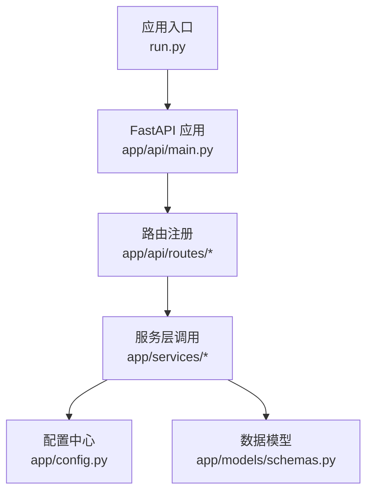
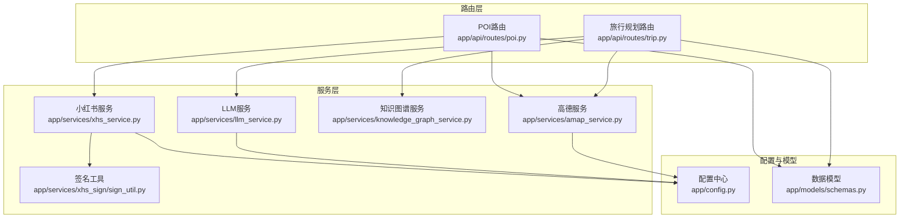
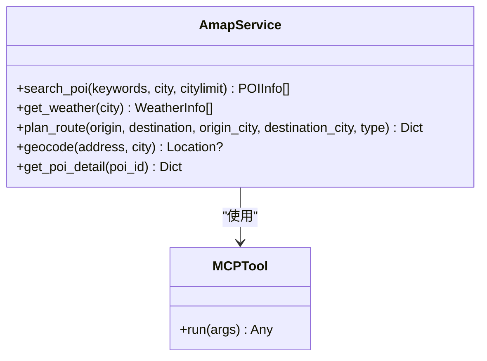
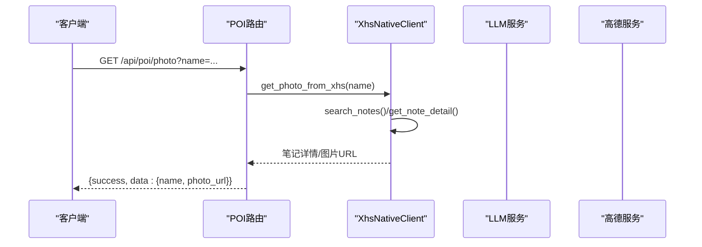
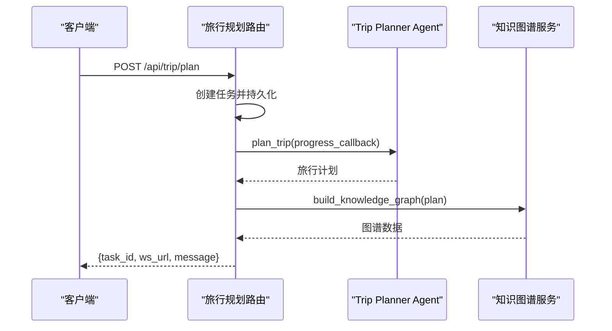
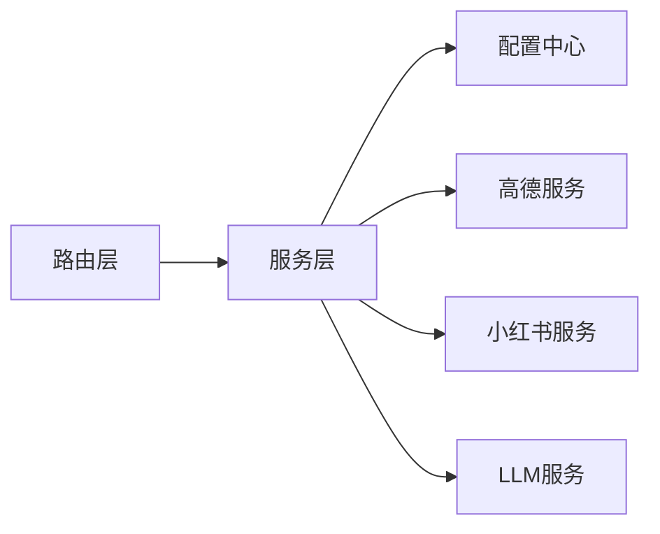

# 服务层扩展

<cite>
**本文引用的文件**
- [README.md](file://README.md)
- [run.py](file://backend/run.py)
- [app/api/main.py](file://backend/app/api/main.py)
- [app/api/routes/trip.py](file://backend/app/api/routes/trip.py)
- [app/api/routes/poi.py](file://backend/app/api/routes/poi.py)
- [app/config.py](file://backend/app/config.py)
- [app/models/schemas.py](file://backend/app/models/schemas.py)
- [app/services/__init__.py](file://backend/app/services/__init__.py)
- [app/services/amap_service.py](file://backend/app/services/amap_service.py)
- [app/services/knowledge_graph_service.py](file://backend/app/services/knowledge_graph_service.py)
- [app/services/llm_service.py](file://backend/app/services/llm_service.py)
- [app/services/xhs_service.py](file://backend/app/services/xhs_service.py)
- [app/services/xhs_sign/sign_util.py](file://backend/app/services/xhs_sign/sign_util.py)
</cite>

## 目录
1. [简介](#简介)
2. [项目结构](#项目结构)
3. [核心组件](#核心组件)
4. [架构总览](#架构总览)
5. [详细组件分析](#详细组件分析)
6. [依赖关系分析](#依赖关系分析)
7. [性能考量](#性能考量)
8. [故障排查指南](#故障排查指南)
9. [结论](#结论)
10. [附录](#附录)

## 简介
本指南面向后端服务层扩展开发者，系统讲解如何在现有 TripStar 代码基础上新增服务类、设计服务接口、实现依赖注入、处理异常、集成第三方服务（如地图、LLM、小红书等）、管理服务间依赖关系、配置与环境适配、监控与日志记录，并给出最佳实践与可落地的开发步骤。文档同时提供架构图与流程图，帮助不同技术背景的读者快速上手。

## 项目结构
后端采用 FastAPI + Python 的分层架构，核心目录与职责如下：
- app/api：路由与应用入口，负责 HTTP/WebSocket 接入、CORS、健康检查、静态资源挂载
- app/services：服务层，封装第三方服务与业务逻辑（地图、LLM、知识图谱、小红书等）
- app/models：Pydantic 数据模型与响应结构
- app/config：统一配置管理与运行时覆盖
- run.py：Uvicorn 启动入口，读取配置并启动服务

图表来源
- [run.py:1-17](file://backend/run.py#L1-L17)
- [app/api/main.py:1-147](file://backend/app/api/main.py#L1-L147)
- [app/api/routes/trip.py:1-511](file://backend/app/api/routes/trip.py#L1-L511)
- [app/api/routes/poi.py:1-133](file://backend/app/api/routes/poi.py#L1-L133)
- [app/services/__init__.py:1-3](file://backend/app/services/__init__.py#L1-L3)
- [app/config.py:1-202](file://backend/app/config.py#L1-L202)
- [app/models/schemas.py:1-264](file://backend/app/models/schemas.py#L1-L264)

章节来源
- [README.md:205-232](file://README.md#L205-L232)
- [app/api/main.py:13-61](file://backend/app/api/main.py#L13-L61)
- [app/api/routes/trip.py:17-18](file://backend/app/api/routes/trip.py#L17-L18)
- [app/api/routes/poi.py:8-8](file://backend/app/api/routes/poi.py#L8-L8)

## 核心组件
- 配置中心：集中管理应用配置、运行时覆盖、环境变量同步与校验
- 服务层：封装第三方服务与业务逻辑，提供单例工厂与重置能力
- 路由层：暴露 HTTP/WebSocket 接口，协调任务状态、回调与结果
- 数据模型：统一请求/响应结构，便于接口契约与序列化

章节来源
- [app/config.py:21-71](file://backend/app/config.py#L21-L71)
- [app/services/amap_service.py:50-276](file://backend/app/services/amap_service.py#L50-L276)
- [app/services/llm_service.py:12-75](file://backend/app/services/llm_service.py#L12-L75)
- [app/services/xhs_service.py:68-444](file://backend/app/services/xhs_service.py#L68-L444)
- [app/api/routes/trip.py:276-388](file://backend/app/api/routes/trip.py#L276-L388)
- [app/models/schemas.py:10-264](file://backend/app/models/schemas.py#L10-L264)

## 架构总览
系统采用“路由层-服务层-第三方服务”的分层设计，服务层通过单例工厂与配置中心解耦外部依赖，路由层负责任务编排与状态广播。

图表来源
- [app/api/routes/trip.py:1-511](file://backend/app/api/routes/trip.py#L1-L511)
- [app/api/routes/poi.py:1-133](file://backend/app/api/routes/poi.py#L1-L133)
- [app/services/amap_service.py:12-276](file://backend/app/services/amap_service.py#L12-L276)
- [app/services/llm_service.py:12-75](file://backend/app/services/llm_service.py#L12-L75)
- [app/services/knowledge_graph_service.py:34-169](file://backend/app/services/knowledge_graph_service.py#L34-L169)
- [app/services/xhs_service.py:68-444](file://backend/app/services/xhs_service.py#L68-L444)
- [app/services/xhs_sign/sign_util.py:1-149](file://backend/app/services/xhs_sign/sign_util.py#L1-L149)
- [app/config.py:21-122](file://backend/app/config.py#L21-L122)
- [app/models/schemas.py:10-264](file://backend/app/models/schemas.py#L10-L264)

## 详细组件分析

### 配置中心（Settings 与运行时覆盖）
- 设计要点
  - 使用 Pydantic 设置模型集中管理配置项（应用名、端口、CORS、高德、小红书、LLM 等）
  - 支持 .env 加载与 HelloAgents 环境叠加
  - 运行时覆盖：将指定键持久化到 runtime_settings.json，并同步到环境变量，兼容第三方组件
  - 提供配置校验与打印，便于调试
- 关键能力
  - get_settings() 获取全局配置实例
  - update_runtime_settings() 更新并持久化运行时配置
  - get_runtime_settings() 供前端设置页读取
  - validate_config() 校验必要配置并输出警告
- 依赖关系
  - 被服务层（LLM、高德、小红书）广泛依赖
  - 被路由层在启动时验证与打印

章节来源
- [app/config.py:21-122](file://backend/app/config.py#L21-L122)
- [app/config.py:129-160](file://backend/app/config.py#L129-L160)
- [app/config.py:163-180](file://backend/app/config.py#L163-L180)
- [app/config.py:183-202](file://backend/app/config.py#L183-L202)

### 高德地图服务（AmapService）
- 设计要点
  - 单例工厂 get_amap_service() 与 MCPTool 初始化，按需创建
  - 封装 POI 搜索、天气查询、路线规划、地理编码、POI 详情等方法
  - 对外返回结构化数据模型（POIInfo、WeatherInfo、Location 等）
- 依赖关系
  - 依赖配置中心获取高德 Web Key
  - 依赖 MCPTool 与 amap-mcp-server 通信
- 异常处理
  - 捕获并记录异常，返回空结果或默认值，避免中断流程

图表来源
- [app/services/amap_service.py:50-276](file://backend/app/services/amap_service.py#L50-L276)

章节来源
- [app/services/amap_service.py:12-47](file://backend/app/services/amap_service.py#L12-L47)
- [app/services/amap_service.py:57-254](file://backend/app/services/amap_service.py#L57-L254)
- [app/models/schemas.py:54-227](file://backend/app/models/schemas.py#L54-L227)

### LLM 服务（HelloAgentsLLM）
- 设计要点
  - 单例工厂 get_llm()，按配置初始化模型、Base URL、超时等
  - 针对第三方中转 API 的 WAF/Cloudflare 拦截，手动覆盖底层 OpenAI client 的 User-Agent
- 依赖关系
  - 依赖配置中心读取 LLM API Key、Base URL、Model、Timeout
- 重置能力
  - reset_llm() 用于测试或重新配置

章节来源
- [app/services/llm_service.py:12-75](file://backend/app/services/llm_service.py#L12-L75)
- [app/config.py:44-55](file://backend/app/config.py#L44-L55)

### 小红书服务（XhsNativeClient 与搜索/提纯/搜图）
- 设计要点
  - 原生客户端直连 edith.xiaohongshu.com，使用本地 JS 签名引擎生成完整签名，规避风控
  - 支持搜索笔记、获取笔记详情、SSR 降级抓取
  - 结合 LLM 对游记进行结构化提取，再通过高德补齐地理坐标
  - 提供 POI 图片搜索与异步包装
- 异常处理
  - 定义 XHSCookieExpiredError 用于向前端报警
  - 对 300011 风控与超时进行捕获与提示
- 依赖关系
  - 依赖配置中心读取 Cookie
  - 依赖签名工具生成请求头
  - 依赖 LLM 服务进行结构化提取
  - 依赖高德服务进行地理编码补全

图表来源
- [app/api/routes/poi.py:88-133](file://backend/app/api/routes/poi.py#L88-L133)
- [app/services/xhs_service.py:358-444](file://backend/app/services/xhs_service.py#L358-L444)

章节来源
- [app/services/xhs_service.py:68-199](file://backend/app/services/xhs_service.py#L68-L199)
- [app/services/xhs_service.py:247-354](file://backend/app/services/xhs_service.py#L247-L354)
- [app/services/xhs_service.py:358-444](file://backend/app/services/xhs_service.py#L358-L444)
- [app/services/xhs_sign/sign_util.py:1-149](file://backend/app/services/xhs_sign/sign_util.py#L1-L149)

### 知识图谱服务（build_knowledge_graph）
- 设计要点
  - 从 TripPlan 中抽取节点与边，生成 ECharts 图谱数据
  - 定义节点颜色与尺寸映射，支持多种实体类型
- 输出结构
  - nodes、edges、categories

章节来源
- [app/services/knowledge_graph_service.py:34-169](file://backend/app/services/knowledge_graph_service.py#L34-L169)
- [app/models/schemas.py:146-186](file://backend/app/models/schemas.py#L146-L186)

### 路由层（旅行规划与 POI）
- 旅行规划路由
  - 提交任务立即返回 task_id，后台异步执行并推送进度
  - 支持 WebSocket 实时订阅与轮询查询
  - 任务持久化到 JSON 文件，支持服务重启后状态恢复
- POI 路由
  - POI 详情、搜索、图片获取接口
  - 与高德服务、小红书服务对接

图表来源
- [app/api/routes/trip.py:276-388](file://backend/app/api/routes/trip.py#L276-L388)
- [app/services/knowledge_graph_service.py:34-169](file://backend/app/services/knowledge_graph_service.py#L34-L169)

章节来源
- [app/api/routes/trip.py:276-488](file://backend/app/api/routes/trip.py#L276-L488)
- [app/api/routes/poi.py:18-133](file://backend/app/api/routes/poi.py#L18-L133)

## 依赖关系分析
- 低耦合高内聚
  - 服务层通过单例工厂与配置中心解耦第三方服务
  - 路由层仅负责编排与状态广播，不直接操作第三方 API
- 循环依赖避免
  - 服务层之间通过接口契约（返回结构化数据）交互，避免直接 import 导致循环
- 依赖链
  - 路由层 → 服务层 → 第三方服务（高德、小红书、LLM）
  - 服务层 → 配置中心（读取配置）

图表来源
- [app/api/routes/trip.py:1-511](file://backend/app/api/routes/trip.py#L1-L511)
- [app/services/amap_service.py:12-276](file://backend/app/services/amap_service.py#L12-L276)
- [app/services/xhs_service.py:68-444](file://backend/app/services/xhs_service.py#L68-L444)
- [app/services/llm_service.py:12-75](file://backend/app/services/llm_service.py#L12-L75)
- [app/config.py:21-122](file://backend/app/config.py#L21-L122)

## 性能考量
- 异步与并发
  - 旅行规划采用 asyncio.create_task 异步执行，避免阻塞主线程
  - WebSocket 订阅者队列广播，减少轮询压力
- 超时与重试
  - LLM 服务支持超时配置（环境变量）
  - 小红书服务对 API 调用设置超时，SSR 降级抓取兜底
- 缓存与懒加载
  - 服务单例工厂按需创建，避免重复初始化
  - 配置中心运行时覆盖持久化，支持热更新
- I/O 优化
  - 任务状态持久化到磁盘，服务重启后可恢复处理中任务

章节来源
- [app/api/routes/trip.py:304-388](file://backend/app/api/routes/trip.py#L304-L388)
- [app/services/llm_service.py:42-61](file://backend/app/services/llm_service.py#L42-L61)
- [app/services/xhs_service.py:130-143](file://backend/app/services/xhs_service.py#L130-L143)
- [app/services/amap_service.py:12-47](file://backend/app/services/amap_service.py#L12-L47)
- [app/config.py:97-122](file://backend/app/config.py#L97-L122)

## 故障排查指南
- 配置问题
  - LLM API Key 未配置：校验会输出警告，LLM 服务初始化失败
  - 高德 Key 未配置：高德服务初始化抛错
  - 小红书 Cookie 未配置：小红书服务初始化抛错
- 小红书风控
  - 出现 300011 异常：抛出 XHSCookieExpiredError，前端可识别并提示更换 Cookie
- 服务重启
  - 处理中任务会被标记为失败，避免前端无限等待
- 日志与调试
  - 应用启动时打印配置信息与验证结果
  - 服务层方法内打印关键信息，便于定位问题

章节来源
- [app/config.py:163-180](file://backend/app/config.py#L163-L180)
- [app/services/amap_service.py:24-25](file://backend/app/services/amap_service.py#L24-L25)
- [app/services/xhs_service.py:195-198](file://backend/app/services/xhs_service.py#L195-L198)
- [app/api/routes/trip.py:71-78](file://backend/app/api/routes/trip.py#L71-L78)
- [app/api/routes/trip.py:369-387](file://backend/app/api/routes/trip.py#L369-L387)

## 结论
本指南基于现有代码总结了服务层扩展的关键模式：单例工厂、配置中心、异常处理、路由编排与任务持久化。按照这些模式新增服务类，可快速集成第三方服务并保持系统的稳定性与可维护性。

## 附录

### 新增服务类开发步骤（模板）
- 设计服务接口
  - 明确输入/输出参数，参考现有服务的数据模型
  - 定义异常类型（如 XHSCookieExpiredError）
- 实现单例工厂
  - 提供 get_service() 工厂方法与 reset_* 重置函数
- 依赖注入
  - 通过配置中心读取必要参数
  - 如需调用其他服务，通过工厂方法获取实例
- 异常处理
  - 捕获并记录异常，返回结构化错误响应
- 集成到路由
  - 在路由层新增接口，调用服务方法
  - 对于耗时任务，采用异步执行与状态广播
- 配置与环境适配
  - 在配置中心添加新配置项
  - 支持运行时覆盖与环境变量同步
- 监控与日志
  - 在关键路径打印日志，便于问题定位
  - 对外部调用增加超时与重试策略

章节来源
- [app/services/amap_service.py:12-47](file://backend/app/services/amap_service.py#L12-L47)
- [app/services/xhs_service.py:22-24](file://backend/app/services/xhs_service.py#L22-L24)
- [app/api/routes/trip.py:276-388](file://backend/app/api/routes/trip.py#L276-L388)
- [app/config.py:21-122](file://backend/app/config.py#L21-L122)

### 第三方服务集成示例（新增地图服务/数据源）
- 地图服务（如 Google Maps）
  - 在配置中心新增密钥与 Base URL
  - 实现服务类与单例工厂
  - 在路由层新增接口，调用服务方法
  - 注意跨域与鉴权策略
- 数据源（如 GraphQL/REST API）
  - 封装客户端，支持超时与重试
  - 解析响应为统一数据模型
  - 记录调用日志与错误码

章节来源
- [app/config.py:36-55](file://backend/app/config.py#L36-L55)
- [app/services/amap_service.py:50-276](file://backend/app/services/amap_service.py#L50-L276)
- [app/api/routes/poi.py:18-86](file://backend/app/api/routes/poi.py#L18-L86)

### 服务间依赖关系管理
- 服务发现
  - 通过工厂方法获取实例，避免硬编码依赖
- 循环依赖避免
  - 服务间通过接口契约交互，不互相 import
- 懒加载
  - 单例工厂按需创建，减少启动开销

章节来源
- [app/services/amap_service.py:12-47](file://backend/app/services/amap_service.py#L12-L47)
- [app/services/xhs_service.py:68-199](file://backend/app/services/xhs_service.py#L68-L199)

### 服务配置与环境适配
- 配置文件
  - 使用 .env 与运行时覆盖文件 runtime_settings.json
- 环境变量
  - 支持多来源（本地 .env、Docker 环境变量）
- 连接池管理
  - 对外部 HTTP 客户端设置超时与连接复用（参考现有实现）

章节来源
- [app/config.py:70-122](file://backend/app/config.py#L70-L122)
- [README.md:140-149](file://README.md#L140-L149)
- [app/services/llm_service.py:42-61](file://backend/app/services/llm_service.py#L42-L61)

### 监控与日志记录
- 性能指标
  - 记录任务耗时、外部调用耗时
- 错误追踪
  - 捕获异常并记录堆栈，区分业务异常与系统异常
- 审计日志
  - 记录关键操作（如配置更新、任务状态变更）

章节来源
- [app/api/routes/trip.py:365-387](file://backend/app/api/routes/trip.py#L365-L387)
- [app/services/xhs_service.py:130-143](file://backend/app/services/xhs_service.py#L130-L143)

### 最佳实践
- 代码复用
  - 统一数据模型与响应结构
- 错误恢复
  - 外部服务失败时提供降级方案（如 SSR 抓取）
- 资源管理
  - 单例工厂与重置函数配合，支持热更新与测试隔离

章节来源
- [app/services/xhs_service.py:228-243](file://backend/app/services/xhs_service.py#L228-L243)
- [app/services/llm_service.py:70-75](file://backend/app/services/llm_service.py#L70-L75)