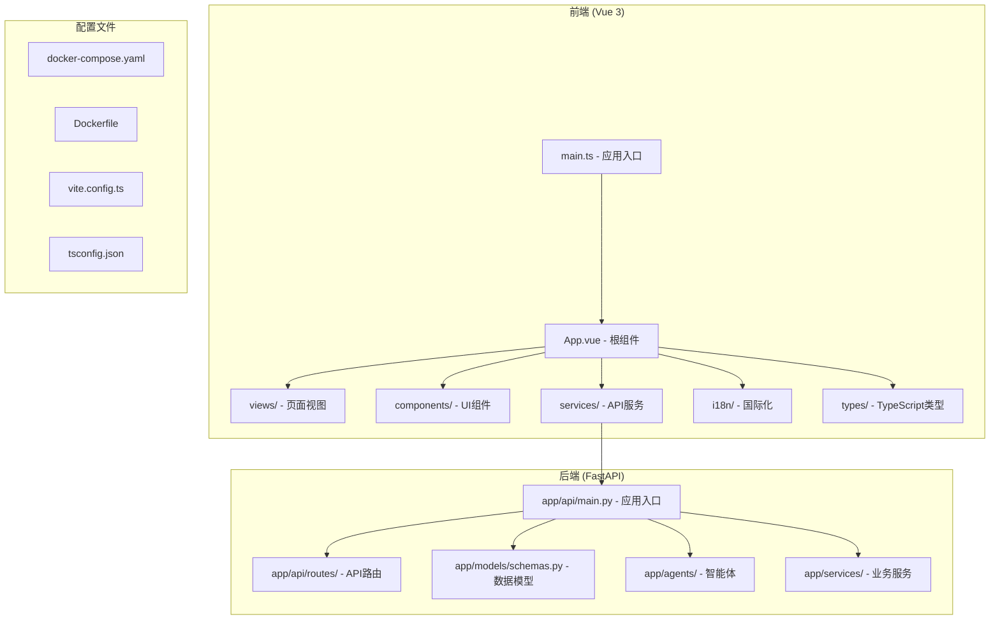
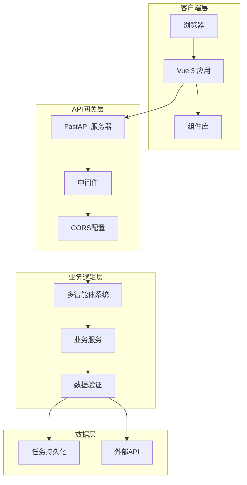
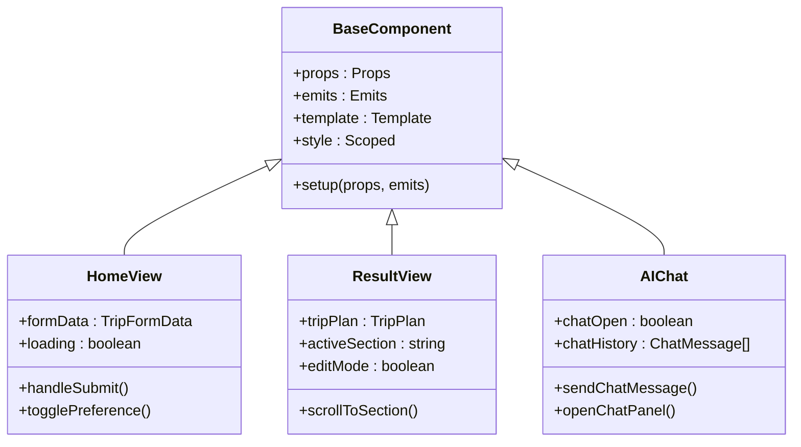
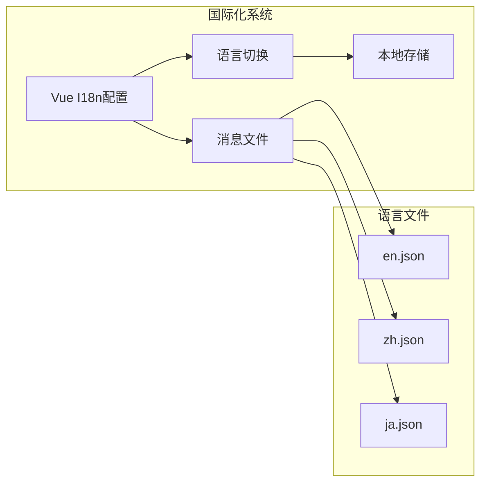
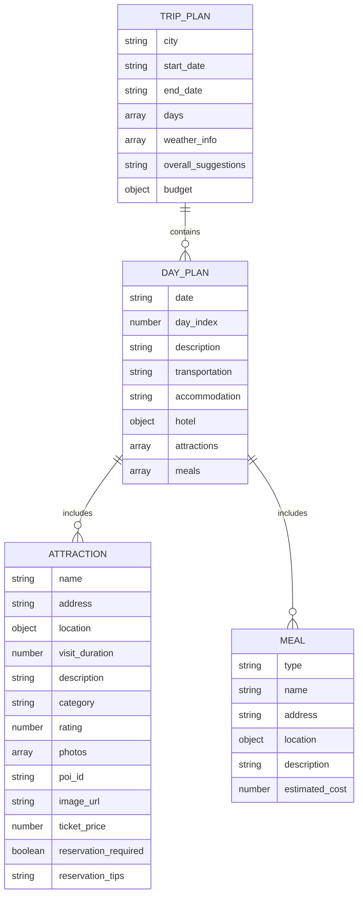
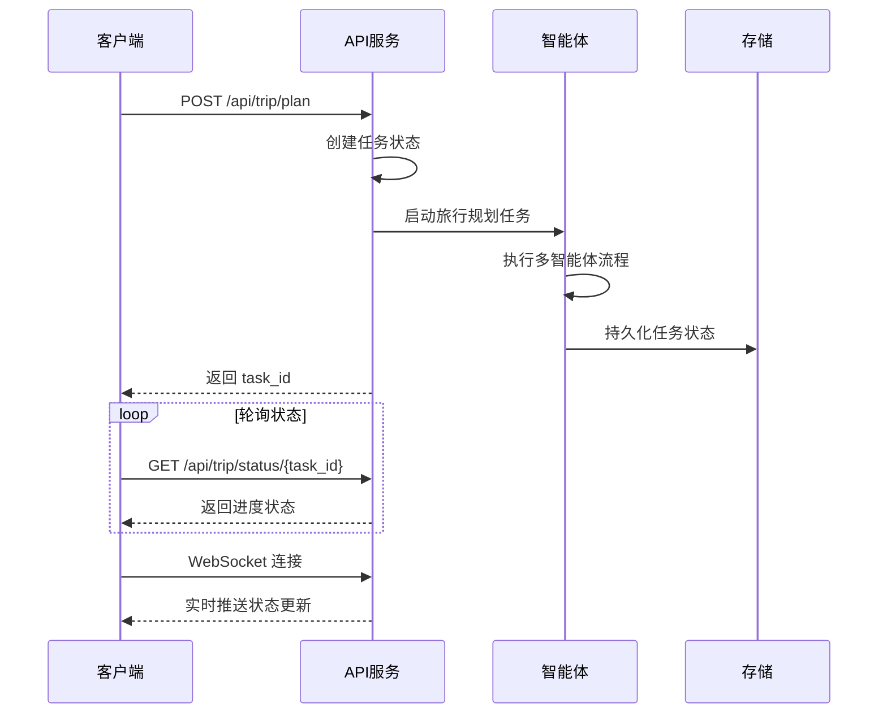

# 自定义功能开发

<cite>
**本文档引用的文件**
- [README.md](file://README.md)
- [main.ts](file://frontend/src/main.ts)
- [App.vue](file://frontend/src/App.vue)
- [Home.vue](file://frontend/src/views/Home.vue)
- [Result.vue](file://frontend/src/views/Result.vue)
- [NavBar.vue](file://frontend/src/components/NavBar.vue)
- [AIChat.vue](file://frontend/src/components/AIChat.vue)
- [OverviewAttractionCard.vue](file://frontend/src/components/OverviewAttractionCard.vue)
- [api.ts](file://frontend/src/services/api.ts)
- [index.ts](file://frontend/src/types/index.ts)
- [index.ts](file://frontend/src/i18n/index.ts)
- [en.json](file://frontend/src/i18n/locales/en.json)
- [zh.json](file://frontend/src/i18n/locales/zh.json)
- [main.py](file://backend/app/api/main.py)
- [trip.py](file://backend/app/api/routes/trip.py)
- [schemas.py](file://backend/app/models/schemas.py)
- [run.py](file://backend/run.py)
- [package.json](file://frontend/package.json)
</cite>

## 目录
1. [简介](#简介)
2. [项目结构](#项目结构)
3. [核心组件](#核心组件)
4. [架构概览](#架构概览)
5. [详细组件分析](#详细组件分析)
6. [依赖分析](#依赖分析)
7. [性能考虑](#性能考虑)
8. [故障排除指南](#故障排除指南)
9. [结论](#结论)
10. [附录](#附录)

## 简介

TripStar 是一个基于 HelloAgents 框架打造的多智能体协作文旅规划平台。该项目采用前后端分离架构，前端使用 Vue 3 + TypeScript，后端使用 FastAPI + Python，实现了完整的旅行规划解决方案。

本指南专注于帮助开发者创建自定义功能，包括前端组件开发、国际化扩展、数据模型定义、业务逻辑实现以及前后端集成等方面。

## 项目结构

项目采用标准的前后端分离架构：



**图表来源**
- [main.ts:1-35](file://frontend/src/main.ts#L1-L35)
- [main.py:1-147](file://backend/app/api/main.py#L1-L147)

**章节来源**
- [README.md:205-232](file://README.md#L205-L232)
- [main.ts:1-35](file://frontend/src/main.ts#L1-L35)
- [main.py:1-147](file://backend/app/api/main.py#L1-L147)

## 核心组件

### 前端核心组件

TripStar 的前端由多个核心组件构成，每个组件都有特定的功能职责：

#### 应用入口与路由
- **main.ts**: 应用初始化，配置路由、UI库和国际化
- **App.vue**: 根组件，提供全局布局和语言切换功能
- **路由配置**: 支持首页和结果页的导航

#### 视图组件
- **Home.vue**: 旅行规划表单，包含目的地、日期、偏好设置等输入
- **Result.vue**: 结果展示页面，包含预算、地图、每日行程等多个模块

#### 业务组件
- **AIChat.vue**: 智能问答浮动窗口
- **NavBar.vue**: 导航栏，包含设置对话框和语言选择
- **OverviewAttractionCard.vue**: 景点概览卡片组件

#### 服务层
- **api.ts**: 封装所有 API 调用，包括旅行规划、任务状态轮询等

#### 类型系统
- **types/index.ts**: 定义完整的 TypeScript 类型体系，包括旅行计划、预算、天气等数据结构

**章节来源**
- [main.ts:1-35](file://frontend/src/main.ts#L1-L35)
- [App.vue:1-263](file://frontend/src/App.vue#L1-L263)
- [Home.vue:1-800](file://frontend/src/views/Home.vue#L1-L800)
- [Result.vue:1-800](file://frontend/src/views/Result.vue#L1-L800)
- [api.ts:1-335](file://frontend/src/services/api.ts#L1-L335)
- [index.ts:1-196](file://frontend/src/types/index.ts#L1-L196)

### 后端核心组件

#### API 应用
- **app/api/main.py**: FastAPI 应用入口，配置中间件、CORS、路由注册等
- **app/api/routes/trip.py**: 旅行规划 API，支持 WebSocket 实时状态推送

#### 数据模型
- **app/models/schemas.py**: 使用 Pydantic 定义完整的数据验证模型

#### 智能体系统
- **app/agents/**: 多智能体协作架构，包括旅行规划、天气查询、酒店推荐等

**章节来源**
- [main.py:1-147](file://backend/app/api/main.py#L1-L147)
- [trip.py:1-511](file://backend/app/api/routes/trip.py#L1-L511)
- [schemas.py:1-264](file://backend/app/models/schemas.py#L1-L264)

## 架构概览

TripStar 采用现代化的全栈架构，实现了高效的前后端分离：



**图表来源**
- [main.py:25-61](file://backend/app/api/main.py#L25-L61)
- [trip.py:276-313](file://backend/app/api/routes/trip.py#L276-L313)

该架构的核心特点：
- **异步任务处理**: 使用 asyncio 实现长时间运行的旅行规划任务
- **实时状态推送**: 通过 WebSocket 提供实时进度更新
- **数据验证**: 前后端双重数据验证确保数据完整性
- **模块化设计**: 清晰的分层架构便于维护和扩展

**章节来源**
- [README.md:43-97](file://README.md#L43-L97)
- [trip.py:315-388](file://backend/app/api/routes/trip.py#L315-L388)

## 详细组件分析

### Vue 3 组件开发指南

#### 组件结构最佳实践



**图表来源**
- [Home.vue:197-371](file://frontend/src/views/Home.vue#L197-L371)
- [Result.vue:569-800](file://frontend/src/views/Result.vue#L569-L800)
- [AIChat.vue:154-249](file://frontend/src/components/AIChat.vue#L154-L249)

#### Composition API 使用模式

在 TripStar 中，推荐使用以下 Composition API 模式：

1. **响应式状态管理**: 使用 `ref()` 和 `reactive()` 管理组件状态
2. **计算属性**: 使用 `computed()` 处理派生状态
3. **生命周期钩子**: 使用 `onMounted()`、`onUnmounted()` 等
4. **组合函数**: 将可复用逻辑提取为组合函数

**章节来源**
- [Home.vue:197-371](file://frontend/src/views/Home.vue#L197-L371)
- [Result.vue:569-800](file://frontend/src/views/Result.vue#L569-L800)
- [AIChat.vue:154-249](file://frontend/src/components/AIChat.vue#L154-L249)

### 国际化功能扩展

#### 现有国际化架构



**图表来源**
- [index.ts:1-53](file://frontend/src/i18n/index.ts#L1-L53)
- [en.json:1-293](file://frontend/src/i18n/locales/en.json#L1-L293)
- [zh.json:1-293](file://frontend/src/i18n/locales/zh.json#L1-L293)

#### 新语言支持添加步骤

1. **创建语言文件**: 在 `frontend/src/i18n/locales/` 目录下添加新的语言 JSON 文件
2. **更新支持列表**: 在 `messages.ts` 中添加新语言到 `SUPPORTED_LOCALES`
3. **更新导航组件**: 在 `NavBar.vue` 和 `App.vue` 中添加语言选项
4. **测试验证**: 确保新语言正确加载和切换

**章节来源**
- [index.ts:1-53](file://frontend/src/i18n/index.ts#L1-L53)
- [App.vue:17-27](file://frontend/src/App.vue#L17-L27)
- [NavBar.vue:38-44](file://frontend/src/components/NavBar.vue#L38-L44)

### 数据模型开发

#### TypeScript 类型系统



**图表来源**
- [index.ts:69-77](file://frontend/src/types/index.ts#L69-L77)
- [index.ts:48-57](file://frontend/src/types/index.ts#L48-L57)
- [index.ts:8-18](file://frontend/src/types/index.ts#L8-L18)

#### 数据验证策略

1. **前端验证**: 使用 Ant Design Vue 表单组件进行实时验证
2. **后端验证**: 使用 Pydantic 模型进行严格的数据验证
3. **类型安全**: 通过 TypeScript 确保编译时类型检查

**章节来源**
- [index.ts:1-196](file://frontend/src/types/index.ts#L1-L196)
- [schemas.py:146-155](file://backend/app/models/schemas.py#L146-L155)

### 前后端集成

#### API 调用流程



**图表来源**
- [trip.py:276-313](file://backend/app/api/routes/trip.py#L276-L313)
- [trip.py:390-440](file://backend/app/api/routes/trip.py#L390-L440)

#### 错误处理机制

1. **HTTP 状态码**: 使用标准 HTTP 状态码表示不同类型的错误
2. **WebSocket 错误**: 通过错误字段传递详细的错误信息
3. **前端错误处理**: 统一的错误消息显示和用户反馈

**章节来源**
- [trip.py:460-488](file://backend/app/api/routes/trip.py#L460-L488)
- [api.ts:149-202](file://frontend/src/services/api.ts#L149-L202)

## 依赖分析

### 前端依赖

```mermaid
graph TB
subgraph "核心依赖"
Vue[Vue 3.5.13]
TS[TypeScript 5.7.3]
Vite[Vite 6.0.7]
end
subgraph "UI框架"
Antd[Ant Design Vue 4.2.6]
ECharts[ECharts 5.5.1]
Swiper[Swiper 11.2.10]
end
subgraph "工具库"
Axios[Axios 1.7.9]
DayJS[DayJS 1.11.10]
I18n[Vue I18n 9.14.4]
end
subgraph "地图服务"
AMap[@amap/amap-jsapi-loader]
end
Vue --> Antd
Vue --> I18n
Antd --> ECharts
Antd --> Swiper
Axios --> AMap
```

**图表来源**
- [package.json:11-34](file://frontend/package.json#L11-L34)

### 后端依赖

后端使用 Python 生态系统，主要依赖包括：
- **FastAPI**: 现代化的 Web 框架
- **Pydantic**: 数据验证和序列化
- **asyncio**: 异步编程支持
- **uvicorn**: ASGI 服务器

**章节来源**
- [package.json:1-35](file://frontend/package.json#L1-L35)

## 性能考虑

### 前端性能优化

1. **组件懒加载**: 使用动态导入实现路由级别的代码分割
2. **虚拟滚动**: 对大量数据使用虚拟滚动技术
3. **图片优化**: 实现图片懒加载和错误处理
4. **状态缓存**: 合理使用 sessionStorage 缓存旅行计划数据

### 后端性能优化

1. **异步处理**: 使用 asyncio 处理长时间运行的任务
2. **任务持久化**: 将任务状态持久化到文件系统
3. **内存管理**: 限制任务数量，避免内存泄漏
4. **并发控制**: 通过队列管理智能体的并发执行

## 故障排除指南

### 常见问题诊断

#### API 连接问题
1. **检查后端服务状态**: 使用 `/health` 端点验证服务可用性
2. **验证 CORS 配置**: 确保前端域名在允许列表中
3. **检查环境变量**: 确认 API 基础 URL 配置正确

#### 旅行规划失败
1. **检查小红书 Cookie**: 确认 Cookie 有效且未过期
2. **验证 LLM 配置**: 确认 API Key 和模型配置正确
3. **查看任务状态**: 通过任务 ID 查询详细错误信息

#### 国际化问题
1. **检查语言文件完整性**: 确保所有翻译键值对存在
2. **验证本地存储**: 检查浏览器本地存储的语言设置
3. **清除缓存**: 刷新页面并清除浏览器缓存

**章节来源**
- [trip.py:496-508](file://backend/app/api/routes/trip.py#L496-L508)
- [api.ts:323-331](file://frontend/src/services/api.ts#L323-L331)

## 结论

TripStar 提供了一个完整的框架来开发自定义功能。通过遵循本文档的指导原则，开发者可以：

1. **快速上手**: 利用现有的组件架构和最佳实践
2. **扩展功能**: 添加新的前端组件、页面视图和业务逻辑
3. **保持一致性**: 遵循统一的代码风格和架构模式
4. **确保质量**: 通过类型安全、数据验证和错误处理保证代码质量

建议在开发新功能时：
- 仔细研究现有组件的实现模式
- 遵循 TypeScript 类型系统
- 实现适当的错误处理和用户反馈
- 进行充分的测试和性能优化

## 附录

### 开发环境设置

1. **前端开发**: `npm run dev`
2. **后端开发**: `python backend/run.py`
3. **环境变量**: 配置 `.env` 文件
4. **Docker 部署**: 使用 `docker-compose up`

### 代码规范

1. **命名约定**: 使用 PascalCase 命名组件，camelCase 命名变量
2. **文件组织**: 按功能模块组织文件结构
3. **注释规范**: 为复杂逻辑添加详细注释
4. **类型标注**: 为所有函数和变量添加 TypeScript 类型