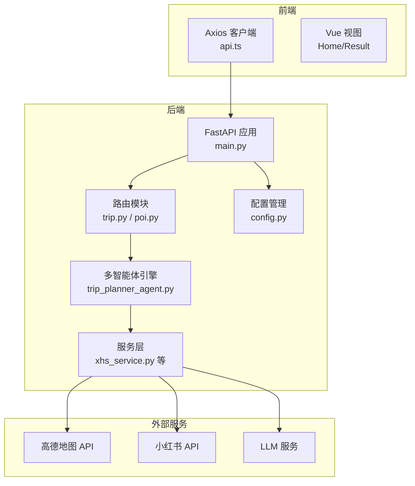
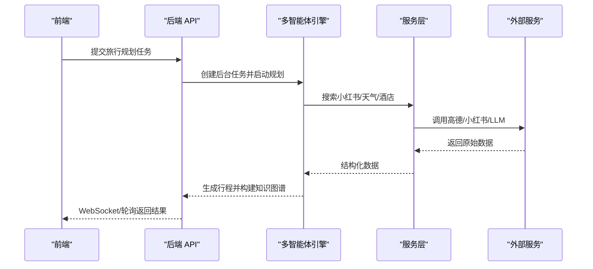
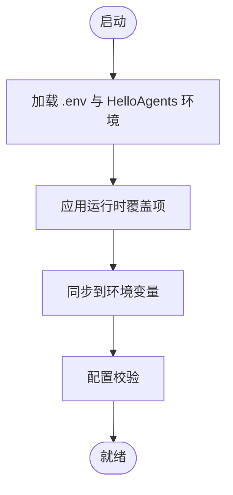
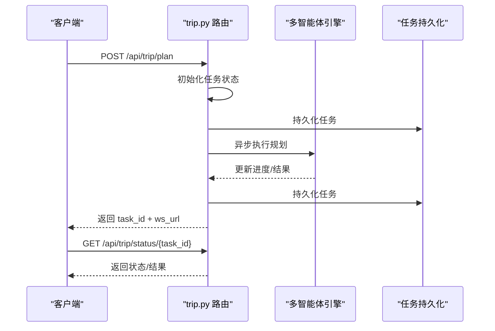
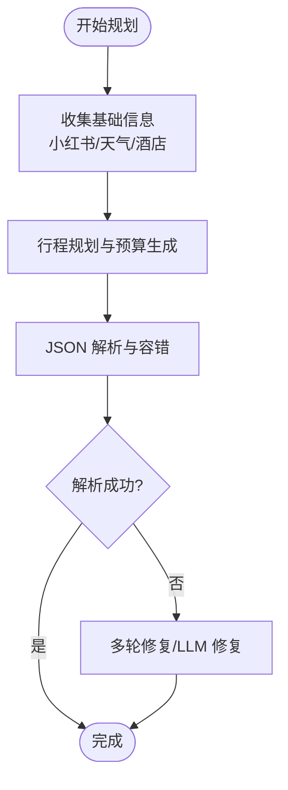
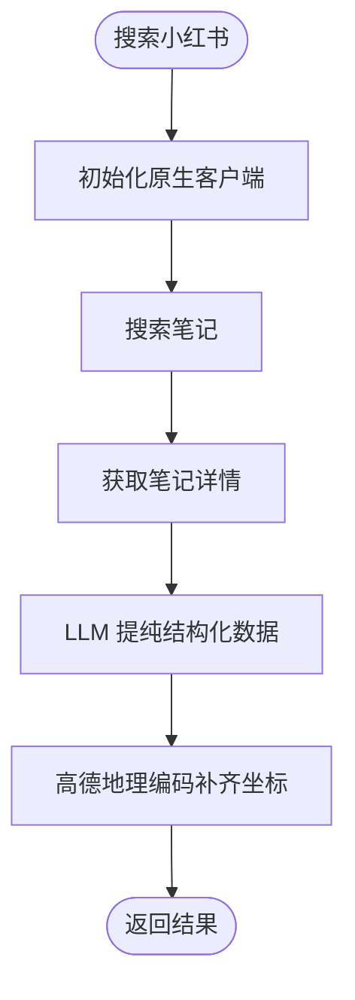
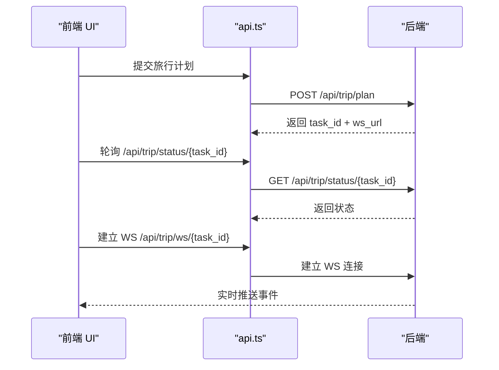
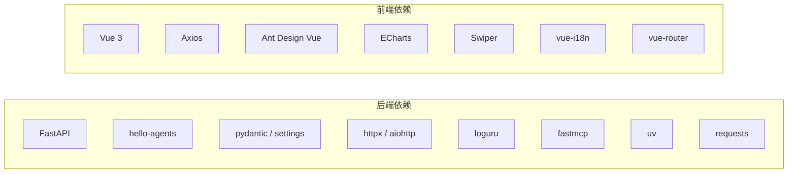

# 故障排除

<cite>
**本文引用的文件**
- [README.md](file://README.md)
- [backend/app/config.py](file://backend/app/config.py)
- [backend/app/api/main.py](file://backend/app/api/main.py)
- [backend/app/api/routes/trip.py](file://backend/app/api/routes/trip.py)
- [backend/app/api/routes/poi.py](file://backend/app/api/routes/poi.py)
- [backend/app/agents/trip_planner_agent.py](file://backend/app/agents/trip_planner_agent.py)
- [backend/app/services/xhs_service.py](file://backend/app/services/xhs_service.py)
- [backend/requirements.txt](file://backend/requirements.txt)
- [frontend/src/services/api.ts](file://frontend/src/services/api.ts)
- [docker-compose.yaml](file://docker-compose.yaml)
- [Dockerfile](file://Dockerfile)
- [start.sh](file://start.sh)
</cite>

## 目录
1. [简介](#简介)
2. [项目结构](#项目结构)
3. [核心组件](#核心组件)
4. [架构总览](#架构总览)
5. [详细组件分析](#详细组件分析)
6. [依赖分析](#依赖分析)
7. [性能考量](#性能考量)
8. [故障排除指南](#故障排除指南)
9. [结论](#结论)
10. [附录](#附录)

## 简介
本指南面向 TripStar 项目的开发者与运维人员，聚焦于开发与部署过程中的常见问题与解决方案，涵盖环境配置、依赖安装、端口占用、多智能体协作、前后端通信、性能诊断、日志与错误追踪、调试工具使用以及社区支持渠道。内容基于仓库现有实现与配置文件进行归纳总结，帮助快速定位与解决问题。

## 项目结构
- 后端采用 FastAPI + Uvicorn/Gunicorn，提供旅行规划、POI 搜索、小红书图片检索等接口，并通过多智能体协作生成行程。
- 前端使用 Vue 3 + Vite，通过 Axios 发起异步任务提交与轮询/WS 订阅，实现旅行计划生成与展示。
- Dockerfile 与 docker-compose.yaml 提供容器化构建与运行，支持生产环境一键部署。

**图表来源**
- [backend/app/api/main.py:1-147](file://backend/app/api/main.py#L1-L147)
- [backend/app/api/routes/trip.py:1-511](file://backend/app/api/routes/trip.py#L1-L511)
- [backend/app/api/routes/poi.py:1-133](file://backend/app/api/routes/poi.py#L1-L133)
- [backend/app/agents/trip_planner_agent.py:1-826](file://backend/app/agents/trip_planner_agent.py#L1-L826)
- [backend/app/services/xhs_service.py:1-444](file://backend/app/services/xhs_service.py#L1-L444)
- [backend/app/config.py:1-202](file://backend/app/config.py#L1-L202)

**章节来源**
- [README.md:205-232](file://README.md#L205-L232)
- [backend/app/api/main.py:1-147](file://backend/app/api/main.py#L1-L147)
- [frontend/src/services/api.ts:1-335](file://frontend/src/services/api.ts#L1-L335)

## 核心组件
- 配置管理：集中管理运行时配置（CORS、高德/小红书/LLM 等），支持运行时更新与持久化。
- 旅行规划路由：提供任务提交、状态轮询、WebSocket 订阅、历史查询与健康检查。
- 多智能体引擎：负责景点搜索（小红书）、天气查询、酒店推荐与行程整合，内置 JSON 容错与重试。
- 服务层：封装高德地图、小红书原生 API、LLM 客户端与知识图谱构建。
- 前端 API 客户端：统一请求 baseURL、运行时设置、轮询与 WS 订阅、错误处理与本地存储。

**章节来源**
- [backend/app/config.py:21-127](file://backend/app/config.py#L21-L127)
- [backend/app/api/routes/trip.py:276-511](file://backend/app/api/routes/trip.py#L276-L511)
- [backend/app/agents/trip_planner_agent.py:173-826](file://backend/app/agents/trip_planner_agent.py#L173-L826)
- [backend/app/services/xhs_service.py:1-444](file://backend/app/services/xhs_service.py#L1-L444)
- [frontend/src/services/api.ts:117-335](file://frontend/src/services/api.ts#L117-L335)

## 架构总览
- 前后端分离，后端提供 REST + WebSocket 接口，前端通过异步任务模式实现长时间运行任务的实时反馈。
- 多智能体通过 MCP 工具与高德地图服务对接，结合小红书原生 API 与 LLM 提纯，形成闭环的数据采集与生成流程。
- 容器化部署通过 Dockerfile 分阶段构建，前置缓存 MCP 工具，减少首次请求延迟。

**图表来源**
- [backend/app/api/routes/trip.py:276-388](file://backend/app/api/routes/trip.py#L276-L388)
- [backend/app/agents/trip_planner_agent.py:257-338](file://backend/app/agents/trip_planner_agent.py#L257-L338)
- [backend/app/services/xhs_service.py:247-354](file://backend/app/services/xhs_service.py#L247-L354)

## 详细组件分析

### 配置与运行时设置
- 支持从 .env 与 HelloAgents 环境叠加加载，运行时可更新并持久化至 runtime_settings.json，同时同步到环境变量以兼容第三方组件。
- CORS 通过逗号分隔字符串配置，运行时解析为列表；日志级别可调。
- 配置校验会提示缺失的关键项（如高德 Web Key、LLM API Key）。

**图表来源**
- [backend/app/config.py:83-127](file://backend/app/config.py#L83-L127)
- [backend/app/config.py:163-179](file://backend/app/config.py#L163-L179)

**章节来源**
- [backend/app/config.py:1-202](file://backend/app/config.py#L1-L202)

### 旅行规划路由与任务系统
- 任务提交立即返回 task_id，并通过 asyncio.create_task 后台执行。
- 支持 WebSocket 实时订阅与轮询查询两种模式，兼容旧客户端。
- 任务状态持久化到 data/trip_tasks/*.json，服务重启后未完成任务标记失败，避免前端无限等待。
- 健康检查返回 agent 名称与工具数量，便于快速确认多智能体可用性。

**图表来源**
- [backend/app/api/routes/trip.py:276-488](file://backend/app/api/routes/trip.py#L276-L488)

**章节来源**
- [backend/app/api/routes/trip.py:1-511](file://backend/app/api/routes/trip.py#L1-L511)

### 多智能体与 JSON 容错
- 多智能体包含天气查询、酒店推荐与行程规划，其中行程规划阶段具备超时重试与多种 JSON 容错策略（去引号、截断修复、LLM 修复）。
- 严格约束预算字段为纯数字，避免结构化输出中的表达式导致解析失败。

**图表来源**
- [backend/app/agents/trip_planner_agent.py:354-758](file://backend/app/agents/trip_planner_agent.py#L354-L758)

**章节来源**
- [backend/app/agents/trip_planner_agent.py:173-826](file://backend/app/agents/trip_planner_agent.py#L173-L826)

### 小红书服务与风控处理
- 原生直连小红书 API，使用本地 JS 签名引擎生成必要头部，规避风控拦截。
- Cookie 过期或异常时抛出特定异常，前端可识别并提示更换 Cookie。
- 支持 SSR 降级抓取，提升稳定性。

**图表来源**
- [backend/app/services/xhs_service.py:68-354](file://backend/app/services/xhs_service.py#L68-L354)

**章节来源**
- [backend/app/services/xhs_service.py:1-444](file://backend/app/services/xhs_service.py#L1-L444)

### 前端 API 客户端与通信
- Axios 客户端支持运行时 baseURL 与高德 JS Key 的本地存储与覆盖。
- 通过 WebSocket 或轮询获取任务状态，错误统一捕获并提示。
- 健康检查接口便于前端侧快速探测后端可用性。

**图表来源**
- [frontend/src/services/api.ts:219-318](file://frontend/src/services/api.ts#L219-L318)

**章节来源**
- [frontend/src/services/api.ts:1-335](file://frontend/src/services/api.ts#L1-L335)

## 依赖分析
- 后端依赖：FastAPI、Uvicorn、hello-agents、pydantic、pydantic-settings、httpx/aiohttp、loguru、fastmcp、uv、requests 等。
- 前端依赖：Vue 3、Ant Design Vue、Axios、ECharts、Swiper、dayjs、vue-i18n、vue-router 等。
- 容器镜像：Node 18（前端构建）、Python 3.10（后端运行），预下载 amap-mcp-server，安装 gunicorn/uvicorn。

**图表来源**
- [backend/requirements.txt:1-18](file://backend/requirements.txt#L1-L18)
- [frontend/package.json:11-33](file://frontend/package.json#L11-L33)

**章节来源**
- [backend/requirements.txt:1-18](file://backend/requirements.txt#L1-L18)
- [frontend/package.json:1-35](file://frontend/package.json#L1-L35)

## 性能考量
- 任务持久化：data/trip_tasks 目录下的 JSON 文件用于服务重启后的状态恢复，避免重复计算。
- 超时与重试：行程规划阶段具备超时检测与一次性重试，降低长文本生成的失败率。
- MCP 工具预热：容器构建阶段预下载 amap-mcp-server，避免首次请求时的冷启动延迟。
- WebSocket 与轮询：前端可二选一，WebSocket 适合实时反馈，轮询适合兼容旧客户端。

**章节来源**
- [backend/app/api/routes/trip.py:82-145](file://backend/app/api/routes/trip.py#L82-L145)
- [backend/app/agents/trip_planner_agent.py:362-387](file://backend/app/agents/trip_planner_agent.py#L362-L387)
- [Dockerfile:45-47](file://Dockerfile#L45-L47)

## 故障排除指南

### 环境配置问题
- API Key 配置错误
  - 现象：LLM API Key 未配置或为空，AI 生成功能不可用；高德 Web Key 未配置，地理编码/POI 搜索受限。
  - 诊断：启动日志会打印配置摘要；配置校验会输出警告。
  - 修复：在 .env 或容器环境变量中设置 OPENAI_API_KEY/LLM_API_KEY、OPENAI_BASE_URL/LLM_BASE_URL、OPENAI_MODEL/LLM_MODEL_ID、VITE_AMAP_WEB_KEY、XHS_COOKIE。
  - 参考：[配置校验与打印:163-201](file://backend/app/config.py#L163-L201)

- 依赖安装失败
  - 现象：pip/npm 安装报错、版本冲突、网络超时。
  - 诊断：检查 requirements.txt 与 package.json 的版本范围；确认网络可达镜像源。
  - 修复：使用国内镜像源安装；升级 pip/npm；清理缓存后重试。
  - 参考：[后端依赖:1-18](file://backend/requirements.txt#L1-L18)、[前端依赖:1-35](file://frontend/package.json#L1-L35)

- 端口占用
  - 现象：启动后端/前端时报端口被占用。
  - 诊断：netstat/ss/lsof 查看端口占用进程。
  - 修复：修改 HOST/PORT 或释放占用端口；容器部署时调整 docker-compose.yaml 端口映射。
  - 参考：[后端启动参数:141-146](file://backend/app/api/main.py#L141-L146)、[容器端口:11-21](file://docker-compose.yaml#L11-L21)

- CORS 跨域问题
  - 现象：前端跨域请求被拒绝。
  - 诊断：检查 CORS Origins 列表与前端 baseURL 是否匹配。
  - 修复：在 .env 中配置 cors_origins，确保包含前端开发/生产域名与端口。
  - 参考：[CORS 配置:33-67](file://backend/app/config.py#L33-L67)、[中间件注册:46-53](file://backend/app/api/main.py#L46-L53)

- Docker 构建/运行问题
  - 现象：镜像构建失败、容器启动后 500、前端静态资源 404。
  - 诊断：检查 Dockerfile 构建参数（如 VITE_AMAP_WEB_JS_KEY）、容器环境变量、端口映射。
  - 修复：确保构建参数与环境变量齐全；确认前端 dist 已复制到镜像；检查容器日志。
  - 参考：[Dockerfile 构建阶段:1-64](file://Dockerfile#L1-L64)、[docker-compose:1-24](file://docker-compose.yaml#L1-L24)、[启动脚本:1-20](file://start.sh#L1-L20)

**章节来源**
- [backend/app/config.py:33-67](file://backend/app/config.py#L33-L67)
- [backend/app/config.py:163-201](file://backend/app/config.py#L163-L201)
- [backend/app/api/main.py:46-53](file://backend/app/api/main.py#L46-L53)
- [backend/app/api/main.py:141-146](file://backend/app/api/main.py#L141-L146)
- [docker-compose.yaml:11-21](file://docker-compose.yaml#L11-L21)
- [Dockerfile:16-23](file://Dockerfile#L16-L23)
- [Dockerfile:45-51](file://Dockerfile#L45-L51)
- [start.sh:13-19](file://start.sh#L13-L19)

### 多智能体系统运行时问题
- Agent 协作异常
  - 现象：Agent 初始化失败、工具不可用、任务卡住。
  - 诊断：查看启动日志中 Agent 初始化与工具注册信息；健康检查接口返回的工具数量。
  - 修复：确认高德 Web Key 配置；检查 MCP 工具命令与环境变量；确保 amap-mcp-server 可用。
  - 参考：[Agent 初始化:176-241](file://backend/app/agents/trip_planner_agent.py#L176-L241)、[健康检查:496-507](file://backend/app/api/routes/trip.py#L496-L507)

- Tool 调用失败
  - 现象：高德工具调用返回错误或超时。
  - 诊断：检查 AMAP_MAPS_API_KEY 是否正确；网络连通性；MCP 工具是否预热。
  - 修复：更换高德 Key；检查防火墙；确认容器内网络可达。
  - 参考：[MCP 工具创建:184-195](file://backend/app/agents/trip_planner_agent.py#L184-L195)、[Docker 预热:45-47](file://Dockerfile#L45-L47)

- Workflow 执行错误
  - 现象：行程规划 JSON 解析失败、预算字段异常、任务最终失败。
  - 诊断：查看任务持久化文件中的 error 字段；前端 WS/轮询返回的错误信息。
  - 修复：确保 LLM 输出符合约束（纯数字预算）；启用 JSON 容错与 LLM 修复；检查输入参数。
  - 参考：[JSON 容错与修复:424-758](file://backend/app/agents/trip_planner_agent.py#L424-L758)、[任务状态持久化:82-104](file://backend/app/api/routes/trip.py#L82-L104)

**章节来源**
- [backend/app/agents/trip_planner_agent.py:176-241](file://backend/app/agents/trip_planner_agent.py#L176-L241)
- [backend/app/agents/trip_planner_agent.py:424-758](file://backend/app/agents/trip_planner_agent.py#L424-L758)
- [backend/app/api/routes/trip.py:82-104](file://backend/app/api/routes/trip.py#L82-L104)
- [backend/app/api/routes/trip.py:496-507](file://backend/app/api/routes/trip.py#L496-L507)

### 前后端通信问题
- CORS 跨域问题
  - 现象：前端请求被浏览器拦截。
  - 诊断：核对 CORS Origins 与前端 baseURL；确认同源策略。
  - 修复：在 .env 中添加允许的 Origin；确保前端运行端口与后端一致。
  - 参考：[CORS 配置:33-67](file://backend/app/config.py#L33-L67)、[中间件注册:46-53](file://backend/app/api/main.py#L46-L53)

- API 调用失败
  - 现象：提交任务/查询状态/获取图片返回 4xx/5xx。
  - 诊断：检查请求 baseURL 与路由前缀；确认任务 ID 有效；查看后端异常堆栈。
  - 修复：修正 VITE_API_BASE_URL；确保路由前缀与实际一致；检查后端日志。
  - 参考：[前端 baseURL:12-36](file://frontend/src/services/api.ts#L12-L36)、[trip 路由:276-488](file://backend/app/api/routes/trip.py#L276-L488)、[poi 路由:88-131](file://backend/app/api/routes/poi.py#L88-L131)

- WebSocket 连接异常
  - 现象：WS 连接失败、断开、未收到事件。
  - 诊断：确认 ws_url 格式；检查后端 WS 路由与订阅队列；前端连接与关闭逻辑。
  - 修复：使用 getWsBaseUrl 自动转换协议；确保任务存在且未完成；检查网络与代理。
  - 参考：[WS 订阅:268-317](file://frontend/src/services/api.ts#L268-L317)、[trip WS 路由:390-440](file://backend/app/api/routes/trip.py#L390-L440)

**章节来源**
- [frontend/src/services/api.ts:12-36](file://frontend/src/services/api.ts#L12-L36)
- [frontend/src/services/api.ts:268-317](file://frontend/src/services/api.ts#L268-L317)
- [backend/app/api/routes/trip.py:390-440](file://backend/app/api/routes/trip.py#L390-L440)
- [backend/app/api/routes/poi.py:88-131](file://backend/app/api/routes/poi.py#L88-L131)

### 性能问题诊断
- 内存泄漏
  - 现象：长时间运行后内存持续增长。
  - 诊断：使用 ps/top/htop 观察进程内存；检查任务队列与订阅者是否清理。
  - 修复：定期重启容器；检查订阅者清理逻辑；避免大对象常驻内存。
  - 参考：[订阅者清理:232-241](file://backend/app/api/routes/trip.py#L232-L241)

- CPU 占用过高
  - 现象：LLM 推理、小红书抓取、JSON 解析导致 CPU 飙升。
  - 诊断：定位高耗时阶段（小红书搜索/LLM 提纯/JSON 容错）。
  - 修复：优化提示词与温度；启用超时与重试；缓存热点数据。
  - 参考：[LLM 提纯:304-353](file://backend/app/services/xhs_service.py#L304-L353)、[JSON 容错:604-758](file://backend/app/agents/trip_planner_agent.py#L604-L758)

- 响应时间过长
  - 现象：任务从提交到完成耗时较长。
  - 诊断：检查任务持久化与广播频率；确认 MCP 工具预热；评估外部服务延迟。
  - 修复：预热 amap-mcp-server；减少不必要的重试；优化外部 API 调用。
  - 参考：[任务持久化:82-104](file://backend/app/api/routes/trip.py#L82-L104)、[Docker 预热:45-47](file://Dockerfile#L45-L47)

**章节来源**
- [backend/app/api/routes/trip.py:232-241](file://backend/app/api/routes/trip.py#L232-L241)
- [backend/app/services/xhs_service.py:304-353](file://backend/app/services/xhs_service.py#L304-L353)
- [backend/app/agents/trip_planner_agent.py:604-758](file://backend/app/agents/trip_planner_agent.py#L604-L758)
- [Dockerfile:45-47](file://Dockerfile#L45-L47)

### 日志分析与错误追踪
- 启动日志：打印应用名称、版本、服务器地址、配置摘要与校验结果。
- 任务日志：任务状态变更、错误信息、请求负载等持久化到 data/trip_tasks。
- 前端日志：请求/响应日志、WS 事件、错误提示。
- 建议：将后端日志输出到标准输出/错误，配合容器日志收集；前端使用 i18n 错误文案统一提示。

**章节来源**
- [backend/app/api/main.py:63-85](file://backend/app/api/main.py#L63-L85)
- [backend/app/api/routes/trip.py:82-104](file://backend/app/api/routes/trip.py#L82-L104)
- [frontend/src/services/api.ts:124-147](file://frontend/src/services/api.ts#L124-L147)

### 调试工具使用
- 浏览器开发者工具：Network 面板观察请求/响应、CORS、WS 连接；Console 查看前端错误。
- Python 调试器：pdb 或 IDE 断点调试后端路由与服务层。
- 网络抓包：tcpdump/wireshark 检查容器内外网络连通性与 DNS 解析。
- 容器日志：docker logs 查看后端标准输出/错误；检查 amap-mcp-server 可用性。

**章节来源**
- [frontend/src/services/api.ts:124-147](file://frontend/src/services/api.ts#L124-L147)
- [Dockerfile:45-47](file://Dockerfile#L45-L47)

### 社区支持与问题反馈
- 项目 README 提供了项目背景、功能与后续优化方向，可关注社区交流与反馈渠道。
- 建议：在社区平台提交 Issue 时附带后端日志片段、任务 ID、前端错误截图与复现步骤。

**章节来源**
- [README.md:261-263](file://README.md#L261-L263)

## 结论
本指南围绕环境配置、多智能体协作、前后端通信与性能优化等方面提供了系统性的故障排除方法。通过合理配置与日志分析、结合容器化部署与任务持久化机制，可显著提升系统的稳定性与可维护性。建议在生产环境中启用健康检查、监控与告警，并定期评估外部服务可用性与依赖版本。

## 附录
- 常用命令参考
  - 后端启动：uvicorn app.api.main:app --host 0.0.0.0 --port 8000 --reload
  - 前端启动：npm run dev
  - 容器构建：docker build -t tripstar .
  - 容器运行：docker-compose up -d
- 关键配置项
  - LLM：OPENAI_API_KEY/LLM_API_KEY、OPENAI_BASE_URL/LLM_BASE_URL、OPENAI_MODEL/LLM_MODEL_ID
  - 高德：VITE_AMAP_WEB_KEY、VITE_AMAP_WEB_JS_KEY
  - 小红书：XHS_COOKIE
  - CORS：cors_origins