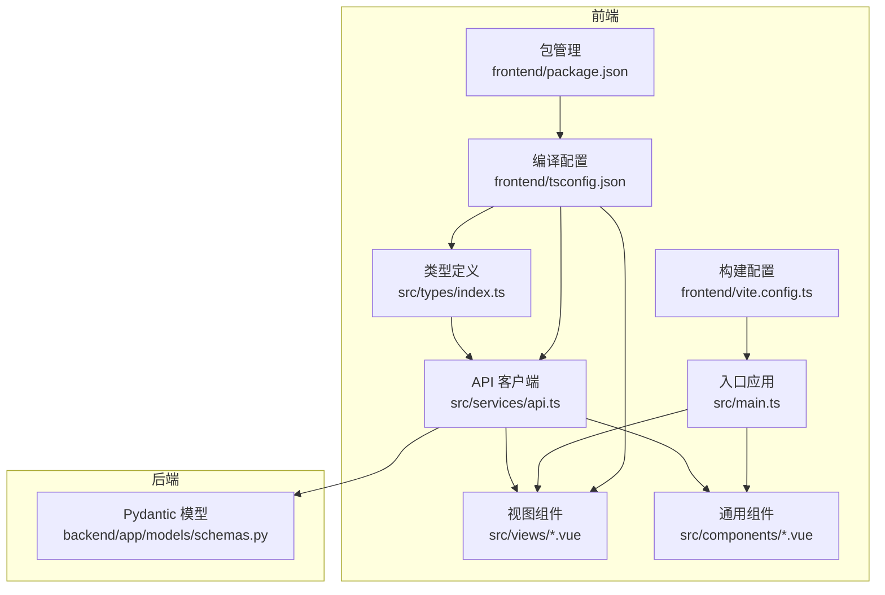
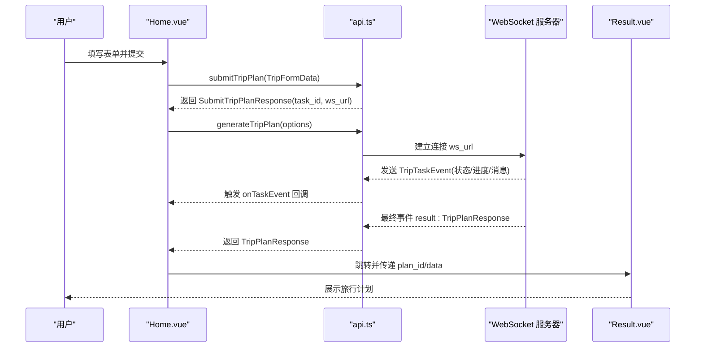
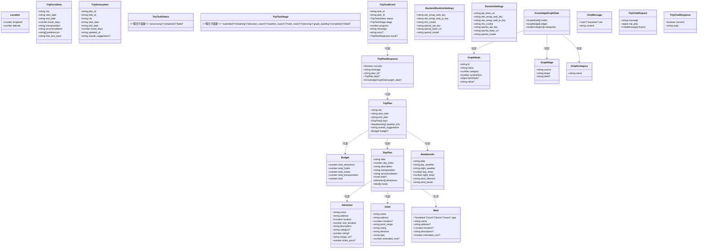
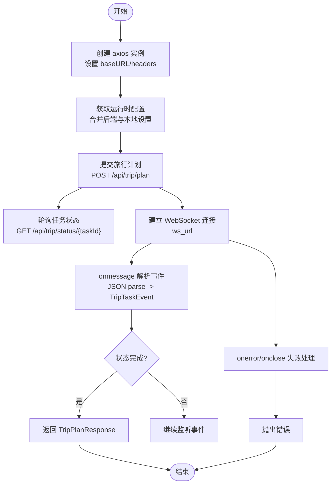
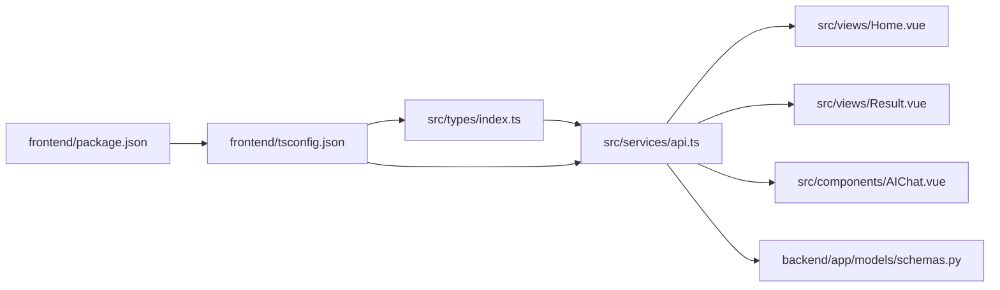

# 前端 TypeScript 类型

<cite>
**本文引用的文件**
- [frontend/src/types/index.ts](file://frontend/src/types/index.ts)
- [frontend/src/services/api.ts](file://frontend/src/services/api.ts)
- [frontend/src/views/Home.vue](file://frontend/src/views/Home.vue)
- [frontend/src/views/Result.vue](file://frontend/src/views/Result.vue)
- [frontend/src/components/AIChat.vue](file://frontend/src/components/AIChat.vue)
- [frontend/src/main.ts](file://frontend/src/main.ts)
- [frontend/tsconfig.json](file://frontend/tsconfig.json)
- [frontend/package.json](file://frontend/package.json)
- [backend/app/models/schemas.py](file://backend/app/models/schemas.py)
- [frontend/vite.config.ts](file://frontend/vite.config.ts)
</cite>

## 目录
1. [简介](#简介)
2. [项目结构](#项目结构)
3. [核心类型系统](#核心类型系统)
4. [架构概览](#架构概览)
5. [详细组件分析](#详细组件分析)
6. [依赖关系分析](#依赖关系分析)
7. [性能考量](#性能考量)
8. [故障排查指南](#故障排查指南)
9. [结论](#结论)
10. [附录](#附录)

## 简介
本文件系统化梳理 TripStar 前端 TypeScript 类型定义与使用实践，覆盖接口声明、类型别名、联合类型、可选属性、映射类型等高级特性，解释与后端模型的对应关系，总结类型安全最佳实践与维护策略，并通过可视化图表展示关键流程与数据流。

## 项目结构
前端采用 Vue 3 + TypeScript + Vite 架构，类型定义集中于 src/types/index.ts，服务层通过 axios 封装 API 客户端，视图组件与业务逻辑在各页面中体现。

**图表来源**
- [frontend/src/types/index.ts:1-196](file://frontend/src/types/index.ts#L1-L196)
- [frontend/src/services/api.ts:1-335](file://frontend/src/services/api.ts#L1-L335)
- [frontend/src/views/Home.vue:197-371](file://frontend/src/views/Home.vue#L197-L371)
- [frontend/src/views/Result.vue:569-800](file://frontend/src/views/Result.vue#L569-L800)
- [frontend/src/components/AIChat.vue:154-249](file://frontend/src/components/AIChat.vue#L154-L249)
- [frontend/src/main.ts:1-35](file://frontend/src/main.ts#L1-L35)
- [frontend/tsconfig.json:1-34](file://frontend/tsconfig.json#L1-L34)
- [frontend/package.json:1-35](file://frontend/package.json#L1-L35)
- [backend/app/models/schemas.py:1-264](file://backend/app/models/schemas.py#L1-L264)
- [frontend/vite.config.ts:1-24](file://frontend/vite.config.ts#L1-L24)

**章节来源**
- [frontend/src/types/index.ts:1-196](file://frontend/src/types/index.ts#L1-L196)
- [frontend/src/services/api.ts:1-335](file://frontend/src/services/api.ts#L1-L335)
- [frontend/src/main.ts:1-35](file://frontend/src/main.ts#L1-L35)
- [frontend/tsconfig.json:1-34](file://frontend/tsconfig.json#L1-L34)
- [frontend/package.json:1-35](file://frontend/package.json#L1-L35)
- [backend/app/models/schemas.py:1-264](file://backend/app/models/schemas.py#L1-L264)
- [frontend/vite.config.ts:1-24](file://frontend/vite.config.ts#L1-L24)

## 核心类型系统
本节系统梳理前端类型定义，涵盖旅行计划相关的核心类型、状态枚举、知识图谱类型以及聊天问答类型。

- 接口与类型别名
  - 基础地理信息：Location
  - 景点信息：Attraction（含可选属性与只读语义）
  - 餐饮信息：Meal（联合类型约束 type）
  - 酒店信息：Hotel（含可选属性）
  - 预算信息：Budget（数值型字段）
  - 单日行程：DayPlan（包含景点、餐饮、酒店等聚合）
  - 天气信息：WeatherInfo（温度字段支持联合类型）
  - 旅行计划：TripPlan（整体聚合）
  - 表单数据：TripFormData（用于提交）
  - 计划响应：TripPlanResponse（包含成功标志、消息、可选数据）
  - 历史项：TripHistoryItem（用于历史记录）
  - 任务状态：TripTaskStatus（联合字面量）
  - 任务阶段：TripTaskStage（联合字面量）
  - 任务事件：TripTaskEvent（包含进度、消息、可选结果）
  - 运行时设置：BackendRuntimeSettings、RuntimeSettings（键值对）
  - 知识图谱：GraphNode、GraphEdge、GraphCategory、KnowledgeGraphData
  - 聊天消息：ChatMessage（角色为联合字面量）
  - 聊天请求/响应：TripChatRequest、TripChatResponse

- 关键设计要点
  - 可选属性：大量字段使用 ? 标记，体现后端可能未填充或前端可选展示
  - 联合类型：枚举值通过字面量联合表达，如 Meal.type、ChatMessage.role、TripTaskStatus、TripTaskStage
  - 映射类型：在组件中使用 Omit、Partial 等工具类型进行字段裁剪与可选化
  - 一致性：前端类型与后端 Pydantic 模型字段保持语义一致，便于类型驱动的契约校验

**章节来源**
- [frontend/src/types/index.ts:3-196](file://frontend/src/types/index.ts#L3-L196)
- [backend/app/models/schemas.py:54-264](file://backend/app/models/schemas.py#L54-L264)

## 架构概览
前端类型系统与 API 客户端协同工作，形成“类型驱动”的数据流：表单提交 -> 任务创建 -> WebSocket 事件流 -> 结果渲染。

**图表来源**
- [frontend/src/views/Home.vue:292-371](file://frontend/src/views/Home.vue#L292-L371)
- [frontend/src/services/api.ts:219-318](file://frontend/src/services/api.ts#L219-L318)
- [frontend/src/views/Result.vue:569-600](file://frontend/src/views/Result.vue#L569-L600)

**章节来源**
- [frontend/src/views/Home.vue:197-371](file://frontend/src/views/Home.vue#L197-L371)
- [frontend/src/services/api.ts:219-318](file://frontend/src/services/api.ts#L219-L318)
- [frontend/src/views/Result.vue:569-600](file://frontend/src/views/Result.vue#L569-L600)

## 详细组件分析

### 类型定义与映射关系
本节以类图形式展示核心类型之间的关系与依赖。

**图表来源**
- [frontend/src/types/index.ts:3-196](file://frontend/src/types/index.ts#L3-L196)

**章节来源**
- [frontend/src/types/index.ts:3-196](file://frontend/src/types/index.ts#L3-L196)

### API 客户端与类型交互
API 客户端通过 axios 创建实例，统一处理请求/响应拦截、运行时配置合并与 WebSocket 事件订阅。类型定义贯穿请求体、响应体与事件流。

**图表来源**
- [frontend/src/services/api.ts:117-318](file://frontend/src/services/api.ts#L117-L318)

**章节来源**
- [frontend/src/services/api.ts:1-335](file://frontend/src/services/api.ts#L1-L335)

### 视图组件中的类型使用
- Home.vue
  - 使用 Omit<TripFormData, 'start_date' | 'end_date'> & { start_date: Dayjs | null; end_date: Dayjs | null } 对表单数据进行类型约束，确保与后端模型一致且满足 UI 交互需求。
  - 通过 generateTripPlan 传入 onTaskEvent 回调，接收 TripTaskEvent 并更新加载进度与状态。
- Result.vue
  - 使用 TripPlan、KnowledgeGraphData、WeatherInfo 等类型进行渲染与交互，包含预算明细、地图、知识图谱、每日行程等模块。
  - 通过 computed 与 ref 管理可选字段与动态展示。
- AIChat.vue
  - 使用 ChatMessage、TripPlan 类型与后端 /api/chat/ask 交互，支持快速问题与历史对话。

**章节来源**
- [frontend/src/views/Home.vue:197-371](file://frontend/src/views/Home.vue#L197-L371)
- [frontend/src/views/Result.vue:569-800](file://frontend/src/views/Result.vue#L569-L800)
- [frontend/src/components/AIChat.vue:154-249](file://frontend/src/components/AIChat.vue#L154-L249)

## 依赖关系分析
- 类型依赖
  - api.ts 引入 TripFormData、TripHistoryItem、TripPlanResponse、TripTaskEvent 等类型，确保 API 层与视图层的数据契约一致。
  - 各组件通过 import 类型声明，避免运行时开销，仅在编译期参与类型检查。
- 外部依赖
  - axios、vue、vue-router、ant-design-vue、echarts、@amap/amap-jsapi-loader 等库在 package.json 中声明，tsconfig.json 中启用严格模式与模块解析策略。
- 后端契约
  - 后端 Pydantic 模型与前端类型在字段命名与语义上保持一致，减少序列化/反序列化歧义。

**图表来源**
- [frontend/src/types/index.ts:1-196](file://frontend/src/types/index.ts#L1-L196)
- [frontend/src/services/api.ts:1-335](file://frontend/src/services/api.ts#L1-L335)
- [frontend/src/views/Home.vue:197-371](file://frontend/src/views/Home.vue#L197-L371)
- [frontend/src/views/Result.vue:569-800](file://frontend/src/views/Result.vue#L569-L800)
- [frontend/src/components/AIChat.vue:154-249](file://frontend/src/components/AIChat.vue#L154-L249)
- [backend/app/models/schemas.py:1-264](file://backend/app/models/schemas.py#L1-L264)
- [frontend/tsconfig.json:1-34](file://frontend/tsconfig.json#L1-L34)
- [frontend/package.json:1-35](file://frontend/package.json#L1-L35)

**章节来源**
- [frontend/src/types/index.ts:1-196](file://frontend/src/types/index.ts#L1-L196)
- [frontend/src/services/api.ts:1-335](file://frontend/src/services/api.ts#L1-L335)
- [frontend/tsconfig.json:1-34](file://frontend/tsconfig.json#L1-L34)
- [frontend/package.json:1-35](file://frontend/package.json#L1-L35)
- [backend/app/models/schemas.py:1-264](file://backend/app/models/schemas.py#L1-L264)

## 性能考量
- 严格模式与未使用变量/参数检测
  - tsconfig.json 启用 strict、noUnusedLocals、noUnusedParameters 等选项，有助于早期发现潜在性能与内存泄漏问题。
- 模块解析与打包
  - moduleResolution: bundler、isolatedModules、noEmit 等配置提升构建稳定性与热更新效率。
- 组件渲染优化
  - 在 Result.vue 中对可选字段进行条件渲染，减少不必要的 DOM 更新；对天气图标与知识图谱等重渲染场景采用懒初始化与缓存策略。

**章节来源**
- [frontend/tsconfig.json:1-34](file://frontend/tsconfig.json#L1-L34)
- [frontend/src/views/Result.vue:569-800](file://frontend/src/views/Result.vue#L569-L800)

## 故障排查指南
- 类型不匹配
  - 症状：编译报错或运行时字段缺失
  - 排查：核对前端类型与后端 Pydantic 模型字段是否一致，尤其是可选字段与联合类型
- API 响应异常
  - 症状：generateTripPlan 返回失败或 WebSocket 事件缺失
  - 排查：检查 /api/trip/plan 与 /api/trip/status 接口返回结构，确认 TripTaskEvent 字段完整性
- 运行时配置问题
  - 症状：地图密钥或 OpenAI 配置无效
  - 排查：确认 RuntimeSettings 合并逻辑与本地存储键值，检查代理与环境变量

**章节来源**
- [frontend/src/services/api.ts:149-214](file://frontend/src/services/api.ts#L149-L214)
- [frontend/src/views/Home.vue:292-371](file://frontend/src/views/Home.vue#L292-L371)
- [frontend/src/views/Result.vue:569-600](file://frontend/src/views/Result.vue#L569-L600)

## 结论
TripStar 前端通过集中化的类型定义与严格的编译配置，实现了与后端模型的高度一致性与良好的类型安全性。结合 API 客户端与视图组件的类型驱动实践，显著提升了开发体验与运行时可靠性。建议持续遵循类型安全最佳实践，保持前后端契约稳定，并在迭代中逐步引入更细粒度的类型守卫与工具类型，进一步增强可维护性。

## 附录

### 类型安全最佳实践
- 严格模式
  - 启用 tsconfig.json 中的严格选项，确保类型推导与检查更严格
- 类型断言
  - 仅在明确运行时保证的情况下使用，避免滥用导致类型安全退化
- 类型守卫
  - 对可选字段与联合类型使用守卫函数，确保分支安全
- 工具类型
  - 使用 Partial、Omit、Pick、Readonly 等工具类型进行字段裁剪与只读约束
- 命名规范
  - 接口以大写字母开头，类型别名与联合类型语义清晰，避免歧义

### 维护策略
- 版本管理
  - 前端类型与后端模型同步演进，变更时在 PR 中同步更新类型定义
- 向后兼容
  - 新增字段优先使用可选属性，避免破坏既有客户端
- 类型重构
  - 通过局部替换与渐进式迁移，降低重构风险
- 文档与测试
  - 为关键类型添加注释与示例，必要时配合单元测试验证类型约束