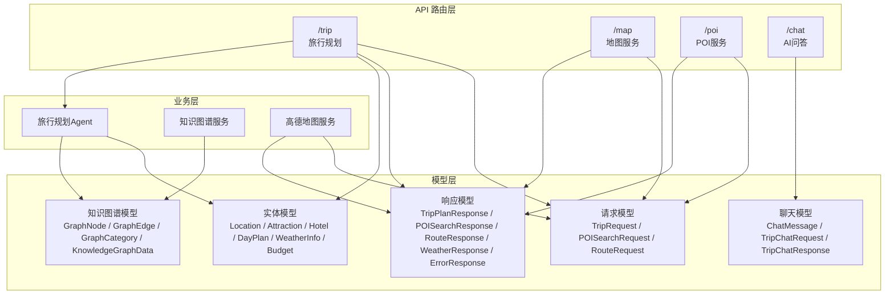
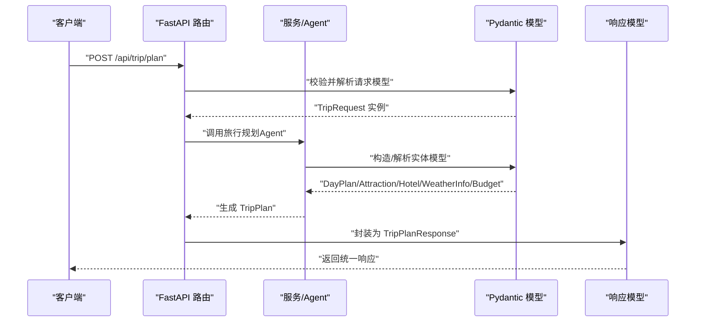
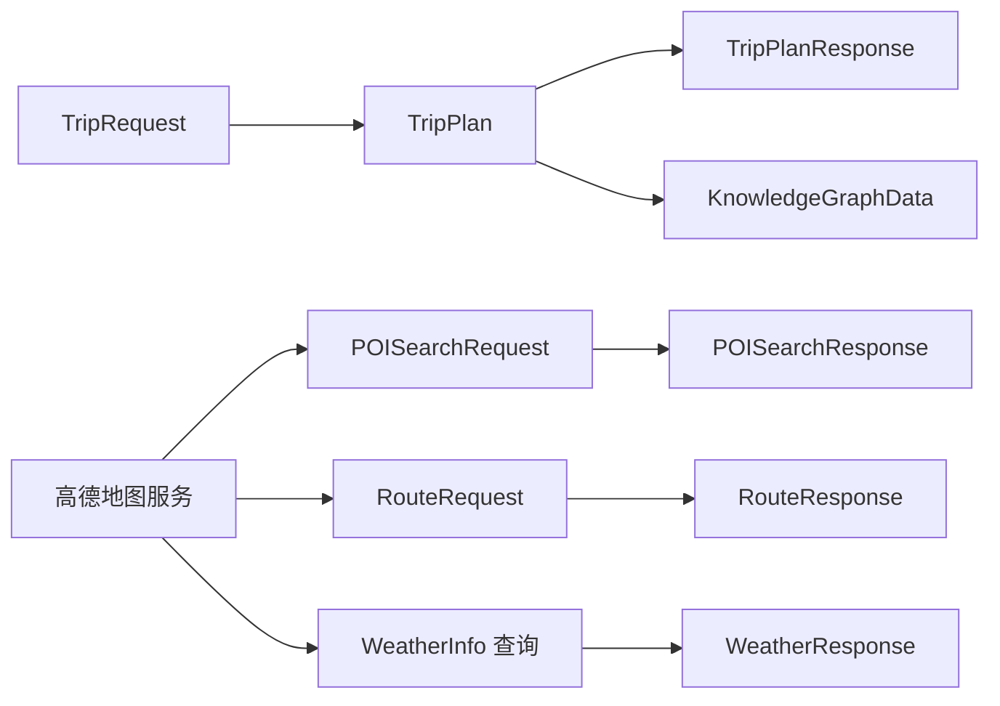
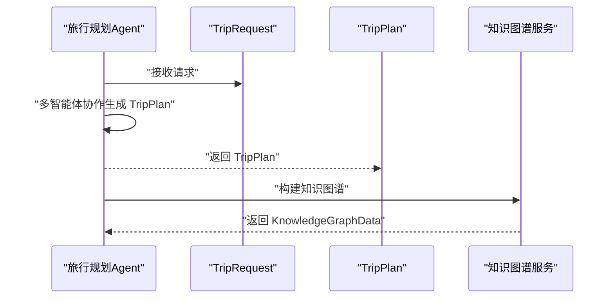

# 后端 Pydantic 模型

<cite>
**本文引用的文件**
- [schemas.py](file://backend/app/models/schemas.py)
- [trip.py](file://backend/app/api/routes/trip.py)
- [map.py](file://backend/app/api/routes/map.py)
- [poi.py](file://backend/app/api/routes/poi.py)
- [chat.py](file://backend/app/api/routes/chat.py)
- [main.py](file://backend/app/api/main.py)
- [trip_planner_agent.py](file://backend/app/agents/trip_planner_agent.py)
- [knowledge_graph_service.py](file://backend/app/services/knowledge_graph_service.py)
- [amap_service.py](file://backend/app/services/amap_service.py)
- [config.py](file://backend/app/config.py)
</cite>

## 目录
1. [简介](#简介)
2. [项目结构](#项目结构)
3. [核心组件](#核心组件)
4. [架构总览](#架构总览)
5. [详细组件分析](#详细组件分析)
6. [依赖分析](#依赖分析)
7. [性能考虑](#性能考虑)
8. [故障排查指南](#故障排查指南)
9. [结论](#结论)
10. [附录](#附录)

## 简介
本文件系统性梳理 TripStar 项目中基于 Pydantic 的数据模型设计，覆盖请求模型、响应模型、实体模型以及知识图谱相关模型。重点阐述字段定义、数据类型、验证规则、默认值与约束条件，解释模型间的继承与组合关系（如 DayPlan 包含 Attraction 与 Meal 列表），并总结 Pydantic 高级特性（如字段验证器 field_validator）在项目中的应用。同时给出模型在 FastAPI 中的使用方式（自动验证、序列化、OpenAPI 文档生成）及最佳实践建议。

## 项目结构
后端采用 FastAPI + Pydantic 的典型分层组织：
- models/schemas.py：集中定义所有 Pydantic 模型（请求/响应/实体/知识图谱/错误/聊天）
- api/routes/*：API 路由层，接收请求、调用服务、返回响应模型
- agents/*：多智能体旅行规划与数据清洗
- services/*：外部服务封装（高德地图、知识图谱构建等）

图表来源
- [trip.py:1-511](file://backend/app/api/routes/trip.py#L1-L511)
- [map.py:1-164](file://backend/app/api/routes/map.py#L1-L164)
- [poi.py:1-133](file://backend/app/api/routes/poi.py#L1-L133)
- [chat.py:1-53](file://backend/app/api/routes/chat.py#L1-L53)
- [schemas.py:1-264](file://backend/app/models/schemas.py#L1-L264)

章节来源
- [main.py:1-147](file://backend/app/api/main.py#L1-L147)
- [schemas.py:1-264](file://backend/app/models/schemas.py#L1-L264)

## 核心组件
本节概览所有 Pydantic 模型及其职责边界，便于快速定位。

- 请求模型
  - TripRequest：旅行规划输入（城市、起止日期、天数、交通、住宿偏好、偏好标签、自由文本）
  - POISearchRequest：POI 搜索输入（关键词、城市、是否限城市）
  - RouteRequest：路线规划输入（起点/终点地址、城市、路线类型）
- 响应模型
  - TripPlanResponse：旅行计划统一响应（成功标志、消息、计划ID、旅行计划、知识图谱）
  - POISearchResponse：POI 搜索统一响应（成功标志、消息、POI 列表）
  - RouteResponse：路线规划统一响应（成功标志、消息、路线信息）
  - WeatherResponse：天气查询统一响应（成功标志、消息、天气列表）
  - ErrorResponse：错误统一响应（成功标志、错误消息、错误码）
- 实体模型
  - Location：经纬度坐标
  - Attraction：景点信息（名称、地址、坐标、建议游览时长、描述、类别、评分、图片、POI ID、图片URL、票价、预约需求与提示）
  - Meal：餐饮信息（类型、名称、地址、坐标、描述、预估费用）
  - Hotel：酒店信息（名称、地址、坐标、价格范围、评分、距离、类型、预估费用）
  - DayPlan：单日行程（日期、天序号、描述、交通、住宿、酒店、景点列表、餐饮列表）
  - WeatherInfo：天气信息（日期、白天/夜间天气、白天/夜间温度、风向、风力）
  - Budget：预算信息（景点门票、酒店、餐饮、交通、总计）
  - TripPlan：旅行计划（城市、起止日期、每日行程、天气、总体建议、预算）
- 知识图谱模型
  - GraphNode / GraphEdge / GraphCategory：图节点、边、分类
  - KnowledgeGraphData：知识图谱数据（节点、边、分类）
- 聊天模型
  - ChatMessage：单条对话消息（角色、内容）
  - TripChatRequest：行程问答请求（问题、旅行计划JSON、历史对话）
  - TripChatResponse：行程问答响应（成功标志、回复）

章节来源
- [schemas.py:10-264](file://backend/app/models/schemas.py#L10-L264)

## 架构总览
Pydantic 模型贯穿请求输入、业务处理、响应输出的全链路，配合 FastAPI 的自动校验与 OpenAPI 文档生成，形成强类型、可验证、可文档化的接口契约。

图表来源
- [trip.py:276-388](file://backend/app/api/routes/trip.py#L276-L388)
- [schemas.py:146-195](file://backend/app/models/schemas.py#L146-L195)
- [trip_planner_agent.py:257-339](file://backend/app/agents/trip_planner_agent.py#L257-L339)

## 详细组件分析

### 请求模型

#### TripRequest
- 字段与约束
  - city：字符串，必填
  - start_date/end_date：字符串，必填，格式为 YYYY-MM-DD
  - travel_days：整数，必填，范围 [1, 30]
  - transportation/accommodation：字符串，必填
  - preferences：字符串列表，默认为空
  - free_text_input：可选字符串，默认空
- 验证与示例
  - 使用 Field 的约束与示例配置，支持 OpenAPI 文档生成
- 应用场景
  - 旅行规划入口，驱动多智能体协作与知识图谱构建

章节来源
- [schemas.py:10-34](file://backend/app/models/schemas.py#L10-L34)
- [trip.py:281-312](file://backend/app/api/routes/trip.py#L281-L312)

#### POISearchRequest
- 字段与约束
  - keywords/city：字符串，必填
  - citylimit：布尔，默认 True
- 应用场景
  - 地图服务 POI 搜索

章节来源
- [schemas.py:36-41](file://backend/app/models/schemas.py#L36-L41)
- [map.py:23-57](file://backend/app/api/routes/map.py#L23-L57)

#### RouteRequest
- 字段与约束
  - origin_address/destination_address：字符串，必填
  - origin_city/destination_city：可选字符串
  - route_type：字符串，默认 "walking"，取值 walking/driving/transit
- 应用场景
  - 路线规划服务

章节来源
- [schemas.py:43-49](file://backend/app/models/schemas.py#L43-L49)
- [map.py:105-139](file://backend/app/api/routes/map.py#L105-L139)

### 响应模型

#### TripPlanResponse
- 字段与约束
  - success：布尔，必填
  - message：字符串，默认空
  - plan_id：可选字符串
  - data：可选 TripPlan
  - graph_data：可选 KnowledgeGraphData
- 应用场景
  - 旅行规划统一响应载体，包含旅行计划与知识图谱

章节来源
- [schemas.py:188-195](file://backend/app/models/schemas.py#L188-L195)
- [trip.py:347-353](file://backend/app/api/routes/trip.py#L347-L353)

#### POISearchResponse / RouteResponse / WeatherResponse
- 字段与约束
  - 成功标志、消息、数据载体（POI 列表、路线信息、天气列表）
- 应用场景
  - 地图服务与 POI 服务的标准响应

章节来源
- [schemas.py:207-234](file://backend/app/models/schemas.py#L207-L234)
- [map.py:46-96](file://backend/app/api/routes/map.py#L46-L96)
- [poi.py:11-51](file://backend/app/api/routes/poi.py#L11-L51)

#### ErrorResponse
- 字段与约束
  - success：布尔，默认 False
  - message：字符串，必填
  - error_code：可选字符串
- 应用场景
  - 全局错误响应

章节来源
- [schemas.py:238-243](file://backend/app/models/schemas.py#L238-L243)

### 实体模型

#### Location
- 字段与约束
  - longitude/latitude：浮点数，必填
- 应用场景
  - 所有地理坐标引用的基础类型

章节来源
- [schemas.py:54-58](file://backend/app/models/schemas.py#L54-L58)

#### Attraction
- 字段与约束
  - name/address/location/visit_duration/description：必填
  - category/rating/photos/poi_id/image_url/ticket_price/reservation_required/reservation_tips：可选/默认值
- 应用场景
  - 景点评测、知识图谱节点

章节来源
- [schemas.py:60-75](file://backend/app/models/schemas.py#L60-L75)

#### Meal
- 字段与约束
  - type/name：必填；type 取值 breakfast/lunch/dinner/snack
  - address/location/description/estimated_cost：可选/默认值
- 应用场景
  - 行程中的餐饮安排

章节来源
- [schemas.py:77-85](file://backend/app/models/schemas.py#L77-L85)

#### Hotel
- 字段与约束
  - name/address/location/price_range/rating/distance/type/estimated_cost：可选/默认值
- 应用场景
  - 住宿推荐与知识图谱节点

章节来源
- [schemas.py:87-97](file://backend/app/models/schemas.py#L87-L97)

#### DayPlan
- 字段与约束
  - date/day_index/description/transportation/accommodation：必填
  - hotel：可选 Hotel
  - attractions/meals：列表，默认空
- 组合关系
  - 包含 Attraction 列表与 Meal 列表，体现“单日行程”的聚合
- 应用场景
  - 旅行计划的最小单元

章节来源
- [schemas.py:99-109](file://backend/app/models/schemas.py#L99-L109)

#### WeatherInfo
- 字段与约束
  - date/day_weather/night_weather/day_temp/night_temp/wind_direction/wind_power：可选/默认值
- 高级特性
  - 使用 field_validator 对 day_temp/night_temp 进行“before”模式解析，移除温度单位并转换为整数
- 应用场景
  - 天气信息注入旅行计划

章节来源
- [schemas.py:111-135](file://backend/app/models/schemas.py#L111-L135)

#### Budget
- 字段与约束
  - total_attractions/total_hotels/total_meals/total_transportation/total：整数，默认 0
- 应用场景
  - 旅行预算汇总

章节来源
- [schemas.py:137-144](file://backend/app/models/schemas.py#L137-L144)

#### TripPlan
- 字段与约束
  - city/start_date/end_date/days/weather_info/overall_suggestions：必填
  - budget：可选 Budget
- 组合关系
  - 包含 DayPlan 列表、WeatherInfo 列表、Budget（可选）
- 应用场景
  - 旅行计划的顶层聚合模型

章节来源
- [schemas.py:146-155](file://backend/app/models/schemas.py#L146-L155)

### 知识图谱模型

#### GraphNode / GraphEdge / GraphCategory
- 字段与约束
  - GraphNode：id/name/category/symbolSize/itemStyle/value
  - GraphEdge：source/target/label
  - GraphCategory：name
- 应用场景
  - 知识图谱数据结构

章节来源
- [schemas.py:159-186](file://backend/app/models/schemas.py#L159-L186)

#### KnowledgeGraphData
- 字段与约束
  - nodes/edges/categories：列表，默认空
- 应用场景
  - 旅行计划到知识图谱的映射载体

章节来源
- [schemas.py:181-186](file://backend/app/models/schemas.py#L181-L186)

### 聊天模型

#### ChatMessage / TripChatRequest / TripChatResponse
- 字段与约束
  - ChatMessage：role/content
  - TripChatRequest：message/trip_plan/history
  - TripChatResponse：success/reply
- 应用场景
  - 基于旅行计划上下文的智能问答

章节来源
- [schemas.py:247-264](file://backend/app/models/schemas.py#L247-L264)
- [chat.py:16-43](file://backend/app/api/routes/chat.py#L16-L43)

## 依赖分析

### 模型与路由的耦合
- 旅行规划路由依赖 TripRequest 作为入参，返回 TripPlanResponse；内部通过 Agent 生成 TripPlan，并调用知识图谱服务生成 KnowledgeGraphData。
- 地图服务路由依赖 POISearchRequest/RouteRequest，返回 POISearchResponse/RouteResponse/WeatherResponse。
- POI 详情与照片路由返回 POIDetailResponse/POISearchResponse。

图表来源
- [trip.py:276-388](file://backend/app/api/routes/trip.py#L276-L388)
- [map.py:17-139](file://backend/app/api/routes/map.py#L17-L139)
- [poi.py:18-131](file://backend/app/api/routes/poi.py#L18-L131)
- [knowledge_graph_service.py:34-168](file://backend/app/services/knowledge_graph_service.py#L34-L168)
- [amap_service.py:50-276](file://backend/app/services/amap_service.py#L50-L276)

### 模型与 Agent 的交互
- Agent 接收 TripRequest，内部通过多智能体协作生成 TripPlan；随后将 TripPlan 交给知识图谱服务构建图数据。
- Agent 在解析 LLM 输出时，对 JSON 进行多轮容错修复，最终构造 TripPlan。

图表来源
- [trip_planner_agent.py:257-339](file://backend/app/agents/trip_planner_agent.py#L257-L339)
- [knowledge_graph_service.py:34-168](file://backend/app/services/knowledge_graph_service.py#L34-L168)

## 性能考虑
- 模型解析与序列化
  - 使用 model_dump(mode="json") 进行序列化，确保复杂类型（如枚举、日期）可安全序列化为 JSON。
- 字段验证器
  - WeatherInfo 的温度解析在“before”模式下进行，避免重复转换与异常传播。
- 并发与容错
  - 旅行规划 Agent 对 LLM 输出进行多轮修复与重试，提升稳定性。
- 外部服务
  - 高德地图服务封装为单例，减少工具初始化开销；工具调用参数严格映射，降低错误率。

章节来源
- [trip.py:41-46](file://backend/app/api/routes/trip.py#L41-L46)
- [trip_planner_agent.py:354-387](file://backend/app/agents/trip_planner_agent.py#L354-L387)
- [amap_service.py:12-47](file://backend/app/services/amap_service.py#L12-L47)

## 故障排查指南
- 温度字段解析失败
  - 现象：温度字段包含单位（如 °C、℃），解析为 0
  - 处理：确认上游数据格式，或在调用前预处理；模型已内置解析逻辑
- LLM 输出 JSON 不合法
  - 现象：解析失败或截断
  - 处理：Agent 提供多轮修复策略（去引号、截断修复、正则提取、LLM 修复）
- 高德地图工具未配置
  - 现象：初始化时报错，提示未配置 API Key
  - 处理：在运行时设置或环境变量中配置 VITE_AMAP_WEB_KEY
- 任务持久化失败
  - 现象：任务状态无法持久化
  - 处理：检查数据目录权限与磁盘空间

章节来源
- [schemas.py:121-135](file://backend/app/models/schemas.py#L121-L135)
- [trip_planner_agent.py:424-602](file://backend/app/agents/trip_planner_agent.py#L424-L602)
- [amap_service.py:24-25](file://backend/app/services/amap_service.py#L24-L25)
- [trip.py:82-104](file://backend/app/api/routes/trip.py#L82-L104)

## 结论
TripStar 的 Pydantic 模型体系以强类型与自动验证为核心，结合 FastAPI 的 OpenAPI 文档能力，实现了清晰的接口契约与良好的可维护性。模型间通过组合关系（如 DayPlan 包含 Attraction/Meal 列表）表达旅行计划的数据结构，再由 Agent 与服务层将其转化为知识图谱与统一响应。通过字段验证器与多轮容错修复，提升了数据质量与系统鲁棒性。

## 附录

### 字段验证器与自定义逻辑
- WeatherInfo.temperature 解析
  - 使用 field_validator 的“before”模式，移除温度单位并转换为整数
  - 适用于上游返回字符串温度（如 "25°C"）

章节来源
- [schemas.py:121-135](file://backend/app/models/schemas.py#L121-L135)

### 在 FastAPI 中的应用
- 自动验证
  - 路由函数参数类型标注为 Pydantic 模型，FastAPI 自动进行字段校验与错误处理
- 序列化
  - 使用 model_dump(mode="json") 将模型序列化为 JSON，确保复杂类型安全
- OpenAPI 文档
  - 模型的 description、example、Config.json_schema_extra 等字段参与 OpenAPI 文档生成

章节来源
- [trip.py:281-312](file://backend/app/api/routes/trip.py#L281-L312)
- [map.py:23-57](file://backend/app/api/routes/map.py#L23-L57)
- [schemas.py:21-33](file://backend/app/models/schemas.py#L21-L33)

### 最佳实践建议
- 字段命名
  - 使用语义明确的英文命名，避免缩写；与前端约定一致
- 文档字符串
  - 为每个字段添加 description 与 example，提升 OpenAPI 可读性
- 默认值与约束
  - 明确默认值与范围约束（如 travel_days 的 ge/le），减少边界错误
- 数据转换
  - 对易变字段（如温度）使用 field_validator 进行标准化
- 错误处理
  - 使用 ErrorResponse 统一错误响应格式，便于前端处理
- 类型一致性
  - 保持模型与服务返回数据的一致性，必要时在服务层进行适配