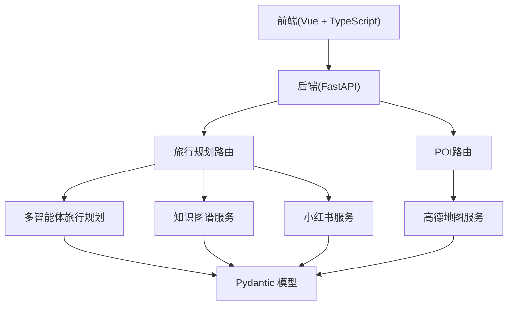
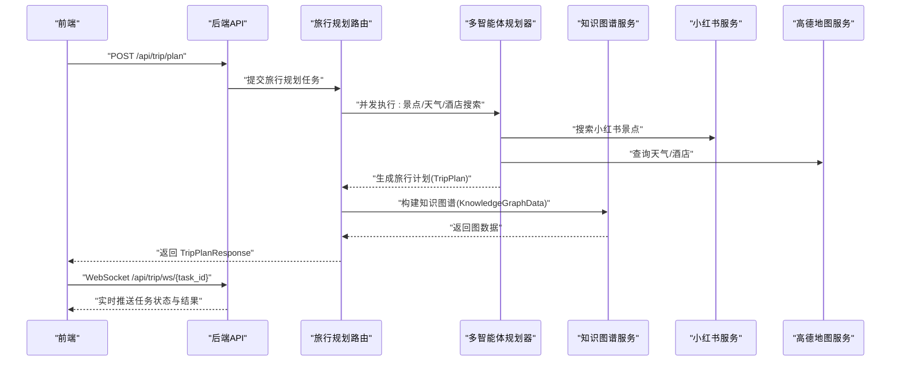
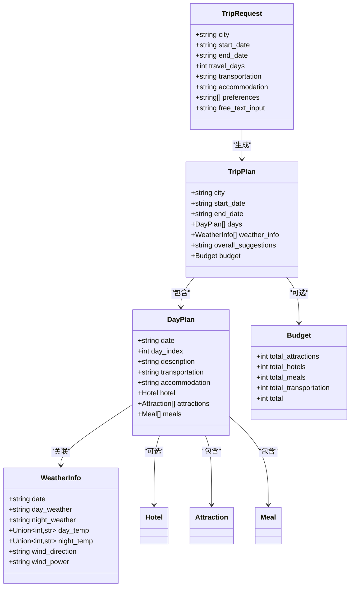
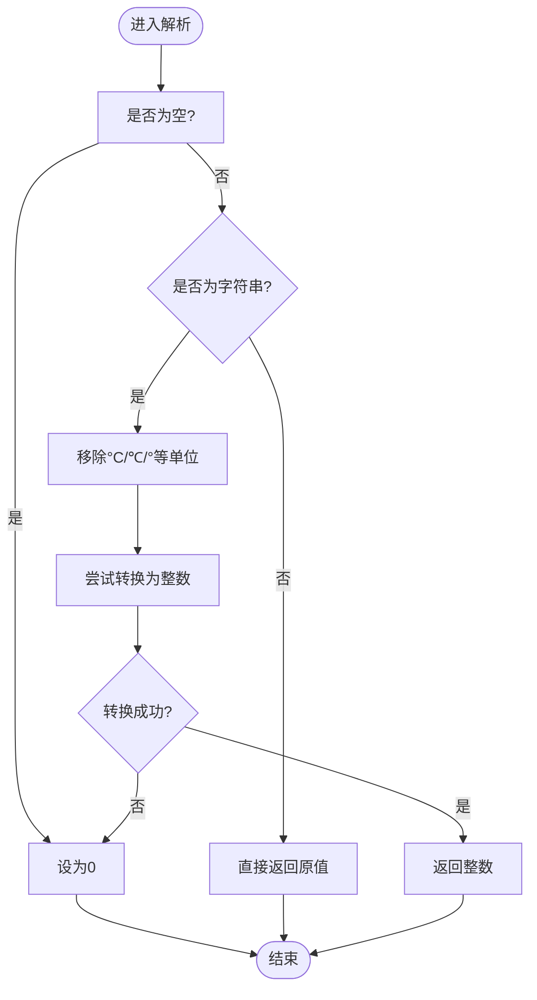
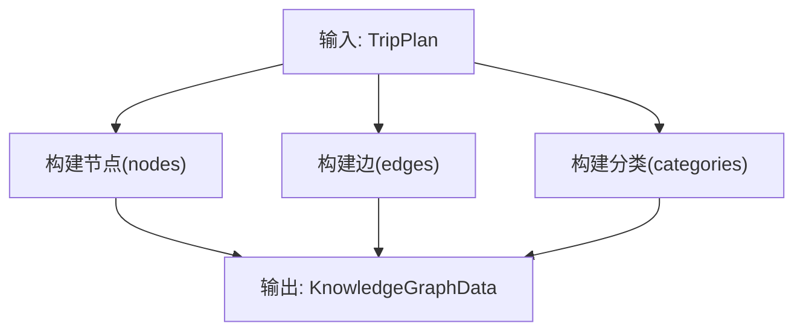
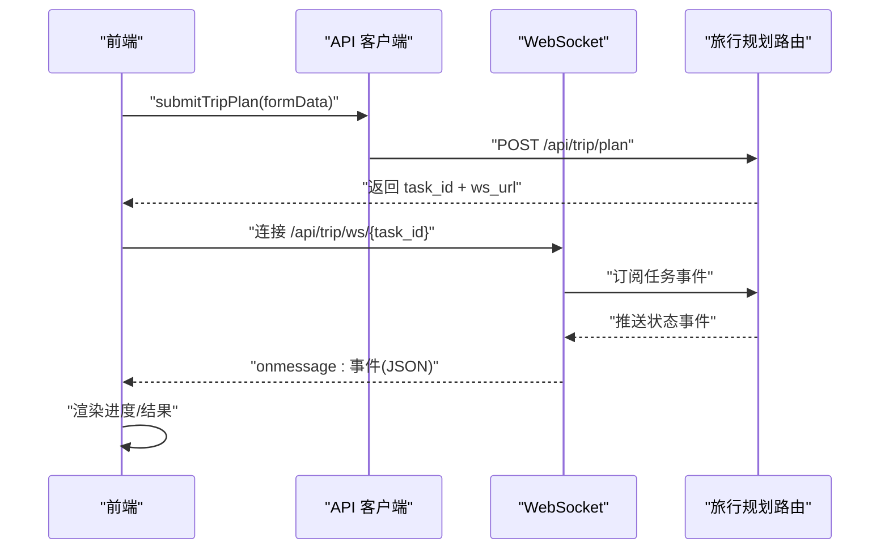
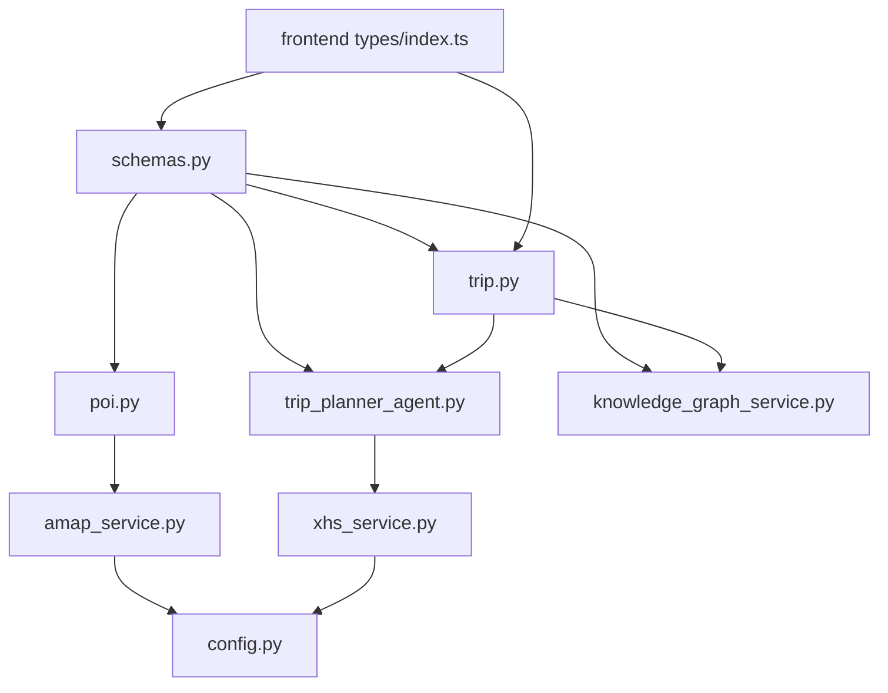

# 数据模型

<cite>
**本文引用的文件**
- [schemas.py](file://backend/app/models/schemas.py)
- [trip.py](file://backend/app/api/routes/trip.py)
- [poi.py](file://backend/app/api/routes/poi.py)
- [main.py](file://backend/app/api/main.py)
- [trip_planner_agent.py](file://backend/app/agents/trip_planner_agent.py)
- [knowledge_graph_service.py](file://backend/app/services/knowledge_graph_service.py)
- [api.ts](file://frontend/src/services/api.ts)
- [index.ts](file://frontend/src/types/index.ts)
- [amap_service.py](file://backend/app/services/amap_service.py)
- [xhs_service.py](file://backend/app/services/xhs_service.py)
- [config.py](file://backend/app/config.py)
</cite>

## 目录
1. [简介](#简介)
2. [项目结构](#项目结构)
3. [核心数据模型](#核心数据模型)
4. [架构总览](#架构总览)
5. [组件详解](#组件详解)
6. [依赖关系分析](#依赖关系分析)
7. [性能考量](#性能考量)
8. [故障排查指南](#故障排查指南)
9. [结论](#结论)
10. [附录](#附录)

## 简介
本文件系统性梳理 TripStar 项目的后端 Pydantic 数据模型与前端 TypeScript 类型定义，覆盖旅行请求、旅行计划、每日行程、景点信息、知识图谱等核心模型，说明字段定义、数据类型、验证规则、默认值与相互关系；并解释从前端 API 请求到后端多智能体生成旅行计划、到知识图谱构建、再到前端展示的完整数据流转过程。同时介绍数据验证与序列化机制、扩展与演进策略以及最佳实践。

## 项目结构
后端采用 FastAPI + Pydantic + 多智能体协作的架构，前端使用 Vue + TypeScript。数据模型主要集中在后端 models 层，API 路由负责接收请求、触发任务、推送状态；多智能体负责生成旅行计划；知识图谱服务负责从计划中抽取实体与关系；前端通过 API 客户端与后端交互，支持 WebSocket 实时订阅任务状态。

图表来源
- [main.py:55-60](file://backend/app/api/main.py#L55-L60)
- [trip.py:17-17](file://backend/app/api/routes/trip.py#L17-L17)
- [poi.py:8-8](file://backend/app/api/routes/poi.py#L8-L8)
- [trip_planner_agent.py:173-242](file://backend/app/agents/trip_planner_agent.py#L173-L242)
- [knowledge_graph_service.py:34-168](file://backend/app/services/knowledge_graph_service.py#L34-L168)
- [amap_service.py:50-276](file://backend/app/services/amap_service.py#L50-L276)
- [xhs_service.py:68-444](file://backend/app/services/xhs_service.py#L68-L444)

章节来源
- [main.py:55-60](file://backend/app/api/main.py#L55-L60)
- [trip.py:17-17](file://backend/app/api/routes/trip.py#L17-L17)
- [poi.py:8-8](file://backend/app/api/routes/poi.py#L8-L8)

## 核心数据模型
本节对后端 Pydantic 模型与前端 TypeScript 类型进行逐项说明，包括字段定义、数据类型、验证规则、默认值与相互关系。

### 旅行请求模型
- 后端模型：TripRequest
  - 字段与类型
    - city: str
    - start_date: str (YYYY-MM-DD)
    - end_date: str (YYYY-MM-DD)
    - travel_days: int (ge=1, le=30)
    - transportation: str
    - accommodation: str
    - preferences: List[str]
    - free_text_input: Optional[str]
  - 验证规则
    - travel_days 限定范围 1~30
    - 所有字段均为必需
  - 默认值
    - preferences: []
    - free_text_input: ""
  - 示例
    - [schemas.py:10-33](file://backend/app/models/schemas.py#L10-L33)

- 前端类型：TripFormData
  - 字段与类型
    - city: string
    - start_date: string
    - end_date: string
    - travel_days: number
    - transportation: string
    - accommodation: string
    - preferences: string[]
    - free_text_input: string
  - 与后端模型一一对应，便于表单提交与序列化
  - [index.ts:79-88](file://frontend/src/types/index.ts#L79-L88)

章节来源
- [schemas.py:10-33](file://backend/app/models/schemas.py#L10-L33)
- [index.ts:79-88](file://frontend/src/types/index.ts#L79-L88)

### POI 搜索与路线请求模型
- 后端模型：POISearchRequest、RouteRequest
  - POISearchRequest
    - keywords: str
    - city: str
    - citylimit: bool (default=True)
  - RouteRequest
    - origin_address: str
    - destination_address: str
    - origin_city: Optional[str]
    - destination_city: Optional[str]
    - route_type: str (default="walking")
  - [schemas.py:36-50](file://backend/app/models/schemas.py#L36-L50)

- 前端类型：与后端模型字段一致，便于 API 调用
  - [index.ts:1-196](file://frontend/src/types/index.ts#L1-L196)

章节来源
- [schemas.py:36-50](file://backend/app/models/schemas.py#L36-L50)
- [index.ts:1-196](file://frontend/src/types/index.ts#L1-L196)

### 地理位置与基础实体模型
- 后端模型：Location、Attraction、Meal、Hotel
  - Location
    - longitude: float
    - latitude: float
  - Attraction
    - name: str
    - address: str
    - location: Location
    - visit_duration: int
    - description: str
    - category: Optional[str] (default="景点")
    - rating: Optional[float]
    - photos: Optional[List[str]]
    - poi_id: Optional[str] (default="")
    - image_url: Optional[str]
    - ticket_price: int (default=0)
    - reservation_required: Optional[bool] (default=False)
    - reservation_tips: Optional[str] (default="")
  - Meal
    - type: str (枚举: breakfast/lunch/dinner/snack)
    - name: str
    - address: Optional[str]
    - location: Optional[Location]
    - description: Optional[str]
    - estimated_cost: int (default=0)
  - Hotel
    - name: str
    - address: str (default="")
    - location: Optional[Location]
    - price_range: str (default="")
    - rating: str (default="")
    - distance: str (default="")
    - type: str (default="")
    - estimated_cost: int (default=0)
  - [schemas.py:54-97](file://backend/app/models/schemas.py#L54-L97)

- 前端类型：Location、Attraction、Meal、Hotel
  - 与后端模型字段一致，部分可选字段在前端以可选属性表示
  - [index.ts:3-38](file://frontend/src/types/index.ts#L3-L38)

章节来源
- [schemas.py:54-97](file://backend/app/models/schemas.py#L54-L97)
- [index.ts:3-38](file://frontend/src/types/index.ts#L3-L38)

### 每日行程与天气、预算模型
- 后端模型：DayPlan、WeatherInfo、Budget
  - DayPlan
    - date: str (YYYY-MM-DD)
    - day_index: int
    - description: str
    - transportation: str
    - accommodation: str
    - hotel: Optional[Hotel]
    - attractions: List[Attraction]
    - meals: List[Meal]
  - WeatherInfo
    - date: str (YYYY-MM-DD)
    - day_weather: str (default="")
    - night_weather: str (default="")
    - day_temp: Union[int, str] (default=0)
    - night_temp: Union[int, str] (default=0)
    - wind_direction: str (default="")
    - wind_power: str (default="")
    - 字段校验：day_temp、night_temp 使用 field_validator 解析字符串温度并移除单位
  - Budget
    - total_attractions: int (default=0)
    - total_hotels: int (default=0)
    - total_meals: int (default=0)
    - total_transportation: int (default=0)
    - total: int (default=0)
  - [schemas.py:99-144](file://backend/app/models/schemas.py#L99-L144)

- 前端类型：DayPlan、WeatherInfo、Budget
  - WeatherInfo 的温度字段在前端统一为 number 类型
  - [index.ts:48-77](file://frontend/src/types/index.ts#L48-L77)

章节来源
- [schemas.py:99-144](file://backend/app/models/schemas.py#L99-L144)
- [index.ts:48-77](file://frontend/src/types/index.ts#L48-L77)

### 旅行计划与响应模型
- 后端模型：TripPlan、TripPlanResponse
  - TripPlan
    - city: str
    - start_date: str
    - end_date: str
    - days: List[DayPlan]
    - weather_info: List[WeatherInfo] (default=[])
    - overall_suggestions: str
    - budget: Optional[Budget]
  - TripPlanResponse
    - success: bool
    - message: str (default="")
    - plan_id: Optional[str]
    - data: Optional[TripPlan]
    - graph_data: Optional[KnowledgeGraphData]
  - [schemas.py:146-195](file://backend/app/models/schemas.py#L146-L195)

- 前端类型：TripPlan、TripPlanResponse
  - 与后端模型字段一致
  - [index.ts:69-96](file://frontend/src/types/index.ts#L69-L96)

章节来源
- [schemas.py:146-195](file://backend/app/models/schemas.py#L146-L195)
- [index.ts:69-96](file://frontend/src/types/index.ts#L69-L96)

### 知识图谱数据模型
- 后端模型：GraphNode、GraphEdge、GraphCategory、KnowledgeGraphData
  - GraphNode
    - id: str
    - name: str
    - category: int (default=0)
    - symbolSize: int (default=30)
    - itemStyle: Optional[dict]
    - value: Optional[str]
  - GraphEdge
    - source: str
    - target: str
    - label: str (default="")
  - GraphCategory
    - name: str
  - KnowledgeGraphData
    - nodes: List[GraphNode]
    - edges: List[GraphEdge]
    - categories: List[GraphCategory]
  - [schemas.py:159-186](file://backend/app/models/schemas.py#L159-L186)

- 前端类型：GraphNode、GraphEdge、GraphCategory、KnowledgeGraphData
  - 与后端模型字段一致
  - [index.ts:154-177](file://frontend/src/types/index.ts#L154-L177)

章节来源
- [schemas.py:159-186](file://backend/app/models/schemas.py#L159-L186)
- [index.ts:154-177](file://frontend/src/types/index.ts#L154-L177)

### POI 信息与响应模型
- 后端模型：POIInfo、POISearchResponse、RouteInfo、RouteResponse、WeatherResponse
  - POIInfo
    - id: str
    - name: str
    - type: str
    - address: str
    - location: Location
    - tel: Optional[str]
  - POISearchResponse
    - success: bool
    - message: str (default="")
    - data: List[POIInfo]
  - RouteInfo
    - distance: float
    - duration: int
    - route_type: str
    - description: str
  - RouteResponse
    - success: bool
    - message: str (default="")
    - data: Optional[RouteInfo]
  - WeatherResponse
    - success: bool
    - message: str (default="")
    - data: List[WeatherInfo]
  - [schemas.py:197-234](file://backend/app/models/schemas.py#L197-L234)

- 前端类型：与后端模型字段一致
  - [index.ts:1-196](file://frontend/src/types/index.ts#L1-L196)

章节来源
- [schemas.py:197-234](file://backend/app/models/schemas.py#L197-L234)
- [index.ts:1-196](file://frontend/src/types/index.ts#L1-L196)

### 错误与聊天模型
- 后端模型：ErrorResponse、ChatMessage、TripChatRequest、TripChatResponse
  - ErrorResponse
    - success: bool (default=False)
    - message: str
    - error_code: Optional[str]
  - ChatMessage
    - role: str (user / assistant)
    - content: str
  - TripChatRequest
    - message: str
    - trip_plan: dict
    - history: Optional[List[ChatMessage]]
  - TripChatResponse
    - success: bool (default=True)
    - reply: str
  - [schemas.py:238-264](file://backend/app/models/schemas.py#L238-L264)

- 前端类型：ChatMessage、TripChatRequest、TripChatResponse
  - [index.ts:181-195](file://frontend/src/types/index.ts#L181-L195)

章节来源
- [schemas.py:238-264](file://backend/app/models/schemas.py#L238-L264)
- [index.ts:181-195](file://frontend/src/types/index.ts#L181-L195)

## 架构总览
下图展示了从前端请求到后端多智能体生成旅行计划、知识图谱构建、再到前端展示的完整数据流。

图表来源
- [trip.py:276-363](file://backend/app/api/routes/trip.py#L276-L363)
- [trip_planner_agent.py:257-338](file://backend/app/agents/trip_planner_agent.py#L257-L338)
- [knowledge_graph_service.py:34-168](file://backend/app/services/knowledge_graph_service.py#L34-L168)
- [api.ts:219-318](file://frontend/src/services/api.ts#L219-L318)

章节来源
- [trip.py:276-363](file://backend/app/api/routes/trip.py#L276-L363)
- [trip_planner_agent.py:257-338](file://backend/app/agents/trip_planner_agent.py#L257-L338)
- [knowledge_graph_service.py:34-168](file://backend/app/services/knowledge_graph_service.py#L34-L168)
- [api.ts:219-318](file://frontend/src/services/api.ts#L219-L318)

## 组件详解

### 旅行请求与旅行计划模型关系
- 旅行请求模型用于接收前端表单数据，后端通过 Pydantic 校验并转换为 TripRequest。
- 多智能体规划器根据请求生成 TripPlan，其中包含多日行程、天气信息、预算等。
- 响应模型 TripPlanResponse 将最终结果与知识图谱数据一并返回。

图表来源
- [schemas.py:10-195](file://backend/app/models/schemas.py#L10-L195)

章节来源
- [schemas.py:10-195](file://backend/app/models/schemas.py#L10-L195)

### 天气信息字段解析逻辑
- WeatherInfo 的 day_temp、night_temp 支持 int 或 str，使用 field_validator 在解析时移除温度单位并转换为整数。

图表来源
- [schemas.py:121-134](file://backend/app/models/schemas.py#L121-L134)

章节来源
- [schemas.py:121-134](file://backend/app/models/schemas.py#L121-L134)

### 知识图谱构建流程
- 从 TripPlan 中抽取节点与边，生成 ECharts 所需的 nodes、edges、categories。
- 节点分类与样式、尺寸通过映射表配置，边标注体现关系语义。

图表来源
- [knowledge_graph_service.py:34-168](file://backend/app/services/knowledge_graph_service.py#L34-L168)

章节来源
- [knowledge_graph_service.py:34-168](file://backend/app/services/knowledge_graph_service.py#L34-L168)

### 前端 API 客户端与 WebSocket 订阅
- 前端通过 api.ts 发送请求、轮询任务状态或建立 WebSocket 订阅。
- 任务状态通过事件对象传输，包含进度、阶段、消息、结果或错误。

图表来源
- [api.ts:219-318](file://frontend/src/services/api.ts#L219-L318)
- [trip.py:390-440](file://backend/app/api/routes/trip.py#L390-L440)

章节来源
- [api.ts:219-318](file://frontend/src/services/api.ts#L219-L318)
- [trip.py:390-440](file://backend/app/api/routes/trip.py#L390-L440)

## 依赖关系分析
- 后端路由依赖模型定义与服务层
  - 旅行规划路由依赖 TripRequest、TripPlanResponse、多智能体规划器与知识图谱服务
  - POI 路由依赖高德地图服务
- 前端类型与后端模型强耦合，确保前后端一致的契约
- 配置模块提供运行时设置，影响服务可用性与行为

图表来源
- [schemas.py:1-264](file://backend/app/models/schemas.py#L1-L264)
- [trip.py:13-15](file://backend/app/api/routes/trip.py#L13-L15)
- [poi.py:3-6](file://backend/app/api/routes/poi.py#L3-L6)
- [trip_planner_agent.py:9-11](file://backend/app/agents/trip_planner_agent.py#L9-L11)
- [knowledge_graph_service.py:6-7](file://backend/app/services/knowledge_graph_service.py#L6-L7)
- [amap_service.py:4-6](file://backend/app/services/amap_service.py#L4-L6)
- [xhs_service.py:15-16](file://backend/app/services/xhs_service.py#L15-L16)
- [config.py:21-71](file://backend/app/config.py#L21-L71)
- [index.ts:1-196](file://frontend/src/types/index.ts#L1-L196)

章节来源
- [schemas.py:1-264](file://backend/app/models/schemas.py#L1-L264)
- [trip.py:13-15](file://backend/app/api/routes/trip.py#L13-L15)
- [poi.py:3-6](file://backend/app/api/routes/poi.py#L3-L6)
- [trip_planner_agent.py:9-11](file://backend/app/agents/trip_planner_agent.py#L9-L11)
- [knowledge_graph_service.py:6-7](file://backend/app/services/knowledge_graph_service.py#L6-L7)
- [amap_service.py:4-6](file://backend/app/services/amap_service.py#L4-L6)
- [xhs_service.py:15-16](file://backend/app/services/xhs_service.py#L15-L16)
- [config.py:21-71](file://backend/app/config.py#L21-L71)
- [index.ts:1-196](file://frontend/src/types/index.ts#L1-L196)

## 性能考量
- 旅行规划并发优化
  - 景点、天气、酒店搜索通过并发执行，缩短总耗时
  - 规划阶段使用较长超时与重试机制，提升稳定性
- 温度解析与 JSON 容错
  - WeatherInfo 的温度解析减少字符串处理开销
  - 多轮 JSON 清洗与修复，降低大模型输出不稳定带来的失败率
- WebSocket 与持久化
  - 任务状态持久化到本地文件，服务重启后可恢复或标记失败，避免前端无限等待

章节来源
- [trip_planner_agent.py:264-338](file://backend/app/agents/trip_planner_agent.py#L264-L338)
- [trip_planner_agent.py:424-758](file://backend/app/agents/trip_planner_agent.py#L424-L758)
- [trip.py:82-144](file://backend/app/api/routes/trip.py#L82-L144)

## 故障排查指南
- 配置问题
  - 高德地图 API Key 未配置会导致 POI/地理编码功能不可用
  - LLM API Key 未配置会影响 AI 生成能力
  - 可通过运行时设置接口更新配置并持久化
- 小红书 Cookie 过期
  - 触发特定异常，前端可识别并提示更换 Cookie
- 任务状态异常
  - 服务重启后处理中任务会被标记为失败，前端需提示重新生成
  - WebSocket 断开或消息解析失败时，前端应回退到轮询

章节来源
- [config.py:163-179](file://backend/app/config.py#L163-L179)
- [xhs_service.py:22-24](file://backend/app/services/xhs_service.py#L22-L24)
- [trip.py:71-78](file://backend/app/api/routes/trip.py#L71-L78)
- [api.ts:286-317](file://frontend/src/services/api.ts#L286-L317)

## 结论
本项目通过 Pydantic 与 TypeScript 双向约束，确保数据在前后端的一致性与可验证性；后端采用多智能体协作与知识图谱构建，实现高质量旅行计划生成；前端通过 WebSocket 实时订阅任务状态，提供流畅的用户体验。模型设计遵循可扩展与向后兼容原则，结合运行时配置与持久化策略，满足生产环境的稳定性与可维护性需求。

## 附录
- 数据验证与序列化
  - 后端使用 Pydantic 校验与 model_dump(mode="json") 序列化，确保输出格式稳定
  - 前端使用 TypeScript 类型约束，避免运行时类型错误
- 扩展与演进策略
  - 新增字段建议保留默认值，保证向后兼容
  - 复杂字段可拆分为子模型，增强可读性与可测试性
  - 通过运行时设置接口动态调整外部服务密钥，无需重启服务
- 使用示例与最佳实践
  - 前端提交旅行请求时，确保日期格式与偏好标签符合后端约束
  - 后端在生成旅行计划时，严格遵循提示词约束，避免 JSON 格式污染
  - 前端在 WebSocket 订阅失败时，回退到轮询查询任务状态