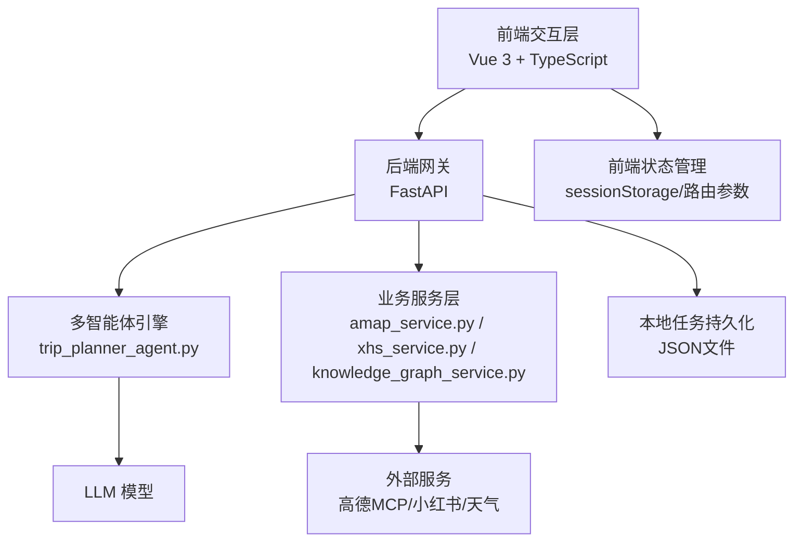
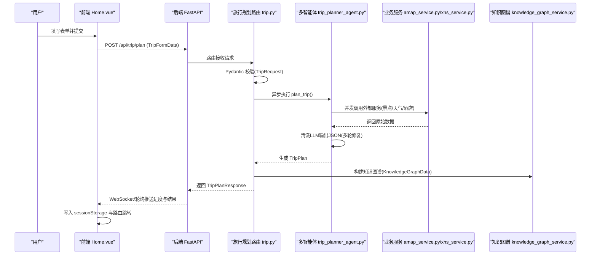
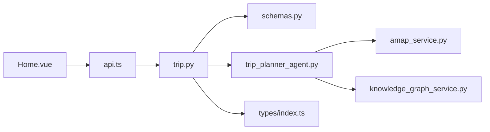

# 数据流转与验证

<cite>
**本文引用的文件**
- [backend/app/api/main.py](file://backend/app/api/main.py)
- [backend/app/api/routes/trip.py](file://backend/app/api/routes/trip.py)
- [backend/app/api/routes/poi.py](file://backend/app/api/routes/poi.py)
- [backend/app/models/schemas.py](file://backend/app/models/schemas.py)
- [backend/app/config.py](file://backend/app/config.py)
- [backend/app/services/amap_service.py](file://backend/app/services/amap_service.py)
- [backend/app/services/knowledge_graph_service.py](file://backend/app/services/knowledge_graph_service.py)
- [backend/app/agents/trip_planner_agent.py](file://backend/app/agents/trip_planner_agent.py)
- [backend/run.py](file://backend/run.py)
- [frontend/src/services/api.ts](file://frontend/src/services/api.ts)
- [frontend/src/types/index.ts](file://frontend/src/types/index.ts)
- [frontend/src/views/Home.vue](file://frontend/src/views/Home.vue)
- [frontend/src/components/AIChat.vue](file://frontend/src/components/AIChat.vue)
- [README.md](file://README.md)
</cite>

## 目录
1. [简介](#简介)
2. [项目结构](#项目结构)
3. [核心组件](#核心组件)
4. [架构总览](#架构总览)
5. [详细组件分析](#详细组件分析)
6. [依赖关系分析](#依赖关系分析)
7. [性能考量](#性能考量)
8. [故障排查指南](#故障排查指南)
9. [结论](#结论)
10. [附录](#附录)

## 简介
本文件聚焦 TripStar 项目的数据流转与验证机制，系统梳理从前端表单输入、API 请求参数、后端 Pydantic 验证、多智能体数据清洗与合成、知识图谱构建，到前端状态管理与展示的完整闭环。重点阐述：
- 多层次数据验证：前端表单规则、后端 Pydantic 模型校验、运行时配置校验、外部服务调用结果清洗。
- 序列化与反序列化：JSON 转换、类型转换、字段映射与兼容处理。
- 数据一致性保障：字段校验、范围检查、格式验证、跨组件字段对齐。
- 性能优化策略：异步任务、并发执行、结果缓存、懒加载与增量渲染。
- 错误处理与异常传播：验证错误、业务错误、系统错误的分类与反馈。

## 项目结构
项目采用前后端分离架构，后端基于 FastAPI，前端基于 Vue 3 + TypeScript，多智能体与外部服务通过 MCP/HTTP 接口集成。

图表来源
- [README.md:47-97](file://README.md#L47-L97)
- [backend/app/api/main.py:138-147](file://backend/app/api/main.py#L138-L147)
- [backend/app/agents/trip_planner_agent.py:173-242](file://backend/app/agents/trip_planner_agent.py#L173-L242)

章节来源
- [README.md:43-127](file://README.md#L43-L127)
- [backend/app/api/main.py:1-147](file://backend/app/api/main.py#L1-L147)

## 核心组件
- 前端表单与状态
  - 表单输入：Home.vue 负责收集城市、日期、偏好、交通与住宿等信息。
  - 状态管理：generateTripPlan 通过 WebSocket 事件与轮询状态，将结果写入 sessionStorage。
- 后端路由与任务系统
  - 异步任务：trip.py 提交任务立即返回 task_id，后台异步执行并广播进度。
  - 任务持久化：任务状态以 JSON 文件形式落盘，重启后恢复处理中任务为失败。
- 数据模型与验证
  - Pydantic 模型：schemas.py 定义请求/响应模型，内置字段范围与格式约束。
  - 配置验证：config.py 校验必要环境变量，打印配置信息。
- 多智能体与数据清洗
  - trip_planner_agent.py 并发拉取景点、天气、酒店信息，严格清洗 LLM 输出 JSON，修复截断、引号、算术表达式等问题。
- 知识图谱与可视化
  - knowledge_graph_service.py 将 TripPlan 转换为 ECharts 可视化节点与边。

章节来源
- [frontend/src/views/Home.vue:292-370](file://frontend/src/views/Home.vue#L292-L370)
- [frontend/src/services/api.ts:216-318](file://frontend/src/services/api.ts#L216-L318)
- [backend/app/api/routes/trip.py:276-312](file://backend/app/api/routes/trip.py#L276-L312)
- [backend/app/models/schemas.py:10-234](file://backend/app/models/schemas.py#L10-L234)
- [backend/app/config.py:162-201](file://backend/app/config.py#L162-L201)
- [backend/app/agents/trip_planner_agent.py:257-339](file://backend/app/agents/trip_planner_agent.py#L257-L339)
- [backend/app/services/knowledge_graph_service.py:34-169](file://backend/app/services/knowledge_graph_service.py#L34-L169)

## 架构总览
下图展示从用户输入到最终结果的关键数据流与验证点：

图表来源
- [frontend/src/views/Home.vue:292-370](file://frontend/src/views/Home.vue#L292-L370)
- [frontend/src/services/api.ts:216-318](file://frontend/src/services/api.ts#L216-L318)
- [backend/app/api/routes/trip.py:276-363](file://backend/app/api/routes/trip.py#L276-L363)
- [backend/app/agents/trip_planner_agent.py:257-758](file://backend/app/agents/trip_planner_agent.py#L257-L758)
- [backend/app/services/amap_service.py:50-276](file://backend/app/services/amap_service.py#L50-L276)
- [backend/app/services/knowledge_graph_service.py:34-169](file://backend/app/services/knowledge_graph_service.py#L34-L169)

## 详细组件分析

### 前端表单与状态管理
- 表单规则与联动
  - 城市、起止日期必填；旅行天数由日期差自动计算并限制最大30天。
  - 偏好标签多选，点击切换；额外需求自由文本。
- 生成流程
  - 调用 generateTripPlan，内部先提交任务，再通过 WebSocket 实时接收事件，轮询兼容旧客户端。
  - 成功后将 TripPlan 与 KnowledgeGraphData 写入 sessionStorage，并跳转至结果页。
- 错误处理
  - 统一捕获异常并提示，清理 sessionStorage，避免脏数据残留。

章节来源
- [frontend/src/views/Home.vue:232-291](file://frontend/src/views/Home.vue#L232-L291)
- [frontend/src/views/Home.vue:292-370](file://frontend/src/views/Home.vue#L292-L370)
- [frontend/src/services/api.ts:216-318](file://frontend/src/services/api.ts#L216-L318)
- [frontend/src/types/index.ts:79-131](file://frontend/src/types/index.ts#L79-L131)

### 后端路由与任务系统
- 任务提交
  - 接收 TripRequest（Pydantic 校验），立即生成 task_id，持久化初始状态，返回 ws_url 与初始消息。
- 任务执行
  - 异步创建任务，分阶段推进（初始化、搜索景点、查询天气、搜索酒店、规划、构建知识图谱、完成）。
  - 每阶段通过 _update_task_state 更新状态并广播事件。
- 任务持久化
  - 任务状态以 JSON 文件落盘，包含 result/model_dump 序列化后的数据，重启后恢复处理中任务为失败。
- 历史查询
  - 从任务文件中提取已完成任务摘要，用于首页快速找回。

章节来源
- [backend/app/api/routes/trip.py:276-312](file://backend/app/api/routes/trip.py#L276-L312)
- [backend/app/api/routes/trip.py:314-388](file://backend/app/api/routes/trip.py#L314-L388)
- [backend/app/api/routes/trip.py:409-488](file://backend/app/api/routes/trip.py#L409-L488)
- [backend/app/api/routes/trip.py:490-511](file://backend/app/api/routes/trip.py#L490-L511)

### 数据模型与验证（Pydantic）
- 请求模型
  - TripRequest：城市、起止日期、旅行天数范围、交通与住宿偏好、偏好标签、自由文本。
  - POISearchRequest：关键词、城市、是否限城。
  - RouteRequest：起点/终点地址与城市、路线类型。
- 响应模型
  - Location、Attraction、Meal、Hotel、DayPlan、WeatherInfo、Budget、TripPlan。
  - TripPlanResponse：成功标志、消息、plan_id、数据与知识图谱。
- 特殊字段处理
  - WeatherInfo.temperature 使用 field_validator 去除单位并转为整数。
- 错误响应
  - ErrorResponse：统一错误结构。

章节来源
- [backend/app/models/schemas.py:10-234](file://backend/app/models/schemas.py#L10-L234)

### 配置与运行时设置
- 配置来源
  - 优先加载项目 .env，再尝试 HelloAgents 的 .env（不覆盖已有变量）。
  - 运行时设置持久化到 runtime_settings.json，支持前端读取与更新。
- 校验与打印
  - validate_config 输出警告（如高德/LLM未配置）。
  - print_config 输出当前配置（隐藏敏感信息）。

章节来源
- [backend/app/config.py:11-19](file://backend/app/config.py#L11-L19)
- [backend/app/config.py:162-201](file://backend/app/config.py#L162-L201)
- [backend/app/config.py:134-159](file://backend/app/config.py#L134-L159)

### 多智能体数据清洗与合成
- 并发优化
  - 景点/天气/酒店三路并发，减少总耗时。
- JSON 清洗
  - 去除代码块标记、注释、控制字符；修复尾逗号；修正中文引号；修复算术表达式；补全截断 JSON；最后手段使用 LLM 修复。
- 结果解析
  - 通过 TripPlan(**data) 构造强类型对象，确保后续序列化与前端消费一致。

章节来源
- [backend/app/agents/trip_planner_agent.py:257-339](file://backend/app/agents/trip_planner_agent.py#L257-L339)
- [backend/app/agents/trip_planner_agent.py:424-650](file://backend/app/agents/trip_planner_agent.py#L424-L650)
- [backend/app/agents/trip_planner_agent.py:650-758](file://backend/app/agents/trip_planner_agent.py#L650-L758)

### 知识图谱构建
- 节点与边
  - 城市、天数、景点、酒店、餐饮、天气、预算、偏好/建议。
  - 边表示“行程/入住/早餐/午餐/晚餐/天气/预算/建议”等语义关系。
- 可视化参数
  - 节点颜色与尺寸按类别配置，便于前端 ECharts 展示。

章节来源
- [backend/app/services/knowledge_graph_service.py:34-169](file://backend/app/services/knowledge_graph_service.py#L34-L169)

### 外部服务集成
- 高德地图服务
  - 通过 MCPTool 调用 maps_text_search/maps_weather/maps_direction 等工具，返回字符串需进一步解析。
- POI 搜索与详情
  - poi.py 提供搜索与详情接口，调用 amap_service 实现。
- 小红书服务
  - 通过 trip_planner_agent 的 xhs_service 搜索与 SSR 抓取，提取结构化信息。

章节来源
- [backend/app/services/amap_service.py:50-276](file://backend/app/services/amap_service.py#L50-L276)
- [backend/app/api/routes/poi.py:18-133](file://backend/app/api/routes/poi.py#L18-L133)

### 后端启动与中间件
- 中间件
  - HTTP 中间件处理代理路径前缀问题，确保 /5985f5334705698/api/trip/plan 重写为 /api/trip/plan。
- CORS
  - 动态解析 CORS Origins 列表，允许跨域访问。
- 静态资源与 SPA 回退
  - 生产环境挂载前端 dist 静态资源，SPA 路由回退至 index.html。

章节来源
- [backend/app/api/main.py:33-53](file://backend/app/api/main.py#L33-L53)
- [backend/app/api/main.py:121-136](file://backend/app/api/main.py#L121-L136)

## 依赖关系分析
- 组件耦合
  - 路由层依赖 Pydantic 模型与多智能体；多智能体依赖 LLM 与业务服务；知识图谱依赖 TripPlan。
- 外部依赖
  - 高德 MCP、小红书 SSR、LLM API。
- 数据依赖
  - 前端 TripFormData 与后端 TripRequest 字段一一对应；TripPlanResponse.data 与前端 TripPlan 类型一致。

图表来源
- [frontend/src/views/Home.vue:292-370](file://frontend/src/views/Home.vue#L292-L370)
- [frontend/src/services/api.ts:216-318](file://frontend/src/services/api.ts#L216-L318)
- [backend/app/api/routes/trip.py:276-363](file://backend/app/api/routes/trip.py#L276-L363)
- [backend/app/models/schemas.py:10-234](file://backend/app/models/schemas.py#L10-L234)
- [backend/app/agents/trip_planner_agent.py:257-339](file://backend/app/agents/trip_planner_agent.py#L257-L339)
- [backend/app/services/amap_service.py:50-276](file://backend/app/services/amap_service.py#L50-L276)
- [backend/app/services/knowledge_graph_service.py:34-169](file://backend/app/services/knowledge_graph_service.py#L34-L169)
- [frontend/src/types/index.ts:79-131](file://frontend/src/types/index.ts#L79-L131)

## 性能考量
- 异步与并发
  - 旅行规划阶段三路并发，显著降低总耗时。
- 任务持久化
  - 任务状态落盘，避免重启丢失；失败兜底策略减少前端无限等待。
- 前端懒加载与增量渲染
  - 知识图谱与图片按需加载；旅行计划分阶段展示。
- 缓存与去重
  - 建议在业务服务层对高频查询（如天气/POI）增加缓存；对重复任务可返回相同 task_id 以复用结果。
- 批量处理
  - 前端景点图片请求可合并为批量任务，减少网络开销。

[本节为通用指导，无需特定文件引用]

## 故障排查指南
- 配置问题
  - validate_config 输出警告：高德/LLM 未配置；检查 .env 与运行时设置。
- 任务失败
  - 任务状态文件包含 error 字段；WebSocket/轮询返回错误消息；检查外部服务可用性与凭据。
- JSON 解析失败
  - 多轮清洗策略：去代码块、修复引号、算术表达式、截断补全；必要时使用 LLM 修复。
- CORS 与路径前缀
  - 中间件已处理代理路径；确认前端 baseURL 与后端 CORS 配置一致。
- 健康检查
  - /health 与 /api/trip/health 返回服务状态；失败时检查 LLM 与 MCP 服务。

章节来源
- [backend/app/config.py:162-201](file://backend/app/config.py#L162-L201)
- [backend/app/api/routes/trip.py:365-388](file://backend/app/api/routes/trip.py#L365-L388)
- [backend/app/agents/trip_planner_agent.py:424-650](file://backend/app/agents/trip_planner_agent.py#L424-L650)
- [backend/app/api/main.py:33-53](file://backend/app/api/main.py#L33-L53)

## 结论
TripStar 的数据流在前端、后端与外部服务之间形成了清晰的职责边界与验证闭环：
- 前端负责输入与状态管理，提供友好的交互与进度反馈；
- 后端通过 Pydantic 与中间件确保请求合法性与跨域安全；
- 多智能体与业务服务负责数据拉取与清洗，确保结构化输出；
- 知识图谱与前端可视化实现数据价值最大化。

建议持续优化：
- 在业务服务层引入缓存与重试；
- 对外部服务调用增加熔断与降级；
- 前端对大对象进行分页/懒加载；
- 增加端到端测试与监控告警。

[本节为总结性内容，无需特定文件引用]

## 附录

### 数据序列化与反序列化流程
- 后端
  - Pydantic 模型自动序列化为 JSON（model_dump），任务状态持久化为 JSON 文件。
- 前端
  - 通过 axios 发送/接收 JSON；WebSocket 消息为事件对象；sessionStorage 保存结构化数据。

章节来源
- [backend/app/api/routes/trip.py:41-47](file://backend/app/api/routes/trip.py#L41-L47)
- [frontend/src/services/api.ts:117-147](file://frontend/src/services/api.ts#L117-L147)
- [frontend/src/views/Home.vue:330-351](file://frontend/src/views/Home.vue#L330-L351)

### 字段一致性与格式验证清单
- 前端类型与后端模型
  - TripFormData ↔ TripRequest：字段名称与类型对齐（日期格式为 YYYY-MM-DD）。
  - TripPlanResponse.data ↔ 前端 TripPlan：字段集合与可选性一致。
- 格式与范围
  - 旅行天数 ge=1, le=30；日期格式 YYYY-MM-DD；温度字段去除单位后为整数。
- 外部服务字段
  - 高德 POI/天气/路线返回需解析为内部模型；小红书 SSR 抓取需清洗为结构化 JSON。

章节来源
- [frontend/src/types/index.ts:79-131](file://frontend/src/types/index.ts#L79-L131)
- [backend/app/models/schemas.py:10-234](file://backend/app/models/schemas.py#L10-L234)
- [backend/app/services/amap_service.py:50-276](file://backend/app/services/amap_service.py#L50-L276)