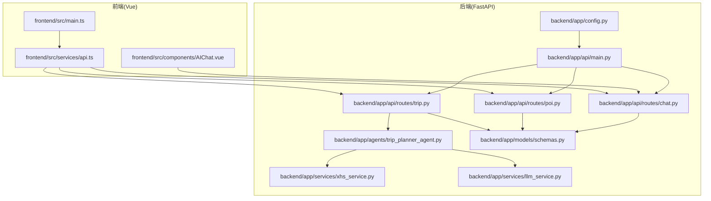
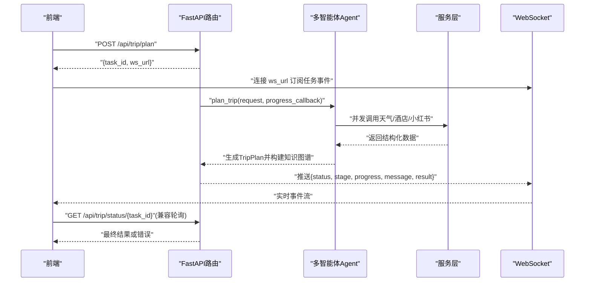
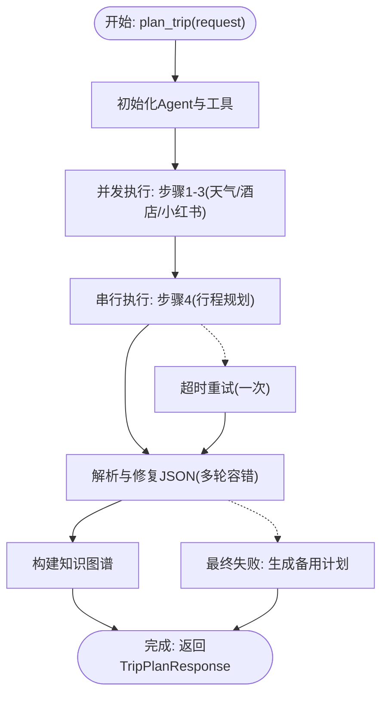
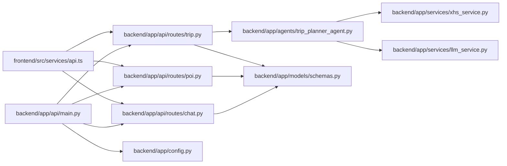

# 测试指南

<cite>
**本文引用的文件**   
- [README.md](file://README.md)
- [backend/app/api/main.py](file://backend/app/api/main.py)
- [backend/app/config.py](file://backend/app/config.py)
- [backend/app/api/routes/trip.py](file://backend/app/api/routes/trip.py)
- [backend/app/api/routes/poi.py](file://backend/app/api/routes/poi.py)
- [backend/app/api/routes/chat.py](file://backend/app/api/routes/chat.py)
- [backend/app/agents/trip_planner_agent.py](file://backend/app/agents/trip_planner_agent.py)
- [backend/app/services/xhs_service.py](file://backend/app/services/xhs_service.py)
- [backend/app/services/llm_service.py](file://backend/app/services/llm_service.py)
- [backend/app/models/schemas.py](file://backend/app/models/schemas.py)
- [frontend/src/main.ts](file://frontend/src/main.ts)
- [frontend/src/services/api.ts](file://frontend/src/services/api.ts)
- [frontend/src/components/AIChat.vue](file://frontend/src/components/AIChat.vue)
- [docker-compose.yaml](file://docker-compose.yaml)
</cite>

## 目录
1. [引言](#引言)
2. [项目结构](#项目结构)
3. [核心组件](#核心组件)
4. [架构总览](#架构总览)
5. [详细组件分析](#详细组件分析)
6. [依赖分析](#依赖分析)
7. [性能考量](#性能考量)
8. [故障排查指南](#故障排查指南)
9. [结论](#结论)
10. [附录](#附录)

## 引言
本测试指南面向 TripStar 项目，围绕后端 FastAPI 应用、多智能体系统、服务层、前端 Vue 组件与 API 集成，制定分层测试策略与实践规范。文档涵盖测试金字塔（单元测试、集成测试、端到端测试）、测试环境搭建、覆盖率要求、持续集成中的测试自动化、最佳实践与常见问题。

## 项目结构
- 后端采用 FastAPI + HelloAgents 多智能体框架，核心路由位于 app/api/routes，业务逻辑分布在 app/agents 与 app/services，配置集中于 app/config.py。
- 前端采用 Vue 3 + TypeScript，核心交互通过 src/services/api.ts 调用后端 API，组件如 AIChat.vue 展示与后端聊天问答的集成。
- 项目提供 docker-compose.yaml 用于容器化部署，便于在 CI 环境中统一测试环境。

**图表来源**
- [backend/app/api/main.py:1-147](file://backend/app/api/main.py#L1-L147)
- [backend/app/api/routes/trip.py:1-511](file://backend/app/api/routes/trip.py#L1-L511)
- [backend/app/api/routes/poi.py:1-133](file://backend/app/api/routes/poi.py#L1-L133)
- [backend/app/api/routes/chat.py:1-53](file://backend/app/api/routes/chat.py#L1-L53)
- [backend/app/agents/trip_planner_agent.py:1-826](file://backend/app/agents/trip_planner_agent.py#L1-L826)
- [backend/app/services/xhs_service.py:1-444](file://backend/app/services/xhs_service.py#L1-L444)
- [backend/app/services/llm_service.py:1-75](file://backend/app/services/llm_service.py#L1-L75)
- [backend/app/models/schemas.py:1-264](file://backend/app/models/schemas.py#L1-L264)
- [frontend/src/main.ts:1-35](file://frontend/src/main.ts#L1-L35)
- [frontend/src/services/api.ts:1-335](file://frontend/src/services/api.ts#L1-L335)
- [frontend/src/components/AIChat.vue:1-1161](file://frontend/src/components/AIChat.vue#L1-L1161)

**章节来源**
- [README.md:1-263](file://README.md#L1-L263)
- [docker-compose.yaml:1-24](file://docker-compose.yaml#L1-L24)

## 核心组件
- FastAPI 应用与路由：负责任务提交、状态轮询、WebSocket 推送、POI 搜索与图片获取、AI 问答等。
- 多智能体旅行规划：协调天气、酒店、小红书景点提取与行程规划，具备进度回调与容错修复。
- 服务层：LLM 客户端封装、小红书原生签名客户端、高德地图服务、知识图谱构建。
- 前端 API 客户端：统一请求/响应拦截、WebSocket 订阅、运行时配置读写。
- 数据模型：Pydantic 模型定义旅行计划、POI、天气、预算等结构。

**章节来源**
- [backend/app/api/main.py:1-147](file://backend/app/api/main.py#L1-L147)
- [backend/app/api/routes/trip.py:1-511](file://backend/app/api/routes/trip.py#L1-L511)
- [backend/app/agents/trip_planner_agent.py:1-826](file://backend/app/agents/trip_planner_agent.py#L1-L826)
- [backend/app/services/llm_service.py:1-75](file://backend/app/services/llm_service.py#L1-L75)
- [backend/app/services/xhs_service.py:1-444](file://backend/app/services/xhs_service.py#L1-L444)
- [backend/app/models/schemas.py:1-264](file://backend/app/models/schemas.py#L1-L264)
- [frontend/src/services/api.ts:1-335](file://frontend/src/services/api.ts#L1-L335)

## 架构总览
后端采用异步任务 + WebSocket 推送的“提交-轮询/订阅”模式，前端通过 WebSocket 实时接收任务进度，完成后获取完整旅行计划。多智能体在后台并发执行，最终整合为结构化旅行计划并生成知识图谱。

**图表来源**
- [backend/app/api/routes/trip.py:276-388](file://backend/app/api/routes/trip.py#L276-L388)
- [backend/app/agents/trip_planner_agent.py:257-339](file://backend/app/agents/trip_planner_agent.py#L257-L339)
- [frontend/src/services/api.ts:257-318](file://frontend/src/services/api.ts#L257-L318)

## 详细组件分析

### 后端测试策略与方法
- 单元测试
  - 配置与中间件：验证 CORS、代理路径重写、健康检查、静态文件挂载。
  - 路由层：针对 /trip/plan、/trip/status/{task_id}、/poi/search、/poi/detail/{poi_id}、/poi/photo、/chat/ask 进行请求/响应校验。
  - 服务层：对 LLM 客户端、小红书原生客户端、高德服务进行隔离测试，使用环境变量与最小化依赖。
  - 模型与序列化：验证 Pydantic 模型的构造、校验与 JSON 序列化。
- 集成测试
  - 任务生命周期：从提交任务到 WebSocket 推送，再到最终状态查询。
  - 多智能体协作：模拟 Agent 的工具调用、进度回调、JSON 修复与容错。
  - 外部服务：小红书签名与 SSR 降级、高德地理编码、LLM 调用。
- 端到端测试
  - 前后端联动：从前端提交旅行计划到接收完整行程与知识图谱。
  - 用户交互：聊天问答、POI 搜索与图片获取。

**章节来源**
- [backend/app/api/main.py:33-136](file://backend/app/api/main.py#L33-L136)
- [backend/app/api/routes/trip.py:276-488](file://backend/app/api/routes/trip.py#L276-L488)
- [backend/app/api/routes/poi.py:18-131](file://backend/app/api/routes/poi.py#L18-L131)
- [backend/app/api/routes/chat.py:10-52](file://backend/app/api/routes/chat.py#L10-L52)
- [backend/app/services/llm_service.py:12-75](file://backend/app/services/llm_service.py#L12-L75)
- [backend/app/services/xhs_service.py:68-444](file://backend/app/services/xhs_service.py#L68-L444)
- [backend/app/models/schemas.py:10-264](file://backend/app/models/schemas.py#L10-L264)

### 多智能体测试
- Agent 初始化与工具注册：验证 MCPTool 的创建与 expandable 标记。
- 并发执行与进度回调：模拟步骤1-3并发、步骤4串行，校验进度回调与最终 TripPlan。
- JSON 修复与容错：覆盖引号修复、截断修复、正则提取、LLM 修复等路径。
- 失败回退：当 Agent 失败时生成备用计划。

**图表来源**
- [backend/app/agents/trip_planner_agent.py:257-339](file://backend/app/agents/trip_planner_agent.py#L257-L339)
- [backend/app/agents/trip_planner_agent.py:424-758](file://backend/app/agents/trip_planner_agent.py#L424-L758)

**章节来源**
- [backend/app/agents/trip_planner_agent.py:173-826](file://backend/app/agents/trip_planner_agent.py#L173-L826)

### 服务层测试
- LLM 客户端：验证单例初始化、超时与 User-Agent 设置、重置逻辑。
- 小红书服务：原生签名客户端、Cookie 归一化、搜索/详情/图片抓取、SSR 降级、地理编码兜底。
- 高德服务：place/text 接口地理编码、异常处理与默认坐标。

**章节来源**
- [backend/app/services/llm_service.py:12-75](file://backend/app/services/llm_service.py#L12-L75)
- [backend/app/services/xhs_service.py:68-444](file://backend/app/services/xhs_service.py#L68-L444)

### 前端测试策略与方法
- Vue 组件测试
  - AIChat.vue：模拟 tripPlan 上下文、发送消息、显示历史、快速问题、加载态与错误兜底。
  - 路由与应用入口：验证路由注册、国际化、Ant Design Vue 安装与挂载。
- API 集成测试
  - 旅行计划：提交任务、轮询状态、WebSocket 订阅、历史查询。
  - POI 搜索与图片：关键词搜索、详情获取、图片抓取。
  - 聊天问答：携带上下文与历史的消息发送与回复。
- 用户交互测试
  - 输入校验、按钮禁用状态、占位提示、国际化文案。

**章节来源**
- [frontend/src/components/AIChat.vue:154-248](file://frontend/src/components/AIChat.vue#L154-L248)
- [frontend/src/main.ts:1-35](file://frontend/src/main.ts#L1-L35)
- [frontend/src/services/api.ts:219-331](file://frontend/src/services/api.ts#L219-L331)

## 依赖分析
- 后端依赖
  - FastAPI 应用依赖路由模块、配置模块、多智能体与服务层。
  - 路由依赖 Agent、知识图谱服务、Pydantic 模型。
  - 服务层依赖配置与 LLM 客户端，外部依赖小红书与高德。
- 前端依赖
  - axios 客户端、路由、国际化、Ant Design Vue。
  - 与后端 API 的契约由 TypeScript 类型与响应模型约束。

**图表来源**
- [frontend/src/services/api.ts:1-335](file://frontend/src/services/api.ts#L1-L335)
- [backend/app/api/routes/trip.py:1-511](file://backend/app/api/routes/trip.py#L1-L511)
- [backend/app/api/routes/poi.py:1-133](file://backend/app/api/routes/poi.py#L1-L133)
- [backend/app/api/routes/chat.py:1-53](file://backend/app/api/routes/chat.py#L1-L53)
- [backend/app/agents/trip_planner_agent.py:1-826](file://backend/app/agents/trip_planner_agent.py#L1-L826)
- [backend/app/services/xhs_service.py:1-444](file://backend/app/services/xhs_service.py#L1-L444)
- [backend/app/services/llm_service.py:1-75](file://backend/app/services/llm_service.py#L1-L75)
- [backend/app/models/schemas.py:1-264](file://backend/app/models/schemas.py#L1-L264)
- [backend/app/api/main.py:1-147](file://backend/app/api/main.py#L1-L147)
- [backend/app/config.py:1-202](file://backend/app/config.py#L1-L202)

**章节来源**
- [backend/app/api/main.py:1-147](file://backend/app/api/main.py#L1-L147)
- [frontend/src/services/api.ts:1-335](file://frontend/src/services/api.ts#L1-L335)

## 性能考量
- 异步任务与并发：多智能体步骤1-3并发执行，缩短总耗时；步骤4串行依赖前三步结果。
- 超时与重试：规划阶段允许超时重试一次，提升鲁棒性。
- WebSocket 推送：前端实时订阅任务事件，减少轮询频率。
- 外部依赖降级：小红书 API 失败时启用 SSR 降级，地理编码失败时使用默认坐标。

**章节来源**
- [backend/app/agents/trip_planner_agent.py:264-387](file://backend/app/agents/trip_planner_agent.py#L264-L387)
- [backend/app/services/xhs_service.py:228-444](file://backend/app/services/xhs_service.py#L228-L444)

## 故障排查指南
- 配置问题
  - 高德 Web Key、小红书 Cookie、LLM API Key 未配置会导致相应功能不可用，需在运行时设置或通过环境变量注入。
- 任务失败
  - 小红书 Cookie 过期会抛出特定异常，前端需识别并引导用户更新。
  - 服务重启后未完成任务会被标记为失败，避免前端无限等待。
- WebSocket 订阅
  - 若订阅队列异常，后端会清理死连接并关闭订阅。
- 前端网络
  - axios 请求拦截器与响应拦截器记录请求/响应状态，便于定位网络问题。

**章节来源**
- [backend/app/config.py:162-201](file://backend/app/config.py#L162-L201)
- [backend/app/api/routes/trip.py:370-387](file://backend/app/api/routes/trip.py#L370-L387)
- [backend/app/api/routes/trip.py:226-241](file://backend/app/api/routes/trip.py#L226-L241)
- [frontend/src/services/api.ts:124-147](file://frontend/src/services/api.ts#L124-L147)

## 结论
通过分层测试策略与完善的测试环境配置，TripStar 可在后端多智能体、服务层外部依赖、前端 API 集成与用户交互层面建立稳定的质量保障。建议在 CI 中引入单元测试、集成测试与端到端测试流水线，并结合覆盖率监控与质量门禁，持续提升测试效率与代码质量。

## 附录

### 测试环境搭建与配置
- 本地开发
  - 后端：安装依赖、创建虚拟环境、复制 .env.example 为 .env 并填入必要配置（高德、小红书、LLM）。
  - 前端：安装依赖、创建 .env 并填入 VITE_AMAP_WEB_KEY/VITE_AMAP_WEB_JS_KEY。
- 容器化
  - 使用 docker-compose.yaml 提供统一环境变量入口，容器内不再读取项目目录 .env。
- 测试数据库与模拟服务
  - 建议使用内存数据库或临时数据库进行集成测试；对外部服务（小红书、高德、LLM）使用 Mock 或测试账号。

**章节来源**
- [README.md:129-200](file://README.md#L129-L200)
- [docker-compose.yaml:1-24](file://docker-compose.yaml#L1-L24)

### 测试覆盖率与监控
- 覆盖率目标
  - 后端关键模块（Agent、服务层、路由）覆盖率不低于 80%，核心业务逻辑不低于 90%。
- 监控方法
  - 使用覆盖率工具（如 pytest-cov）在 CI 中生成报告并设置阈值门禁。
  - 对关键路径（JSON 修复、外部依赖降级、WebSocket 事件）进行回归测试。

[本节为通用指导，无需具体文件引用]

### 持续集成中的测试自动化
- 测试流水线
  - 安装依赖 → 运行单元测试 → 运行集成测试 → 运行端到端测试 → 生成覆盖率报告 → 质量门禁。
- 测试报告
  - 生成 HTML/Cobertura 报告并在 CI 中归档。
- 质量门禁
  - 覆盖率未达标或测试失败时阻断合并。

[本节为通用指导，无需具体文件引用]

### 测试最佳实践
- 单元测试
  - 使用最小依赖与 Mock，隔离外部服务；对异常路径进行显式断言。
- 集成测试
  - 使用临时数据库与测试账号；对任务生命周期与 WebSocket 事件进行端到端验证。
- 前端测试
  - 使用真实类型与响应模型；对用户交互与错误兜底进行覆盖。

[本节为通用指导，无需具体文件引用]

### 常见问题与解决方案
- 小红书 Cookie 过期
  - 识别异常并提示用户更新；在测试中模拟该异常以验证前端提示。
- LLM 超时
  - 触发超时重试；在测试中模拟超时并验证重试逻辑。
- WebSocket 订阅中断
  - 清理死队列并关闭连接；在测试中模拟断开事件并验证清理逻辑。

**章节来源**
- [backend/app/services/xhs_service.py:22-24](file://backend/app/services/xhs_service.py#L22-L24)
- [backend/app/agents/trip_planner_agent.py:372-387](file://backend/app/agents/trip_planner_agent.py#L372-L387)
- [backend/app/api/routes/trip.py:232-241](file://backend/app/api/routes/trip.py#L232-L241)