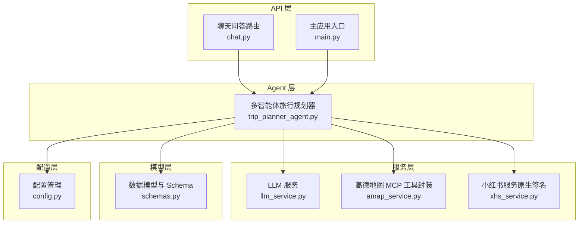
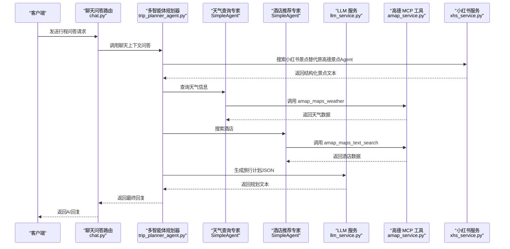
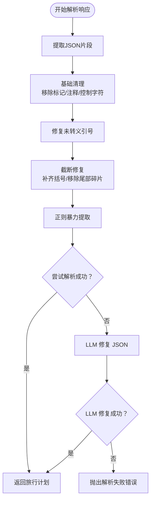
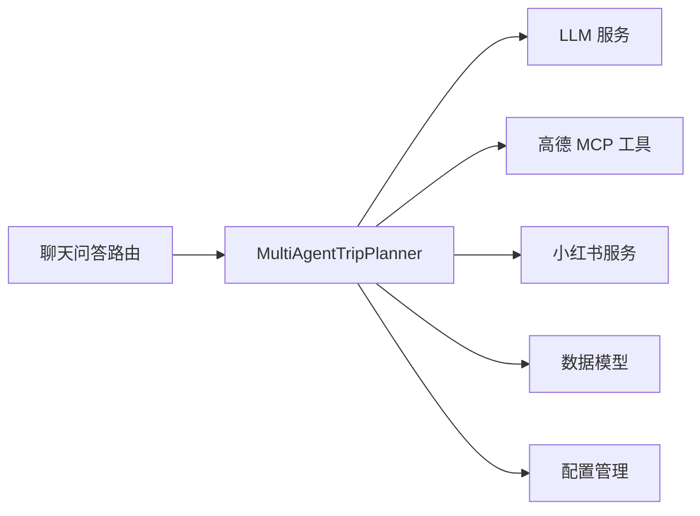

# Agent 设计模式

<cite>
**本文引用的文件**
- [trip_planner_agent.py](file://backend/app/agents/trip_planner_agent.py)
- [llm_service.py](file://backend/app/services/llm_service.py)
- [config.py](file://backend/app/config.py)
- [schemas.py](file://backend/app/models/schemas.py)
- [amap_service.py](file://backend/app/services/amap_service.py)
- [xhs_service.py](file://backend/app/services/xhs_service.py)
- [chat.py](file://backend/app/api/routes/chat.py)
- [main.py](file://backend/app/api/main.py)
</cite>

## 目录
1. [简介](#简介)
2. [项目结构](#项目结构)
3. [核心组件](#核心组件)
4. [架构总览](#架构总览)
5. [详细组件分析](#详细组件分析)
6. [依赖分析](#依赖分析)
7. [性能考量](#性能考量)
8. [故障排查指南](#故障排查指南)
9. [结论](#结论)
10. [附录](#附录)

## 简介
本文件围绕 TripStar 项目的 Agent 设计模式，基于 HelloAgents 框架的 SimpleAgent 基类，系统性阐述多智能体旅行规划系统的实现与最佳实践。重点包括：
- 基于 SimpleAgent 的智能体创建、初始化与配置流程
- 智能体核心属性与行为方法的使用要点
- 不同类型智能体（景点搜索专家、天气查询专家、酒店推荐专家、行程规划专家）的设计思路与职责分工
- 提示词工程（Prompt Engineering）与工具调用格式、严格消息格式要求及错误处理策略
- 新智能体创建、系统提示词配置与生命周期管理
- 最佳实践与常见陷阱规避

## 项目结构
后端采用分层架构，Agent 层位于业务逻辑之上，通过服务层对接外部工具与数据源，API 层对外暴露 REST 接口。



图表来源
- [trip_planner_agent.py:173-241](file://backend/app/agents/trip_planner_agent.py#L173-L241)
- [llm_service.py:12-67](file://backend/app/services/llm_service.py#L12-L67)
- [amap_service.py:12-47](file://backend/app/services/amap_service.py#L12-L47)
- [xhs_service.py:247-354](file://backend/app/services/xhs_service.py#L247-L354)
- [schemas.py:10-264](file://backend/app/models/schemas.py#L10-L264)
- [config.py:21-71](file://backend/app/config.py#L21-L71)
- [chat.py:10-52](file://backend/app/api/routes/chat.py#L10-L52)
- [main.py:55-61](file://backend/app/api/main.py#L55-L61)

章节来源
- [trip_planner_agent.py:1-12](file://backend/app/agents/trip_planner_agent.py#L1-L12)
- [main.py:55-61](file://backend/app/api/main.py#L55-L61)

## 核心组件
- 多智能体旅行规划器：负责创建与编排多个专用智能体，协调数据收集与最终规划生成。
- LLM 服务：统一管理 HelloAgentsLLM 单例，提供模型、API Key、Base URL、超时等配置。
- 高德地图 MCP 工具：封装 amap-mcp-server，提供地图搜索、天气、地理编码等子工具。
- 小红书服务：原生签名直连小红书 API，提取结构化景点信息并补全地理坐标。
- 数据模型：定义旅行请求、计划、每日行程、景点、酒店、天气等结构化数据。
- 配置管理：集中管理应用配置、运行时覆盖与环境变量同步。

章节来源
- [trip_planner_agent.py:173-241](file://backend/app/agents/trip_planner_agent.py#L173-L241)
- [llm_service.py:12-67](file://backend/app/services/llm_service.py#L12-L67)
- [amap_service.py:12-47](file://backend/app/services/amap_service.py#L12-L47)
- [xhs_service.py:247-354](file://backend/app/services/xhs_service.py#L247-L354)
- [schemas.py:10-264](file://backend/app/models/schemas.py#L10-L264)
- [config.py:21-71](file://backend/app/config.py#L21-L71)

## 架构总览
多智能体系统通过 SimpleAgent 将不同职责拆分为独立智能体，每个智能体专注特定领域并通过工具调用获取权威数据。规划阶段由专门的智能体整合上下文并生成结构化旅行计划。



图表来源
- [chat.py:16-43](file://backend/app/api/routes/chat.py#L16-L43)
- [trip_planner_agent.py:257-338](file://backend/app/agents/trip_planner_agent.py#L257-L338)
- [llm_service.py:12-67](file://backend/app/services/llm_service.py#L12-L67)
- [amap_service.py:93-121](file://backend/app/services/amap_service.py#L93-L121)
- [xhs_service.py:247-354](file://backend/app/services/xhs_service.py#L247-L354)

## 详细组件分析

### SimpleAgent 基类与生命周期
- 创建与初始化
  - 通过构造函数传入 name、llm、system_prompt，完成智能体实例化。
  - add_tool 方法注入工具（如 MCPTool），使智能体具备外部能力。
  - list_tools 方法用于查看当前已注册工具集合。
- 生命周期管理
  - 单例模式：全局实例在首次使用时创建，后续复用，避免重复初始化开销。
  - 运行时重置：支持 reset 方法以适配配置变更后的热生效。

章节来源
- [trip_planner_agent.py:173-241](file://backend/app/agents/trip_planner_agent.py#L173-L241)
- [trip_planner_agent.py:811-824](file://backend/app/agents/trip_planner_agent.py#L811-L824)

### 智能体核心属性与行为方法
- 核心属性
  - name：智能体名称，便于识别与日志输出。
  - llm：LLM 实例，承载推理与生成能力。
  - system_prompt：系统提示词，决定智能体的行为边界与输出格式。
- 行为方法
  - run(query, timeout, temperature)：执行推理与工具调用，支持超时与温度控制。
  - add_tool(tool)：注册工具，扩展智能体能力。
  - list_tools()：列出当前可用工具。

章节来源
- [trip_planner_agent.py:208-230](file://backend/app/agents/trip_planner_agent.py#L208-L230)
- [llm_service.py:12-67](file://backend/app/services/llm_service.py#L12-L67)

### 智能体类型与职责分工
- 景点搜索专家
  - 职责：从真实游记中抽取结构化景点信息，补全经纬度与预约信息。
  - 工具：小红书服务（原生签名直连 API）。
  - 输出：结构化景点文本，供规划阶段使用。
- 天气查询专家
  - 职责：查询指定城市的天气信息。
  - 工具：MCPTool 的 amap_maps_weather 子工具。
  - 输出：天气信息文本，包含每日天气与温度。
- 酒店推荐专家
  - 职责：根据城市与住宿偏好推荐合适的酒店。
  - 工具：MCPTool 的 amap_maps_text_search 子工具。
  - 输出：酒店信息文本，包含位置与价格范围。
- 行程规划专家
  - 职责：整合景点、天气、酒店信息，生成结构化旅行计划（JSON）。
  - 工具：无需工具，仅依赖上下文与 LLM 推理。
  - 输出：符合 Schema 的旅行计划对象。

章节来源
- [trip_planner_agent.py:15-170](file://backend/app/agents/trip_planner_agent.py#L15-L170)
- [trip_planner_agent.py:206-230](file://backend/app/agents/trip_planner_agent.py#L206-L230)
- [xhs_service.py:247-354](file://backend/app/services/xhs_service.py#L247-L354)
- [amap_service.py:93-121](file://backend/app/services/amap_service.py#L93-L121)

### 提示词工程（Prompt Engineering）
- 工具调用格式
  - 严格遵循单行格式，不得包含多余字符或 JSON block。
  - 示例格式：[TOOL_CALL:工具名:参数键=参数值,...]。
- 严格消息格式要求
  - JSON 输出必须满足字段类型与约束，特别是预算字段必须为纯数字，不得包含表达式或单位。
  - 温度字段需移除单位，确保为纯数字。
- 错误处理策略
  - 多轮清理：移除 ```json 包裹、JS 注释、控制字符、中文引号与全角标点。
  - 修复算术表达式：将预算等字段中的表达式计算为最终数值。
  - 修复未转义引号：识别字符串值内部未转义引号并替换为单引号。
  - 截断修复：补齐缺失的闭合括号，移除尾部不完整键值对。
  - LLM 修复：当本地修复失败时，使用 LLM 生成合法 JSON。
  - 超时重试：规划阶段在超时后追加提示并重试一次。



图表来源
- [trip_planner_agent.py](file://backend/app/agents/trip_planner_agent.py#L650-L758)
- [trip_planner_agent.py](file://backend/app/agents/trip_planner_agent.py#L424-L602)
- [trip_planner_agent.py](file://backend/app/agents/trip_planner_agent.py#L604-L648)

章节来源
- [trip_planner_agent.py](file://backend/app/agents/trip_planner_agent.py#L15-L170)
- [trip_planner_agent.py](file://backend/app/agents/trip_planner_agent.py#L424-L602)
- [trip_planner_agent.py](file://backend/app/agents/trip_planner_agent.py#L604-L648)
- [trip_planner_agent.py](file://backend/app/agents/trip_planner_agent.py#L650-L758)

### 智能体创建、配置与生命周期管理
- 创建新智能体
  - 通过 SimpleAgent 构造函数传入 name、llm、system_prompt。
  - 使用 add_tool 注册工具（如 MCPTool），确保 expandable 为 True 以启用子工具。
- 配置系统提示词
  - 为每个智能体编写明确的系统提示词，强调工具调用格式与输出约束。
  - 对于 JSON 输出场景，明确字段类型与约束，避免表达式与单位混入。
- 生命周期管理
  - 单例模式：通过全局变量缓存实例，避免重复初始化。
  - 运行时重置：当配置变更时，调用 reset 方法释放实例，以便下次使用时重建。

章节来源
- [trip_planner_agent.py](file://backend/app/agents/trip_planner_agent.py#L173-L241)
- [trip_planner_agent.py](file://backend/app/agents/trip_planner_agent.py#L811-L824)
- [llm_service.py](file://backend/app/services/llm_service.py#L12-L67)

### 数据模型与 Schema
- 旅行计划核心结构
  - TripPlan：包含城市、日期范围、每日行程、天气信息、总体建议与预算。
  - DayPlan：每日行程包含日期、交通、住宿、景点、餐饮等。
  - Attraction/Hotel/WeatherInfo：分别表示景点、酒店与天气信息。
- 字段校验与转换
  - 温度字段自动去除单位并转换为整数。
  - 预算字段必须为纯数字，避免表达式与单位。

章节来源
- [schemas.py](file://backend/app/models/schemas.py#L146-L154)
- [schemas.py](file://backend/app/models/schemas.py#L99-L109)
- [schemas.py](file://backend/app/models/schemas.py#L111-L134)
- [schemas.py](file://backend/app/models/schemas.py#L137-L144)

### API 集成与聊天问答
- 路由设计
  - /api/chat/ask：接收用户提问、旅行计划上下文与历史对话，返回 AI 回答。
- 上下文传递
  - 将历史对话转换为标准消息结构，传递给聊天服务。
- 错误处理
  - 捕获异常并返回 HTTP 500，包含详细错误信息。

章节来源
- [chat.py](file://backend/app/api/routes/chat.py#L10-L52)

## 依赖分析
- 组件耦合
  - MultiAgentTripPlanner 依赖 LLM 服务、高德 MCP 工具与小红书服务。
  - 智能体之间通过上下文解耦，仅在规划阶段聚合数据。
- 外部依赖
  - HelloAgents 框架提供的 SimpleAgent 与 MCPTool。
  - 高德地图 amap-mcp-server 与小红书原生 API。
- 循环依赖
  - 未发现循环依赖，模块间通过接口与服务层解耦。



图表来源
- [trip_planner_agent.py:173-241](file://backend/app/agents/trip_planner_agent.py#L173-L241)
- [llm_service.py:12-67](file://backend/app/services/llm_service.py#L12-L67)
- [amap_service.py:12-47](file://backend/app/services/amap_service.py#L12-L47)
- [xhs_service.py:247-354](file://backend/app/services/xhs_service.py#L247-L354)
- [schemas.py:10-264](file://backend/app/models/schemas.py#L10-L264)
- [config.py:21-71](file://backend/app/config.py#L21-L71)
- [chat.py:10-52](file://backend/app/api/routes/chat.py#L10-L52)

章节来源
- [trip_planner_agent.py:173-241](file://backend/app/agents/trip_planner_agent.py#L173-L241)
- [llm_service.py:12-67](file://backend/app/services/llm_service.py#L12-L67)
- [amap_service.py:12-47](file://backend/app/services/amap_service.py#L12-L47)
- [xhs_service.py:247-354](file://backend/app/services/xhs_service.py#L247-L354)
- [schemas.py:10-264](file://backend/app/models/schemas.py#L10-L264)
- [config.py:21-71](file://backend/app/config.py#L21-L71)
- [chat.py:10-52](file://backend/app/api/routes/chat.py#L10-L52)

## 性能考量
- 并发优化
  - 步骤1-3（景点/天气/酒店）通过并发执行缩短总耗时，步骤4（规划）串行依赖前三步结果。
- 超时与重试
  - 规划阶段设置较长超时，并在超时后追加提示重试一次，提升成功率。
- 资源竞争规避
  - 避免多个线程同时启动 uvx 子进程，减少资源竞争与超时风险。
- JSON 解析优化
  - 多轮清理与修复策略降低解析失败率，减少重试成本。

章节来源
- [trip_planner_agent.py:257-338](file://backend/app/agents/trip_planner_agent.py#L257-L338)
- [trip_planner_agent.py:354-387](file://backend/app/agents/trip_planner_agent.py#L354-L387)

## 故障排查指南
- 配置问题
  - LLM API Key 未配置：检查 OPENAI_API_KEY/LLM_API_KEY 环境变量或前端设置页。
  - 高德地图 API Key 未配置：检查 VITE_AMAP_WEB_KEY。
- 工具调用失败
  - MCP 工具未正确 expand：确保 expandable=True，使 amap_maps_* 子工具注册到 Agent。
  - 工具名不匹配：严格使用系统提示词中指定的工具名，不得自定义格式。
- JSON 解析失败
  - 使用内置清理与修复策略；若仍失败，检查系统提示词约束与字段类型。
- 超时与重试
  - 规划阶段超时可追加提示后重试；必要时调整 TRIP_PLANNER_TIMEOUT 环境变量。
- 小红书风控
  - Cookie 失效或风控拦截：更新 XHS_COOKIE 并重试；必要时更换 Cookie。

章节来源
- [config.py:162-179](file://backend/app/config.py#L162-L179)
- [trip_planner_agent.py:184-195](file://backend/app/agents/trip_planner_agent.py#L184-L195)
- [trip_planner_agent.py:354-387](file://backend/app/agents/trip_planner_agent.py#L354-L387)
- [xhs_service.py:290-296](file://backend/app/services/xhs_service.py#L290-L296)

## 结论
本设计通过 SimpleAgent 将旅行规划拆分为多个专业智能体，结合严格的提示词工程与多层 JSON 修复策略，实现了高可靠性的结构化旅行计划生成。通过单例与运行时重置机制，系统具备良好的可维护性与可扩展性。建议在新增智能体时遵循统一的提示词规范与工具调用格式，确保输出稳定性与一致性。

## 附录
- 最佳实践
  - 明确智能体职责边界，避免跨领域混合。
  - 严格约束 JSON 输出格式，避免表达式与单位混入。
  - 为每个智能体编写清晰的系统提示词，强调工具调用格式与输出约束。
  - 使用单例模式管理智能体与 LLM 实例，避免重复初始化。
- 常见陷阱
  - 忽视工具名大小写与格式，导致工具调用失败。
  - 在 JSON 中混入表达式或单位，导致解析失败。
  - 未正确设置 MCPTool 的 expandable 属性，导致子工具未注册。
  - 忽略超时与重试策略，导致规划阶段失败率上升。