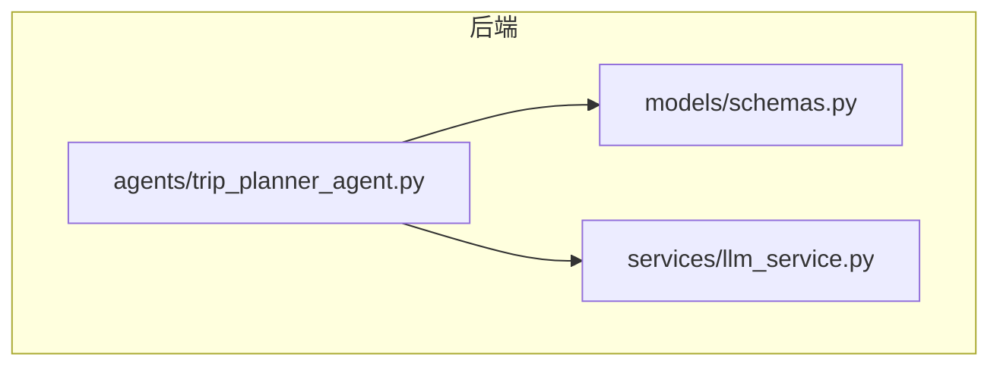
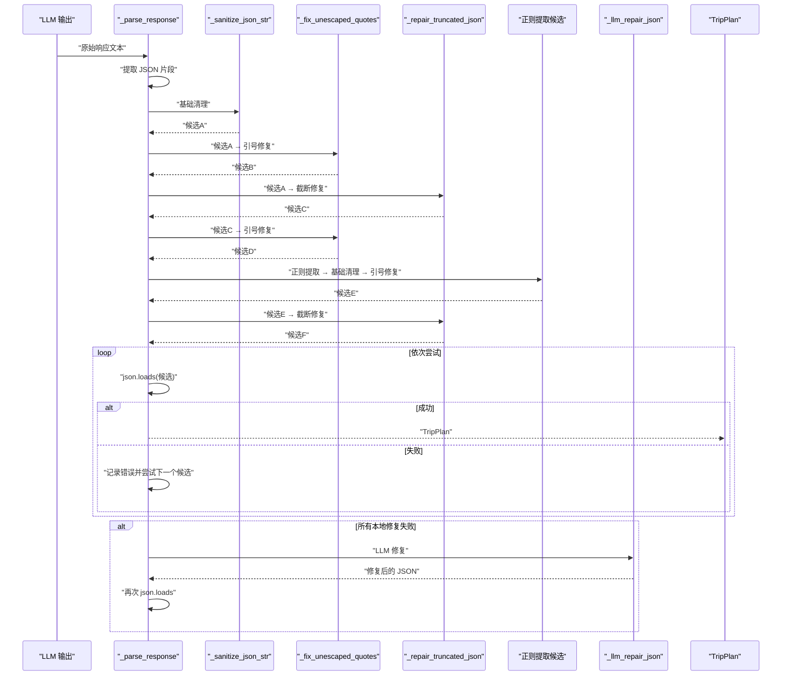
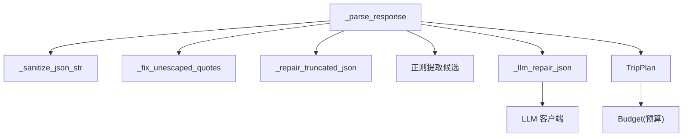

# JSON 解析与恢复

<cite>
**本文引用的文件**
- [trip_planner_agent.py](file://backend/app/agents/trip_planner_agent.py)
- [schemas.py](file://backend/app/models/schemas.py)
- [llm_service.py](file://backend/app/services/llm_service.py)
- [README.md](file://README.md)
</cite>

## 目录
1. [简介](#简介)
2. [项目结构](#项目结构)
3. [核心组件](#核心组件)
4. [架构总览](#架构总览)
5. [详细组件分析](#详细组件分析)
6. [依赖分析](#依赖分析)
7. [性能考量](#性能考量)
8. [故障排查指南](#故障排查指南)
9. [结论](#结论)
10. [附录](#附录)

## 简介
本文件聚焦 TripStar 项目中“大语言模型输出的 JSON 解析与恢复”机制，系统化解析 LLM 输出中常见的格式污染（如代码块标记、注释、控制字符、中文标点、未转义引号）与结构错误（如尾逗号、被截断、括号不匹配），并给出多层容错修复策略与优先级。重点涵盖以下函数的工作原理与使用场景：
- 基础清理：_sanitize_json_str
- 引号修复：_fix_unescaped_quotes
- 截断修复：_repair_truncated_json
- 算术表达式修复：_sanitize_json_str 内部的算术表达式处理
- 正则提取与暴力修复：_parse_response 中的候选生成与尝试
- LLM 修复作为最后手段：_llm_repair_json

此外，文档还提供性能优化建议、使用示例路径与限制说明，帮助读者在不同错误类型下选择合适的修复策略。

## 项目结构
与 JSON 解析恢复相关的核心文件位于后端 agents 层与 models 层：
- agents/trip_planner_agent.py：多智能体规划器，包含 JSON 解析与多轮修复逻辑
- models/schemas.py：Pydantic 模型定义，约束预算字段等关键结构
- services/llm_service.py：LLM 客户端封装，为 LLM 修复提供底层能力



图表来源
- [trip_planner_agent.py:1-826](file://backend/app/agents/trip_planner_agent.py#L1-L826)
- [schemas.py:1-264](file://backend/app/models/schemas.py#L1-L264)
- [llm_service.py:1-75](file://backend/app/services/llm_service.py#L1-L75)

章节来源
- [trip_planner_agent.py:1-826](file://backend/app/agents/trip_planner_agent.py#L1-L826)
- [schemas.py:1-264](file://backend/app/models/schemas.py#L1-L264)
- [llm_service.py:1-75](file://backend/app/services/llm_service.py#L1-L75)

## 核心组件
- 基础清理函数：_sanitize_json_str
  - 移除代码块标记、JS 注释、控制字符
  - 修复尾逗号、中文引号与全角标点
  - 修复预算字段中的算术表达式
- 引号修复函数：_fix_unescaped_quotes
  - 识别字符串边界，替换内嵌未转义双引号为单引号
- 截断修复函数：_repair_truncated_json
  - 闭合未闭合字符串
  - 去除尾部不完整键值对碎片
  - 基于栈精确补齐缺失的 ] 与 }
- 正则提取与暴力修复：_parse_response
  - 生成多种修复候选并按优先级尝试
- LLM 修复：_llm_repair_json
  - 作为最后手段，仅在本地修复失败时启用

章节来源
- [trip_planner_agent.py:424-602](file://backend/app/agents/trip_planner_agent.py#L424-L602)
- [trip_planner_agent.py:650-758](file://backend/app/agents/trip_planner_agent.py#L650-L758)

## 架构总览
下图展示了从 LLM 输出到最终 TripPlan 对象的解析与修复流程，包括多轮候选生成与尝试、以及 LLM 修复作为兜底。



图表来源
- [trip_planner_agent.py:650-758](file://backend/app/agents/trip_planner_agent.py#L650-L758)

## 详细组件分析

### 基础清理：_sanitize_json_str
- 作用：清理 LLM 输出中常见的“格式污染”，使 JSON 更接近合法结构
- 主要处理：
  - 去除包裹在外部的代码块标记（如 ```json ... ```）
  - 去除 JS 风格注释（// ... 与 /* ... */）
  - 去除值中的控制字符
  - 修复尾逗号
  - 替换中文引号与全角标点为英文字符（注意：中文双引号在字符串内部需替换为单引号，避免破坏结构）
  - 算术表达式修复：在预算等数值字段中，将形如 “30+54+120+120=324” 的表达式替换为最终结果；若无等号，尝试安全求值
- 复杂度：线性扫描与有限次正则替换，整体 O(n)
- 适用场景：首次清理，修复常见格式污染与简单结构问题

章节来源
- [trip_planner_agent.py](file://backend/app/agents/trip_planner_agent.py#L424-L466)

### 引号修复：_fix_unescaped_quotes
- 作用：修复字符串值内部未转义的双引号
- 算法要点：
  - 状态机跟踪字符串起止与转义字符
  - 当遇到未转义的 " 时，判断其是否为字符串结束（下一个非空白字符为结构字符或字符串结束）
  - 若不是，则替换为单引号，避免破坏 JSON 结构
- 复杂度：单次线性扫描，O(n)
- 适用场景：基础清理后仍报错，且错误位置靠近字符串内部

章节来源
- [trip_planner_agent.py](file://backend/app/agents/trip_planner_agent.py#L468-L518)

### 截断修复：_repair_truncated_json
- 作用：修复被 max_tokens 截断的不完整 JSON
- 策略：
  - Step 1：若最后一个字符处于字符串内部，先闭合该字符串
  - Step 2：反复去除尾部不完整键值对碎片，直到以合法结构字符结尾
  - Step 3：移除尾逗号
  - Step 4：基于栈扫描非字符串中的括号，逆序补齐缺失的 ] 与 }
- 复杂度：最多两次线性扫描 + 栈操作，整体 O(n)
- 适用场景：响应被截断、缺少闭合括号或尾逗号

章节来源
- [trip_planner_agent.py](file://backend/app/agents/trip_planner_agent.py#L520-L602)

### 算术表达式修复策略
- 触发点：预算字段（如 total_attractions、total_hotels、total_meals、total_transportation、total）中出现算术表达式
- 实现：在基础清理阶段，使用正则匹配冒号后的表达式，优先取等号右侧的最终结果；若无等号，尝试安全求值
- 限制：仅对数值字段有效，且表达式需以数字开头，避免误伤其他字段

章节来源
- [trip_planner_agent.py](file://backend/app/agents/trip_planner_agent.py#L444-L466)

### 正则提取与暴力修复
- 正则提取：从响应中使用正则匹配首个 { ... } 片段，作为“暴力候选”
- 生成候选：
  - 基础清理
  - 引号修复
  - 截断修复（对正则提取结果再次尝试）
- 优先级：在基础清理失败后，按上述顺序逐一尝试，优先本地修复，避免频繁调用 LLM

章节来源
- [trip_planner_agent.py](file://backend/app/agents/trip_planner_agent.py#L690-L719)

### LLM 修复作为最后手段
- 触发条件：所有本地修复尝试失败
- 策略：
  - 仅发送尾部 2000 字符与头部 500 字符，减少 token 消耗
  - 使用提示词引导 LLM 补全 JSON
  - 从 LLM 输出中提取 JSON（优先查找 ```json ... ```，其次 ``` ... ```，最后正则匹配）
- 限制：
  - 仅在本地修复失败时启用
  - 仍可能失败，失败时回退到最初错误
  - 依赖 LLM 的稳定性与可用性

章节来源
- [trip_planner_agent.py](file://backend/app/agents/trip_planner_agent.py#L604-L648)

### 解析与对象转换：_parse_response
- 流程：
  - 从响应中提取 JSON 片段（优先 ```json ... ```，其次 ``` ... ```，最后正则匹配）
  - 生成多种修复候选并逐一尝试
  - 成功后转换为 TripPlan 对象
- 错误处理：
  - 记录首次失败位置上下文
  - 所有本地修复失败后，启用 LLM 修复
  - 最终仍失败时抛出明确错误

章节来源
- [trip_planner_agent.py](file://backend/app/agents/trip_planner_agent.py#L650-L758)

## 依赖分析
- TripPlan 模型对预算字段的约束（纯数字，不允许算术表达式）
- LLM 服务为 LLM 修复提供底层客户端
- 多智能体规划器在生成最终响应后，统一走解析与修复流程



图表来源
- [trip_planner_agent.py:650-758](file://backend/app/agents/trip_planner_agent.py#L650-L758)
- [schemas.py:137-144](file://backend/app/models/schemas.py#L137-L144)
- [llm_service.py:12-67](file://backend/app/services/llm_service.py#L12-L67)

章节来源
- [trip_planner_agent.py:650-758](file://backend/app/agents/trip_planner_agent.py#L650-L758)
- [schemas.py:137-144](file://backend/app/models/schemas.py#L137-L144)
- [llm_service.py:12-67](file://backend/app/services/llm_service.py#L12-L67)

## 性能考量
- 本地修复优先：优先尝试基础清理与引号修复，避免不必要的 LLM 调用
- 正则提取与截断修复：仅在必要时生成候选，减少重复计算
- LLM 修复限域：仅发送尾部 2000 字符与头部 500 字符，降低 token 消耗
- 模型约束：预算字段为整数，避免 LLM 输出表达式，减少后续修复成本
- 并发与超时：规划阶段使用较长超时与重试，减少因超时导致的截断

章节来源
- [trip_planner_agent.py:604-648](file://backend/app/agents/trip_planner_agent.py#L604-L648)
- [trip_planner_agent.py:354-387](file://backend/app/agents/trip_planner_agent.py#L354-L387)
- [schemas.py:137-144](file://backend/app/models/schemas.py#L137-L144)

## 故障排查指南
- 首次解析失败：
  - 查看错误位置上下文，定位问题片段
  - 检查是否为未转义引号或尾逗号
- 本地修复仍失败：
  - 确认是否为截断 JSON，尝试截断修复
  - 检查预算字段是否包含算术表达式
- LLM 修复失败：
  - 检查 LLM 配置与可用性
  - 确认提示词是否清晰，是否包含足够的上下文
- 常见错误类型与修复策略优先级：
  - 格式污染（代码块标记、注释、控制字符）→ 基础清理
  - 未转义引号 → 引号修复
  - 尾逗号/结构不完整 → 截断修复
  - 截断 JSON → 截断修复 + 引号修复
  - 正则提取候选 → 正则提取 + 基础清理 + 引号修复 + 截断修复
  - LLM 修复（最后手段）

章节来源
- [trip_planner_agent.py:721-758](file://backend/app/agents/trip_planner_agent.py#L721-L758)

## 结论
TripStar 的 JSON 解析与恢复机制通过“本地优先”的多层容错策略，有效应对 LLM 输出中的常见格式污染与结构错误。基础清理、引号修复、截断修复与正则提取构成了稳健的修复链路；预算字段的算术表达式修复进一步提升了鲁棒性。LLM 修复仅作为最后手段，结合限域策略与错误回退，确保系统在复杂场景下的可靠性与性能平衡。

## 附录
- 使用示例路径（不展示具体代码，仅提供定位）：
  - 基础清理：[基础清理函数:424-466](file://backend/app/agents/trip_planner_agent.py#L424-L466)
  - 引号修复：[引号修复函数:468-518](file://backend/app/agents/trip_planner_agent.py#L468-L518)
  - 截断修复：[截断修复函数:520-602](file://backend/app/agents/trip_planner_agent.py#L520-L602)
  - 正则提取与候选生成：[候选生成与尝试:690-719](file://backend/app/agents/trip_planner_agent.py#L690-L719)
  - LLM 修复：[LLM 修复函数:604-648](file://backend/app/agents/trip_planner_agent.py#L604-L648)
  - 解析与对象转换：[解析与转换:650-758](file://backend/app/agents/trip_planner_agent.py#L650-L758)
  - 预算字段约束：[预算模型:137-144](file://backend/app/models/schemas.py#L137-L144)
  - LLM 客户端封装：[LLM 客户端:12-67](file://backend/app/services/llm_service.py#L12-L67)