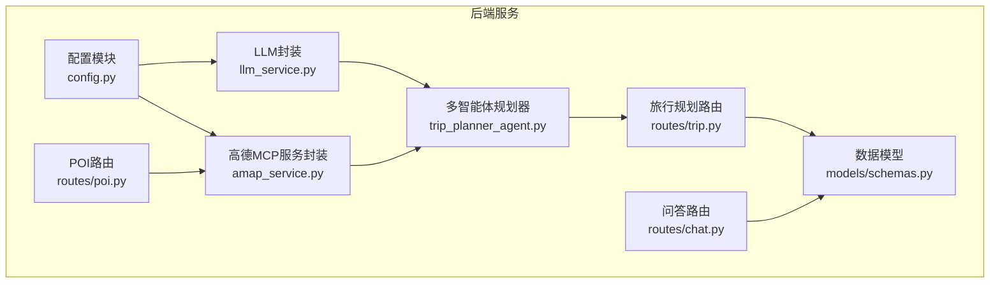
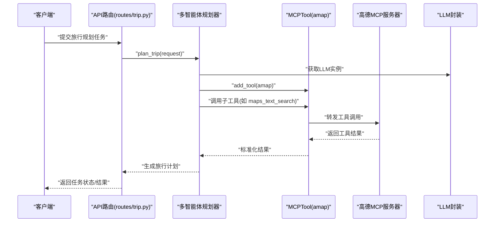
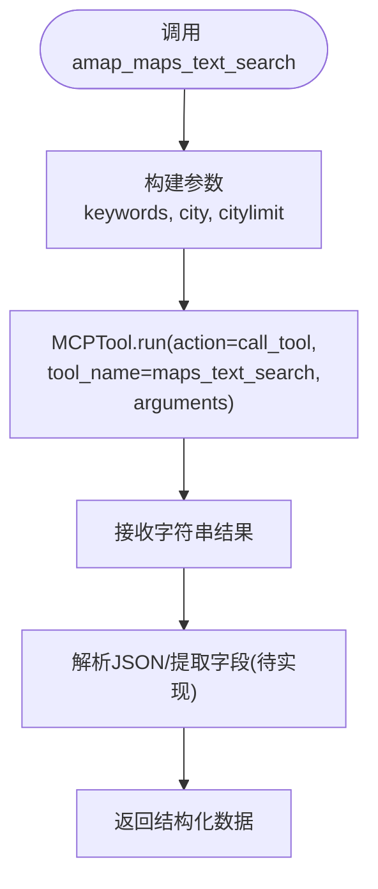
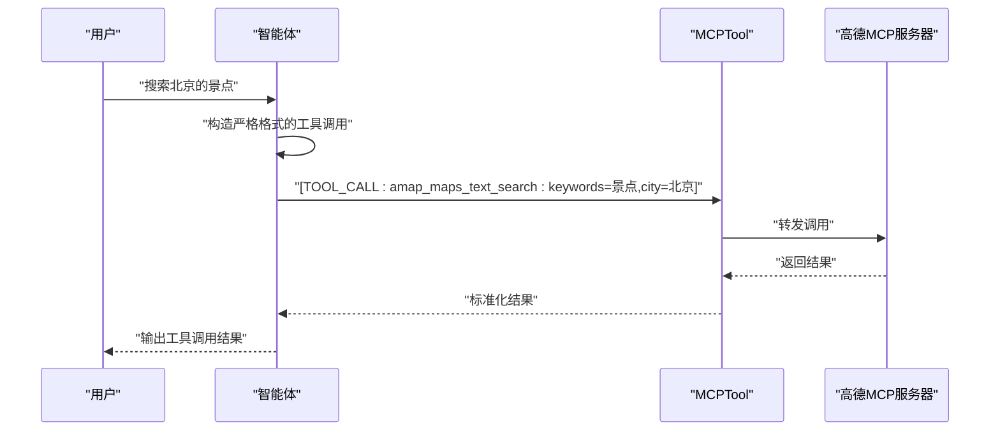
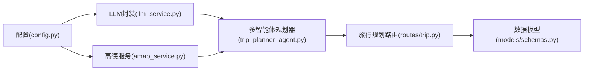

# Tool 集成机制

<cite>
**本文引用的文件**
- [README.md](file://README.md)
- [backend/app/config.py](file://backend/app/config.py)
- [backend/app/services/amap_service.py](file://backend/app/services/amap_service.py)
- [backend/app/agents/trip_planner_agent.py](file://backend/app/agents/trip_planner_agent.py)
- [backend/app/api/routes/trip.py](file://backend/app/api/routes/trip.py)
- [backend/app/api/routes/chat.py](file://backend/app/api/routes/chat.py)
- [backend/app/api/routes/poi.py](file://backend/app/api/routes/poi.py)
- [backend/app/models/schemas.py](file://backend/app/models/schemas.py)
- [backend/app/services/llm_service.py](file://backend/app/services/llm_service.py)
- [backend/app/api/main.py](file://backend/app/api/main.py)
</cite>

## 目录
1. [简介](#简介)
2. [项目结构](#项目结构)
3. [核心组件](#核心组件)
4. [架构总览](#架构总览)
5. [详细组件分析](#详细组件分析)
6. [依赖分析](#依赖分析)
7. [性能考量](#性能考量)
8. [故障排查指南](#故障排查指南)
9. [结论](#结论)
10. [附录](#附录)

## 简介
本文件面向 TripStar 项目的 Tool 集成机制，重点围绕 MCPTool 的使用与配置、高德地图服务工具集成（amap_maps_text_search、amap_maps_weather 等）、工具调用标准格式（[TOOL_CALL:tool_name:parameters]）、自动展开机制（auto_expand）与子工具注册、工具调用最佳实践、错误处理与性能优化，以及工具与智能体的绑定与通信机制进行系统化说明。文档同时提供代码级图示与路径引用，便于读者快速定位实现细节。

## 项目结构
后端采用 FastAPI + 多智能体协作架构，工具集成主要集中在以下模块：
- 配置与环境变量：backend/app/config.py
- 高德地图 MCP 工具封装：backend/app/services/amap_service.py
- 多智能体旅行规划：backend/app/agents/trip_planner_agent.py
- API 路由与任务编排：backend/app/api/routes/trip.py、backend/app/api/routes/chat.py、backend/app/api/routes/poi.py
- 数据模型与响应：backend/app/models/schemas.py
- LLM 客户端封装：backend/app/services/llm_service.py
- 应用入口与中间件：backend/app/api/main.py

图表来源
- [backend/app/config.py:1-202](file://backend/app/config.py#L1-L202)
- [backend/app/services/amap_service.py:1-276](file://backend/app/services/amap_service.py#L1-L276)
- [backend/app/agents/trip_planner_agent.py:1-826](file://backend/app/agents/trip_planner_agent.py#L1-L826)
- [backend/app/api/routes/trip.py:1-511](file://backend/app/api/routes/trip.py#L1-L511)
- [backend/app/api/routes/chat.py:1-53](file://backend/app/api/routes/chat.py#L1-L53)
- [backend/app/api/routes/poi.py:1-133](file://backend/app/api/routes/poi.py#L1-L133)
- [backend/app/models/schemas.py:1-264](file://backend/app/models/schemas.py#L1-L264)
- [backend/app/services/llm_service.py:1-75](file://backend/app/services/llm_service.py#L1-L75)

章节来源
- [README.md:43-97](file://README.md#L43-L97)
- [backend/app/api/main.py:1-147](file://backend/app/api/main.py#L1-L147)

## 核心组件
- MCPTool：基于 hello_agents 的工具抽象，负责与外部 MCP 服务器交互，支持自动展开为子工具集合。
- 高德地图 MCP 工具：通过 uvx amap-mcp-server 启动，使用配置中的高德 Web 服务 Key，暴露 amap_maps_text_search、amap_maps_weather 等子工具。
- 多智能体规划器：为不同角色（天气、酒店、景点）绑定 amap 工具，要求严格遵循工具调用格式。
- 配置系统：集中管理运行时配置（高德 Key、LLM 参数、CORS 等），支持环境变量与运行时覆盖。
- API 路由：提供旅行规划任务提交、状态轮询、问答、POI 查询等接口，承载工具调用结果的整合与呈现。

章节来源
- [backend/app/services/amap_service.py:12-47](file://backend/app/services/amap_service.py#L12-L47)
- [backend/app/agents/trip_planner_agent.py:173-242](file://backend/app/agents/trip_planner_agent.py#L173-L242)
- [backend/app/config.py:21-122](file://backend/app/config.py#L21-L122)

## 架构总览
下图展示了工具集成在系统中的位置与交互路径，强调 MCPTool 与智能体、服务层、API 层的耦合关系。

图表来源
- [backend/app/api/routes/trip.py:276-388](file://backend/app/api/routes/trip.py#L276-L388)
- [backend/app/agents/trip_planner_agent.py:173-242](file://backend/app/agents/trip_planner_agent.py#L173-L242)
- [backend/app/services/amap_service.py:28-47](file://backend/app/services/amap_service.py#L28-L47)

## 详细组件分析

### MCPTool 使用与配置
- 工具创建与注册
  - 在多智能体规划器中，通过 MCPTool 构造函数创建 amap 工具，设置 server_command 为 ["uvx", "amap-mcp-server"]，并通过 env 注入高德 Web 服务 Key。
  - 为确保子工具被注册到智能体，需将 expandable 设为 True（当前版本需要手动开启）。
- 自动展开机制（auto_expand）
  - 配置文件中，MCPTool 初始化时设置了 auto_expand=True，表示将 MCP 服务器提供的工具清单自动展开为独立可用工具，便于智能体直接调用。
- 环境变量与运行时配置
  - 高德 Web 服务 Key 通过配置系统注入到 MCPTool 的环境变量中，确保工具调用时具备鉴权能力。
  - 配置系统支持 .env 与运行时覆盖，验证配置完整性并在启动时打印关键配置信息。

章节来源
- [backend/app/agents/trip_planner_agent.py:184-196](file://backend/app/agents/trip_planner_agent.py#L184-L196)
- [backend/app/services/amap_service.py:28-47](file://backend/app/services/amap_service.py#L28-L47)
- [backend/app/config.py:36-55](file://backend/app/config.py#L36-L55)

### 高德地图服务工具集成
- amap_maps_text_search（POI 搜索）
  - 通过 AmapService.search_poi 调用 MCPTool，使用 action=call_tool，tool_name=maps_text_search，参数包含 keywords、city、citylimit。
  - 返回结果为字符串，当前实现打印前 200 字符并预留解析逻辑（TODO）。
- amap_maps_weather（天气查询）
  - 通过 AmapService.get_weather 调用 MCPTool，使用 action=call_tool，tool_name=maps_weather，参数包含 city。
  - 返回结果同样为字符串，预留解析逻辑。
- 路线规划与地理编码
  - 支持步行、驾车、公交三种路线类型，分别映射到不同的工具名。
  - 地理编码（maps_geo）支持地址到经纬度转换，参数可选 city。

图表来源
- [backend/app/services/amap_service.py:57-92](file://backend/app/services/amap_service.py#L57-L92)
- [backend/app/services/amap_service.py:93-121](file://backend/app/services/amap_service.py#L93-L121)

章节来源
- [backend/app/services/amap_service.py:50-276](file://backend/app/services/amap_service.py#L50-L276)

### 工具调用标准格式与严格要求
- 工具调用格式
  - 格式为单行字符串：[TOOL_CALL:tool_name:parameters]
  - 严禁出现多余字符、JSON 块或换行。
- 景点搜索与酒店搜索
  - 景点搜索工具名：amap_maps_text_search
  - 酒店搜索工具名：amap_maps_text_search（关键词使用“酒店”或“宾馆”）
- 天气查询
  - 工具名：amap_maps_weather
  - 参数：city=城市名
- 提示词约束
  - 智能体提示词中明确要求输出严格格式，不得更改工具名与格式。

图表来源
- [backend/app/agents/trip_planner_agent.py:15-59](file://backend/app/agents/trip_planner_agent.py#L15-L59)
- [backend/app/agents/trip_planner_agent.py:67-79](file://backend/app/agents/trip_planner_agent.py#L67-L79)
- [backend/app/agents/trip_planner_agent.py:340-351](file://backend/app/agents/trip_planner_agent.py#L340-L351)

章节来源
- [backend/app/agents/trip_planner_agent.py:15-79](file://backend/app/agents/trip_planner_agent.py#L15-L79)
- [backend/app/agents/trip_planner_agent.py:340-351](file://backend/app/agents/trip_planner_agent.py#L340-L351)

### 工具与智能体的绑定与通信机制
- 绑定关系
  - 多智能体规划器为天气 Agent、酒店 Agent 绑定 amap 工具；景点 Agent 替换为小红书服务（当前版本）。
  - 通过 agent.add_tool(tool) 完成绑定，随后智能体可直接输出严格格式的工具调用。
- 通信机制
  - 智能体输出工具调用后，由 MCPTool 负责与高德 MCP 服务器通信，返回字符串结果。
  - 规划器对结果进行解析与整合，最终生成结构化旅行计划。

章节来源
- [backend/app/agents/trip_planner_agent.py:184-231](file://backend/app/agents/trip_planner_agent.py#L184-L231)

### 自定义工具创建与配置
- 创建步骤
  - 使用 MCPTool 构造函数创建工具实例，设置 name、description、server_command、env、auto_expand 等参数。
  - 将工具通过 agent.add_tool(tool) 绑定到智能体。
- 环境变量配置
  - 通过配置系统注入 API Key 等敏感信息，确保工具调用具备鉴权能力。
- 处理工具调用结果
  - 工具返回字符串，需在服务层进行解析（如 JSON 提取、字段清洗），并转换为结构化数据供上层使用。

章节来源
- [backend/app/services/amap_service.py:28-47](file://backend/app/services/amap_service.py#L28-L47)
- [backend/app/config.py:70-122](file://backend/app/config.py#L70-L122)

### 子工具注册过程
- auto_expand 行为
  - 配置中设置 auto_expand=True，使 MCPTool 将服务器提供的工具清单自动展开为独立工具，便于智能体直接调用。
- 手动开启 expandable
  - 当前版本需要手动将 tool.expandable 设为 True，以确保工具被注册到智能体工具列表中。

章节来源
- [backend/app/services/amap_service.py:33-34](file://backend/app/services/amap_service.py#L33-L34)
- [backend/app/agents/trip_planner_agent.py:193-195](file://backend/app/agents/trip_planner_agent.py#L193-L195)

### API 与工具调用的集成点
- 旅行规划任务
  - API 路由提交任务后，后台异步执行多智能体规划，期间通过 progress_callback 推送状态。
  - 任务完成后，API 返回结构化旅行计划与知识图谱数据。
- 问答与 POI 查询
  - 问答路由基于旅行计划上下文回答用户问题。
  - POI 路由提供 POI 详情与图片查询，内部调用高德与小红书服务。

章节来源
- [backend/app/api/routes/trip.py:276-388](file://backend/app/api/routes/trip.py#L276-L388)
- [backend/app/api/routes/chat.py:10-52](file://backend/app/api/routes/chat.py#L10-L52)
- [backend/app/api/routes/poi.py:18-131](file://backend/app/api/routes/poi.py#L18-L131)

## 依赖分析
- 组件耦合
  - 配置模块为 MCPTool 提供高德 Key，决定工具可用性。
  - LLM 封装为智能体提供推理能力，智能体通过 MCPTool 调用外部工具。
  - API 路由协调任务执行与状态推送，串联工具调用与结果整合。
- 外部依赖
  - 高德 MCP 服务器（通过 uvx amap-mcp-server 启动）。
  - LLM 服务提供商（通过配置注入 API Key、Base URL、Model）。

图表来源
- [backend/app/config.py:21-122](file://backend/app/config.py#L21-L122)
- [backend/app/services/amap_service.py:12-47](file://backend/app/services/amap_service.py#L12-L47)
- [backend/app/services/llm_service.py:12-67](file://backend/app/services/llm_service.py#L12-L67)
- [backend/app/agents/trip_planner_agent.py:173-242](file://backend/app/agents/trip_planner_agent.py#L173-L242)
- [backend/app/api/routes/trip.py:276-388](file://backend/app/api/routes/trip.py#L276-L388)
- [backend/app/models/schemas.py:146-195](file://backend/app/models/schemas.py#L146-L195)

章节来源
- [backend/app/config.py:21-122](file://backend/app/config.py#L21-L122)
- [backend/app/services/amap_service.py:12-47](file://backend/app/services/amap_service.py#L12-L47)
- [backend/app/services/llm_service.py:12-67](file://backend/app/services/llm_service.py#L12-L67)
- [backend/app/agents/trip_planner_agent.py:173-242](file://backend/app/agents/trip_planner_agent.py#L173-L242)
- [backend/app/api/routes/trip.py:276-388](file://backend/app/api/routes/trip.py#L276-L388)
- [backend/app/models/schemas.py:146-195](file://backend/app/models/schemas.py#L146-L195)

## 性能考量
- 并发优化
  - 多智能体规划器在步骤1-3（景点/天气/酒店）采用并发执行，缩短总耗时。
- 超时与重试
  - 规划阶段使用较长超时，并在超时后进行一次重试，提升稳定性。
- 任务持久化与状态推送
  - 旅行规划任务采用内存+磁盘持久化，支持 WebSocket 与轮询两种状态订阅方式，避免长时间阻塞。
- 工具调用开销
  - MCPTool 通过 uvx 启动外部服务器，首次调用可能有冷启动延迟；建议在系统启动时预热或减少频繁重启。

章节来源
- [backend/app/agents/trip_planner_agent.py:264-338](file://backend/app/agents/trip_planner_agent.py#L264-L338)
- [backend/app/api/routes/trip.py:315-388](file://backend/app/api/routes/trip.py#L315-L388)

## 故障排查指南
- 配置问题
  - 高德 Key 未配置：初始化 MCPTool 时抛出异常，需在前端设置页配置 VITE_AMAP_WEB_KEY。
  - LLM Key 未配置：可能导致 AI 功能不可用，需检查 OPENAI_API_KEY/LLM_API_KEY 等环境变量。
- 工具调用失败
  - MCPTool 返回字符串，需在服务层进行解析；若解析失败，检查参数格式与工具名是否严格符合要求。
  - 高德 MCP 服务器异常：检查 uvx amap-mcp-server 是否可正常启动与鉴权。
- 任务失败
  - API 路由捕获异常并返回错误信息；对于小红书 Cookie 过期等特定异常，会进行特殊处理并返回明确提示。
- JSON 解析与修复
  - 规划器内置多轮 JSON 清洗与修复策略（去除注释、修正引号、截断修复、LLM 修复），提升鲁棒性。

章节来源
- [backend/app/config.py:162-179](file://backend/app/config.py#L162-L179)
- [backend/app/services/amap_service.py:24-25](file://backend/app/services/amap_service.py#L24-L25)
- [backend/app/api/routes/trip.py:365-387](file://backend/app/api/routes/trip.py#L365-L387)
- [backend/app/agents/trip_planner_agent.py:424-758](file://backend/app/agents/trip_planner_agent.py#L424-L758)

## 结论
TripStar 的 Tool 集成机制以 MCPTool 为核心，结合多智能体协作与外部 MCP 服务器，实现了高德地图等外部服务能力的统一接入。通过严格的工具调用格式、自动展开机制与完善的错误处理策略，系统在保证一致性的同时提升了可扩展性与稳定性。建议在生产环境中关注工具冷启动、参数校验与 JSON 解析修复的持续优化。

## 附录
- 工具调用最佳实践
  - 严格遵循 [TOOL_CALL:tool_name:parameters] 格式，不添加任何额外字符。
  - 工具名与参数必须与 MCP 服务器提供的清单一致。
  - 在服务层对工具返回字符串进行解析与清洗，必要时进行 JSON 修复。
- 错误处理策略
  - 配置校验前置，尽早暴露问题。
  - 工具调用失败时记录上下文并降级处理。
  - 任务失败时提供明确错误信息与请求载荷，便于前端展示与用户操作。
- 性能优化建议
  - 预热 MCP 服务器，减少首次调用延迟。
  - 并发执行独立任务，合理设置超时与重试。
  - 对长文本输出进行分段解析与缓存，降低重复计算成本。