# Workflow 编排

<cite>
**本文档引用的文件**
- [trip_planner_agent.py](file://backend/app/agents/trip_planner_agent.py)
- [trip.py](file://backend/app/api/routes/trip.py)
- [schemas.py](file://backend/app/models/schemas.py)
- [xhs_service.py](file://backend/app/services/xhs_service.py)
- [amap_service.py](file://backend/app/services/amap_service.py)
- [knowledge_graph_service.py](file://backend/app/services/knowledge_graph_service.py)
- [llm_service.py](file://backend/app/services/llm_service.py)
- [config.py](file://backend/app/config.py)
- [main.py](file://backend/app/api/main.py)
</cite>

## 目录
1. [简介](#简介)
2. [项目结构](#项目结构)
3. [核心组件](#核心组件)
4. [架构概览](#架构概览)
5. [详细组件分析](#详细组件分析)
6. [依赖关系分析](#依赖关系分析)
7. [性能考虑](#性能考虑)
8. [故障排除指南](#故障排除指南)
9. [结论](#结论)

## 简介

TripStar 项目的 Workflow 编排系统是一个基于多智能体协作的旅行规划平台，采用异步并发优化策略和智能的任务进度管理机制。该系统通过四个核心阶段的智能体协作，实现了高效的旅行规划工作流程，包括景点搜索、天气查询、酒店搜索和行程规划。

系统的核心特点是：
- **多智能体协作**：四个专门的智能体分别处理不同的旅行规划任务
- **并发优化**：使用 asyncio.gather 实现并行执行，显著提升处理效率
- **渐进式进度管理**：通过 progress_callback 实现实时状态跟踪
- **容错恢复机制**：完善的错误处理和重试策略
- **可扩展架构**：模块化设计支持功能扩展和定制

## 项目结构

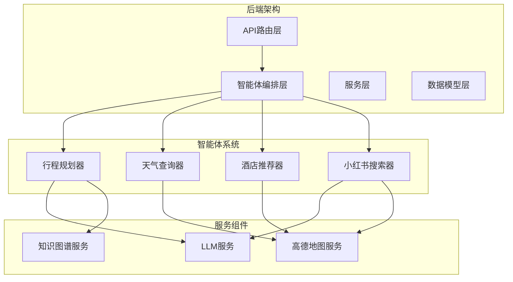

**图表来源**
- [trip_planner_agent.py:173-242](file://backend/app/agents/trip_planner_agent.py#L173-L242)
- [trip.py:13-15](file://backend/app/api/routes/trip.py#L13-L15)

**章节来源**
- [main.py:24-61](file://backend/app/api/main.py#L24-L61)
- [trip.py:17-22](file://backend/app/api/routes/trip.py#L17-L22)

## 核心组件

### 多智能体旅行规划系统

系统的核心是 MultiAgentTripPlanner 类，它协调四个专门的智能体完成旅行规划任务：

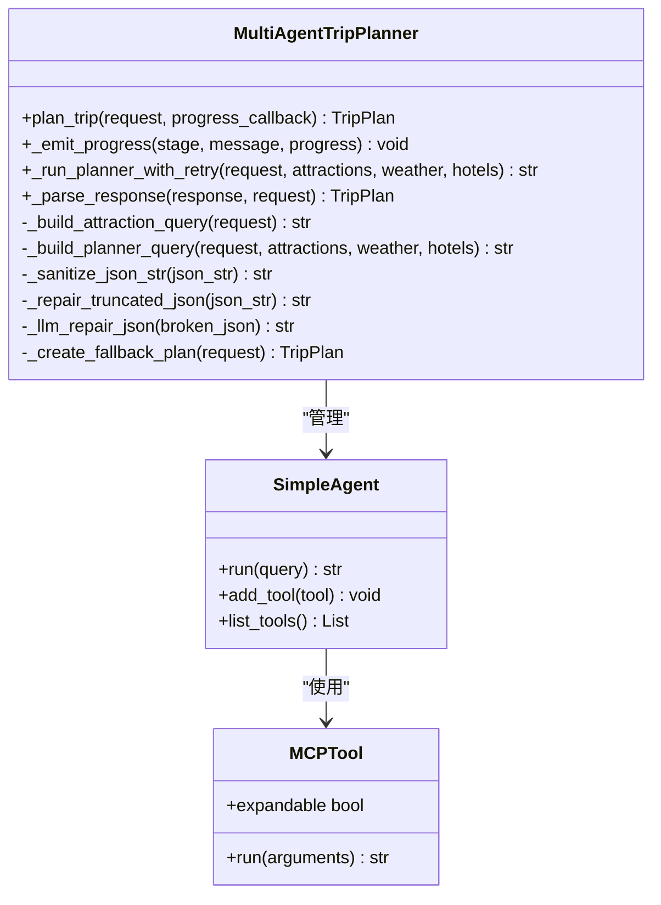

**图表来源**
- [trip_planner_agent.py:173-242](file://backend/app/agents/trip_planner_agent.py#L173-L242)
- [trip_planner_agent.py:257-338](file://backend/app/agents/trip_planner_agent.py#L257-L338)

### 四阶段工作流程

系统采用分阶段的智能体协作模式，每个阶段都有明确的职责和输出：

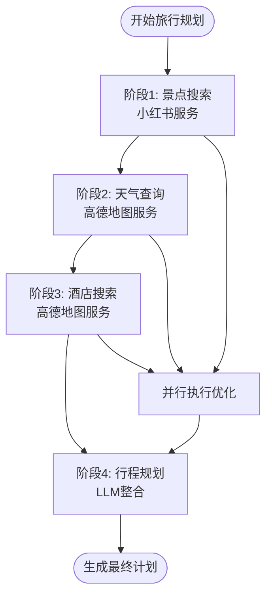

**图表来源**
- [trip_planner_agent.py:284-323](file://backend/app/agents/trip_planner_agent.py#L284-L323)

**章节来源**
- [trip_planner_agent.py:173-338](file://backend/app/agents/trip_planner_agent.py#L173-L338)

## 架构概览

### 系统架构图

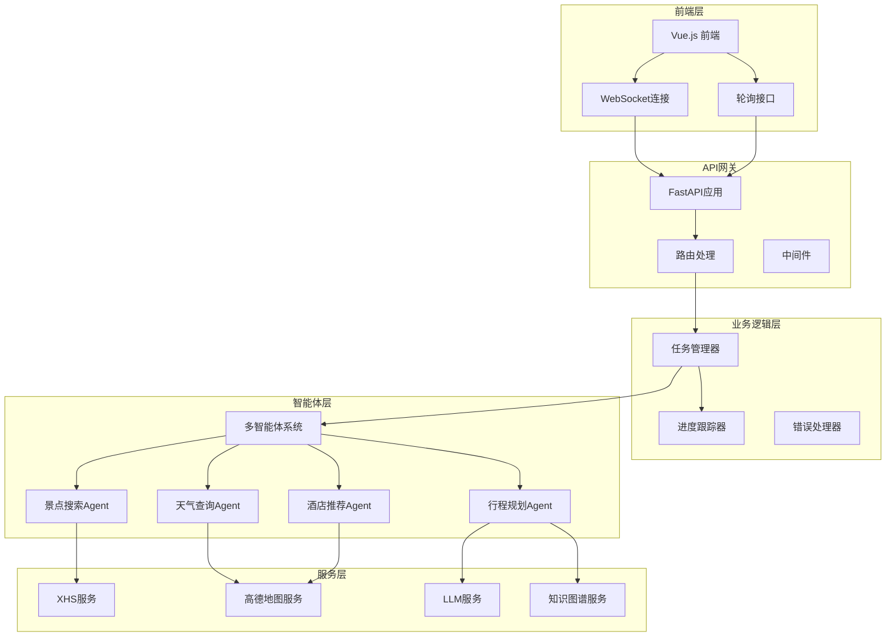

**图表来源**
- [trip.py:276-388](file://backend/app/api/routes/trip.py#L276-L388)
- [trip_planner_agent.py:173-242](file://backend/app/agents/trip_planner_agent.py#L173-L242)

### 数据流架构

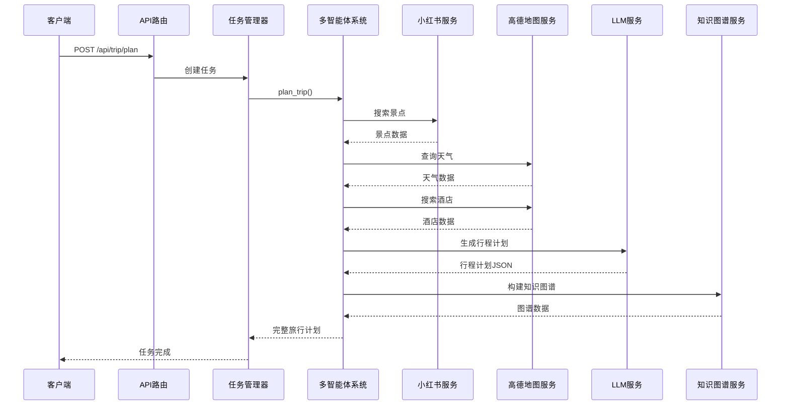

**图表来源**
- [trip.py:315-363](file://backend/app/api/routes/trip.py#L315-L363)
- [trip_planner_agent.py:317-326](file://backend/app/agents/trip_planner_agent.py#L317-L326)

## 详细组件分析

### 智能体协作机制

#### 景点搜索智能体

景点搜索智能体使用小红书服务获取真实的旅行体验数据：

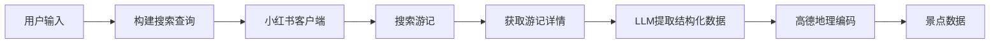

**图表来源**
- [xhs_service.py:247-354](file://backend/app/services/xhs_service.py#L247-L354)

#### 天气查询智能体

天气查询智能体通过高德地图API获取准确的天气信息：

**章节来源**
- [trip_planner_agent.py:38-59](file://backend/app/agents/trip_planner_agent.py#L38-L59)
- [amap_service.py:93-121](file://backend/app/services/amap_service.py#L93-L121)

#### 酒店推荐智能体

酒店推荐智能体同样使用高德地图服务获取酒店信息：

**章节来源**
- [trip_planner_agent.py:61-80](file://backend/app/agents/trip_planner_agent.py#L61-L80)
- [amap_service.py:57-92](file://backend/app/services/amap_service.py#L57-L92)

#### 行程规划智能体

行程规划智能体负责整合所有信息生成最终的旅行计划：

**章节来源**
- [trip_planner_agent.py:82-170](file://backend/app/agents/trip_planner_agent.py#L82-L170)
- [trip_planner_agent.py:389-422](file://backend/app/agents/trip_planner_agent.py#L389-L422)

### 并发优化策略

系统采用混合并发策略，在不同层次实现优化：

```mermaid
graph TB
subgraph "并发策略"
Level1[阶段内并发<br/>步骤1-3并行]
Level2[阶段间串行<br/>步骤4依赖]
Level3[异步线程池<br/>IO密集操作]
end
subgraph "优化效果"
T1[传统串行时间<br/>T1+T2+T3]
T2[优化后时间<br/>max(T1,T2,T3)]
Speedup[性能提升<br/>约3倍]
end
Level1 --> T2
Level2 --> T2
Level3 --> T2
T2 --> Speedup
```

**图表来源**
- [trip_planner_agent.py:265-267](file://backend/app/agents/trip_planner_agent.py#L265-L267)

### 任务进度管理

系统实现了完整的任务进度跟踪机制：

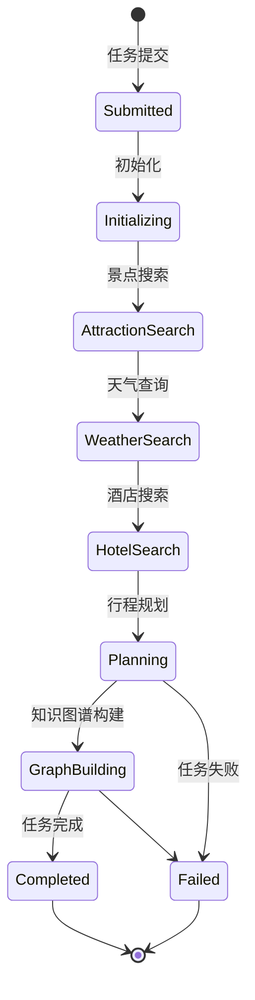

**图表来源**
- [trip.py:25-38](file://backend/app/api/routes/trip.py#L25-L38)

**章节来源**
- [trip.py:327-334](file://backend/app/api/routes/trip.py#L327-L334)
- [trip_planner_agent.py:243-256](file://backend/app/agents/trip_planner_agent.py#L243-L256)

### 智能体间依赖关系

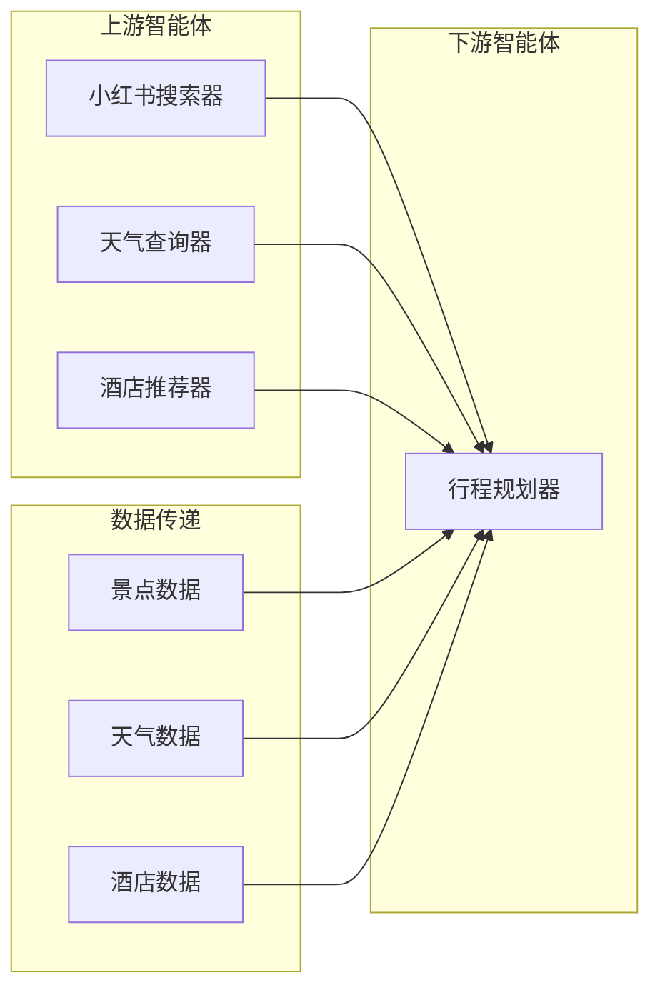

**图表来源**
- [trip_planner_agent.py:287-322](file://backend/app/agents/trip_planner_agent.py#L287-L322)

**章节来源**
- [trip_planner_agent.py:317-326](file://backend/app/agents/trip_planner_agent.py#L317-L326)

### 错误恢复策略

系统实现了多层次的错误处理和恢复机制：

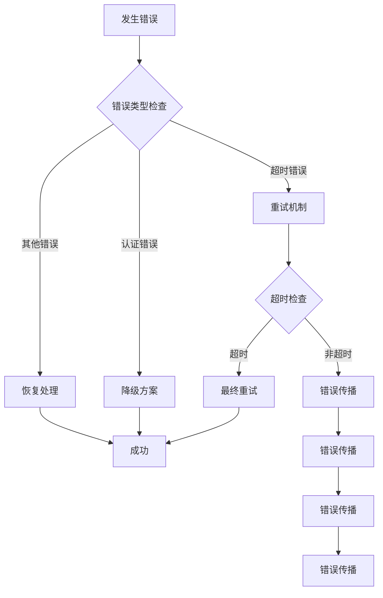

**图表来源**
- [trip_planner_agent.py:361-387](file://backend/app/agents/trip_planner_agent.py#L361-L387)

**章节来源**
- [trip_planner_agent.py:354-387](file://backend/app/agents/trip_planner_agent.py#L354-L387)
- [xhs_service.py:22-25](file://backend/app/services/xhs_service.py#L22-L25)

## 依赖关系分析

### 组件耦合度分析

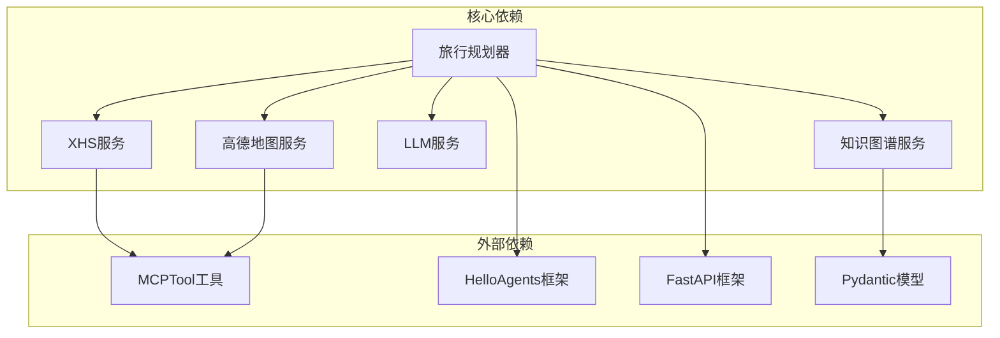

**图表来源**
- [trip_planner_agent.py:8-11](file://backend/app/agents/trip_planner_agent.py#L8-L11)
- [amap_service.py:4-6](file://backend/app/services/amap_service.py#L4-L6)

### 数据模型依赖

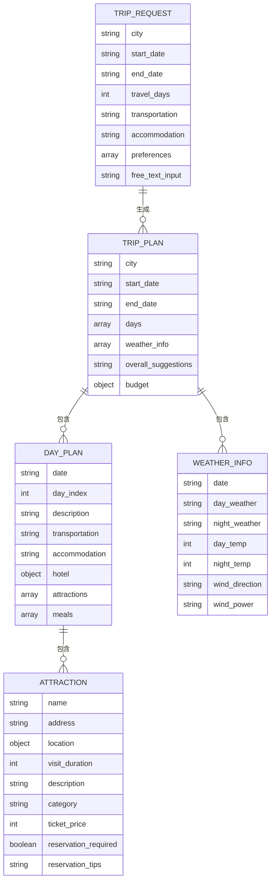

**图表来源**
- [schemas.py:10-154](file://backend/app/models/schemas.py#L10-L154)

**章节来源**
- [schemas.py:10-264](file://backend/app/models/schemas.py#L10-L264)

## 性能考虑

### 并发执行策略

系统通过异步并发优化显著提升了处理性能：

- **阶段内并行**：步骤1-3（景点搜索、天气查询、酒店搜索）使用 `asyncio.to_thread` 实现并行执行
- **阶段间串行**：步骤4（行程规划）保持串行以确保数据依赖关系
- **线程池管理**：避免多个线程同时启动 uvx 子进程导致的资源竞争

### 超时和重试机制

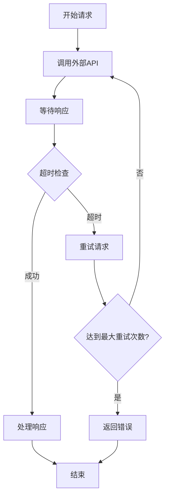

**图表来源**
- [trip_planner_agent.py:362-387](file://backend/app/agents/trip_planner_agent.py#L362-L387)

### 内存和资源管理

- **单例模式**：智能体和LLM服务采用单例模式减少内存占用
- **任务持久化**：使用本地文件系统持久化任务状态
- **资源清理**：服务重启时自动清理未完成的任务

## 故障排除指南

### 常见错误类型及解决方案

| 错误类型 | 触发条件 | 解决方案 |
|---------|---------|---------|
| 小红书Cookie过期 | XHS_COOKIE失效或风控拦截 | 更新Cookie配置，重新登录小红书 |
| 高德API Key无效 | VITE_AMAP_WEB_KEY未配置 | 在前端设置页配置有效的高德地图API Key |
| LLM API Key错误 | OPENAI_API_KEY配置错误 | 检查并更新LLM服务的API密钥 |
| 网络超时 | 外部服务响应慢 | 增加超时时间，检查网络连接 |
| JSON解析失败 | LLM输出格式不规范 | 检查提示词，启用自动修复机制 |

### 调试和监控

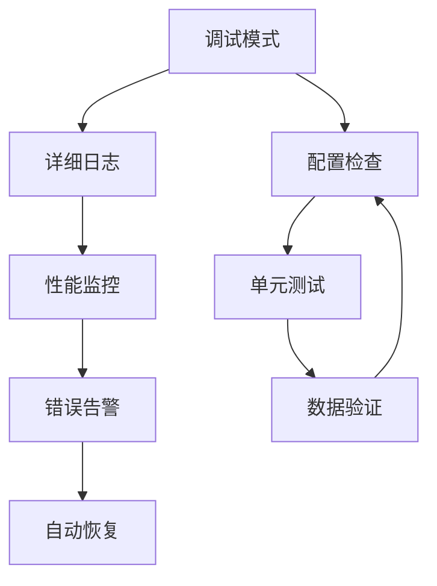

**图表来源**
- [config.py:162-179](file://backend/app/config.py#L162-L179)

**章节来源**
- [trip.py:365-387](file://backend/app/api/routes/trip.py#L365-L387)
- [xhs_service.py:134-141](file://backend/app/services/xhs_service.py#L134-L141)

### 任务状态查询

系统提供了多种方式查询任务执行状态：

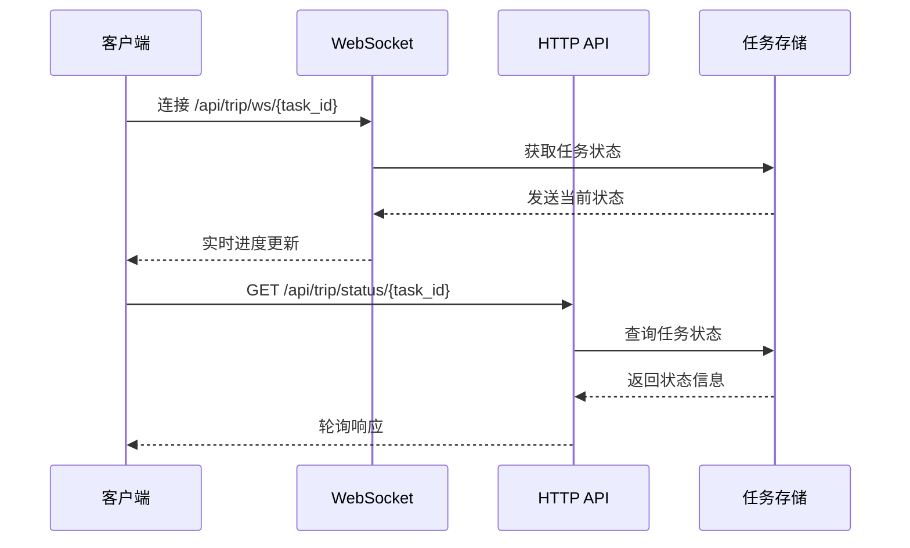

**图表来源**
- [trip.py:390-440](file://backend/app/api/routes/trip.py#L390-L440)
- [trip.py:455-488](file://backend/app/api/routes/trip.py#L455-L488)

## 结论

TripStar 项目的 Workflow 编排系统展现了现代AI应用的最佳实践，通过精心设计的多智能体协作架构实现了高效、可靠的旅行规划服务。系统的主要优势包括：

### 核心优势

1. **高效的并发处理**：通过阶段内并行和阶段间串行的混合策略，显著提升了整体性能
2. **完善的错误处理**：多层次的容错机制确保系统的稳定性和可靠性
3. **实时进度跟踪**：基于WebSocket的实时状态推送提供了优秀的用户体验
4. **可扩展的架构**：模块化设计支持功能扩展和定制需求

### 技术创新

- **智能体协作模式**：四个专门的智能体各司其职，实现了专业化的任务分工
- **渐进式JSON修复**：多层容错修复机制提高了数据解析的成功率
- **知识图谱集成**：将旅行计划转换为可视化知识图谱，增强了用户体验

### 应用价值

该系统不仅为用户提供了高质量的旅行规划服务，还为类似的应用开发提供了宝贵的参考模板，展示了如何在实际生产环境中实现复杂的AI工作流程编排。

通过持续的优化和扩展，TripStar系统有望成为智能旅行服务领域的标杆产品，为用户提供更加智能化、个性化的旅行规划体验。