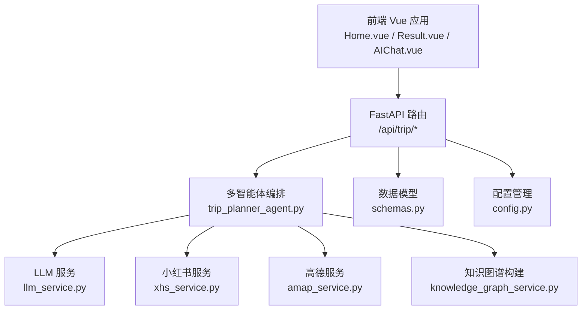
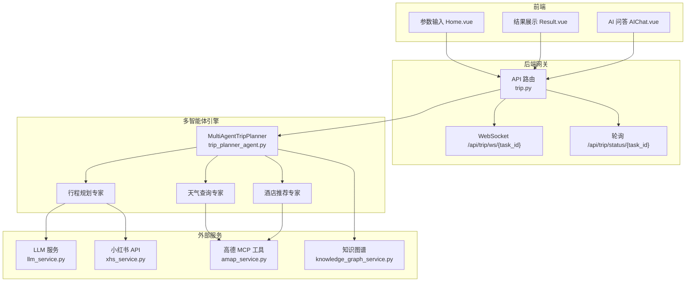
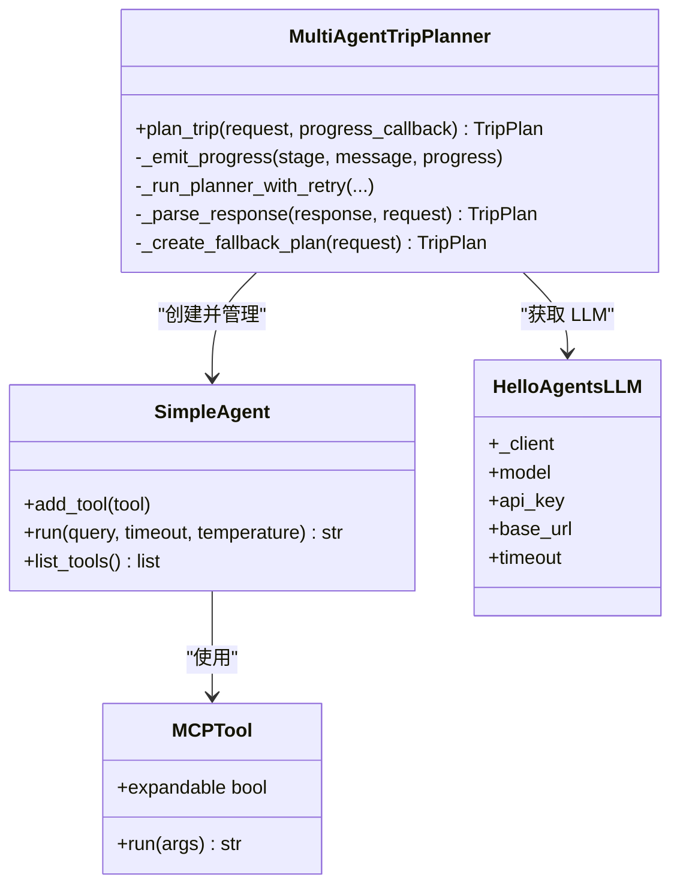
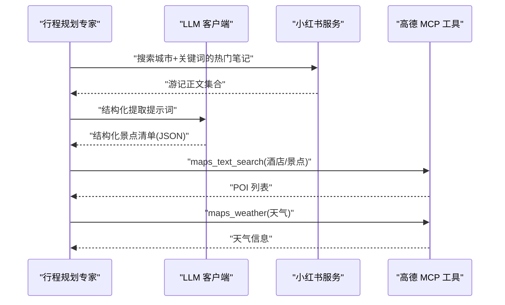
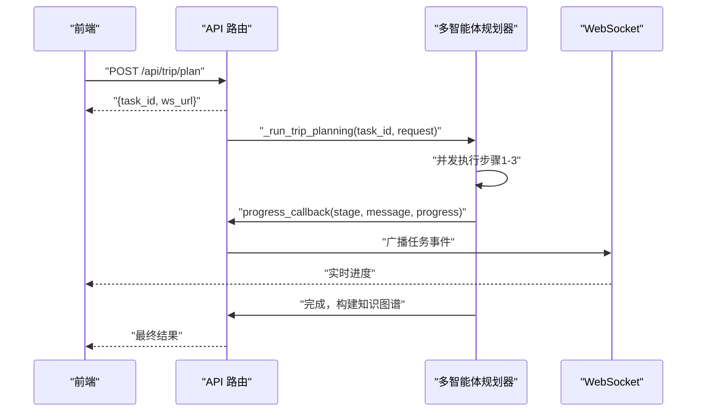
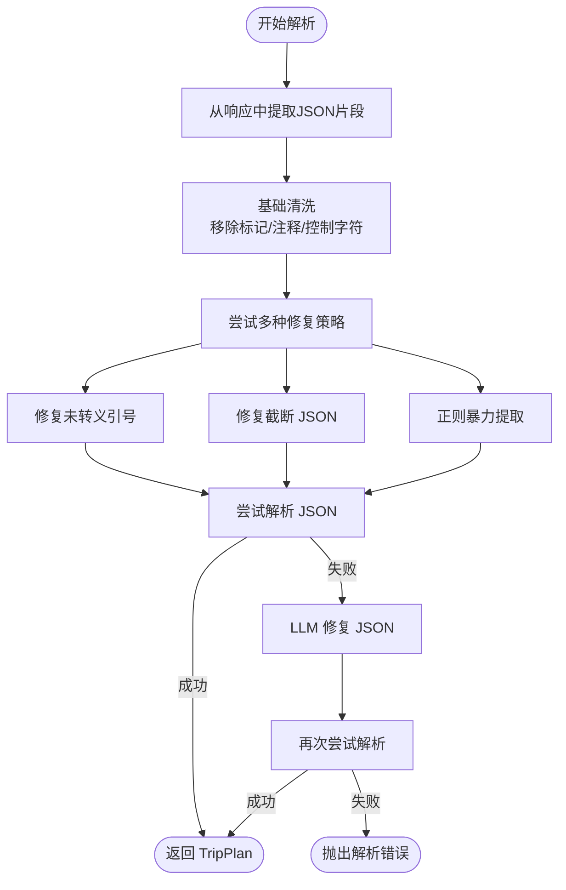
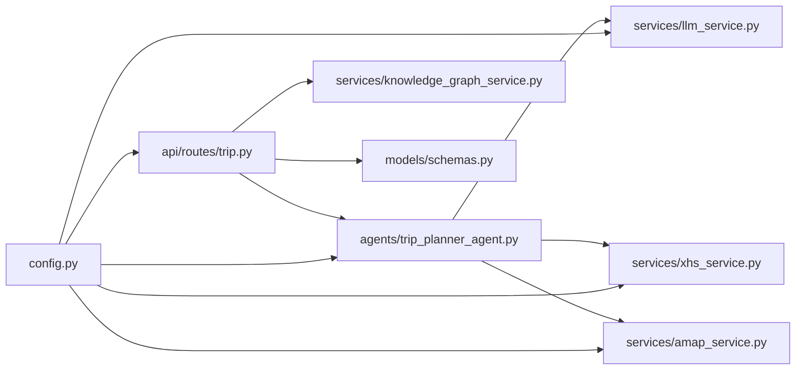

# 多智能体系统

<cite>
**本文档引用的文件**
- [README.md](file://README.md)
- [trip_planner_agent.py](file://backend/app/agents/trip_planner_agent.py)
- [amap_service.py](file://backend/app/services/amap_service.py)
- [xhs_service.py](file://backend/app/services/xhs_service.py)
- [llm_service.py](file://backend/app/services/llm_service.py)
- [schemas.py](file://backend/app/models/schemas.py)
- [main.py](file://backend/app/api/main.py)
- [trip.py](file://backend/app/api/routes/trip.py)
- [config.py](file://backend/app/config.py)
- [knowledge_graph_service.py](file://backend/app/services/knowledge_graph_service.py)
- [Home.vue](file://frontend/src/views/Home.vue)
- [Result.vue](file://frontend/src/views/Result.vue)
- [AIChat.vue](file://frontend/src/components/AIChat.vue)
</cite>

## 目录
1. [简介](#简介)
2. [项目结构](#项目结构)
3. [核心组件](#核心组件)
4. [架构总览](#架构总览)
5. [详细组件分析](#详细组件分析)
6. [依赖分析](#依赖分析)
7. [性能考量](#性能考量)
8. [故障排查指南](#故障排查指南)
9. [结论](#结论)
10. [附录](#附录)

## 简介
本项目基于 HelloAgents 框架构建的多智能体协作文旅规划平台，围绕旅行规划任务，通过“小红书 + 高德地图 + LLM”的组合实现从信息采集、结构化提取、天气与酒店推荐，到行程编排与可视化呈现的全流程自动化。系统采用异步任务与 WebSocket 实时进度推送，前端提供沉浸式 UI 与 AI 问答伴游。

## 项目结构
后端采用 FastAPI + HelloAgents 的分层架构：
- agents：多智能体定义与编排
- services：外部服务封装（小红书、高德、LLM、知识图谱）
- models：Pydantic 数据模型
- api：路由与任务调度
- config：配置管理

图表来源
- [main.py:1-147](file://backend/app/api/main.py#L1-L147)
- [trip.py:1-511](file://backend/app/api/routes/trip.py#L1-L511)
- [trip_planner_agent.py:1-826](file://backend/app/agents/trip_planner_agent.py#L1-L826)
- [llm_service.py:1-75](file://backend/app/services/llm_service.py#L1-L75)
- [xhs_service.py:1-444](file://backend/app/services/xhs_service.py#L1-L444)
- [amap_service.py:1-276](file://backend/app/services/amap_service.py#L1-L276)
- [knowledge_graph_service.py:1-169](file://backend/app/services/knowledge_graph_service.py#L1-L169)
- [schemas.py:1-264](file://backend/app/models/schemas.py#L1-L264)
- [config.py:1-202](file://backend/app/config.py#L1-L202)

章节来源
- [README.md:43-127](file://README.md#L43-L127)
- [main.py:1-147](file://backend/app/api/main.py#L1-L147)
- [trip.py:1-511](file://backend/app/api/routes/trip.py#L1-L511)

## 核心组件
- 多智能体旅行规划器：负责任务拆解、并发执行与结果整合
- LLM 服务：统一的 LLM 客户端封装，支持结构化输出与超时控制
- 小红书服务：原生签名直连 API + SSR 降级，提取结构化景点信息并补全经纬度
- 高德服务：MCPTool 封装，提供 POI、天气、路线、地理编码等工具
- 知识图谱服务：将旅行计划转换为 ECharts 图数据
- API 路由与任务系统：异步任务 + WebSocket 实时进度推送
- 前端组件：参数输入、结果展示、AI 问答伴游

章节来源
- [trip_planner_agent.py:173-826](file://backend/app/agents/trip_planner_agent.py#L173-L826)
- [llm_service.py:12-75](file://backend/app/services/llm_service.py#L12-L75)
- [xhs_service.py:247-444](file://backend/app/services/xhs_service.py#L247-L444)
- [amap_service.py:12-276](file://backend/app/services/amap_service.py#L12-L276)
- [knowledge_graph_service.py:34-169](file://backend/app/services/knowledge_graph_service.py#L34-L169)
- [trip.py:276-511](file://backend/app/api/routes/trip.py#L276-L511)
- [Home.vue:197-371](file://frontend/src/views/Home.vue#L197-L371)
- [Result.vue:569-800](file://frontend/src/views/Result.vue#L569-L800)
- [AIChat.vue:154-249](file://frontend/src/components/AIChat.vue#L154-L249)

## 架构总览
系统采用“前端交互 + 后端 API + 多智能体引擎 + 外部服务”的分层设计。前端通过 WebSocket 或轮询获取任务状态，后端将旅行规划任务异步执行，多智能体并行收集信息，最终生成结构化旅行计划与知识图谱。

图表来源
- [README.md:47-97](file://README.md#L47-L97)
- [trip.py:276-511](file://backend/app/api/routes/trip.py#L276-L511)
- [trip_planner_agent.py:173-339](file://backend/app/agents/trip_planner_agent.py#L173-L339)
- [amap_service.py:12-47](file://backend/app/services/amap_service.py#L12-L47)
- [llm_service.py:12-67](file://backend/app/services/llm_service.py#L12-L67)
- [xhs_service.py:247-354](file://backend/app/services/xhs_service.py#L247-L354)
- [knowledge_graph_service.py:34-169](file://backend/app/services/knowledge_graph_service.py#L34-L169)

## 详细组件分析

### 多智能体旅行规划器（Agent 设计与编排）
- 角色定义
  - 天气查询专家：使用 amap_maps_weather 工具查询天气
  - 酒店推荐专家：使用 amap_maps_text_search 工具搜索酒店
  - 行程规划专家：接收结构化上下文，生成符合约束的旅行计划 JSON
- 工具集成
  - 通过 MCPTool 将高德地图能力注入 Agent，自动展开子工具
  - 小红书服务直接通过线程池调用，避免 Agent 直接依赖外部 API
- 并发与容错
  - 步骤1-3（景点/天气/酒店）并发执行，步骤4（规划）串行
  - 规划阶段支持超时重试与多轮 JSON 修复（正则提取、引号修复、截断修复、LLM 修复）
- 进度回调
  - 通过 progress_callback 将阶段进度上报至 API 层，前端通过 WebSocket 或轮询感知

图表来源
- [trip_planner_agent.py:173-339](file://backend/app/agents/trip_planner_agent.py#L173-L339)
- [trip_planner_agent.py:354-759](file://backend/app/agents/trip_planner_agent.py#L354-L759)
- [llm_service.py:12-67](file://backend/app/services/llm_service.py#L12-L67)
- [amap_service.py:12-47](file://backend/app/services/amap_service.py#L12-L47)

章节来源
- [trip_planner_agent.py:173-339](file://backend/app/agents/trip_planner_agent.py#L173-L339)
- [trip_planner_agent.py:354-759](file://backend/app/agents/trip_planner_agent.py#L354-L759)

### Tool 集成机制（高德地图、小红书、LLM）
- 高德地图 MCPTool
  - 通过 uvx amap-mcp-server 启动工具，自动展开为 maps_text_search、maps_weather、maps_geo 等子工具
  - 服务层提供 AmapService 封装，便于直接调用
- 小红书原生直连
  - 使用本地 JS 签名引擎生成 x-s/x-t/x-s-common 等签名，直连 edith.xiaohongshu.com
  - 支持 SSR 降级，保障稳定性
  - LLM 提纯游记为结构化景点清单，高德地理编码补齐经纬度
- LLM 客户端
  - 统一的 HelloAgentsLLM 封装，支持自定义 User-Agent，规避 WAF 拦截
  - 支持结构化输出与超时控制

图表来源
- [trip_planner_agent.py:294-323](file://backend/app/agents/trip_planner_agent.py#L294-L323)
- [xhs_service.py:247-354](file://backend/app/services/xhs_service.py#L247-L354)
- [amap_service.py:12-47](file://backend/app/services/amap_service.py#L12-L47)
- [llm_service.py:12-67](file://backend/app/services/llm_service.py#L12-L67)

章节来源
- [amap_service.py:12-47](file://backend/app/services/amap_service.py#L12-L47)
- [xhs_service.py:247-354](file://backend/app/services/xhs_service.py#L247-L354)
- [llm_service.py:12-67](file://backend/app/services/llm_service.py#L12-L67)

### Workflow 编排流程（多智能体协同）
- 任务提交：POST /api/trip/plan 立即返回 task_id
- 并发阶段：
  - 步骤1：小红书服务提取结构化景点
  - 步骤2：天气查询专家调用 amap_maps_weather
  - 步骤3：酒店推荐专家调用 amap_maps_text_search
- 串行阶段：
  - 步骤4：行程规划专家整合上下文，生成旅行计划 JSON
  - 步骤5：构建知识图谱
- 进度推送：WebSocket /api/trip/ws/{task_id} 与轮询 /api/trip/status/{task_id}

图表来源
- [trip.py:276-388](file://backend/app/api/routes/trip.py#L276-L388)
- [trip.py:390-440](file://backend/app/api/routes/trip.py#L390-L440)
- [trip.py:455-488](file://backend/app/api/routes/trip.py#L455-L488)
- [trip_planner_agent.py:257-339](file://backend/app/agents/trip_planner_agent.py#L257-L339)

章节来源
- [trip.py:276-488](file://backend/app/api/routes/trip.py#L276-L488)

### 智能体间通信与任务分配
- 通信机制
  - Agent 通过工具调用与外部服务交互，内部通过方法调用传递上下文
  - API 层通过 progress_callback 将阶段进度回传给前端
- 任务分配策略
  - 旅行规划任务分解为“信息收集（并发）+ 结果整合（串行）”
  - 每个 Agent 聚焦单一职责：天气、酒店、景点（小红书）、规划
- 结果整合
  - 行程规划专家负责将多源信息整合为结构化 JSON，并进行严格的数据清洗与修复

章节来源
- [trip_planner_agent.py:284-339](file://backend/app/agents/trip_planner_agent.py#L284-L339)
- [trip.py:315-388](file://backend/app/api/routes/trip.py#L315-L388)

### JSON 解析与容错修复
- 清洗策略
  - 移除代码块标记、JS 注释、控制字符
  - 修复中文引号与全角标点
  - 修复尾部逗号与不完整 JSON
  - 递归修复算术表达式为最终数值
- 修复流程
  - 基础清理 → 引号修复 → 截断修复 → 正则提取 → LLM 修复（最后手段）

图表来源
- [trip_planner_agent.py:650-759](file://backend/app/agents/trip_planner_agent.py#L650-L759)

章节来源
- [trip_planner_agent.py:424-659](file://backend/app/agents/trip_planner_agent.py#L424-L659)

### 知识图谱构建
- 输入：TripPlan
- 输出：ECharts 图数据（节点、边、分类）
- 节点类型：城市、日程、景点、酒店、餐饮、天气、预算、偏好/建议
- 边关系：行程、游览、下一站、入住、早餐/午餐/晚餐、天气、预算、建议

章节来源
- [knowledge_graph_service.py:34-169](file://backend/app/services/knowledge_graph_service.py#L34-L169)

### 前端集成与用户体验
- 参数输入：Home.vue 收集城市、日期、偏好、额外需求，提交后显示进度
- 结果展示：Result.vue 展示概览、预算、地图、每日行程、知识图谱、天气
- AI 问答：AIChat.vue 提供悬浮式伴游问答，基于当前旅行计划上下文

章节来源
- [Home.vue:197-371](file://frontend/src/views/Home.vue#L197-L371)
- [Result.vue:569-800](file://frontend/src/views/Result.vue#L569-L800)
- [AIChat.vue:154-249](file://frontend/src/components/AIChat.vue#L154-L249)

## 依赖分析
- 外部依赖
  - HelloAgents：多智能体框架与工具抽象
  - FastAPI：异步路由与 WebSocket
  - ECharts：知识图谱可视化
  - 高德 MCP Server：地理信息服务
  - 小红书原生 API：内容与图片抓取
- 内部耦合
  - agents 依赖 services（LLM、小红书、高德）
  - api 路由依赖 agents 与 services
  - models 为全栈共享的数据契约
  - config 为全局配置中心

图表来源
- [trip_planner_agent.py:1-12](file://backend/app/agents/trip_planner_agent.py#L1-L12)
- [trip.py:1-17](file://backend/app/api/routes/trip.py#L1-L17)
- [config.py:1-202](file://backend/app/config.py#L1-L202)

章节来源
- [trip_planner_agent.py:1-12](file://backend/app/agents/trip_planner_agent.py#L1-L12)
- [trip.py:1-17](file://backend/app/api/routes/trip.py#L1-L17)
- [config.py:1-202](file://backend/app/config.py#L1-L202)

## 性能考量
- 并发优化
  - 步骤1-3 并发执行，显著缩短总耗时
  - 使用 asyncio.to_thread 将阻塞 IO（小红书/高德）放入线程池
- 超时与重试
  - 规划阶段支持超时重试，必要时追加“保守补齐”提示
  - LLM 客户端设置合理超时，避免长时间阻塞
- JSON 解析优化
  - 多轮修复策略减少失败率，降低前端重试成本
- 前端体验
  - WebSocket 实时进度 + 轮询兼容，保障弱网环境体验
  - 知识图谱与地图按需渲染，避免一次性加载过多数据

章节来源
- [trip_planner_agent.py:264-387](file://backend/app/agents/trip_planner_agent.py#L264-L387)
- [llm_service.py:42-61](file://backend/app/services/llm_service.py#L42-L61)
- [trip.py:315-388](file://backend/app/api/routes/trip.py#L315-L388)

## 故障排查指南
- 常见问题
  - 小红书 Cookie 失效：触发 XHSCookieExpiredError，API 层将其转换为友好错误消息
  - 高德 API Key 未配置：服务初始化时报错或功能受限
  - LLM 超时：规划阶段自动重试一次，必要时使用 LLM 修复 JSON
  - WebSocket 断开：前端回退轮询 /api/trip/status/{task_id}
- 排查步骤
  - 检查 /api/trip/health 与 /api/health 确认服务可用
  - 查看后端日志与任务持久化文件（data/trip_tasks）
  - 确认环境变量（VITE_AMAP_WEB_KEY、XHS_COOKIE、LLM 相关）已正确配置

章节来源
- [trip.py:365-388](file://backend/app/api/routes/trip.py#L365-L388)
- [config.py:162-180](file://backend/app/config.py#L162-L180)

## 结论
本项目通过 HelloAgents 框架实现了多智能体的清晰分工与高效协作，结合小红书与高德的真实数据，配合 LLM 的结构化输出能力，完成了从信息采集到结果可视化的完整闭环。异步任务与 WebSocket 的引入提升了用户体验，JSON 容错修复机制增强了鲁棒性。未来可在 Google Map 接入、模型国际化、历史计划导入等方面持续演进。

## 附录

### 如何创建新的智能体
- 定义 Agent
  - 参考现有提示词模板，编写系统提示（system_prompt）
  - 为 Agent 绑定所需工具（MCPTool 或自定义服务）
- 注册与使用
  - 在 MultiAgentTripPlanner.__init__ 中创建并添加工具
  - 在 plan_trip 中按需调用 Agent.run 并传入上下文

章节来源
- [trip_planner_agent.py:173-242](file://backend/app/agents/trip_planner_agent.py#L173-L242)

### 如何注册工具
- 高德 MCPTool
  - 在配置中设置 AMAP_MAPS_API_KEY
  - 通过 MCPTool(name="amap", ...) 创建实例并设置 auto_expand=True
- 小红书工具
  - 通过 xhs_service 提供的 get_xhs_client 与搜索/详情接口使用
- LLM 工具
  - 通过 llm_service.get_llm 获取统一客户端

章节来源
- [amap_service.py:12-47](file://backend/app/services/amap_service.py#L12-L47)
- [xhs_service.py:192-199](file://backend/app/services/xhs_service.py#L192-L199)
- [llm_service.py:12-67](file://backend/app/services/llm_service.py#L12-L67)

### 如何编排工作流程
- 任务提交
  - POST /api/trip/plan 返回 task_id
- 实时监控
  - WebSocket /api/trip/ws/{task_id} 或轮询 /api/trip/status/{task_id}
- 结果获取
  - 完成后在 /api/trip/status/{task_id} 获取 TripPlanResponse，包含 data 与 graph_data

章节来源
- [trip.py:276-488](file://backend/app/api/routes/trip.py#L276-L488)